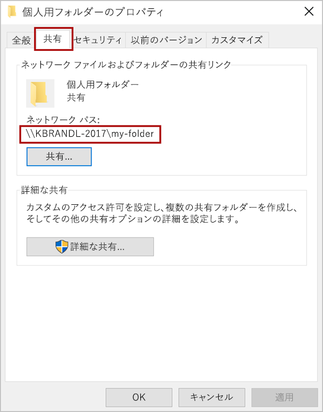

# テスト用に Office アドインをサイドロードする

マニフェストをネットワーク ファイル共有に公開することで、Windows 上で実行されている Office クライアントにテスト用の Office アドインをインストールできます (以下の手順)。

> [!NOTE]
> アドイン プロジェクトを [**yo office** ツール](https://github.com/OfficeDev/generator-office)とともにを作成した場合、動作するようにサイドロードする別の方法があります。詳細については、 [sideload コマンドを使用するSideload Office アドイン ](sideload-office-addin-using-sideload-command.md)参照してください。

この資料は、Word、Excel、または PowerPoint のアドインの Windows のテストにのみ適用されます。Outlook のアドインをテストするのには別のプラットフォーム上でテストする場合は、アドインをサイドロードするの 次のトピックのいずれかを参照してください。

- [テスト用に Office Online で Office アドインをサイドロードする](sideload-office-add-ins-for-testing.md)
- [テスト用に iPad と Mac で Office アドインをサイドロードする](sideload-an-office-add-in-on-ipad-and-mac.md)
- [テスト用に Outlook アドインをサイドロードする](https://docs.microsoft.com/outlook/add-ins/sideload-outlook-add-ins-for-testing)

次のビデオでは、共有フォルダ カタログを使用して Office デスクトップまたは Office Online のアドインをサイドロードする手順を説明します。  

> [!VIDEO https://www.youtube.com/embed/XXsAw2UUiQo]

## フォルダーの共有

1. アドインをホストさせようとしている Windows コンピューターで、共有フォルダー カタログとして使用するつもりのフォルダーの親フォルダーまたはドライブ文字に移動します。

2. 共有フォルダー (フォルダーを右クリック) カタログとして使用したいフォルダをコンテキスト メニューから開き、 **プロパティ**を選択します。

3.  **[プロパティ]**  ダイアログ ウィンドウ内で  **[共有]**  タブを開き、 **[共有]** ボタンを選択します。

    ![[フォルダー プロパティ] ダイアログ ボックス、[共有] タブと[共有] ボタンが強調表示されます。](../images/sideload-windows-properties-dialog.png)

4.  **ネットワーク アクセス** のダイアログ ウィンドウ内で、アドインを共有したい、他のユーザーおよび/またはグループと自分を追加します。 少なくとも、フォルダーへの**読み取り/書き込み**アクセス許可が必要です。 共有するユーザーを選択したら、 **[共有]** ボタンを選択します。

5.  **フォルダーが共有されました**の確認が表示されたら、フォルダー名の直後に表示される完全なネットワーク パスのメモを作成します。 (この資料の次のセクションで説明されているように 、この値を入力する必要とする [信頼できるカタログとして共有フォルダーを指定する場合、](#specify-the-shared-folder-as-a-trusted-catalog)**カタログの Url** としてこの値を入力する必要があります。) **ネットワーク アクセス** のダイアログ ウィンドウを閉じるには、[ **完了** ] を選択します。

   

6.  **[プロパティ** ] ダイアログ ウィンドウを閉じるには、 [ **閉じる** ] ボタンを選択します。

## 信頼できるカタログとしてその共有フォルダーを指定します。
      
1. Excel、Word、または PowerPoint で新しいドキュメントを開きます。
    
2. **[ファイル]** タブを選択して、**[オプション]** を選択します。
    
3. [**セキュリティ センター**] を選択し、[**セキュリティ センターの設定**] ボタンを選択します。
    
4. **[信頼されているアドイン カタログ]** を選びます。
    
5.  **[カタログの Url]**  ボックスで、以前に[共有](#share-a-folder) したフォルダーの完全なネットワーク パスを入力します。 フォルダーを共有するときにフォルダーの完全なネットワーク パスをメモしていなかった場合に、フォルダーの **[プロパティ]**  ダイアログ ウィンドウで、次のスクリーン ショットが示すように操作して得ることができます。 

    
    
6.  **カタログの Url** ] ボックスに、フォルダーの完全なネットワーク パスを入力した後に、 **［カタログの追加]**  ボタンを選択します。

7. 新しく追加した項目の **[メニューに表示する]** ]チェック ボックスを選択し、 [ **OK** ] ボタンを選択して、[ **セキュリティ センター** ] ダイアログ ウィンドウを閉じます。 

    ![カタログが選択されている[トラスト センター] ダイアログ ボックス](../images/sideload-windows-trust-center-dialog.png)

8. [ **OK** ] ボタンを選択して、[ **Word のオプション** ] ダイアログ ウィンドウを閉じます

9. Office アプリケーションを閉じるて再度開くと、変更内容が有効になります。
    

## アドインのサイドロード

1. テストするアドインのマニフェスト XMLファイルを共有フォルダー カタログに置きます。 Web サーバーに web application自体を展開することに注意してください。  **SourceLocation** 要素マニフェスト ファイルの URL を指定することを確認します。

    > [!IMPORTANT]
    > [!include[HTTPS guidance](../includes/https-guidance.md)]

2. Excel、Word、または PowerPoint で、リボンの **[挿入]** タブにある **[個人用アドイン]** を選びます。

3. **[Office アドイン]** ダイアログ ボックスの上部にある **[共有フォルダー]** を選びます。

4. アドインの名前を選び、**[OK]** を選択して、アドインを挿入します。

## 関連項目

- [マニフェストの問題を検証し、トラブルシューティングを行う](troubleshoot-manifest.md)
- [Office アドインを発行する](../publish/publish.md)
    
