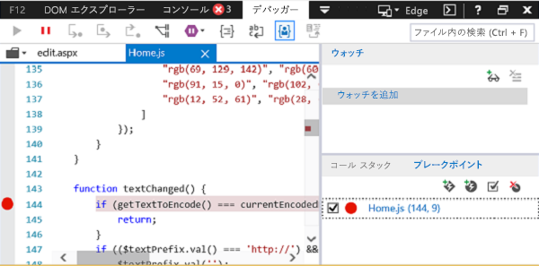

# Windows 10 で開発者ツールを使用してアドインをデバッグする

Windows 10 のアドインのデバッグに役立つ IDE の外部の開発者ツールがあります。 これは、IDE の外部でアドインを実行しているときに問題を調査する必要がある場合に便利です。

使用するツールは、アドインが Edge または Internet Explorer のどちらで実行されているかによって異なります。 これは、Windows 10 のバージョンとコンピューターにインストールされている Office のバージョンによって決まります。 開発用コンピューターで使用されているブラウザーを確認するには、「[Office アドインによって使用されるブラウザー](../concepts/browsers-used-by-office-web-add-ins.md)」を参照してください。 

> [!NOTE]
> この記事の手順を使用して、実行関数を使用する Outlook アドインをデバッグすることはできません。 実行関数を使用する Outlook アドインのデバッグには、スクリプト モードの Visual Studio またはその他のスクリプト デバッガーにアタッチすることをお勧めします。

## アドインが Edge で実行されている場合

アドインが Edge で実行されている場合は、[Microsoft Edge DevTools](https://www.microsoft.com/p/microsoft-edge-devtools-preview/9mzbfrmz0mnj?activetab=pivot%3Aoverviewtab) を使用できます。 

1. アドインを実行します。 

2. Microsoft Edge DevTools を実行します。

3. ツールで、**[ローカル]** タブを開きます。アドインの名前が一覧表示されます。

4. アドイン名をクリックして、ツールで開きます。

5. **[デバッガー]** タブを開きます。 

6. **[スクリプト]** (左側) ウィンドウの上にあるフォルダー アイコンを選択します。 ドロップダウン リストに表示される利用可能なファイルのリストから、デバッグする JavaScript ファイルを選択します。

7. ブレークポイントを設定するには、行を選択します。 その行の左側と **[呼び出し履歴]** (右下) ウィンドウの対応する行に赤い点が表示されます。

8. 必要に応じてアドインの関数を実行して、ブレークポイントをトリガーします。

## アドインが Internet Explorer で実行されている場合

Internet Explorer でアドインを実行している場合は、Windows 10 の F12 開発者ツールのデバッガーを使用して、アドインをテストできます。 アドインの実行後、F12 開発者ツールを起動できます。 F12 ツールは個別のウィンドウに表示され、Visual Studio を使用しません。

> [!NOTE]
> デバッガーは、Windows 10 および Internet Explorer 上の F12 開発者ツールの一部です。Windows の以前のバージョンにはデバッガーは含まれません。 

次の例では、AppSource から Word と無料のアドインを使用します。

1. Word を起動し、空白の文書を選択します。 
    
2. アドイン グループの [**挿入**] タブで、[**ストア**]、[**QR4Office**] アドインの順に選択します  (ストアやアドイン カタログから、任意のアドインを読み込むことができます)。
    
3. ご利用の Office のバージョンに対応する F12 開発者ツールを起動します。
    
   - 32 ビット版の Office の場合は、C:\Windows\System32\F12\IEChooser.exe を使用します
    
   - 64 ビット版の Office の場合は、C:\Windows\SysWOW64\F12\IEChooser.exe を使用します
    
   IEChooser を起動すると、[デバッグするターゲットの選択] という名前の別ウィンドウに、デバッグ可能なアプリケーションが表示されます。 関心があるアプリケーションを選択します。 独自のアドインを記述している場合、アドインを展開した Web サイトを選択します。これは、localhost の URL である可能性があります。 
    
   たとえば、**home.html** を選択します。 
    
   

4. F12 ウィンドウで、デバッグするファイルを選択します。
    
   F12 ウィンドウのファイルを選択するには、**スクリプト** (左側) ウィンドウの上にあるフォルダー アイコンを選びます。 ドロップダウン リストに表示される利用可能なファイルのリストから [**Home.js**] を選択します。
    
5. ブレークポイントを設定します。
    
   **Home.js** にブレークポイントを設定するために、`textChanged` 関数内の行 144 を選択します。 その行の左側と **[呼び出し履歴] と [ブレークポイント]** (右下) ウィンドウの対応する行に赤い点が表示されます。 ブレークポイントを設定するその他の方法については、「[デバッガーを使用して実行中の JavaScript を検査する](/previous-versions/windows/internet-explorer/ie-developer/samples/dn255007(v=vs.85))」を参照してください。 
    
   

6. アドインを実行して、ブレークポイントをトリガーします。
    
   Word で、[**QR4Office**] ウィンドウの上部にある [URL] テキスト ボックスを選択して、テキストを入力してみます。 デバッガー内の **[呼び出し履歴] と [ブレークポイント]** ウィンドウで、ブレークポイントがトリガーされ、さまざまな情報が表示されることがわかります。 結果を確認するには、デバッガーの更新が必要な場合があります。
    
   

## 関連項目

- [デバッガーを使用して実行中の JavaScript を検査する](/previous-versions/windows/internet-explorer/ie-developer/samples/dn255007(v=vs.85))
- 
  [F12 開発者ツールの使用](/previous-versions/windows/internet-explorer/ie-developer/samples/bg182326(v=vs.85))
