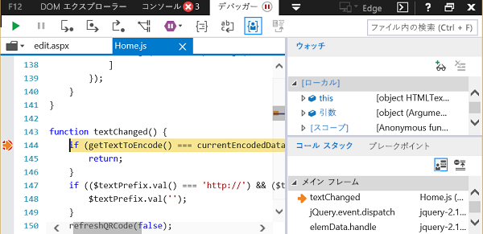

# Windows 10 で開発者ツールを使用してアドインをデバッグするDebug add-ins using developer tools on Windows 10

Windows 10 のアドインのデバッグに役立つ IDE の外部の開発者ツールがあります。There are developer tools outside of IDEs available to help you debug your add-ins on Windows 10. これは、IDE の外部でアドインを実行しているときに問題を調査する必要がある場合に便利です。These are useful when you need to investigate a problem while running your add-in outside the IDE.

使用するツールは、アドインが Microsoft Edge または Internet Explorer のどちらで実行されているかによって異なります。The tool that you use depends on whether the add-in is running in Microsoft Edge or Internet Explorer. これは、Windows 10 のバージョンとコンピューターにインストールされている Office のバージョンによって決まります。This is determined by the version of Windows 10 and the version of Office that are installed on the computer. 開発用コンピューターで使用されているブラウザーを確認するには、「[Office アドインによって使用されるブラウザー](../concepts/browsers-used-by-office-web-add-ins.md)」を参照してください。To determine which browser is being used on your development computer, see [Browsers used by Office Add-ins](../concepts/browsers-used-by-office-web-add-ins.md).

> [!NOTE]
> この記事の手順を使用して、実行関数を使用する Outlook アドインをデバッグすることはできません。The instructions in this article cannot be used to debug an Outlook add-in that uses Execute Functions. 実行関数を使用する Outlook アドインのデバッグには、スクリプト モードの Visual Studio またはその他のスクリプト デバッガーにアタッチすることをお勧めします。To debug an Outlook add-in that uses Execute Functions, we recommend that you attach to Visual Studio in script mode or to some other script debugger.

## アドインが Microsoft Edge で実行されている場合When the add-in is running in Microsoft Edge

[!include[Enable debugging on Microsoft Edge DevTools](../includes/enable-debugging-on-edge-devtools.md)]

### Microsoft Edge DevTools を使用してデバッグするDebug using Microsoft Edge DevTools

アドインが Microsoft Edge で実行されている場合は、[Microsoft Edge DevTools](https://www.microsoft.com/p/microsoft-edge-devtools-preview/9mzbfrmz0mnj?activetab=pivot%3Aoverviewtab) を使用できます。When the add-in is running in Microsoft Edge, you can use the [Microsoft Edge DevTools](https://www.microsoft.com/p/microsoft-edge-devtools-preview/9mzbfrmz0mnj?activetab=pivot%3Aoverviewtab).

1. アドインを実行します。Run the add-in.

2. Microsoft Edge DevTools を実行します。Run the Microsoft Edge DevTools.

3. ツールで、**[ローカル]** タブを開きます。アドインの名前が一覧表示されます。In the tools, open the **Local** tab. Your add-in will be listed by its name.

4. アドイン名をクリックして、ツールで開きます。Click the add-in name to open it in the tools.

5. **[デバッガー]** タブを開きます。Open the **Debugger** tab. 

6. **[スクリプト]** (左側) ウィンドウの上にあるフォルダー アイコンを選択します。Choose the folder icon above the **script** (left) pane. ドロップダウン リストに表示される利用可能なファイルのリストから、デバッグする JavaScript ファイルを選択します。From the list of available files shown in the dropdown list, select the JavaScript file that you want to debug.

7. ブレークポイントを設定するには、行を選択します。To set a breakpoint, select the line. その行の左側と **[呼び出し履歴]** (右下) ウィンドウの対応する行に赤い点が表示されます。You will see a red dot to the left of the line and a corresponding line in the **Call stack** (bottom right) pane.

8. 必要に応じてアドインの関数を実行して、ブレークポイントをトリガーします。Execute functions in the add-in as needed to trigger the breakpoint.

## アドインが Internet Explorer で実行されている場合When the add-in is running in Internet Explorer

Internet Explorer でアドインを実行している場合は、Windows 10 の F12 開発者ツールのデバッガーを使用して、アドインをテストできます。When the add-in is running in Internet Explorer, you can use the debugger from the F12 developer tools in Windows 10 to test your add-in. アドインの実行後、F12 開発者ツールを起動できます。You can start the F12 developer tools after the add-in is running. F12 ツールは個別のウィンドウに表示され、Visual Studio を使用しません。The F12 tools are displayed in a separate window and do not use Visual Studio.

> [!NOTE]
> デバッガーは、Windows 10 および Internet Explorer 上の F12 開発者ツールの一部です。Windows の以前のバージョンにはデバッガーは含まれません。The Debugger is part of the F12 developer tools in Windows 10 and Internet Explorer. Earlier versions of Windows do not include the Debugger. 

次の例では、AppSource から Word と無料のアドインを使用します。This example uses Word and a free add-in from AppSource.

1. Word を起動し、空白の文書を選択します。Open Word and choose a blank document. 
    
2. アドイン グループの [**挿入**] タブで、[**ストア**]、[**QR4Office**] アドインの順に選択します On the **Insert** tab, in the Add-ins group, choose **Store** and select the **QR4Office** Add-in. (ストアやアドイン カタログから、任意のアドインを読み込むことができます)。(You can load any add-in from the Store or your add-in catalog.)
    
3. ご利用の Office のバージョンに対応する F12 開発者ツールを起動します。Launch the F12 development tools that corresponds to your version of Office:
    
   - 32 ビット版の Office の場合は、C:\Windows\System32\F12\IEChooser.exe を使用しますFor the 32-bit version of Office, use C:\Windows\System32\F12\IEChooser.exe
    
   - 64 ビット版の Office の場合は、C:\Windows\SysWOW64\F12\IEChooser.exe を使用しますFor the 64-bit version of Office, use C:\Windows\SysWOW64\F12\IEChooser.exe
    
   IEChooser を起動すると、[デバッグするターゲットの選択] という名前の別ウィンドウに、デバッグ可能なアプリケーションが表示されます。When you launch IEChooser, a separate window named "Choose target to debug" displays the possible applications to debug. 関心があるアプリケーションを選択します。Select the application that you are interested in. 独自のアドインを記述している場合、アドインを展開した Web サイトを選択します。これは、localhost の URL である可能性があります。If you are writing your own add-in, select the website where you have the add-in deployed, which might be a localhost URL. 
    
   たとえば、**home.html** を選択します。For example, select **home.html**. 
    
   ![[IEChooser] 画面で、バブル アドインをポイントします。](../images/choose-target-to-debug.png)

4. F12 ウィンドウで、デバッグするファイルを選択します。In the F12 window, select the file you want to debug.
    
   F12 ウィンドウのファイルを選択するには、**スクリプト** (左側) ウィンドウの上にあるフォルダー アイコンを選びます。To select the file in the F12 window, choose the folder icon above the **script** (left) pane. ドロップダウン リストに表示される利用可能なファイルのリストから [**Home.js**] を選択します。From the list of available files shown in the dropdown list, select **Home.js**.
    
5. ブレークポイントを設定します。Set the breakpoint.
    
   **Home.js** にブレークポイントを設定するために、`textChanged` 関数内の行 144 を選択します。To set the breakpoint in **Home.js**, choose line 144, which is in the  `textChanged` function. その行の左側と **[呼び出し履歴] と [ブレークポイント]** (右下) ウィンドウの対応する行に赤い点が表示されます。You will see a red dot to the left of the line and a corresponding line in the **Call stack and Breakpoints** (bottom right) pane. ブレークポイントを設定するその他の方法については、「[デバッガーを使用して実行中の JavaScript を検査する](/previous-versions/windows/internet-explorer/ie-developer/samples/dn255007(v=vs.85))」を参照してください。For other ways to set a breakpoint, see [Inspect running JavaScript with the Debugger](/previous-versions/windows/internet-explorer/ie-developer/samples/dn255007(v=vs.85)). 
    
   

6. アドインを実行して、ブレークポイントをトリガーします。Run your add-in to trigger the breakpoint.
    
   Word で、[**QR4Office**] ウィンドウの上部にある [URL] テキスト ボックスを選択して、テキストを入力してみます。In Word, choose the URL textbox in the upper part of the **QR4Office** pane and attempt to enter some text. デバッガー内の **[呼び出し履歴] と [ブレークポイント]** ウィンドウで、ブレークポイントがトリガーされ、さまざまな情報が表示されることがわかります。In the Debugger, in the **Call stack and Breakpoints** pane, you'll see that the breakpoint has triggered and shows various information. 結果を確認するには、デバッガーの更新が必要な場合があります。You might need to refresh the Debugger to see the results.
    
   

## 関連項目See also

- [デバッガーを使用して実行中の JavaScript を検査する](/previous-versions/windows/internet-explorer/ie-developer/samples/dn255007(v=vs.85))[Inspect running JavaScript with the Debugger](/previous-versions/windows/internet-explorer/ie-developer/samples/dn255007(v=vs.85))
- [F12 開発者ツールの使用](/previous-versions/windows/internet-explorer/ie-developer/samples/bg182326(v=vs.85))[Using the F12 developer tools](/previous-versions/windows/internet-explorer/ie-developer/samples/bg182326(v=vs.85))
