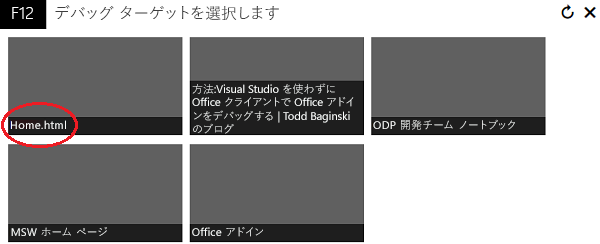

# Windows 10 で F12 開発者ツールを使用してアドインをデバッグする

Windows 10 に含まれている F12 開発者ツールにより、web ページのデバッグ、テスト、および高速化ができます。それらを使用すれば、Visual Studio などの IDE を使用していない場合や、アドインを IDE の外部で実行中に問題を調査する必要がある場合に、Office アドインの開発とデバッグを行うことも可能です。アドインの実行後、F12 開発者ツールを起動できます。

この記事では、Windows 10 で F12 開発者ツールのデバッガー ツールを使用して、Office アドインをテストする方法を説明します。AppSource からのアドイン、また他の場所から追加したアドインもテストできます。F12 ツールは独自のウィンドウに表示され、Visual Studio を使用しません。

> [!NOTE]
> デバッガーは、Windows 10 および Internet Explorer 上の F12 開発者ツールの一部です。Windows の以前のバージョンにはデバッガーは含まれません。 

## 前提条件

以下のソフトウェアが必要です。

- Windows 10 に含まれる F12 開発者ツール。 
    
- アドインをホストする Office クライアント アプリケーション。  
    
- アドイン。  

## デバッガーの使用

次の例では、AppSource から Word と無料のアドインを使用します。

1. Word を起動し、空白の文書を選択します。 
    
2. アドイン グループの **[挿入]** タブで、**[ストア]** をクリックし、QR4Office アドインを選択します。(ストアやアドイン カタログから、追加のアドインを読み込むことができます。)
    
3. Office のバージョンに対応する F12 開発者ツールを起動します。
    
   - 32 ビット版の Office の場合は、C:\Windows\System32\F12\F12Chooser.exe を使用します。
    
   - 64 ビット版の Office の場合は、C:\Windows\SysWOW64\F12\F12Chooser.exe を使用します。
    
   F12Chooser を起動すると、[デバッグするターゲットの選択] という名前の別ウィンドウに、デバッグの対象になりうるアプリケーションが表示されます。デバッグするアプリケーションを選択します。独自のアドインを記述している場合、アドインを展開した Web サイトを選択します。ローカル ホストの URL も選択できます。 
    
   たとえば、**home.html** を選択します。 
    
   

4. F12 ウィンドウで、デバッグするファイルを選択します。
    
   ファイルを選択するには、**スクリプト** (左側) ウィンドウの上にあるフォルダー アイコンを選択します。ドロップダウン リストに利用可能なファイルが表示されます。home.js を選択します。
    
5. ブレークポイントを設定します。
    
   home.js にブレークポイントを設定するには、_textChanged_ 関数内の行 144 を選択します。その行の左側と **[コールスタックとブレークポイント]** (右下) ウィンドウの対応する行に赤い点が表示されます。ブレークポイントを設定するその他の方法については、「[デバッガーを使用して実行中の JavaScript を検査する](https://msdn.microsoft.com/library/dn255007%28v=vs.85%29.aspx)」を参照してください。 
    
   

6. アドインを実行して、ブレークポイントをトリガーします。
    
   [QR4Office] ウィンドウの上部にある [URL] テキスト ボックスを選択して、テキストを変更します。デバッガー内の **[コールスタックとブレークポイント]** ウィンドウで、ブレークポイントがトリガーされ、さまざまな情報を示していることがわかります。結果を確認するには、F12 ツールの更新が必要な場合があります。
    
   

## 関連項目

- [デバッガーを使用して実行中の JavaScript を検査する](https://msdn.microsoft.com/library/dn255007%28v=vs.85%29.aspx)
- 
  [F12 開発者ツールの使用](https://msdn.microsoft.com/ja-jp/library/bg182326%28v=vs.85%29.aspx)
    
