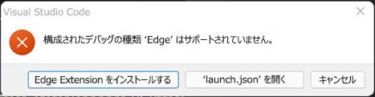

# <a name="debug-add-ins-on-windows-using-visual-studio-code-and-microsoft-edge-webview2-chromium-based"></a>Visual Studio Code と Microsoft Edge WebView2 を使用して Windows でアドインをデバッグする (Chromium ベース)

Windows で実行されている Office アドインは、Edge Chromium WebView2 ランタイムに対して Visual Studio Code で直接デバッグできます。

> [!IMPORTANT]
> この記事は、「[Office アドインによって使用されるブラウザー](../concepts/browsers-used-by-office-web-add-ins.md)」で説明されているように、Office が Microsoft Edge Chromium WebView2 ランタイムでアドインを実行する場合にのみ適用されます。オリジナルの WebView (EdgeHTML) ランタイムを使用する Microsoft Edge 従来版に対する Visual Studio Code でのデバッグの手順については、「[Visual Studio Code 用 Office アドイン デバッガー 拡張機能](debug-with-vs-extension.md)」を参照してください。

> [!TIP]
> Visual Studio Code に組み込まれているツールを使用してデバッグできない場合、またはデバッグしたくない場合、またはアドインが Visual Studio Code の外部で実行されている場合にのみ問題が発生した場合は、「[Microsoft Edge WebView2 用の開発者ツールを使用してアドインをデバッグする](debug-add-ins-using-devtools-edge-chromium.md)」の説明に従って、Edge (Chromium ベース) 開発者ツールを使用して Edge Chromium WebView2 ランタイムをデバッグできます。

このデバッグ モードは動的であるため、コードの実行中にブレークポイントを設定できます。 デバッガーがアタッチされている間、デバッグ セッションを失うことなく、コードの変更を直ちに確認できます。 コードの変更も保持されるため、コードに対する複数の変更の結果が表示されます。 次の画像は、この拡張機能の動作を示しています。


## <a name="prerequisites"></a>前提条件

- [Visual Studio Code](https://code.visualstudio.com/)
- [Node.js (バージョン 10 以上)](https://nodejs.org/)
- Windows 10, 11
- 「[Office アドインで使用されるブラウザー](../concepts/browsers-used-by-office-web-add-ins.md)」で説明されているように、Microsoft Edge と WebView2 (Chromium ベース) をサポートするプラットフォームと Office アプリケーションの組み合わせ。Microsoft 365 サブスクリプションの Office のバージョンがバージョン 2101 より前の場合は、WebView2 をインストールする必要があります。 [Microsoft Edge WebView2 / Embed web content ... with Microsoft Edge WebView2](https://developer.microsoft.com/microsoft-edge/webview2/) でのインストール方法はこちらをご覧ください。

## <a name="use-the-visual-studio-code-debugger"></a>Visual Studio Code デバッガーを使用する

これらの手順は、コマンド ラインの使用経験があり、基本的な JavaScript を理解し、[Office アドイン用の Yeoman ジェネレーター](../develop/yeoman-generator-overview.md)を使用する前に Office アドイン プロジェクトを作成したことを前提としています。これまでにこれを行ったことがない場合は、[Excel Office アドイン チュートリアル](../tutorials/excel-tutorial.md)などのチュートリアルの 1 つにアクセスすることを検討してください。

1. 最初の手順は、プロジェクトとその作成方法によって異なります。

   - Visual Studio Code でデバッグを試すプロジェクトを作成する場合は、 [Office アドイン用の Yeoman ジェネレーター](../develop/yeoman-generator-overview.md)を使用します。これを行うには、 [Outlook アドインクイック スタートなどのクイック スタート](../quickstarts/outlook-quickstart.md) ガイドのいずれかを使用します。
   - Yo Office で作成された既存のプロジェクトをデバッグする場合は、スキップして次の手順に進みます。
   - Yo Office で作成されていない既存のプロジェクトをデバッグする場合は、「[付録 A](#appendix-a)」の手順を実行し、この手順の次の手順に戻ります。

1. VS Code を開始し、プロジェクトを開きます。 

1. [View **Run]\**(**実行の表示** > \) を選択するか **、Ctrl + Shift + D キー** を押してデバッグ ビューに切り替えます。

1. **[実行とデバッグ]** オプションから、ホスト アプリケーションの Edge Chromium オプション (**Outlook デスクトップ (Edge Chromium)** など) を選択します。 **F5 キー** を押すか、メニューから **[デバッグの開始** > ] を選択してデバッグを開始します。 この操作により、アドインをホストするローカル サーバーがノード ウィンドウで自動的に起動され、Excel や Word などのホスト アプリケーションが自動的に開きます。 これには数秒かかる場合があります。

   > [!TIP]
   > Yo Officeで作成されたプロジェクトを使用していない場合は、レジストリ キーを調整するように求められる場合があります。 プロジェクトのルート フォルダーで、コマンド ラインを使用して以下を実行します。
   >
   > ``` command&nbsp;line
   > npx office-addin-debugging start <your manifest path>
   > ```

   > [!IMPORTANT]
   > プロジェクトが以前のバージョンの Yo Office で作成されている場合、デバッグを開始してから約 10 秒から 30 秒後に、次のエラー ダイアログ ボックスが表示される場合があります (その時点で、既にこの手順内の別の手順に進んでいる可能性があります)。また、次の手順で説明するダイアログ ボックスの背後に隠れている可能性があります。
   >
   > 
   >
   > 「[付録 B](#appendix-b)」のタスクを完了し、この手順を再開します。

1. ホスト アプリケーションで、アドインを使用する準備ができました。 **[作業ウィンドウの表示]** を選択するか、その他のアドイン コマンドを実行します。 次のようなテキストを含むダイアログ ボックスが表示されます。

   > WebView は読み込み時に停止します。
   > WebView をデバッグするには、拡張機能 Microsoft Debugger for Edge を使用して VS Code を WebView のインスタンスにアタッチし、[OK] をクリックして続行します。 今後このダイアログが表示されないようにするには、[キャンセル] をクリックします。

   **[OK]** を選択します。

   [!INCLUDE [Cancelling the WebView Stop On Load dialog box](../includes/webview-stop-on-load-cancel-dialog.md)]

1. これで、プロジェクトのコードにブレークポイントを設定し、デバッグを実行できるようになりました。 Visual Studio Code でブレークポイントを設定するには、コード行の横にマウス ポインターを置き、表示される赤い円を選択します。

    

1. ブレークポイントを使用して行を呼び出すアドインの機能を実行します。 ブレークポイントがヒットし、ローカル変数を検査できます。

   > [!NOTE]
   > `Office.initialize` または `Office.onReady` の呼び出しのブレークポイントは無視されます。 これらの機能の詳細については、「[Office アドインを初期化する](../develop/initialize-add-in.md)」を参照してください。

> [!IMPORTANT]
> デバッグ セッションを停止する最善の方法は、**Shift + F5** キーを押すか、メニューから [**デバッグの停止****の実行** > ] を選択することです。 この操作では、ノード サーバー ウィンドウを閉じてホスト アプリケーションを閉じようとしますが、ドキュメントを保存するかどうかを確認するプロンプトがホスト アプリケーションに表示されます。 適切な選択を行い、ホスト アプリケーションを閉じます。 ノード ウィンドウまたはホスト アプリケーションを手動で閉じないようにします。 これを行うと、特にデバッグ セッションの停止と開始を繰り返している時に、バグが発生する可能性があります。
>
> デバッグが動作を停止する場合、たとえば、ブレークポイントが無視される場合などは、デバッグを停止します。 その後、必要に応じて、すべてのホスト アプリケーション ウィンドウとノード ウィンドウを閉じます。 最後に、Visual Studio Code を閉じて、もう一度開きます。

### <a name="appendix-a"></a>付録 A

プロジェクトが Yo Office で作成されていない場合は、Visual Studio Code のデバッグ構成を作成する必要があります。

1. プロジェクトの `\.vscode` フォルダーに `launch.json` という名前のファイルがまだ存在しない場合は作成します。
1. ファイルに `configurations` 配列があることを確認します。 `launch.json` の簡単な例を次に示します。

   ```json
   {
     // Other properties may be here.
   
     "configurations": [
   
       // Configuration objects may be here.
   
     ]
   
     // Other properties may be here.
   }
   ```

1. `configurations` 配列に次のオブジェクトを追加します。

   ```json
   {
      "name": "$HOST$ Desktop (Edge Chromium)",
      "type": "pwa-msedge",
      "request": "attach",
      "useWebView": true,
      "port": 9229,
      "timeout": 600000,
      "webRoot": "${workspaceRoot}",
      "preLaunchTask": "Debug: Excel Desktop",
      "postDebugTask": "Stop Debug"
   },
   ```

1. プレースホルダー `$HOST$` を、アドインが実行される Office アプリケーションの名前に置き換えます。たとえば、`Outlook` や `Word` などです。
1. ファイルを保存して閉じます。

### <a name="appendix-b"></a>付録 B

1. エラー ダイアログ ボックスで、**[キャンセル]** ボタンを選択 します。
1. デバッグが自動的に停止しない場合は、**Shift + F5 キー** を押すか、メニューから [**デバッグの停止****の実行** > ] を選択します。
1. ローカル サーバーが実行されているノード ウィンドウを閉じます (自動的に閉じられない場合)。
1. Office アプリケーションを閉じます (自動的に閉じられない場合)。
1. プロジェクトで `\.vscode\launch.json` ファイルを開きます。 
1. In the `configurations` array, there are several configuration objects. Find the one whose name has the pattern `$HOST$ Desktop (Edge Chromium)`, where $HOST$ is an Office application that your add-in runs in; for example, `Outlook Desktop (Edge Chromium)` or `Word Desktop (Edge Chromium)`.
1. `"type"` プロパティの値を `"edge"` から `"pwa-msedge"` に変更します。
1. `"useWebView"` プロパティの値を文字列 `"advanced"` からブール値 `true` に変更します (`true` は引用符で囲まないことに注意してください)。
1. ファイルを保存します。
1. VS Code を閉じます。

## <a name="see-also"></a>関連項目

- [Office アドインのテストとデバッグ](test-debug-office-add-ins.md)
- [Visual Studio Code と Microsoft Edge 従来版 WebView (EdgeHTML) を使用して Windows 上のアドインをデバッグする](debug-with-vs-extension.md)
- [Internet Explorer の開発者ツールを使用してアドインをデバッグする](debug-add-ins-using-f12-tools-ie.md)
- [Edge レガシー用の開発者ツールを使用してアドインをデバッグする](debug-add-ins-using-devtools-edge-legacy.md)
- [Microsoft Edge (Chromium ベース)で開発者ツールを使用してアドインをデバッグする](debug-add-ins-using-devtools-edge-chromium.md)
- [作業ウィンドウからデバッガーをアタッチする](attach-debugger-from-task-pane.md)
- [Office アドインのランタイム](runtimes.md)
