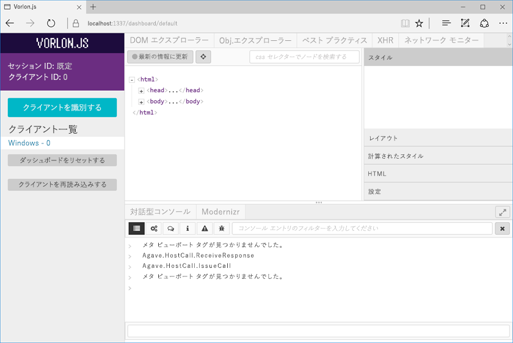

# <a name="debug-office-add-ins-on-ipad-and-mac"></a><span data-ttu-id="f3f6b-102">iPad と Mac で Office アドインをデバッグする</span><span class="sxs-lookup"><span data-stu-id="f3f6b-102">Debug Office Add-ins on iPad and Mac</span></span>

<span data-ttu-id="f3f6b-p101">Windows でのアドインの開発とデバッグには Visual Studio を使用できますが、iPad と Mac で使用して アドインをデバッグすることはできません。アドインは HTML と Javascript を使用して開発されているため、さまざまなプラットフォームで機能するように設計されていますが、さまざまなブラウザーで HTML の表示方法に微妙な違いがあります。この記事では、iPad または Mac で動作するアドインをデバッグする方法を説明します。</span><span class="sxs-lookup"><span data-stu-id="f3f6b-p101">You can use Visual Studio to develop and debug add-ins on Windows, but you can't use it to debug add-ins on the iPad or Mac. Because add-ins are developed using HTML and Javascript, they are designed to work across platforms, but there might be subtle differences in how different browsers render the HTML. This article describes how to debug add-ins running on an iPad or Mac.</span></span> 

## <a name="debugging-with-safari-web-inspector-on-a-mac"></a><span data-ttu-id="f3f6b-106">Mac での Safari Web インスペクタを使用したデバッグ</span><span class="sxs-lookup"><span data-stu-id="f3f6b-106">Debugging with Safari Web Inspector on a Mac</span></span>

<span data-ttu-id="f3f6b-107">タスクペインまたはコンテンツアドインに UI を表示するアドインがある場合は、Safari Web Inspector を使用して Office アドインをデバッグできます。</span><span class="sxs-lookup"><span data-stu-id="f3f6b-107">If you have add-in that shows UI in a taskpane or in a content add-in, you can debug an Office add-in using Safari Web Inspector.</span></span> 

<span data-ttu-id="f3f6b-108">Mac で Office アドインをデバッグできるようにするには、Mac OS High Sierra および Mac Office バージョン 16.9.1（ビルド 18012504）以降が必要です。</span><span class="sxs-lookup"><span data-stu-id="f3f6b-108">To be able to debug Office Add-ins on Mac, you must have Mac OS High Sierra AND Mac Office Version: 16.9.1 (Build 18012504) or later.</span></span> <span data-ttu-id="f3f6b-109">Office Mac ビルドをお持ちでない場合は、 [Office 365 開発者向けプログラム](https://aka.ms/o365devprogram)に加入すると入手できます。</span><span class="sxs-lookup"><span data-stu-id="f3f6b-109">If you don't have an Office Mac build, you can get one by joining the [Office 365 Developer program](https://aka.ms/o365devprogram).</span></span>

<span data-ttu-id="f3f6b-110">開始するには、端末を開いて、以下のとおりに `OfficeWebAddinDeveloperExtras` 関連する Office アプリケーションのプロパティを設定します。</span><span class="sxs-lookup"><span data-stu-id="f3f6b-110">To start, open a terminal and set the `OfficeWebAddinDeveloperExtras` property for the relevant Office application as follows:</span></span>

- `defaults write com.microsoft.Word OfficeWebAddinDeveloperExtras -bool true`

- `defaults write com.microsoft.Excel OfficeWebAddinDeveloperExtras -bool true`

- `defaults write com.microsoft.Powerpoint OfficeWebAddinDeveloperExtras -bool true`

- `defaults write com.microsoft.Outlook OfficeWebAddinDeveloperExtras -bool true`

<span data-ttu-id="f3f6b-111">次に、Office アプリケーションを開き、アドインを挿入します。</span><span class="sxs-lookup"><span data-stu-id="f3f6b-111">Then, open the Office application and insert your add-in.</span></span> <span data-ttu-id="f3f6b-112">アドインを右クリックすると、コンテキストメニューで **[要素の検査]** オプションが表示されます。</span><span class="sxs-lookup"><span data-stu-id="f3f6b-112">Right-click the add-in and you should see an **Inspect Element** option in the context menu.</span></span>  <span data-ttu-id="f3f6b-113">そのオプションを選択すると、インスペクタが起動します。インスペクタで、ブレークポイントを設定してアドインをデバッグできます。</span><span class="sxs-lookup"><span data-stu-id="f3f6b-113">Select that option and it will pop the Inspector, where you can set breakpoints and debug your add-in.</span></span>

> [!NOTE]
> <span data-ttu-id="f3f6b-114">これは実験的な機能であり、Office アプリケーションの今後のバージョンでこの機能が維持されるという保証はありません。</span><span class="sxs-lookup"><span data-stu-id="f3f6b-114">Please note that this is an experimental feature and there are no guarantees that we will preserve this functionality in future versions of Office applications.</span></span>

## <a name="debugging-with-vorlonjs-on-a-ipad-or-mac"></a><span data-ttu-id="f3f6b-115">iPad または Mac での Vorlon.JS を使用したデバッグ</span><span class="sxs-lookup"><span data-stu-id="f3f6b-115">Debugging with Vorlon.JS on a iPad or Mac</span></span>

<span data-ttu-id="f3f6b-116">iPad または Mac でアドインをデバッグするには、F12 ツールに似た Web ページのデバッガである Vorlon.JS を使用します。</span><span class="sxs-lookup"><span data-stu-id="f3f6b-116">To debug an add-in on iPad or Mac, you can use Vorlon.JS, a debugger for web pages that is similar to the F12 tools.</span></span> <span data-ttu-id="f3f6b-117">リモートで動作するように設計されているため、異なるデバイス間で Web ページをデバッグすることができます。</span><span class="sxs-lookup"><span data-stu-id="f3f6b-117">It is designed to work remotely and it enables you to debug web pages across different devices.</span></span> <span data-ttu-id="f3f6b-118">詳細については、[Vorlon の Web サイト](http://www.vorlonjs.com)を参照してください。</span><span class="sxs-lookup"><span data-stu-id="f3f6b-118">For more information, see the [Vorlon website](http://www.vorlonjs.com).</span></span>  


### <a name="install-and-set-up-vorlonjs"></a><span data-ttu-id="f3f6b-119">Vorlon.JS のインストールとセットアップ</span><span class="sxs-lookup"><span data-stu-id="f3f6b-119">Install and set up up Vorlon.JS on a Mac or iPad</span></span>  

1.  <span data-ttu-id="f3f6b-120">管理者としてデバイスにログオンします。</span><span class="sxs-lookup"><span data-stu-id="f3f6b-120">Log on to the device as an administrator.</span></span>

2.  <span data-ttu-id="f3f6b-121">まだ [Node.js](https://nodejs.org) をインストールしていない場合は、インストールします。</span><span class="sxs-lookup"><span data-stu-id="f3f6b-121">Install [Node.js](https://nodejs.org) if it isn't already installed.</span></span> 

3.  <span data-ttu-id="f3f6b-p105">**[ターミナル]** ウィンドウを開き、コマンド `npm i -g vorlon` を入力します。ツールが `/usr/local/lib/node_modules/vorlon` にインストールされます。</span><span class="sxs-lookup"><span data-stu-id="f3f6b-p105">Open a **Terminal** window and enter the command `npm i -g vorlon`. The tool is installed to `/usr/local/lib/node_modules/vorlon`.</span></span>


### <a name="configure-vorlonjs-to-use-https"></a><span data-ttu-id="f3f6b-124">Vorlon.JS を構成して HTTPS を使用する</span><span class="sxs-lookup"><span data-stu-id="f3f6b-124">Configure Vorlon.JS to use HTTPS</span></span>

<span data-ttu-id="f3f6b-p106">Vorlon.JS を使用してアプリケーションをデバッグするには、既知の場所から Vorlon.JS スクリプトを読み込むアプリケーションの開始ページに `<script>` タグを追加します (詳細については、次の手順を参照してください)。アドインが SSL 保護付き (HTTPS) の場合、アドインで使用するすべてのスクリプトは HTTPS サーバーからホストされるように拡張する必要があります。これには、Vorlon.JS スクリプトも含まれます。そのため、アドインで Vorlon.JS を使用するには、Vorlon.JS を構成して SSL を使用することが必要になります。</span><span class="sxs-lookup"><span data-stu-id="f3f6b-p106">To debug an application using Vorlon.JS, you add a `<script>` tag to the opening page of the application that loads a Vorlon.JS script from a well-known location (for details, see the following procedure). If an add-in is SSL-secured (HTTPS), any scripts that it uses must be hosted from an HTTPS server, including the Vorlon.JS script. Therefore, you must configure Vorlon.JS to use SSL in order to use Vorlon.JS with add-ins.</span></span> 

> [!IMPORTANT]
> [!include[HTTPS guidance](../includes/https-guidance.md)]

1.  <span data-ttu-id="f3f6b-128">**[Finder]** で、`/usr/local/lib/node_modules/vorlon` に移動し、`/Server` フォルダーのコンテキスト メニュー (右クリック) を開き、**[情報を見る]** を選択します。</span><span class="sxs-lookup"><span data-stu-id="f3f6b-128">In **Finder**, go to `/usr/local/lib/node_modules/vorlon`, open the context menu for (right-click) the `/Server` folder, and then select **Get Info**.</span></span>

2.  <span data-ttu-id="f3f6b-129">**[サーバー情報]** ウィンドウの右下隅にある南京錠アイコンを選択して、フォルダーのロックを解除します。</span><span class="sxs-lookup"><span data-stu-id="f3f6b-129">Choose the padlock icon in the lower right corner of the **Server info** window to unlock the folder.</span></span>

3. <span data-ttu-id="f3f6b-130">ウィンドウの **[共有とアクセス権]** セクションで、**スタッフ** グループの **[特権]** を **[読み取り/書き込み]** に設定します。</span><span class="sxs-lookup"><span data-stu-id="f3f6b-130">In the **Sharing and Permissions** section of the window, set the **Privilege** for the **staff** group to **Read & Write**.</span></span>

4. <span data-ttu-id="f3f6b-131">南京錠アイコンをもう一度選択して、フォルダーを***再度ロック***します。</span><span class="sxs-lookup"><span data-stu-id="f3f6b-131">Choose the padlock icon again to ***relock*** the folder.</span></span>

5. <span data-ttu-id="f3f6b-132">**[Finder]** に戻り、`/Server` サブフォルダーを展開し、ファイル `config.json` を右クリックして、**[情報を見る]** を選択します。</span><span class="sxs-lookup"><span data-stu-id="f3f6b-132">Back in **Finder**, expand the `/Server` subfolder, right-click the file `config.json`, and then select **Get Info**.</span></span>

6. <span data-ttu-id="f3f6b-p107">**[config.json 情報]** ウィンドウで、親 `/Server` フォルダーに対して行ったものと同じ方法でファイルの特権を変更します。必ず再度ロックしてからウィンドウを閉じてください。</span><span class="sxs-lookup"><span data-stu-id="f3f6b-p107">In the **config.json info** window, change the privileges of the file exactly the way you did for its parent `/Server` folder. Be sure to relock and close the window.</span></span>

7. <span data-ttu-id="f3f6b-p108">**[Finder]** に戻り、ファイル `config.json` を右クリックして、**[このアプリケーションで開く]**、**[テキストエディット]** の順に選択します。ファイルがテキスト エディターで開きます。</span><span class="sxs-lookup"><span data-stu-id="f3f6b-p108">Back in **Finder**, right-click the file `config.json`, select **Open with**, and then select **TextEdit**. The file opens in a text editor.</span></span>

8. <span data-ttu-id="f3f6b-137">**useSSL** プロパティの値を `true` に変更します。</span><span class="sxs-lookup"><span data-stu-id="f3f6b-137">Change the value of the **useSSL** property to `true`.</span></span>

9. <span data-ttu-id="f3f6b-p109">**[プラグイン]** セクションで、**ID** が `OFFICE` で**名前**が `Office Addin` のプライグインを検索します。プラグインの **enabled** プロパティがまだ `true` になっていない場合は、`true` に設定します。</span><span class="sxs-lookup"><span data-stu-id="f3f6b-p109">In the **plugins** section, find the plugin with the **id** of `OFFICE` and the **name** of `Office Addin`. If the **enabled** property for the plug-in is not already `true`, set it to `true`.</span></span>

10. <span data-ttu-id="f3f6b-140">ファイルを保存し、エディターを閉じます。</span><span class="sxs-lookup"><span data-stu-id="f3f6b-140">Save the file and close the editor.</span></span>

11. <span data-ttu-id="f3f6b-141">**[検索]** で `/usr/local/lib/node_modules/vorlon` に移動して、`Server` サブフォルダーを右クリックし、**[フォルダーの新しいターミナル]** を選択します。</span><span class="sxs-lookup"><span data-stu-id="f3f6b-141">In **Finder**, navigate to `/usr/local/lib/node_modules/vorlon`, right-click the `Server` subfolder, and select **New terminal at folder**.</span></span> 
    
12. <span data-ttu-id="f3f6b-p110">**[ターミナル]** ウィンドウで、`sudo vorlon` と入力します。管理者パスワードの入力を求めるダイアログ ボックスが表示されます。Vorlon サーバーが起動します。**[ターミナル]** ウィンドウを開いたままにしておきます。</span><span class="sxs-lookup"><span data-stu-id="f3f6b-p110">In the **Terminal** window, enter `sudo vorlon`. You will be prompted to enter your administrator password. The Vorlon server starts. Leave the **Terminal** window open.</span></span>

13. <span data-ttu-id="f3f6b-p111">ブラウザー ウィンドウを開き、Vorlon.JS インターフェイスの `https://localhost:1337` に進みます。ダイアログ ボックスが表示されたら、**[常に]** を選択して、セキュリティ証明書を信頼します。</span><span class="sxs-lookup"><span data-stu-id="f3f6b-p111">Open a browser window and go to `https://localhost:1337`, which is the Vorlon.JS interface. When prompted, choose **Always** to trust the security certificate.</span></span> 

    > [!NOTE]
    > <span data-ttu-id="f3f6b-p112">ダイアログ ボックスが表示されない場合は、手動で証明書を信頼する必要があります。証明書ファイルは `/usr/local/lib/node_modules/vorlon/Server/cert/server.crt` です。次の手順を実行し、問題が発生した場合は、Macintosh または iPad のヘルプを参照してください。</span><span class="sxs-lookup"><span data-stu-id="f3f6b-p112">If you are not prompted, you might need to trust the certificate manually. The certificate file is `/usr/local/lib/node_modules/vorlon/Server/cert/server.crt`. Try the following steps. If you have trouble, consult Macintosh or iPad help.</span></span> 
    >
    > 1. <span data-ttu-id="f3f6b-152">ブラウザー ウィンドウを閉じ、Vorlon サーバーを実行している **[ターミナル]** ウィンドウで、Control-C を使用してサーバーを停止します。</span><span class="sxs-lookup"><span data-stu-id="f3f6b-152">Close the browser window and in the **Terminal** window that is running the Vorlon server, use Control-C to stop the server.</span></span>
    > 2. <span data-ttu-id="f3f6b-p113">**[Finder]** で、`server.crt` ファイルを右クリックして、**[キーチェーンアクセス]** を選択します。**[キーチェーンアクセス]** ウィンドウが開きます。</span><span class="sxs-lookup"><span data-stu-id="f3f6b-p113">In **Finder**, right-click the `server.crt` file and select **Keychain Access**. The **Keychain Access** window opens.</span></span>
    > 3. <span data-ttu-id="f3f6b-p114">左側の **[キーチェーン]** リストで、**[ログイン]** がまだ選択されていない場合は選択し、**[カテゴリ]** セクションで **[証明書]** を選択します。証明書 **localhost** が一覧表示されます。</span><span class="sxs-lookup"><span data-stu-id="f3f6b-p114">In the **Keychains** list on the left, select **login** if it is not already selected, and then select **Certificates** in the **Category** section. The certificate **localhost** is listed.</span></span>
    > 4. <span data-ttu-id="f3f6b-p115">証明書 **localhost** を右クリックし、**[情報を見る]** を選択します。**[localhost]** ウィンドウが開きます。</span><span class="sxs-lookup"><span data-stu-id="f3f6b-p115">Right-click the certificate **localhost** and select **Get Info**. A **localhost** window opens.</span></span>
    > 5. <span data-ttu-id="f3f6b-159">**[信頼]** セクションで、**[この証明書を使用する場合]** というラベルの付いたセレクターを選択し、**[常に信頼する]** を選択します。</span><span class="sxs-lookup"><span data-stu-id="f3f6b-159">In the **Trust** section, open the selector labeled **When using this certificate** and select **Always Trust**.</span></span> 
    > 6. <span data-ttu-id="f3f6b-p116">**[localhost]** ウィンドウを閉じます。アクションが成功すると、**[キーチェーンアクセス]** ウィンドウの **localhost** 証明書のアイコンに青い円で囲まれた白い十字が表示されます。</span><span class="sxs-lookup"><span data-stu-id="f3f6b-p116">Close the **localhost** window. If the action was successful, the **localhost** certificate in the **Keychain Access** window has a white cross in a blue circle on its icon.</span></span>


### <a name="configure-the-add-in-for-vorlonjs-debugging"></a><span data-ttu-id="f3f6b-162">Vorlon.JS デバッグ用のアドインを構成します。</span><span class="sxs-lookup"><span data-stu-id="f3f6b-162">Configure the add-in for Vorlon.JS debugging</span></span>

1. <span data-ttu-id="f3f6b-163">次のスクリプト タグを、アドインの home.html ファイル (またはメイン HTML ファイル) の `<head>` セクションに追加します。</span><span class="sxs-lookup"><span data-stu-id="f3f6b-163">Add the following script tag to the `<head>` section of the home.html file (or main HTML file) of your add-in:</span></span>

    ```html
    <script src="https://localhost:1337/vorlon.js"></script>    
    ```  

2. <span data-ttu-id="f3f6b-164">Azure Web サイトなど、Mac または iPad からアクセス可能な Web サーバーにアドイン Web アプリケーションを展開します。</span><span class="sxs-lookup"><span data-stu-id="f3f6b-164">Deploy the add-in web application to a web server that is accessible from the Mac or iPad, such as an Azure website.</span></span> 

3. <span data-ttu-id="f3f6b-165">アドイン マニフェストに URL が表示されるすべての場所で、アドインの URL を更新します。</span><span class="sxs-lookup"><span data-stu-id="f3f6b-165">Update the URL of the add-in in all the places where the URL appears in the add-in manifest.</span></span>

4. <span data-ttu-id="f3f6b-166">アドイン マニフェストを Mac または iPad 上の次のフォルダーにコピーします: `/Users/{your_name_on_the_device}/Library/Containers/com.microsoft.{host_name}/Data/Documents/wef`。ここで、*{host_name}* は、Word、Excel、PowerPoint、または Outlook です。</span><span class="sxs-lookup"><span data-stu-id="f3f6b-166">Copy the add-in manifest to the following folder on the Mac or iPad: `/Users/{your_name_on_the_device}/Library/Containers/com.microsoft.{host_name}/Data/Documents/wef`, where *{host_name}* is Word, Excel, PowerPoint, or Outlook.</span></span>


### <a name="inspect-an-add-in-in-vorlonjs"></a><span data-ttu-id="f3f6b-167">Vorlon.JS でアドインを検査する</span><span class="sxs-lookup"><span data-stu-id="f3f6b-167">Inspect an add-in in Vorlon.JS</span></span>

1. <span data-ttu-id="f3f6b-168">Vorlon サーバーが実行されていない場合、**[Finder]** で `/usr/local/lib/node_modules/vorlon` に移動して、`Server` サブフォルダーを右クリックし、**[フォルダーの新しいターミナル]** を選択します。</span><span class="sxs-lookup"><span data-stu-id="f3f6b-168">If the Vorlon server is not running, in **Finder**, navigate to `/usr/local/lib/node_modules/vorlon`, right-click the `Server` subfolder, and select **New terminal at folder**.</span></span> 
    
2.  <span data-ttu-id="f3f6b-p117">**[ターミナル]** ウィンドウで、`sudo vorlon` と入力します。管理者パスワードの入力を求めるダイアログ ボックスが表示されます。Vorlon サーバーが起動します。**[ターミナル]** ウィンドウを開いたままにしておきます。</span><span class="sxs-lookup"><span data-stu-id="f3f6b-p117">In the **Terminal** window, enter `sudo vorlon`. You will be prompted to enter your administrator password. The Vorlon server starts. Leave the **Terminal** window open.</span></span>

3.  <span data-ttu-id="f3f6b-173">ブラウザー ウィンドウを開き、Vorlon.JS インターフェイスの `https://localhost:1337` に進みます。</span><span class="sxs-lookup"><span data-stu-id="f3f6b-173">Open a browser window and go to `https://localhost:1337`, which is the Vorlon.JS interface.</span></span>

4. <span data-ttu-id="f3f6b-p118">アドインをサイドロードします。アドインが Excel、PowerPoint、または Word 用の場合は、「[iPad または Mac で Office アドインをサイドロードする](sideload-an-office-add-in-on-ipad-and-mac.md)」の説明に従ってサイドロードします。アドインが Outlook アドインである場合は、「[テストのために Outlook アドインをサイドロードする](https://docs.microsoft.com/outlook/add-ins/sideload-outlook-add-ins-for-testing)」の説明に従ってサイドロードします。アドインでアドイン コマンドを使用しない場合は、アドインが直ちに開きます。それ以外の場合は、ボタンを選択してアドインを開きます。Office ホスト アプリケーションのビルドに応じて、ボタンは **[ホーム]** タブまたは **[アドイン]** タブのいずれかに表示されます。</span><span class="sxs-lookup"><span data-stu-id="f3f6b-p118">Sideload the add-in. If it is for Excel, PowerPoint, or Word, sideload it as described in [Sideload an Office Add-in on iPad and Mac](sideload-an-office-add-in-on-ipad-and-mac.md). If it is an Outlook add-in, sideload it as described in [Sideload Outlook Add-ins for testing](https://docs.microsoft.com/outlook/add-ins/sideload-outlook-add-ins-for-testing). If the add-in does not use add-in commands, it will open immediately. Otherwise, choose the button to open the add-in. Depending on the build of the Office host application, the button will be on either the **Home** tab or an **Add-in** tab.</span></span>

<span data-ttu-id="f3f6b-180">アドインは、Vorlon.JS のクライアントのリスト (Vorlon.JS インターフェイスの左側) に **{OS} - n** として表示されます。*n* は数値、*{OS}* は "Macintosh" などのデバイスの種類です。</span><span class="sxs-lookup"><span data-stu-id="f3f6b-180">The add-in will show up in the list of Clients in Vorlon.JS (on the left side of the Vorlon.JS interface) as **{OS} - n**, for some number *n*, and where *{OS}* is the device type, such as "Macintosh".</span></span> 



<span data-ttu-id="f3f6b-p119">Vorlon ツールには、さまざまなプラグインがあります。現在有効になっているプラグインはツールの上部にタブとして表示されます。(左側にある歯車アイコンを選択すると、さらに別のプラグインを有効にすることができます。)これらのプラグインは、F12 ツールの機能に似ています。たとえば、DOM 要素の強調表示、コマンドの実行などを行えます。詳細については、[Vorlon ドキュメントの「コア プラグイン」](http://vorlonjs.com/documentation/#console)を参照してください。</span><span class="sxs-lookup"><span data-stu-id="f3f6b-p119">The Vorlon tool has a variety of plug-ins. The ones that are currently enabled appear as tabs at the top of the tool. (You can enable more plug-ins by choosing the gears icon on the left.) These plug-ins are  similar to the functions in F12 tools. For example, you can highlight DOM elements, execute commands, and more. For more details, see [Vorlon Documentation Core Plugins](http://vorlonjs.com/documentation/#console)</span></span> 

<span data-ttu-id="f3f6b-p120">**Office アドイン** プラグインにより Office.js に特別な機能 (オブジェクト モデルを調査する機能、Office.js の呼び出しを実行する機能、およびオブジェクト プロパティの値を読み取る機能など) が追加されます。手順については、「[Office アドインをデバッグするための VorlonJS プラグイン](https://blogs.msdn.microsoft.com/mim/2016/02/18/vorlonjs-plugin-for-debugging-office-addin/)」を参照してください。</span><span class="sxs-lookup"><span data-stu-id="f3f6b-p120">An **Office Addin** plug-in adds extra capabilities for Office.js, such as exploring the object model, executing Office.js calls, and reading the values of object properties. For instructions, see [VorlonJS plugin for debugging Office Add-in](https://blogs.msdn.microsoft.com/mim/2016/02/18/vorlonjs-plugin-for-debugging-office-addin/).</span></span>

> [!NOTE]
> <span data-ttu-id="f3f6b-188">Vorlon.JS にブレーク ポイントを設定する方法はありません。</span><span class="sxs-lookup"><span data-stu-id="f3f6b-188">There is no way to set break points in Vorlon.JS.</span></span>


## <a name="clearing-the-office-applications-cache-on-a-mac-or-ipad"></a><span data-ttu-id="f3f6b-189">Mac または iPad 上の Office アプリケーションのキャッシュのクリア</span><span class="sxs-lookup"><span data-stu-id="f3f6b-189">Clearing the Office application's cache on a Mac or iPad</span></span>

<span data-ttu-id="f3f6b-p121">アドインはパフォーマンス上の理由から、Office for Mac でキャッシュされることが多いです。通常、キャッシュはアドインを再読み込みすることでクリアされます。同じドキュメント内に複数のアドインが存在する場合、再読み込み時にキャッシュを自動的にクリアするプロセスは信頼できない場合があります。</span><span class="sxs-lookup"><span data-stu-id="f3f6b-p121">Add-ins are cached often in Office for Mac, for performance reasons. Normally, the cache is cleared by reloading the add-in. If  more than one add-in exists in the same document, the process of automatically clearing the cache on reload might not be reliable.</span></span> 

<span data-ttu-id="f3f6b-193">Mac では、`/Users/{your_name_on_the_device}/Library/Containers/com.Microsoft.OsfWebHost/Data/` フォルダー内にあるすべてを削除することによってキャッシュを手動でクリアできます。</span><span class="sxs-lookup"><span data-stu-id="f3f6b-193">On a Mac, you can clear the cache manually by deleting everything in the `/Users/{your_name_on_the_device}/Library/Containers/com.Microsoft.OsfWebHost/Data/` folder.</span></span> 

<span data-ttu-id="f3f6b-p122">iPad では、アドインの JavaScript から `window.location.reload(true)` を呼び出して、強制的に再読み込みすることができます。または、Office を再インストールすることができます。</span><span class="sxs-lookup"><span data-stu-id="f3f6b-p122">On an iPad, you can call `window.location.reload(true)` from JavaScript in the add-in to force a reload. Alternatively, you can reinstall Office.</span></span>
