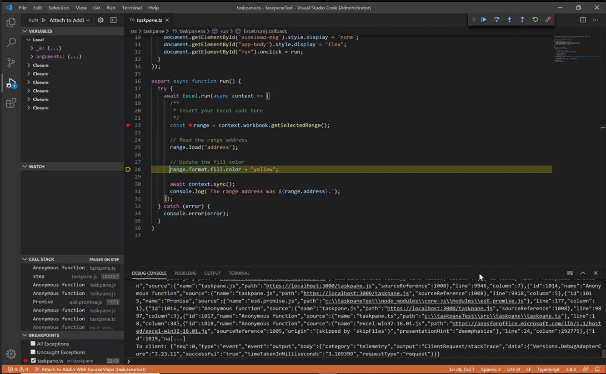

# <a name="microsoft-office-add-in-debugger-extension-for-visual-studio-code"></a>Visual Studio Code 用 Microsoft Office アドイン デバッガー拡張機能

Windows で実行されている Office アドインは、Visual Studio Code の Office アドイン デバッガー拡張機能を使用して、元の WebView (EdgeHTML) ランタイムを使用してMicrosoft Edge 従来版に対してデバッグできます。 

> [!IMPORTANT]
> この記事は、Office アドインで使用されるブラウザーで説明されているように、Office が元の WebView (EdgeHTML) ランタイム[でアドインを](../concepts/browsers-used-by-office-web-add-ins.md)実行する場合にのみ適用されます。Microsoft Edge WebView2 (Chromium ベース) に対する Visual Studio コードでのデバッグの手順については、「[Visual Studio Code 用 Microsoft Office アドイン デバッガー拡張機能](debug-desktop-using-edge-chromium.md)」を参照してください。

> [!TIP]
> Visual Studio Code に組み込まれているツールを使用してデバッグできない場合、または望まない場合は、デバッグします。または、アドインが Visual Studio Code の外部で実行されている場合にのみ発生する問題が発生している場合は、「Microsoft Edge 従来版の開発者ツールを使用してアドインをデバッグする」で説明されているように、Edge レガシ開発者ツールを使用して Edge Legacy (EdgeHTML) ランタイム[をデバッグ](debug-add-ins-using-devtools-edge-legacy.md)できます。

このデバッグ モードは動的であるため、コードの実行中にブレークポイントを設定できます。 デバッガーがアタッチされている間は、デバッグ セッションを失うことなく、コード内の変更をすぐに確認できます。 コードの変更も保持されるため、コードに対する複数の変更の結果を確認できます。 次の画像は、この拡張機能の動作を示しています。



## <a name="prerequisites"></a>前提条件

- [Visual Studio Code](https://code.visualstudio.com/)
- [Node.js (バージョン 10 以上)](https://nodejs.org/)
- Windows 10, 11
- [Microsoft Edge](https://www.microsoft.com/edge)Office アドインで使用されるブラウザーで説明されているように、元の Web ビュー (EdgeHTML) でMicrosoft Edge 従来版をサポートするプラットフォームと Office アプリケーション[の](../concepts/browsers-used-by-office-web-add-ins.md)組み合わせ。

## <a name="install-and-use-the-debugger"></a>デバッガーをインストールして使用する

これらの手順は、コマンド ラインの使用経験があり、基本的な JavaScript を理解し、Office アドイン [用 Yeoman ジェネレーター](../develop/yeoman-generator-overview.md)を使用する前に Office アドイン プロジェクトを作成したことを前提としています。この操作をまだ行っていない場合は、この [Excel Office アドイン](../tutorials/excel-tutorial.md)チュートリアルのようなチュートリアルの 1 つにアクセスすることを検討してください。

1. 最初の手順は、プロジェクトとその作成方法によって異なります。

   - Visual Studio Code でデバッグを試すプロジェクトを作成する場合は、 [Office アドイン用の Yeoman ジェネレーター](../develop/yeoman-generator-overview.md)を使用します。これを行うには、 [Outlook アドインクイック スタート](../quickstarts/outlook-quickstart.md)などのクイック スタート ガイドのいずれかを使用します。
   - Yo Office で作成された既存のプロジェクトをデバッグする場合は、スキップして次の手順に進みます。
   - Yo Office で作成されていない既存のプロジェクトをデバッグする場合は、 [付録](#appendix) の手順を実行し、この手順の次の手順に戻ります。


1. VS Code を開始し、プロジェクトを開きます。 

1. VS Code で **Ctrl キー + Shift キー + X キー** を選択して、拡張機能バーを開きます。 "Microsoft Office アドイン デバッガー" 拡張機能を検索してインストールします。

1. **[表示] > [実行]** を選択するか、**Ctrl + Shift + D** キーを入力してデバッグ ビューに切り替えます。

1. **[実行とデバッグ**] オプションから、**Outlook Desktop (Edge Legacy)** などのホスト アプリケーションのエッジ レガシ オプションを選択します。 **F5** キーを選択するか、メニューから **[実行]、[デバッグの開始]** の順に選択してデバッグを開始します。 この操作により、アドインをホストするローカル サーバーがノード ウィンドウで自動的に起動され、Excel や Word などのホスト アプリケーションが自動的に開きます。 これには数秒かかる場合があります。

1. ホスト アプリケーションで、アドインを使用する準備ができました。 **[作業ウィンドウの表示]** を選択するか、その他のアドイン コマンドを実行します。 次のようなダイアログ ボックスが表示されます。

   > WebView は読み込み時に停止します。
   > WebView をデバッグするには、Microsoft Debugger for Edge 拡張機能を使用して VS Code を WebView インスタンスにアタッチし、[ **OK] を** クリックして続行します。 このダイアログが今後表示されないようにするには、[キャンセル] をクリック **します**。

   **[OK]** を選択します。

   > [!NOTE]
   > **[キャンセル]** を選択すると、このアドインのインスタンスの実行中はダイアログが表示されなくなります。 ただし、アドインを再起動すると、ダイアログはもう一度表示されます。

1. プロジェクトの作業ウィンドウ ファイルにブレークポイントを設定します。 Visual Studio Code でブレークポイントを設定するには、コード行の横にマウス ポインターを置き、表示される赤い円を選択します。

    

1. ブレークポイントを使用して行を呼び出すアドインの機能を実行します。 ブレークポイントがヒットし、ローカル変数を検査できます。

   > [!NOTE]
   > `Office.initialize` または `Office.onReady` の呼び出しのブレークポイントは無視されます。 これらのメソッドの詳細については、「 [Office アドインを初期化する](../develop/initialize-add-in.md)」 を参照してください。

> [!IMPORTANT]
> デバッグ セッションを停止する最善の方法は、**Shift キーを押しながら F5 キー** を押すか、メニューから **[実行] > [デバッグの停止]** を選択することです。 この操作では、ノード サーバー ウィンドウを閉じてホスト アプリケーションを閉じようとしますが、ドキュメントを保存するかどうかを確認するプロンプトがホスト アプリケーションに表示されます。 適切な選択を行い、ホスト アプリケーションを閉じます。 ノード ウィンドウまたはホスト アプリケーションを手動で閉じないようにします。 これを行うと、特にデバッグ セッションの停止と開始を繰り返している時に、バグが発生する可能性があります。
>
> デバッグが動作を停止する場合、たとえば、ブレークポイントが無視される場合などは、デバッグを停止します。 その後、必要に応じて、すべてのホスト アプリケーション ウィンドウとノード ウィンドウを閉じます。 最後に、Visual Studio Code を閉じて、もう一度開きます。

### <a name="appendix"></a>付録

プロジェクトが Yo Office で作成されていない場合は、Visual Studio Code のデバッグ構成を作成する必要があります。 

1. プロジェクトの `\.vscode` フォルダーに `launch.json` という名前のファイルがまだ存在しない場合は作成します。 
1. ファイルに `configurations` 配列があることを確認します。 `launch.json` の簡単な例を次に示します。

    ```json
    {
      // other properities may be here.

      "configurations": [

        // configuration objects may be here.

      ]

      //other properies may be here.
    }
    ```

1. `configurations` 配列に次のオブジェクトを追加します。

    ```json
    {
      "name": "HOST Desktop (Edge Legacy)",
      "type": "office-addin",
      "request": "attach",
      "url": "https://localhost:3000/taskpane.html?_host_Info=HOST$Win32$16.01$en-US$$$$0",
      "port": 9222,
      "timeout": 600000,
      "webRoot": "${workspaceRoot}",
      "preLaunchTask": "Debug: HOST Desktop",
      "postDebugTask": "Stop Debug"
    }
    ```

1. 3 つの場所すべてにあるプレースホルダー`HOST`を、アドインが実行する Office アプリケーションの名前に置き換えます。たとえば、`Outlook`.`Word`
1. ファイルを保存して閉じます。

## <a name="see-also"></a>関連項目

- [Office アドインのテストとデバッグ](test-debug-office-add-ins.md)
- [Visual Studio Code と Microsoft Edge WebView2 (Chromium ベース) を使用して Windows でアドインをデバッグ](debug-desktop-using-edge-chromium.md)します。
- [Internet Explorer の開発者ツールを使用してアドインをデバッグする](debug-add-ins-using-f12-tools-ie.md)
- [Edge レガシー用の開発者ツールを使用してアドインをデバッグする](debug-add-ins-using-devtools-edge-legacy.md)
- [Microsoft Edge (Chromium ベース)で開発者ツールを使用してアドインをデバッグする](debug-add-ins-using-devtools-edge-chromium.md)
- [作業ウィンドウからデバッガーをアタッチする](attach-debugger-from-task-pane.md)
- [Office アドインのランタイム](runtimes.md)