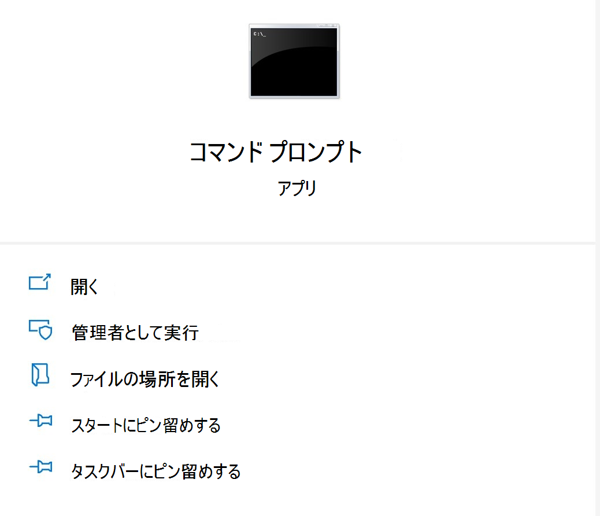

# <a name="microsoft-office-add-in-debugger-extension-for-visual-studio-code"></a>Visual Studio Code 用 Microsoft Office アドイン デバッガー拡張機能

Microsoft Office Visual Studio コード用のアドイン デバッガー拡張機能を使用すると、元の webView (EdgeHTML) ランタイムを使用して Microsoft Edge に対して Office アドインをデバッグできます。 Microsoft Edge WebView2 (Chromium ベース) に対するデバッグの手順については、この [記事を参照してください。](./debug-desktop-using-edge-chromium.md)

このデバッグ モードは動的で、コードの実行中にブレークポイントを設定できます。 デバッガーがアタッチされている間は、デバッグ セッションを失わずに、コードの変更をすぐに確認できます。 コードの変更も保持されます。そのため、コードに対する複数の変更の結果を確認できます。 次の図は、この拡張機能の動作を示しています。


## <a name="prerequisites"></a>前提条件

- [Visual Studioコード](https://code.visualstudio.com/) (管理者として実行する必要があります)
- [Node.js (バージョン 10 以上)](https://nodejs.org/)
- Windows 10
- [Microsoft Edge](https://www.microsoft.com/edge)

これらの手順は、コマンド ラインの使用経験、基本的な JavaScript の理解、Yo Office ジェネレーターを使用する前に Office アドイン プロジェクトを作成した経験を前提にしています。 この方法をまだ行っていない場合は、次の Excel やアドインのチュートリアルOffice、チュートリアル [のいずれかを](../tutorials/excel-tutorial.md)参照してください。

## <a name="install-and-use-the-debugger"></a>デバッガーをインストールして使用する

1. アドイン プロジェクトを作成する必要がある場合は [、Yo Office ジェネレーターを使用して作成します](../quickstarts/excel-quickstart-jquery.md?tabs=yeomangenerator)。 コマンド ライン内のプロンプトに従って、プロジェクトを設定します。 必要に応じて、任意の言語または種類のプロジェクトを選択できます。

> [!NOTE]
> プロジェクトが既に存在する場合は、手順 1 をスキップして手順 2 に進みます。

2. 管理者としてコマンド プロンプトを開きます。
   

3. プロジェクト ディレクトリに移動します。

4. 次のコマンドを実行して、管理者として Visual Studioコードでプロジェクトを開きます。

```command&nbsp;line
code .
```

コードVisual Studio開いた後、手動でプロジェクト フォルダーに移動します。

> [!TIP]
> 管理者として Visual Studio コードを開く場合は、Windowsでコードを検索した後、Visual Studio コードを開く際に管理者として実行オプションを選択します。

5. VS Code 内で **Ctrl + Shift + X** キーを押して拡張機能バーを開きます。 "Microsoft Office アドイン デバッガー" 拡張機能を検索してインストールします。

6. プロジェクトの .vscode フォルダーで、ファイルのlaunch.js **開** きます。 セクションに次のコードを追加 `configurations` します。

```JSON
{
  "type": "office-addin",
  "request": "attach",
  "name": "Attach to Office Add-ins",
  "port": 9222,
  "trace": "verbose",
  "url": "https://localhost:3000/taskpane.html?_host_Info=HOST$Win32$16.01$en-US$$$$0",
  "webRoot": "${workspaceFolder}",
  "timeout": 45000
}
```

7. コピーした JSON のセクションで、"url" セクションを探します。 この URL では、大文字の HOST テキストを、アドインをホストしているアプリケーションに置Officeがあります。 たとえば、Office アドインが Excel 用の場合、URL 値は https://localhost:3000/taskpane.html?_host_Info= <strong>"Excel</strong>$Win 32$16.01$en-US$ \$ \$ \$ 0" になります。

8. コマンド プロンプトを開き、プロジェクトのルート フォルダーに移動します。 コマンドを実行 `npm start` して開発サーバーを起動します。 アドインがクライアントに読み込Office作業ウィンドウを開きます。

9. コードにVisual Studioし、[デバッグ] で[>] を選択するか **、Ctrl + Shift + D** キーを押してデバッグ ビューに切り替えます。

10. [デバッグ] オプションで、[アドイン **にアタッチOffice選択します**。F5 **キーを押** するか、[デバッグ] **->メニュー** から [デバッグの開始] を選択してデバッグを開始します。

11. プロジェクトの作業ウィンドウ ファイルにブレークポイントを設定します。 VS Code でブレークポイントを設定するには、コード行の横にカーソルを合わせると、表示される赤い円を選択します。


12. アドインを実行します。 ブレークポイントにヒットしたと表示され、ローカル変数を検査できます。

## <a name="see-also"></a>関連項目

* [Office アドインのテストとデバッグ](test-debug-office-add-ins.md)

* [Windows 10 で開発者ツールを使用してアドインをデバッグする](debug-add-ins-using-f12-developer-tools-on-windows-10.md)

* [Microsoft Edge WebView2 (Chromium ベース) を使用して Windows でアドインをデバッグする](debug-desktop-using-edge-chromium.md)
