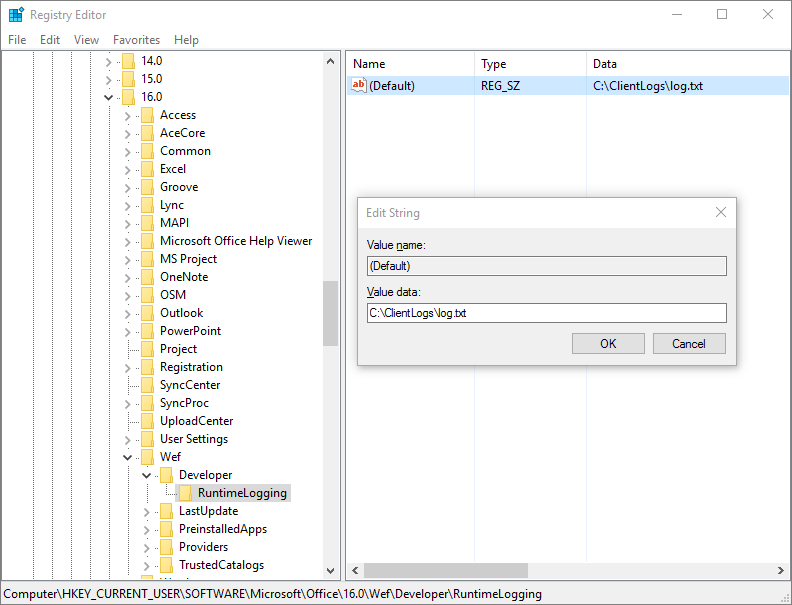

# <a name="debug-your-add-in-with-runtime-logging"></a><span data-ttu-id="4f86e-103">ランタイム ログを使用してアドインをデバッグする</span><span class="sxs-lookup"><span data-stu-id="4f86e-103">Debug your add-in with runtime logging</span></span>

<span data-ttu-id="4f86e-104">ランタイム ログを使用して、アドインのマニフェストやいくつかのインストール エラーをデバッグできます。</span><span class="sxs-lookup"><span data-stu-id="4f86e-104">You can use runtime logging to debug your add-in's manifest as well as several installation errors.</span></span> <span data-ttu-id="4f86e-105">この機能は、リソース ID の不一致のような XSD スキーマ検証では検出されないマニフェストの問題を識別して修正するのに役立ちます。</span><span class="sxs-lookup"><span data-stu-id="4f86e-105">This feature can help you identify and fix issues with your manifest that are not detected by XSD schema validation, such as a mismatch between resource IDs.</span></span> <span data-ttu-id="4f86e-106">ランタイム ログは、アドイン コマンドと Excel カスタム関数を実装するアドインのデバッグに特に有効です。</span><span class="sxs-lookup"><span data-stu-id="4f86e-106">Runtime logging is particularly  useful for debugging add-ins that implement add-in commands and Excel custom functions.</span></span>

> [!NOTE]
> <span data-ttu-id="4f86e-107">ランタイム ログ機能は、2016 Office以降のデスクトップで使用できます。</span><span class="sxs-lookup"><span data-stu-id="4f86e-107">The runtime logging feature is currently available for Office 2016 or later on desktop.</span></span>

> [!IMPORTANT]
> <span data-ttu-id="4f86e-p102">ランタイムのログはパフォーマンスに影響します。アドイン マニフェストに関する問題をデバッグする必要がある場合にのみ有効にしてください。</span><span class="sxs-lookup"><span data-stu-id="4f86e-p102">Runtime Logging affects performance. Turn it on only when you need to debug issues with your add-in manifest.</span></span>

## <a name="use-runtime-logging-from-the-command-line"></a><span data-ttu-id="4f86e-110">コマンド ラインからランタイム ログを使用する</span><span class="sxs-lookup"><span data-stu-id="4f86e-110">Use runtime logging from the command line</span></span>

<span data-ttu-id="4f86e-111">コマンド ラインからランタイム ログを有効にするのが、このログ ツールを使用する最も簡単な方法です。</span><span class="sxs-lookup"><span data-stu-id="4f86e-111">Enabling runtime logging from the command line is the fastest way to use this logging tool.</span></span> <span data-ttu-id="4f86e-112">これは、npm@5.2.0+ の一部として既定で提供される npx を使用します。</span><span class="sxs-lookup"><span data-stu-id="4f86e-112">These use npx, which is provided by default as part of npm@5.2.0+.</span></span> <span data-ttu-id="4f86e-113">以前のバージョンの [npm](https://www.npmjs.com/) を使用している場合は、[Windows でのランタイム ログ](#runtime-logging-on-windows)の手順か [Mac でのランタイム ログ](#runtime-logging-on-mac)の手順、または [npx のインストール](https://www.npmjs.com/package/npx)をお試しください。</span><span class="sxs-lookup"><span data-stu-id="4f86e-113">If you have an earlier version of [npm](https://www.npmjs.com/), try [Runtime logging on Windows](#runtime-logging-on-windows) or [Runtime logging on Mac](#runtime-logging-on-mac) instructions, or [install npx](https://www.npmjs.com/package/npx).</span></span>

- <span data-ttu-id="4f86e-114">ランタイムのログを有効にするには、以下を実行します。</span><span class="sxs-lookup"><span data-stu-id="4f86e-114">To enable runtime logging:</span></span>

    ```command&nbsp;line
    npx office-addin-dev-settings runtime-log --enable
    ```

- <span data-ttu-id="4f86e-115">特定のファイルに対してのみランタイム ログを有効にするには、ファイル名と同じコマンドを使用します。</span><span class="sxs-lookup"><span data-stu-id="4f86e-115">To enable runtime logging only for a specific file, use the same command with a filename:</span></span>

    ```command&nbsp;line
    npx office-addin-dev-settings runtime-log --enable [filename.txt]
    ```

- <span data-ttu-id="4f86e-116">ランタイム ログを無効にするには、以下を実行します。</span><span class="sxs-lookup"><span data-stu-id="4f86e-116">To disable runtime logging:</span></span>

    ```command&nbsp;line
    npx office-addin-dev-settings runtime-log --disable
    ```

- <span data-ttu-id="4f86e-117">ランタイム ログが有効になっているかどうかを表示するには、以下を実行します。</span><span class="sxs-lookup"><span data-stu-id="4f86e-117">To display whether runtime logging is enabled:</span></span>

    ```command&nbsp;line
    npx office-addin-dev-settings runtime-log
    ```

- <span data-ttu-id="4f86e-118">ランタイム ログのコマンド ライン内にヘルプを表示するには、以下を実行します。</span><span class="sxs-lookup"><span data-stu-id="4f86e-118">To display help within the command line for runtime logging:</span></span>

    ```command&nbsp;line
    npx office-addin-dev-settings runtime-log --help
    ```

## <a name="runtime-logging-on-windows"></a><span data-ttu-id="4f86e-119">Windows でのランタイム ログ</span><span class="sxs-lookup"><span data-stu-id="4f86e-119">Runtime logging on Windows</span></span>

1. <span data-ttu-id="4f86e-120">Office 2016 デスクトップのビルド **16.0.7019** 以降を実行していることを確認します。</span><span class="sxs-lookup"><span data-stu-id="4f86e-120">Make sure that you are running Office 2016 desktop build **16.0.7019** or later.</span></span>

2. <span data-ttu-id="4f86e-121">`HKEY_CURRENT_USER\SOFTWARE\Microsoft\Office\16.0\WEF\Developer\` の下に `RuntimeLogging` レジストリ キーを追加します。</span><span class="sxs-lookup"><span data-stu-id="4f86e-121">Add the `RuntimeLogging` registry key under `HKEY_CURRENT_USER\SOFTWARE\Microsoft\Office\16.0\WEF\Developer\`.</span></span>

    [!include[Developer registry key](../includes/developer-registry-key.md)]


3. <span data-ttu-id="4f86e-122">**RuntimeLogging** キーの既定値にログを書き込むファイルの完全なパスを設定します。</span><span class="sxs-lookup"><span data-stu-id="4f86e-122">Set the default value of the **RuntimeLogging** key to the full path of the file where you want the log to be written.</span></span> <span data-ttu-id="4f86e-123">例については、[EnableRuntimeLogging.zip](https://github.com/OfficeDev/Office-Add-in-Commands-Samples/raw/master/Tools/RuntimeLogging/EnableRuntimeLogging.zip) を参照してください。</span><span class="sxs-lookup"><span data-stu-id="4f86e-123">For an example, see [EnableRuntimeLogging.zip](https://github.com/OfficeDev/Office-Add-in-Commands-Samples/raw/master/Tools/RuntimeLogging/EnableRuntimeLogging.zip).</span></span>

    > [!NOTE]
    > <span data-ttu-id="4f86e-124">ログ ファイルが書き込まれるディレクトリが既に存在しており、書き込みアクセス許可がある必要があります。</span><span class="sxs-lookup"><span data-stu-id="4f86e-124">The directory in which the log file will be written must already exist, and you must have write permissions to it.</span></span>

<span data-ttu-id="4f86e-p105">レジストリは次の図のようになります。 この機能を無効にするには、`RuntimeLogging` キーをレジストリから削除します。</span><span class="sxs-lookup"><span data-stu-id="4f86e-p105">The following image shows what the registry should look like. To turn the feature off, remove the `RuntimeLogging` key from the registry.</span></span>



## <a name="runtime-logging-on-mac"></a><span data-ttu-id="4f86e-128">Mac でのランタイム ログ</span><span class="sxs-lookup"><span data-stu-id="4f86e-128">Runtime logging on Mac</span></span>

1. <span data-ttu-id="4f86e-129">Office 2016 デスクトップのビルド **16.27** (19071500) 以降を実行していることを確認します。</span><span class="sxs-lookup"><span data-stu-id="4f86e-129">Make sure that you are running Office 2016 desktop build **16.27** (19071500) or later.</span></span>

2. <span data-ttu-id="4f86e-130">**ターミナル** を開き、`defaults`コマンドを使用してランタイム ログの優先度を設定します。</span><span class="sxs-lookup"><span data-stu-id="4f86e-130">Open **Terminal** and set a runtime logging preference by using the `defaults` command:</span></span>

    ```command&nbsp;line
    defaults write <bundle id> CEFRuntimeLoggingFile -string <file_name>
    ```

    <span data-ttu-id="4f86e-131">`<bundle id>`は、ランタイム ログを有効にするホストを識別します。</span><span class="sxs-lookup"><span data-stu-id="4f86e-131">`<bundle id>` identifies which the host for which to enable runtime logging.</span></span> <span data-ttu-id="4f86e-132">`<file_name>`は、ログが書き込まれるテキスト ファイルの名前です。</span><span class="sxs-lookup"><span data-stu-id="4f86e-132">`<file_name>` is the name of the text file to which the log will be written.</span></span>

    <span data-ttu-id="4f86e-133">対応 `<bundle id>` するアプリケーションのランタイム ログを有効にするには、次のいずれかの値に設定します。</span><span class="sxs-lookup"><span data-stu-id="4f86e-133">Set `<bundle id>` to one of the following values to enable runtime logging for the corresponding application:</span></span>

    - `com.microsoft.Word`
    - `com.microsoft.Excel`
    - `com.microsoft.Powerpoint`
    - `com.microsoft.Outlook`

<span data-ttu-id="4f86e-134">以下の例では、Word のランタイム ログを有効にし、それからログ ファイルを開きます。</span><span class="sxs-lookup"><span data-stu-id="4f86e-134">The following example enables runtime logging for Word and then opens the log file:</span></span>

```command&nbsp;line
defaults write com.microsoft.Word CEFRuntimeLoggingFile -string "runtime_logs.txt"
open ~/library/Containers/com.microsoft.Word/Data/runtime_logs.txt
```

> [!NOTE]
> <span data-ttu-id="4f86e-135">ランタイム ログを有効にするには、`defaults`コマンドを実行した後に Office を再起動する必要があります。</span><span class="sxs-lookup"><span data-stu-id="4f86e-135">You'll need to restart Office after running the `defaults` command to enable runtime logging.</span></span>

<span data-ttu-id="4f86e-136">ランタイム ログを無効にするには、`defaults delete`コマンドを使用します。</span><span class="sxs-lookup"><span data-stu-id="4f86e-136">To turn off runtime logging, use the `defaults delete` command:</span></span>

```command&nbsp;line
defaults delete <bundle id> CEFRuntimeLoggingFile
```

<span data-ttu-id="4f86e-137">以下の例は、Word のランタイム ログをオフにします。</span><span class="sxs-lookup"><span data-stu-id="4f86e-137">The following example will turn off runtime logging for Word:</span></span>

```command&nbsp;line
defaults delete com.microsoft.Word CEFRuntimeLoggingFile
```

## <a name="use-runtime-logging-to-troubleshoot-issues-with-your-manifest"></a><span data-ttu-id="4f86e-138">ランタイム ログを使用してマニフェストでの問題のトラブルシューティングを行う</span><span class="sxs-lookup"><span data-stu-id="4f86e-138">Use runtime logging to troubleshoot issues with your manifest</span></span>

<span data-ttu-id="4f86e-139">ランタイムのログを使用してアドインの読み込みに関する問題のトラブルシューティングを行うには、次のようにします。</span><span class="sxs-lookup"><span data-stu-id="4f86e-139">To use runtime logging to troubleshoot issues loading an add-in:</span></span>

1. <span data-ttu-id="4f86e-140">テスト用に[アドインをサイドロード](sideload-office-add-ins-for-testing.md)します。</span><span class="sxs-lookup"><span data-stu-id="4f86e-140">[Sideload your add-in](sideload-office-add-ins-for-testing.md) for testing.</span></span>

    > [!NOTE]
    > <span data-ttu-id="4f86e-141">ログ ファイルのメッセージ数を最小限に抑えるため、テストするアドインのみをサイドロードすることをお勧めします。</span><span class="sxs-lookup"><span data-stu-id="4f86e-141">We recommend that you sideload only the add-in that you are testing to minimize the number of messages in the log file.</span></span>

2. <span data-ttu-id="4f86e-142">何も起こらず、アドインが表示されない (アドイン ダイアログ ボックスにも表示されない) 場合は、ログ ファイルを開きます。</span><span class="sxs-lookup"><span data-stu-id="4f86e-142">If nothing happens and you don't see your add-in (and it's not appearing in the add-ins dialog box), open the log file.</span></span>

3. <span data-ttu-id="4f86e-p107">ログ ファイルでアドインの ID を検索します。ID はマニフェストで定義します。ログ ファイルでは、この ID には `SolutionId` というラベルが付いています。</span><span class="sxs-lookup"><span data-stu-id="4f86e-p107">Search the log file for your add-in ID, which you define in your manifest. In the log file, this ID is labeled `SolutionId`.</span></span>

## <a name="known-issues-with-runtime-logging"></a><span data-ttu-id="4f86e-145">ランタイムのログに関する既知の問題</span><span class="sxs-lookup"><span data-stu-id="4f86e-145">Known issues with runtime logging</span></span>

<span data-ttu-id="4f86e-p108">混乱を招くメッセージまたは正しく分類されていないメッセージがログ ファイルに書き込まれることがあります。たとえば次のような場合です。</span><span class="sxs-lookup"><span data-stu-id="4f86e-p108">You might see messages in the log file that are confusing or that are classified incorrectly. For example:</span></span>

- <span data-ttu-id="4f86e-148">メッセージ "`Medium Current host not in add-in's host list`" に続く "`Unexpected Parsed manifest targeting different host`" は、誤ってエラーとして分類されています。</span><span class="sxs-lookup"><span data-stu-id="4f86e-148">The message `Medium Current host not in add-in's host list` followed by `Unexpected Parsed manifest targeting different host` is incorrectly classified as an error.</span></span>

- <span data-ttu-id="4f86e-149">SolutionId が含まれていないメッセージ "`Unexpected Add-in is missing required manifest fields    DisplayName`" は、多くの場合、エラーはデバッグ対象のアドインと関係ありません。</span><span class="sxs-lookup"><span data-stu-id="4f86e-149">If you see the message `Unexpected Add-in is missing required manifest fields    DisplayName` and it doesn't contain a SolutionId, the error is most likely not related to the add-in you are debugging.</span></span>

- <span data-ttu-id="4f86e-p109">`Monitorable` メッセージは、システムの観点からのエラーと予想されます。場合によっては、スキップされたがマニフェスト失敗の原因にはならなかったスペル ミスのある要素のような、マニフェストの問題を示していることがあります。</span><span class="sxs-lookup"><span data-stu-id="4f86e-p109">Any `Monitorable` messages are expected errors from a system point of view. Sometimes they indicate an issue with your manifest, such as a misspelled element that was skipped but didn't cause the manifest to fail.</span></span>

## <a name="see-also"></a><span data-ttu-id="4f86e-152">関連項目</span><span class="sxs-lookup"><span data-stu-id="4f86e-152">See also</span></span>

- [<span data-ttu-id="4f86e-153">Office アドインの XML マニフェスト</span><span class="sxs-lookup"><span data-stu-id="4f86e-153">Office Add-ins XML manifest</span></span>](../develop/add-in-manifests.md)
- [<span data-ttu-id="4f86e-154">Office アドインのマニフェストを検証する</span><span class="sxs-lookup"><span data-stu-id="4f86e-154">Validate an Office Add-in's manifest</span></span>](troubleshoot-manifest.md)
- [<span data-ttu-id="4f86e-155">Office のキャッシュをクリアする</span><span class="sxs-lookup"><span data-stu-id="4f86e-155">Clear the Office cache</span></span>](clear-cache.md)
- [<span data-ttu-id="4f86e-156">テスト用に Office アドインをサイドロードする</span><span class="sxs-lookup"><span data-stu-id="4f86e-156">Sideload Office Add-ins for testing</span></span>](sideload-office-add-ins-for-testing.md)
- [<span data-ttu-id="4f86e-157">Office アドインをデバッグする</span><span class="sxs-lookup"><span data-stu-id="4f86e-157">Debug Office Add-ins</span></span>](debug-add-ins-using-f12-developer-tools-on-windows-10.md)
