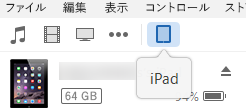
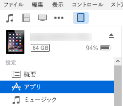
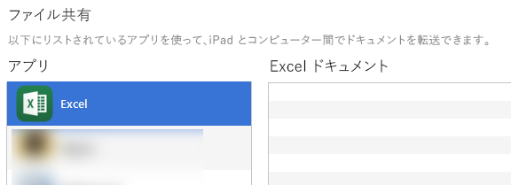

# テスト用に iPad と Mac で Office アドインをサイドロードするSideload Office Add-ins on iPad and Mac for testing

Office for iOS でのアドインの実行状況を確認するには、iTunes を 使用してアドインのマニフェストを iPad にサイドロードするか、アドインのマニフェストを Office for Mac で直接サイドロードします。このアクションでは、ブレークポイントを設定したり、アドインのコードを実行中にデバッグすることはできませんが、その動作を確認したり、UI が使用可能であり適切にレンダリングされることを確認できます。To see how your add-in will run in Office for iOS, you can sideload your add-in's manifest onto an iPad using iTunes, or sideload your add-in's manifest directly in Office for Mac. This action won't enable you to set breakpoints and debug your add-in's code while it's running, but you can see how it behaves and verify that the UI is usable and rendering appropriately. 

## Office for iOS の前提条件Prerequisites for Office for iOS

- [iTunes](http://www.apple.com/itunes/download/) がインストールされた Windows または Mac コンピュータ。A Windows or Mac computer with [iTunes](http://www.apple.com/itunes/download/) installed.
    
- [Excel for iPad](https://itunes.apple.com/us/app/microsoft-excel/id586683407?mt=8) がインストールされた iOS 8.2 以上の iPad と同期ケーブル。An iPad running iOS 8.2 or later with [Excel for iPad](https://itunes.apple.com/us/app/microsoft-excel/id586683407?mt=8) installed, and a sync cable.
    
- テスト対象アドインのマニフェスト .xml ファイル。The manifest .xml file for the add-in you want to test.
    

## Office for Mac の前提条件Prerequisites for Office for Mac

- [Office for Mac](https://products.office.com/buy/compare-microsoft-office-products?tab=omac) をインストールし、OS X v10.10 "Yosemite" 以降で動作している Mac。A Mac running OS X v10.10 "Yosemite" or later with [Office for Mac](https://products.office.com/buy/compare-microsoft-office-products?tab=omac) installed.
    
- Word for Mac バージョン 15.18 (160109)。Word for Mac version 15.18 (160109).
   
- Excel for Mac バージョン 15.19 (160206)。Excel for Mac version 15.19 (160206).

- PowerPoint for Mac バージョン 15.24 (160614)PowerPoint for Mac version 15.24 (160614)
    
- テスト対象アドインのマニフェスト .xml ファイル。The manifest .xml file for the add-in you want to test.
    

## Excel for iPad または Word for iPad のアドインをサイドロードするSideload an add-in on Excel or Word for iPad

1. 同期ケーブルを使用し、iPad をコンピューターに接続します。iPad を初めてコンピューターに接続する場合、**[このコンピューターを信頼しますか?]** というメッセージが表示されるので、**[信頼する]** を選択して続行します。Use a sync cable to connect your iPad to your computer. If you're connecting the iPad to your computer for the first time, you'll be prompted with  **Trust This Computer?**. Choose **Trust** to continue.

2. iTunes のメニュー バーの下にある **[iPad]** アイコンをクリックします。In iTunes, choose the  **iPad** icon below the menu bar.
    
    

3. iTunes の左側にある  **[設定]** で、 **[App]** をクリックします。Under  **Settings** on the left side of iTunes, choose **Apps**.
    
    

4. iTunes の右側で、 **[ファイル共有]** までスクロールしてから、 **[アドイン]** 列で **[Excel]** または **[Word]** をクリックします。On the right side of iTunes, scroll down to  **File Sharing**, and then choose  **Excel** or **Word** in the **Add-ins** column.
    
    

5. **[Excel]** 列または **[Word ドキュメント]** 列の下部で、 **[ファイルの追加]** をクリックしてから、サイドロードするアドインのマニフェスト .xml ファイルを選択します。At the bottom of the  **Excel** or **Word Documents** column, choose **Add File**, and then select the manifest .xml file of the add-in you want to sideload. 
    
6. iPad で Excel または Word アプリを開きます。Excel または Word アプリがすでに実行されている場合は、 **[ホーム]** ボタンを選択し、アプリを閉じてから再起動します。Open the Excel or Word app on your iPad. If the Excel or Word app is already running, choose the  **Home** button, and then close and restart the app.
    
7. ドキュメントを開きます。Open a document.
    
8. **[挿入]** タブで **[アドイン]** をクリックします。 **[アドイン]** UI の **[開発者]** という見出しの下に、サイドロードしたアドインが表示され、挿入するために選択できます。Choose  **Add-ins** on the **Insert** tab. Your sideloaded add-in is available to insert under the **Developer** heading in the **Add-ins** UI.
    
    

## Office for Mac でアドインをサイドロードするSideload an add-in on Office for Mac

> [!NOTE]
> Outlook for Mac アドインをサイドロードするには、「[テスト用に Outlook アドインをサイドロードする](https://docs.microsoft.com/outlook/add-ins/sideload-outlook-add-ins-for-testing)」をご参照ください。To sideload Outlook 2016 for Mac add-in, see [Sideload Outlook add-ins for testing](https://docs.microsoft.com/outlook/add-ins/sideload-outlook-add-ins-for-testing).

1. **ターミナル**を開き、アプリに対応するフォルダーに移動しアドインのマニフェスト ファイルを保存します。`wef` フォルダーがコンピューターにない場合には作成します。Open  **Terminal** and go to one of the following folders where you'll save your add-in's manifest file. If the `wef` folder doesn't exist on your computer, create it.
    
    - Word の場合:  `/Users/<username>/Library/Containers/com.microsoft.Word/Data/documents/wef`For Word:  `/Users/<username>/Library/Containers/com.microsoft.Word/Data/documents/wef`    
    - Excel の場合:  `/Users/<username>/Library/Containers/com.microsoft.Excel/Data/documents/wef`For Excel:  `/Users/<username>/Library/Containers/com.microsoft.Excel/Data/documents/wef`
    - PowerPoint の場合: `/Users/<username>/Library/Containers/com.microsoft.Powerpoint/Data/documents/wef`For PowerPoint: `/Users/<username>/Library/Containers/com.microsoft.Powerpoint/Data/documents/wef`
    
2. **Finder** で `open .` コマンド (ピリオドまたはドットを含む) を使用してフォルダーを開き、アドインのマニフェスト ファイルをこのフォルダーにコピーします。Open the folder in  **Finder** using the command `open .` (including the period or dot). Copy your add-in's manifest file to this folder.
    
    

3. Word を起動し、ドキュメントを開きます。既に起動している場合は、Word を再起動します。Open Word, and then open a document. Restart Word if it's already running.
    
4. Word で、**[挿入]** > **[アドイン]** > **[個人用アドイン]** (ドロップダウン メニュー) を選択し、アドインを選択します。In Word, choose  **Insert** > **Add-ins** > **My Add-ins** (drop-down menu), and then choose your add-in.
    
    

    > [!IMPORTANT]
    > サイドロードしたアドインは [個人用アドイン] ダイアログには表示されず、ドロップダウン メニュー (**[挿入]** タブの [個人用アドイン] の右にある小さな下向き矢印) 内にのみ表示されます。サイドロードしたアドインは、このメニューの見出し **[開発者向けアドイン]** の下に一覧表示されます。Sideloaded add-ins will not show up in the My Add-ins dialog box. They are only visible within the drop-down menu (small down-arrow to the right of My Add-ins on the **Insert** tab). Sideloaded add-ins are listed under the **Developer Add-ins** heading in this menu. 
    
5. Word にアドインが表示されることを確認します。Verify that your add-in is displayed in Word.
    
    
    
    > [!NOTE]
    > Office for Mac は、パフォーマンス上の理由からアドインを頻繁にキャッシュします。アドイン開発中に強制的にリロードする必要がある場合は、`Users/<usr>/Library/Containers/com.Microsoft.OsfWebHost/Data/` フォルダーを消去します。このフォルダーが存在しない場合は、`com.microsoft.Office365ServiceV2/Data/Caches/com.microsoft.Office365ServiceV2/` フォルダーのファイルを消去します。Add-ins are cached often in Office for Mac, for performance reasons. If you need to force a reload of your add-in while you're developing it, you can clear the `Users/<usr>/Library/Containers/com.Microsoft.OsfWebHost/Data/` folder.

## 関連項目See also

- [iPad と Mac で Office アドインをデバッグするDebug Office Add-ins on iPad and Mac](debug-office-add-ins-on-ipad-and-mac.md)
    
