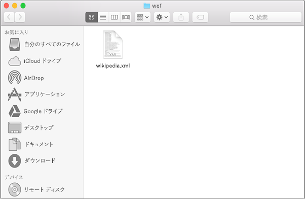

# テスト用の Mac 上の Office アドインをサイドロードする

Office on Mac でのアドインの実行方法を確認するには、アドインのマニフェストをサイドロードします。 このアクションでは、実行中、ブレークポイントを設定したり、アドインのコードをデバッグしたりできませんが、その動作を確認したり、UI が使えることと適切にレンダリングされることを確認できます。

> [!NOTE]
> Outlook アドインをサイドロードするには、「[テストのために Outlook アドインをサイドロードする](../outlook/sideload-outlook-add-ins-for-testing.md)」をご参照ください。

## Office on Mac の前提条件

- [Office on Mac](https://products.office.com/buy/compare-microsoft-office-products?tab=omac) がインストールされていて OS X v10.10 "Yosemite" を実行している Mac。

- Word on Mac バージョン 15.18 (160109)。

- Excel on Mac バージョン 15.19 (160206)。

- PowerPoint on Mac バージョン 15.24 (160614)。

- テスト対象アドインのマニフェスト .xml ファイル。

## Office on Mac にアドインをサイドロードする

1. **Finder を** 使用してマニフェスト ファイルをサイドロードします。 **Finder を** 開き、Command + Shift + G と入力して **、[フォルダーに移動**] ダイアログを開きます。

1. サイドローディングに使用するアプリケーションに基づいて、次のいずれかのファイルパスを入力します。 `wef` フォルダーがコンピューター上に存在しない場合は、作成します。

    - Word の場合: `/Users/<username>/Library/Containers/com.microsoft.Word/Data/Documents/wef`
    - Excel の場合: `/Users/<username>/Library/Containers/com.microsoft.Excel/Data/Documents/wef`
    - PowerPoint の場合: `/Users/<username>/Library/Containers/com.microsoft.Powerpoint/Data/Documents/wef`

        > [!NOTE]
        > 残りの手順では、Word アドインをサイドロードする方法について説明します。

1. アドインのマニフェスト ファイルをこの `wef` フォルダーにコピーします。

    

1. Word を起動し、ドキュメントを開きます。 既に起動している場合は、Word を再起動します。

1. Word で、[アドイン **の** > **挿入** > **] [マイ アドイン**] (ドロップダウン メニュー) を選択し、アドインを選択します。

    

    > [!IMPORTANT]
    > サイドロードしたアドインは [個人用アドイン] ダイアログには表示されません。ドロップダウン メニュー内にのみ表示されます (**[挿入]** タブの [個人用アドイン] の右にある小さい下向き矢印)。サイドロードしたアドインは、このメニューの見出し **[開発者向けアドイン]** の下に一覧表示されます。

1. アドインが Word に表示されることを確認します。

    

## サイドロードされたアドインを削除する

以前にサイドロードされたアドインを削除するには、コンピューター上の Office キャッシュをクリアします。 プラットフォームとアプリケーションごとにキャッシュをクリアする方法の詳細については、「 [Office キャッシュをクリアする」](clear-cache.md)を参照してください。

## 関連項目

- [iPad でテスト用の Office アドインをサイドロードする](sideload-an-office-add-in-on-ipad.md)
- [Mac で Office アドインをデバッグする](debug-office-add-ins-on-ipad-and-mac.md)
- [テスト用に Outlook アドインをサイドロードする](../outlook/sideload-outlook-add-ins-for-testing.md)
