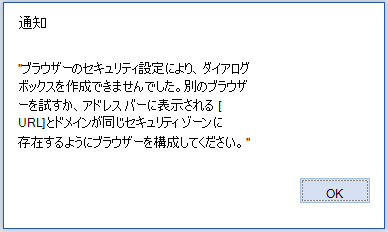

# <a name="troubleshoot-user-errors-with-office-add-ins"></a>Office アドインでのユーザー エラーのトラブルシューティング

時折、ユーザーは開発した Office アドインの問題に遭遇することがあります。たとえば、アドインが読み込みに失敗したり、アクセスできないなどです。この記事の情報は、ユーザーが Office アドインを使用する際に遭遇する一般的な問題を解決するために用いることができます。

また、[Fiddler](https://www.telerik.com/fiddler) を使用して、アドインの問題を特定してデバッグすることもできます。

## <a name="common-errors-and-troubleshooting-steps"></a>一般的なエラーとトラブルシューティングの手順

次の表は、ユーザーが遭遇する可能性がある一般的なエラー メッセージとエラーを解決するためにユーザーが実行できる手順を示しています。

|**エラー メッセージ**|**解決策**|
|:-----|:-----|
|アプリのエラー: カタログに到達できませんでした|ファイアウォールの設定を確認します。「カタログ」は、AppSource を指します。このメッセージは、ユーザーが AppSource にアクセスできないことを示しています。|
|アプリのエラー: このアプリを起動できませんでした。このダイアログを閉じて問題を無視するか、[再起動] をクリックしてもう一度お試しください。|Office の最新の更新プログラムがインストールされていることを確認するか、[Office 2013 更新プログラム ](https://support.microsoft.com/kb/2986156/)をダウンロードします。|
|エラー: オブジェクトがプロパティまたはメソッド 'defineProperty' をサポートしていません|Internet Explorerが互換モードで実行されていないことを確認します。 [ツール] > **[互換表示設定]** に移動します。|
|ブラウザーのバージョンがサポートされていないため、アプリを読み込めませんでした。サポートされているブラウザーのバージョンの一覧についてはここをクリックしてください。|ブラウザーが HTML5 のローカル ストレージをサポートしていることを確認するか、Internet Explorer の設定をリセットします。サポートされているブラウザーの詳細については、「[Office アドインを実行するための要件](../concepts/requirements-for-running-office-add-ins.md)」を参照してください。|

## <a name="when-installing-an-add-in-you-see-error-loading-add-in-in-the-status-bar"></a>アドインをインストールすると、ステータス バーに "アドイン読み込み中のエラー" と表示される

1. Office を終了します。
1. マニフェストが有効であることを確認する
1. アドインを再起動する
1. もう一度アドインをインストールする。

また、フィードバックを寄せることができます。Windows または Mac 用 Excel を使用している場合は、Excel から直接 Office の機能拡張チームにフィードバックを送信できます。 これを行うには、[**ファイル**] | [**フィードバック**] | [**問題点、改善の報告**] の順に選択します。 問題点、改善の報告により、問題を理解するために必要なログが提供されます。

## <a name="outlook-add-in-doesnt-work-correctly"></a>Outlook アドインが正常に機能しない

Windows で実行され、[Internet Explorer を使用している](../concepts/browsers-used-by-office-web-add-ins.md) Outlook アドインが正常に機能しない場合は、Internet Explorer でスクリプトのデバッグを有効にしてみてください。

- [インターネット オプションの詳細設定>**ツール] に**  >  **移動します**。
- **[参照]** で、**[スクリプトのデバッグを無効にする (Internet Explorer)]** と **[スクリプトのデバッグを無効にする (その他)]** の各チェックボックスをオフにします。

これらの設定は、問題のトラブルシューティングを行う場合にのみチェックボックスをオフにすることをお勧めします。チェックボックスをオフにしたままにすると、参照時にメッセージが表示されます。問題が解決したら、**[スクリプトのデバッグを無効にする (Internet Explorer)]** と **[スクリプトのデバッグを無効にする (その他)]** の各チェックボックスをオンにしてください。

## <a name="add-in-doesnt-activate-in-office-2013"></a>Office 2013 でアドインがアクティブにならない

ユーザーが次の手順を実行してもアドインがアクティブ化しない場合。

1. Office 2013 で自分の Microsoft アカウントでサインインする。

1. 自分の Microsoft アカウントの 2 段階検証を有効にする。

1. アドインを挿入しようとする際に、メッセージに従って ID の確認を行う。

Office の最新の更新プログラムがインストールされていることを確認するか、[Office 2013 更新プログラム](https://support.microsoft.com/kb/2986156/)をダウンロードしてください。

## <a name="add-in-dialog-box-cannot-be-displayed"></a>アドイン ダイアログ ボックスを表示できない

Office アドインを使用するとき、ユーザーは、ダイアログ ボックスの表示を許可するよう求められます。 ユーザーが [許可] **を選択** すると、次のエラー メッセージが表示されます。

"ブラウザーのセキュリティ設定により、ダイアログ ボックスを作成できませんでした。別のブラウザーを試すか、アドレス バーに表示される [URL] とドメインが同じセキュリティ ゾーンに存在するようにブラウザーを構成してください。"



|**影響を受けるブラウザー**|**影響を受けるプラットフォーム**|
|:--------------------|:---------------------|
|Microsoft Edge|Office on the web|

この問題を解決するために、エンド ユーザーまたは管理者は、アドインのドメインをブラウザー内の信頼済みサイトの一覧にMicrosoft Edgeできます。

> [!IMPORTANT]
> アドインを信頼しない場合は、信頼済みサイトのリストにアドインの URL を追加しないでください。

URL を信頼済みサイトのリストに追加する方法:

1. [**コントロール パネル**]で、[**インターネット オプション**]  >  [**セキュリティ**] に移動します。
1. **[信頼済みサイト]** ゾーンを選択して、**[サイト]** を選択します。
1. エラー メッセージに表示される URL を入力して、**[追加]** を選択します。
1. アドインの使用をもう一度お試しください。問題が続く場合は、他のセキュリティ ゾーンの設定を変えて、アドインのドメインが Office アプリケーションのアドレス バーに表示される URL と同じゾーンに存在するようにします。

この問題は、ポップアップ モードでダイアログ API が使用されているときに発生します。この問題を防ぐには、[displayInFrame](/javascript/api/office/office.ui) フラグを使います。そのために、ページが iframe 内の表示をサポートしている必要があります。次の例は、フラグの使用方法を示しています。

```js
Office.context.ui.displayDialogAsync(startAddress, {displayInIFrame:true}, callback);
```

## <a name="see-also"></a>関連項目

- [Office アドインでの開発エラーのトラブルシューティング](troubleshoot-development-errors.md)
