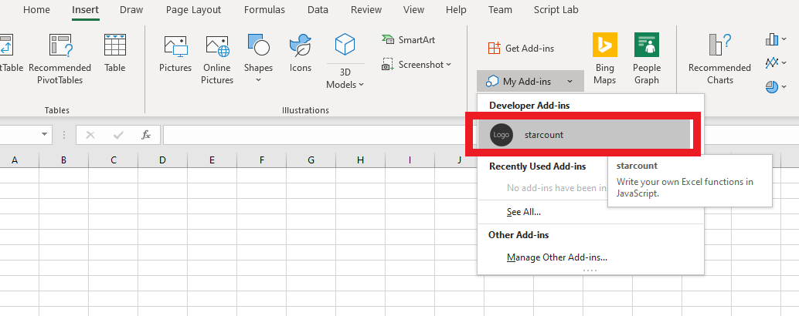
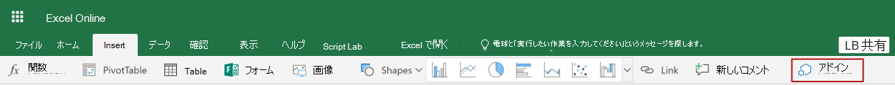

# <a name="tutorial-create-custom-functions-in-excel"></a><span data-ttu-id="1eea0-103">チュートリアル: Excel でのカスタム関数の作成</span><span class="sxs-lookup"><span data-stu-id="1eea0-103">Tutorial: Create custom functions in Excel</span></span>

<span data-ttu-id="1eea0-104">カスタム関数では、関数をアドインの一部として JavaScript で定義することによって、Excel に新しい関数を追加できます。</span><span class="sxs-lookup"><span data-stu-id="1eea0-104">Custom functions enable you to add new functions to Excel by defining those functions in JavaScript as part of an add-in.</span></span> <span data-ttu-id="1eea0-105">ユーザーは、Excel 内から、`SUM()` などの Excel のあらゆるネイティブ関数の場合と同じようにカスタム関数にアクセスできます。</span><span class="sxs-lookup"><span data-stu-id="1eea0-105">Users within Excel can access custom functions as they would any native function in Excel, such as `SUM()`.</span></span> <span data-ttu-id="1eea0-106">計算のような単純なタスク、または Web からワークシートへのデータのリアルタイム ストリーミングのようなより複雑なタスクを実行するカスタム関数を作成できます。</span><span class="sxs-lookup"><span data-stu-id="1eea0-106">You can create custom functions that perform simple tasks like calculations or more complex tasks such as streaming real-time data from the web into a worksheet.</span></span>

<span data-ttu-id="1eea0-107">このチュートリアルの内容:</span><span class="sxs-lookup"><span data-stu-id="1eea0-107">In this tutorial, you will:</span></span>
> [!div class="checklist"]
> * <span data-ttu-id="1eea0-108">[Office アドイン用の Yeoman ジェネレーター](https://www.npmjs.com/package/generator-office)を使用して、カスタム関数アドインを作成します。</span><span class="sxs-lookup"><span data-stu-id="1eea0-108">Create a custom function add-in using the [Yeoman generator for Office Add-ins](https://www.npmjs.com/package/generator-office).</span></span> 
> * <span data-ttu-id="1eea0-109">あらかじめ用意されているカスタム関数を使用し、単純な計算を実行します。</span><span class="sxs-lookup"><span data-stu-id="1eea0-109">Use a prebuilt custom function to perform a simple calculation.</span></span>
> * <span data-ttu-id="1eea0-110">Web からデータを取得するカスタム関数を作成します。</span><span class="sxs-lookup"><span data-stu-id="1eea0-110">Create a custom function that gets data from the web.</span></span>
> * <span data-ttu-id="1eea0-111">Web からデータをリアルタイムでストリーミングするカスタム関数を作成します。</span><span class="sxs-lookup"><span data-stu-id="1eea0-111">Create a custom function that streams real-time data from the web.</span></span>

## <a name="prerequisites"></a><span data-ttu-id="1eea0-112">前提条件</span><span class="sxs-lookup"><span data-stu-id="1eea0-112">Prerequisites</span></span>

[!include[Yeoman generator prerequisites](../includes/quickstart-yo-prerequisites.md)]

* <span data-ttu-id="1eea0-113">Windows または Web 上での Excel (Office 365 サブスクリプションに接続されているバージョン 1904 以降)</span><span class="sxs-lookup"><span data-stu-id="1eea0-113">Excel on Windows (version 1904 or later, connected to Office 365 subscription) or on the web</span></span>

## <a name="create-a-custom-functions-project"></a><span data-ttu-id="1eea0-114">カスタム関数プロジェクトを作成する</span><span class="sxs-lookup"><span data-stu-id="1eea0-114">Create a custom functions project</span></span>

 <span data-ttu-id="1eea0-115">まず、カスタム関数アドインをビルドするコード プロジェクトを作成します。</span><span class="sxs-lookup"><span data-stu-id="1eea0-115">To start, you'll create the code project to build your custom function add-in.</span></span> <span data-ttu-id="1eea0-116">Office アドインの [Yeoman ジェネレーター](https://www.npmjs.com/package/generator-office)は、試すことができるいくつかのカスタム関数を使ってプロジェクトをセットアップします。カスタム関数のクイック スタートをすでに実行し、プロジェクトを生成している場合は、そのプロジェクトを引き続き使用し、代わりに[この手順](#create-a-custom-function-that-requests-data-from-the-web) に進みます。</span><span class="sxs-lookup"><span data-stu-id="1eea0-116">The [Yeoman generator for Office Add-ins](https://www.npmjs.com/package/generator-office) will set up your project with some prebuilt custom functions that you can try out. If you have already run the custom functions quick start and generated a project, continue to use that project and skip to [this step](#create-a-custom-function-that-requests-data-from-the-web) instead.</span></span>

1. [!include[Yeoman generator create project guidance](../includes/yo-office-command-guidance.md)]
    
    * <span data-ttu-id="1eea0-117">**Choose a project type: (プロジェクトの種類を選択)** `Excel Custom Functions Add-in project`</span><span class="sxs-lookup"><span data-stu-id="1eea0-117">**Choose a project type:** `Excel Custom Functions Add-in project`</span></span>
    * <span data-ttu-id="1eea0-118">**Choose a script type: (スクリプトの種類を選択)** `JavaScript`</span><span class="sxs-lookup"><span data-stu-id="1eea0-118">**Choose a script type:** `JavaScript`</span></span>
    * <span data-ttu-id="1eea0-119">**What would you want to name your add-in?: (アドインの名前を何にしますか)**</span><span class="sxs-lookup"><span data-stu-id="1eea0-119">**What do you want to name your add-in?**</span></span> `starcount`

    
    
    <span data-ttu-id="1eea0-121">Yeoman ジェネレーターはプロジェクト ファイルを作成し、サポートしているノード コンポーネントをインストールします。</span><span class="sxs-lookup"><span data-stu-id="1eea0-121">The Yeoman generator will create the project files and install supporting Node components.</span></span>

    [!include[Yeoman generator next steps](../includes/yo-office-next-steps.md)]

2. <span data-ttu-id="1eea0-122">プロジェクトのルート フォルダーに移動します。</span><span class="sxs-lookup"><span data-stu-id="1eea0-122">Navigate to the root folder of the project.</span></span>
    
    ```command&nbsp;line
    cd starcount
    ```

3. <span data-ttu-id="1eea0-123">プロジェクトをビルドします。</span><span class="sxs-lookup"><span data-stu-id="1eea0-123">Build the project.</span></span>
    
    ```command&nbsp;line
    npm run build
    ```

    > [!NOTE]
    > <span data-ttu-id="1eea0-124">Office アドインは、開発中であっても HTTP ではなく HTTPS を使用する必要があります。</span><span class="sxs-lookup"><span data-stu-id="1eea0-124">Office Add-ins should use HTTPS, not HTTP, even when you are developing.</span></span> <span data-ttu-id="1eea0-125">`npm run build`の実行後に証明書をインストールするように指示が出された場合は、Yeomanジェネレーターが提供する証明書をインストールする手順に従ってください。</span><span class="sxs-lookup"><span data-stu-id="1eea0-125">If you are prompted to install a certificate after you run `npm run build`, accept the prompt to install the certificate that the Yeoman generator provides.</span></span>

4. <span data-ttu-id="1eea0-126">Node.js で実行しているローカル Web サーバーを開始します。</span><span class="sxs-lookup"><span data-stu-id="1eea0-126">Start the local web server, which runs in Node.js.</span></span> <span data-ttu-id="1eea0-127">Web または Windows 上の Excel でカスタム関数アドインを試すことができます。</span><span class="sxs-lookup"><span data-stu-id="1eea0-127">You can try out the custom function add-in in Excel on the web or Windows.</span></span>

# <a name="excel-on-windows-or-mac"></a>[<span data-ttu-id="1eea0-128">Windows または Mac 上の Excel</span><span class="sxs-lookup"><span data-stu-id="1eea0-128">Excel on Windows or Mac</span></span>](#tab/excel-windows)

<span data-ttu-id="1eea0-129">Windows または Mac の Excel でアドインをテストするには、次のコマンドを実行します。</span><span class="sxs-lookup"><span data-stu-id="1eea0-129">To test your add-in in Excel on Windows or Mac, run the following command.</span></span> <span data-ttu-id="1eea0-130">このコマンドを実行すると、ローカル Web サーバーが起動し、アドインが読み込まれたときに Excel が開きます。</span><span class="sxs-lookup"><span data-stu-id="1eea0-130">When you run this command, the local web server will start and Excel will open with your add-in loaded.</span></span>

```command&nbsp;line
npm run start:desktop
```

# <a name="excel-on-the-web"></a>[<span data-ttu-id="1eea0-131">Excel on the web</span><span class="sxs-lookup"><span data-stu-id="1eea0-131">Excel on the web</span></span>](#tab/excel-online)

<span data-ttu-id="1eea0-132">ブラウザーの Excel でアドインをテストするには、次のコマンドを実行します。</span><span class="sxs-lookup"><span data-stu-id="1eea0-132">To test your add-in in Excel on a browser, run the following command.</span></span> <span data-ttu-id="1eea0-133">このコマンドを実行すると、ローカル Web サーバーが起動します。</span><span class="sxs-lookup"><span data-stu-id="1eea0-133">When you run this command, the local web server will start.</span></span>

```command&nbsp;line
npm run start:web
```

<span data-ttu-id="1eea0-134">カスタム関数アドインを使用するには、Excel on the web で新しいブックを開きます。</span><span class="sxs-lookup"><span data-stu-id="1eea0-134">To use your custom functions add-in, open a new workbook in Excel on the web.</span></span> <span data-ttu-id="1eea0-135">このブックでアドインをサイドロードするには、次の手順を完了します。</span><span class="sxs-lookup"><span data-stu-id="1eea0-135">In this workbook, complete the following steps to sideload your add-in.</span></span>

1. <span data-ttu-id="1eea0-136">Excel で、[**挿入**] タブを選択して、[**アドイン**] を選択します。</span><span class="sxs-lookup"><span data-stu-id="1eea0-136">In Excel, choose the **Insert** tab and then choose **Add-ins**.</span></span>

   ![[個人用アドイン] のアイコンが強調表示された Web 上の Excel の [挿入] リボン](../images/excel-cf-online-register-add-in-1.png)
   
2. <span data-ttu-id="1eea0-138">**[マイ アドインの管理]** を選択し、**[マイ アドインのアップロード]** を選択します。</span><span class="sxs-lookup"><span data-stu-id="1eea0-138">Choose **Manage My Add-ins** and select **Upload My Add-in**.</span></span>

3. <span data-ttu-id="1eea0-139">**[参照...]** を選択し、Yeoman ジェネレーターによって作成されたプロジェクトのルート ディレクトリに移動します。</span><span class="sxs-lookup"><span data-stu-id="1eea0-139">Choose **Browse...** and navigate to the root directory of the project that the Yeoman generator created.</span></span>

4. <span data-ttu-id="1eea0-140">**manifest.xml** ファイルを選択し、**[開く]** を選択し、**[アップロード]** を選択します。</span><span class="sxs-lookup"><span data-stu-id="1eea0-140">Select the file **manifest.xml** and choose **Open**, then choose **Upload**.</span></span>

--- 
    
## <a name="try-out-a-prebuilt-custom-function"></a><span data-ttu-id="1eea0-141">あらかじめ用意されているカスタム関数を試す</span><span class="sxs-lookup"><span data-stu-id="1eea0-141">Try out a prebuilt custom function</span></span>

<span data-ttu-id="1eea0-142">作成したカスタム関数プロジェクトには、あらかじめ用意されているカスタム関数がいくつか含まれており、**./src/functions/functions.js** ファイル内で定義されています。</span><span class="sxs-lookup"><span data-stu-id="1eea0-142">The custom functions project that you created contains some prebuilt custom functions, defined within the **./src/functions/functions.js** file.</span></span> <span data-ttu-id="1eea0-143">**./manifest.xml** ファイルによって、カスタム関数はすべて `CONTOSO` 名前空間に属することが指定されます。</span><span class="sxs-lookup"><span data-stu-id="1eea0-143">The **./manifest.xml** file specifies that all custom functions belong to the `CONTOSO` namespace.</span></span> <span data-ttu-id="1eea0-144">Excel でカスタム関数にアクセスするには、CONTOSO 名前空間を使用します。</span><span class="sxs-lookup"><span data-stu-id="1eea0-144">You'll use the CONTOSO namespace to access the custom functions in Excel.</span></span>

<span data-ttu-id="1eea0-145">その後、次の手順を実行し、`ADD` カスタム関数を試します。</span><span class="sxs-lookup"><span data-stu-id="1eea0-145">Next you'll try out the `ADD` custom function by completing the following steps:</span></span>

1. <span data-ttu-id="1eea0-146">Excel で、任意のセルに移動し、`=CONTOSO` と入力します。</span><span class="sxs-lookup"><span data-stu-id="1eea0-146">In Excel, go to any cell and enter `=CONTOSO`.</span></span> <span data-ttu-id="1eea0-147">`CONTOSO` 名前空間にあるすべての関数がオートコンプリート メニューに一覧表示されます。</span><span class="sxs-lookup"><span data-stu-id="1eea0-147">Notice that the autocomplete menu shows the list of all functions in the `CONTOSO` namespace.</span></span>

2. <span data-ttu-id="1eea0-148">セル内で値 `=CONTOSO.ADD(10,200)` を入力して Enter キーを押し、入力パラメーターとして数値 `10` と `200` を指定して、`CONTOSO.ADD` 関数を実行します。</span><span class="sxs-lookup"><span data-stu-id="1eea0-148">Run the `CONTOSO.ADD` function, with numbers `10` and `200` as input parameters, by typing the value `=CONTOSO.ADD(10,200)` in the cell and pressing enter.</span></span>

<span data-ttu-id="1eea0-149">`ADD` カスタム関数によって、指定した 2 つの数字の合計が計算され、**210** という結果が返されます。</span><span class="sxs-lookup"><span data-stu-id="1eea0-149">The `ADD` custom function computes the sum of the two numbers that you provided and returns the result of **210**.</span></span>

## <a name="create-a-custom-function-that-requests-data-from-the-web"></a><span data-ttu-id="1eea0-150">Web からデータを要求するカスタム関数を作成する</span><span class="sxs-lookup"><span data-stu-id="1eea0-150">Create a custom function that requests data from the web</span></span>

<span data-ttu-id="1eea0-151">Web からデータを統合することは、カスタム関数を使用して Excel を拡張する優れた方法です。</span><span class="sxs-lookup"><span data-stu-id="1eea0-151">Integrating data from the Web is a great way to extend Excel through custom functions.</span></span> <span data-ttu-id="1eea0-152">次に、特定の Github リポジトリが所有する星の数を示す `getStarCount` という名前のカスタム関数を作成します。</span><span class="sxs-lookup"><span data-stu-id="1eea0-152">Next you’ll create a custom function named `getStarCount` that shows how many stars a given Github repository possesses.</span></span>

1. <span data-ttu-id="1eea0-153">**starcount** プロジェクトで **./src/functions/functions.js** ファイルを見つけ、それをコード エディターで開きます。</span><span class="sxs-lookup"><span data-stu-id="1eea0-153">In the **starcount** project, find the file **./src/functions/functions.js** and open it in your code editor.</span></span> 

2. <span data-ttu-id="1eea0-154">**function.js** で、次のコードを追加します。</span><span class="sxs-lookup"><span data-stu-id="1eea0-154">In **function.js**, add the following code:</span></span> 

```JS
/**
  * Gets the star count for a given Github repository.
  * @customfunction 
  * @param {string} userName string name of Github user or organization.
  * @param {string} repoName string name of the Github repository.
  * @return {number} number of stars given to a Github repository.
  */
  async function getStarCount(userName, repoName) {
    try {
      //You can change this URL to any web request you want to work with.
      const url = "https://api.github.com/repos/" + userName + "/" + repoName;
      const response = await fetch(url);
      //Expect that status code is in 200-299 range
      if (!response.ok) {
        throw new Error(response.statusText)
      }
        const jsonResponse = await response.json();
        return jsonResponse.watchers_count;
    }
    catch (error) {
      return error;
    }
  }
```

3. <span data-ttu-id="1eea0-155">次のコマンドを実行してプロジェクトを再構築します。</span><span class="sxs-lookup"><span data-stu-id="1eea0-155">Run the following command to rebuild the project.</span></span>

    ```command&nbsp;line
    npm run build
    ```

4. <span data-ttu-id="1eea0-156">Excel のアドインを再登録するには、次の手順を完了します (Web、Windows または Mac 上の Excel の場合)。</span><span class="sxs-lookup"><span data-stu-id="1eea0-156">Complete the following steps (for Excel on the web, Windows, or Mac) to re-register the add-in in Excel.</span></span> <span data-ttu-id="1eea0-157">新しい関数を使用するには、次の手順を完了する必要があります。</span><span class="sxs-lookup"><span data-stu-id="1eea0-157">You must complete these steps before the new function will be available.</span></span>

### <a name="excel-on-windows-or-mac"></a>[<span data-ttu-id="1eea0-158">Windows または Mac 上の Excel</span><span class="sxs-lookup"><span data-stu-id="1eea0-158">Excel on Windows or Mac</span></span>](#tab/excel-windows)

1. <span data-ttu-id="1eea0-159">Excel を閉じて再び開きます。</span><span class="sxs-lookup"><span data-stu-id="1eea0-159">Close Excel and then reopen Excel.</span></span>

2. <span data-ttu-id="1eea0-160">Excel で [**挿入**] タブを選択し、[**個人用アドイン**] の右にある下向き矢印を選択します。![[個人用アドイン] 矢印が強調表示されている Windows 上の Excel の [挿入] リボン](../images/select-insert.png)</span><span class="sxs-lookup"><span data-stu-id="1eea0-160">In Excel, choose the **Insert** tab and then choose the down-arrow located to the right of **My Add-ins**.  </span></span>

3. <span data-ttu-id="1eea0-161">使用可能なアドインのリストから [**開発者向けアドイン**] セクションを見つけ、**starcount** アドインを選択して登録します。</span><span class="sxs-lookup"><span data-stu-id="1eea0-161">In the list of available add-ins, find the **Developer Add-ins** section and select the **starcount** add-in to register it.</span></span>
    <span data-ttu-id="1eea0-162">![[個人用アドイン] 一覧で [Excel カスタム関数] アドインが強調表示されている Windows 上の Excel の [挿入] リボン](../images/list-starcount.png)</span><span class="sxs-lookup"><span data-stu-id="1eea0-162"></span></span>


# <a name="excel-on-the-web"></a>[<span data-ttu-id="1eea0-163">Excel on the web</span><span class="sxs-lookup"><span data-stu-id="1eea0-163">Excel on the web</span></span>](#tab/excel-online)

1. <span data-ttu-id="1eea0-164">Excel で [**挿入**] タブを選択し、[**アドイン**] を選択します。![[個人用アドイン] アイコンが強調表示されている Excel on the web の [挿入] リボン](../images/excel-cf-online-register-add-in-1.png)</span><span class="sxs-lookup"><span data-stu-id="1eea0-164">In Excel, choose the **Insert** tab and then choose **Add-ins**.  </span></span>

2. <span data-ttu-id="1eea0-165">**[マイ アドインの管理]** を選択し、**[マイ アドインのアップロード]** を選択します。</span><span class="sxs-lookup"><span data-stu-id="1eea0-165">Choose **Manage My Add-ins** and select **Upload My Add-in**.</span></span>

3. <span data-ttu-id="1eea0-166">**[参照...]** を選択し、Yeoman ジェネレーターによって作成されたプロジェクトのルート ディレクトリに移動します。</span><span class="sxs-lookup"><span data-stu-id="1eea0-166">Choose **Browse...** and navigate to the root directory of the project that the Yeoman generator created.</span></span>

4. <span data-ttu-id="1eea0-167">**manifest.xml** ファイルを選択し、**[開く]** を選択し、**[アップロード]** を選択します。</span><span class="sxs-lookup"><span data-stu-id="1eea0-167">Select the file **manifest.xml** and choose **Open**, then choose **Upload**.</span></span>

---

<ol start="5">
<li> <span data-ttu-id="1eea0-168">新しい関数をお試しください。</span><span class="sxs-lookup"><span data-stu-id="1eea0-168">Try out the new function.</span></span> <span data-ttu-id="1eea0-169">セル <strong>B1</strong> で、テキスト <strong>=CONTOSO.GETSTARCOUNT("OfficeDev", "Excel-Custom-Functions")</strong> を入力し、Enter キーを押します。</span><span class="sxs-lookup"><span data-stu-id="1eea0-169">In cell <strong>B1</strong>, type the text <strong>=CONTOSO.GETSTARCOUNT("OfficeDev", "Excel-Custom-Functions")</strong> and press enter.</span></span> <span data-ttu-id="1eea0-170">セル <strong>B1</strong> の結果は [Excel-Custom-Functions Github リポジトリ](https://github.com/OfficeDev/Excel-Custom-Functions) に与えられた現在の星の数です。</span><span class="sxs-lookup"><span data-stu-id="1eea0-170">You should see that the result in cell <strong>B1</strong> is the current number of stars given to the [Excel-Custom-Functions Github repository](https://github.com/OfficeDev/Excel-Custom-Functions).</span></span></li>
</ol>

## <a name="create-a-streaming-asynchronous-custom-function"></a><span data-ttu-id="1eea0-171">非同期でデータをストリーミングするカスタム関数を作成する</span><span class="sxs-lookup"><span data-stu-id="1eea0-171">Create a streaming asynchronous custom function</span></span>

<span data-ttu-id="1eea0-172">`getStarCount` 関数は、ある時点でリポジトリに存在する星の数を返します。</span><span class="sxs-lookup"><span data-stu-id="1eea0-172">The `getStarCount` function returns the number of stars a repository has at a specific moment in time.</span></span> <span data-ttu-id="1eea0-173">カスタム関数は、継続的に変更されているデータも返すことができます。</span><span class="sxs-lookup"><span data-stu-id="1eea0-173">Custom functions can also return data that is continuously changing.</span></span> <span data-ttu-id="1eea0-174">これらの関数は、ストリーミング関数と呼ばれます。</span><span class="sxs-lookup"><span data-stu-id="1eea0-174">These functions are called streaming functions.</span></span> <span data-ttu-id="1eea0-175">関数が呼び出されたセルを参照する `invocation` パラメーターを含める必要があります。</span><span class="sxs-lookup"><span data-stu-id="1eea0-175">They must include an `invocation` parameter which refers to the cell where the function was called from.</span></span> <span data-ttu-id="1eea0-176">`invocation` パラメーターは、セルの内容をいつでも更新するために使用します。</span><span class="sxs-lookup"><span data-stu-id="1eea0-176">The `invocation` parameter is used to update the contents of the cell at any time.</span></span>  

<span data-ttu-id="1eea0-177">次のコード例では、`currentTime` と `clock` という 2 つの関数があることがわかります。</span><span class="sxs-lookup"><span data-stu-id="1eea0-177">In the following code sample, you'll notice that there are two functions, `currentTime` and `clock`.</span></span> <span data-ttu-id="1eea0-178">`currentTime` 関数は、ストリーミングを使わない静的な関数です。</span><span class="sxs-lookup"><span data-stu-id="1eea0-178">The `currentTime` function is a static function that does not use streaming.</span></span> <span data-ttu-id="1eea0-179">日付を表す文字列を返します。</span><span class="sxs-lookup"><span data-stu-id="1eea0-179">It returns the date as a string.</span></span> <span data-ttu-id="1eea0-180">`clock` 関数は、`currentTime` 関数を使用して、Excel 内のセルに毎秒新しい時間を提します。</span><span class="sxs-lookup"><span data-stu-id="1eea0-180">The `clock` function uses the `currentTime` function to provide the new time every second to a cell in Excel.</span></span> <span data-ttu-id="1eea0-181">時間を Excel セルに配信するには `invocation.setResult` を使用し、関数がキャンセルされたときに発生する処理には `invocation.onCanceled` を使用します。</span><span class="sxs-lookup"><span data-stu-id="1eea0-181">It uses `invocation.setResult` to deliver the time to the Excel cell and `invocation.onCanceled` to handle what occurs when the function is canceled.</span></span>

1. <span data-ttu-id="1eea0-182">**starcount**プロジェクトで、次のコードを **./src/functions/functions.js** に追加し、ファイルを保存します。</span><span class="sxs-lookup"><span data-stu-id="1eea0-182">In the **starcount** project, add the following code to **./src/functions/functions.js** and save the file.</span></span>

```JS
/**
 * Returns the current time
 * @returns {string} String with the current time formatted for the current locale.
 */
function currentTime() {
  return new Date().toLocaleTimeString();
}

 /**
 * Displays the current time once a second
 * @customfunction
 * @param {CustomFunctions.StreamingInvocation<string>} invocation Custom function invocation
 */
function clock(invocation) {
  const timer = setInterval(() => {
    const time = currentTime();
    invocation.setResult(time);
  }, 1000);

  invocation.onCanceled = () => {
    clearInterval(timer);
  };
}
```

2. <span data-ttu-id="1eea0-183">次のコマンドを実行してプロジェクトを再構築します。</span><span class="sxs-lookup"><span data-stu-id="1eea0-183">Run the following command to rebuild the project.</span></span>

    ```command&nbsp;line
    npm run build
    ```

3. <span data-ttu-id="1eea0-184">Excel のアドインを再登録するには、次の手順を完了します (Web、Windows または Mac 上の Excel の場合)。</span><span class="sxs-lookup"><span data-stu-id="1eea0-184">Complete the following steps (for Excel on the web, Windows, or Mac) to re-register the add-in in Excel.</span></span> <span data-ttu-id="1eea0-185">新しい関数を使用するには、次の手順を完了する必要があります。</span><span class="sxs-lookup"><span data-stu-id="1eea0-185">You must complete these steps before the new function will be available.</span></span> 

# <a name="excel-on-windows-or-mac"></a>[<span data-ttu-id="1eea0-186">Windows または Mac 上の Excel</span><span class="sxs-lookup"><span data-stu-id="1eea0-186">Excel on Windows or Mac</span></span>](#tab/excel-windows)

1. <span data-ttu-id="1eea0-187">Excel を閉じて再び開きます。</span><span class="sxs-lookup"><span data-stu-id="1eea0-187">Close Excel and then reopen Excel.</span></span>

2. <span data-ttu-id="1eea0-188">Excel で [**挿入**] タブを選択し、[**個人用アドイン**] の右にある下向き矢印を選択します。![[個人用アドイン] 矢印が強調表示されている Windows 上の Excel の [挿入] リボン](../images/select-insert.png)</span><span class="sxs-lookup"><span data-stu-id="1eea0-188">In Excel, choose the **Insert** tab and then choose the down-arrow located to the right of **My Add-ins**.  </span></span>

3. <span data-ttu-id="1eea0-189">使用可能なアドインのリストから [**開発者向けアドイン**] セクションを見つけ、**starcount** アドインを選択して登録します。</span><span class="sxs-lookup"><span data-stu-id="1eea0-189">In the list of available add-ins, find the **Developer Add-ins** section and select the **starcount** add-in to register it.</span></span>
    <span data-ttu-id="1eea0-190">![[個人用アドイン] 一覧で [Excel カスタム関数] アドインが強調表示されている Windows 上の Excel の [挿入] リボン](../images/list-starcount.png)</span><span class="sxs-lookup"><span data-stu-id="1eea0-190"></span></span>

# <a name="excel-on-the-web"></a>[<span data-ttu-id="1eea0-191">Excel on the web</span><span class="sxs-lookup"><span data-stu-id="1eea0-191">Excel on the web</span></span>](#tab/excel-online)

1. <span data-ttu-id="1eea0-192">Excel で [**挿入**] タブを選択し、[**アドイン**] を選択します。![[個人用アドイン] アイコンが強調表示されている Excel on the web の [挿入] リボン](../images/excel-cf-online-register-add-in-1.png)</span><span class="sxs-lookup"><span data-stu-id="1eea0-192">In Excel, choose the **Insert** tab and then choose **Add-ins**.  </span></span>

2. <span data-ttu-id="1eea0-193">**[マイ アドインの管理]** を選択し、**[マイ アドインのアップロード]** を選択します。</span><span class="sxs-lookup"><span data-stu-id="1eea0-193">Choose **Manage My Add-ins** and select **Upload My Add-in**.</span></span>

3. <span data-ttu-id="1eea0-194">**[参照...]** を選択し、Yeoman ジェネレーターによって作成されたプロジェクトのルート ディレクトリに移動します。</span><span class="sxs-lookup"><span data-stu-id="1eea0-194">Choose **Browse...** and navigate to the root directory of the project that the Yeoman generator created.</span></span>

4. <span data-ttu-id="1eea0-195">**manifest.xml** ファイルを選択し、**[開く]** を選択し、**[アップロード]** を選択します。</span><span class="sxs-lookup"><span data-stu-id="1eea0-195">Select the file **manifest.xml** and choose **Open**, then choose **Upload**.</span></span>

--- 

<ol start="4">
<li><span data-ttu-id="1eea0-196">新しい関数をお試しください。</span><span class="sxs-lookup"><span data-stu-id="1eea0-196">Try out the new function.</span></span> <span data-ttu-id="1eea0-197">セル <strong>C1</strong> にテキスト <strong>=CONTOSO.CLOCK())</strong> を入力し、Enter キーを押します。</span><span class="sxs-lookup"><span data-stu-id="1eea0-197">In cell <strong>C1</strong>, type the text <strong>=CONTOSO.CLOCK())</strong> and press enter.</span></span> <span data-ttu-id="1eea0-198">現在の日付が表示されます。この日付は 1 秒ごとにアップデートされます。</span><span class="sxs-lookup"><span data-stu-id="1eea0-198">You should see the current date, which streams an update every second.</span></span> <span data-ttu-id="1eea0-199">このクロックはループ上の単なるタイマーですが、リアルタイム データの Web 要求を行うより複雑な関数にタイマーを設定するという同じ考え方を使用できます。</span><span class="sxs-lookup"><span data-stu-id="1eea0-199">While this clock is just a timer on a loop, you can use the same idea of setting a timer on more complex functions that make web requests for real-time data.</span></span></li>
</ol>

## <a name="next-steps"></a><span data-ttu-id="1eea0-200">次の手順</span><span class="sxs-lookup"><span data-stu-id="1eea0-200">Next steps</span></span>

<span data-ttu-id="1eea0-201">おめでとうございます!</span><span class="sxs-lookup"><span data-stu-id="1eea0-201">Congratulations!</span></span> <span data-ttu-id="1eea0-202">新しいカスタム関数プロジェクトを作成し、あらかじめ用意されている関数を試し、Web にデータを要求するカスタム関数を作成し、ストリーミング データであるカスタム関数を作成しました。</span><span class="sxs-lookup"><span data-stu-id="1eea0-202">You've created a new custom functions project, tried out a prebuilt function, created a custom function that requests data from the web, and created a custom function that streams data.</span></span> <span data-ttu-id="1eea0-203">この関数のデバッグを試してみるには、「[カスタム関数のデバッグ手順](../excel/custom-functions-debugging.md)」を使用します。</span><span class="sxs-lookup"><span data-stu-id="1eea0-203">You can also try out debugging this function using [the custom function debugging instructions](../excel/custom-functions-debugging.md).</span></span> <span data-ttu-id="1eea0-204">Excel のカスタム関数に関する詳細については、次の記事にお進みください。</span><span class="sxs-lookup"><span data-stu-id="1eea0-204">To learn more about custom functions in Excel, continue to the following article:</span></span>

> [!div class="nextstepaction"]
> [<span data-ttu-id="1eea0-205">Excel でカスタム関数を作成する</span><span class="sxs-lookup"><span data-stu-id="1eea0-205">Create custom functions in Excel</span></span>](../excel/custom-functions-overview.md)
