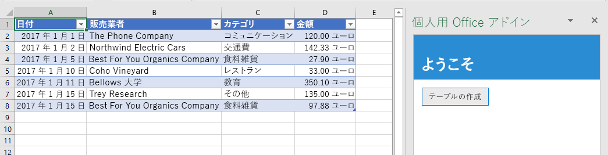
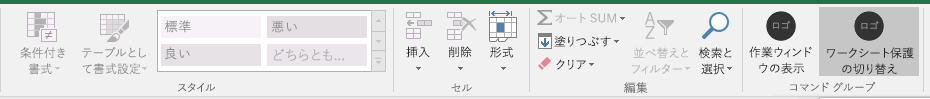

# <a name="tutorial-create-an-excel-task-pane-add-in"></a>チュートリアル: Excel 作業ウィンドウ アドインを作成する

このチュートリアルでは、以下を実行する Excel 作業ウィンドウ アドインを作成します。

> [!div class="checklist"]
> * テーブルの作成
> * テーブルのフィルター処理と並べ替え
> * グラフの作成
> * テーブルのヘッダーの固定
> * ワークシートの保護
> * ダイアログを開く

## <a name="prerequisites"></a>前提条件

このチュートリアルを使用するには、以下のバージョンがインストールされている必要があります。 

- Excel 2016、バージョン 1711 (ビルド 8730.1000 クイック実行) 以降。 このバージョンを入手するには、Office Insider への参加が必要になることがあります。 詳細については、「[Office Insider](https://products.office.com/office-insider?tab=tab-1)」を参照してください。

- [ノード](https://nodejs.org/en/) 

- [Git バッシュ](https://git-scm.com/downloads) (または別の Git クライアント)

- このチュートリアルでアドインをテストするには、インターネット接続が必要です。

## <a name="create-your-add-in-project"></a>アドイン プロジェクトの作成

このチュートリアルの基礎として使用する Excel アドイン プロジェクトを作成するには、次の手順を実行します。

1. 「[Excel アドインのチュートリアル](https://github.com/OfficeDev/Excel-Add-in-Tutorial)」で、GitHub リポジトリを複製します。

2. Git bash ウィンドウまたは Node.JS 対応のシステム プロンプトを開いて、プロジェクトの **Start** フォルダーに移動します。

3. `npm install` コマンドを実行して、package.json ファイルに一覧表示されているツールとライブラリをインストールします。 

4. 開発用のコンピューターのオペレーティングシステムの証明書を信頼するように、[自己署名証明書をインストール](https://github.com/OfficeDev/generator-office/blob/master/src/docs/ssl.md)する手順を実行します。

## <a name="create-a-table"></a>テーブルの作成

チュートリアルのこの手順では、プログラムによってアドインがユーザーの Excel の現在のバージョンをサポートしているかどうかをテストし、ワークシートにテーブルを追加して、そのテーブルのデータ設定と書式設定を実行します。

### <a name="code-the-add-in"></a>アドインのコードを作成する

1. コード エディターでプロジェクトを開きます。

2. index.html ファイルを開きます。

3. `TODO1` を次のマークアップに置き換えます。

    ```html
    <button class="ms-Button" id="create-table">Create Table</button>
    ```

4. app.js ファイルを開きます。

5. `TODO1` を次のコードに置き換えます。 このコードでは、ユーザーの Excel のバージョンが、このチュートリアルのシリーズで使用する API をすべて含んでいるバージョンの Excel.js をサポートしているかどうかを調べます。 運用アドインでは、未サポートの API を呼び出す UI を非表示または無効化する条件ブロックの本体を使用してください。 これにより、ユーザーは、そのユーザーの Excel のバージョンでサポートされているアドインの部分を使用できるようになります。

    ```js
    if (!Office.context.requirements.isSetSupported('ExcelApi', '1.7')) {
        console.log('Sorry. The tutorial add-in uses Excel.js APIs that are not available in your version of Office.');
    }
    ```

6. `TODO2` を次のコードに置き換えます。

    ```js
    $('#create-table').click(createTable);
    ```

7. `TODO3` を次のコードに置き換えます。 注:

   - Excel.js のビジネス ロジックは、`Excel.run` に渡される関数に追加します。 このロジックは、すぐには実行されません。 その代わりに、保留中のコマンドのキューに追加されます。

   - `context.sync` メソッドは、キューに登録されたすべてのコマンドを実行するために Excel に送信します。

   - `Excel.run` の後に `catch` ブロックを続けます。 これは、どのような場合にも当てはまるベスト プラクティスです。 

    ```js
    function createTable() {
        Excel.run(function (context) {

            // TODO4: Queue table creation logic here.

            // TODO5: Queue commands to populate the table with data.

            // TODO6: Queue commands to format the table.

            return context.sync();
        })
        .catch(function (error) {
            console.log("Error: " + error);
            if (error instanceof OfficeExtension.Error) {
                console.log("Debug info: " + JSON.stringify(error.debugInfo));
            }
        });
    }
    ```

8. `TODO4` を次のコードに置き換えます。 次の点に注意してください。

   - このコードでは、ワークシートのテーブル コレクションの `add` メソッドを使用してテーブルを作成します。このコレクションは空であったとしても常に存在します。 これは、Excel.js オブジェクトの標準的な作成方法です。 クラス コンストラクタ API は存在しません。Excel オブジェクトを作成するために、`new` 演算子は使用できません。 その代わりに、親コレクションにオブジェクトを追加します。

   - `add` メソッドの最初のパラメーターは、テーブルの先頭行のみの範囲です。そのテーブルで最終的に使用する全体の範囲ではありません。 これは、アドインでデータ行を設定するときに (この後の手順で実行します)、既存の行のセルに値を書き込むのではなく、新しい行をテーブルに追加するためです。 多くの場合、テーブルの作成時には、そのテーブルに含める行の数がわからないため、このパターンのほうが一般的になります。

   - テーブルの名前は、ワークシート内だけでなくブック全体で一意にする必要があります。

    ```js
    var currentWorksheet = context.workbook.worksheets.getActiveWorksheet();
    var expensesTable = currentWorksheet.tables.add("A1:D1", true /*hasHeaders*/);
    expensesTable.name = "ExpensesTable";
    ```

9. `TODO5` を次のコードに置き換えます。 次の点に注意してください。

   - 範囲に含まれるセルの値は、配列の配列で設定します。

   - テーブル内に新しい行を作成するために、そのテーブルの行コレクションの `add` メソッドを呼び出します。 `add` の 1 回の呼び出しで複数の行を追加できるようにするには、2 番目のパラメーターとして渡す親配列に複数のセル値の配列を含めます。

    ```js
    expensesTable.getHeaderRowRange().values =
        [["Date", "Merchant", "Category", "Amount"]];

    expensesTable.rows.add(null /*add at the end*/, [
        ["1/1/2017", "The Phone Company", "Communications", "120"],
        ["1/2/2017", "Northwind Electric Cars", "Transportation", "142.33"],
        ["1/5/2017", "Best For You Organics Company", "Groceries", "27.9"],
        ["1/10/2017", "Coho Vineyard", "Restaurant", "33"],
        ["1/11/2017", "Bellows College", "Education", "350.1"],
        ["1/15/2017", "Trey Research", "Other", "135"],
        ["1/15/2017", "Best For You Organics Company", "Groceries", "97.88"]
    ]);
    ```

10. `TODO6` を次のコードに置き換えます。 次の点に注意してください。

   - このコードでは、ゼロから始まるインデックスをテーブルの列コレクションの **** メソッドに渡すことで、`getItemAt` 列への参照を取得します。

     > [!NOTE]
     > Excel.js のコレクション オブジェクト (`TableCollection`、`WorksheetCollection`、`TableColumnCollection` など) には、`items` プロパティがあります。このプロパティは、子オブジェクト タイプ (`Table`、`Worksheet`、`TableColumn` など) の配列ですが、`*Collection` オブジェクト自体は配列ではありません。

   - その次に、コードでは、**Amount** 列の範囲を小数点以下 2 桁までのユーロとして書式設定します。 

   - 最後に、列の幅と行の高さが最長 (最高) のデータ アイテムを収めるために十分な大きさになるようにしています。 このコードでは、書式設定のために `Range` オブジェクトを取得している点に注目してください。 `TableColumn` オブジェクトと `TableRow` オブジェクトには、書式設定のプロパティがありません。

        ```js
        expensesTable.columns.getItemAt(3).getRange().numberFormat = [['€#,##0.00']];
        expensesTable.getRange().format.autofitColumns();
        expensesTable.getRange().format.autofitRows();
        ```

### <a name="test-the-add-in"></a>アドインをテストする

1. Git bash ウィンドウまたは Node.JS 対応のシステム プロンプトを開いて、プロジェクトの **Start** フォルダーに移動します。

2. コマンド`npm run build`を実行して、Internet Explorer でサポートされている以前のバージョンの JAVASCRIPT に ES6 のソースコードを transpile します (excel の一部のバージョンでは、excel アドインを実行するために使用されます)。

3. `npm start` コマンドを実行して、ローカルホストで稼働する Web サーバーを起動します。

4. 次のいずれかの方法を使用して、アドインをサイドロードします。

    - Windows: [Windows で Office アドインをサイドロードする](../testing/create-a-network-shared-folder-catalog-for-task-pane-and-content-add-ins.md)

    - Web ブラウザー:[サイドロード Office アドイン (web)](../testing/sideload-office-add-ins-for-testing.md#sideload-an-office-add-in-in-office-on-the-web)

    - iPad および Mac: [iPad と Mac で Office アドインをサイドロードする](../testing/sideload-an-office-add-in-on-ipad-and-mac.md)

5. **[ホーム]** メニューで、**[作業ウィンドウの表示]** を選択します。

6. 作業ウィンドウで、**[Create Table]** (表の作成) を選択します。

    

## <a name="filter-and-sort-a-table"></a>テーブルのフィルター処理と並べ替え

チュートリアルのこの手順では、以前に作成したテーブルをフィルター処理したり並べ替えたりします。

### <a name="filter-the-table"></a>表のフィルター処理

1. コード エディターでプロジェクトを開きます。

2. index.html ファイルを開きます。

3. `create-table` ボタンを格納している `div` の直下に、次のマークアップを追加します。

    ```html
    <div class="padding">
        <button class="ms-Button" id="filter-table">Filter Table</button>
    </div>
    ```

4. app.js ファイルを開きます。

5. `create-table` ボタンにクリック ハンドラーを割り当てる行の直下に、次のコードを追加します。

    ```js
    $('#filter-table').click(filterTable);
    ```

6. `createTable` 関数の直下に、次の関数を追加します。

    ```js
    function filterTable() {
        Excel.run(function (context) {

            // TODO1: Queue commands to filter out all expense categories except
            //        Groceries and Education.

            return context.sync();
        })
        .catch(function (error) {
            console.log("Error: " + error);
            if (error instanceof OfficeExtension.Error) {
                console.log("Debug info: " + JSON.stringify(error.debugInfo));
            }
        });
    }
    ```

7. `TODO1` を次のコードに置き換えます。 次の点に注意してください。

   - このコードでは最初に、`getItem` メソッドに列名を渡すことによって、フィルター処理が必要な列への参照を取得します。`getItemAt` メソッドが行うように、列のインデックスを `createTable` メソッドに渡すわけではありません。 ユーザーは表の列を移動させることができるので、表を作成した後、指定したインデックスにある列が変わってしまう可能性があります。 そのため、列名を使用して列への参照を取得するほうが安全です。 前のチュートリアルでは、表を作成するのとまったく同じ方法で `getItemAt` を使用したため、ユーザーが列を移動させた可能性はなく、よって安全に使用できました。

   - `applyValuesFilter` メソッドは、`Filter` オブジェクトのフィルター処理方法の 1 つです。

    ```js
    var currentWorksheet = context.workbook.worksheets.getActiveWorksheet();
    var expensesTable = currentWorksheet.tables.getItem('ExpensesTable');
    var categoryFilter = expensesTable.columns.getItem('Category').filter;
    categoryFilter.applyValuesFilter(["Education", "Groceries"]);
    ``` 

### <a name="sort-the-table"></a>表の並べ替え

1. index.html ファイルを開きます。

2. `filter-table` ボタンを格納している `div` の下に、次のマークアップを追加します。

    ```html
    <div class="padding">
        <button class="ms-Button" id="sort-table">Sort Table</button>
    </div>
    ```

3. app.js ファイルを開きます。

4. `filter-table` ボタンにクリック ハンドラーを割り当てる行の下に、次のコードを追加します。

    ```js
    $('#sort-table').click(sortTable);
    ```

5. `filterTable` 関数の下に、次の関数を追加します。

    ```js
    function sortTable() {
        Excel.run(function (context) {

            // TODO1: Queue commands to sort the table by Merchant name.

            return context.sync();
        })
        .catch(function (error) {
            console.log("Error: " + error);
            if (error instanceof OfficeExtension.Error) {
                console.log("Debug info: " + JSON.stringify(error.debugInfo));
            }
        });
    }
    ```

6. `TODO1` を次のコードに置き換えます。 次の点に注意してください。

   - アドインで並べ替えるのは Merchant 列のみであるため、このコードでは、1 つのメンバーだけを含む `SortField` オブジェクトの配列を作成します。

   - `key` オブジェクトの `SortField` プロパティは、並べ替える対象列の 0 から始まるインデックスです。

   - `Table` の `sort` メンバーは、`TableSort` オブジェクトであり、メソッドではありません。 `TableSort` オブジェクトの `apply` メソッドには、`SortField` が渡されます。

    ```js
    var currentWorksheet = context.workbook.worksheets.getActiveWorksheet();
    var expensesTable = currentWorksheet.tables.getItem('ExpensesTable');
    var sortFields = [
        {
            key: 1,            // Merchant column
            ascending: false,
        }
    ];

    expensesTable.sort.apply(sortFields);
    ```

### <a name="test-the-add-in"></a>アドインをテストする

1. Git bash ウィンドウまたは Node.JS 対応のシステム プロンプトが前の段階のチュートリアルから開いたままになっている場合は、**Ctrl + C** を 2 回入力して実行中の Web サーバーを停止します。 それ以外の場合は、Git bash ウィンドウまたは Node.JS 対応のシステム プロンプトを開いて、プロジェクトの **Start** フォルダーに移動します。

     > [!NOTE]
     > ブラウザー同期サーバーは、app.js ファイルなどのファイルに変更を加えるたびに作業ウィンドウ内のアドインを再読み込みしますが、JavaScript を再トランスパイルしないため、ビルド コマンドを繰り返し実行して、app.js への変更を反映させる必要があります。 そのためには、ビルド コマンドの入力を求めるプロンプトが表示されるように、サーバー プロセスを強制終了する必要があります。 ビルド後に、サーバーを再起動します。 次の数ステップで、このプロセスを実行します。

2. コマンド`npm run build`を実行して、Internet Explorer でサポートされている以前のバージョンの JAVASCRIPT に ES6 のソースコードを transpile します (excel の一部のバージョンでは、excel アドインを実行するために使用されます)。

3. `npm start` コマンドを実行して、ローカルホストで稼働する Web サーバーを起動します。

4. 作業ウィンドウを再読み込みするために、そのウィンドウを閉じて、**[ホーム]** メニューの **[作業ウィンドウの表示]** を選択してアドインを再度開きます。

5. 何らかの理由から開いているワークシートに表が含まれていない場合は、作業ウィンドウの **[Create Table]** (表の作成) ボタンを選択します。

6. **[Filter Table]** (表のフィルター) ボタンと **[Sort Table]** (表の並べ替え) ボタンを任意の順序で選択します。

    

## <a name="create-a-chart"></a>グラフの作成

チュートリアルのこの手順では、前の手順で作成したテーブルのデータを使用してグラフを作成して、そのグラフの書式を設定します。

### <a name="chart-a-chart-using-table-data"></a>テーブルのデータを使用してグラフを作成する

1. コード エディターでプロジェクトを開きます。

2. index.html ファイルを開きます。

3. `sort-table` ボタンを格納している `div` の下に、次のマークアップを追加します。

    ```html
    <div class="padding">
        <button class="ms-Button" id="create-chart">Create Chart</button>
    </div>
    ```

4. app.js ファイルを開きます。

5. `sort-chart` ボタンにクリック ハンドラーを割り当てる行の下に、次のコードを追加します。

    ```js
    $('#create-chart').click(createChart);
    ```

6. `sortTable` 関数の下に、次の関数を追加します。

    ```js
    function createChart() {
        Excel.run(function (context) {

            // TODO1: Queue commands to get the range of data to be charted.

            // TODO2: Queue command to create the chart and define its type.

            // TODO3: Queue commands to position and format the chart.

            return context.sync();
        })
        .catch(function (error) {
            console.log("Error: " + error);
            if (error instanceof OfficeExtension.Error) {
                console.log("Debug info: " + JSON.stringify(error.debugInfo));
            }
        });
    }
    ```

7. `TODO1` を次のコードに置き換えます。ヘッダー行を除外するために、このコードでは、`Table.getDataBodyRange` メソッドではなく `getRange` メソッドを使用してグラフを作成するデータの範囲を取得しています。

    ```js
    var currentWorksheet = context.workbook.worksheets.getActiveWorksheet();
    var expensesTable = currentWorksheet.tables.getItem('ExpensesTable');
    var dataRange = expensesTable.getDataBodyRange();
    ```

8. `TODO2` を次のコードに置き換えます。 次のパラメーターに注意してください。

   - `add` への最初のパラメーターでは、グラフの種類を指定します。数十種類あります。

   - 2 番目のパラメーターでは、グラフに含めるデータの範囲を指定します。

   - 3 番目のパラメーターでは、テーブルからの一連のデータ ポイントを行方向と列方向のどちらでグラフ化する必要があるかを決定します。 オプション `auto` は、最適な方法を判断するように Excel に指示します。

    ```js
    var chart = currentWorksheet.charts.add('ColumnClustered', dataRange, 'auto');
    ```

9. `TODO3` を次のコードに置き換えます。 このコードのほとんどの部分は、わかりやすく説明不要なものです。 注意:
   
   - `setPosition` メソッドへのパラメーターでは、グラフを収容するワークシート領域の左上と右下のセルを指定します。 Excel では、所定の空間内でグラフの外観を整えるために線幅などを調整できます。
   
   - "series" は、テーブルに含まれる列からのデータ ポイントのセットです。 このテーブルに存在する文字列以外の列は 1 列のみであるため、Excel は、その列がグラフ化するデータ ポイントの唯一の列であることを推測します。 その他の列は、グラフのラベルとして解釈されます。 そのため、グラフの series は 1 つ存在することになり、インデックス 0 を含みます。 これに、"Value in €" のラベルを付けます。

    ```js
    chart.setPosition("A15", "F30");
    chart.title.text = "Expenses";
    chart.legend.position = "right"
    chart.legend.format.fill.setSolidColor("white");
    chart.dataLabels.format.font.size = 15;
    chart.dataLabels.format.font.color = "black";
    chart.series.getItemAt(0).name = 'Value in €';
    ```

### <a name="test-the-add-in"></a>アドインをテストする

1. Git bash ウィンドウまたは Node.JS 対応のシステム プロンプトが前の段階のチュートリアルから開いたままになっている場合は、**Ctrl + C** を 2 回入力して実行中の Web サーバーを停止します。 それ以外の場合は、Git bash ウィンドウまたは Node.JS 対応のシステム プロンプトを開いて、プロジェクトの **Start** フォルダーに移動します。

     > [!NOTE]
     > ブラウザー同期サーバーは、app.js ファイルなどのファイルに変更を加えるたびに作業ウィンドウ内のアドインを再読み込みしますが、JavaScript を再トランスパイルしないため、ビルド コマンドを繰り返し実行して、app.js への変更を反映させる必要があります。 そのためには、ビルド コマンドの入力を求めるプロンプトが表示されるように、サーバー プロセスを強制終了する必要があります。 ビルド後に、サーバーを再起動します。 次の数ステップで、このプロセスを実行します。

2. コマンド`npm run build`を実行して、Internet Explorer でサポートされている以前のバージョンの JAVASCRIPT に ES6 のソースコードを transpile します (excel の一部のバージョンでは、excel アドインを実行するために使用されます)。

3. `npm start` コマンドを実行して、ローカルホストで稼働する Web サーバーを起動します。

4. 作業ウィンドウを再読み込みするために、そのウィンドウを閉じて、**[ホーム]** メニューの **[作業ウィンドウの表示]** を選択してアドインを再度開きます。

5. 何らかの理由から開いているワークシートにテーブルが含まれていない場合は、**[Create Table]** (テーブルの作成) ボタンをクリックしてから、**[Filter Table]** (テーブルのフィルター) ボタンと **[Sort Table]** (テーブルの並べ替え) ボタンを任意の順序でクリックします。

6. **[グラフの作成]** ボタンをクリックします。 グラフが作成され、フィルターが適用された行からのデータのみが含まれます。 データ ポイントの下側のラベルは、グラフの並べ替え順序になります。つまり、[Merchant] (業者) の名前の逆アルファベット順になります。

    

## <a name="freeze-a-table-header"></a>テーブルのヘッダーの固定

表がとても長く、行を参照するためにスクロールしなければならない場合、ヘッダー行が画面の外に移動して見えなくなることがあります。 チュートリアルのこの手順では、以前に作成した表のヘッダー行を固定して、ワークシートを下にスクロールしても表示されるようにします。

### <a name="freeze-the-tables-header-row"></a>表のヘッダー行を固定する

1. コード エディターでプロジェクトを開きます。

2. index.html ファイルを開きます。

3. `create-chart` ボタンを格納している `div` の下に、次のマークアップを追加します。

    ```html
    <div class="padding">
        <button class="ms-Button" id="freeze-header">Freeze Header</button>
    </div>
    ```

4. app.js ファイルを開きます。

5. `create-chart` ボタンにクリック ハンドラーを割り当てる行の下に、次のコードを追加します。

    ```js
    $('#freeze-header').click(freezeHeader);
    ```

6. `createChart` 関数の下に、次の関数を追加します。

    ```js
    function freezeHeader() {
        Excel.run(function (context) {

            // TODO1: Queue commands to keep the header visible when the user scrolls.

            return context.sync();
        })
        .catch(function (error) {
            console.log("Error: " + error);
            if (error instanceof OfficeExtension.Error) {
                console.log("Debug info: " + JSON.stringify(error.debugInfo));
            }
        });
    }
    ```

7. `TODO1` を次のコードに置き換えます。 次の点に注意してください。

   - `Worksheet.freezePanes` コレクションは、ワークシートのスクロール操作時に、ワークシート上でピン留めつまり固定される一式のペインのことです。

   - `freezeRows` メソッドでは、上から数えた行数を、ピン留めする位置のパラメーターとして使用します。`1` を渡して最初の行を適所にピン留めします。

    ```js
    var currentWorksheet = context.workbook.worksheets.getActiveWorksheet();
    currentWorksheet.freezePanes.freezeRows(1);
    ```

### <a name="test-the-add-in"></a>アドインをテストする

1. Git bash ウィンドウまたは Node.JS 対応のシステム プロンプトが前の段階のチュートリアルから開いたままになっている場合は、**Ctrl + C** を 2 回入力して実行中の Web サーバーを停止します。 それ以外の場合は、Git bash ウィンドウまたは Node.JS 対応のシステム プロンプトを開いて、プロジェクトの **Start** フォルダーに移動します。

     > [!NOTE]
     > ブラウザー同期サーバーは、app.js ファイルなどのファイルに変更を加えるたびに作業ウィンドウ内のアドインを再読み込みしますが、JavaScript を再トランスパイルしないため、ビルド コマンドを繰り返し実行して、app.js への変更を反映させる必要があります。 そのためには、ビルド コマンドの入力を求めるプロンプトが表示されるように、サーバー プロセスを強制終了する必要があります。 ビルド後に、サーバーを再起動します。 次の数ステップで、このプロセスを実行します。

2. コマンド`npm run build`を実行して、Internet Explorer でサポートされている以前のバージョンの JAVASCRIPT に ES6 のソースコードを transpile します (excel の一部のバージョンでは、excel アドインを実行するために使用されます)。

3. `npm start` コマンドを実行して、ローカルホストで稼働する Web サーバーを起動します。

4. 作業ウィンドウを再読み込みするために、そのウィンドウを閉じ、**[ホーム]** メニューの **[作業ウィンドウの表示]** を選択してアドインを再度開きます。

5. ワークシート内に表があれば、削除します。

6. 作業ウィンドウで、**[Create Table]** (表の作成) を選択します。

7. **[Freeze Header]** (ヘッダーを固定) ボタンを選択します。

8. ヘッダー以降の行が画面の外に出て見えなくなるまでワークシートを下にスクロールしても、表のヘッダーが最上部に表示されていることを確認します。

    

## <a name="protect-a-worksheet"></a>ワークシートの保護

チュートリアルのこの手順では、リボンに別のボタンを追加します。このボタンをクリックすると、ワークシートの保護のオン/オフが切り替わるように定義した関数が実行されるようにします。

### <a name="configure-the-manifest-to-add-a-second-ribbon-button"></a>2 つ目のリボン ボタンを追加するようにマニフェストを構成する

1. マニフェスト ファイル my-office-add-in-manifest.xml を開きます。

2. `<Control>` 要素を検索します。 この要素では、アドインの起動に使用している **[ホーム]** リボンの **[作業ウィンドウの表示]** ボタンを定義しています。 ここでは、**[ホーム]** リボンの同じグループに 2 つ目のボタンを追加します。 Control 終了タグ (`</Control>`) と Group 終了タグ (`</Group>`) の間に、次のマークアップを追加します。

    ```xml
    <Control xsi:type="Button" id="<!--TODO1: Unique (in manifest) name for button -->">
        <Label resid="<!--TODO2: Button label -->" />
        <Supertip>            
            <Title resid="<!-- TODO3: Button tool tip title -->" />
            <Description resid="<!-- TODO4: Button tool tip description -->" />
        </Supertip>
        <Icon>
            <bt:Image size="16" resid="Contoso.tpicon_16x16" />
            <bt:Image size="32" resid="Contoso.tpicon_32x32" />
            <bt:Image size="80" resid="Contoso.tpicon_80x80" />
        </Icon>
        <Action xsi:type="<!-- TODO5: Specify the type of action-->">
            <!-- TODO6: Identify the function.-->
        </Action>
    </Control>
    ```

3. `TODO1` は文字列に置き換えて、このマニフェスト ファイル内で一意の ID をボタンに割り当てます。 このボタンでは、ワークシートの保護のオン/オフを切り替える予定なので、"ToggleProtection" を使用することにします。 作業が完了すると、Control 開始タグの全体は次のようになります。

    ```xml
    <Control xsi:type="Button" id="ToggleProtection">
    ```

4. その次の 3 つの `TODO` では、"resid" を設定します ("resid" はリソース ID の略号です)。 リソースは文字列です。これら 3 つの文字列は、この後の手順で作成します。 ここでは、そのリソースに ID を割り当てる必要があります。 ボタンのラベルは "Toggle Protection" と表示されるようにしますが、この文字列の *ID* は "ProtectionButtonLabel" にします。そのため、完成した `Label` 要素は次のコードのようになります。

    ```xml
    <Label resid="ProtectionButtonLabel" />
    ```

5. `SuperTip` 要素では、このボタンのツール ヒントを定義します。 ツール ヒントのタイトルはボタンのラベルと同じにする必要があるため、リソース ID にはまったく同じ "ProtectionButtonLabel" を使用することにします。 ツール ヒントの説明は、"Click to turn protection of the worksheet on and off" にする予定です。 ただし、`ID` は "ProtectionButtonToolTip" にします。 作業が完了すると、`SuperTip` マークアップの全体は次のコードのようになります。 

    ```xml
    <Supertip>            
        <Title resid="ProtectionButtonLabel" />
        <Description resid="ProtectionButtonToolTip" />
    </Supertip>
    ```

   > [!NOTE] 
   > 運用アドインでは、異なる 2 つのボタンに同じアイコンを使用することは避けたいところですが、このチュートリアルでは説明を簡単にするために同じアイコンを使用します。 そのため、この新しい `Icon` の `Control` マークアップは、単に既存の `Icon` から `Control` 要素をコピーします。 

6. 既にマニフェストに存在している元の `Action` 要素の内側にある `Control` 要素では、その要素のタイプが `ShowTaskpane` に設定されていますが、新しいボタンで作業ウィンドウを開く予定はありません。このボタンでは、この後の手順で作成するカスタム関数を実行する予定です。 そのため、`TODO5` は、カスタム関数をトリガーするボタンのアクション タイプである `ExecuteFunction` に置き換えます。 `Action` 開始タグは次のようになります。
 
    ```xml
    <Action xsi:type="ExecuteFunction">
    ```

7. 元の `Action` 要素には、作業ウィンドウ ID を指定する子要素と、作業ウィンドウで開かれるページの URL を指定する子要素があります。 ただし、`Action` タイプの `ExecuteFunction` 要素には、実行を制御する関数の名前を指定する子要素を 1 つ含めます。 その関数は、`toggleProtection` という名前にして、この後の手順で作成します。 そのために、`TODO6` を次のマークアップに置き換えます。
 
    ```xml
    <FunctionName>toggleProtection</FunctionName>
    ```

    `Control` マークアップの全体は、次のようになりました。

    ```xml
    <Control xsi:type="Button" id="ToggleProtection">
        <Label resid="ProtectionButtonLabel" />
        <Supertip>            
            <Title resid="ProtectionButtonLabel" />
            <Description resid="ProtectionButtonToolTip" />
        </Supertip>
        <Icon>
            <bt:Image size="16" resid="Contoso.tpicon_16x16" />
            <bt:Image size="32" resid="Contoso.tpicon_32x32" />
            <bt:Image size="80" resid="Contoso.tpicon_80x80" />
        </Icon>
        <Action xsi:type="ExecuteFunction">
           <FunctionName>toggleProtection</FunctionName>
        </Action>
    </Control>
    ```

8. マニフェストの `Resources` セクションまで下にスクロールします。

9. `bt:ShortStrings` 要素の子として、次のマークアップを追加します。

    ```xml
    <bt:String id="ProtectionButtonLabel" DefaultValue="Toggle Worksheet Protection" />
    ```

10. `bt:LongStrings` 要素の子として、次のマークアップを追加します。

    ```xml
    <bt:String id="ProtectionButtonToolTip" DefaultValue="Click to protect or unprotect the current worksheet." />
    ```

11. ファイルを保存します。

### <a name="create-the-function-that-protects-the-sheet"></a>シートを保護する関数を作成する

1. ファイル \function-file\function-file.js を開きます。

2. このファイルには、即時実行関数式 (IIFE) が既に含まれています。 *IIFE の外部*に、次のコードを追加します。 メソッドに `args` パラメーターを指定していることと、メソッドの最後のほうの行で `args.completed` を呼び出していることに注目してください。 **ExecuteFunction** タイプのすべてのアドイン コマンドでは、これが要件になります。 これにより、関数が終了したことと、UI が再度応答可能になることを Office ホスト アプリケーションに通知します。

    ```js
    function toggleProtection(args) {
        Excel.run(function (context) {
            
            // TODO1: Queue commands to reverse the protection status of the current worksheet.

            return context.sync();
        })
        .catch(function (error) {
            console.log("Error: " + error);
            if (error instanceof OfficeExtension.Error) {
                console.log("Debug info: " + JSON.stringify(error.debugInfo));
            }
        });
        args.completed();
    }
    ```

3. `TODO1` を次のコードに置き換えます。 このコードでは、標準の切り替えパターンで、ワークシート オブジェクトの protection プロパティを使用します。 `TODO2` については、次のセクションで説明します。

    ```js
    var sheet = context.workbook.worksheets.getActiveWorksheet();

    // TODO2: Queue command to load the sheet's "protection.protected" property from
    //        the document and re-synchronize the document and task pane.

     if (sheet.protection.protected) {
        sheet.protection.unprotect();
    } else {
        sheet.protection.protect();
    }
    ``` 

### <a name="add-code-to-fetch-document-properties-into-the-task-panes-script-objects"></a>ドキュメントのプロパティを作業ウィンドウのスクリプト オブジェクトにフェッチするコードを追加する

このチュートリアルのシリーズで前述したすべての関数では、Office ドキュメントへの*書き込み*コマンドをキューに登録していました。 各関数は、キューに登録されたコマンドを実行対象のドキュメントに送信する `context.sync()` メソッドを呼び出すことで終了しています。 ただし、最後の手順で追加したコードでは、`sheet.protection.protected` プロパティを呼び出しています。このことが、これまでに作成した関数とは大きく異なります。`sheet` オブジェクトは、この作業ウィンドウのスクリプトに存在する単なるプロキシ オブジェクトなので、 ドキュメントの実際の保護の状態を認識できません。そのため、その `protection.protected` プロパティでは実際の値が保持できません。 まず、ドキュメントから保護の状態をフェッチする必要があり、その状態を使用して `sheet.protection.protected` の値を設定します。 そのようにした場合にのみ、例外がスローされることなく `sheet.protection.protected` を呼び出せるようになります。 このフェッチ処理には、3 つの手順があります。

   1. コードで読み取る必要があるプロパティをロードする (つまりフェッチする) コマンドをキューに登録します。

   2. コンテキスト オブジェクトの `sync` メソッドを呼び出します。このメソッドは、キューに登録されたコマンドを実行対象のドキュメントに送信して、要求された情報を返します。

   3. `sync` メソッドは非同期であるため、フェッチされたプロパティをコードで呼び出す前に、そのメソッドが完了していることを確認します。

こうした手順は、コードで Office ドキュメントから情報を*読み取る*必要がある場合には必ず完了する必要があります。

1. `toggleProtection` 関数で、`TODO2` を次のコードに置き換えます。次の点に注意してください。
   
   - すべての Excel オブジェクトに `load` メソッドがあります。 読み取る必要のあるオブジェクトのプロパティは、コンマ区切りの名前の文字列としてパラメーターで指定します。 この場合、読み取る必要のあるプロパティは、`protection` プロパティのサブプロパティです。 サブプロパティはその他のコードの場合とほとんど同じ方法で参照しますが、"." 記号の代わりにスラッシュ ('/') 記号を使用する点が異なります。

   - `sheet.protection.protected` が完了してドキュメントからフェッチされた適切な値が `sync` に割り当てられるまで、`sheet.protection.protected` を読み取る切り替えロジックが実行されないようにするために、そのロジックを `then` が完了するまで実行されない `sync` 関数に (この後の手順で) 移動します。 

    ```js
    sheet.load('protection/protected');
    return context.sync()
        .then(
            function() {
                // TODO3: Move the queued toggle logic here.
            }
        )
        // TODO4: Move the final call of `context.sync` here and ensure that it
        //        does not run until the toggle logic has been queued.
    ``` 

2. 分岐していない同一のコード パスに 2 つの `return` ステートメントを含めることはできないため、`return context.sync();` の最後にある最終行の `Excel.run` を削除します。 この後の手順で、新しい最終の `context.sync` を追加します。

3. `if ... else` 関数内の `toggleProtection` 構造を切り取って、`TODO3` の代わりに貼り付けます。

4. `TODO4` を次のコードに置き換えます。次の点に注意してください。

   - `sync` メソッドを `then` 関数に渡すことで、`sheet.protection.unprotect()` または `sheet.protection.protect()` のどちらかがキューに登録されるまで、そのメソッドが実行されないようにします。

   - `then` メソッドは渡された関数を呼び出します。`sync` が 2 回呼び出されないように、`context.sync` の末尾の "()" は省略します。

    ```js
    .then(context.sync);
    ```

   作業が完了すると、関数の全体は次のようになります。

    ```js
    function toggleProtection(args) {
        Excel.run(function (context) {            
          var sheet = context.workbook.worksheets.getActiveWorksheet();          
          sheet.load('protection/protected');

          return context.sync()
              .then(
                  function() {
                    if (sheet.protection.protected) {
                        sheet.protection.unprotect();
                    } else {
                        sheet.protection.protect();
                    }
                  }
              )
              .then(context.sync);
        })
        .catch(function (error) {
            console.log("Error: " + error);
            if (error instanceof OfficeExtension.Error) {
                console.log("Debug info: " + JSON.stringify(error.debugInfo));
            }
        });
        args.completed();
    }
    ```

### <a name="configure-the-script-loading-html-file"></a>スクリプト読み込み HTMl ファイルを構成する

/function-file/function-file.html ファイルを開きます。 これは、ユーザーが **[Toggle Worksheet Protection]** ボタンをクリックしたときに呼び出される UI のない HTML ファイルです。 ボタンがクリックされたときに実行する JavaScript メソッドを読み込むことを目的としています。 このファイルには変更を加えません。 2 番目の `<script>` タグで functionfile.js が読み込まれる点に注目してください。

   > [!NOTE]
   > function-file.html ファイルと、そのファイルが読み込む function-file.js ファイルは、アドインの作業ウィンドウとは完全に別の IE プロセスで実行されます。 function-file.js が app.js ファイルと同じ bundle.js ファイルからトランスパイルされていた場合、アドインでは bundle.js の 2 つのコピーを読み込むことが必要になり、バンドル化の意味がなくなります。 さらに、function-file.js ファイルには IE で未サポートの JavaScript は含まれていません。 これら 2 つの理由から、このアドインでは function-file.js を一切トランスパイルしていません。 

### <a name="test-the-add-in"></a>アドインをテストする

1. Excel も含めて、すべての Office アプリケーションを閉じます。 

2. キャッシュ フォルダーの内容を削除して、Office キャッシュを削除します。 これは、ホストから古いバージョンのアドインを完全に削除するために必要です。 

    - Windows の場合: `%LOCALAPPDATA%\Microsoft\Office\16.0\Wef\`。

    - Mac の場合: `~/Library/Containers/com.Microsoft.OsfWebHost/Data/`。 
    
        [!include[additional cache folders on Mac](../includes/mac-cache-folders.md)]

3. 何らかの理由で、サーバーが稼働中でない場合は、Git Bash ウィンドウ、または Node.JS 対応のシステム プロンプトで、プロジェクトの **Start** フォルダーに移動して、`npm start` コマンドを実行します。 変更した JavaScript ファイルはビルド済みの bundle.js に含まれていないため、プロジェクトをリビルドする必要はありません。

4. 新しいバージョンの変更済みマニフェスト ファイルを使用して、次のいずれかの方法でサイドローディング プロセスを繰り返します。 *マニフェスト ファイルの以前のコピーを上書きする必要があります。*

    - Windows: [Windows で Office アドインをサイドロードする](../testing/create-a-network-shared-folder-catalog-for-task-pane-and-content-add-ins.md)

    - Web ブラウザー:[サイドロード Office アドイン (web)](../testing/sideload-office-add-ins-for-testing.md#sideload-an-office-add-in-in-office-on-the-web)

    - iPad および Mac: [iPad と Mac で Office アドインをサイドロードする](../testing/sideload-an-office-add-in-on-ipad-and-mac.md)

5. Excel で任意のワークシートを開きます。

6. **[ホーム]** リボンで、**[ワークシート保護の切り替え]** を選択します。次のスクリーンショットに示すように、リボンのほとんどのコントロールは、無効化 (淡色表示) されます。 

7. セルの内容を変更する場合は、そのセルを選択します。 ワークシートが保護されているというエラーが表示されます。

8. もう一度 **[Toggle Worksheet Protection]** を選択すると、コントロールが再有効化され、再びセルの値を変更できるようになります。

    

## <a name="open-a-dialog"></a>ダイアログを開く

このチュートリアルの最後の手順では、アドインでダイアログを開いて、ダイアログのプロセスから作業ウィンドウのプロセスにメッセージを渡して、ダイアログを閉じます。 Office アドインのダイアログは、*モードレス*です。ユーザーは、ホスト Office アプリケーション内のドキュメントと作業ウィンドウ内のホスト ページの両方の操作を続行できます。

### <a name="create-the-dialog-page"></a>ダイアログ ページを作成する

1. コード エディターでプロジェクトを開きます。

2. プロジェクトのルート (index.html がある場所) で、popup.html というファイルを作成します。

3. popup.html に、次のコードを追加します。次の点に注意してください。

   - このページには、ユーザーが自分の名前を入力する `<input>` と、その名前を作業ウィンドウ内のページ (入力した名前が表示されるページ) に送信するボタンが含まれています。

   - このマークアップでは、popup.js というスクリプトを読み込みます。このスクリプトは、この後の手順で作成します。

   - また、popup.js で使用することになる Office.JS ライブラリと jQuery も読み込みます。

    ```html
    <!DOCTYPE html>
    <html>
        <head lang="en">
            <title>Dialog for My Office Add-in</title>
            <meta charset="UTF-8">
            <meta name="viewport" content="width=device-width, initial-scale=1">

            <link rel="stylesheet" href="node_modules/office-ui-fabric-js/dist/css/fabric.min.css" />
            <link rel="stylesheet" href="node_modules/office-ui-fabric-js/dist/css/fabric.components.css" />
            <link rel="stylesheet" href="app.css" />

            <script type="text/javascript" src="https://appsforoffice.microsoft.com/lib/1.1/hosted/office.js"></script>
            <script type="text/javascript" src="https://ajax.aspnetcdn.com/ajax/jQuery/jquery-2.2.1.min.js"></script>
            <script type="text/javascript" src="popup.js"></script>

        </head>
        <body style="display:flex;flex-direction:column;align-items:center;justify-content:center">
            <div class="padding">
                <p class="ms-font-xl">ENTER YOUR NAME</p>
            </div>
            <div class="padding">
                <input id="name-box" type="text"/>
            </div>
            <div class="padding">
                <button id="ok-button" class="ms-Button">OK</button>
            </div>
        </body>
    </html>
    ```

4. プロジェクトのルートに popup.js というファイルを作成します。

5. popup.js に、次のコードを追加します。 このコードについては、次の点に注意してください。

   - *Office.JS ライブラリ内の API を呼び出すすべてのページでは、まずライブラリが完全に初期化されていることを確認する必要があります。* これを行う最善の方法は `Office.onReady()` メソッドを呼び出すことです。 アドインに独自の初期化タスクがある場合、コードを `Office.onReady()` の呼び出しにチェーンされている `then()` メソッドに含める必要があります。 たとえば、プロジェクト ルートにある app.js ファイルを確認してください。 `Office.onReady()` の呼び出しは、Office.JS を呼び出す前に実行する必要があります。そのため、この例で示すように、割り当てはページによって読み込まれるスクリプト ファイル内に入れてあります。
   - jQuery の `ready` 関数は、`then()` メソッドの内側から呼び出します。 通常は、その他の JavaScript ライブラリの読み込み、初期化、ブートストラップのコードを、`Office.onReady()` の呼び出しにチェーンされている `then()` メソッドの内側に含める必要があります。

    ```js
    (function () {
    "use strict";

        Office.onReady()
            .then(function() {
                $(document).ready(function () {  

                    // TODO1: Assign handler to the OK button.

                });
            });

        // TODO2: Create the OK button handler

    }());
    ```

6. `TODO1` を次のコードに置き換えます。 `sendStringToParentPage` 関数は、この後の手順で作成します。

    ```js
    $('#ok-button').click(sendStringToParentPage);
    ```

7. `TODO2` を次のコードに置き換えます。 `messageParent` メソッドは、パラメーターを親ページ (この例では、作業ウィンドウ内のページ) に渡します。 パラメーターには、ブール値または文字列を使用できます (XML や JSON など、文字列としてシリアル化できるすべてのものが含まれます)。

    ```js
    function sendStringToParentPage() {
        var userName = $('#name-box').val();
        Office.context.ui.messageParent(userName);
    }
    ```

8. ファイルを保存します。

   > [!NOTE]
   > ポップアップファイルとそれによって読み込まれるポップアップファイルは、アドインの作業ウィンドウから完全に独立した Microsoft Edge または Internet Explorer 11 プロセスで実行されます。 popup.js が app.js ファイルと同じ bundle.js ファイルからトランスパイルされていた場合、アドインでは bundle.js の 2 つのコピーを読み込むことが必要になり、バンドル化の意味がなくなります。 さらに、ポップアップ .js ファイルには、Internet Explorer 11 でサポートされていない JavaScript は含まれていません。 これら 2 つの理由から、このアドインでは popup.js を一切トランスパイルしていません。

### <a name="open-the-dialog-from-the-task-pane"></a>作業ウィンドウからダイアログを開く

1. index.html ファイルを開きます。

2. `freeze-header` ボタンを格納している `div` の下に、次のマークアップを追加します。

    ```html
    <div class="padding">
        <button class="ms-Button" id="open-dialog">Open Dialog</button>
    </div>
    ```

3. このダイアログでは、ユーザーに名前の入力を求めて、ユーザーの名前を作業ウィンドウに渡します。 作業ウィンドウでは、それがラベルに表示されます。 前の手順で追加した `div` のすぐ下に、次のマークアップを追加します。

    ```html
    <div class="padding">
        <label id="user-name"></label>
    </div>
    ```

4. app.js ファイルを開きます。

5. `freeze-header` ボタンにクリック ハンドラーを割り当てる行の下に、次のコードを追加します。 `openDialog` メソッドは、この後の手順で作成します。

    ```js
    $('#open-dialog').click(openDialog);
    ```

6. `freezeHeader` 関数の下に、次の宣言を追加します。この変数は、親ページの実行コンテキスト内のオブジェクトを保持するために使用され、ダイアログ ページの実行コンテキストへの仲介者として機能します。

    ```js
    var dialog = null;
    ```

7. `dialog` の宣言の下に、次の関数を追加します。 このコードで注目する重要な点は、そこに ** の呼び出しが存在`Excel.run`ことです。 これは、ダイアログを開く API はすべての Office ホストで共有されるため、Excel 固有の API ではなく Office JavaScript 共通 API に含まれているからです。

    ```js
    function openDialog() {
        // TODO1: Call the Office Common API that opens a dialog
    }
    ```

8. `TODO1` を次のコードに置き換えます。 次の点に注意してください。

   - `displayDialogAsync` メソッドでは、画面の中央にダイアログを開きます。

   - 最初のパラメーターは、開くページの URL です。

   - 2 番目のパラメーターでオプションを渡します。`height` と `width` は、Office アプリケーションのウィンドウ サイズの比率です。

    ```js
    Office.context.ui.displayDialogAsync(
        'https://localhost:3000/popup.html',
        {height: 45, width: 55},

        // TODO2: Add callback parameter.
    );
    ```

### <a name="process-the-message-from-the-dialog-and-close-the-dialog"></a>ダイアログからのメッセージを処理してダイアログを閉じる

1. app.js ファイルでの作業を続けます。`TODO2` を次のコードに置き換えます。次の点に注意してください。

   - コールバックは、ダイアログが正常に開いた直後、ユーザーがダイアログで操作を行う前に実行されます。

   - `result.value` は、親ページとダイアログ ページの実行コンテキストの間で仲介者のように機能するオブジェクトです。

   - `processMessage` 関数は、この後の手順で作成します。 このハンドラーは、`messageParent` 関数の呼び出しによって、ダイアログから送信されるあらゆる値を処理します。

    ```js
    function (result) {
        dialog = result.value;
        dialog.addEventHandler(Microsoft.Office.WebExtension.EventType.DialogMessageReceived, processMessage);
    }
    ```

2. `openDialog` 関数の下に、次の関数を追加します。

    ```js
    function processMessage(arg) {
        $('#user-name').text(arg.message);
        dialog.close();
    }
    ```

### <a name="test-the-add-in"></a>アドインをテストする

1. Git bash ウィンドウまたは Node.JS 対応のシステム プロンプトが前の段階のチュートリアルから開いたままになっている場合は、**Ctrl + C** を 2 回入力して実行中の Web サーバーを停止します。 それ以外の場合は、Git bash ウィンドウまたは Node.JS 対応のシステム プロンプトを開いて、プロジェクトの **Start** フォルダーに移動します。

     > [!NOTE]
     > ブラウザー同期サーバーは、app.js ファイルなどのファイルに変更を加えるたびに作業ウィンドウ内のアドインを再読み込みしますが、JavaScript を再トランスパイルしないため、ビルド コマンドを繰り返し実行して、app.js への変更を反映させる必要があります。 そのためには、ビルド コマンドの入力を求めるプロンプトが表示されるように、サーバー プロセスを強制終了する必要があります。 ビルド後に、サーバーを再起動します。 次の数ステップで、このプロセスを実行します。

2. コマンド`npm run build`を実行して、Internet Explorer でサポートされている以前のバージョンの JAVASCRIPT に ES6 のソースコードを transpile します (excel の一部のバージョンでは、excel アドインを実行するために使用されます)。

3. `npm start` コマンドを実行して、ローカルホストで稼働する Web サーバーを起動します。

4. 作業ウィンドウを再読み込みするために、そのウィンドウを閉じて、**[ホーム]** メニューの **[作業ウィンドウの表示]** を選択してアドインを再度開きます。

5. 作業ウィンドウで、**[Open Dialog]** ボタンをクリックします。

6. ダイアログが開いたら、ドラッグしたりサイズ変更したりします。 ワークシートを操作して、作業ウィンドウの他のボタンを押すことはできますが、同じ作業ウィンドウのページから 2 番目のダイアログを起動することはできないことに注意してください。

7. ダイアログで、名前を入力して **[OK]** をクリックします。 作業ウィンドウに名前が表示され、ダイアログが閉じられます。

8. オプションとして、`dialog.close();` 関数内の行 `processMessage` をコメントにします。 その後で、このセクションの手順を繰り返します。 ダイアログを開いたまま名前を変更できます。 右上の **[X]** ボタンをクリックすることで、手動で閉じることができます。

    

## <a name="next-steps"></a>次の手順

このチュートリアルでは、Excel ブック内のテーブル、グラフ、ワークシート、ダイアログの操作を行う、Excel 作業ウィンドウ アドインを作成しました。 Excel アドインの構築に関する詳細については、次の記事にお進みください。

> [!div class="nextstepaction"]
> [Excel アドインの概要](../excel/excel-add-ins-overview.md)
