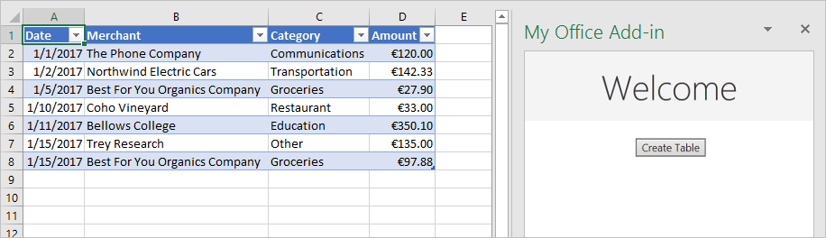
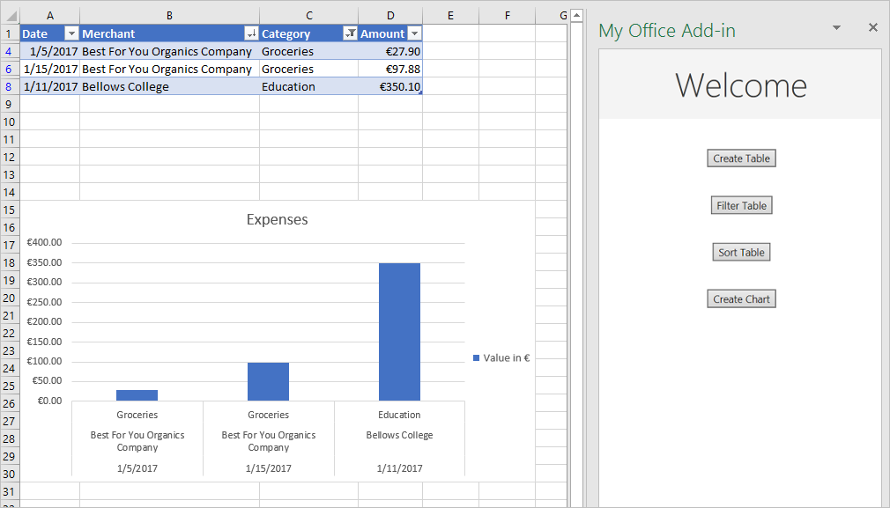

# <a name="tutorial-create-an-excel-task-pane-add-in"></a>チュートリアル: Excel 作業ウィンドウ アドインを作成する

このチュートリアルでは、以下を実行する Excel 作業ウィンドウ アドインを作成します。

> [!div class="checklist"]
> * テーブルの作成
> * テーブルのフィルター処理と並べ替え
> * グラフの作成
> * テーブルのヘッダーの固定
> * ワークシートの保護
> * ダイアログを開く

> [!TIP]
> [Excel の作業ウィンドウアドイン](../quickstarts/excel-quickstart-jquery.md)のクイックスタートを既に完了しており、そのプロジェクトをこのチュートリアルの開始点として使用する場合は、「 [Create a table](#create-a-table) 」セクションに直接移動して、このチュートリアルを開始してください。

## <a name="prerequisites"></a>前提条件

[!include[Yeoman generator prerequisites](../includes/quickstart-yo-prerequisites.md)]

## <a name="create-your-add-in-project"></a>アドイン プロジェクトの作成

[!include[Yeoman generator create project guidance](../includes/yo-office-command-guidance.md)]

- **Choose a project type: (プロジェクトの種類を選択)** `Office Add-in Task Pane project`
- **Choose a script type: (スクリプトの種類を選択)** `Javascript`
- **What would you want to name your add-in?: (アドインの名前を何にしますか)** `My Office Add-in`
- **Which Office client application would you like to support?: (どの Office クライアント アプリケーションをサポートしますか)** `Excel`


ウィザードを完了すると、ジェネレーターによってプロジェクトが作成されて、サポートしているノード コンポーネントがインストールされます。

[!include[Yeoman generator next steps](../includes/yo-office-next-steps.md)]

## <a name="create-a-table"></a>テーブルの作成

チュートリアルのこの手順では、プログラムによってアドインがユーザーの Excel の現在のバージョンをサポートしているかどうかをテストし、ワークシートにテーブルを追加して、そのテーブルのデータ設定と書式設定を実行します。

### <a name="code-the-add-in"></a>アドインのコードを作成する

1. コード エディターでプロジェクトを開きます。

2. ファイル **./src/taskpane/taskpane.html**を開きます。  このファイルには、作業ウィンドウの HTML マークアップが含まれています。

3. `<main>`要素を検索し、開始`<main>`タグと終了`</main>`タグの後に表示されるすべての行を削除します。

4. 開始`<main>`タグの直後に、次のマークアップを追加します。

    ```html
    <button class="ms-Button" id="create-table">Create Table</button><br/><br/>
    ```

5. /Src/taskpane/taskpane.js を開きます **。** このファイルには、作業ウィンドウと Office ホストアプリケーション間の対話を容易にする Office JavaScript API コードが含まれています。

6. 次の手順を実行`run`して、 `run()`ボタンと関数へのすべての参照を削除します。

    - 行`document.getElementById("run").onclick = run;`を見つけて、削除します。

    - 関数全体`run()`を見つけて、削除します。

7. `Office.onReady`メソッド呼び出し内で、行`if (info.host === Office.HostType.Excel) {`を見つけて、その行の直後に次のコードを追加します。 注意:

    - このコードの最初の部分では、ユーザーのバージョンの Excel が、このチュートリアルのシリーズで使用するすべての Api を含むバージョンの Excel をサポートしているかどうかを判断します。 運用アドインでは、未サポートの API を呼び出す UI を非表示または無効化する条件ブロックの本体を使用してください。 これにより、ユーザーは、そのユーザーの Excel のバージョンでサポートされているアドインの部分を使用できるようになります。

    - このコードの2番目の部分では、 `create-table`ボタンのイベントハンドラーを追加します。

    ```js
    // Determine if the user's version of Office supports all the Office.js APIs that are used in the tutorial.
    if (!Office.context.requirements.isSetSupported('ExcelApi', '1.7')) {
        console.log('Sorry. The tutorial add-in uses Excel.js APIs that are not available in your version of Office.');
    }

    // Assign event handlers and other initialization logic.
    document.getElementById("create-table").onclick = createTable;
    ```

8. ファイルの末尾に次の関数を追加します。 注意:

    - Excel.js のビジネス ロジックは、`Excel.run` に渡される関数に追加します。 このロジックは、すぐには実行されません。 その代わりに、保留中のコマンドのキューに追加されます。

    - `context.sync` メソッドは、キューに登録されたすべてのコマンドを実行するために Excel に送信します。

    - `Excel.run` の後に `catch` ブロックを続けます。 これは、どのような場合にも当てはまるベスト プラクティスです。 

    ```js
    function createTable() {
        Excel.run(function (context) {

            // TODO1: Queue table creation logic here.

            // TODO2: Queue commands to populate the table with data.

            // TODO3: Queue commands to format the table.

            return context.sync();
        })
        .catch(function (error) {
            console.log("Error: " + error);
            if (error instanceof OfficeExtension.Error) {
                console.log("Debug info: " + JSON.stringify(error.debugInfo));
            }
        });
    }
    ```

9. `createTable()`関数内で、を`TODO1`次のコードに置き換えます。 注意:

    - このコードでは、ワークシートのテーブル コレクションの `add` メソッドを使用してテーブルを作成します。このコレクションは空であったとしても常に存在します。 これは、Excel.js オブジェクトの標準的な作成方法です。 クラス コンストラクタ API は存在しません。Excel オブジェクトを作成するために、`new` 演算子は使用できません。 その代わりに、親コレクションにオブジェクトを追加します。

    - `add` メソッドの最初のパラメーターは、テーブルの先頭行のみの範囲です。そのテーブルで最終的に使用する全体の範囲ではありません。 これは、アドインでデータ行を設定するときに (この後の手順で実行します)、既存の行のセルに値を書き込むのではなく、新しい行をテーブルに追加するためです。 多くの場合、テーブルの作成時には、そのテーブルに含める行の数がわからないため、このパターンのほうが一般的になります。

    - テーブルの名前は、ワークシート内だけでなくブック全体で一意にする必要があります。

    ```js
    var currentWorksheet = context.workbook.worksheets.getActiveWorksheet();
    var expensesTable = currentWorksheet.tables.add("A1:D1", true /*hasHeaders*/);
    expensesTable.name = "ExpensesTable";
    ```

10. `createTable()`関数内で、を`TODO2`次のコードに置き換えます。 注意:

    - 範囲に含まれるセルの値は、配列の配列で設定します。

    - テーブル内に新しい行を作成するために、そのテーブルの行コレクションの `add` メソッドを呼び出します。 `add` の 1 回の呼び出しで複数の行を追加できるようにするには、2 番目のパラメーターとして渡す親配列に複数のセル値の配列を含めます。

    ```js
    expensesTable.getHeaderRowRange().values =
        [["Date", "Merchant", "Category", "Amount"]];

    expensesTable.rows.add(null /*add at the end*/, [
        ["1/1/2017", "The Phone Company", "Communications", "120"],
        ["1/2/2017", "Northwind Electric Cars", "Transportation", "142.33"],
        ["1/5/2017", "Best For You Organics Company", "Groceries", "27.9"],
        ["1/10/2017", "Coho Vineyard", "Restaurant", "33"],
        ["1/11/2017", "Bellows College", "Education", "350.1"],
        ["1/15/2017", "Trey Research", "Other", "135"],
        ["1/15/2017", "Best For You Organics Company", "Groceries", "97.88"]
    ]);
    ```

11. `createTable()`関数内で、を`TODO3`次のコードに置き換えます。 注意:

    - このコードでは、ゼロから始まるインデックスをテーブルの列コレクションの **** メソッドに渡すことで、`getItemAt` 列への参照を取得します。

        > [!NOTE]
        > Excel.js のコレクション オブジェクト (`TableCollection`、`WorksheetCollection`、`TableColumnCollection` など) には、`items` プロパティがあります。このプロパティは、子オブジェクト タイプ (`Table`、`Worksheet`、`TableColumn` など) の配列ですが、`*Collection` オブジェクト自体は配列ではありません。

    - その次に、コードでは、**Amount** 列の範囲を小数点以下 2 桁までのユーロとして書式設定します。 

    - 最後に、列の幅と行の高さが最長 (最高) のデータ アイテムを収めるために十分な大きさになるようにしています。 このコードでは、書式設定のために `Range` オブジェクトを取得している点に注目してください。 `TableColumn` オブジェクトと `TableRow` オブジェクトには、書式設定のプロパティがありません。

    ```js
    expensesTable.columns.getItemAt(3).getRange().numberFormat = [['€#,##0.00']];
    expensesTable.getRange().format.autofitColumns();
    expensesTable.getRange().format.autofitRows();
    ```

12. プロジェクトに加えたすべての変更を保存したことを確認します。

### <a name="test-the-add-in"></a>アドインをテストする

1. 以下の手順を実行し、ローカル Web サーバーを起動してアドインのサイドロードを行います。

    > [!NOTE]
    > 開発の最中でも、OfficeアドインはHTTPではなくHTTPSを使用する必要があります。 次のいずれかのコマンドを実行した後に証明書をインストールするように求められた場合は、Yeoman ジェネレーターによって提供される証明書をインストールするプロンプトを受け入れます。

    > [!TIP]
    > Mac でアドインをテストしている場合は、先に進む前に、プロジェクトのルートディレクトリで次のコマンドを実行します。 このコマンドを実行すると、ローカル Web サーバーが起動します。
    >
    > ```command&nbsp;line
    > npm run dev-server
    > ```

    - Excel でアドインをテストするには、プロジェクトのルートディレクトリで次のコマンドを実行します。 これにより、ローカル web サーバーが起動 (まだ実行されていない場合) し、アドインが読み込まれた状態で Excel が開きます。

        ```command&nbsp;line
        npm start
        ```

    - Web 上の Excel でアドインをテストするには、プロジェクトのルートディレクトリで次のコマンドを実行します。 このコマンドを実行すると、ローカル Web サーバーが起動します (まだ実行されていない場合)。

        ```command&nbsp;line
        npm run start:web
        ```

        アドインを使用するには、web 上の Excel で新しいドキュメントを開き、「 [office のサイドロード Office アドイン](../testing/sideload-office-add-ins-for-testing.md#sideload-an-office-add-in-in-office-on-the-web)」の手順に従ってアドインをサイドロードします。

2. Excel で、**[ホーム]** タブを選択し、リボンの **[作業ウィンドウの表示]** ボタンをクリックして、アドインの作業ウィンドウを開きます。

    

3. 作業ウィンドウで、[テーブルの**作成**] ボタンをクリックします。

    

## <a name="filter-and-sort-a-table"></a>テーブルのフィルター処理と並べ替え

チュートリアルのこの手順では、以前に作成したテーブルをフィルター処理したり並べ替えたりします。

### <a name="filter-the-table"></a>表のフィルター処理

1. ファイル **./src/taskpane/taskpane.html**を開きます。

2. `create-table`ボタンの`<button>`要素を見つけ、その行の後に次のマークアップを追加します。

    ```html
    <button class="ms-Button" id="filter-table">Filter Table</button><br/><br/>
    ```

3. /Src/taskpane/taskpane.js を開きます **。**

4. `Office.onReady`メソッド呼び出し内で、 `create-table`ボタンにクリックハンドラーを割り当てる行を見つけ、その行の後に次のコードを追加します。

    ```js
    document.getElementById("filter-table").onclick = filterTable;
    ```

5. ファイルの末尾に次の関数を追加します。

    ```js
    function filterTable() {
        Excel.run(function (context) {

            // TODO1: Queue commands to filter out all expense categories except
            //        Groceries and Education.

            return context.sync();
        })
        .catch(function (error) {
            console.log("Error: " + error);
            if (error instanceof OfficeExtension.Error) {
                console.log("Debug info: " + JSON.stringify(error.debugInfo));
            }
        });
    }
    ```

6. `filterTable()`関数内で、を`TODO1`次のコードに置き換えます。 注意:

   - このコードでは最初に、`getItem` メソッドに列名を渡すことによって、フィルター処理が必要な列への参照を取得します。`getItemAt` メソッドが行うように、列のインデックスを `createTable` メソッドに渡すわけではありません。 ユーザーは表の列を移動させることができるので、表を作成した後、指定したインデックスにある列が変わってしまう可能性があります。 そのため、列名を使用して列への参照を取得するほうが安全です。 前のチュートリアルでは、表を作成するのとまったく同じ方法で `getItemAt` を使用したため、ユーザーが列を移動させた可能性はなく、よって安全に使用できました。

   - `applyValuesFilter` メソッドは、`Filter` オブジェクトのフィルター処理方法の 1 つです。

    ```js
    var currentWorksheet = context.workbook.worksheets.getActiveWorksheet();
    var expensesTable = currentWorksheet.tables.getItem('ExpensesTable');
    var categoryFilter = expensesTable.columns.getItem('Category').filter;
    categoryFilter.applyValuesFilter(['Education', 'Groceries']);
    ``` 

### <a name="sort-the-table"></a>表の並べ替え

1. ファイル **./src/taskpane/taskpane.html**を開きます。

2. `filter-table`ボタンの`<button>`要素を見つけ、その行の後に次のマークアップを追加します。 

    ```html
    <button class="ms-Button" id="sort-table">Sort Table</button><br/><br/>
    ```

3. /Src/taskpane/taskpane.js を開きます **。**

4. `Office.onReady`メソッド呼び出し内で、 `filter-table`ボタンにクリックハンドラーを割り当てる行を見つけ、その行の後に次のコードを追加します。

    ```js
    document.getElementById("sort-table").onclick = sortTable;
    ```

5. ファイルの末尾に次の関数を追加します。

    ```js
    function sortTable() {
        Excel.run(function (context) {

            // TODO1: Queue commands to sort the table by Merchant name.

            return context.sync();
        })
        .catch(function (error) {
            console.log("Error: " + error);
            if (error instanceof OfficeExtension.Error) {
                console.log("Debug info: " + JSON.stringify(error.debugInfo));
            }
        });
    }
    ```

6. `sortTable()`関数内で、を`TODO1`次のコードに置き換えます。 次の点に注意してください。

   - アドインで並べ替えるのは Merchant 列のみであるため、このコードでは、1 つのメンバーだけを含む `SortField` オブジェクトの配列を作成します。

   - `key` オブジェクトの `SortField` プロパティは、並べ替える対象列の 0 から始まるインデックスです。

   - `Table` の `sort` メンバーは、`TableSort` オブジェクトであり、メソッドではありません。 `TableSort` オブジェクトの `apply` メソッドには、`SortField` が渡されます。

    ```js
    var currentWorksheet = context.workbook.worksheets.getActiveWorksheet();
    var expensesTable = currentWorksheet.tables.getItem('ExpensesTable');
    var sortFields = [
        {
            key: 1,            // Merchant column
            ascending: false,
        }
    ];

    expensesTable.sort.apply(sortFields);
    ```

7. プロジェクトに加えたすべての変更を保存したことを確認します。

### <a name="test-the-add-in"></a>アドインをテストする

1. [!include[Start server and sideload add-in instructions](../includes/tutorial-excel-start-server.md)]

2. Excel でアドイン作業ウィンドウが開いていない場合は、[**ホーム**] タブに移動し、リボンの [作業ウィンドウの**表示**] ボタンをクリックして開きます。

3. このチュートリアルで以前に追加したテーブルが [開いているワークシート] に表示されていない場合は、作業ウィンドウの [**テーブルの作成**] ボタンをクリックします。

4. [**テーブルのフィルター** ] ボタンと [**テーブルの並べ替え**] ボタンを順に選択します。

    

## <a name="create-a-chart"></a>グラフの作成

チュートリアルのこの手順では、前の手順で作成したテーブルのデータを使用してグラフを作成して、そのグラフの書式を設定します。

### <a name="chart-a-chart-using-table-data"></a>テーブルのデータを使用してグラフを作成する

1. ファイル **./src/taskpane/taskpane.html**を開きます。

2. `sort-table`ボタンの`<button>`要素を見つけ、その行の後に次のマークアップを追加します。 

    ```html
    <button class="ms-Button" id="create-chart">Create Chart</button><br/><br/>
    ```

3. /Src/taskpane/taskpane.js を開きます **。**

4. `Office.onReady`メソッド呼び出し内で、 `sort-table`ボタンにクリックハンドラーを割り当てる行を見つけ、その行の後に次のコードを追加します。

    ```js
    document.getElementById("create-chart").onclick = createChart;
    ```

5. ファイルの末尾に次の関数を追加します。

    ```js
    function createChart() {
        Excel.run(function (context) {

            // TODO1: Queue commands to get the range of data to be charted.

            // TODO2: Queue command to create the chart and define its type.

            // TODO3: Queue commands to position and format the chart.

            return context.sync();
        })
        .catch(function (error) {
            console.log("Error: " + error);
            if (error instanceof OfficeExtension.Error) {
                console.log("Debug info: " + JSON.stringify(error.debugInfo));
            }
        });
    }
    ```

6. `createChart()`関数内で、を`TODO1`次のコードに置き換えます。 ヘッダー行を除外するために、このコードでは、`Table.getDataBodyRange` メソッドではなく `getRange` メソッドを使用してグラフを作成するデータの範囲を取得しています。

    ```js
    var currentWorksheet = context.workbook.worksheets.getActiveWorksheet();
    var expensesTable = currentWorksheet.tables.getItem('ExpensesTable');
    var dataRange = expensesTable.getDataBodyRange();
    ```

7. `createChart()`関数内で、を`TODO2`次のコードに置き換えます。 次のパラメーターに注意してください。

   - `add` への最初のパラメーターでは、グラフの種類を指定します。数十種類あります。

   - 2 番目のパラメーターでは、グラフに含めるデータの範囲を指定します。

   - 3 番目のパラメーターでは、テーブルからの一連のデータ ポイントを行方向と列方向のどちらでグラフ化する必要があるかを決定します。 オプション `auto` は、最適な方法を判断するように Excel に指示します。

    ```js
    var chart = currentWorksheet.charts.add('ColumnClustered', dataRange, 'auto');
    ```

8. `createChart()`関数内で、を`TODO3`次のコードに置き換えます。 このコードのほとんどの部分は、わかりやすく説明不要なものです。 注意:
   
   - `setPosition` メソッドへのパラメーターでは、グラフを収容するワークシート領域の左上と右下のセルを指定します。 Excel では、所定の空間内でグラフの外観を整えるために線幅などを調整できます。
   
   - "series" は、テーブルに含まれる列からのデータ ポイントのセットです。 このテーブルに存在する文字列以外の列は 1 列のみであるため、Excel は、その列がグラフ化するデータ ポイントの唯一の列であることを推測します。 その他の列は、グラフのラベルとして解釈されます。 そのため、グラフの series は 1 つ存在することになり、インデックス 0 を含みます。 これに、"Value in €" のラベルを付けます。

    ```js
    chart.setPosition("A15", "F30");
    chart.title.text = "Expenses";
    chart.legend.position = "right"
    chart.legend.format.fill.setSolidColor("white");
    chart.dataLabels.format.font.size = 15;
    chart.dataLabels.format.font.color = "black";
    chart.series.getItemAt(0).name = 'Value in €';
    ```

9. プロジェクトに加えたすべての変更を保存したことを確認します。

### <a name="test-the-add-in"></a>アドインをテストする

1. [!include[Start server and sideload add-in instructions](../includes/tutorial-excel-start-server.md)]

2. Excel でアドイン作業ウィンドウが開いていない場合は、[**ホーム**] タブに移動し、リボンの [作業ウィンドウの**表示**] ボタンをクリックして開きます。

3. このチュートリアルで以前に追加したテーブルが [開いたワークシート] に表示されていない場合は、[**テーブルの作成**] ボタンを選択し、[テーブルの**フィルター** ] ボタンと [**テーブルの並べ替え**] ボタンを順に選択します。

4. **[グラフの作成]** ボタンをクリックします。 グラフが作成され、フィルターが適用された行からのデータのみが含まれます。 データ ポイントの下側のラベルは、グラフの並べ替え順序になります。つまり、[Merchant] (業者) の名前の逆アルファベット順になります。

    

## <a name="freeze-a-table-header"></a>テーブルのヘッダーの固定

表がとても長く、行を参照するためにスクロールしなければならない場合、ヘッダー行が画面の外に移動して見えなくなることがあります。 チュートリアルのこの手順では、以前に作成した表のヘッダー行を固定して、ワークシートを下にスクロールしても表示されるようにします。

### <a name="freeze-the-tables-header-row"></a>表のヘッダー行を固定する

1. ファイル **./src/taskpane/taskpane.html**を開きます。

2. `create-chart`ボタンの`<button>`要素を見つけ、その行の後に次のマークアップを追加します。 

    ```html
    <button class="ms-Button" id="freeze-header">Freeze Header</button><br/><br/>
    ```

3. /Src/taskpane/taskpane.js を開きます **。**

4. `Office.onReady`メソッド呼び出し内で、 `create-chart`ボタンにクリックハンドラーを割り当てる行を見つけ、その行の後に次のコードを追加します。

    ```js
    document.getElementById("freeze-header").onclick = freezeHeader;
    ```

5. ファイルの末尾に次の関数を追加します。

    ```js
    function freezeHeader() {
        Excel.run(function (context) {

            // TODO1: Queue commands to keep the header visible when the user scrolls.

            return context.sync();
        })
        .catch(function (error) {
            console.log("Error: " + error);
            if (error instanceof OfficeExtension.Error) {
                console.log("Debug info: " + JSON.stringify(error.debugInfo));
            }
        });
    }
    ```

6. `freezeHeader()`関数内で、を`TODO1`次のコードに置き換えます。 注意:

   - `Worksheet.freezePanes` コレクションは、ワークシートのスクロール操作時に、ワークシート上でピン留めつまり固定される一式のペインのことです。

   - `freezeRows` メソッドでは、上から数えた行数を、ピン留めする位置のパラメーターとして使用します。`1` を渡して最初の行を適所にピン留めします。

    ```js
    var currentWorksheet = context.workbook.worksheets.getActiveWorksheet();
    currentWorksheet.freezePanes.freezeRows(1);
    ```

7. プロジェクトに加えたすべての変更を保存したことを確認します。

### <a name="test-the-add-in"></a>アドインをテストする

1. [!include[Start server and sideload add-in instructions](../includes/tutorial-excel-start-server.md)]

2. Excel でアドイン作業ウィンドウが開いていない場合は、[**ホーム**] タブに移動し、リボンの [作業ウィンドウの**表示**] ボタンをクリックして開きます。

3. このチュートリアルで以前に追加したテーブルがワークシートに存在する場合は、それを削除します。

4. 作業ウィンドウで、[テーブルの**作成**] ボタンをクリックします。

5. 作業ウィンドウで、[ヘッダーの**固定**] ボタンをクリックします。

6. ワークシートを下にスクロールして、表の見出しが一番上に表示されていることを確認します。

    

## <a name="protect-a-worksheet"></a>ワークシートの保護

チュートリアルのこの手順では、リボンに別のボタンを追加します。このボタンをクリックすると、ワークシートの保護のオン/オフが切り替わるように定義した関数が実行されるようにします。

### <a name="configure-the-manifest-to-add-a-second-ribbon-button"></a>2 つ目のリボン ボタンを追加するようにマニフェストを構成する

1. マニフェストファイル **./manifest¥**を開きます。

2. 要素を`<Control>`見つけます。 この要素では、アドインの起動に使用している **[ホーム]** リボンの **[作業ウィンドウの表示]** ボタンを定義しています。 ここでは、**[ホーム]** リボンの同じグループに 2 つ目のボタンを追加します。 Control 終了タグ (`</Control>`) と Group 終了タグ (`</Group>`) の間に、次のマークアップを追加します。

    ```xml
    <Control xsi:type="Button" id="<!--TODO1: Unique (in manifest) name for button -->">
        <Label resid="<!--TODO2: Button label -->" />
        <Supertip>            
            <Title resid="<!-- TODO3: Button tool tip title -->" />
            <Description resid="<!-- TODO4: Button tool tip description -->" />
        </Supertip>
        <Icon>
            <bt:Image size="16" resid="Icon.16x16"/>
            <bt:Image size="32" resid="Icon.32x32"/>
            <bt:Image size="80" resid="Icon.80x80"/>
        </Icon>
        <Action xsi:type="<!-- TODO5: Specify the type of action-->">
            <!-- TODO6: Identify the function.-->
        </Action>
    </Control>
    ```

3. マニフェストファイルに追加したばかりの XML で、この`TODO1`マニフェストファイル内で一意の ID をボタンに付与する文字列に置き換えます。 このボタンでは、ワークシートの保護のオン/オフを切り替える予定なので、"ToggleProtection" を使用することにします。 完了すると、 `Control`要素の開始タグは次のようになります。

    ```xml
    <Control xsi:type="Button" id="ToggleProtection">
    ```

4. その次の 3 つの `TODO` では、"resid" を設定します ("resid" はリソース ID の略号です)。 リソースは文字列です。これら 3 つの文字列は、この後の手順で作成します。 ここでは、そのリソースに ID を割り当てる必要があります。 ボタンのラベルは「保護の解除」と表示されますが、この文字列の*ID*は "ProtectionButtonLabel" `Label`である必要があります。したがって、要素は次のようになります。

    ```xml
    <Label resid="ProtectionButtonLabel" />
    ```

5. `SuperTip` 要素では、このボタンのツール ヒントを定義します。 ツール ヒントのタイトルはボタンのラベルと同じにする必要があるため、リソース ID にはまったく同じ "ProtectionButtonLabel" を使用することにします。 ツール ヒントの説明は、"Click to turn protection of the worksheet on and off" にする予定です。 ただし、`ID` は "ProtectionButtonToolTip" にします。 そのため、完了すると、要素`SuperTip`は次のようになります。 

    ```xml
    <Supertip>            
        <Title resid="ProtectionButtonLabel" />
        <Description resid="ProtectionButtonToolTip" />
    </Supertip>
    ```

   > [!NOTE] 
   > 運用アドインでは、異なる 2 つのボタンに同じアイコンを使用することは避けたいところですが、このチュートリアルでは説明を簡単にするために同じアイコンを使用します。 そのため、この新しい `Icon` の `Control` マークアップは、単に既存の `Icon` から `Control` 要素をコピーします。 

6. 既にマニフェストに存在している元の `Control` 要素の内側にある `Action` 要素では、その要素のタイプが `ShowTaskpane` に設定されていますが、新しいボタンで作業ウィンドウを開く予定はありません。このボタンでは、この後の手順で作成するカスタム関数を実行する予定です。 そのため、`TODO5` は、カスタム関数をトリガーするボタンのアクション タイプである `ExecuteFunction` に置き換えます。 `Action`要素の開始タグは、次のようになります。
 
    ```xml
    <Action xsi:type="ExecuteFunction">
    ```

7. 元の `Action` 要素には、作業ウィンドウ ID を指定する子要素と、作業ウィンドウで開かれるページの URL を指定する子要素があります。 ただし、`Action` タイプの `ExecuteFunction` 要素には、実行を制御する関数の名前を指定する子要素を 1 つ含めます。 その関数は、`toggleProtection` という名前にして、この後の手順で作成します。 そのために、`TODO6` を次のマークアップに置き換えます。
 
    ```xml
    <FunctionName>toggleProtection</FunctionName>
    ```

    `Control` マークアップの全体は、次のようになりました。

    ```xml
    <Control xsi:type="Button" id="ToggleProtection">
        <Label resid="ProtectionButtonLabel" />
        <Supertip>            
            <Title resid="ProtectionButtonLabel" />
            <Description resid="ProtectionButtonToolTip" />
        </Supertip>
        <Icon>
            <bt:Image size="16" resid="Icon.16x16"/>
            <bt:Image size="32" resid="Icon.32x32"/>
            <bt:Image size="80" resid="Icon.80x80"/>
        </Icon>
        <Action xsi:type="ExecuteFunction">
           <FunctionName>toggleProtection</FunctionName>
        </Action>
    </Control>
    ```

8. マニフェストの `Resources` セクションまで下にスクロールします。

9. `bt:ShortStrings` 要素の子として、次のマークアップを追加します。

    ```xml
    <bt:String id="ProtectionButtonLabel" DefaultValue="Toggle Worksheet Protection" />
    ```

10. `bt:LongStrings` 要素の子として、次のマークアップを追加します。

    ```xml
    <bt:String id="ProtectionButtonToolTip" DefaultValue="Click to protect or unprotect the current worksheet." />
    ```

11. ファイルを保存します。

### <a name="create-the-function-that-protects-the-sheet"></a>シートを保護する関数を作成する

1. ファイル **.\commands\commands.js**を開きます。

2. 関数の`action`直後に次の関数を追加します。 関数の`args`パラメーターと、関数呼び出し`args.completed`の最後の行を指定することに注意してください。 **ExecuteFunction** タイプのすべてのアドイン コマンドでは、これが要件になります。 これにより、関数が終了したことと、UI が再度応答可能になることを Office ホスト アプリケーションに通知します。

    ```js
    function toggleProtection(args) {
        Excel.run(function (context) {
            
            // TODO1: Queue commands to reverse the protection status of the current worksheet.

            return context.sync();
        })
        .catch(function (error) {
            console.log("Error: " + error);
            if (error instanceof OfficeExtension.Error) {
                console.log("Debug info: " + JSON.stringify(error.debugInfo));
            }
        });
        args.completed();
    }
    ```

3. ファイルの末尾に次の行を追加します。

    ```js
    g.toggleProtection = toggleProtection;
    ```

4. `toggleProtection`関数内で、を`TODO1`次のコードに置き換えます。 このコードでは、標準の切り替えパターンで、ワークシート オブジェクトの protection プロパティを使用します。 `TODO2` については、次のセクションで説明します。

    ```js
    var sheet = context.workbook.worksheets.getActiveWorksheet();

    // TODO2: Queue command to load the sheet's "protection.protected" property from
    //        the document and re-synchronize the document and task pane.

    if (sheet.protection.protected) {
        sheet.protection.unprotect();
    } else {
        sheet.protection.protect();
    }
    ``` 

### <a name="add-code-to-fetch-document-properties-into-the-task-panes-script-objects"></a>ドキュメントのプロパティを作業ウィンドウのスクリプト オブジェクトにフェッチするコードを追加する

このチュートリアルで作成した各関数では、Office ドキュメントに*書き込む*ためのコマンドをキューに登録しました。 各関数は、キューに登録されたコマンドを実行対象のドキュメントに送信する `context.sync()` メソッドを呼び出すことで終了しています。 ただし、最後の手順で追加したコードでは、`sheet.protection.protected` プロパティを呼び出しています。このことが、これまでに作成した関数とは大きく異なります。`sheet` オブジェクトは、この作業ウィンドウのスクリプトに存在する単なるプロキシ オブジェクトなので、 ドキュメントの実際の保護の状態を認識できません。そのため、その `protection.protected` プロパティでは実際の値が保持できません。 まず、ドキュメントから保護の状態をフェッチする必要があり、その状態を使用して `sheet.protection.protected` の値を設定します。 そのようにした場合にのみ、例外がスローされることなく `sheet.protection.protected` を呼び出せるようになります。 このフェッチ処理には、3 つの手順があります。

   1. コードで読み取る必要があるプロパティをロードする (つまりフェッチする) コマンドをキューに登録します。

   2. コンテキスト オブジェクトの `sync` メソッドを呼び出します。このメソッドは、キューに登録されたコマンドを実行対象のドキュメントに送信して、要求された情報を返します。

   3. `sync` メソッドは非同期であるため、フェッチされたプロパティをコードで呼び出す前に、そのメソッドが完了していることを確認します。

こうした手順は、コードで Office ドキュメントから情報を*読み取る*必要がある場合には必ず完了する必要があります。

1. `toggleProtection`関数内で、を`TODO2`次のコードに置き換えます。 次の点に注意してください。
   
   - すべての Excel オブジェクトに `load` メソッドがあります。 読み取る必要のあるオブジェクトのプロパティは、コンマ区切りの名前の文字列としてパラメーターで指定します。 この場合、読み取る必要のあるプロパティは、`protection` プロパティのサブプロパティです。 サブプロパティはその他のコードの場合とほとんど同じ方法で参照しますが、"." 記号の代わりにスラッシュ ('/') 記号を使用する点が異なります。

   - `sheet.protection.protected` が完了してドキュメントからフェッチされた適切な値が `sync` に割り当てられるまで、`sheet.protection.protected` を読み取る切り替えロジックが実行されないようにするために、そのロジックを `then` が完了するまで実行されない `sync` 関数に (この後の手順で) 移動します。 

    ```js
    sheet.load('protection/protected');
    return context.sync()
        .then(
            function() {
                // TODO3: Move the queued toggle logic here.
            }
        )
        // TODO4: Move the final call of `context.sync` here and ensure that it
        //        does not run until the toggle logic has been queued.
    ``` 

2. 分岐していない同一のコード パスに 2 つの `return` ステートメントを含めることはできないため、`return context.sync();` の最後にある最終行の `Excel.run` を削除します。 この後の手順で、新しい最終の `context.sync` を追加します。

3. `if ... else` 関数内の `toggleProtection` 構造を切り取って、`TODO3` の代わりに貼り付けます。

4. `TODO4` を次のコードに置き換えます。次の点に注意してください。

   - `sync` メソッドを `then` 関数に渡すことで、`sheet.protection.unprotect()` または `sheet.protection.protect()` のどちらかがキューに登録されるまで、そのメソッドが実行されないようにします。

   - `then` メソッドは渡された関数を呼び出します。`sync` が 2 回呼び出されないように、`context.sync` の末尾の "()" は省略します。

    ```js
    .then(context.sync);
    ```

   作業が完了すると、関数の全体は次のようになります。

    ```js
    function toggleProtection(args) {
        Excel.run(function (context) {            
          var sheet = context.workbook.worksheets.getActiveWorksheet();          
          sheet.load('protection/protected');

          return context.sync()
              .then(
                  function() {
                    if (sheet.protection.protected) {
                        sheet.protection.unprotect();
                    } else {
                        sheet.protection.protect();
                    }
                  }
              )
              .then(context.sync);
        })
        .catch(function (error) {
            console.log("Error: " + error);
            if (error instanceof OfficeExtension.Error) {
                console.log("Debug info: " + JSON.stringify(error.debugInfo));
            }
        });
        args.completed();
    }
    ```

5. プロジェクトに加えたすべての変更を保存したことを確認します。

### <a name="test-the-add-in"></a>アドインをテストする

1. Excel も含めて、すべての Office アプリケーションを閉じます。 

2. キャッシュ フォルダーの内容を削除して、Office キャッシュを削除します。 これは、ホストから古いバージョンのアドインを完全に削除するために必要です。 

    - Windows の場合: `%LOCALAPPDATA%\Microsoft\Office\16.0\Wef\`。

    - Mac の場合: `~/Library/Containers/com.Microsoft.OsfWebHost/Data/`。 
    
        > [!NOTE]
        > そのフォルダーが存在しない場合は、次のフォルダーをチェックして、見つかった場合はフォルダーの内容を削除します。
        >    - `~/Library/Containers/com.microsoft.{host}/Data/Library/Caches/`ここ`{host}`で、は Office ホストです (例`Excel`:)。
        >    - `~/Library/Containers/com.microsoft.{host}/Data/Library/Application Support/Microsoft/Office/16.0/Wef/`ここ`{host}`で、は Office ホストです (例`Excel`:)。
        >    - `com.microsoft.Office365ServiceV2/Data/Caches/com.microsoft.Office365ServiceV2/`

3. ローカル web サーバーが既に実行されている場合は、ノードのコマンドウィンドウを閉じて停止します。

4. マニフェストファイルが更新されているため、更新されたマニフェストファイルを使用してアドインを再度サイドロードする必要があります。 ローカル web サーバーを起動し、アドインをサイドロードします。 

    - Excel でアドインをテストするには、プロジェクトのルートディレクトリで次のコマンドを実行します。 これにより、ローカル web サーバーが起動 (まだ実行されていない場合) し、アドインが読み込まれた状態で Excel が開きます。

        ```command&nbsp;line
        npm start
        ```

    - Web 上の Excel でアドインをテストするには、プロジェクトのルートディレクトリで次のコマンドを実行します。 このコマンドを実行すると、ローカル Web サーバーが起動します (まだ実行されていない場合)。

        ```command&nbsp;line
        npm run start:web
        ```

        アドインを使用するには、web 上の Excel で新しいドキュメントを開き、「 [office のサイドロード Office アドイン](../testing/sideload-office-add-ins-for-testing.md#sideload-an-office-add-in-in-office-on-the-web)」の手順に従ってアドインをサイドロードします。

5. Excel の [**ホーム**] タブで、[**ワークシート保護の切り替え**] ボタンを選択します。 次のスクリーンショットに示されているように、リボン上のコントロールの大部分は無効になっています (視覚的に灰色表示されています)。 

    

6. セルの内容を変更する場合は、そのセルを選択します。 Excel は、ワークシートが保護されていることを示すエラーメッセージを表示します。

7. [**ワークシート保護の切り替え**] ボタンをもう一度選択すると、コントロールが再び有効になり、セルの値をもう一度変更することができます。

## <a name="open-a-dialog"></a>ダイアログを開く

このチュートリアルの最後の手順では、アドインでダイアログを開いて、ダイアログのプロセスから作業ウィンドウのプロセスにメッセージを渡して、ダイアログを閉じます。 Office アドインのダイアログは、*モードレス*です。ユーザーは、ホスト Office アプリケーション内のドキュメントと作業ウィンドウ内のホスト ページの両方の操作を続行できます。

### <a name="create-the-dialog-page"></a>ダイアログ ページを作成する

1. プロジェクトのルートにある **./src**フォルダーで、 **dialogs**という名前の新しいフォルダーを作成します。

2. **./Src/dialogs**フォルダーに、 **.html**という名前の新しいファイルを作成します。

3. 次のマークアップを **.html**に追加します。 注意:

   - このページには、ユーザーが自分の名前を入力する `<input>` と、その名前を作業ウィンドウ内のページ (入力した名前が表示されるページ) に送信するボタンが含まれています。

   - このマークアップでは、後の手順で作成する**ポップアップ .js**という名前のスクリプトが読み込まれます。

   - また、このアドインは、**ポップアップ**で使用されるため、Office .js ライブラリを読み込みます。

    ```html
    <!DOCTYPE html>
    <html>
        <head lang="en">
            <title>Dialog for My Office Add-in</title>
            <meta charset="UTF-8">
            <meta name="viewport" content="width=device-width, initial-scale=1">

            <!-- For more information on Office UI Fabric, visit https://developer.microsoft.com/fabric. -->
            <link rel="stylesheet" href="https://static2.sharepointonline.com/files/fabric/office-ui-fabric-core/9.6.1/css/fabric.min.css"/>

            <script type="text/javascript" src="https://appsforoffice.microsoft.com/lib/1/hosted/office.js"></script>
            <script type="text/javascript" src="popup.js"></script>

        </head>
        <body style="display:flex;flex-direction:column;align-items:center;justify-content:center">
            <p class="ms-font-xl">ENTER YOUR NAME</p>
            <input id="name-box" type="text"/><br/><br/>
            <button id="ok-button" class="ms-Button">OK</button>
        </body>
    </html>
    ```

4. **./Src/dialogs**フォルダーに、 **popup**という名前の新しいファイルを作成します。

5. 次のコードを**ポップアップ**に追加します。 このコードについては、次の点に注意してください。

   - *Office .js ライブラリの Api を呼び出すすべてのページでは、まずライブラリが完全に初期化されている必要があります。* これを行う最善の方法は `Office.onReady()` メソッドを呼び出すことです。 アドインに独自の初期化タスクがある場合、コードを `Office.onReady()` の呼び出しにチェーンされている `then()` メソッドに含める必要があります。 の呼び出しは`Office.onReady()` 、Office .js へのすべての呼び出しの前に実行する必要があります。そのため、この場合のように、割り当てはページによって読み込まれたスクリプトファイル内にあります。

    ```js
    (function () {
    "use strict";

        Office.onReady()
            .then(function() {

                // TODO1: Assign handler to the OK button.

            });

        // TODO2: Create the OK button handler

    }());
    ```

6. `TODO1` を次のコードに置き換えます。 `sendStringToParentPage` 関数は、この後の手順で作成します。

    ```js
    document.getElementById("ok-button").onclick = sendStringToParentPage;
    ```

7. `TODO2` を次のコードに置き換えます。 `messageParent` メソッドは、パラメーターを親ページ (この例では、作業ウィンドウ内のページ) に渡します。 パラメーターには、ブール値または文字列を使用できます (XML や JSON など、文字列としてシリアル化できるすべてのものが含まれます)。

    ```js
    function sendStringToParentPage() {
        var userName = document.getElementById("name-box").value;
        Office.context.ui.messageParent(userName);
    }
    ```

> [!NOTE]
> **ポップアップ**ファイルとそれによって読み込まれる**ポップアップ**ファイルは、アドインの作業ウィンドウから完全に独立した Microsoft Edge または Internet Explorer 11 プロセスで実行されます。 Transpiled が**app.config**ファイルと同じ**バンドル**ファイルに含まれ**ていた場合、** アドインは、バンドルの目的を損なわないように、バンドルの **.js**ファイルのコピーを2部読み込む必要があります。 そのため、このアドインで**は、transpile ファイルが**まったく含まれません。

### <a name="update-webpack-config-settings"></a>Webpackの機能設定を更新する

プロジェクトのルートディレクトリでファイル**webpack**を開き、次の手順を実行します。

1. `config`オブジェクト内で`entry`オブジェクトを探し、`popup`の新しいエントリーを追加します。

    ```js
    popup: "./src/dialogs/popup.js"
    ```

    これを実行すると、新しい`entry`オブジェクトは次のようになります。

    ```js
    entry: {
      polyfill: "@babel/polyfill",
      taskpane: "./src/taskpane/taskpane.js",
      commands: "./src/commands/commands.js",
      popup: "./src/dialogs/popup.js"
    },
    ```
  
2. `config`オブジェクト内で`plugins`配列を検索し、その配列の末尾に次のオブジェクトを追加します。

    ```js
    new HtmlWebpackPlugin({
      filename: "popup.html",
      template: "./src/dialogs/popup.html",
      chunks: ["polyfill", "popup"]
    })
    ```

    これを実行すると、新しい`plugins`配列は次のようになります。

    ```js
    plugins: [
      new CleanWebpackPlugin(),
      new HtmlWebpackPlugin({
        filename: "taskpane.html",
        template: "./src/taskpane/taskpane.html",
        chunks: ['polyfill', 'taskpane']
      }),
      new CopyWebpackPlugin([
      {
        to: "taskpane.css",
        from: "./src/taskpane/taskpane.css"
      }
      ]),
      new HtmlWebpackPlugin({
        filename: "commands.html",
        template: "./src/commands/commands.html",
        chunks: ["polyfill", "commands"]
      }),
      new HtmlWebpackPlugin({
        filename: "popup.html",
        template: "./src/dialogs/popup.html",
        chunks: ["polyfill", "popup"]
      })
    ],
    ```

3. ローカル web サーバーが実行されている場合は、ノードのコマンドウィンドウを閉じて停止します。

4. 次のコマンドを実行してプロジェクトを再構築します。

    ```command&nbsp;line
    npm run build
    ```

### <a name="open-the-dialog-from-the-task-pane"></a>作業ウィンドウからダイアログを開く

1. ファイル **./src/taskpane/taskpane.html**を開きます。

2. `freeze-header`ボタンの`<button>`要素を見つけ、その行の後に次のマークアップを追加します。

    ```html
    <button class="ms-Button" id="open-dialog">Open Dialog</button><br/><br/>
    ```

3. このダイアログでは、ユーザーに名前の入力を求めて、ユーザーの名前を作業ウィンドウに渡します。 作業ウィンドウでは、それがラベルに表示されます。 追加した`button`ばかりの直後に、次のマークアップを追加します。

    ```html
    <label id="user-name"></label><br/><br/>
    ```

4. /Src/taskpane/taskpane.js を開きます **。**

5. `Office.onReady`メソッド呼び出し内で、 `freeze-header`ボタンにクリックハンドラーを割り当てる行を見つけ、その行の後に次のコードを追加します。 `openDialog`メソッドは後の手順で作成します。

    ```js
    document.getElementById("open-dialog").onclick = openDialog;
    ```

6. ファイルの末尾に次の宣言を追加します。 この変数は、親ページの実行コンテキスト内のオブジェクトを保持するために使用され、ダイアログ ページの実行コンテキストへの仲介者として機能します。

    ```js
    var dialog = null;
    ```

7. ファイルの末尾 (の`dialog`宣言の後) に次の関数を追加します。 このコードで注目する重要な点は、そこに ** の呼び出しが存在`Excel.run`ことです。 これは、ダイアログを開く API はすべての Office ホストで共有されるため、Excel 固有の API ではなく Office JavaScript 共通 API に含まれているからです。

    ```js
    function openDialog() {
        // TODO1: Call the Office Common API that opens a dialog
    }
    ```

8. `TODO1` を次のコードに置き換えます。 次の点に注意してください。

   - `displayDialogAsync` メソッドでは、画面の中央にダイアログを開きます。

   - 最初のパラメーターは、開くページの URL です。

   - 2 番目のパラメーターでオプションを渡します。`height` と `width` は、Office アプリケーションのウィンドウ サイズの比率です。

    ```js
    Office.context.ui.displayDialogAsync(
        'https://localhost:3000/popup.html',
        {height: 45, width: 55},

        // TODO2: Add callback parameter.
    );
    ```

### <a name="process-the-message-from-the-dialog-and-close-the-dialog"></a>ダイアログからのメッセージを処理してダイアログを閉じる

1. /Src/taskpane/taskpane.js の`openDialog`関数内で、 **** を次のコード`TODO2`に置き換えます。 注意:

   - コールバックは、ダイアログが正常に開いた直後、ユーザーがダイアログで操作を行う前に実行されます。

   - `result.value` は、親ページとダイアログ ページの実行コンテキストの間で仲介者のように機能するオブジェクトです。

   - `processMessage` 関数は、この後の手順で作成します。 このハンドラーは、`messageParent` 関数の呼び出しによって、ダイアログから送信されるあらゆる値を処理します。

    ```js
    function (result) {
        dialog = result.value;
        dialog.addEventHandler(Microsoft.Office.WebExtension.EventType.DialogMessageReceived, processMessage);
    }
    ```

2. 関数の後に次の関数を追加します。

    ```js
    function processMessage(arg) {
        document.getElementById("user-name").innerHTML = arg.message;
        dialog.close();
    }
    ```

3. プロジェクトに加えたすべての変更を保存したことを確認します。

### <a name="test-the-add-in"></a>アドインをテストする

1. [!include[Start server and sideload add-in instructions](../includes/tutorial-excel-start-server.md)]

2. Excel でアドイン作業ウィンドウが開いていない場合は、[**ホーム**] タブに移動し、リボンの [作業ウィンドウの**表示**] ボタンをクリックして開きます。

3. 作業ウィンドウで、**[Open Dialog]** ボタンをクリックします。

4. ダイアログが開いたら、ドラッグしたりサイズ変更したりします。 ワークシートを操作して、作業ウィンドウの他のボタンを押すことはできますが、同じ作業ウィンドウのページから 2 番目のダイアログを起動することはできないことに注意してください。

5. ダイアログで、名前を入力し、 **[OK** ] ボタンをクリックします。 作業ウィンドウに名前が表示され、ダイアログが閉じられます。

6. オプションとして、`dialog.close();` 関数内の行 `processMessage` をコメントにします。 その後で、このセクションの手順を繰り返します。 ダイアログを開いたまま名前を変更できます。 右上の **[X]** ボタンをクリックすることで、手動で閉じることができます。

    

## <a name="next-steps"></a>次の手順

このチュートリアルでは、Excel ブック内のテーブル、グラフ、ワークシート、ダイアログの操作を行う、Excel 作業ウィンドウ アドインを作成しました。 Excel アドインの構築に関する詳細については、次の記事にお進みください。

> [!div class="nextstepaction"]
> [Excel アドインの概要](../excel/excel-add-ins-overview.md)

## <a name="see-also"></a>関連項目

* [Office アドイン プラットフォームの概要](../overview/office-add-ins.md)
* [Office アドインを作成する](../overview/office-add-ins-fundamentals.md)
* [Office アドインを開発する](../develop/develop-overview.md)
* [Excel JavaScript API を使用した基本的なプログラミングの概念](../excel/excel-add-ins-core-concepts.md)