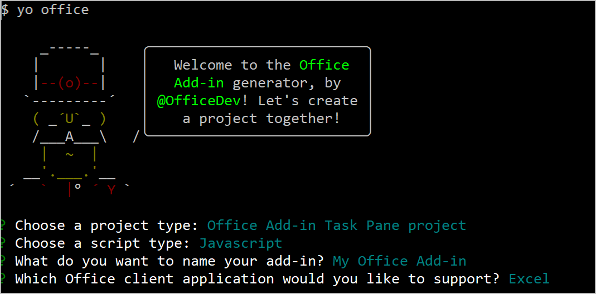
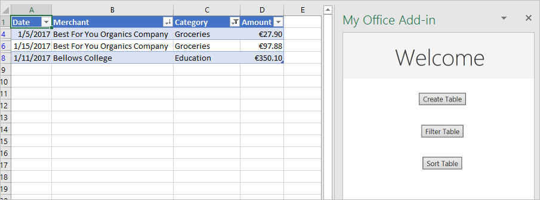

# <a name="tutorial-create-an-excel-task-pane-add-in"></a><span data-ttu-id="44a02-103">チュートリアル: Excel 作業ウィンドウ アドインを作成する</span><span class="sxs-lookup"><span data-stu-id="44a02-103">Tutorial: Create an Excel task pane add-in</span></span>

<span data-ttu-id="44a02-104">このチュートリアルでは、以下を実行する Excel 作業ウィンドウ アドインを作成します。</span><span class="sxs-lookup"><span data-stu-id="44a02-104">In this tutorial, you'll create an Excel task pane add-in that:</span></span>

> [!div class="checklist"]
> * <span data-ttu-id="44a02-105">テーブルの作成</span><span class="sxs-lookup"><span data-stu-id="44a02-105">Creates a table</span></span>
> * <span data-ttu-id="44a02-106">テーブルのフィルター処理と並べ替え</span><span class="sxs-lookup"><span data-stu-id="44a02-106">Filters and sorts a table</span></span>
> * <span data-ttu-id="44a02-107">グラフの作成</span><span class="sxs-lookup"><span data-stu-id="44a02-107">Creates a chart</span></span>
> * <span data-ttu-id="44a02-108">テーブルのヘッダーの固定</span><span class="sxs-lookup"><span data-stu-id="44a02-108">Freezes a table header</span></span>
> * <span data-ttu-id="44a02-109">ワークシートの保護</span><span class="sxs-lookup"><span data-stu-id="44a02-109">Protects a worksheet</span></span>
> * <span data-ttu-id="44a02-110">ダイアログを開く</span><span class="sxs-lookup"><span data-stu-id="44a02-110">Opens a dialog</span></span>

> [!TIP]
> <span data-ttu-id="44a02-111">既に [[Excel タスク ウィンドウ アドインのビルド](../quickstarts/excel-quickstart-jquery.md)] の クイックスタートを完​​了しており、このチュートリアルの出発点としてそのプロジェクトを使用する場合は、[[テーブルの作成](#create-a-table)] セクションに直接移動します。</span><span class="sxs-lookup"><span data-stu-id="44a02-111">If you've already completed the [Build an Excel task pane add-in](../quickstarts/excel-quickstart-jquery.md) quick start, and want to use that project as a starting point for this tutorial, go directly to the [Create a table](#create-a-table) section to start this tutorial.</span></span>

## <a name="prerequisites"></a><span data-ttu-id="44a02-112">前提条件</span><span class="sxs-lookup"><span data-stu-id="44a02-112">Prerequisites</span></span>

[!include[Yeoman generator prerequisites](../includes/quickstart-yo-prerequisites.md)]

## <a name="create-your-add-in-project"></a><span data-ttu-id="44a02-113">アドイン プロジェクトの作成</span><span class="sxs-lookup"><span data-stu-id="44a02-113">Create your add-in project</span></span>

[!include[Yeoman generator create project guidance](../includes/yo-office-command-guidance.md)]

- <span data-ttu-id="44a02-114">**Choose a project type: (プロジェクトの種類を選択)** `Office Add-in Task Pane project`</span><span class="sxs-lookup"><span data-stu-id="44a02-114">**Choose a project type:** `Office Add-in Task Pane project`</span></span>
- <span data-ttu-id="44a02-115">**Choose a script type: (スクリプトの種類を選択)** `Javascript`</span><span class="sxs-lookup"><span data-stu-id="44a02-115">**Choose a script type:** `Javascript`</span></span>
- <span data-ttu-id="44a02-116">**What would you want to name your add-in?: (アドインの名前を何にしますか)**</span><span class="sxs-lookup"><span data-stu-id="44a02-116">**What do you want to name your add-in?**</span></span> `My Office Add-in`
- <span data-ttu-id="44a02-117">**Which Office client application would you like to support?: (どの Office クライアント アプリケーションをサポートしますか)**</span><span class="sxs-lookup"><span data-stu-id="44a02-117">**Which Office client application would you like to support?**</span></span> `Excel`



<span data-ttu-id="44a02-119">ウィザードを完了すると、ジェネレーターによってプロジェクトが作成されて、サポートしているノード コンポーネントがインストールされます。</span><span class="sxs-lookup"><span data-stu-id="44a02-119">After you complete the wizard, the generator creates the project and installs supporting Node components.</span></span>

[!include[Yeoman generator next steps](../includes/yo-office-next-steps.md)]

## <a name="create-a-table"></a><span data-ttu-id="44a02-120">表を作成する</span><span class="sxs-lookup"><span data-stu-id="44a02-120">Create a table</span></span>

<span data-ttu-id="44a02-121">チュートリアルのこの手順では、プログラムによってアドインがユーザーの Excel の現在のバージョンをサポートしているかどうかをテストし、ワークシートにテーブルを追加して、そのテーブルのデータ設定と書式設定を実行します。</span><span class="sxs-lookup"><span data-stu-id="44a02-121">In this step of the tutorial, you'll programmatically test that your add-in supports the user's current version of Excel, add a table to a worksheet, populate the table with data, and format it.</span></span>

### <a name="code-the-add-in"></a><span data-ttu-id="44a02-122">アドインのコードを作成する</span><span class="sxs-lookup"><span data-stu-id="44a02-122">Code the add-in</span></span>

1. <span data-ttu-id="44a02-123">コード エディターでプロジェクトを開きます。</span><span class="sxs-lookup"><span data-stu-id="44a02-123">Open the project in your code editor.</span></span>

2. <span data-ttu-id="44a02-124">ファイル **./src/taskpane/taskpane.html** を開きます。</span><span class="sxs-lookup"><span data-stu-id="44a02-124">Open the file **./src/taskpane/taskpane.html**.</span></span>  <span data-ttu-id="44a02-125">このファイルには、作業ウィンドウの HTML マークアップが含まれます。</span><span class="sxs-lookup"><span data-stu-id="44a02-125">This file contains the HTML markup for the task pane.</span></span>

3. <span data-ttu-id="44a02-126">`<main>` 要素を見つけて、開始 `<main>` タグの後、終了 `</main>` タグの前に表示されるすべての行を削除します。</span><span class="sxs-lookup"><span data-stu-id="44a02-126">Locate the `<main>` element and delete all lines that appear after the opening `<main>` tag and before the closing `</main>` tag.</span></span>

4. <span data-ttu-id="44a02-127">開始 `<main>` タグの後に次のマークアップを追加します。</span><span class="sxs-lookup"><span data-stu-id="44a02-127">Add the following markup immediately after the opening `<main>` tag:</span></span>

    ```html
    <button class="ms-Button" id="create-table">Create Table</button><br/><br/>
    ```

5. <span data-ttu-id="44a02-128">ファイル **./src/taskpane/taskpane.js** を開きます。</span><span class="sxs-lookup"><span data-stu-id="44a02-128">Open the file **./src/taskpane/taskpane.js**.</span></span> <span data-ttu-id="44a02-129">このファイルには、作業ウィンドウと Office のホスト アプリケーションの間のやり取りを容易にする Office JavaScript API コードが含まれています。</span><span class="sxs-lookup"><span data-stu-id="44a02-129">This file contains the Office JavaScript API code that facilitates interaction between the task pane and the Office host application.</span></span>

6. <span data-ttu-id="44a02-130">次の操作を行って、[`run`] ボタンと [`run()`] 関数へのすべての参照を削除します。</span><span class="sxs-lookup"><span data-stu-id="44a02-130">Remove all references to the `run` button and the `run()` function by doing the following:</span></span>

    - <span data-ttu-id="44a02-131">`document.getElementById("run").onclick = run;` 行を見つけて削除します。</span><span class="sxs-lookup"><span data-stu-id="44a02-131">Locate and delete the line `document.getElementById("run").onclick = run;`.</span></span>

    - <span data-ttu-id="44a02-132">`run()` 関数全体を見つけて削除します。</span><span class="sxs-lookup"><span data-stu-id="44a02-132">Locate and delete the entire `run()` function.</span></span>

7. <span data-ttu-id="44a02-133">`Office.onReady` メソッドの呼び出しで、`if (info.host === Office.HostType.Excel) {` 行を見つけ、その行の直後に次のコードを追加します。</span><span class="sxs-lookup"><span data-stu-id="44a02-133">Within the `Office.onReady` method call, locate the line `if (info.host === Office.HostType.Excel) {` and add the following code immediately after that line.</span></span> <span data-ttu-id="44a02-134">注:</span><span class="sxs-lookup"><span data-stu-id="44a02-134">Note:</span></span>

    - <span data-ttu-id="44a02-135">このコードの最初の部分では、ユーザーの Excel のバージョンが、このチュートリアルのシリーズで使用する API をすべて含んでいるバージョンの Excel.js をサポートしているかどうかを調べます。</span><span class="sxs-lookup"><span data-stu-id="44a02-135">The first part of this code determines whether the user's version of Excel supports a version of Excel.js that includes all the APIs that this series of tutorials will use.</span></span> <span data-ttu-id="44a02-136">運用アドインでは、未サポートの API を呼び出す UI を非表示または無効化する条件ブロックの本体を使用してください。</span><span class="sxs-lookup"><span data-stu-id="44a02-136">In a production add-in, use the body of the conditional block to hide or disable the UI that would call unsupported APIs.</span></span> <span data-ttu-id="44a02-137">これにより、ユーザーは、そのユーザーの Excel のバージョンでサポートされているアドインの部分を使用できるようになります。</span><span class="sxs-lookup"><span data-stu-id="44a02-137">This will enable the user to still make use of the parts of the add-in that are supported by their version of Excel.</span></span>

    - <span data-ttu-id="44a02-138">2 番目の部分では、[`create-table`] ボタンのイベント ハンドラーを追加します。</span><span class="sxs-lookup"><span data-stu-id="44a02-138">The second part of this code adds an event handler for the `create-table` button.</span></span>

    ```js
    // Determine if the user's version of Office supports all the Office.js APIs that are used in the tutorial.
    if (!Office.context.requirements.isSetSupported('ExcelApi', '1.7')) {
        console.log('Sorry. The tutorial add-in uses Excel.js APIs that are not available in your version of Office.');
    }

    // Assign event handlers and other initialization logic.
    document.getElementById("create-table").onclick = createTable;
    ```

8. <span data-ttu-id="44a02-139">次の関数をファイルの最後に追加します。</span><span class="sxs-lookup"><span data-stu-id="44a02-139">Add the following function to the end of the file.</span></span> <span data-ttu-id="44a02-140">注:</span><span class="sxs-lookup"><span data-stu-id="44a02-140">Note:</span></span>

    - <span data-ttu-id="44a02-p106">Excel .js のビジネスロジックが `Excel.run`に渡される関数に追加されます。このロジックは直ちには実行されません。代わりに、保留中のコマンドのキューに追加されます。</span><span class="sxs-lookup"><span data-stu-id="44a02-p106">Your Excel.js business logic will be added to the function that is passed to `Excel.run`. This logic does not execute immediately. Instead, it is added to a queue of pending commands.</span></span>

    - <span data-ttu-id="44a02-144">`context.sync` メソッドは、キューに登録されたすべてのコマンドを実行するために Excel に送信します。</span><span class="sxs-lookup"><span data-stu-id="44a02-144">The `context.sync` method sends all queued commands to Excel for execution.</span></span>

    - <span data-ttu-id="44a02-p107">これは、どのような場合にも当てはまるベスト プラクティスです。</span><span class="sxs-lookup"><span data-stu-id="44a02-p107">The `Excel.run` is followed by a `catch` block. This is a best practice that you should always follow.</span></span> 

    ```js
    function createTable() {
        Excel.run(function (context) {

            // TODO1: Queue table creation logic here.

            // TODO2: Queue commands to populate the table with data.

            // TODO3: Queue commands to format the table.

            return context.sync();
        })
        .catch(function (error) {
            console.log("Error: " + error);
            if (error instanceof OfficeExtension.Error) {
                console.log("Debug info: " + JSON.stringify(error.debugInfo));
            }
        });
    }
    ```

9. <span data-ttu-id="44a02-147">`createTable()` 関数で、`TODO1` を次のコードに置き換えます。</span><span class="sxs-lookup"><span data-stu-id="44a02-147">Within the `createTable()` function, replace `TODO1` with the following code.</span></span> <span data-ttu-id="44a02-148">注:</span><span class="sxs-lookup"><span data-stu-id="44a02-148">Note:</span></span>

    - <span data-ttu-id="44a02-p109">コードは、ワークシートのテーブルコレクションの `add` メソッドを使用してテーブルを作成します。これは空の場合でも常に存在します。これは、Excel .js オブジェクトが作成される標準的な方法です。クラスコンストラクター Api はありません。 `new` 演算子を使用して Excel オブジェクトを作成することはできません。代わりに、親コレクションオブジェクトに追加します。</span><span class="sxs-lookup"><span data-stu-id="44a02-p109">The code creates a table by using `add` method of a worksheet's table collection, which always exists even if it is empty. This is the standard way that Excel.js objects are created. There are no class constructor APIs, and you never use a `new` operator to create an Excel object. Instead, you add to a parent collection object.</span></span>

    - <span data-ttu-id="44a02-p110">`add` の最初のパラメーターは、テーブルの一番上の行のみの範囲で、テーブルが最終的に使用する範囲全体ではありません。これは、アドインがデータ行にデータを入力するときに、既存の行のセルに値を入力する代わりに、テーブルに新しい行を追加するためです。テーブルを作成するときに、テーブルに含まれる行の数がわからないことが多いため、これはより一般的なパターンです。</span><span class="sxs-lookup"><span data-stu-id="44a02-p110">The first parameter of the `add` method is the range of only the top row of the table, not the entire range the table will ultimately use. This is because when the add-in populates the data rows (in the next step), it will add new rows to the table instead of writing values to the cells of existing rows. This is a more common pattern because the number of rows that a table will have is often not known when the table is created.</span></span>

    - <span data-ttu-id="44a02-156">テーブルの名前は、ワークシート内だけでなくブック全体で一意にする必要があります。</span><span class="sxs-lookup"><span data-stu-id="44a02-156">Table names must be unique across the entire workbook, not just the worksheet.</span></span>

    ```js
    var currentWorksheet = context.workbook.worksheets.getActiveWorksheet();
    var expensesTable = currentWorksheet.tables.add("A1:D1", true /*hasHeaders*/);
    expensesTable.name = "ExpensesTable";
    ```

10. <span data-ttu-id="44a02-157">`createTable()` 関数で、`TODO2` を次のコードに置き換えます。</span><span class="sxs-lookup"><span data-stu-id="44a02-157">Within the `createTable()` function, replace `TODO2` with the following code.</span></span> <span data-ttu-id="44a02-158">注:</span><span class="sxs-lookup"><span data-stu-id="44a02-158">Note:</span></span>

    - <span data-ttu-id="44a02-159">範囲に含まれるセルの値は、配列の配列で設定します。</span><span class="sxs-lookup"><span data-stu-id="44a02-159">The cell values of a range are set with an array of arrays.</span></span>

    - <span data-ttu-id="44a02-p112">テーブルに新しい行が作成されるのは、テーブルの行コレクションの `add` メソッドを呼び出すことです。2番目のパラメーターとして渡される親の配列に複数のセル値の配列を含めることにより、1つの `add` 呼び出しに複数の行を追加できます。</span><span class="sxs-lookup"><span data-stu-id="44a02-p112">New rows are created in a table by calling the `add` method of the table's row collection. You can add multiple rows in a single call of `add` by including multiple cell value arrays in the parent array that is passed as the second parameter.</span></span>

    ```js
    expensesTable.getHeaderRowRange().values =
        [["Date", "Merchant", "Category", "Amount"]];

    expensesTable.rows.add(null /*add at the end*/, [
        ["1/1/2017", "The Phone Company", "Communications", "120"],
        ["1/2/2017", "Northwind Electric Cars", "Transportation", "142.33"],
        ["1/5/2017", "Best For You Organics Company", "Groceries", "27.9"],
        ["1/10/2017", "Coho Vineyard", "Restaurant", "33"],
        ["1/11/2017", "Bellows College", "Education", "350.1"],
        ["1/15/2017", "Trey Research", "Other", "135"],
        ["1/15/2017", "Best For You Organics Company", "Groceries", "97.88"]
    ]);
    ```

11. <span data-ttu-id="44a02-162">`createTable()` 関数で、`TODO3` を次のコードに置き換えます。</span><span class="sxs-lookup"><span data-stu-id="44a02-162">Within the `createTable()` function, replace `TODO3` with the following code.</span></span> <span data-ttu-id="44a02-163">注:</span><span class="sxs-lookup"><span data-stu-id="44a02-163">Note:</span></span>

    - <span data-ttu-id="44a02-164">このコードでは、ゼロから始まるインデックスをテーブルの列コレクションの `getItemAt` メソッドに渡すことで、**Amount** 列への参照を取得します。</span><span class="sxs-lookup"><span data-stu-id="44a02-164">The code gets a reference to the **Amount** column by passing its zero-based index to the `getItemAt` method of the table's column collection.</span></span>

        > [!NOTE]
        > <span data-ttu-id="44a02-165">Excel.js のコレクション オブジェクト (`TableCollection`、`WorksheetCollection`、`TableColumnCollection` など) には、`items` プロパティがあります。このプロパティは、子オブジェクト タイプ (`Table`、`Worksheet`、`TableColumn` など) の配列ですが、`*Collection` オブジェクト自体は配列ではありません。</span><span class="sxs-lookup"><span data-stu-id="44a02-165">Excel.js collection objects, such as `TableCollection`, `WorksheetCollection`, and `TableColumnCollection` have an `items` property that is an array of the child object types, such as `Table` or `Worksheet` or `TableColumn`; but a `*Collection` object is not itself an array.</span></span>

    - <span data-ttu-id="44a02-166">その次に、コードでは、**Amount** 列の範囲を小数点以下 2 桁までのユーロとして書式設定します。</span><span class="sxs-lookup"><span data-stu-id="44a02-166">The code then formats the range of the **Amount** column as Euros to the second decimal.</span></span> 

    - <span data-ttu-id="44a02-p114">最後に、列の幅と行の高さが、最も長い (または最も高い) データ項目の幅になるようにします。コードを書式設定するには `Range` オブジェクトを取得する必要があります。`TableColumn` と `TableRow` オブジェクトには、書式プロパティがありません。</span><span class="sxs-lookup"><span data-stu-id="44a02-p114">Finally, it ensures that the width of the columns and height of the rows is big enough to fit the longest (or tallest) data item. Notice that the code must get `Range` objects to format. `TableColumn` and `TableRow` objects do not have format properties.</span></span>

    ```js
    expensesTable.columns.getItemAt(3).getRange().numberFormat = [['\u20AC#,##0.00']];
    expensesTable.getRange().format.autofitColumns();
    expensesTable.getRange().format.autofitRows();
    ```

12. <span data-ttu-id="44a02-170">プロジェクトに行ったすべての変更が保存されていることを確認します。</span><span class="sxs-lookup"><span data-stu-id="44a02-170">Verify that you've saved all of the changes you've made to the project.</span></span>

### <a name="test-the-add-in"></a><span data-ttu-id="44a02-171">アドインをテストする</span><span class="sxs-lookup"><span data-stu-id="44a02-171">Test the add-in</span></span>

1. <span data-ttu-id="44a02-172">以下の手順を実行し、ローカル Web サーバーを起動してアドインのサイドロードを行います。</span><span class="sxs-lookup"><span data-stu-id="44a02-172">Complete the following steps to start the local web server and sideload your add-in.</span></span>

    > [!NOTE]
    > <span data-ttu-id="44a02-173">開発の最中でも、OfficeアドインはHTTPではなくHTTPSを使用する必要があります。</span><span class="sxs-lookup"><span data-stu-id="44a02-173">Office Add-ins should use HTTPS, not HTTP, even when you are developing.</span></span> <span data-ttu-id="44a02-174">次のいずれかのコマンドを実行した後に証明書をインストールするように求められた場合は、Yeoman ジェネレーターによって提供される証明書をインストールするプロンプトを受け入れます。</span><span class="sxs-lookup"><span data-stu-id="44a02-174">If you are prompted to install a certificate after you run one of the following commands, accept the prompt to install the certificate that the Yeoman generator provides.</span></span>

    > [!TIP]
    > <span data-ttu-id="44a02-175">Mac でアドインをテストする場合は、先に進む前にプロジェクトのルート ディレクトリで次のコマンドを実行します。</span><span class="sxs-lookup"><span data-stu-id="44a02-175">If you're testing your add-in on Mac, run the following command in the root directory of your project before proceeding.</span></span> <span data-ttu-id="44a02-176">このコマンドを実行すると、ローカル Web サーバーが起動します。</span><span class="sxs-lookup"><span data-stu-id="44a02-176">When you run this command, the local web server starts.</span></span>
    >
    > ```command&nbsp;line
    > npm run dev-server
    > ```

    - <span data-ttu-id="44a02-177">Excel でアドインをテストするには、プロジェクトのルート ディレクトリから次のコマンドを実行します。</span><span class="sxs-lookup"><span data-stu-id="44a02-177">To test your add-in in Excel, run the following command in the root directory of your project.</span></span> <span data-ttu-id="44a02-178">ローカル Web サーバーが (まだ実行されていない場合) 起動し、アドインが読み込まれた Excel が開きます。</span><span class="sxs-lookup"><span data-stu-id="44a02-178">This starts the local web server (if it's not already running) and opens Excel with your add-in loaded.</span></span>

        ```command&nbsp;line
        npm start
        ```

    - <span data-ttu-id="44a02-179">Excel on the web でアドインをテストするには、プロジェクトのルート ディレクトリから次のコマンドを実行します。</span><span class="sxs-lookup"><span data-stu-id="44a02-179">To test your add-in in Excel on the web, run the following command in the root directory of your project.</span></span> <span data-ttu-id="44a02-180">このコマンドを実行すると、ローカル Web サーバーが起動します (まだ実行されていない場合)。</span><span class="sxs-lookup"><span data-stu-id="44a02-180">When you run this command, the local web server will start (if it's not already running).</span></span>

        ```command&nbsp;line
        npm run start:web
        ```

        <span data-ttu-id="44a02-181">アドインを使用するには、Excel on the web で新しいドキュメントを開き、「[Office on the web で Office アドインをサイドロードする](../testing/sideload-office-add-ins-for-testing.md#sideload-an-office-add-in-in-office-on-the-web)」の手順に従ってアドインをサイドロードします。</span><span class="sxs-lookup"><span data-stu-id="44a02-181">To use your add-in, open a new document in Excel on the web and then sideload your add-in by following the instructions in [Sideload Office Add-ins in Office on the web](../testing/sideload-office-add-ins-for-testing.md#sideload-an-office-add-in-in-office-on-the-web).</span></span>

2. <span data-ttu-id="44a02-182">Excel で、**[ホーム]** タブを選択し、リボンの **[作業ウィンドウの表示]** ボタンをクリックして、アドインの作業ウィンドウを開きます。</span><span class="sxs-lookup"><span data-stu-id="44a02-182">In Excel, choose the **Home** tab, and then choose the **Show Taskpane** button in the ribbon to open the add-in task pane.</span></span>

    

3. <span data-ttu-id="44a02-184">作業ウィンドウで、[**テーブルの作成**] ボタンを選択します。</span><span class="sxs-lookup"><span data-stu-id="44a02-184">In the task pane, choose the **Create Table** button.</span></span>

    

## <a name="filter-and-sort-a-table"></a><span data-ttu-id="44a02-186">テーブルのフィルター処理と並べ替え</span><span class="sxs-lookup"><span data-stu-id="44a02-186">Filter and sort a table</span></span>

<span data-ttu-id="44a02-187">チュートリアルのこの手順では、以前に作成したテーブルをフィルター処理したり並べ替えたりします。</span><span class="sxs-lookup"><span data-stu-id="44a02-187">In this step of the tutorial, you'll filter and sort the table that you created previously.</span></span>

### <a name="filter-the-table"></a><span data-ttu-id="44a02-188">表のフィルター処理</span><span class="sxs-lookup"><span data-stu-id="44a02-188">Filter the table</span></span>

1. <span data-ttu-id="44a02-189">ファイル **./src/taskpane/taskpane.html** を開きます。</span><span class="sxs-lookup"><span data-stu-id="44a02-189">Open the file **./src/taskpane/taskpane.html**.</span></span>

2. <span data-ttu-id="44a02-190">`create-table` ボタンの `<button>` 要素を見つけ、その行の後に次のマークアップを追加します。</span><span class="sxs-lookup"><span data-stu-id="44a02-190">Locate the `<button>` element for the `create-table` button, and add the following markup after that line:</span></span>

    ```html
    <button class="ms-Button" id="filter-table">Filter Table</button><br/><br/>
    ```

3. <span data-ttu-id="44a02-191">ファイル **./src/taskpane/taskpane.js** を開きます。</span><span class="sxs-lookup"><span data-stu-id="44a02-191">Open the file **./src/taskpane/taskpane.js**.</span></span>

4. <span data-ttu-id="44a02-192">`Office.onReady` メソッドの呼び出し内で、クリック ハンドラーを `create-table` ボタンに割り当てる行を見つけ、その行の後に次のコードを追加します。</span><span class="sxs-lookup"><span data-stu-id="44a02-192">Within the `Office.onReady` method call, locate the line that assigns a click handler to the `create-table` button, and add the following code after that line:</span></span>

    ```js
    document.getElementById("filter-table").onclick = filterTable;
    ```

5. <span data-ttu-id="44a02-193">次の関数をファイルの最後に追加します。</span><span class="sxs-lookup"><span data-stu-id="44a02-193">Add the following function to the end of the file:</span></span>

    ```js
    function filterTable() {
        Excel.run(function (context) {

            // TODO1: Queue commands to filter out all expense categories except
            //        Groceries and Education.

            return context.sync();
        })
        .catch(function (error) {
            console.log("Error: " + error);
            if (error instanceof OfficeExtension.Error) {
                console.log("Debug info: " + JSON.stringify(error.debugInfo));
            }
        });
    }
    ```

6. <span data-ttu-id="44a02-194">`filterTable()` 関数で、`TODO1` を次のコードに置き換えます。</span><span class="sxs-lookup"><span data-stu-id="44a02-194">Within the `filterTable()` function, replace `TODO1` with the following code.</span></span> <span data-ttu-id="44a02-195">注:</span><span class="sxs-lookup"><span data-stu-id="44a02-195">Note:</span></span>

   - <span data-ttu-id="44a02-p120">このコードは、まず、`createTable` メソッドとして `getItemAt` メソッドにインデックスを渡す代わりに、列名をフィルター処理する必要がある列への参照を取得します。そのためには、最初に列名を `getItem` メソッドに渡す必要があります。ユーザーはテーブル列を移動できるので、テーブルの作成後に、指定されたインデックスの列は変更される場合があります。そのため、列名を使用する方が列を参照できます。このチュートリアルでは、テーブルを作成するのと同じ方法で使用するので、ユーザーが列を移動している可能性はありませんので、このチュートリアルでは、`getItemAt` 安全に使用しました。</span><span class="sxs-lookup"><span data-stu-id="44a02-p120">The code first gets a reference to the column that needs filtering by passing the column name to the `getItem` method, instead of passing its index to the `getItemAt` method as the `createTable` method does. Since users can move table columns, the column at a given index might change after the table is created. Hence, it is safer to use the column name to get a reference to the column. We used `getItemAt` safely in the preceding tutorial, because we used it in the very same method that creates the table, so there is no chance that a user has moved the column.</span></span>

   - <span data-ttu-id="44a02-200">`applyValuesFilter` メソッドは、`Filter` オブジェクトのフィルター処理方法の 1 つです。</span><span class="sxs-lookup"><span data-stu-id="44a02-200">The `applyValuesFilter` method is one of several filtering methods on the `Filter` object.</span></span>

    ```js
    var currentWorksheet = context.workbook.worksheets.getActiveWorksheet();
    var expensesTable = currentWorksheet.tables.getItem('ExpensesTable');
    var categoryFilter = expensesTable.columns.getItem('Category').filter;
    categoryFilter.applyValuesFilter(['Education', 'Groceries']);
    ``` 

### <a name="sort-the-table"></a><span data-ttu-id="44a02-201">表の並べ替え</span><span class="sxs-lookup"><span data-stu-id="44a02-201">Sort the table</span></span>

1. <span data-ttu-id="44a02-202">ファイル **./src/taskpane/taskpane.html** を開きます。</span><span class="sxs-lookup"><span data-stu-id="44a02-202">Open the file **./src/taskpane/taskpane.html**.</span></span>

2. <span data-ttu-id="44a02-203">`filter-table` ボタンの `<button>` 要素を見つけ、その行の後に次のマークアップを追加します。</span><span class="sxs-lookup"><span data-stu-id="44a02-203">Locate the `<button>` element for the `filter-table` button, and add the following markup after that line:</span></span> 

    ```html
    <button class="ms-Button" id="sort-table">Sort Table</button><br/><br/>
    ```

3. <span data-ttu-id="44a02-204">ファイル **./src/taskpane/taskpane.js** を開きます。</span><span class="sxs-lookup"><span data-stu-id="44a02-204">Open the file **./src/taskpane/taskpane.js**.</span></span>

4. <span data-ttu-id="44a02-205">`Office.onReady` メソッドの呼び出し内で、クリック ハンドラーを `filter-table` ボタンに割り当てる行を見つけ、その行の後に次のコードを追加します。</span><span class="sxs-lookup"><span data-stu-id="44a02-205">Within the `Office.onReady` method call, locate the line that assigns a click handler to the `filter-table` button, and add the following code after that line:</span></span>

    ```js
    document.getElementById("sort-table").onclick = sortTable;
    ```

5. <span data-ttu-id="44a02-206">次の関数をファイルの最後に追加します。</span><span class="sxs-lookup"><span data-stu-id="44a02-206">Add the following function to the end of the file:</span></span>

    ```js
    function sortTable() {
        Excel.run(function (context) {

            // TODO1: Queue commands to sort the table by Merchant name.

            return context.sync();
        })
        .catch(function (error) {
            console.log("Error: " + error);
            if (error instanceof OfficeExtension.Error) {
                console.log("Debug info: " + JSON.stringify(error.debugInfo));
            }
        });
    }
    ```

6. <span data-ttu-id="44a02-207">`sortTable()` 関数で、`TODO1` を次のコードに置き換えます。</span><span class="sxs-lookup"><span data-stu-id="44a02-207">Within the `sortTable()` function, replace `TODO1` with the following code.</span></span> <span data-ttu-id="44a02-208">注:</span><span class="sxs-lookup"><span data-stu-id="44a02-208">Note:</span></span>

   - <span data-ttu-id="44a02-209">アドインで並べ替えるのは Merchant 列のみであるため、このコードでは、1 つのメンバーだけを含む `SortField` オブジェクトの配列を作成します。</span><span class="sxs-lookup"><span data-stu-id="44a02-209">The code creates an array of `SortField` objects which has just one member since the add-in only sorts on the Merchant column.</span></span>

   - <span data-ttu-id="44a02-210">`SortField` オブジェクトの `key` プロパティは、並べ替える対象列の 0 から始まるインデックスです。</span><span class="sxs-lookup"><span data-stu-id="44a02-210">The `key` property of a `SortField` object is the zero-based index of the column to sort-on.</span></span>

   - <span data-ttu-id="44a02-211">`Table` の `sort` メンバーは、`TableSort` オブジェクトであり、メソッドではありません。</span><span class="sxs-lookup"><span data-stu-id="44a02-211">The `sort` member of a `Table` is a `TableSort` object, not a method.</span></span> <span data-ttu-id="44a02-212">`TableSort` オブジェクトの `apply` メソッドには、`SortField` が渡されます。</span><span class="sxs-lookup"><span data-stu-id="44a02-212">The `SortField`s are passed to the `TableSort` object's `apply` method.</span></span>

    ```js
    var currentWorksheet = context.workbook.worksheets.getActiveWorksheet();
    var expensesTable = currentWorksheet.tables.getItem('ExpensesTable');
    var sortFields = [
        {
            key: 1,            // Merchant column
            ascending: false,
        }
    ];

    expensesTable.sort.apply(sortFields);
    ```

7. <span data-ttu-id="44a02-213">プロジェクトに行ったすべての変更が保存されていることを確認します。</span><span class="sxs-lookup"><span data-stu-id="44a02-213">Verify that you've saved all of the changes you've made to the project.</span></span>

### <a name="test-the-add-in"></a><span data-ttu-id="44a02-214">アドインをテストする</span><span class="sxs-lookup"><span data-stu-id="44a02-214">Test the add-in</span></span>

1. [!include[Start server and sideload add-in instructions](../includes/tutorial-excel-start-server.md)]

2. <span data-ttu-id="44a02-215">アドイン タスク ウィンドウが Excel でまだ開いていない場合は、[**ホーム**] タブに移動し、リボンの [**作業ウィンドウを表示**] ボタンを選択して開きます。</span><span class="sxs-lookup"><span data-stu-id="44a02-215">If the add-in task pane isn't already open in Excel, go to the **Home** tab and choose the **Show Taskpane** button in the ribbon to open it.</span></span>

3. <span data-ttu-id="44a02-216">このチュートリアルで以前に追加したテーブルが、開いているワークシートにない場合は、タスク ウィンドウの [**テーブルの作成**] ボタンを選択します。</span><span class="sxs-lookup"><span data-stu-id="44a02-216">If the table you added previously in this tutorial is not present in the open worksheet, choose the **Create Table** button in the task pane.</span></span>

4. <span data-ttu-id="44a02-217">[**テーブルのフィルター**] ボタンと [**テーブルの並べ替え**] ボタンを任意の順序で選択します。</span><span class="sxs-lookup"><span data-stu-id="44a02-217">Choose the **Filter Table** button and the **Sort Table** button, in either order.</span></span>

    

## <a name="create-a-chart"></a><span data-ttu-id="44a02-219">グラフの作成</span><span class="sxs-lookup"><span data-stu-id="44a02-219">Create a chart</span></span>

<span data-ttu-id="44a02-220">チュートリアルのこの手順では、前の手順で作成したテーブルのデータを使用してグラフを作成して、そのグラフの書式を設定します。</span><span class="sxs-lookup"><span data-stu-id="44a02-220">In this step of the tutorial, you'll create a chart using data from the table that you created previously, and then format the chart.</span></span>

### <a name="chart-a-chart-using-table-data"></a><span data-ttu-id="44a02-221">テーブルのデータを使用してグラフを作成する</span><span class="sxs-lookup"><span data-stu-id="44a02-221">Chart a chart using table data</span></span>

1. <span data-ttu-id="44a02-222">ファイル **./src/taskpane/taskpane.html** を開きます。</span><span class="sxs-lookup"><span data-stu-id="44a02-222">Open the file **./src/taskpane/taskpane.html**.</span></span>

2. <span data-ttu-id="44a02-223">`sort-table` ボタンの `<button>` 要素を見つけ、その行の後に次のマークアップを追加します。</span><span class="sxs-lookup"><span data-stu-id="44a02-223">Locate the `<button>` element for the `sort-table` button, and add the following markup after that line:</span></span> 

    ```html
    <button class="ms-Button" id="create-chart">Create Chart</button><br/><br/>
    ```

3. <span data-ttu-id="44a02-224">ファイル **./src/taskpane/taskpane.js** を開きます。</span><span class="sxs-lookup"><span data-stu-id="44a02-224">Open the file **./src/taskpane/taskpane.js**.</span></span>

4. <span data-ttu-id="44a02-225">`Office.onReady` メソッドの呼び出し内で、クリック ハンドラーを `sort-table` ボタンに割り当てる行を見つけ、その行の後に次のコードを追加します。</span><span class="sxs-lookup"><span data-stu-id="44a02-225">Within the `Office.onReady` method call, locate the line that assigns a click handler to the `sort-table` button, and add the following code after that line:</span></span>

    ```js
    document.getElementById("create-chart").onclick = createChart;
    ```

5. <span data-ttu-id="44a02-226">次の関数をファイルの最後に追加します。</span><span class="sxs-lookup"><span data-stu-id="44a02-226">Add the following function to the end of the file:</span></span>

    ```js
    function createChart() {
        Excel.run(function (context) {

            // TODO1: Queue commands to get the range of data to be charted.

            // TODO2: Queue command to create the chart and define its type.

            // TODO3: Queue commands to position and format the chart.

            return context.sync();
        })
        .catch(function (error) {
            console.log("Error: " + error);
            if (error instanceof OfficeExtension.Error) {
                console.log("Debug info: " + JSON.stringify(error.debugInfo));
            }
        });
    }
    ```

6. <span data-ttu-id="44a02-227">`createChart()` 関数で、`TODO1` を次のコードに置き換えます。</span><span class="sxs-lookup"><span data-stu-id="44a02-227">Within the `createChart()` function, replace `TODO1` with the following code.</span></span> <span data-ttu-id="44a02-228">ヘッダー行を除外するために、このコードでは、`getRange` メソッドではなく `Table.getDataBodyRange` メソッドを使用してグラフを作成するデータの範囲を取得しています。</span><span class="sxs-lookup"><span data-stu-id="44a02-228">Note that in order to exclude the header row, the code uses the `Table.getDataBodyRange` method to get the range of data you want to chart instead of the `getRange` method.</span></span>

    ```js
    var currentWorksheet = context.workbook.worksheets.getActiveWorksheet();
    var expensesTable = currentWorksheet.tables.getItem('ExpensesTable');
    var dataRange = expensesTable.getDataBodyRange();
    ```

7. <span data-ttu-id="44a02-229">`createChart()` 関数で、`TODO2` を次のコードに置き換えます。</span><span class="sxs-lookup"><span data-stu-id="44a02-229">Within the `createChart()` function, replace `TODO2` with the following code.</span></span> <span data-ttu-id="44a02-230">次のパラメーターに注意してください。</span><span class="sxs-lookup"><span data-stu-id="44a02-230">Note the following parameters:</span></span>

   - <span data-ttu-id="44a02-p125">`add` への最初のパラメーターでは、グラフの種類を指定します。数十種類あります。</span><span class="sxs-lookup"><span data-stu-id="44a02-p125">The first parameter to the `add` method specifies the type of chart. There are several dozen types.</span></span>

   - <span data-ttu-id="44a02-233">2 番目のパラメーターでは、グラフに含めるデータの範囲を指定します。</span><span class="sxs-lookup"><span data-stu-id="44a02-233">The second parameter specifies the range of data to include in the chart.</span></span>

   - <span data-ttu-id="44a02-234">3 番目のパラメーターでは、テーブルからの一連のデータ ポイントを行方向と列方向のどちらでグラフ化する必要があるかを決定します。</span><span class="sxs-lookup"><span data-stu-id="44a02-234">The third parameter determines whether a series of data points from the table should be charted row-wise or column-wise.</span></span> <span data-ttu-id="44a02-235">オプション `auto` は、最適な方法を判断するように Excel に指示します。</span><span class="sxs-lookup"><span data-stu-id="44a02-235">The option `auto` tells Excel to decide the best method.</span></span>

    ```js
    var chart = currentWorksheet.charts.add('ColumnClustered', dataRange, 'auto');
    ```

8. <span data-ttu-id="44a02-236">`createChart()` 関数で、`TODO3` を次のコードに置き換えます。</span><span class="sxs-lookup"><span data-stu-id="44a02-236">Within the `createChart()` function, replace `TODO3` with the following code.</span></span> <span data-ttu-id="44a02-237">このコードのほとんどの部分は、わかりやすく説明不要なものです。</span><span class="sxs-lookup"><span data-stu-id="44a02-237">Most of this code is self-explanatory.</span></span> <span data-ttu-id="44a02-238">注:</span><span class="sxs-lookup"><span data-stu-id="44a02-238">Note:</span></span>
   
   - <span data-ttu-id="44a02-p128">`setPosition` 方法のパラメーターでは、グラフを挿入するワークシート領域の左上のセルを指定します。Excel では、指定した空間でグラフを見栄えよくするために、線の太さなどの調整ができます。</span><span class="sxs-lookup"><span data-stu-id="44a02-p128">The parameters to the `setPosition` method specify the upper left and lower right cells of the worksheet area that should contain the chart. Excel can adjust things like line width to make the chart look good in the space it has been given.</span></span>
   
   - <span data-ttu-id="44a02-p129">"系列" とは、テーブルの 1 つの列にある一連のデータ ポイントのことです。このテーブルには文字列以外の列は 1 列しか含まれていないため、Excel は、グラフ化するデータ ポイントの列は、この列のみであると推測します。その他の列はグラフのラベルであると解釈されます。従って、グラフに含まれる系列は 1 つのみとなり、この系列のインデックスは 0 となります。を含みます。"&euro; での値" というラベルを付ける系列は、 この系列です。</span><span class="sxs-lookup"><span data-stu-id="44a02-p129">A "series" is a set of data points from a column of the table. Since there is only one non-string column in the table, Excel infers that the column is the only column of data points to chart. It interprets the other columns as chart labels. So there will be just one series in the chart and it will have index 0. This is the one to label with "Value in &euro;".</span></span>

    ```js
    chart.setPosition("A15", "F30");
    chart.title.text = "Expenses";
    chart.legend.position = "right"
    chart.legend.format.fill.setSolidColor("white");
    chart.dataLabels.format.font.size = 15;
    chart.dataLabels.format.font.color = "black";
    chart.series.getItemAt(0).name = 'Value in &euro;';
    ```

9. <span data-ttu-id="44a02-246">プロジェクトに行ったすべての変更が保存されていることを確認します。</span><span class="sxs-lookup"><span data-stu-id="44a02-246">Verify that you've saved all of the changes you've made to the project.</span></span>

### <a name="test-the-add-in"></a><span data-ttu-id="44a02-247">アドインをテストする</span><span class="sxs-lookup"><span data-stu-id="44a02-247">Test the add-in</span></span>

1. [!include[Start server and sideload add-in instructions](../includes/tutorial-excel-start-server.md)]

2. <span data-ttu-id="44a02-248">アドイン タスク ウィンドウが Excel でまだ開いていない場合は、[**ホーム**] タブに移動し、リボンの [**作業ウィンドウを表示**] ボタンを選択して開きます。</span><span class="sxs-lookup"><span data-stu-id="44a02-248">If the add-in task pane isn't already open in Excel, go to the **Home** tab and choose the **Show Taskpane** button in the ribbon to open it.</span></span>

3. <span data-ttu-id="44a02-249">このチュートリアルで以前に追加したテーブルが、開いているワークシートにない場合は、タスク ウィンドウの [**テーブルの作成**] ボタンを選択します。次に、[**テーブルのフィルター処理**] ボタン、および [**テーブルの並べ替え**] ボタンのいずれかを選択します。</span><span class="sxs-lookup"><span data-stu-id="44a02-249">If the table you added previously in this tutorial is not present in the open worksheet, choose the **Create Table** button, and then the **Filter Table** button and the **Sort Table** button, in either order.</span></span>

4. <span data-ttu-id="44a02-p130">[グラフの作成 \*\*\*\*] ボタンを選択します。グラフが作成され、フィルター処理された行のデータのみが含まれます。一番下にあるデータポイントのラベルは、グラフの並べ替え順序になります。つまり、名前の逆アルファベット順での商社の名前です。</span><span class="sxs-lookup"><span data-stu-id="44a02-p130">Choose the **Create Chart** button. A chart is created and only the data from the rows that have been filtered are included. The labels on the data points across the bottom are in the sort order of the chart; that is, merchant names in reverse alphabetical order.</span></span>

    

## <a name="freeze-a-table-header"></a><span data-ttu-id="44a02-254">テーブルのヘッダーの固定</span><span class="sxs-lookup"><span data-stu-id="44a02-254">Freeze a table header</span></span>

<span data-ttu-id="44a02-p131">ユーザーがスクロールして一部の行を見る必要があるほど長いテーブルがあると、見出し行がスクロールして見えなくなります。チュートリアルのこの手順では、ユーザーがワークシートを下にスクロールしても表示されるように、前に作成したテーブルの見出し行を固定します。</span><span class="sxs-lookup"><span data-stu-id="44a02-p131">When a table is long enough that a user must scroll to see some rows, the header row can scroll out of sight. In this step of the tutorial, you'll freeze the header row of the table that you created previously, so that it remains visible even as the user scrolls down the worksheet.</span></span>

### <a name="freeze-the-tables-header-row"></a><span data-ttu-id="44a02-257">表のヘッダー行を固定する</span><span class="sxs-lookup"><span data-stu-id="44a02-257">Freeze the table's header row</span></span>

1. <span data-ttu-id="44a02-258">ファイル **./src/taskpane/taskpane.html** を開きます。</span><span class="sxs-lookup"><span data-stu-id="44a02-258">Open the file **./src/taskpane/taskpane.html**.</span></span>

2. <span data-ttu-id="44a02-259">`create-chart` ボタンの `<button>` 要素を見つけ、その行の後に次のマークアップを追加します。</span><span class="sxs-lookup"><span data-stu-id="44a02-259">Locate the `<button>` element for the `create-chart` button, and add the following markup after that line:</span></span> 

    ```html
    <button class="ms-Button" id="freeze-header">Freeze Header</button><br/><br/>
    ```

3. <span data-ttu-id="44a02-260">ファイル **./src/taskpane/taskpane.js** を開きます。</span><span class="sxs-lookup"><span data-stu-id="44a02-260">Open the file **./src/taskpane/taskpane.js**.</span></span>

4. <span data-ttu-id="44a02-261">`Office.onReady` メソッドの呼び出し内で、クリック ハンドラーを `create-chart` ボタンに割り当てる行を見つけ、その行の後に次のコードを追加します。</span><span class="sxs-lookup"><span data-stu-id="44a02-261">Within the `Office.onReady` method call, locate the line that assigns a click handler to the `create-chart` button, and add the following code after that line:</span></span>

    ```js
    document.getElementById("freeze-header").onclick = freezeHeader;
    ```

5. <span data-ttu-id="44a02-262">次の関数をファイルの最後に追加します。</span><span class="sxs-lookup"><span data-stu-id="44a02-262">Add the following function to the end of the file:</span></span>

    ```js
    function freezeHeader() {
        Excel.run(function (context) {

            // TODO1: Queue commands to keep the header visible when the user scrolls.

            return context.sync();
        })
        .catch(function (error) {
            console.log("Error: " + error);
            if (error instanceof OfficeExtension.Error) {
                console.log("Debug info: " + JSON.stringify(error.debugInfo));
            }
        });
    }
    ```

6. <span data-ttu-id="44a02-263">`freezeHeader()` 関数で、`TODO1` を次のコードに置き換えます。</span><span class="sxs-lookup"><span data-stu-id="44a02-263">Within the `freezeHeader()` function, replace `TODO1` with the following code.</span></span> <span data-ttu-id="44a02-264">注:</span><span class="sxs-lookup"><span data-stu-id="44a02-264">Note:</span></span>

   - <span data-ttu-id="44a02-265">`Worksheet.freezePanes` コレクションは、ワークシートのスクロール操作時に、ワークシート上でピン留めつまり固定される一式のペインのことです。</span><span class="sxs-lookup"><span data-stu-id="44a02-265">The `Worksheet.freezePanes` collection is a set of panes in the worksheet that are pinned, or frozen, in place when the worksheet is scrolled.</span></span>

   - <span data-ttu-id="44a02-p133">`freezeRows` メソッドでは、上から数えた行数を、ピン留めする位置のパラメーターとして使用します。`1` を渡して最初の行を適所にピン留めします。</span><span class="sxs-lookup"><span data-stu-id="44a02-p133">The `freezeRows` method takes as a parameter the number of rows, from the top that are to be pinned in place. We pass `1` to pin the first row in place.</span></span>

    ```js
    var currentWorksheet = context.workbook.worksheets.getActiveWorksheet();
    currentWorksheet.freezePanes.freezeRows(1);
    ```

7. <span data-ttu-id="44a02-268">プロジェクトに行ったすべての変更が保存されていることを確認します。</span><span class="sxs-lookup"><span data-stu-id="44a02-268">Verify that you've saved all of the changes you've made to the project.</span></span>

### <a name="test-the-add-in"></a><span data-ttu-id="44a02-269">アドインをテストする</span><span class="sxs-lookup"><span data-stu-id="44a02-269">Test the add-in</span></span>

1. [!include[Start server and sideload add-in instructions](../includes/tutorial-excel-start-server.md)]

2. <span data-ttu-id="44a02-270">アドイン タスク ウィンドウが Excel でまだ開いていない場合は、[**ホーム**] タブに移動し、リボンの [**作業ウィンドウを表示**] ボタンを選択して開きます。</span><span class="sxs-lookup"><span data-stu-id="44a02-270">If the add-in task pane isn't already open in Excel, go to the **Home** tab and choose the **Show Taskpane** button in the ribbon to open it.</span></span>

3. <span data-ttu-id="44a02-271">このチュートリアルに以前追加したテーブルがワークシートに存在する場合は、それを削除します。</span><span class="sxs-lookup"><span data-stu-id="44a02-271">If the table you added previously in this tutorial is present in the worksheet, delete it.</span></span>

4. <span data-ttu-id="44a02-272">作業ウィンドウで、[**テーブルの作成**] ボタンを選択します。</span><span class="sxs-lookup"><span data-stu-id="44a02-272">In the task pane, choose the **Create Table** button.</span></span>

5. <span data-ttu-id="44a02-273">作業ウィンドウで、[**ヘッダーを固定**] ボタンを選択します。</span><span class="sxs-lookup"><span data-stu-id="44a02-273">In the task pane, choose the **Freeze Header** button.</span></span>

6. <span data-ttu-id="44a02-274">ヘッダー以降の行が画面の外に出て見えなくなるまでワークシートを十分下にスクロールしても、表のヘッダーが最上部に表示されていることを確認します。</span><span class="sxs-lookup"><span data-stu-id="44a02-274">Scroll down the worksheet far enough to see that the table header remains visible at the top even when the higher rows scroll out of sight.</span></span>

    

## <a name="protect-a-worksheet"></a><span data-ttu-id="44a02-276">ワークシートの保護</span><span class="sxs-lookup"><span data-stu-id="44a02-276">Protect a worksheet</span></span>

<span data-ttu-id="44a02-277">チュートリアルのこの手順では、リボンに別のボタンを追加します。このボタンをクリックすると、ワークシートの保護のオン/オフが切り替わるように定義した関数が実行されるようにします。</span><span class="sxs-lookup"><span data-stu-id="44a02-277">In this step of the tutorial, you'll add another button to the ribbon that, when chosen, executes a function that you'll define to toggle worksheet protection on and off.</span></span>

### <a name="configure-the-manifest-to-add-a-second-ribbon-button"></a><span data-ttu-id="44a02-278">2 つ目のリボン ボタンを追加するようにマニフェストを構成する</span><span class="sxs-lookup"><span data-stu-id="44a02-278">Configure the manifest to add a second ribbon button</span></span>

1. <span data-ttu-id="44a02-279">マニフェスト ファイル **./manifest.xml** を開きます。</span><span class="sxs-lookup"><span data-stu-id="44a02-279">Open the manifest file **./manifest.xml**.</span></span>

2. <span data-ttu-id="44a02-280">`<Control>` 要素を見つけます。</span><span class="sxs-lookup"><span data-stu-id="44a02-280">Locate the `<Control>` element.</span></span> <span data-ttu-id="44a02-281">この要素では、アドインの起動に使用している **[ホーム]** リボンの **[作業ウィンドウの表示]** ボタンを定義しています。</span><span class="sxs-lookup"><span data-stu-id="44a02-281">This element defines the **Show Taskpane** button on the **Home** ribbon you have been using to launch the add-in.</span></span> <span data-ttu-id="44a02-282">ここでは、**[ホーム]** リボンの同じグループに 2 つ目のボタンを追加します。</span><span class="sxs-lookup"><span data-stu-id="44a02-282">We're going to add a second button to the same group on the **Home** ribbon.</span></span> <span data-ttu-id="44a02-283">Control 終了タグ (`</Control>`) と Group 終了タグ (`</Group>`) の間に、次のマークアップを追加します。</span><span class="sxs-lookup"><span data-stu-id="44a02-283">In between the end Control tag (`</Control>`) and the end Group tag (`</Group>`), add the following markup.</span></span>

    ```xml
    <Control xsi:type="Button" id="<!--TODO1: Unique (in manifest) name for button -->">
        <Label resid="<!--TODO2: Button label -->" />
        <Supertip>            
            <Title resid="<!-- TODO3: Button tool tip title -->" />
            <Description resid="<!-- TODO4: Button tool tip description -->" />
        </Supertip>
        <Icon>
            <bt:Image size="16" resid="Icon.16x16"/>
            <bt:Image size="32" resid="Icon.32x32"/>
            <bt:Image size="80" resid="Icon.80x80"/>
        </Icon>
        <Action xsi:type="<!-- TODO5: Specify the type of action-->">
            <!-- TODO6: Identify the function.-->
        </Action>
    </Control>
    ```

3. <span data-ttu-id="44a02-284">マニフェスト ファイルに追加した XML 内で `TODO1` を文字列に置き換えて、このマニフェスト ファイル内で一意の ID をボタンに割り当てます。</span><span class="sxs-lookup"><span data-stu-id="44a02-284">Within the XML you just added to the manifest file, replace `TODO1` with a string that gives the button an ID that is unique within this manifest file.</span></span> <span data-ttu-id="44a02-285">このボタンでは、ワークシートの保護のオン/オフを切り替える予定なので、「ToggleProtection」を使用することにします。</span><span class="sxs-lookup"><span data-stu-id="44a02-285">Since our button is going to toggle protection of the worksheet on and off, use "ToggleProtection".</span></span> <span data-ttu-id="44a02-286">完了すると、`Control` 要素の開始タグは次のようになります。</span><span class="sxs-lookup"><span data-stu-id="44a02-286">When you are done, the opening tag for the `Control` element should look like this:</span></span>

    ```xml
    <Control xsi:type="Button" id="ToggleProtection">
    ```

4. <span data-ttu-id="44a02-287">その次の 3 つの `TODO` では、"resid" を設定します ("resid" はリソース ID の略号です)。</span><span class="sxs-lookup"><span data-stu-id="44a02-287">The next three `TODO`s set "resid"s, which is short for resource ID.</span></span> <span data-ttu-id="44a02-288">リソースは文字列です。これら 3 つの文字列は、この後の手順で作成します。</span><span class="sxs-lookup"><span data-stu-id="44a02-288">A resource is a string, and you'll create these three strings in a later step.</span></span> <span data-ttu-id="44a02-289">ここでは、そのリソースに ID を割り当てる必要があります。</span><span class="sxs-lookup"><span data-stu-id="44a02-289">For now, you need to give IDs to the resources.</span></span> <span data-ttu-id="44a02-290">ボタンのラベルは「Toggle Protection」と表示されるようにしますが、この文字列の *ID* は「ProtectionButtonLabel」にします。そのため、`Label` 要素は次のようになります。</span><span class="sxs-lookup"><span data-stu-id="44a02-290">The button label should read "Toggle Protection", but the *ID* of this string should be "ProtectionButtonLabel", so the `Label` element should look like this:</span></span>

    ```xml
    <Label resid="ProtectionButtonLabel" />
    ```

5. <span data-ttu-id="44a02-291">`SuperTip` 要素では、このボタンのツール ヒントを定義します。</span><span class="sxs-lookup"><span data-stu-id="44a02-291">The `SuperTip` element defines the tool tip for the button.</span></span> <span data-ttu-id="44a02-292">ツール ヒントのタイトルはボタンのラベルと同じにする必要があるため、リソース ID にはまったく同じ "ProtectionButtonLabel" を使用することにします。</span><span class="sxs-lookup"><span data-stu-id="44a02-292">The tool tip title should be the same as the button label, so we use the very same resource ID: "ProtectionButtonLabel".</span></span> <span data-ttu-id="44a02-293">ツール ヒントの説明は、"Click to turn protection of the worksheet on and off" にする予定です。</span><span class="sxs-lookup"><span data-stu-id="44a02-293">The tool tip description will be "Click to turn protection of the worksheet on and off".</span></span> <span data-ttu-id="44a02-294">ただし、`ID` は "ProtectionButtonToolTip" にします。</span><span class="sxs-lookup"><span data-stu-id="44a02-294">But the `ID` should be "ProtectionButtonToolTip".</span></span> <span data-ttu-id="44a02-295">したがって、完了すると、`SuperTip` 要素は次のようになります。</span><span class="sxs-lookup"><span data-stu-id="44a02-295">So, when you are done, the `SuperTip` element should look like this:</span></span> 

    ```xml
    <Supertip>            
        <Title resid="ProtectionButtonLabel" />
        <Description resid="ProtectionButtonToolTip" />
    </Supertip>
    ```

   > [!NOTE] 
   > <span data-ttu-id="44a02-p138">運用アドインでは、2つの異なるボタンに同じアイコンを使用することはできません。ただし、このチュートリアルを簡素化するには、このチュートリアルを行います。新しい `Control` の `Icon` マークアップは、既存の `Control`の `Icon` 要素のコピーにすぎません。</span><span class="sxs-lookup"><span data-stu-id="44a02-p138">In a production add-in, you would not want to use the same icon for two different buttons; but to simplify this tutorial, we'll do that. So the `Icon` markup in our new `Control` is just a copy of the `Icon` element from the existing `Control`.</span></span> 

6. <span data-ttu-id="44a02-298">既にマニフェストに存在している元の `Control` 要素の内側にある `Action` 要素では、その要素のタイプが `ShowTaskpane` に設定されていますが、新しいボタンで作業ウィンドウを開く予定はありません。このボタンでは、この後の手順で作成するカスタム関数を実行する予定です。</span><span class="sxs-lookup"><span data-stu-id="44a02-298">The `Action` element inside the original `Control` element that was already present in the manifest, has its type set to `ShowTaskpane`, but our new button isn't going to open a task pane; it's going to run a custom function that you create in a later step.</span></span> <span data-ttu-id="44a02-299">そのため、`TODO5` は、カスタム関数をトリガーするボタンのアクション タイプである `ExecuteFunction` に置き換えます。</span><span class="sxs-lookup"><span data-stu-id="44a02-299">So replace `TODO5` with `ExecuteFunction` which is the action type for buttons that trigger custom functions.</span></span> <span data-ttu-id="44a02-300">`Action` 要素の開始タグは次のようになります。</span><span class="sxs-lookup"><span data-stu-id="44a02-300">The opening tag for the `Action` element should look like this:</span></span>
 
    ```xml
    <Action xsi:type="ExecuteFunction">
    ```

7. <span data-ttu-id="44a02-p140">元の `Action` 要素には、作業ウィンドウの ID と、作業ウィンドウで開くページの URL を指定する子要素があります。ただし、`ExecuteFunction` の種類の `Action` の要素には、そのコントロールが実行している関数に名前を付けた単一の子要素があります。この関数は、後の手順で作成し、`toggleProtection`と呼ばれます。`TODO6` は次のマークアップに置き換えます。</span><span class="sxs-lookup"><span data-stu-id="44a02-p140">The original `Action` element has child elements that specify a task pane ID and a URL of the page that should be opened in the task pane. But an `Action` element of the `ExecuteFunction` type has a single child element that names the function that the control executes. You'll create that function in a later step, and it will be called `toggleProtection`. So, replace `TODO6` with the following markup:</span></span>
 
    ```xml
    <FunctionName>toggleProtection</FunctionName>
    ```

    <span data-ttu-id="44a02-305">`Control` マークアップの全体は、次のようになりました。</span><span class="sxs-lookup"><span data-stu-id="44a02-305">The entire `Control` markup should now look like the following:</span></span>

    ```xml
    <Control xsi:type="Button" id="ToggleProtection">
        <Label resid="ProtectionButtonLabel" />
        <Supertip>            
            <Title resid="ProtectionButtonLabel" />
            <Description resid="ProtectionButtonToolTip" />
        </Supertip>
        <Icon>
            <bt:Image size="16" resid="Icon.16x16"/>
            <bt:Image size="32" resid="Icon.32x32"/>
            <bt:Image size="80" resid="Icon.80x80"/>
        </Icon>
        <Action xsi:type="ExecuteFunction">
           <FunctionName>toggleProtection</FunctionName>
        </Action>
    </Control>
    ```

8. <span data-ttu-id="44a02-306">マニフェストの `Resources` セクションまで下にスクロールします。</span><span class="sxs-lookup"><span data-stu-id="44a02-306">Scroll down to the `Resources` section of the manifest.</span></span>

9. <span data-ttu-id="44a02-307">`bt:ShortStrings` 要素の子として、次のマークアップを追加します。</span><span class="sxs-lookup"><span data-stu-id="44a02-307">Add the following markup as a child of the `bt:ShortStrings` element.</span></span>

    ```xml
    <bt:String id="ProtectionButtonLabel" DefaultValue="Toggle Worksheet Protection" />
    ```

10. <span data-ttu-id="44a02-308">`bt:LongStrings` 要素の子として、次のマークアップを追加します。</span><span class="sxs-lookup"><span data-stu-id="44a02-308">Add the following markup as a child of the `bt:LongStrings` element.</span></span>

    ```xml
    <bt:String id="ProtectionButtonToolTip" DefaultValue="Click to protect or unprotect the current worksheet." />
    ```

11. <span data-ttu-id="44a02-309">ファイルを保存します。</span><span class="sxs-lookup"><span data-stu-id="44a02-309">Save the file.</span></span>

### <a name="create-the-function-that-protects-the-sheet"></a><span data-ttu-id="44a02-310">シートを保護する関数を作成する</span><span class="sxs-lookup"><span data-stu-id="44a02-310">Create the function that protects the sheet</span></span>

1. <span data-ttu-id="44a02-311">**.\commands\commands.js** ファイルを開きます。</span><span class="sxs-lookup"><span data-stu-id="44a02-311">Open the file **.\commands\commands.js**.</span></span>

2. <span data-ttu-id="44a02-312">`action` 関数の直後に次の関数を追加します。</span><span class="sxs-lookup"><span data-stu-id="44a02-312">Add the following function immediately after the `action` function.</span></span> <span data-ttu-id="44a02-313">関数に `args` パラメーターを指定していることと、関数の最後のほうの行で `args.completed` を呼び出していることに注目してください。</span><span class="sxs-lookup"><span data-stu-id="44a02-313">Note that we specify an `args` parameter to the function and the very last line of the function calls `args.completed`.</span></span> <span data-ttu-id="44a02-314">**ExecuteFunction** タイプのすべてのアドイン コマンドでは、これが要件になります。</span><span class="sxs-lookup"><span data-stu-id="44a02-314">This is a requirement for all add-in commands of type **ExecuteFunction**.</span></span> <span data-ttu-id="44a02-315">これにより、関数が終了したことと、UI が再度応答可能になることを Office ホスト アプリケーションに通知します。</span><span class="sxs-lookup"><span data-stu-id="44a02-315">It signals the Office host application that the function has finished and the UI can become responsive again.</span></span>

    ```js
    function toggleProtection(args) {
        Excel.run(function (context) {
            
            // TODO1: Queue commands to reverse the protection status of the current worksheet.

            return context.sync();
        })
        .catch(function (error) {
            console.log("Error: " + error);
            if (error instanceof OfficeExtension.Error) {
                console.log("Debug info: " + JSON.stringify(error.debugInfo));
            }
        });
        args.completed();
    }
    ```

3. <span data-ttu-id="44a02-316">次の行を、ファイルの最後に追加します。</span><span class="sxs-lookup"><span data-stu-id="44a02-316">Add the following line to the end of the file:</span></span>

    ```js
    g.toggleProtection = toggleProtection;
    ```

4. <span data-ttu-id="44a02-317">`toggleProtection` 関数で、`TODO1` を次のコードに置き換えます。</span><span class="sxs-lookup"><span data-stu-id="44a02-317">Within the `toggleProtection` function, replace `TODO1` with the following code.</span></span> <span data-ttu-id="44a02-318">このコードでは、標準の切り替えパターンで、ワークシート オブジェクトの protection プロパティを使用します。</span><span class="sxs-lookup"><span data-stu-id="44a02-318">This code uses the worksheet object's protection property in a standard toggle pattern.</span></span> <span data-ttu-id="44a02-319">`TODO2` については、次のセクションで説明します。</span><span class="sxs-lookup"><span data-stu-id="44a02-319">The `TODO2` will be explained in the next section.</span></span>

    ```js
    var sheet = context.workbook.worksheets.getActiveWorksheet();

    // TODO2: Queue command to load the sheet's "protection.protected" property from
    //        the document and re-synchronize the document and task pane.

    if (sheet.protection.protected) {
        sheet.protection.unprotect();
    } else {
        sheet.protection.protect();
    }
    ``` 

### <a name="add-code-to-fetch-document-properties-into-the-task-panes-script-objects"></a><span data-ttu-id="44a02-320">ドキュメントのプロパティを作業ウィンドウのスクリプト オブジェクトにフェッチするコードを追加する</span><span class="sxs-lookup"><span data-stu-id="44a02-320">Add code to fetch document properties into the task pane's script objects</span></span>

<span data-ttu-id="44a02-321">これまでこのチュートリアルで作成した各関数で、Office ドキュメントに*書き込む*コマンドをキューに入れました。</span><span class="sxs-lookup"><span data-stu-id="44a02-321">In each function that you've created in this tutorial until now, you queued commands to *write* to the Office document.</span></span> <span data-ttu-id="44a02-322">各関数は、キューに登録されたコマンドを実行対象のドキュメントに送信する `context.sync()` メソッドを呼び出すことで終了しています。</span><span class="sxs-lookup"><span data-stu-id="44a02-322">Each function ended with a call to the `context.sync()` method which sends the queued commands to the document to be executed.</span></span> <span data-ttu-id="44a02-323">ただし、最後の手順で追加したコードでは、`sheet.protection.protected` プロパティを呼び出しています。このことが、これまでに作成した関数とは大きく異なります。`sheet` オブジェクトは、この作業ウィンドウのスクリプトに存在する単なるプロキシ オブジェクトなので、</span><span class="sxs-lookup"><span data-stu-id="44a02-323">But the code you added in the last step calls the `sheet.protection.protected` property, and this is a significant difference from the earlier functions you wrote, because the `sheet` object is only a proxy object that exists in your task pane's script.</span></span> <span data-ttu-id="44a02-324">ドキュメントの実際の保護の状態を認識できません。そのため、その `protection.protected` プロパティでは実際の値が保持できません。</span><span class="sxs-lookup"><span data-stu-id="44a02-324">It doesn't know what the actual protection state of the document is, so its `protection.protected` property can't have a real value.</span></span> <span data-ttu-id="44a02-325">まず、ドキュメントから保護の状態をフェッチする必要があり、その状態を使用して `sheet.protection.protected` の値を設定します。</span><span class="sxs-lookup"><span data-stu-id="44a02-325">It is necessary to first fetch the protection status from the document and use it set the value of `sheet.protection.protected`.</span></span> <span data-ttu-id="44a02-326">そのようにした場合にのみ、例外がスローされることなく `sheet.protection.protected` を呼び出せるようになります。</span><span class="sxs-lookup"><span data-stu-id="44a02-326">Only then can `sheet.protection.protected` be called without causing an exception to be thrown.</span></span> <span data-ttu-id="44a02-327">このフェッチ処理には、3 つの手順があります。</span><span class="sxs-lookup"><span data-stu-id="44a02-327">This fetching process has three steps:</span></span>

   1. <span data-ttu-id="44a02-328">コードで読み取る必要があるプロパティをロードする (つまりフェッチする) コマンドをキューに登録します。</span><span class="sxs-lookup"><span data-stu-id="44a02-328">Queue a command to load (that is; fetch) the properties that your code needs to read.</span></span>

   2. <span data-ttu-id="44a02-329">コンテキスト オブジェクトの `sync` メソッドを呼び出します。このメソッドは、キューに登録されたコマンドを実行対象のドキュメントに送信して、要求された情報を返します。</span><span class="sxs-lookup"><span data-stu-id="44a02-329">Call the context object's `sync` method to send the queued command to the document for execution and return the requested information.</span></span>

   3. <span data-ttu-id="44a02-330">`sync` メソッドは非同期であるため、フェッチされたプロパティをコードで呼び出す前に、そのメソッドが完了していることを確認します。</span><span class="sxs-lookup"><span data-stu-id="44a02-330">Because the `sync` method is asynchronous, ensure that it has completed before your code calls the properties that were fetched.</span></span>

<span data-ttu-id="44a02-331">こうした手順は、コードで Office ドキュメントから情報を*読み取る*必要がある場合には必ず完了する必要があります。</span><span class="sxs-lookup"><span data-stu-id="44a02-331">These steps must be completed whenever your code needs to *read* information from the Office document.</span></span>

1. <span data-ttu-id="44a02-332">`toggleProtection` 関数で、`TODO2` を次のコードに置き換えます。</span><span class="sxs-lookup"><span data-stu-id="44a02-332">Within the `toggleProtection` function, replace `TODO2` with the following code.</span></span> <span data-ttu-id="44a02-333">注:</span><span class="sxs-lookup"><span data-stu-id="44a02-333">Note:</span></span>
   
   - <span data-ttu-id="44a02-p145">すべての Excel オブジェクトに `load` の方法があります。パラメーターで読み取るオブジェクトのプロパティをコンマ区切り名前の文字列として指定します。この場合、必要なプロパティは、`protection` プロパティのサブプロパティです。サブプロパティは、コード内の他の場所とほぼ同じ方法で参照します。ただし、"." 文字の代わりにスラッシュ ('/') を使用します。</span><span class="sxs-lookup"><span data-stu-id="44a02-p145">Every Excel object has a `load` method. You specify the properties of the object that you want to read in the parameter as a string of comma-delimited names. In this case, the property you need to read is a subproperty of the `protection` property. You reference the subproperty almost exactly as you would anywhere else in your code, with the exception that you use a forward slash ('/') character instead of a "." character.</span></span>

   - <span data-ttu-id="44a02-338">`sync` が完了してドキュメントからフェッチされた適切な値が `sheet.protection.protected` に割り当てられるまで、`sheet.protection.protected` を読み取る切り替えロジックが実行されないようにするために、そのロジックを `sync` が完了するまで実行されない `then` 関数に (この後の手順で) 移動します。</span><span class="sxs-lookup"><span data-stu-id="44a02-338">To ensure that the toggle logic, which reads `sheet.protection.protected`, does not run until after the `sync` is complete and the `sheet.protection.protected` has been assigned the correct value that is fetched from the document, it will be moved (in the next step) into a `then` function that won't run until the `sync` has completed.</span></span> 

    ```js
    sheet.load('protection/protected');
    return context.sync()
        .then(
            function() {
                // TODO3: Move the queued toggle logic here.
            }
        )
        // TODO4: Move the final call of `context.sync` here and ensure that it
        //        does not run until the toggle logic has been queued.
    ``` 

2. <span data-ttu-id="44a02-p146">分岐していない同一のコード パスに 2 つの `return` ステートメントを含めることはできないため、`Excel.run` の最後にある最終行の `return context.sync();` を削除します。新しい最後の `context.sync` は、このチュートリアルの後の方で追加します。</span><span class="sxs-lookup"><span data-stu-id="44a02-p146">You can't have two `return` statements in the same unbranching code path, so delete the final line `return context.sync();` at the end of the `Excel.run`. You will add a new final `context.sync`, in a later step.</span></span>

3. <span data-ttu-id="44a02-341">`toggleProtection` 関数内の `if ... else` 構造を切り取って、`TODO3` の代わりに貼り付けます。</span><span class="sxs-lookup"><span data-stu-id="44a02-341">Cut the `if ... else` structure in the `toggleProtection` function and paste it in place of `TODO3`.</span></span>

4. <span data-ttu-id="44a02-p147">`TODO4` を次のコードに置き換えます。次の点に注意してください。</span><span class="sxs-lookup"><span data-stu-id="44a02-p147">Replace `TODO4` with the following code. Note:</span></span>

   - <span data-ttu-id="44a02-344">`sync` メソッドを `then` 関数に渡すことで、`sheet.protection.unprotect()` または `sheet.protection.protect()` のどちらかがキューに登録されるまで、そのメソッドが実行されないようにします。</span><span class="sxs-lookup"><span data-stu-id="44a02-344">Passing the `sync` method to a `then` function ensures that it does not run until either `sheet.protection.unprotect()` or `sheet.protection.protect()` has been queued.</span></span>

   - <span data-ttu-id="44a02-345">`then` メソッドは渡された関数を呼び出します。`sync` が 2 回呼び出されないように、`context.sync` の末尾の "()" は省略します。</span><span class="sxs-lookup"><span data-stu-id="44a02-345">The `then` method invokes whatever function is passed to it, and you don't want `sync` to be invoked twice, so leave off the "()" from the end of `context.sync`.</span></span>

    ```js
    .then(context.sync);
    ```

   <span data-ttu-id="44a02-346">作業が完了すると、関数の全体は次のようになります。</span><span class="sxs-lookup"><span data-stu-id="44a02-346">When you are done, the entire function should look like the following:</span></span>

    ```js
    function toggleProtection(args) {
        Excel.run(function (context) {            
          var sheet = context.workbook.worksheets.getActiveWorksheet();          
          sheet.load('protection/protected');

          return context.sync()
              .then(
                  function() {
                    if (sheet.protection.protected) {
                        sheet.protection.unprotect();
                    } else {
                        sheet.protection.protect();
                    }
                  }
              )
              .then(context.sync);
        })
        .catch(function (error) {
            console.log("Error: " + error);
            if (error instanceof OfficeExtension.Error) {
                console.log("Debug info: " + JSON.stringify(error.debugInfo));
            }
        });
        args.completed();
    }
    ```

5. <span data-ttu-id="44a02-347">プロジェクトに行ったすべての変更が保存されていることを確認します。</span><span class="sxs-lookup"><span data-stu-id="44a02-347">Verify that you've saved all of the changes you've made to the project.</span></span>

### <a name="test-the-add-in"></a><span data-ttu-id="44a02-348">アドインをテストする</span><span class="sxs-lookup"><span data-stu-id="44a02-348">Test the add-in</span></span>

1. <span data-ttu-id="44a02-349">Excel も含めて、すべての Office アプリケーションを閉じます。</span><span class="sxs-lookup"><span data-stu-id="44a02-349">Close all Office applications, including Excel.</span></span> 

2. <span data-ttu-id="44a02-p148">[キャッシュ] フォルダーの内容を削除して、Office キャッシュを削除します。これは、アドインの以前のバージョンをホストから完全に消去するために必要です。</span><span class="sxs-lookup"><span data-stu-id="44a02-p148">Delete the Office cache by deleting the contents of the cache folder. This is necessary to completely clear the old version of the add-in from the host.</span></span> 

    - <span data-ttu-id="44a02-352">Windows の場合: `%LOCALAPPDATA%\Microsoft\Office\16.0\Wef\`。</span><span class="sxs-lookup"><span data-stu-id="44a02-352">For Windows: `%LOCALAPPDATA%\Microsoft\Office\16.0\Wef\`.</span></span>

    - <span data-ttu-id="44a02-353">Mac の場合: `~/Library/Containers/com.Microsoft.OsfWebHost/Data/`。</span><span class="sxs-lookup"><span data-stu-id="44a02-353">For Mac: `~/Library/Containers/com.Microsoft.OsfWebHost/Data/`.</span></span> 
    
        > [!NOTE]
        > <span data-ttu-id="44a02-354">そのフォルダーが存在しない場合は、次のフォルダーを確認し、見つかった場合はフォルダーの内容を削除します。</span><span class="sxs-lookup"><span data-stu-id="44a02-354">If that folder doesn't exist, check for the following folders and if found, delete the contents of the folder:</span></span>
        >    - <span data-ttu-id="44a02-355">`{host}` が Office ホスト (例: `Excel`) の `~/Library/Containers/com.microsoft.{host}/Data/Library/Caches/`</span><span class="sxs-lookup"><span data-stu-id="44a02-355">`~/Library/Containers/com.microsoft.{host}/Data/Library/Caches/` where `{host}` is the Office host (e.g., `Excel`)</span></span>
        >    - <span data-ttu-id="44a02-356">`{host}` が Office ホスト (例: `Excel`) の `~/Library/Containers/com.microsoft.{host}/Data/Library/Application Support/Microsoft/Office/16.0/Wef/`</span><span class="sxs-lookup"><span data-stu-id="44a02-356">`~/Library/Containers/com.microsoft.{host}/Data/Library/Application Support/Microsoft/Office/16.0/Wef/` where `{host}` is the Office host (e.g., `Excel`)</span></span>
        >    - `com.microsoft.Office365ServiceV2/Data/Caches/com.microsoft.Office365ServiceV2/`
        >    - `com.microsoft.Office365ServiceV2/Data/Library/Caches/com.microsoft.Office365ServiceV2/`

3. <span data-ttu-id="44a02-357">ローカル Web サーバーが既に実行中の場合は、ノード コマンド ウィンドウを閉じて終了します。</span><span class="sxs-lookup"><span data-stu-id="44a02-357">If the local web server is already running, stop it by closing the node command window.</span></span>

4. <span data-ttu-id="44a02-358">マニフェスト ファイルが更新されているため、更新されたマニフェスト ファイルを使用してアドインを再度サイドロードする必要があります。</span><span class="sxs-lookup"><span data-stu-id="44a02-358">Because your manifest file has been updated, you must sideload your add-in again, using the updated manifest file.</span></span> <span data-ttu-id="44a02-359">ローカル Web サーバーを起動し、アドインのサイドロードを行います。</span><span class="sxs-lookup"><span data-stu-id="44a02-359">Start the local web server and sideload your add-in:</span></span> 

    - <span data-ttu-id="44a02-360">Excel でアドインをテストするには、プロジェクトのルート ディレクトリから次のコマンドを実行します。</span><span class="sxs-lookup"><span data-stu-id="44a02-360">To test your add-in in Excel, run the following command in the root directory of your project.</span></span> <span data-ttu-id="44a02-361">ローカル Web サーバーが (まだ実行されていない場合) 起動し、アドインが読み込まれた Excel が開きます。</span><span class="sxs-lookup"><span data-stu-id="44a02-361">This starts the local web server (if it's not already running) and opens Excel with your add-in loaded.</span></span>

        ```command&nbsp;line
        npm start
        ```

    - <span data-ttu-id="44a02-362">Excel on the web でアドインをテストするには、プロジェクトのルート ディレクトリから次のコマンドを実行します。</span><span class="sxs-lookup"><span data-stu-id="44a02-362">To test your add-in in Excel on the web, run the following command in the root directory of your project.</span></span> <span data-ttu-id="44a02-363">このコマンドを実行すると、ローカル Web サーバーが起動します (まだ実行されていない場合)。</span><span class="sxs-lookup"><span data-stu-id="44a02-363">When you run this command, the local web server will start (if it's not already running).</span></span>

        ```command&nbsp;line
        npm run start:web
        ```

        <span data-ttu-id="44a02-364">アドインを使用するには、Excel on the web で新しいドキュメントを開き、「[Office on the web で Office アドインをサイドロードする](../testing/sideload-office-add-ins-for-testing.md#sideload-an-office-add-in-in-office-on-the-web)」の手順に従ってアドインをサイドロードします。</span><span class="sxs-lookup"><span data-stu-id="44a02-364">To use your add-in, open a new document in Excel on the web and then sideload your add-in by following the instructions in [Sideload Office Add-ins in Office on the web](../testing/sideload-office-add-ins-for-testing.md#sideload-an-office-add-in-in-office-on-the-web).</span></span>

5. <span data-ttu-id="44a02-365">Excel の [**ホーム**] タブで、[**ワークシート保護を切り換える**] ボタンを選択します。</span><span class="sxs-lookup"><span data-stu-id="44a02-365">On the **Home** tab in Excel, choose the **Toggle Worksheet Protection** button.</span></span> <span data-ttu-id="44a02-366">次のスクリーンショットに示すように、リボンのほとんどのコントロールは、無効化 (淡色表示) されます。</span><span class="sxs-lookup"><span data-stu-id="44a02-366">Note that most of the controls on the ribbon are disabled (and visually grayed-out) as seen in the following screenshot.</span></span> 

    

6. <span data-ttu-id="44a02-368">セルの内容を変更する場合は、そのセルを選択します。</span><span class="sxs-lookup"><span data-stu-id="44a02-368">Choose a cell as you would if you wanted to change its content.</span></span> <span data-ttu-id="44a02-369">Excel にワークシートが保護されていることを示すエラー メッセージが表示されます。</span><span class="sxs-lookup"><span data-stu-id="44a02-369">Excel displays an error message indicating that the worksheet is protected.</span></span>

7. <span data-ttu-id="44a02-370">もう一度 [**ワークシート保護を切り換える**] ボタンを選択すると、コントロールが再有効化され、再びセルの値を変更できるようになります。</span><span class="sxs-lookup"><span data-stu-id="44a02-370">Choose the **Toggle Worksheet Protection** button again, and the controls are reenabled, and you can change cell values again.</span></span>

## <a name="open-a-dialog"></a><span data-ttu-id="44a02-371">ダイアログを開く</span><span class="sxs-lookup"><span data-stu-id="44a02-371">Open a dialog</span></span>

<span data-ttu-id="44a02-p154">チュートリアルの最後の手順では、アドインのダイアログを開いて、ダイアログプロセスのメッセージを作業ウィンドウのプロセスに渡し、ダイアログボックスを閉じます。Office アドインのダイアログには *非モーダル*があります。ユーザーは、ホスト Office アプリケーションでも、作業ウィンドウのホストページでも、ドキュメントの操作を続行できます。</span><span class="sxs-lookup"><span data-stu-id="44a02-p154">In this final step of the tutorial, you'll open a dialog in your add-in, pass a message from the dialog process to the task pane process, and close the dialog. Office Add-in dialogs are *nonmodal*: a user can continue to interact with both the document in the host Office application and with the host page in the task pane.</span></span>

### <a name="create-the-dialog-page"></a><span data-ttu-id="44a02-374">ダイアログ ページを作成する</span><span class="sxs-lookup"><span data-stu-id="44a02-374">Create the dialog page</span></span>

1. <span data-ttu-id="44a02-375">プロジェクトのルートにある **./src** フォルダーで、**ダイアログ**という名前の新しいフォルダーを作成します。</span><span class="sxs-lookup"><span data-stu-id="44a02-375">In the **./src** folder that's located at the root of the project, create a new folder named **dialogs**.</span></span>

2. <span data-ttu-id="44a02-376">**./src/dialogs** フォルダー に **popup.html** という名前の新しいファイルを作成します。</span><span class="sxs-lookup"><span data-stu-id="44a02-376">In the **./src/dialogs** folder, create new file named **popup.html**.</span></span>

3. <span data-ttu-id="44a02-377">**popup.html** に、次のコードを追加します。</span><span class="sxs-lookup"><span data-stu-id="44a02-377">Add the following markup to **popup.html**.</span></span> <span data-ttu-id="44a02-378">注:</span><span class="sxs-lookup"><span data-stu-id="44a02-378">Note:</span></span>

   - <span data-ttu-id="44a02-379">このページには、ユーザーが自分の名前を入力する `<input>` と、その名前を作業ウィンドウ内のページ (入力した名前が表示されるページ) に送信するボタンが含まれています。</span><span class="sxs-lookup"><span data-stu-id="44a02-379">The page has a `<input>` where the user will enter their name and a button that will send the name to the page in the task pane where it will be displayed.</span></span>

   - <span data-ttu-id="44a02-380">このマークアップでは、**popup.js** という名前のスクリプトを読み込みます。このスクリプトは、この後の手順で作成します。</span><span class="sxs-lookup"><span data-stu-id="44a02-380">The markup loads a script named **popup.js** that you will create in a later step.</span></span>

   - <span data-ttu-id="44a02-381">また、**popup.js** で使用することになる Office.JS ライブラリも読み込みます。</span><span class="sxs-lookup"><span data-stu-id="44a02-381">It also loads the Office.js library because it will be used in **popup.js**.</span></span>

    ```html
    <!DOCTYPE html>
    <html>
        <head lang="en">
            <title>Dialog for My Office Add-in</title>
            <meta charset="UTF-8">
            <meta name="viewport" content="width=device-width, initial-scale=1">

            <!-- For more information on Office UI Fabric, visit https://developer.microsoft.com/fabric. -->
            <link rel="stylesheet" href="https://static2.sharepointonline.com/files/fabric/office-ui-fabric-core/9.6.1/css/fabric.min.css"/>

            <script type="text/javascript" src="https://appsforoffice.microsoft.com/lib/1/hosted/office.js"></script>
            <script type="text/javascript" src="popup.js"></script>

        </head>
        <body style="display:flex;flex-direction:column;align-items:center;justify-content:center">
            <p class="ms-font-xl">ENTER YOUR NAME</p>
            <input id="name-box" type="text"/><br/><br/>
            <button id="ok-button" class="ms-Button">OK</button>
        </body>
    </html>
    ```

4. <span data-ttu-id="44a02-382">**./src/dialogs** フォルダーで、**popup.js** という名前の新しいファイルを作成します。</span><span class="sxs-lookup"><span data-stu-id="44a02-382">In the **./src/dialogs** folder, create new file named **popup.js**.</span></span>

5. <span data-ttu-id="44a02-383">**popup.js** に、次のコードを追加します。</span><span class="sxs-lookup"><span data-stu-id="44a02-383">Add the following code to **popup.js**.</span></span> <span data-ttu-id="44a02-384">このコードについては、次の点に注意してください。</span><span class="sxs-lookup"><span data-stu-id="44a02-384">Note the following about this code:</span></span>

   - <span data-ttu-id="44a02-385">*Office.js ライブラリ内の API を呼び出すすべてのページでは、まずライブラリが完全に初期化されていることを確認する必要があります。*</span><span class="sxs-lookup"><span data-stu-id="44a02-385">*Every page that calls APIs in the Office.js library must first ensure that the library is fully initialized.*</span></span> <span data-ttu-id="44a02-386">これを行う最善の方法は `Office.onReady()` メソッドを呼び出すことです。</span><span class="sxs-lookup"><span data-stu-id="44a02-386">The best way to do that is to call the `Office.onReady()` method.</span></span> <span data-ttu-id="44a02-387">アドインに独自の初期化タスクがある場合、コードを `Office.onReady()` の呼び出しにチェーンされている `then()` メソッドに含める必要があります。</span><span class="sxs-lookup"><span data-stu-id="44a02-387">If your add-in has its own initialization tasks, the code should go in a `then()` method that is chained to the call of `Office.onReady()`.</span></span> <span data-ttu-id="44a02-388">`Office.onReady()` の呼び出しは、Office.js を呼び出す前に実行する必要があります。そのため、この例で示すように、割り当てはページによって読み込まれるスクリプト ファイル内に入れてあります。</span><span class="sxs-lookup"><span data-stu-id="44a02-388">The call of `Office.onReady()` must run before any calls to Office.js; hence the assignment is in a script file that is loaded by the page, as it is in this case.</span></span>

    ```js
    (function () {
    "use strict";

        Office.onReady()
            .then(function() {

                // TODO1: Assign handler to the OK button.

            });

        // TODO2: Create the OK button handler

    }());
    ```

6. <span data-ttu-id="44a02-p158">`TODO1` は次のコードで置き換えます。`sendStringToParentPage` 関数は、次の手順で作成します。</span><span class="sxs-lookup"><span data-stu-id="44a02-p158">Replace `TODO1` with the following code. You'll create the `sendStringToParentPage` function in the next step.</span></span>

    ```js
    document.getElementById("ok-button").onclick = sendStringToParentPage;
    ```

7. <span data-ttu-id="44a02-p159">`TODO2` は次のコードで置き換えます。`messageParent` メソッドは、パラメーターを親ページ (この場合は作業ウィンドウのページ) に渡します。パラメーターには、ブール値または文字列を指定できます。これには、XML や JSON など、文字列としてシリアル化できるものが含まれます。</span><span class="sxs-lookup"><span data-stu-id="44a02-p159">Replace `TODO2` with the following code. The `messageParent` method passes its parameter to the parent page, in this case, the page in the task pane. The parameter can be a boolean or a string, which includes anything that can be serialized as a string, such as XML or JSON.</span></span>

    ```js
    function sendStringToParentPage() {
        var userName = document.getElementById("name-box").value;
        Office.context.ui.messageParent(userName);
    }
    ```

> [!NOTE]
> <span data-ttu-id="44a02-394">**popup.html** ファイルと、そのファイルで読み込む **popup.js** ファイルは、アドインの作業ウィンドウとは完全に別な Microsoft Edge または Internet Explorer プロセスで実行されます。</span><span class="sxs-lookup"><span data-stu-id="44a02-394">The **popup.html** file, and the **popup.js** file that it loads, run in an entirely separate Microsoft Edge or Internet Explorer 11 process from the add-in's task pane.</span></span> <span data-ttu-id="44a02-395">**popup.js** が **app.js** ファイルと同じ **bundle.js** ファイルからトランスパイルされていた場合、アドインでは **bundle.js** の 2 つのコピーを読み込むことが必要になり、バンドル化の意味がなくなります。</span><span class="sxs-lookup"><span data-stu-id="44a02-395">If **popup.js** was transpiled into the same **bundle.js** file as the **app.js** file, then the add-in would have to load two copies of the **bundle.js** file, which defeats the purpose of bundling.</span></span> <span data-ttu-id="44a02-396">そのため、このアドインでは **popup.js** を一切トランスパイルしていません。</span><span class="sxs-lookup"><span data-stu-id="44a02-396">Therefore, this add-in does not transpile the **popup.js** file at all.</span></span>

### <a name="update-webpack-config-settings"></a><span data-ttu-id="44a02-397">Webpackの機能設定を更新する</span><span class="sxs-lookup"><span data-stu-id="44a02-397">Update webpack config settings</span></span>

<span data-ttu-id="44a02-398">プロジェクトのルートディレクトリにあるファイル **webpack.config.js** を開き、以下の手順を実行します。</span><span class="sxs-lookup"><span data-stu-id="44a02-398">Open the file **webpack.config.js** in the root directory of the project and complete the following steps.</span></span>

1. <span data-ttu-id="44a02-399">`config`オブジェクト内で`entry`オブジェクトを探し、`popup`の新しいエントリーを追加します。</span><span class="sxs-lookup"><span data-stu-id="44a02-399">Locate the `entry` object within the `config` object and add a new entry for `popup`.</span></span>

    ```js
    popup: "./src/dialogs/popup.js"
    ```

    <span data-ttu-id="44a02-400">これを実行すると、新しい`entry`オブジェクトは次のようになります。</span><span class="sxs-lookup"><span data-stu-id="44a02-400">After you've done this, the new `entry` object will look like this:</span></span>

    ```js
    entry: {
      polyfill: "@babel/polyfill",
      taskpane: "./src/taskpane/taskpane.js",
      commands: "./src/commands/commands.js",
      popup: "./src/dialogs/popup.js"
    },
    ```
  
2. <span data-ttu-id="44a02-401">`config`オブジェクト内で`plugins`配列を探し、次の新しいオブジェクトをその配列の末尾に追加します。</span><span class="sxs-lookup"><span data-stu-id="44a02-401">Locate the `plugins` array within the `config` object and add the following object to the end of that array.</span></span>

    ```js
    new HtmlWebpackPlugin({
      filename: "popup.html",
      template: "./src/dialogs/popup.html",
      chunks: ["polyfill", "popup"]
    })
    ```

    <span data-ttu-id="44a02-402">これを実行すると、新しい`plugins`配列は次のようになります。</span><span class="sxs-lookup"><span data-stu-id="44a02-402">After you've done this, the new `plugins` array will look like this:</span></span>

    ```js
    plugins: [
      new CleanWebpackPlugin(),
      new HtmlWebpackPlugin({
        filename: "taskpane.html",
        template: "./src/taskpane/taskpane.html",
        chunks: ['polyfill', 'taskpane']
      }),
      new CopyWebpackPlugin([
      {
        to: "taskpane.css",
        from: "./src/taskpane/taskpane.css"
      }
      ]),
      new HtmlWebpackPlugin({
        filename: "commands.html",
        template: "./src/commands/commands.html",
        chunks: ["polyfill", "commands"]
      }),
      new HtmlWebpackPlugin({
        filename: "popup.html",
        template: "./src/dialogs/popup.html",
        chunks: ["polyfill", "popup"]
      })
    ],
    ```

3. <span data-ttu-id="44a02-403">ローカル Web サーバーが実行中の場合は、ノード コマンド ウィンドウを閉じて終了します。</span><span class="sxs-lookup"><span data-stu-id="44a02-403">If the local web server is running, stop it by closing the node command window.</span></span>

4. <span data-ttu-id="44a02-404">次のコマンドを実行してプロジェクトを再構築します。</span><span class="sxs-lookup"><span data-stu-id="44a02-404">Run the following command to rebuild the project.</span></span>

    ```command&nbsp;line
    npm run build
    ```

### <a name="open-the-dialog-from-the-task-pane"></a><span data-ttu-id="44a02-405">作業ウィンドウからダイアログを開く</span><span class="sxs-lookup"><span data-stu-id="44a02-405">Open the dialog from the task pane</span></span>

1. <span data-ttu-id="44a02-406">ファイル **./src/taskpane/taskpane.html** を開きます。</span><span class="sxs-lookup"><span data-stu-id="44a02-406">Open the file **./src/taskpane/taskpane.html**.</span></span>

2. <span data-ttu-id="44a02-407">`freeze-header` ボタンの `<button>` 要素を見つけ、その行の後に次のマークアップを追加します。</span><span class="sxs-lookup"><span data-stu-id="44a02-407">Locate the `<button>` element for the `freeze-header` button, and add the following markup after that line:</span></span>

    ```html
    <button class="ms-Button" id="open-dialog">Open Dialog</button><br/><br/>
    ```

3. <span data-ttu-id="44a02-408">このダイアログでは、ユーザーに名前の入力を求めて、ユーザーの名前を作業ウィンドウに渡します。</span><span class="sxs-lookup"><span data-stu-id="44a02-408">The dialog will prompt the user to enter a name and pass the user's name to the task pane.</span></span> <span data-ttu-id="44a02-409">作業ウィンドウでは、それがラベルに表示されます。</span><span class="sxs-lookup"><span data-stu-id="44a02-409">The task pane will display it in a label.</span></span> <span data-ttu-id="44a02-410">前の手順で追加した `button` の直後に、次のマークアップを追加します。</span><span class="sxs-lookup"><span data-stu-id="44a02-410">Immediately after the `button` that you just added, add the following markup:</span></span>

    ```html
    <label id="user-name"></label><br/><br/>
    ```

4. <span data-ttu-id="44a02-411">ファイル **./src/taskpane/taskpane.js** を開きます。</span><span class="sxs-lookup"><span data-stu-id="44a02-411">Open the file **./src/taskpane/taskpane.js**.</span></span>

5. <span data-ttu-id="44a02-412">`Office.onReady` メソッドの呼び出し内で、クリック ハンドラーを `freeze-header` ボタンに割り当てる行を見つけ、その行の後に次のコードを追加します。</span><span class="sxs-lookup"><span data-stu-id="44a02-412">Within the `Office.onReady` method call, locate the line that assigns a click handler to the `freeze-header` button, and add the following code after that line.</span></span> <span data-ttu-id="44a02-413">`openDialog`メソッドは後の手順で作成します。</span><span class="sxs-lookup"><span data-stu-id="44a02-413">You'll create the `openDialog` method in a later step.</span></span>

    ```js
    document.getElementById("open-dialog").onclick = openDialog;
    ```

6. <span data-ttu-id="44a02-414">ファイルの最後に次の宣言を追加します。</span><span class="sxs-lookup"><span data-stu-id="44a02-414">Add the following declaration to the end of the file.</span></span> <span data-ttu-id="44a02-415">この変数は、親ページの実行コンテキスト内のオブジェクトを保持するために使用され、ダイアログ ページの実行コンテキストへの仲介者として機能します。</span><span class="sxs-lookup"><span data-stu-id="44a02-415">This variable is used to hold an object in the parent page's execution context that acts as an intermediator to the dialog page's execution context.</span></span>

    ```js
    var dialog = null;
    ```

7. <span data-ttu-id="44a02-416">(`dialog` の宣言の後で) ファイルの最後に次の関数を追加します。</span><span class="sxs-lookup"><span data-stu-id="44a02-416">Add the following function to the end of the file (after the declaration of `dialog`).</span></span> <span data-ttu-id="44a02-417">このコードで注目する重要な点は、そこに `Excel.run` の呼び出しが存在*しない*ことです。</span><span class="sxs-lookup"><span data-stu-id="44a02-417">The important thing to notice about this code is what is *not* there: there is no call of `Excel.run`.</span></span> <span data-ttu-id="44a02-418">これは、ダイアログを開く API はすべての Office ホストで共有されるため、Excel 固有の API ではなく Office JavaScript 共通 API に含まれているからです。</span><span class="sxs-lookup"><span data-stu-id="44a02-418">This is because the API to open a dialog is shared among all Office hosts, so it is part of the Office JavaScript Common API, not the Excel-specific API.</span></span>

    ```js
    function openDialog() {
        // TODO1: Call the Office Common API that opens a dialog
    }
    ```

8. <span data-ttu-id="44a02-p165">`TODO1` を次のコードに置き換えます。次の点に注意してください。</span><span class="sxs-lookup"><span data-stu-id="44a02-p165">Replace `TODO1` with the following code. Note:</span></span>

   - <span data-ttu-id="44a02-421">`displayDialogAsync` メソッドでは、画面の中央にダイアログを開きます。</span><span class="sxs-lookup"><span data-stu-id="44a02-421">The `displayDialogAsync` method opens a dialog in the center of the screen.</span></span>

   - <span data-ttu-id="44a02-422">最初のパラメーターは、開くページの URL です。</span><span class="sxs-lookup"><span data-stu-id="44a02-422">The first parameter is the URL of the page to open.</span></span>

   - <span data-ttu-id="44a02-p166">2 番目のパラメーターでオプションを渡します。`height` と `width` は、Office アプリケーションのウィンドウ サイズの比率です。</span><span class="sxs-lookup"><span data-stu-id="44a02-p166">The second parameter passes options. `height` and `width` are percentages of the size of the Office application's window.</span></span>

    ```js
    Office.context.ui.displayDialogAsync(
        'https://localhost:3000/popup.html',
        {height: 45, width: 55},

        // TODO2: Add callback parameter.
    );
    ```

### <a name="process-the-message-from-the-dialog-and-close-the-dialog"></a><span data-ttu-id="44a02-425">ダイアログからのメッセージを処理してダイアログを閉じる</span><span class="sxs-lookup"><span data-stu-id="44a02-425">Process the message from the dialog and close the dialog</span></span>

1. <span data-ttu-id="44a02-426">ファイル **./src/taskpane/taskpane.js** の `openDialog` 関数内で、`TODO2` を次のコードに置き換えます。</span><span class="sxs-lookup"><span data-stu-id="44a02-426">Within the `openDialog` function in the file **./src/taskpane/taskpane.js**, replace `TODO2` with the following code.</span></span> <span data-ttu-id="44a02-427">注:</span><span class="sxs-lookup"><span data-stu-id="44a02-427">Note:</span></span>

   - <span data-ttu-id="44a02-428">コールバックは、ダイアログが正常に開いた直後、ユーザーがダイアログで操作を行う前に実行されます。</span><span class="sxs-lookup"><span data-stu-id="44a02-428">The callback is executed immediately after the dialog successfully opens and before the user has taken any action in the dialog.</span></span>

   - <span data-ttu-id="44a02-429">`result.value` は、親ページとダイアログ ページの実行コンテキストの間で仲介者のように機能するオブジェクトです。</span><span class="sxs-lookup"><span data-stu-id="44a02-429">The `result.value` is the object that acts as a kind of middleman between the execution contexts of the parent and dialog pages.</span></span>

   - <span data-ttu-id="44a02-p168">このハンドラーは、`processMessage` 関数の呼び出しによって、ダイアログから送信されるあらゆる値を処理します。</span><span class="sxs-lookup"><span data-stu-id="44a02-p168">The `processMessage` function will be created in a later step. This handler will process any values that are sent from the dialog page with calls of the `messageParent` function.</span></span>

    ```js
    function (result) {
        dialog = result.value;
        dialog.addEventHandler(Microsoft.Office.WebExtension.EventType.DialogMessageReceived, processMessage);
    }
    ```

2. <span data-ttu-id="44a02-432">`openDialog` 関数の後に次の関数を追加します。</span><span class="sxs-lookup"><span data-stu-id="44a02-432">Add the following function after the `openDialog` function.</span></span>

    ```js
    function processMessage(arg) {
        document.getElementById("user-name").innerHTML = arg.message;
        dialog.close();
    }
    ```

3. <span data-ttu-id="44a02-433">プロジェクトに行ったすべての変更が保存されていることを確認します。</span><span class="sxs-lookup"><span data-stu-id="44a02-433">Verify that you've saved all of the changes you've made to the project.</span></span>

### <a name="test-the-add-in"></a><span data-ttu-id="44a02-434">アドインをテストする</span><span class="sxs-lookup"><span data-stu-id="44a02-434">Test the add-in</span></span>

1. [!include[Start server and sideload add-in instructions](../includes/tutorial-excel-start-server.md)]

2. <span data-ttu-id="44a02-435">アドイン タスク ウィンドウが Excel でまだ開いていない場合は、[**ホーム**] タブに移動し、リボンの [**作業ウィンドウを表示**] ボタンを選択して開きます。</span><span class="sxs-lookup"><span data-stu-id="44a02-435">If the add-in task pane isn't already open in Excel, go to the **Home** tab and choose the **Show Taskpane** button in the ribbon to open it.</span></span>

3. <span data-ttu-id="44a02-436">作業ウィンドウで、**[Open Dialog]** ボタンをクリックします。</span><span class="sxs-lookup"><span data-stu-id="44a02-436">Choose the **Open Dialog** button in the task pane.</span></span>

4. <span data-ttu-id="44a02-437">ダイアログが開いたら、ドラッグしたりサイズ変更したりします。</span><span class="sxs-lookup"><span data-stu-id="44a02-437">While the dialog is open, drag it and resize it.</span></span> <span data-ttu-id="44a02-438">ワークシートを操作して、作業ウィンドウの他のボタンを押すことはできますが、同じ作業ウィンドウのページから 2 番目のダイアログを起動することはできないことに注意してください。</span><span class="sxs-lookup"><span data-stu-id="44a02-438">Note that you can interact with the worksheet and press other buttons on the task pane, but you cannot launch a second dialog from the same task pane page.</span></span>

5. <span data-ttu-id="44a02-439">ダイアログで、名前を入力して [**OK**] ボタンを選択します。</span><span class="sxs-lookup"><span data-stu-id="44a02-439">In the dialog, enter a name and choose the **OK** button.</span></span> <span data-ttu-id="44a02-440">作業ウィンドウに名前が表示され、ダイアログが閉じられます。</span><span class="sxs-lookup"><span data-stu-id="44a02-440">The name appears on the task pane and the dialog closes.</span></span>

6. <span data-ttu-id="44a02-p171">必要に応じて、`processMessage` 関数の行 `dialog.close();` をコメントにします。このセクションの手順を繰り返します。ダイアログは開いたままで、名前を変更できます。右上隅の **X** ボタンを押して、手動で閉じることができます。</span><span class="sxs-lookup"><span data-stu-id="44a02-p171">Optionally, comment out the line `dialog.close();` in the `processMessage` function. Then repeat the steps of this section. The dialog stays open and you can change the name. You can close it manually by pressing the **X** button in the upper right corner.</span></span>

    

## <a name="next-steps"></a><span data-ttu-id="44a02-446">次の手順</span><span class="sxs-lookup"><span data-stu-id="44a02-446">Next steps</span></span>

<span data-ttu-id="44a02-447">このチュートリアルでは、Excel ブック内のテーブル、グラフ、ワークシート、ダイアログの操作を行う、Excel 作業ウィンドウ アドインを作成しました。</span><span class="sxs-lookup"><span data-stu-id="44a02-447">In this tutorial, you've created an Excel task pane add-in that interacts with tables, charts, worksheets, and dialogs in an Excel workbook.</span></span> <span data-ttu-id="44a02-448">Excel アドインの構築に関する詳細については、次の記事にお進みください。</span><span class="sxs-lookup"><span data-stu-id="44a02-448">To learn more about building Excel add-ins, continue to the following article:</span></span>

> [!div class="nextstepaction"]
> [<span data-ttu-id="44a02-449">Excel アドインの概要</span><span class="sxs-lookup"><span data-stu-id="44a02-449">Excel add-ins overview</span></span>](../excel/excel-add-ins-overview.md)

## <a name="see-also"></a><span data-ttu-id="44a02-450">関連項目</span><span class="sxs-lookup"><span data-stu-id="44a02-450">See also</span></span>

* [<span data-ttu-id="44a02-451">Office アドイン プラットフォームの概要</span><span class="sxs-lookup"><span data-stu-id="44a02-451">Office Add-ins platform overview</span></span>](../overview/office-add-ins.md)
* [<span data-ttu-id="44a02-452">Office アドインを構築する</span><span class="sxs-lookup"><span data-stu-id="44a02-452">Building Office Add-ins</span></span>](../overview/office-add-ins-fundamentals.md)
* [<span data-ttu-id="44a02-453">Office アドインを開発する</span><span class="sxs-lookup"><span data-stu-id="44a02-453">Develop Office Add-ins</span></span>](../develop/develop-overview.md)
* [<span data-ttu-id="44a02-454">Excel JavaScript API を使用した基本的なプログラミングの概念</span><span class="sxs-lookup"><span data-stu-id="44a02-454">Fundamental programming concepts with the Excel JavaScript API</span></span>](../excel/excel-add-ins-core-concepts.md)
