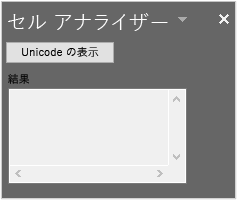

# <a name="tutorial-share-code-between-both-a-vsto-add-in-and-an-office-add-in-with-a-shared-code-library"></a><span data-ttu-id="31fb3-103">チュートリアル: 共有コード ライブラリによる VSTO アドインと Office アドインでのコードの共有</span><span class="sxs-lookup"><span data-stu-id="31fb3-103">Tutorial: Share code between both a VSTO Add-in and an Office add-in with a shared code library</span></span>

<span data-ttu-id="31fb3-104">Visual Studio Tools for Office (VSTO) アドインは、Office を拡張して特定のビジネスなどの目的に応じたソリューションを提供するために役立ちます。</span><span class="sxs-lookup"><span data-stu-id="31fb3-104">Visual Studio Tools for Office (VSTO) Add-ins are great for extending Office to provide solutions for your business or others.</span></span> <span data-ttu-id="31fb3-105">かなり前から利用されていたことから、VSTO で作成されたソリューションは多数存在します。</span><span class="sxs-lookup"><span data-stu-id="31fb3-105">They've been around for a long time and there are thousands of solutions built with VSTO.</span></span> <span data-ttu-id="31fb3-106">ただし、これは Windows 版の Office でのみ実行可能です。</span><span class="sxs-lookup"><span data-stu-id="31fb3-106">However, they only run on Office on Windows.</span></span> <span data-ttu-id="31fb3-107">VSTO アドインは、Mac やオンライン、モバイル プラットフォームでは実行できません。</span><span class="sxs-lookup"><span data-stu-id="31fb3-107">You can't run VSTO Add-ins on Mac, online, or mobile platforms.</span></span>

<span data-ttu-id="31fb3-108">Office アドインは、HTML や JavaScript などの Web テクノロジを使用することで、すべてのプラットフォームに対応する Office ソリューションを作成できます。</span><span class="sxs-lookup"><span data-stu-id="31fb3-108">Office Add-ins use HTML, JavaScript, and additional web technologies to build Office solutions on all platforms.</span></span> <span data-ttu-id="31fb3-109">既存の VSTO アドインを Office アドインに移行することは、すべてのプラットフォームでソリューションを利用できるようにする優れた方法です。</span><span class="sxs-lookup"><span data-stu-id="31fb3-109">Migrating your existing VSTO Add-in to an Office add-in is a great way to make your solution available across all platforms.</span></span>

<span data-ttu-id="31fb3-110">同じように機能する VSTO アドインと新しい Office アドインの両方を保守管理することができます。</span><span class="sxs-lookup"><span data-stu-id="31fb3-110">You may want to maintain both your VSTO Add-in and a new Office add-in that both have the same functionality.</span></span> <span data-ttu-id="31fb3-111">これにより、Windows 版の Office で VSTO アドインを使用するお客様にサービスを継続できるようになります。</span><span class="sxs-lookup"><span data-stu-id="31fb3-111">This enables you to continue servicing your customers that use the VSTO Add-in on Office on Windows.</span></span> <span data-ttu-id="31fb3-112">また、どのプラットフォームを使用しているお客様にも同じ機能を備えた Office アドインを提供できるようにもなります。</span><span class="sxs-lookup"><span data-stu-id="31fb3-112">This also enables you to provide the same functionality in an Office add-in for customers across all platforms.</span></span> <span data-ttu-id="31fb3-113">さらに、[既存の VSTO アドインとの互換性がある Office アドインを作成する](../develop/make-office-add-in-compatible-with-existing-com-add-in.md)こともできます。</span><span class="sxs-lookup"><span data-stu-id="31fb3-113">You can also [Make your Office add-in compatible with the existing VSTO Add-in](../develop/make-office-add-in-compatible-with-existing-com-add-in.md).</span></span>

<span data-ttu-id="31fb3-114">ただし、VSTO アドインのすべてのコードを Office アドイン用に書き直すことは最善とはいえません。</span><span class="sxs-lookup"><span data-stu-id="31fb3-114">However it is best to avoid rewriting all the code from your VSTO Add-in for the Office add-in.</span></span> <span data-ttu-id="31fb3-115">このチュートリアルでは、両方のアドインに対応する共有コード ライブラリを使用することで、コードの書き直しを回避する方法を示します。</span><span class="sxs-lookup"><span data-stu-id="31fb3-115">This tutorial shows how to avoid rewriting code by using a shared code library for both add-ins.</span></span>

## <a name="shared-code-library"></a><span data-ttu-id="31fb3-116">共有コード ライブラリ</span><span class="sxs-lookup"><span data-stu-id="31fb3-116">Shared code library</span></span>

<span data-ttu-id="31fb3-117">このチュートリアルでは、VSTO アドインと最新の Office アドインの間で共通するコードを特定して共有するための手順を説明します。</span><span class="sxs-lookup"><span data-stu-id="31fb3-117">This tutorial will walk you through the steps of identifying and sharing common code between your VSTO Add-in and a modern Office add-in.</span></span> <span data-ttu-id="31fb3-118">ここでは、自作の VSTO アドインに対する作業に必要なスキルとテクニックが明確になるように、きわめて単純な VSTO アドインの例を使用しています。</span><span class="sxs-lookup"><span data-stu-id="31fb3-118">It uses a very simple VSTO Add-in example for the steps so that you can focus on the skills and techniques you will need for working with your own VSTO Add-ins.</span></span>

<span data-ttu-id="31fb3-119">次の図は、移行の際の共有コード ライブラリの役割を示しています。</span><span class="sxs-lookup"><span data-stu-id="31fb3-119">The following diagram shows how the shared code library works for migration.</span></span> <span data-ttu-id="31fb3-120">共通するコードは、新しい共有コード ライブラリ用にリファクタリングします。</span><span class="sxs-lookup"><span data-stu-id="31fb3-120">Common code is refactored into a new shared code library.</span></span> <span data-ttu-id="31fb3-121">このコードは、元の言語 (C# や VB など) のままで記述できます。</span><span class="sxs-lookup"><span data-stu-id="31fb3-121">The code can remain written in its original language, such as C# or VB.</span></span> <span data-ttu-id="31fb3-122">つまり、プロジェクト参照を作成することで、既存の VSTO アドインのコードがそのまま使用できるということです。</span><span class="sxs-lookup"><span data-stu-id="31fb3-122">This means you can continue using the code in the existing VSTO Add-in by creating a project reference.</span></span> <span data-ttu-id="31fb3-123">Office アドインの作成時に、REST API を通じて呼び出すことで、そのアドインは共有コード ライブラリも使用するようになります。</span><span class="sxs-lookup"><span data-stu-id="31fb3-123">When you create the Office add-in, it will also use the shared code library by calling into it through REST APIs.</span></span>


<span data-ttu-id="31fb3-125">このチュートリアルに示すスキルとテクニック:</span><span class="sxs-lookup"><span data-stu-id="31fb3-125">Skills and techniques in this tutorial:</span></span>

- <span data-ttu-id="31fb3-126">.NET クラス ライブラリ用にコードをリファクタリングすることによる共有クラス ライブラリの作成。</span><span class="sxs-lookup"><span data-stu-id="31fb3-126">Create a shared class library by refactoring code into a .NET class library.</span></span>
- <span data-ttu-id="31fb3-127">共有クラス ライブラリ用の ASP.NET Core を使用した REST API ラッパーの作成。</span><span class="sxs-lookup"><span data-stu-id="31fb3-127">Create a REST API wrapper using ASP.NET Core for the shared class library.</span></span>
- <span data-ttu-id="31fb3-128">Office アドインから共有コードにアクセスする REST API の呼び出し。</span><span class="sxs-lookup"><span data-stu-id="31fb3-128">Call the REST API from the Office add-in to access shared code.</span></span>

## <a name="prerequisites"></a><span data-ttu-id="31fb3-129">前提条件</span><span class="sxs-lookup"><span data-stu-id="31fb3-129">Prerequisites</span></span>

<span data-ttu-id="31fb3-130">開発環境をセットアップするには:</span><span class="sxs-lookup"><span data-stu-id="31fb3-130">To set up your development environment:</span></span>

1. <span data-ttu-id="31fb3-131">[Visual Studio 2019](https://visualstudio.microsoft.com/downloads/) をインストールします。</span><span class="sxs-lookup"><span data-stu-id="31fb3-131">Install [Visual Studio 2019](https://visualstudio.microsoft.com/downloads/).</span></span>
2. <span data-ttu-id="31fb3-132">次の各ワークロードをインストールします。</span><span class="sxs-lookup"><span data-stu-id="31fb3-132">Install the following workloads:</span></span>
    - <span data-ttu-id="31fb3-133">ASP.NET と Web 開発</span><span class="sxs-lookup"><span data-stu-id="31fb3-133">ASP.NET and web development</span></span>
    - <span data-ttu-id="31fb3-134">.NET Core クロスプラットフォーム開発。</span><span class="sxs-lookup"><span data-stu-id="31fb3-134">.NET Core cross-platform development.</span></span>
    - <span data-ttu-id="31fb3-135">Office/SharePoint 開発</span><span class="sxs-lookup"><span data-stu-id="31fb3-135">Office/SharePoint development</span></span>
    - <span data-ttu-id="31fb3-136">次の**個別**コンポーネント。</span><span class="sxs-lookup"><span data-stu-id="31fb3-136">The following **Individual** components.</span></span>
        - <span data-ttu-id="31fb3-137">Visual Studio Tools for Office (VSTO)。</span><span class="sxs-lookup"><span data-stu-id="31fb3-137">Visual Studio Tools for Office (VSTO).</span></span>
        - <span data-ttu-id="31fb3-138">.NET Core 3.0 ランタイム。</span><span class="sxs-lookup"><span data-stu-id="31fb3-138">.NET Core 3.0 Runtime.</span></span>

<span data-ttu-id="31fb3-139">次のものも必要です:</span><span class="sxs-lookup"><span data-stu-id="31fb3-139">You also need the following:</span></span>

- <span data-ttu-id="31fb3-140">Office 365 アカウント。</span><span class="sxs-lookup"><span data-stu-id="31fb3-140">An Office 365 account.</span></span> <span data-ttu-id="31fb3-141">[Office 365 Developer プログラム](https://aka.ms/devprogramsignup)に参加することで、Office 365 の 1 年間無料サブスクリプションが得られます。</span><span class="sxs-lookup"><span data-stu-id="31fb3-141">You can join the [Office 365 Developer Program](https://aka.ms/devprogramsignup) that includes a free 1 year subscription to Office 365.</span></span>
- <span data-ttu-id="31fb3-142">Microsoft Azure テナント。</span><span class="sxs-lookup"><span data-stu-id="31fb3-142">A Microsoft Azure Tenant.</span></span> <span data-ttu-id="31fb3-143">[Microsoft Azure](https://account.windowsazure.com/SignUp) では、試用版のサブスクリプションを入手できます。</span><span class="sxs-lookup"><span data-stu-id="31fb3-143">A trial subscription can be acquired here: [Microsoft Azure](https://account.windowsazure.com/SignUp).</span></span>

## <a name="the-cell-analyzer-vsto-add-in"></a><span data-ttu-id="31fb3-144">セル アナライザー VSTO アドイン</span><span class="sxs-lookup"><span data-stu-id="31fb3-144">The Cell analyzer VSTO Add-in</span></span>

<span data-ttu-id="31fb3-145">このチュートリアルには、[Office アドイン用 VSTO アドイン共有ライブラリ](https://github.com/OfficeDev/PnP-OfficeAddins/tree/master/Samples/VSTO-shared-code-migration) PnP ソリューションを使用します。</span><span class="sxs-lookup"><span data-stu-id="31fb3-145">This tutorial uses the [VSTO Add-in shared library for Office add-in](https://github.com/OfficeDev/PnP-OfficeAddins/tree/master/Samples/VSTO-shared-code-migration) PnP solution.</span></span> <span data-ttu-id="31fb3-146">**/start** フォルダーには、移行する VSTO アドイン ソリューションが収納されています。</span><span class="sxs-lookup"><span data-stu-id="31fb3-146">The **/start** folder contains the VSTO Add-in solution that you will migrate.</span></span> <span data-ttu-id="31fb3-147">目標は、できるだけ多くのコードを共有するようにして VSTO アドインを最新の Office アドインに移行することです。</span><span class="sxs-lookup"><span data-stu-id="31fb3-147">Your goal is to migrate the VSTO Add-in to a modern Office add-in by sharing code when possible.</span></span>

> [!NOTE]
> <span data-ttu-id="31fb3-148">この例では C# を使用していますが、このチュートリアルに示す手法は、あらゆる .NET 言語で記述した VSTO アドインに適用できます。</span><span class="sxs-lookup"><span data-stu-id="31fb3-148">The sample uses C# but you can apply the techniques in this tutorial to a VSTO Add-in written in any .NET language.</span></span>

1. <span data-ttu-id="31fb3-149">[Office アドイン用 VSTO アドイン共有ライブラリ](https://github.com/OfficeDev/PnP-OfficeAddins/tree/master/Samples/VSTO-shared-code-migration) PnP ソリューションを自分のコンピューターの作業フォルダーにダウンロードします。</span><span class="sxs-lookup"><span data-stu-id="31fb3-149">Download the [VSTO Add-in shared library for Office add-in](https://github.com/OfficeDev/PnP-OfficeAddins/tree/master/Samples/VSTO-shared-code-migration) PnP solution to a working folder on your computer.</span></span>
2. <span data-ttu-id="31fb3-150">Visual Studio 2019 を起動して、**/start/Cell-Analyzer.sln** ソリューションを開きます。</span><span class="sxs-lookup"><span data-stu-id="31fb3-150">Start Visual Studio 2019 and open the **/start/Cell-Analyzer.sln** solution.</span></span>
3. <span data-ttu-id="31fb3-151">**[デバッグ]** メニューの **[デバッグ開始]** を選択します。</span><span class="sxs-lookup"><span data-stu-id="31fb3-151">On the **Debug** menu, choose **Start Debugging**.</span></span>
3. <span data-ttu-id="31fb3-152">**ソリューション エクスプローラー**で、**[Cell-Analyzer]** プロジェクトを右クリックして **[プロパティ]** を選択します。</span><span class="sxs-lookup"><span data-stu-id="31fb3-152">In **Solution Explorer**, right-click the **Cell-Analyzer** project, and choose **Properties**.</span></span>
4. <span data-ttu-id="31fb3-153">プロパティの **[署名]** カテゴリを選択します。</span><span class="sxs-lookup"><span data-stu-id="31fb3-153">Choose the **Signing** category in the properties.</span></span>
5. <span data-ttu-id="31fb3-154">**[ClickOnce マニフェストに署名する]** を選択してから、**[テスト証明書の作成]** を選択します。</span><span class="sxs-lookup"><span data-stu-id="31fb3-154">Choose **Sign the ClickOnce manifests**, and then chose **Create Test Certificate**.</span></span>
6. <span data-ttu-id="31fb3-155">**[テスト証明書の作成]** ダイアログで、パスワードを入力して、確認します。</span><span class="sxs-lookup"><span data-stu-id="31fb3-155">In the **Create Test Certificate** dialog, enter and confirm a password.</span></span> <span data-ttu-id="31fb3-156">**[OK]** を選択します。</span><span class="sxs-lookup"><span data-stu-id="31fb3-156">Then choose **OK**.</span></span>

<span data-ttu-id="31fb3-157">このアドインは、Excel のカスタム作業ウィンドウです。</span><span class="sxs-lookup"><span data-stu-id="31fb3-157">The add-in is a custom task pane for Excel.</span></span> <span data-ttu-id="31fb3-158">テキストが含まれる任意のセルを選択してから、**[Show Unicode]** ボタンをクリックしてください。</span><span class="sxs-lookup"><span data-stu-id="31fb3-158">You can select any cell with text, and then choose the **Show Unicode** button.</span></span> <span data-ttu-id="31fb3-159">このアドインにより、テキスト内の各文字とその文字に対応する Unicode 番号のリストが表示されます。</span><span class="sxs-lookup"><span data-stu-id="31fb3-159">The add-in will display a list of each character in the text along with its corresponding Unicode number.</span></span>



## <a name="analyze-types-of-code-in-the-vsto-add-in"></a><span data-ttu-id="31fb3-161">VSTO アドインのコードの種類を分析する</span><span class="sxs-lookup"><span data-stu-id="31fb3-161">Analyze types of code in the VSTO Add-in</span></span>

<span data-ttu-id="31fb3-162">最初に利用する手法は、共有可能なコード部分を分析することです。</span><span class="sxs-lookup"><span data-stu-id="31fb3-162">The first technique to apply is to analyze the add-in for which parts of code can be shared.</span></span> <span data-ttu-id="31fb3-163">一般に、プロジェクトは 3 種類のコードに分類できます。</span><span class="sxs-lookup"><span data-stu-id="31fb3-163">In general, project will break down into three types of code.</span></span>

### <a name="ui-code"></a><span data-ttu-id="31fb3-164">UI コード</span><span class="sxs-lookup"><span data-stu-id="31fb3-164">UI code</span></span>

<span data-ttu-id="31fb3-165">UI コードでは、ユーザーとの対話操作を処理します。</span><span class="sxs-lookup"><span data-stu-id="31fb3-165">UI code interacts with the user.</span></span> <span data-ttu-id="31fb3-166">VSTO では、UI コードは Windows フォームと連動しています。</span><span class="sxs-lookup"><span data-stu-id="31fb3-166">In VSTO UI code works through Windows Forms.</span></span> <span data-ttu-id="31fb3-167">Office アドインでは、UI に HTML、CSS、および JavaScript が使用されます。</span><span class="sxs-lookup"><span data-stu-id="31fb3-167">Office Add-ins use HTML, CSS, and JavaScript for UI.</span></span> <span data-ttu-id="31fb3-168">このような違いがあるため、UI コードを Office アドインと共有することはできません。</span><span class="sxs-lookup"><span data-stu-id="31fb3-168">Because of these differences you cannot share UI code to the Office add-in.</span></span> <span data-ttu-id="31fb3-169">UI は JavaScript で再作成する必要があります。</span><span class="sxs-lookup"><span data-stu-id="31fb3-169">UI will need to be recreated in JavaScript.</span></span>

### <a name="document-code"></a><span data-ttu-id="31fb3-170">ドキュメント コード</span><span class="sxs-lookup"><span data-stu-id="31fb3-170">Document code</span></span>

<span data-ttu-id="31fb3-171">VSTO では、コードは `Microsoft.Office.Interop.Excel.Range` などの .NET オブジェクトを通じてドキュメントとの相互作用を処理します。</span><span class="sxs-lookup"><span data-stu-id="31fb3-171">In VSTO code interacts with the document through .NET objects such as `Microsoft.Office.Interop.Excel.Range`.</span></span> <span data-ttu-id="31fb3-172">それに対して Office アドインでは、Office.js ライブラリが使用されます。</span><span class="sxs-lookup"><span data-stu-id="31fb3-172">But Office Add-ins use the Office.js library.</span></span> <span data-ttu-id="31fb3-173">これらは似たものですが、まったく同じではありません。</span><span class="sxs-lookup"><span data-stu-id="31fb3-173">Although these are similar, they are not exactly the same.</span></span> <span data-ttu-id="31fb3-174">そのため、ドキュメントとの相互作用のコードも Office アドインと共有することはできません。</span><span class="sxs-lookup"><span data-stu-id="31fb3-174">So again, you cannot share document interaction code to the Office add-in.</span></span>

### <a name="logic-code"></a><span data-ttu-id="31fb3-175">ロジック コード</span><span class="sxs-lookup"><span data-stu-id="31fb3-175">Logic code</span></span>

<span data-ttu-id="31fb3-176">通常は、ビジネス ロジック、アルゴリズム、ヘルパー関数、および類似のコードが VSTO アドインの中心部分を構成しています。</span><span class="sxs-lookup"><span data-stu-id="31fb3-176">Business logic, algorithms, helper functions, and similar code often make up the heart of a VSTO Add-in.</span></span> <span data-ttu-id="31fb3-177">このコードは、分析の実行、バックエンド サービスへの接続、計算の実行などのために、UI コードやドキュメント コードとは無関係に動作します。</span><span class="sxs-lookup"><span data-stu-id="31fb3-177">This code works independently of the UI and document code to perform analysis, connect to backend services, run calculations, and more.</span></span> <span data-ttu-id="31fb3-178">このコードが共有可能なものであり、JavaScript での書き直しが不要なコードです。</span><span class="sxs-lookup"><span data-stu-id="31fb3-178">This is the code that can be shared so that you don't have to rewrite it in JavaScript.</span></span>

<span data-ttu-id="31fb3-179">それでは、この VSTO アドインについて調べてみましょう。</span><span class="sxs-lookup"><span data-stu-id="31fb3-179">Let's examine the VSTO Add-in.</span></span> <span data-ttu-id="31fb3-180">次のコードでは、それぞれのセクションがドキュメント コード、UI コード、またはアルゴリズム コードとして識別されています。</span><span class="sxs-lookup"><span data-stu-id="31fb3-180">In the following code, each section is identified as DOCUMENT, UI, or ALGORITHM code.</span></span>

```csharp
// *** UI CODE ***
private void btnUnicode_Click(object sender, EventArgs e)
{
    // *** DOCUMENT CODE ***
    Microsoft.Office.Interop.Excel.Range rangeCell;
    rangeCell = Globals.ThisAddIn.Application.ActiveCell;

    string cellValue = "";

    if (null != rangeCell.Value)
    {
        cellValue = rangeCell.Value.ToString();
    }

    // *** ALGORITHM CODE ***
    //convert string to Unicode listing
    string result = "";
    foreach (char c in cellValue)
    {
        int unicode = c;

        result += $"{c}: {unicode}\r\n";
    }
    
    // *** UI CODE ***
    //Output the result
    txtResult.Text = result;
}
```

<span data-ttu-id="31fb3-181">このアプローチを使用すると、Office アドインとの共有が可能な 1 つのセクションがわかります。</span><span class="sxs-lookup"><span data-stu-id="31fb3-181">Using this approach you can see that one section of code can be shared to the Office add-in.</span></span> <span data-ttu-id="31fb3-182">次のコードは、個別のクラス ライブラリ用にリファクタリングする必要があります。</span><span class="sxs-lookup"><span data-stu-id="31fb3-182">The following code will need to be refactored into a separate class library.</span></span>

```csharp
// *** ALGORITHM CODE ***
//convert string to Unicode listing
string result = "";
foreach (char c in cellValue)
{
    int unicode = c;

    result += $"{c}: {unicode}\r\n";
}
```

## <a name="create-a-shared-class-library"></a><span data-ttu-id="31fb3-183">共有クラス ライブラリを作成する</span><span class="sxs-lookup"><span data-stu-id="31fb3-183">Create a shared class library</span></span>

<span data-ttu-id="31fb3-184">VSTO アドインは .NET プロジェクトとして Visual Studio で作成されているため、できるだけ簡単になるように .NET を再利用します。</span><span class="sxs-lookup"><span data-stu-id="31fb3-184">VSTO Add-ins are created in Visual Studio as .NET projects, so we'll reuse .NET as much as possible to keep things simple.</span></span> <span data-ttu-id="31fb3-185">次に使用する手法は、クラス ライブラリを作成して、そのクラス ライブラリ用に共有コードをリファクタリングすることです。</span><span class="sxs-lookup"><span data-stu-id="31fb3-185">Our next technique is to create a class library and refactor shared code into that class library.</span></span>

1. <span data-ttu-id="31fb3-186">Visual Studio 2019 を起動して、**\start\Cell-Analyzer.sln** ソリューションを開きます (まだ、そうしていない場合)。</span><span class="sxs-lookup"><span data-stu-id="31fb3-186">If you haven't already, start Visual Studio 2019 and open the **\start\Cell-Analyzer.sln** solution.</span></span>
2. <span data-ttu-id="31fb3-187">**ソリューション エクスプローラー**でソリューションを右クリックして、**[追加] > [新しいプロジェクト]** を選択します。</span><span class="sxs-lookup"><span data-stu-id="31fb3-187">Right-click the solution in **Solution Explorer** and choose **Add > New Project**.</span></span>
3. <span data-ttu-id="31fb3-188">**[新しいプロジェクトの追加] ダイアログ**で、**[クラス ライブラリ (.NET Framework)]** を選択してから **[次へ]** を選択します。</span><span class="sxs-lookup"><span data-stu-id="31fb3-188">In the **Add a new project dialog**, choose **Class Library (.NET Framework)**, and choose **Next**.</span></span>
    > [!NOTE]
    > <span data-ttu-id="31fb3-189">.NET Core クラス ライブラリは、VSTO プロジェクトでは動作しないので使用しないでください。</span><span class="sxs-lookup"><span data-stu-id="31fb3-189">Don't use the .NET Core class library because it will not work with your VSTO project.</span></span>
4. <span data-ttu-id="31fb3-190">**[新しいプロジェクトの構成]** ダイアログで、次のフィールドを設定します。</span><span class="sxs-lookup"><span data-stu-id="31fb3-190">In the **Configure your new project** dialog, set the following fields.</span></span>
    - <span data-ttu-id="31fb3-191">[**プロジェクト名**] を「**CellAnalyzerSharedLibrary**」に設定します。</span><span class="sxs-lookup"><span data-stu-id="31fb3-191">Set the **Project name** to **CellAnalyzerSharedLibrary**.</span></span>
    - <span data-ttu-id="31fb3-192">**[場所]** は、その既定値のままにしておきます。</span><span class="sxs-lookup"><span data-stu-id="31fb3-192">Leave the **Location** at it's default value.</span></span>
    - <span data-ttu-id="31fb3-193">**[フレームワーク]** を「**4.7.2**」に設定します。</span><span class="sxs-lookup"><span data-stu-id="31fb3-193">Set the **Framework** to **4.7.2**.</span></span>
5. <span data-ttu-id="31fb3-194">**[作成]** を選択します。</span><span class="sxs-lookup"><span data-stu-id="31fb3-194">Choose **Create**.</span></span>
6. <span data-ttu-id="31fb3-195">プロジェクトが作成されたら、**Class1.cs** ファイルの名前を **CellOperations.cs** に変更します。</span><span class="sxs-lookup"><span data-stu-id="31fb3-195">After the project is created, rename the **Class1.cs** file to **CellOperations.cs**.</span></span> <span data-ttu-id="31fb3-196">クラス名の変更を求めるメッセージが表示されます。</span><span class="sxs-lookup"><span data-stu-id="31fb3-196">A prompt to rename the class appears.</span></span> <span data-ttu-id="31fb3-197">ファイル名と一致するようにクラス名を変更します。</span><span class="sxs-lookup"><span data-stu-id="31fb3-197">Rename the class name so that it matches the file name.</span></span>
7. <span data-ttu-id="31fb3-198">次のコードを `CellOperations` クラスに追加して、`GetUnicodeFromText` というメソッドを作成します。</span><span class="sxs-lookup"><span data-stu-id="31fb3-198">Add the following code to the `CellOperations` class to create a method named `GetUnicodeFromText`.</span></span>

```csharp
public class CellOperations
{
    static public string GetUnicodeFromText(string value)
    {
        string result = "";
        foreach (char c in value)
        {
            int unicode = c;

            result += $"{c}: {unicode}\r\n";
        }
        return result;
    }
}
```

### <a name="use-the-shared-class-library-in-the-vsto-add-in"></a><span data-ttu-id="31fb3-199">VSTO アドインで共有クラス ライブラリを使用する</span><span class="sxs-lookup"><span data-stu-id="31fb3-199">Use the shared class library in the VSTO Add-in</span></span>

<span data-ttu-id="31fb3-200">この時点で、共有クラス ライブラリを使用するように VSTO アドインを更新する必要があります。</span><span class="sxs-lookup"><span data-stu-id="31fb3-200">Now you need to update the VSTO Add-in to use the class library.</span></span> <span data-ttu-id="31fb3-201">これは、同じ共有クラス ライブラリを使用する VSTO アドインと Office アドインの両方にとって、将来のバグ修正や機能を 1 つの場所で実施するために重要なことです。</span><span class="sxs-lookup"><span data-stu-id="31fb3-201">This is important that both the VSTO Add-in and Office add-in use the same shared class library so that future bug fixes or features are made in one location.</span></span>

1. <span data-ttu-id="31fb3-202">**ソリューション エクスプローラー**で **[Cell-Analyzer]** プロジェクトを右クリックして、**[参照の追加]** を選択します。</span><span class="sxs-lookup"><span data-stu-id="31fb3-202">In **Solution Explorer** right-click the **Cell-Analyzer** project, and choose **Add Reference**.</span></span>
2. <span data-ttu-id="31fb3-203">**[CellAnalyzerSharedLibrary]** を選択してから、**[OK]** を選択します。</span><span class="sxs-lookup"><span data-stu-id="31fb3-203">Select **CellAnalyzerSharedLibrary**, and choose **OK**.</span></span>
3. <span data-ttu-id="31fb3-204">**ソリューション エクスプローラー**で **[Cell-Analyzer]** プロジェクトを展開し、**[CellAnalyzerPane.cs]** ファイルを右クリックして **[コードの表示]** を選択します。</span><span class="sxs-lookup"><span data-stu-id="31fb3-204">In **Solution Explorer** expand the **Cell-Analyzer** project, right-click the **CellAnalyzerPane.cs** file, and choose **View Code**.</span></span>
4. <span data-ttu-id="31fb3-205">`btnUnicode_Click` メソッドで、次のコード行を削除します。</span><span class="sxs-lookup"><span data-stu-id="31fb3-205">In the `btnUnicode_Click` method, delete the following lines of code.</span></span>
    
    ```csharp
    //Convert to Unicode listing
    string result = "";
    foreach (char c in cellValue)
    {
      int unicode = c;
      result += $"{c}: {unicode}\r\n";
    }
    ```
    
5. <span data-ttu-id="31fb3-206">`//Output the result` コメントの下側のコード行を次のように更新します。</span><span class="sxs-lookup"><span data-stu-id="31fb3-206">Update the line of code under the `//Output the result` comment to read as follows:</span></span>
    
    ```csharp
    //Output the result
    txtResult.Text = CellAnalyzerSharedLibrary.CellOperations.GetUnicodeFromText(cellValue);
    ```
    
6. <span data-ttu-id="31fb3-207">**[デバッグ]** メニューの **[デバッグ開始]** を選択します。</span><span class="sxs-lookup"><span data-stu-id="31fb3-207">On the **Debug** menu, choose **Start Debugging**.</span></span> <span data-ttu-id="31fb3-208">カスタム作業ウィンドウは、期待どおりに動作します。</span><span class="sxs-lookup"><span data-stu-id="31fb3-208">The custom task pane should work as expected.</span></span> <span data-ttu-id="31fb3-209">セルにテキストを入力して、そのテキストがアドインで Unicode のリストに変換できることをテストします。</span><span class="sxs-lookup"><span data-stu-id="31fb3-209">Enter some text in a cell, and then test that you can convert it to a Unicode list with the add-in.</span></span>

## <a name="create-a-rest-api-wrapper"></a><span data-ttu-id="31fb3-210">REST API ラッパーを作成する</span><span class="sxs-lookup"><span data-stu-id="31fb3-210">Create a REST API wrapper</span></span>

<span data-ttu-id="31fb3-211">VSTO アドインでは、共有クラス ライブラリを直接使用できます。そのどちらもが .NET プロジェクトであるためです。</span><span class="sxs-lookup"><span data-stu-id="31fb3-211">The VSTO Add-in can use the shared class library directly since they are both .NET projects.</span></span> <span data-ttu-id="31fb3-212">ただし、Office アドインでは JavaScript を使用するため、.NET は使用できません。</span><span class="sxs-lookup"><span data-stu-id="31fb3-212">However the Office add-in won't be able to use .NET since it uses JavaScript.</span></span> <span data-ttu-id="31fb3-213">次に必要になることは、REST API ラッパーの作成です。</span><span class="sxs-lookup"><span data-stu-id="31fb3-213">Next you will need to create a REST API wrapper.</span></span> <span data-ttu-id="31fb3-214">これにより、Office アドインからの REST API 呼び出しを可能にして、その呼び出しを共有クラス ライブラリに渡します。</span><span class="sxs-lookup"><span data-stu-id="31fb3-214">This enables the Office add-in to call a REST API, which then passes the call along to the shared class library.</span></span>

1. <span data-ttu-id="31fb3-215">**ソリューション エクスプローラー**で **[Cell-Analyzer]** プロジェクトを右クリックして、**[追加] > [新しいプロジェクト]** を選択します。</span><span class="sxs-lookup"><span data-stu-id="31fb3-215">In **Solution Explorer**, right-click the **Cell-Analyzer** project, and choose **Add > New Project**.</span></span>
2. <span data-ttu-id="31fb3-216">**[新しいプロジェクトの追加] ダイアログ**で、**[ASP.NET Core Web アプリケーション]** を選択してから **[次へ]** を選択します。</span><span class="sxs-lookup"><span data-stu-id="31fb3-216">In the **Add a new project dialog**, choose **ASP.NET Core Web Application**, and choose **Next**.</span></span>
3. <span data-ttu-id="31fb3-217">**[新しいプロジェクトの構成]** ダイアログで、次のフィールドを設定します。</span><span class="sxs-lookup"><span data-stu-id="31fb3-217">In the **Configure your new project** dialog, set the following fields:</span></span>
    - <span data-ttu-id="31fb3-218">**[プロジェクト名]** を「**CellAnalyzerRESTAPI**」に設定します。</span><span class="sxs-lookup"><span data-stu-id="31fb3-218">Set the **Project name** to **CellAnalyzerRESTAPI**.</span></span>
    - <span data-ttu-id="31fb3-219">**[場所]** は、既定値のままにしておきます。</span><span class="sxs-lookup"><span data-stu-id="31fb3-219">In the **Location** field, leave the default value.</span></span>
4. <span data-ttu-id="31fb3-220">**[作成]** を選択します。</span><span class="sxs-lookup"><span data-stu-id="31fb3-220">Choose **Create**.</span></span>
5. <span data-ttu-id="31fb3-221">**[新しい ASP.NET Core Web アプリケーションの作成]** ダイアログで、バージョンに **[ASP.NET Core 3.1]** を選択して、プロジェクトのリストから **[API]** を選択します。</span><span class="sxs-lookup"><span data-stu-id="31fb3-221">In the **Create a new ASP.NET Core web application** dialog, select **ASP.NET Core 3.1** for the version, and select **API** in the list of projects.</span></span>
6. <span data-ttu-id="31fb3-222">その他のすべてのフィールドは既定値のままにしておき、**[作成]** ボタンを選択します。</span><span class="sxs-lookup"><span data-stu-id="31fb3-222">Leave all other fields at default values and choose the **Create** button.</span></span>
7. <span data-ttu-id="31fb3-223">プロジェクトが作成されたら、**ソリューション エクスプローラー**で **[CellAnalyzerRESTAPI]** プロジェクトを展開します。</span><span class="sxs-lookup"><span data-stu-id="31fb3-223">After the project is created, expand the **CellAnalyzerRESTAPI** project in **Solution Explorer**.</span></span>
8. <span data-ttu-id="31fb3-224">**[依存関係]** を右クリックして、**[参照の追加]** を選択します。</span><span class="sxs-lookup"><span data-stu-id="31fb3-224">Right-click **Dependencies**, and choose **Add Reference**.</span></span>
9. <span data-ttu-id="31fb3-225">**[CellAnalyzerSharedLibrary]** を選択してから、**[OK]** を選択します。</span><span class="sxs-lookup"><span data-stu-id="31fb3-225">Select **CellAnalyzerSharedLibrary**, and choose **OK**.</span></span>
10. <span data-ttu-id="31fb3-226">**[コントローラー]** フォルダーを右クリックして、**[追加] > [コントローラー]** を選択します。</span><span class="sxs-lookup"><span data-stu-id="31fb3-226">Right-click the **Controllers** folder, and choose **Add > Controller**.</span></span>
11. <span data-ttu-id="31fb3-227">**[新規スキャフォールディング アイテムの追加]** ダイアログで、**[API コントローラー - 空]** を選択してから **[追加]** を選択します。</span><span class="sxs-lookup"><span data-stu-id="31fb3-227">In the **Add New Scaffolded Item** dialog, choose **API Controller - Empty** and then **Add**.</span></span>
12. <span data-ttu-id="31fb3-228">**[空の API コントローラーの追加]** ダイアログで、コントローラーに「**AnalyzeUnicodeController**」という名前を付けて、**[追加]** を選択します。</span><span class="sxs-lookup"><span data-stu-id="31fb3-228">In the **Add Empty API Controller** dialog, name the controller **AnalyzeUnicodeController**, and then choose **Add**.</span></span>
13. <span data-ttu-id="31fb3-229">**AnalyzeUnicodeController.cs** ファイルを開いて、次のコードをメソッドとして `AnalyzeUnicodeController` クラスに追加します。</span><span class="sxs-lookup"><span data-stu-id="31fb3-229">Open the **AnalyzeUnicodeController.cs** file and add the following code as a method to the `AnalyzeUnicodeController` class.</span></span>
    
    ```csharp
    [HttpGet]
    public ActionResult<string> AnalyzeUnicode(string value)
    {
      if (value == null)
      {
        return BadRequest();
      }
      return CellAnalyzerSharedLibrary.CellOperations.GetUnicodeFromText(value);
    }
    ```
    
14. <span data-ttu-id="31fb3-230">**[CellAnalyzerRESTAPI]** プロジェクトを右クリックして、**[スタートアップ プロジェクトに設定]** を選択します。</span><span class="sxs-lookup"><span data-stu-id="31fb3-230">Right-click the **CellAnalyzerRESTAPI** project, and choose **Set as Startup Project**.</span></span>
15. <span data-ttu-id="31fb3-231">**[デバッグ]** メニューの **[デバッグ開始]** を選択します。</span><span class="sxs-lookup"><span data-stu-id="31fb3-231">On the **Debug** menu, choose **Start Debugging**.</span></span>
16. <span data-ttu-id="31fb3-232">ブラウザーが起動されます。</span><span class="sxs-lookup"><span data-stu-id="31fb3-232">A browser will launch.</span></span> <span data-ttu-id="31fb3-233">REST API が動作していることをテストするために、URL `https://localhost:<ssl port number>/api/analyzeunicode?value=test` を入力します。</span><span class="sxs-lookup"><span data-stu-id="31fb3-233">Enter the following URL to test that the REST API is working: `https://localhost:<ssl port number>/api/analyzeunicode?value=test`.</span></span> <span data-ttu-id="31fb3-234">ポート番号は、Visual Studio によって起動されたブラウザーの URL からのものを再使用できます。</span><span class="sxs-lookup"><span data-stu-id="31fb3-234">You can reuse the port number from the URL in the browser that Visual Studio launched.</span></span> <span data-ttu-id="31fb3-235">文字列が各文字の Unicode 値と共に表示されます。</span><span class="sxs-lookup"><span data-stu-id="31fb3-235">You should see a string returned with Unicode values for each character.</span></span>

## <a name="create-the-office-add-in"></a><span data-ttu-id="31fb3-236">Office アドインを作成する</span><span class="sxs-lookup"><span data-stu-id="31fb3-236">Create the Office add-in</span></span>

<span data-ttu-id="31fb3-237">Office アドインの作成時に、REST API への呼び出しが実行されます。</span><span class="sxs-lookup"><span data-stu-id="31fb3-237">When you create the Office add-in, it will make a call to the REST API.</span></span> <span data-ttu-id="31fb3-238">ただし、その前に REST API サーバーのポート番号を取得して、今後のために番号を保存しておく必要があります。</span><span class="sxs-lookup"><span data-stu-id="31fb3-238">But first, you need to get the port number of the REST API server and save it for later.</span></span>

### <a name="save-the-ssl-port-number"></a><span data-ttu-id="31fb3-239">SSL ポート番号を保存する</span><span class="sxs-lookup"><span data-stu-id="31fb3-239">Save the SSL port number</span></span>

1. <span data-ttu-id="31fb3-240">Visual Studio 2019 を起動してから、**\start\Cell-Analyzer.sln** ソリューションを開きます (まだ、そうしていない場合)。</span><span class="sxs-lookup"><span data-stu-id="31fb3-240">If you haven't already, start Visual Studio 2019, and open the **\start\Cell-Analyzer.sln** solution.</span></span>
2. <span data-ttu-id="31fb3-241">**CellAnalyzerRESTAPI** プロジェクトの **[プロパティ]** を展開して **launchSettings.json** ファイルを開きます。</span><span class="sxs-lookup"><span data-stu-id="31fb3-241">In the **CellAnalyzerRESTAPI** project, expand **Properties**, and open the **launchSettings.json** file.</span></span>
3. <span data-ttu-id="31fb3-242">**sslPort** 値があるコード行を見つけて、ポート番号をコピーして別の場所に保存します。</span><span class="sxs-lookup"><span data-stu-id="31fb3-242">Find the line of code with the **sslPort** value, copy the port number, and save it somewhere.</span></span>

### <a name="add-the-office-add-in-project"></a><span data-ttu-id="31fb3-243">Office アドイン プロジェクトを追加する</span><span class="sxs-lookup"><span data-stu-id="31fb3-243">Add the Office add-in project</span></span>

<span data-ttu-id="31fb3-244">作業が簡単になるように、すべてのコードを 1 つのソリューションに納めます。</span><span class="sxs-lookup"><span data-stu-id="31fb3-244">To keep things simple, keep all the code in one solution.</span></span> <span data-ttu-id="31fb3-245">この Office アドイン プロジェクトは、既存の Visual Studio ソリューションに追加します。</span><span class="sxs-lookup"><span data-stu-id="31fb3-245">Add the Office add-in project to the existing Visual Studio solution.</span></span> <span data-ttu-id="31fb3-246">ただし、[Office アドイン用の Yeoman ジェネレーター](https://github.com/OfficeDev/generator-office)と Visual Studio Code の扱いに慣れている場合は、`yo office` を実行してプロジェクトを作成することもできます。</span><span class="sxs-lookup"><span data-stu-id="31fb3-246">However, if you are familiar with the [Yeoman generator for Office Add-ins](https://github.com/OfficeDev/generator-office) and Visual Studio Code you can also run `yo office` to build the project.</span></span> <span data-ttu-id="31fb3-247">その手順は、ほとんど同じです。</span><span class="sxs-lookup"><span data-stu-id="31fb3-247">The steps are very similar.</span></span>

1. <span data-ttu-id="31fb3-248">**ソリューション エクスプローラー**で、**[Cell-Analyzer]** ソリューションを右クリックして、**[追加] > [新しいプロジェクト]** を選択します。</span><span class="sxs-lookup"><span data-stu-id="31fb3-248">In **Solution Explorer**, right-click the **Cell-Analyzer** solution, and choose **Add > New Project**.</span></span>
2. <span data-ttu-id="31fb3-249">**[新しいプロジェクトの追加] ダイアログ**で、**[Excel Web アドイン]** を選択してから **[次へ]** を選択します。</span><span class="sxs-lookup"><span data-stu-id="31fb3-249">In the **Add a new project dialog**, choose **Excel Web Add-in**, and choose **Next**.</span></span>
3. <span data-ttu-id="31fb3-250">**[新しいプロジェクトの構成]** ダイアログで、次のフィールドを設定します。</span><span class="sxs-lookup"><span data-stu-id="31fb3-250">In the **Configure your new project** dialog, set the following fields:</span></span>
    - <span data-ttu-id="31fb3-251">**[プロジェクト名]** を「**CellAnalyzerOfficeAddin**」に設定します。</span><span class="sxs-lookup"><span data-stu-id="31fb3-251">Set the **Project name** to **CellAnalyzerOfficeAddin**.</span></span>
    - <span data-ttu-id="31fb3-252">**[場所]** は、その既定値のままにしておきます。</span><span class="sxs-lookup"><span data-stu-id="31fb3-252">Leave the **Location** at it's default value.</span></span>
    - <span data-ttu-id="31fb3-253">**[フレームワーク]** を「**4.7.2**」以降に設定します。</span><span class="sxs-lookup"><span data-stu-id="31fb3-253">Set the **Framework** to **4.7.2** or later.</span></span>
4. <span data-ttu-id="31fb3-254">**[作成]** を選択します。</span><span class="sxs-lookup"><span data-stu-id="31fb3-254">Choose **Create**.</span></span>
5. <span data-ttu-id="31fb3-255">**[アドインの種類の選択]** ダイアログで、**[新機能を Excel に追加する]** を選択してから **[完了]** を選択します。</span><span class="sxs-lookup"><span data-stu-id="31fb3-255">In the **Choose the add-in type** dialog, select **Add new functionalities to Excel**, and choose **Finish**.</span></span>

<span data-ttu-id="31fb3-256">次の 2 つのプロジェクトが作成されます。</span><span class="sxs-lookup"><span data-stu-id="31fb3-256">Two projects will be created:</span></span>
- <span data-ttu-id="31fb3-257">**CellAnalyzerOfficeAddin**: このプロジェクトでは、アドインについて記述するマニフェスト XML ファイルを構成します。これにより、Office はアドインを正しくロードできるようになります。</span><span class="sxs-lookup"><span data-stu-id="31fb3-257">**CellAnalyzerOfficeAddin** - This project configures the manifest XML files that describes the add-in so Office can load it correctly.</span></span> <span data-ttu-id="31fb3-258">これには、アドインについて ID や名前などの情報が格納されています。</span><span class="sxs-lookup"><span data-stu-id="31fb3-258">It contains the ID, name, description, and other information about the add-in.</span></span>
- <span data-ttu-id="31fb3-259">**CellAnalyzerOfficeAddinWeb**: このプロジェクトには、アドインの Web リソース (HTML、CSS、スクリプトなど) を格納します。</span><span class="sxs-lookup"><span data-stu-id="31fb3-259">**CellAnalyzerOfficeAddinWeb** - This project contains web resources for your add-in, such as HTML, CSS, and scripts.</span></span> <span data-ttu-id="31fb3-260">さらに、Web アプリケーションとしてアドインをホストするように IIS Express インスタンスを構成します。</span><span class="sxs-lookup"><span data-stu-id="31fb3-260">It also configures an IIS Express instance to host your add-in as a web application.</span></span>

### <a name="add-ui-and-functionality-to-the-office-add-in"></a><span data-ttu-id="31fb3-261">Office アドインに UI と機能を追加する</span><span class="sxs-lookup"><span data-stu-id="31fb3-261">Add UI and functionality to the Office add-in</span></span>

1. <span data-ttu-id="31fb3-262">**ソリューション エクスプローラー**で、**CellAnalyzerOfficeAddinWeb** プロジェクトを展開します。</span><span class="sxs-lookup"><span data-stu-id="31fb3-262">In **Solution Explorer**, expand the **CellAnalyzerOfficeAddinWeb** project.</span></span>
2. <span data-ttu-id="31fb3-263">**Home.html** ファイルを開いて、`<body>` の内容を次の HTML に置き換えます。</span><span class="sxs-lookup"><span data-stu-id="31fb3-263">Open the **Home.html** file, and replace the `<body>` contents with the following HTML.</span></span>
    
    ```html
    <button id="btnShowUnicode" onclick="showUnicode()">Show Unicode</button>
    <p>Result:</p>
    <div id="txtResult"></div>
    ```
    
3. <span data-ttu-id="31fb3-264">**Home.js** ファイルを開いて、すべての内容を次のコードに置き換えます。</span><span class="sxs-lookup"><span data-stu-id="31fb3-264">Open the **Home.js** file, and replace the entire contents with the following code.</span></span> 
    
    ```js
    (function () {
      "use strict";
      // The initialize function must be run each time a new page is loaded.
      Office.initialize = function (reason) {
        $(document).ready(function () {
        });
      };
    })();
    
    function showUnicode() {
      Excel.run(function (ctx) {
        const range = ctx.workbook.getSelectedRange();
        range.load("values");
        return ctx.sync(range).then(function (range) {
          const url = "https://localhost:<ssl port number>/api/analyzeunicode?value=" + range.values[0][0];
          $.ajax({
            type: "GET",
            url: url,
            success: function (data) {
              let htmlData = data.replace(/\r\n/g, '<br>');
              $("#txtResult").html(htmlData);
            },
            error: function (data) {
                $("#txtResult").html("error occurred in ajax call.");
            }
          });
        });
      });
    }
    ```
    
4. <span data-ttu-id="31fb3-265">上記のコードでは、前の手順で **launchSettings.json** ファイルから保存した **sslPort** 番号を入力します。</span><span class="sxs-lookup"><span data-stu-id="31fb3-265">In the previous code, enter the **sslPort** number you saved previously from the **launchSettings.json** file.</span></span>

<span data-ttu-id="31fb3-266">上記のコードでは、返された文字列を処理することで、復帰改行を `<br>` HTML タグに置換します。</span><span class="sxs-lookup"><span data-stu-id="31fb3-266">In the previous code the returned string will be processed to replace carriage return line feeds with `<br>` HTML tags.</span></span> <span data-ttu-id="31fb3-267">期待どおりの動作を実現するために、VSTO アドインの .NET では完全に動作する戻り値を Office アドイン側で調整しないとならない状況が発生することがあります。</span><span class="sxs-lookup"><span data-stu-id="31fb3-267">You may occasionally run into situations where a return value that works perfectly fine for .NET in the VSTO Add-in will need to be adjusted on the Office add-in side to work as expected.</span></span> <span data-ttu-id="31fb3-268">この場合の REST API と共有クラス ライブラリは、文字列を返すこと以外の処理には関与しません。</span><span class="sxs-lookup"><span data-stu-id="31fb3-268">In this case the REST API and shared class library are only concerned with returning the string.</span></span> <span data-ttu-id="31fb3-269">`showUnicode()` メソッドは、戻り値が正しく表現されるように書式設定する役割を果たします。</span><span class="sxs-lookup"><span data-stu-id="31fb3-269">The `showUnicode()` method is responsible for formatting return values correctly for presentation.</span></span>

### <a name="allow-cors-from-the-office-add-in"></a><span data-ttu-id="31fb3-270">Office アドインからの CORS を許可する</span><span class="sxs-lookup"><span data-stu-id="31fb3-270">Allow CORS from the Office add-in</span></span>

<span data-ttu-id="31fb3-271">Office.js ライブラリは、外部呼び出し (REST API サーバーへの `ajax` 呼び出しによるものなど) で CORS が必要になります。</span><span class="sxs-lookup"><span data-stu-id="31fb3-271">The Office.js library requires CORS on outgoing calls, such as the one made from the `ajax` call to the REST API server.</span></span> <span data-ttu-id="31fb3-272">次の手順を使用して、Office アドインから REST API への呼び出しを許可します。</span><span class="sxs-lookup"><span data-stu-id="31fb3-272">Use the following steps to allow calls from the Office add-in to the REST API.</span></span>

1. <span data-ttu-id="31fb3-273">**ソリューション エクスプローラー**で、**CellAnalyzerOfficeAddinWeb** プロジェクトを選択します。</span><span class="sxs-lookup"><span data-stu-id="31fb3-273">In **Solution Explorer**, select the **CellAnalyzerOfficeAddinWeb** project.</span></span>
2. <span data-ttu-id="31fb3-274">**[表示]** メニューから、**[プロパティ ウィンドウ]** を選択します (このウィンドウが表示されていない場合)。</span><span class="sxs-lookup"><span data-stu-id="31fb3-274">From the **View** menu, choose **Properties Window** (if the window is not already displayed).</span></span>
3. <span data-ttu-id="31fb3-275">[プロパティ] ウィンドウで、**[SSL URL]** の値をコピーして別の場所に保存します。</span><span class="sxs-lookup"><span data-stu-id="31fb3-275">In the properties window, copy the value of the **SSL URL**, and save it somewhere.</span></span> <span data-ttu-id="31fb3-276">これは、CORS を通じて許可する必要のある URL です。</span><span class="sxs-lookup"><span data-stu-id="31fb3-276">This is the URL that you need to allow through CORS.</span></span>
4. <span data-ttu-id="31fb3-277">**CellAnalyzerRESTAPI** プロジェクトで、**Startup.cs** ファイルを開きます。</span><span class="sxs-lookup"><span data-stu-id="31fb3-277">In the **CellAnalyzerRESTAPI** project, open the **Startup.cs** file.</span></span>
5. <span data-ttu-id="31fb3-278">次のコードを `ConfigureServices` メソッドの先頭に追加します。</span><span class="sxs-lookup"><span data-stu-id="31fb3-278">Add the following code to the top of the `ConfigureServices` method.</span></span> <span data-ttu-id="31fb3-279">`builder.WithOrigins` の URL SSL は、前の手順でコピーしたものに置き換えてください。</span><span class="sxs-lookup"><span data-stu-id="31fb3-279">Be sure to substitute the URL SSL you copied previously for the `builder.WithOrigins` call.</span></span>
    
    ```csharp
    services.AddCors(options =>
    {
      options.AddPolicy(MyAllowSpecificOrigins,
      builder =>
      {
        builder.WithOrigins("<your URL SSL>")
        .AllowAnyMethod()
        .AllowAnyHeader();
      });
    });
    ```
    
    > [!NOTE]
    > <span data-ttu-id="31fb3-280">`builder.WithOrigins` メソッドで使用する URL の末尾の `/` は取り除いてください。</span><span class="sxs-lookup"><span data-stu-id="31fb3-280">Leave the trailing `/` from the end of the URL when you use it in the `builder.WithOrigins` method.</span></span> <span data-ttu-id="31fb3-281">たとえば、`https://localhost:44000` のようにします。</span><span class="sxs-lookup"><span data-stu-id="31fb3-281">For example, it should appear similar to `https://localhost:44000`.</span></span> <span data-ttu-id="31fb3-282">そのようにしていないと、実行時に CORS エラーが発生します。</span><span class="sxs-lookup"><span data-stu-id="31fb3-282">Otherwise you will get a CORS error at runtime.</span></span>
    
6. <span data-ttu-id="31fb3-283">次のフィールドを `Startup` クラスに追加します。</span><span class="sxs-lookup"><span data-stu-id="31fb3-283">Add the following field to the `Startup` class:</span></span>
    
    ```csharp
    readonly string MyAllowSpecificOrigins = "_myAllowSpecificOrigins";
    ```
    
7. <span data-ttu-id="31fb3-284">次のコードを `configure` メソッドのコード行 `app.UseEndpoints` の直前に追加します。</span><span class="sxs-lookup"><span data-stu-id="31fb3-284">Add the following code to the `configure` method just before the line of code for `app.UseEndpoints`.</span></span>
    
    ```csharp
    app.UseCors(MyAllowSpecificOrigins);
    ```

<span data-ttu-id="31fb3-285">作業か完了すると、`Startup` クラスのコードは次のようになります (localhost の URL は異なる場合があります)。</span><span class="sxs-lookup"><span data-stu-id="31fb3-285">When done, your `Startup` class should look similar to the following code (your localhost URL may be different):</span></span>

```csharp
public class Startup
{
  public Startup(IConfiguration configuration)
    {
      Configuration = configuration;
    }

    readonly string MyAllowSpecificOrigins = "_myAllowSpecificOrigins";

    public IConfiguration Configuration { get; }

    // NOTE: The following code configures CORS for the localhost:44397 port.
    // This is for development purposes. In production code you should update this to 
    // use the appropriate allowed domains.
    public void ConfigureServices(IServiceCollection services)
    {
        services.AddCors(options =>
        {
            options.AddPolicy(MyAllowSpecificOrigins,
            builder =>
            {
                builder.WithOrigins("https://localhost:44397")
                .AllowAnyMethod()
                .AllowAnyHeader();
            });
        });
        services.AddControllers();
    }

    // This method gets called by the runtime. Use this method to configure the HTTP request pipeline.
    public void Configure(IApplicationBuilder app, IWebHostEnvironment env)
    {
        if (env.IsDevelopment())
        {
            app.UseDeveloperExceptionPage();
        }
            
        app.UseHttpsRedirection();

        app.UseRouting();

        app.UseAuthorization();

        app.UseCors(MyAllowSpecificOrigins);

        app.UseEndpoints(endpoints =>
        {
            endpoints.MapControllers();
        });
    }
}
```

### <a name="run-the-add-in"></a><span data-ttu-id="31fb3-286">アドインを実行する</span><span class="sxs-lookup"><span data-stu-id="31fb3-286">Run the add-in</span></span>

1. <span data-ttu-id="31fb3-287">**ソリューション エクスプローラー**で、最上位ノードの **[ソリューション 'Cell-Analyzer']** を右クリックして、**[スタートアップ プロジェクトの設定]** を選択します。</span><span class="sxs-lookup"><span data-stu-id="31fb3-287">In **Solution Explorer**, right-click the top node **Solution 'Cell-Analyzer'**, and choose **Set Startup Projects**.</span></span>
2. <span data-ttu-id="31fb3-288">**[ソリューション 'Cell-Analyzer' プロパティ ページ]** ダイアログで、**[マルチ スタートアップ プロジェクト]** を選択します。</span><span class="sxs-lookup"><span data-stu-id="31fb3-288">In the **Solution 'Cell-Analyzer' Property Pages** dialog, select **Multiple startup projects**.</span></span>
3. <span data-ttu-id="31fb3-289">次のプロジェクトごとに、**[アクション]** プロパティを **[開始]** に設定します。</span><span class="sxs-lookup"><span data-stu-id="31fb3-289">Set the **Action** property to **Start** for each of the following projects.</span></span>
    
    - <span data-ttu-id="31fb3-290">CellAnalyzerRESTAPI</span><span class="sxs-lookup"><span data-stu-id="31fb3-290">CellAnalyzerRESTAPI</span></span>
    - <span data-ttu-id="31fb3-291">CellAnalyzerOfficeAddin</span><span class="sxs-lookup"><span data-stu-id="31fb3-291">CellAnalyzerOfficeAddin</span></span>
    - <span data-ttu-id="31fb3-292">CellAnalyzerOfficeAddinWeb</span><span class="sxs-lookup"><span data-stu-id="31fb3-292">CellAnalyzerOfficeAddinWeb</span></span>
    
4. <span data-ttu-id="31fb3-293">その後で、**[OK]** を選択します。</span><span class="sxs-lookup"><span data-stu-id="31fb3-293">Choose **OK**.</span></span>
5. <span data-ttu-id="31fb3-294">**[デバッグ]** メニューから、**[デバッグの開始]** を選択します。</span><span class="sxs-lookup"><span data-stu-id="31fb3-294">From the **Debug** menu, choose **Start Debugging**.</span></span>

<span data-ttu-id="31fb3-295">Excel が開始され、Office アドインが再度ロードされます。</span><span class="sxs-lookup"><span data-stu-id="31fb3-295">Excel will run and sideload the Office add-in.</span></span> <span data-ttu-id="31fb3-296">ローカルホスト REST API サービスが正常に動作しているかどうかは、セルにテキスト値を入力して、Office アドインの **[Show Unicode]** ボタンを選択することでテストできます。</span><span class="sxs-lookup"><span data-stu-id="31fb3-296">You can test that the localhost REST API service is working correctly by entering a text value into a cell, and choosing the **Show Unicode** button in the Office add-in.</span></span> <span data-ttu-id="31fb3-297">そのテキストの文字に対応する Unicode 値は REST API を呼び出すことで表示されます。</span><span class="sxs-lookup"><span data-stu-id="31fb3-297">It should call the REST API and display the unicode values for the text characters.</span></span>

## <a name="publish-to-an-azure-app-service"></a><span data-ttu-id="31fb3-298">Azure App Service に発行する</span><span class="sxs-lookup"><span data-stu-id="31fb3-298">Publish to an Azure App Service</span></span>

<span data-ttu-id="31fb3-299">最終的には、この REST API プロジェクトをクラウドに発行することになります。</span><span class="sxs-lookup"><span data-stu-id="31fb3-299">You eventually want to publish the REST API project to the cloud.</span></span> <span data-ttu-id="31fb3-300">次の手順は、**CellAnalyzerRESTAPI** プロジェクトを Microsoft Azure App Service に発行する方法を示しています。</span><span class="sxs-lookup"><span data-stu-id="31fb3-300">In the following steps you'll see how to publish the **CellAnalyzerRESTAPI** project to a Microsoft Azure App Service.</span></span> <span data-ttu-id="31fb3-301">Azure アカウントの取得方法に関する詳細については、「[前提条件](#prerequisites)」を参照してください。</span><span class="sxs-lookup"><span data-stu-id="31fb3-301">See [Prerequisites](#prerequisites) for information on how to get an Azure account.</span></span>

1. <span data-ttu-id="31fb3-302">**ソリューション エクスプローラー**で、**[CellAnalyzerRESTAPI]** プロジェクトを右クリックして **[発行]** をクリックします。</span><span class="sxs-lookup"><span data-stu-id="31fb3-302">In **Solution Explorer**, right-click the **CellAnalyzerRESTAPI** project, and choose **Publish**.</span></span>
2. <span data-ttu-id="31fb3-303">**[発行先を選択]** ダイアログで、**[新規作成]** を選択してから **[プロファイルの作成]** を選択します。</span><span class="sxs-lookup"><span data-stu-id="31fb3-303">In the **Pick a publish target** dialog, select **Create New**, and choose **Create Profile**.</span></span>
3. <span data-ttu-id="31fb3-304">**[App Service]** ダイアログで、適切なアカウントを選択します (まだ選択されていなかった場合)。</span><span class="sxs-lookup"><span data-stu-id="31fb3-304">In the **App Service** dialog, select the correct account, if it is not already selected.</span></span>
4. <span data-ttu-id="31fb3-305">**[App Service]** ダイアログのフィールドには、アカウントに応じた既定値が設定されます。</span><span class="sxs-lookup"><span data-stu-id="31fb3-305">The fields for the **App Service** dialog will be set to defaults for your account.</span></span> <span data-ttu-id="31fb3-306">一般に、既定値で問題なく動作しますが、別の設定を優先する場合は変更することもできます。</span><span class="sxs-lookup"><span data-stu-id="31fb3-306">Generally the defaults work fine, but you can change them if you prefer different settings.</span></span>
5. <span data-ttu-id="31fb3-307">**[App Service]** ダイアログで、**[作成]** を選択します。</span><span class="sxs-lookup"><span data-stu-id="31fb3-307">In the **App Service** dialog, choose **Create**.</span></span>
6. <span data-ttu-id="31fb3-308">新しいプロファイルが **[発行]** ページに表示されます。</span><span class="sxs-lookup"><span data-stu-id="31fb3-308">The new profile will be displayed in a **Publish** page.</span></span> <span data-ttu-id="31fb3-309">**[発行]** を選択し、コードをビルドして App Service に展開します。</span><span class="sxs-lookup"><span data-stu-id="31fb3-309">Choose **Publish** to build and deploy the code to the App Service.</span></span>

<span data-ttu-id="31fb3-310">この時点で、サービスをテストできるようになります。</span><span class="sxs-lookup"><span data-stu-id="31fb3-310">You can now test the service.</span></span> <span data-ttu-id="31fb3-311">ブラウザーを開いて、新しいサービスに直接アクセスする URL を入力します。</span><span class="sxs-lookup"><span data-stu-id="31fb3-311">Open a browser and enter a URL that goes directly to the new service.</span></span> <span data-ttu-id="31fb3-312">たとえば、`https://<myappservice>.azurewebsites.net/api/analyzeunicode?value=test` を使用します。*myappservice* は、この新しい App Service 用に作成した一意の名前です。</span><span class="sxs-lookup"><span data-stu-id="31fb3-312">For example, use `https://<myappservice>.azurewebsites.net/api/analyzeunicode?value=test` where *myappservice* is the unique name you created for the new App Service.</span></span>

### <a name="use-the-azure-app-service-from-the-office-add-in"></a><span data-ttu-id="31fb3-313">Office アドインから Azure App Service を使用する</span><span class="sxs-lookup"><span data-stu-id="31fb3-313">Use the Azure App Service from the Office add-in</span></span>

<span data-ttu-id="31fb3-314">最後の手順では、ローカルホストの代わりに Azure App Service を使用するように Office アドインのコードを更新します。</span><span class="sxs-lookup"><span data-stu-id="31fb3-314">The final step is to update the code in the Office add-in to use the Azure App Service instead of localhost.</span></span>

1. <span data-ttu-id="31fb3-315">**ソリューション エクスプローラー**で、**[CellAnalyzerOfficeAddinWeb]** プロジェクトを展開して **Home.js** ファイルを開きます。</span><span class="sxs-lookup"><span data-stu-id="31fb3-315">In **Solution Explorer**, expand the **CellAnalyzerOfficeAddinWeb** project, and open the **Home.js** file.</span></span>
2. <span data-ttu-id="31fb3-316">次のコード行に示すように、`url` 定数を変更して目的の Azure App Service を使用するようにします。</span><span class="sxs-lookup"><span data-stu-id="31fb3-316">Change the `url` constant to use the URL for your Azure App Service as shown in the following line of code.</span></span> <span data-ttu-id="31fb3-317">`<myappservice>` は新しい App Service 用に作成した一意の名前に置き換えます。</span><span class="sxs-lookup"><span data-stu-id="31fb3-317">Replace `<myappservice>` with the unique name you created for the new App Service.</span></span>
    ```JavaScript
    const url = "https://<myappservice>.azurewebsites.net/api/analyzeunicode?value=" + range.values[0][0];
    ```
3. <span data-ttu-id="31fb3-318">**ソリューション エクスプローラー**で、最上位ノードの **[ソリューション 'Cell-Analyzer']** を右クリックして、**[スタートアップ プロジェクトの設定]** を選択します。</span><span class="sxs-lookup"><span data-stu-id="31fb3-318">In **Solution Explorer**, right-click the top node **Solution 'Cell-Analyzer'**, and choose **Set Startup Projects**.</span></span>
4. <span data-ttu-id="31fb3-319">**[ソリューション 'Cell-Analyzer' プロパティ ページ]** ダイアログで、**[マルチ スタートアップ プロジェクト]** を選択します。</span><span class="sxs-lookup"><span data-stu-id="31fb3-319">In the **Solution 'Cell-Analyzer' Property Pages** dialog, select **Multiple startup projects**.</span></span>
5. <span data-ttu-id="31fb3-320">次のプロジェクトごとに **[開始]** アクションを有効にします。</span><span class="sxs-lookup"><span data-stu-id="31fb3-320">Enable the **Start** action for each of the following projects:</span></span>
    - <span data-ttu-id="31fb3-321">CellAnalyzerOfficeAddinWeb</span><span class="sxs-lookup"><span data-stu-id="31fb3-321">CellAnalyzerOfficeAddinWeb</span></span>
    - <span data-ttu-id="31fb3-322">CellAnalyzerOfficeAddin</span><span class="sxs-lookup"><span data-stu-id="31fb3-322">CellAnalyzerOfficeAddin</span></span>
6. <span data-ttu-id="31fb3-323">その後で、**[OK]** を選択します。</span><span class="sxs-lookup"><span data-stu-id="31fb3-323">Choose **OK**.</span></span>
7. <span data-ttu-id="31fb3-324">**[デバッグ]** メニューから、**[デバッグの開始]** を選択します。</span><span class="sxs-lookup"><span data-stu-id="31fb3-324">From the **Debug** menu, choose **Start Debugging**.</span></span>

<span data-ttu-id="31fb3-325">Excel が開始され、Office アドインが再度ロードされます。</span><span class="sxs-lookup"><span data-stu-id="31fb3-325">Excel will run and sideload the Office add-in.</span></span> <span data-ttu-id="31fb3-326">App Service が正常に動作していることをテストするには、セルにテキスト値を入力して、Office アドインの **[Show Unicode]** を選択します。</span><span class="sxs-lookup"><span data-stu-id="31fb3-326">To test that the App Service is working correctly, enter a text value into a cell, and choose **Show Unicode** in the Office add-in.</span></span> <span data-ttu-id="31fb3-327">サービスが呼び出され、そのテキストの文字に対応する Unicode 値が表示されます。</span><span class="sxs-lookup"><span data-stu-id="31fb3-327">It should call the service and display the unicode values for the text characters.</span></span>

## <a name="conclusion"></a><span data-ttu-id="31fb3-328">まとめ</span><span class="sxs-lookup"><span data-stu-id="31fb3-328">Conclusion</span></span>

<span data-ttu-id="31fb3-329">このチュートリアルでは、元の VSTO アドインとの共有コードを使用する Office アドインの作成方法について説明しました。</span><span class="sxs-lookup"><span data-stu-id="31fb3-329">In this tutorial you learned how to create an Office add-in that uses shared code with the original VSTO add-in.</span></span> <span data-ttu-id="31fb3-330">Windows 版 Office 用の VSTO と、その他のプラットフォーム版 Office 用の Office アドインの両方を保守管理する方法についても説明しました。</span><span class="sxs-lookup"><span data-stu-id="31fb3-330">You learned how to maintain both VSTO code for Office on Windows, and an Office add-in for Office on other platforms.</span></span> <span data-ttu-id="31fb3-331">VSTO C# コードを共有ライブラリ用にリファクタリングして、Azure App Service に展開しました。</span><span class="sxs-lookup"><span data-stu-id="31fb3-331">You refactored VSTO C# code into a shared library and deployed it to an Azure App Service.</span></span> <span data-ttu-id="31fb3-332">共有ライブラリを使用する Office アドインを作成することで、JavaScript のコードを書き直す必要がなくなるようにしました。</span><span class="sxs-lookup"><span data-stu-id="31fb3-332">You created an Office add-in that uses the shared library so that you don't have to rewrite the code in JavaScript.</span></span>
