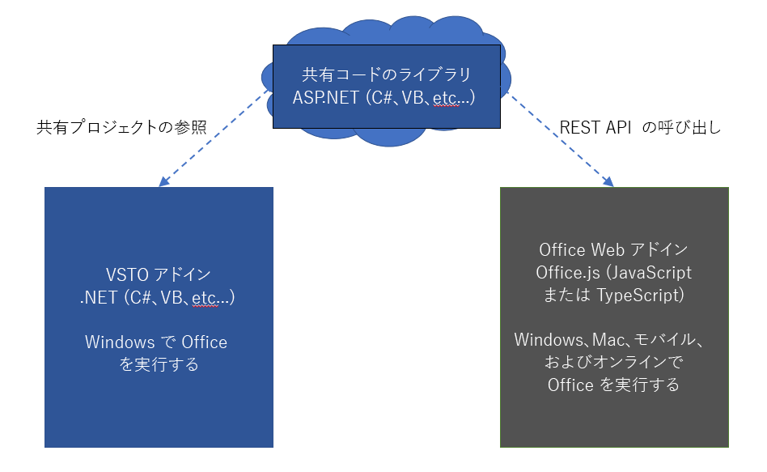

# <a name="tutorial-share-code-between-both-a-vsto-add-in-and-an-office-add-in-with-a-shared-code-library"></a>チュートリアル: 共有コード ライブラリによる VSTO アドインと Office アドインでのコードの共有

Visual Studio Tools for Office (VSTO) アドインは、Office を拡張して特定のビジネスなどの目的に応じたソリューションを提供するために役立ちます。 かなり前から利用されていたことから、VSTO で作成されたソリューションは多数存在します。 ただし、これは Windows 版の Office でのみ実行可能です。 VSTO アドインは、Mac やオンライン、モバイル プラットフォームでは実行できません。

Office アドインは、HTML や JavaScript などの Web テクノロジを使用することで、すべてのプラットフォームに対応する Office ソリューションを作成できます。 既存の VSTO アドインを Office アドインに移行することは、すべてのプラットフォームでソリューションを利用できるようにする優れた方法です。

同じように機能する VSTO アドインと新しい Office アドインの両方を保守管理することができます。 これにより、Windows 版の Office で VSTO アドインを使用するお客様にサービスを継続できるようになります。 また、どのプラットフォームを使用しているお客様にも同じ機能を備えた Office アドインを提供できるようにもなります。 さらに、[既存の VSTO アドインとの互換性がある Office アドインを作成する](../develop/make-office-add-in-compatible-with-existing-com-add-in.md)こともできます。

ただし、VSTO アドインのすべてのコードを Office アドイン用に書き直すことは最善とはいえません。 このチュートリアルでは、両方のアドインに対応する共有コード ライブラリを使用することで、コードの書き直しを回避する方法を示します。

## <a name="shared-code-library"></a>共有コード ライブラリ

このチュートリアルでは、VSTO アドインと最新の Office アドインの間で共通するコードを特定して共有するための手順を説明します。 ここでは、自作の VSTO アドインに対する作業に必要なスキルとテクニックが明確になるように、きわめて単純な VSTO アドインの例を使用しています。

次の図は、移行の際の共有コード ライブラリの役割を示しています。 共通するコードは、新しい共有コード ライブラリ用にリファクタリングします。 このコードは、元の言語 (C# や VB など) のままで記述できます。 つまり、プロジェクト参照を作成することで、既存の VSTO アドインのコードがそのまま使用できるということです。 Office アドインの作成時に、REST API を通じて呼び出すことで、そのアドインは共有コード ライブラリも使用するようになります。



このチュートリアルに示すスキルとテクニック:

- .NET クラス ライブラリ用にコードをリファクタリングすることによる共有クラス ライブラリの作成。
- 共有クラス ライブラリ用の ASP.NET Core を使用した REST API ラッパーの作成。
- Office アドインから共有コードにアクセスする REST API の呼び出し。

## <a name="prerequisites"></a>前提条件

開発環境をセットアップするには:

1. [Visual Studio 2019](https://visualstudio.microsoft.com/downloads/) をインストールします。
1. 次の各ワークロードをインストールします。
    - ASP.NET と Web 開発
    - .NET Core クロスプラットフォーム開発。
    - Office/SharePoint 開発
    - 次の **個別** コンポーネント。
        - Visual Studio Tools for Office (VSTO)。
        - .NET Core 3.0 ランタイム。

次のものも必要です:

- Microsoft 365 アカウント。Office アプリを含む、90 日間の更新可能な Microsoft 365 サブスクリプションが提供される [Microsoft 365 開発者プログラム](https://aka.ms/devprogramsignup)に参加できます。
- Microsoft Azure テナント。[Microsoft Azure](https://account.windowsazure.com/SignUp) では、試用版のサブスクリプションを入手できます。

## <a name="the-cell-analyzer-vsto-add-in"></a>セル アナライザー VSTO アドイン

このチュートリアルには、[Office アドイン用 VSTO アドイン共有ライブラリ](https://github.com/OfficeDev/Office-Add-in-samples/tree/main/Samples/VSTO-shared-code-migration) PnP ソリューションを使用します。 **/start** フォルダーには、移行する VSTO アドイン ソリューションが収納されています。 目標は、できるだけ多くのコードを共有するようにして VSTO アドインを最新の Office アドインに移行することです。

> [!NOTE]
> この例では C# を使用していますが、このチュートリアルに示す手法は、あらゆる .NET 言語で記述した VSTO アドインに適用できます。

1. [Office アドイン用 VSTO アドイン共有ライブラリ](https://github.com/OfficeDev/Office-Add-in-samples/tree/main/Samples/VSTO-shared-code-migration) PnP ソリューションを自分のコンピューターの作業フォルダーにダウンロードします。
1. Visual Studio 2019 を起動して、**/start/Cell-Analyzer.sln** ソリューションを開きます。
1. **[デバッグ]** メニューの **[デバッグ開始]** を選択します。
1. **ソリューション エクスプローラー** で、**[Cell-Analyzer]** プロジェクトを右クリックして **[プロパティ]** を選択します。
1. プロパティの **[署名]** カテゴリを選択します。
1. **[ClickOnce マニフェストに署名する]** を選択してから、**[テスト証明書の作成]** を選択します。
1. **[テスト証明書の作成]** ダイアログで、パスワードを入力して、確認します。**[OK]** を選択します。

このアドインは、Excel のカスタム作業ウィンドウです。 テキストが含まれる任意のセルを選択してから、**[Show unicode]** ボタンをクリックしてください。 このアドインにより、**[結果]** セクションでテキスト内の各文字とその文字に対応する Unicode 番号のリストが表示されます。

![[Unicode を表示] ボタンと空の [結果] セクションを使用して Excel で実行されている Cell Analyzer VSTO アドインのスクリーンショット。](../images/pnp-cell-analyzer-vsto-add-in.png)

## <a name="analyze-types-of-code-in-the-vsto-add-in"></a>VSTO アドインのコードの種類を分析する

最初に利用する手法は、共有可能なコード部分を分析することです。 一般に、プロジェクトは 3 種類のコードに分類できます。

### <a name="ui-code"></a>UI コード

UI コードでは、ユーザーとの対話操作を処理します。 VSTO では、UI コードは Windows フォームと連動しています。 Office アドインでは、UI に HTML、CSS、および JavaScript が使用されます。 このような違いがあるため、UI コードを Office アドインと共有することはできません。 UI は JavaScript で再作成する必要があります。

### <a name="document-code"></a>ドキュメント コード

VSTO では、コードは `Microsoft.Office.Interop.Excel.Range` などの .NET オブジェクトを通じてドキュメントとの相互作用を処理します。 それに対して Office アドインでは、Office.js ライブラリが使用されます。 これらは似たものですが、まったく同じではありません。 そのため、ドキュメントとの相互作用のコードも Office アドインと共有することはできません。

### <a name="logic-code"></a>ロジック コード

通常は、ビジネス ロジック、アルゴリズム、ヘルパー関数、および類似のコードが VSTO アドインの中心部分を構成しています。 このコードは、分析の実行、バックエンド サービスへの接続、計算の実行などのために、UI コードやドキュメント コードとは無関係に動作します。 このコードが共有可能なものであり、JavaScript での書き直しが不要なコードです。

それでは、この VSTO アドインについて調べてみましょう。次のコードでは、それぞれのセクションがドキュメント コード、UI コード、またはアルゴリズム コードとして識別されています。

```csharp
// *** UI CODE ***
private void btnUnicode_Click(object sender, EventArgs e)
{
    // *** DOCUMENT CODE ***
    Microsoft.Office.Interop.Excel.Range rangeCell;
    rangeCell = Globals.ThisAddIn.Application.ActiveCell;

    string cellValue = "";

    if (null != rangeCell.Value)
    {
        cellValue = rangeCell.Value.ToString();
    }

    // *** ALGORITHM CODE ***
    //convert string to Unicode listing
    string result = "";
    foreach (char c in cellValue)
    {
        int unicode = c;

        result += $"{c}: {unicode}\r\n";
    }

    // *** UI CODE ***
    //Output the result
    txtResult.Text = result;
}
```

このアプローチを使用すると、Office アドインとの共有が可能なコードの 1 つのセクションがわかります。 次のコードは、個別のクラス ライブラリ用にリファクタリングする必要があります。

```csharp
// *** ALGORITHM CODE ***
//convert string to Unicode listing
string result = "";
foreach (char c in cellValue)
{
    int unicode = c;

    result += $"{c}: {unicode}\r\n";
}
```

## <a name="create-a-shared-class-library"></a>共有クラス ライブラリを作成する

VSTO アドインは .NET プロジェクトとして Visual Studio で作成されているため、できるだけ簡単になるように .NET を再利用します。 次に使用する手法は、クラス ライブラリを作成して、そのクラス ライブラリ用に共有コードをリファクタリングすることです。

1. Visual Studio 2019 を起動して、**\start\Cell-Analyzer.sln** ソリューションを開きます (まだ、そうしていない場合)。
1. **ソリューション エクスプローラー** でソリューションを右クリックして、**[追加] > [新しいプロジェクト]** を選択します。
1. **[新しいプロジェクトの追加] ダイアログ** で、**[クラス ライブラリ (.NET Framework)]** を選択してから **[次へ]** を選択します。
    > [!NOTE]
    > .NET Core クラス ライブラリは、VSTO プロジェクトでは動作しないので使用しないでください。
1. **[新しいプロジェクトの構成]** ダイアログで、次のフィールドを設定します。
    - [**プロジェクト名**] を「**CellAnalyzerSharedLibrary**」に設定します。
    - **[場所]** は、その既定値のままにしておきます。
    - **[フレームワーク]** を「**4.7.2**」に設定します。
1. **[作成]** を選択します。
1. プロジェクトが作成されたら、**Class1.cs** ファイルの名前を **CellOperations.cs** に変更します。 クラス名の変更を求めるメッセージが表示されます。 ファイル名と一致するようにクラス名を変更します。
1. 次のコードを `CellOperations` クラスに追加して、`GetUnicodeFromText` というメソッドを作成します。

    ```csharp
    public class CellOperations
    {
        static public string GetUnicodeFromText(string value)
        {
            string result = "";
            foreach (char c in value)
            {
                int unicode = c;
    
                result += $"{c}: {unicode}\r\n";
            }
            return result;
        }
    }
    ```

### <a name="use-the-shared-class-library-in-the-vsto-add-in"></a>VSTO アドインで共有クラス ライブラリを使用する

この時点で、共有クラス ライブラリを使用するように VSTO アドインを更新する必要があります。 これは、同じ共有クラス ライブラリを使用する VSTO アドインと Office アドインの両方にとって、将来のバグ修正や機能を 1 つの場所で実施するために重要なことです。

1. **ソリューション エクスプローラー** で **[Cell-Analyzer]** プロジェクトを右クリックして、**[参照の追加]** を選択します。
1. **[CellAnalyzerSharedLibrary]** を選択してから、**[OK]** を選択します。
1. **ソリューション エクスプローラー** で **[Cell-Analyzer]** プロジェクトを展開し、**[CellAnalyzerPane.cs]** ファイルを右クリックして **[コードの表示]** を選択します。
1. `btnUnicode_Click` メソッドで、次のコード行を削除します。

    ```csharp
    //Convert to Unicode listing
    string result = "";
    foreach (char c in cellValue)
    {
      int unicode = c;
      result += $"{c}: {unicode}\r\n";
    }
    ```

1. `//Output the result` コメントの下側のコード行を次のように更新します。

    ```csharp
    //Output the result
    txtResult.Text = CellAnalyzerSharedLibrary.CellOperations.GetUnicodeFromText(cellValue);
    ```

1. **[デバッグ]** メニューの **[デバッグ開始]** を選択します。 カスタム作業ウィンドウは、期待どおりに動作します。 セルにテキストを入力して、そのテキストがアドインで Unicode のリストに変換できることをテストします。

## <a name="create-a-rest-api-wrapper"></a>REST API ラッパーを作成する

VSTO アドインでは、共有クラス ライブラリを直接使用できます。そのどちらもが .NET プロジェクトであるためです。 ただし、Office アドインでは JavaScript を使用するため、.NET は使用できません。 次に必要になることは、REST API ラッパーの作成です。 これにより、Office アドインからの REST API 呼び出しを可能にして、その呼び出しを共有クラス ライブラリに渡します。

1. **ソリューション エクスプローラー** で **[Cell-Analyzer]** プロジェクトを右クリックして、**[追加] > [新しいプロジェクト]** を選択します。
1. **[新しいプロジェクトの追加] ダイアログ** で、**[ASP.NET Core Web アプリケーション]** を選択してから **[次へ]** を選択します。
1. **[新しいプロジェクトの構成]** ダイアログで、次のフィールドを設定します。
    - **[プロジェクト名]** を「**CellAnalyzerRESTAPI**」に設定します。
    - **[場所]** は、既定値のままにしておきます。
1. **[作成]** を選択します。
1. **[新しい ASP.NET Core Web アプリケーションの作成]** ダイアログで、バージョンに **[ASP.NET Core 3.1]** を選択して、プロジェクトのリストから **[API]** を選択します。
1. その他のすべてのフィールドは既定値のままにしておき、**[作成]** ボタンを選択します。
1. プロジェクトが作成されたら、**ソリューション エクスプローラー** で **[CellAnalyzerRESTAPI]** プロジェクトを展開します。
1. **[依存関係]** を右クリックして、**[参照の追加]** を選択します。
1. **[CellAnalyzerSharedLibrary]** を選択してから、**[OK]** を選択します。
1. **[コントローラー]** フォルダーを右クリックして、**[追加] > [コントローラー]** を選択します。
1. **[新規スキャフォールディング アイテムの追加]** ダイアログで、**[API コントローラー - 空]** を選択してから **[追加]** を選択します。
1. **[空の API コントローラーの追加]** ダイアログで、コントローラーに「**AnalyzeUnicodeController**」という名前を付けて、**[追加]** を選択します。
1. **AnalyzeUnicodeController.cs** ファイルを開いて、次のコードをメソッドとして `AnalyzeUnicodeController` クラスに追加します。

    ```csharp
    [HttpGet]
    public ActionResult<string> AnalyzeUnicode(string value)
    {
      if (value == null)
      {
        return BadRequest();
      }
      return CellAnalyzerSharedLibrary.CellOperations.GetUnicodeFromText(value);
    }
    ```

1. **[CellAnalyzerRESTAPI]** プロジェクトを右クリックして、**[スタートアップ プロジェクトに設定]** を選択します。
1. **[デバッグ]** メニューの **[デバッグ開始]** を選択します。
1. ブラウザーが起動されます。 REST API が動作していることをテストするために、URL `https://localhost:<ssl port number>/api/analyzeunicode?value=test` を入力します。 ポート番号は、Visual Studio によって起動されたブラウザーの URL からのものを再使用できます。 文字列が各文字の Unicode 値と共に表示されます。

## <a name="create-the-office-add-in"></a>Office アドインを作成する

Office アドインの作成時に、REST API への呼び出しが実行されます。 ただし、その前に REST API サーバーのポート番号を取得して、今後のために番号を保存しておく必要があります。

### <a name="save-the-ssl-port-number"></a>SSL ポート番号を保存する

1. Visual Studio 2019 を起動してから、**\start\Cell-Analyzer.sln** ソリューションを開きます (まだ、そうしていない場合)。
1. **CellAnalyzerRESTAPI** プロジェクトの **[プロパティ]** を展開して **launchSettings.json** ファイルを開きます。
1. **sslPort** 値があるコード行を見つけて、ポート番号をコピーして別の場所に保存します。

### <a name="add-the-office-add-in-project"></a>Office アドイン プロジェクトを追加する

作業が簡単になるように、すべてのコードを 1 つのソリューションに納めます。 この Office アドイン プロジェクトは、既存の Visual Studio ソリューションに追加します。 ただし、[Office アドイン用の Yeoman ジェネレーター](../develop/yeoman-generator-overview.md)と Visual Studio Code の扱いに慣れている場合は、`yo office` を実行してプロジェクトを作成することもできます。 その手順は、ほとんど同じです。

1. **ソリューション エクスプローラー** で、**[Cell-Analyzer]** ソリューションを右クリックして、**[追加] > [新しいプロジェクト]** を選択します。
1. **[新しいプロジェクトの追加] ダイアログ** で、**[Excel Web アドイン]** を選択してから **[次へ]** を選択します。
1. **[新しいプロジェクトの構成]** ダイアログで、次のフィールドを設定します。
    - **[プロジェクト名]** を「**CellAnalyzerOfficeAddin**」に設定します。
    - **[場所]** は、その既定値のままにしておきます。
    - **[フレームワーク]** を「**4.7.2**」以降に設定します。
1. **[作成]** を選択します。
1. **[アドインの種類の選択]** ダイアログで、**[新機能を Excel に追加する]** を選択してから **[完了]** を選択します。

次の 2 つのプロジェクトが作成されます。

- **CellAnalyzerOfficeAddin**: このプロジェクトでは、アドインについて記述するマニフェスト XML ファイルを構成します。これにより、Office はアドインを正しくロードできるようになります。 これには、アドインについて ID や名前などの情報が格納されています。
- **CellAnalyzerOfficeAddinWeb**: このプロジェクトには、アドインの Web リソース (HTML、CSS、スクリプトなど) を格納します。 さらに、Web アプリケーションとしてアドインをホストするように IIS Express インスタンスを構成します。

### <a name="add-ui-and-functionality-to-the-office-add-in"></a>Office アドインに UI と機能を追加する

1. **ソリューション エクスプローラー** で、**CellAnalyzerOfficeAddinWeb** プロジェクトを展開します。
1. **Home.html** ファイルを開いて、`<body>` の内容を次の HTML に置き換えます。

    ```html
    <button id="btnShowUnicode" onclick="showUnicode()">Show Unicode</button>
    <p>Result:</p>
    <div id="txtResult"></div>
    ```

1. **Home.js** ファイルを開いて、すべての内容を次のコードに置き換えます。

    ```js
    (function () {
      "use strict";
      // The initialize function must be run each time a new page is loaded.
      Office.initialize = function (reason) {
        $(document).ready(function () {
        });
      };
    })();

    function showUnicode() {
      Excel.run(function (context) {
        const range = context.workbook.getSelectedRange();
        range.load("values");
        return context.sync(range).then(function (range) {
          const url = "https://localhost:<ssl port number>/api/analyzeunicode?value=" + range.values[0][0];
          $.ajax({
            type: "GET",
            url: url,
            success: function (data) {
              let htmlData = data.replace(/\r\n/g, '<br>');
              $("#txtResult").html(htmlData);
            },
            error: function (data) {
                $("#txtResult").html("error occurred in ajax call.");
            }
          });
        });
      });
    }
    ```

1. 上記のコードでは、前の手順で **launchSettings.json** ファイルから保存した **sslPort** 番号を入力します。

上記のコードでは、返された文字列を処理することで、復帰改行を `<br>` HTML タグに置換します。 期待どおりの動作を実現するために、VSTO アドインの .NET では完全に動作する戻り値を Office アドイン側で調整しないとならない状況が発生することがあります。 この場合の REST API と共有クラス ライブラリは、文字列を返すこと以外の処理には関与しません。 `showUnicode()` メソッドは、戻り値が正しく表現されるように書式設定する役割を果たします。

### <a name="allow-cors-from-the-office-add-in"></a>Office アドインからの CORS を許可する

Office.js ライブラリは、外部呼び出し (REST API サーバーへの `ajax` 呼び出しによるものなど) で CORS が必要になります。 次の手順を使用して、Office アドインから REST API への呼び出しを許可します。

1. **ソリューション エクスプローラー** で、**CellAnalyzerOfficeAddinWeb** プロジェクトを選択します。
1. **[表示]** メニューから、**[プロパティ ウィンドウ]** を選択します (このウィンドウが表示されていない場合)。
1. [プロパティ] ウィンドウで、**[SSL URL]** の値をコピーして別の場所に保存します。 これは、CORS を通じて許可する必要のある URL です。
1. **CellAnalyzerRESTAPI** プロジェクトで、**Startup.cs** ファイルを開きます。
1. 次のコードを `ConfigureServices` メソッドの先頭に追加します。 `builder.WithOrigins` の URL SSL は、前の手順でコピーしたものに置き換えてください。

    ```csharp
    services.AddCors(options =>
    {
      options.AddPolicy(MyAllowSpecificOrigins,
      builder =>
      {
        builder.WithOrigins("<your URL SSL>")
        .AllowAnyMethod()
        .AllowAnyHeader();
      });
    });
    ```

    > [!NOTE]
    > `builder.WithOrigins` メソッドで使用する URL の末尾の `/` は取り除いてください。 たとえば、`https://localhost:44000` のようにします。 そのようにしていないと、実行時に CORS エラーが発生します。

1. 次のフィールドを `Startup` クラスに追加します。

    ```csharp
    readonly string MyAllowSpecificOrigins = "_myAllowSpecificOrigins";
    ```

1. 次のコードを `configure` メソッドのコード行 `app.UseEndpoints` の直前に追加します。

    ```csharp
    app.UseCors(MyAllowSpecificOrigins);
    ```

作業か完了すると、`Startup` クラスのコードは次のようになります (localhost の URL は異なる場合があります)。

```csharp
public class Startup
{
  public Startup(IConfiguration configuration)
    {
      Configuration = configuration;
    }

    readonly string MyAllowSpecificOrigins = "_myAllowSpecificOrigins";

    public IConfiguration Configuration { get; }

    // NOTE: The following code configures CORS for the localhost:44397 port.
    // This is for development purposes. In production code you should update this to 
    // use the appropriate allowed domains.
    public void ConfigureServices(IServiceCollection services)
    {
        services.AddCors(options =>
        {
            options.AddPolicy(MyAllowSpecificOrigins,
            builder =>
            {
                builder.WithOrigins("https://localhost:44397")
                .AllowAnyMethod()
                .AllowAnyHeader();
            });
        });
        services.AddControllers();
    }

    // This method gets called by the runtime. Use this method to configure the HTTP request pipeline.
    public void Configure(IApplicationBuilder app, IWebHostEnvironment env)
    {
        if (env.IsDevelopment())
        {
            app.UseDeveloperExceptionPage();
        }

        app.UseHttpsRedirection();

        app.UseRouting();

        app.UseAuthorization();

        app.UseCors(MyAllowSpecificOrigins);

        app.UseEndpoints(endpoints =>
        {
            endpoints.MapControllers();
        });
    }
}
```

### <a name="run-the-add-in"></a>アドインを実行する

1. **ソリューション エクスプローラー** で、最上位ノードの **[ソリューション 'Cell-Analyzer']** を右クリックして、**[スタートアップ プロジェクトの設定]** を選択します。
1. **[ソリューション 'Cell-Analyzer' プロパティ ページ]** ダイアログで、**[マルチ スタートアップ プロジェクト]** を選択します。
1. 次のプロジェクトごとに、**[アクション]** プロパティを **[開始]** に設定します。

    - CellAnalyzerRESTAPI
    - CellAnalyzerOfficeAddin
    - CellAnalyzerOfficeAddinWeb

1. その後で、**[OK]** を選択します。
1. **[デバッグ]** メニューから、**[デバッグの開始]** を選択します。

Excel が開始され、Office アドインがサイドロードされます。 localhost REST API サービスが正常に動作しているかどうかは、セルにテキスト値を入力して、Office アドインの **[Unicode の表示]** ボタンを選択することでテストできます。 そのテキストの文字に対応する Unicode 値は REST API を呼び出すことで表示されます。

## <a name="publish-to-an-azure-app-service"></a>Azure App Service に発行する

最終的には、この REST API プロジェクトをクラウドに発行することになります。 次の手順は、**CellAnalyzerRESTAPI** プロジェクトを Microsoft Azure App Service に発行する方法を示しています。 Azure アカウントの取得方法に関する詳細については、「[前提条件](#prerequisites)」を参照してください。

1. **ソリューション エクスプローラー** で、**[CellAnalyzerRESTAPI]** プロジェクトを右クリックして **[発行]** をクリックします。
1. **[発行先を選択]** ダイアログで、**[新規作成]** を選択してから **[プロファイルの作成]** を選択します。
1. **[App Service]** ダイアログで、適切なアカウントを選択します (まだ選択されていなかった場合)。
1. **[App Service]** ダイアログのフィールドには、アカウントに応じた既定値が設定されます。 一般に、既定値で問題なく動作しますが、別の設定を優先する場合は変更することもできます。
1. **[App Service]** ダイアログで、**[作成]** を選択します。
1. 新しいプロファイルが **[発行]** ページに表示されます。 **[発行]** を選択し、コードをビルドして App Service に展開します。

この時点で、サービスをテストできるようになります。 ブラウザーを開いて、新しいサービスに直接アクセスする URL を入力します。 たとえば、`https://<myappservice>.azurewebsites.net/api/analyzeunicode?value=test` を使用します。*myappservice* は、この新しい App Service 用に作成した一意の名前です。

### <a name="use-the-azure-app-service-from-the-office-add-in"></a>Office アドインから Azure App Service を使用する

最後の手順では、localhost の代わりに Azure App Service を使用するように Office アドインのコードを更新します。

1. **ソリューション エクスプローラー** で、**[CellAnalyzerOfficeAddinWeb]** プロジェクトを展開して **Home.js** ファイルを開きます。
1. 次のコード行に示すように、`url` 定数を変更して目的の Azure App Service を使用するようにします。 `<myappservice>` は新しい App Service 用に作成した一意の名前に置き換えます。

    ```JavaScript
    const url = "https://<myappservice>.azurewebsites.net/api/analyzeunicode?value=" + range.values[0][0];
    ```

1. **ソリューション エクスプローラー** で、最上位ノードの **[ソリューション 'Cell-Analyzer']** を右クリックして、**[スタートアップ プロジェクトの設定]** を選択します。
1. **[ソリューション 'Cell-Analyzer' プロパティ ページ]** ダイアログで、**[マルチ スタートアップ プロジェクト]** を選択します。
1. 次のプロジェクトごとに **[開始]** アクションを有効にします。
    - CellAnalyzerOfficeAddinWeb
    - CellAnalyzerOfficeAddin
1. その後で、**[OK]** を選択します。
1. **[デバッグ]** メニューから、**[デバッグの開始]** を選択します。

Excel が開始され、Office アドインがサイドロードされます。 App Service が正常に動作していることをテストするには、セルにテキスト値を入力して、Office アドインの **[Unicode の表示]** を選択します。 サービスが呼び出され、そのテキストの文字に対応する Unicode 値が表示されます。

## <a name="conclusion"></a>まとめ

このチュートリアルでは、元の VSTO アドインとの共有コードを使用する Office アドインの作成方法について説明しました。 Windows 版 Office 用の VSTO と、その他のプラットフォーム版 Office 用の Office アドインの両方を保守管理する方法についても説明しました。 VSTO C# コードを共有ライブラリ用にリファクタリングして、Azure App Service に展開しました。 共有ライブラリを使用する Office アドインを作成することで、JavaScript のコードを書き直す必要がなくなるようにしました。
