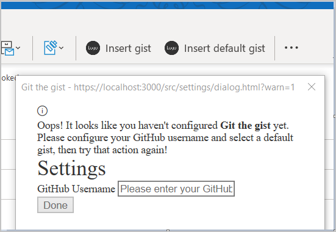

# <a name="tutorial-build-a-message-compose-outlook-add-in"></a><span data-ttu-id="88ac7-103">チュートリアル: メッセージ作成 Outlook アドインのビルド</span><span class="sxs-lookup"><span data-stu-id="88ac7-103">Tutorial: Build a message compose Outlook add-in</span></span>

<span data-ttu-id="88ac7-104">このチュートリアルでは、コンテンツをメッセージの本文に挿入するためにメッセージ作成モードで使用可能な Outlook アドインをビルドする方法について説明します。</span><span class="sxs-lookup"><span data-stu-id="88ac7-104">This tutorial teaches you how to build an Outlook add-in that can be used in message compose mode to insert content into the body of a message.</span></span>

<span data-ttu-id="88ac7-105">このチュートリアルの内容:</span><span class="sxs-lookup"><span data-stu-id="88ac7-105">In this tutorial, you will:</span></span>

> [!div class="checklist"]
>
> - <span data-ttu-id="88ac7-106">Outlook アドイン プロジェクトを作成する</span><span class="sxs-lookup"><span data-stu-id="88ac7-106">Create an Outlook add-in project</span></span>
> - <span data-ttu-id="88ac7-107">メッセージ作成ウィンドウで表示するボタンを定義する</span><span class="sxs-lookup"><span data-stu-id="88ac7-107">Define buttons that will render in the compose message window</span></span>
> - <span data-ttu-id="88ac7-108">ユーザーから情報を収集し、外部サービスからデータを取得する最初の実行エクスペリエンスを実装する</span><span class="sxs-lookup"><span data-stu-id="88ac7-108">Implement a first-run experience that collects information from the user and fetches data from an external service</span></span>
> - <span data-ttu-id="88ac7-109">関数を呼び出す、UI のないボタンを実装する</span><span class="sxs-lookup"><span data-stu-id="88ac7-109">Implement a UI-less button that invokes a function</span></span>
> - <span data-ttu-id="88ac7-110">メッセージの本文にコンテンツを挿入する作業ウィンドウを実装する</span><span class="sxs-lookup"><span data-stu-id="88ac7-110">Implement a task pane that inserts content into the body of a message</span></span>

## <a name="prerequisites"></a><span data-ttu-id="88ac7-111">前提条件</span><span class="sxs-lookup"><span data-stu-id="88ac7-111">Prerequisites</span></span>

- <span data-ttu-id="88ac7-112">[Node.js](https://nodejs.org/) (最新 [LTS](https://nodejs.org/about/releases) バージョン)</span><span class="sxs-lookup"><span data-stu-id="88ac7-112">[Node.js](https://nodejs.org/) (the latest [LTS](https://nodejs.org/about/releases) version)</span></span>

- <span data-ttu-id="88ac7-113">最新バージョンの [Yeoman](https://github.com/yeoman/yo) と [Office アドイン用の Yeoman ジェネレーター](https://github.com/OfficeDev/generator-office)。これらのツールをグローバルにインストールするには、コマンド プロンプトから次のコマンドを実行します。</span><span class="sxs-lookup"><span data-stu-id="88ac7-113">The latest version of [Yeoman](https://github.com/yeoman/yo) and the [Yeoman generator for Office Add-ins](https://github.com/OfficeDev/generator-office). To install these tools globally, run the following command via the command prompt.</span></span>

    ```command&nbsp;line
    npm install -g yo generator-office
    ```

    > [!NOTE]
    > <span data-ttu-id="88ac7-114">以前に Yeoman ジェネレーターをインストールしている場合でも、npm からパッケージを最新バージョンに更新することをお勧めします。</span><span class="sxs-lookup"><span data-stu-id="88ac7-114">Even if you've previously installed the Yeoman generator, we recommend you update your package to the latest version from npm.</span></span>

- <span data-ttu-id="88ac7-115">Windows 上の Outlook 2016 以降 (Microsoft 365 アカウントに接続されたもの) または Outlook on the web</span><span class="sxs-lookup"><span data-stu-id="88ac7-115">Outlook 2016 or later on Windows (connected to a Microsoft 365 account) or Outlook on the web</span></span>

- <span data-ttu-id="88ac7-116">[GitHub](https://www.github.com) アカウント</span><span class="sxs-lookup"><span data-stu-id="88ac7-116">A [GitHub](https://www.github.com) account</span></span>

## <a name="setup"></a><span data-ttu-id="88ac7-117">セットアップ</span><span class="sxs-lookup"><span data-stu-id="88ac7-117">Setup</span></span>

<span data-ttu-id="88ac7-p101">このチュートリアルで作成するアドインは、ユーザーの GitHub アカウントから [Gist](https://gist.github.com) を読み込み、選択した Gist をメッセージの本文に追加します。ビルドするアドインのテストに使用可能な 2 つの新しい Gist を作成するには、次の手順を実行します。</span><span class="sxs-lookup"><span data-stu-id="88ac7-p101">The add-in that you'll create in this tutorial will read [gists](https://gist.github.com) from the user's GitHub account and add the selected gist to the body of a message. Complete the following steps to create two new gists that you can use to test the add-in you're going to build.</span></span>

1. <span data-ttu-id="88ac7-120">[GitHub にログイン](https://github.com/login)します。</span><span class="sxs-lookup"><span data-stu-id="88ac7-120">[Login to GitHub](https://github.com/login).</span></span>

1. <span data-ttu-id="88ac7-121">[新しい Gist を作成](https://gist.github.com)します。</span><span class="sxs-lookup"><span data-stu-id="88ac7-121">[Create a new gist](https://gist.github.com).</span></span>

    - <span data-ttu-id="88ac7-122">**[Gist description...]** フィールドに、「**Hello World Markdown**」と入力します。</span><span class="sxs-lookup"><span data-stu-id="88ac7-122">In the **Gist description...** field, enter **Hello World Markdown**.</span></span>

    - <span data-ttu-id="88ac7-123">**[Filename including extension...]** フィールドに、「**test.md**」と入力します。</span><span class="sxs-lookup"><span data-stu-id="88ac7-123">In the **Filename including extension...** field, enter **test.md**.</span></span>

    - <span data-ttu-id="88ac7-124">複数行のテキストボックスに、次の Markdown を追加します。</span><span class="sxs-lookup"><span data-stu-id="88ac7-124">Add the following markdown to the multiline textbox.</span></span>

        ```markdown
        # Hello World

        This is content converted from Markdown!

        Here's a JSON sample:

          ```json
          {
            "foo": "bar"
          }
          ```
        ```

    - <span data-ttu-id="88ac7-125">**[公開 Gist の作成]** ボタンを選択します。</span><span class="sxs-lookup"><span data-stu-id="88ac7-125">Select the **Create public gist** button.</span></span>

1. <span data-ttu-id="88ac7-126">[もう 1 つの新しい Gist を作成](https://gist.github.com)します。</span><span class="sxs-lookup"><span data-stu-id="88ac7-126">[Create another new gist](https://gist.github.com).</span></span>

    - <span data-ttu-id="88ac7-127">**[Gist description...]** フィールドに、「**Hello World Html**」と入力します。</span><span class="sxs-lookup"><span data-stu-id="88ac7-127">In the **Gist description...** field, enter **Hello World Html**.</span></span>

    - <span data-ttu-id="88ac7-128">**[Filename including extension...]** フィールドに、「**test.html**」と入力します。</span><span class="sxs-lookup"><span data-stu-id="88ac7-128">In the **Filename including extension...** field, enter **test.html**.</span></span>

    - <span data-ttu-id="88ac7-129">複数行のテキストボックスに、次の Markdown を追加します。</span><span class="sxs-lookup"><span data-stu-id="88ac7-129">Add the following markdown to the multiline textbox.</span></span>

        ```HTML
        <html>
          <head>
            <style>
            h1 {
              font-family: Calibri;
            }
            </style>
          </head>
          <body>
            <h1>Hello World!</h1>
            <p>This is a test</p>
          </body>
        </html>
        ```

    - <span data-ttu-id="88ac7-130">**[公開 Gist の作成]** ボタンを選択します。</span><span class="sxs-lookup"><span data-stu-id="88ac7-130">Select the **Create public gist** button.</span></span>

## <a name="create-an-outlook-add-in-project"></a><span data-ttu-id="88ac7-131">Outlook アドイン プロジェクトを作成する</span><span class="sxs-lookup"><span data-stu-id="88ac7-131">Create an Outlook add-in project</span></span>

1. [!include[Yeoman generator create project guidance](../includes/yo-office-command-guidance.md)]

    - <span data-ttu-id="88ac7-132">**Choose a project type: (プロジェクトの種類を選択)** - `Office Add-in Task Pane project`</span><span class="sxs-lookup"><span data-stu-id="88ac7-132">**Choose a project type** - `Office Add-in Task Pane project`</span></span>

    - <span data-ttu-id="88ac7-133">**Choose a script type: (スクリプトの種類を選択)** - `JavaScript`</span><span class="sxs-lookup"><span data-stu-id="88ac7-133">**Choose a script type** - `JavaScript`</span></span>

    - <span data-ttu-id="88ac7-134">**What would you want to name your add-in?: (アドインの名前を何にしますか)**</span><span class="sxs-lookup"><span data-stu-id="88ac7-134">**What do you want to name your add-in?**</span></span> - `Git the gist`

    - <span data-ttu-id="88ac7-135">**Which Office client application would you like to support?: (どの Office クライアント アプリケーションをサポートしますか)**</span><span class="sxs-lookup"><span data-stu-id="88ac7-135">**Which Office client application would you like to support?**</span></span> - `Outlook`

    

    <span data-ttu-id="88ac7-137">ウィザードを完了すると、ジェネレーターによってプロジェクトが作成されて、サポートしているノード コンポーネントがインストールされます。</span><span class="sxs-lookup"><span data-stu-id="88ac7-137">After you complete the wizard, the generator will create the project and install supporting Node components.</span></span>

    [!include[Yeoman generator next steps](../includes/yo-office-next-steps.md)]

1. <span data-ttu-id="88ac7-138">プロジェクトのルート ディレクトリに移動します。</span><span class="sxs-lookup"><span data-stu-id="88ac7-138">Navigate to the root directory of the project.</span></span>

    ```command&nbsp;line
    cd "Git the gist"
    ```

1. <span data-ttu-id="88ac7-139">このアドインは以下のライブラリを使用します。</span><span class="sxs-lookup"><span data-stu-id="88ac7-139">This add-in will use the following libraries.</span></span>

    - <span data-ttu-id="88ac7-140">Markdown を HTML に変換する [Showdown](https://github.com/showdownjs/showdown) ライブラリ</span><span class="sxs-lookup"><span data-stu-id="88ac7-140">[Showdown](https://github.com/showdownjs/showdown) library to convert Markdown to HTML</span></span>
    - <span data-ttu-id="88ac7-141">相対URLを構築するための[URI.js](https://github.com/medialize/URI.js)ライブラリ。</span><span class="sxs-lookup"><span data-stu-id="88ac7-141">[URI.js](https://github.com/medialize/URI.js) library to build relative URLs.</span></span>
    - <span data-ttu-id="88ac7-142">DOM との相互作用を単純化する [jquery](https://jquery.com/) ライブラリ。</span><span class="sxs-lookup"><span data-stu-id="88ac7-142">[jquery](https://jquery.com/) library to simplify DOM interactions.</span></span>

     <span data-ttu-id="88ac7-143">これらのツールをプロジェクトにインストールするには、プロジェクトのルート ディレクトリで次のコマンドを実行します。</span><span class="sxs-lookup"><span data-stu-id="88ac7-143">To install these tools for your project, run the following command in the root directory of the project.</span></span>

    ```command&nbsp;line
    npm install showdown urijs jquery --save
    ```

### <a name="update-the-manifest"></a><span data-ttu-id="88ac7-144">マニフェストを更新する</span><span class="sxs-lookup"><span data-stu-id="88ac7-144">Update the manifest</span></span>

<span data-ttu-id="88ac7-p102">アドインのマニフェストは、Outlook での表示方法を制御します。またマニフェストは、アドインがアドイン一覧に表示される方法と、リボンに表示されるボタンを定義し、アドインによって使用される HTML ファイルと JavaScript ファイルの URL を設定します。</span><span class="sxs-lookup"><span data-stu-id="88ac7-p102">The manifest for an add-in controls how it appears in Outlook. It defines the way the add-in appears in the add-in list and the buttons that appear on the ribbon, and it sets the URLs for the HTML and JavaScript files used by the add-in.</span></span>

#### <a name="specify-basic-information"></a><span data-ttu-id="88ac7-147">基本的な情報を指定する</span><span class="sxs-lookup"><span data-stu-id="88ac7-147">Specify basic information</span></span>

<span data-ttu-id="88ac7-148">**manifest.xml** ファイルで次の更新を行い、アドインに関する基本情報を指定します。</span><span class="sxs-lookup"><span data-stu-id="88ac7-148">Make the following updates in the **manifest.xml** file to specify some basic information about the add-in.</span></span>

1. <span data-ttu-id="88ac7-149">`ProviderName` 要素を探し、既定値を会社名に置き換えます。</span><span class="sxs-lookup"><span data-stu-id="88ac7-149">Locate the `ProviderName` element and replace the default value with your company name.</span></span>

    ```xml
    <ProviderName>Contoso</ProviderName>
    ```

1. <span data-ttu-id="88ac7-150">`Description` 要素を探し、既定値をアドインの説明に置き換えて、ファイルを保存します。</span><span class="sxs-lookup"><span data-stu-id="88ac7-150">Locate the `Description` element, replace the default value with a description of the add-in, and save the file.</span></span>

    ```xml
    <Description DefaultValue="Allows users to access their GitHub gists."/>
    ```

#### <a name="test-the-generated-add-in"></a><span data-ttu-id="88ac7-151">生成されたアドインをテストする</span><span class="sxs-lookup"><span data-stu-id="88ac7-151">Test the generated add-in</span></span>

<span data-ttu-id="88ac7-152">この先に進める前に、ジェネレーターによって生成されたアドインをテストして、プロジェクトが正しく設定されていることを確認します。</span><span class="sxs-lookup"><span data-stu-id="88ac7-152">Before going any further, let's test the basic add-in that the generator created to confirm that the project is set up correctly.</span></span>

> [!NOTE]
> <span data-ttu-id="88ac7-p103">開発の最中でも、OfficeアドインはHTTPではなくHTTPSを使用する必要があります。次のコマンドを実行した後に証明書をインストールするように求められた場合は、Yeoman ジェネレーターによって提供される証明書をインストールするプロンプトを受け入れます。変更を行うには、管理者としてコマンド プロンプトまたはターミナルを実行する必要がある場合もあります。</span><span class="sxs-lookup"><span data-stu-id="88ac7-p103">Office Add-ins should use HTTPS, not HTTP, even when you are developing. If you are prompted to install a certificate after you run the following command, accept the prompt to install the certificate that the Yeoman generator provides. You may also have to run your command prompt or terminal as an administrator for the changes to be made.</span></span>

1. <span data-ttu-id="88ac7-p104">プロジェクトのルート ディレクトリから次のコマンドを実行します。このコマンドを実行すると、ローカル Web サーバーが起動します (まだ実行されていない場合)。</span><span class="sxs-lookup"><span data-stu-id="88ac7-p104">Run the following command in the root directory of your project. When you run this command, the local web server will start (if it's not already running).</span></span>

    ```command&nbsp;line
    npm run dev-server
    ```

1. <span data-ttu-id="88ac7-158">プロジェクトのルートディレクトリにある **manifest.xml** ファイルをサイドロードするには、[テスト用Outlookアドインのサイドロード](../outlook/sideload-outlook-add-ins-for-testing.md)にある指示に従います。</span><span class="sxs-lookup"><span data-stu-id="88ac7-158">Follow the instructions in [Sideload Outlook add-ins for testing](../outlook/sideload-outlook-add-ins-for-testing.md) to sideload the **manifest.xml** file that's located in the root directory of the project.</span></span>

1. <span data-ttu-id="88ac7-p105">Outlookで既存のメッセージを開き、**タスクパネルを表示** ボタンを選択します。すべて正しく設定されていれば、作業ウィンドウが開き、アドインのウェルカム ページが表示されます。</span><span class="sxs-lookup"><span data-stu-id="88ac7-p105">In Outlook, open an existing message and select the **Show Taskpane** button. If everything's been set up correctly, the task pane will open and render the add-in's welcome page.</span></span>

    ![[作業ウィンドウを表示] ボタンのスクリーンショットとサンプルによって追加されたタスクペインの Git the gist](../images/button-and-pane.png)

## <a name="define-buttons"></a><span data-ttu-id="88ac7-162">ボタンを定義する</span><span class="sxs-lookup"><span data-stu-id="88ac7-162">Define buttons</span></span>

<span data-ttu-id="88ac7-p106">基本のアドインの動作を確認したので、カスタマイズしてより多くの機能を追加できます。既定のマニフェストでは、メッセージ閲覧ウィンドウ用のボタンのみ定義されています。マニフェストを更新してメッセージ閲覧ウィンドウからボタンを削除し、メッセージ作成ウィンドウ用の 2 つの新しいボタンを定義してみましょう。</span><span class="sxs-lookup"><span data-stu-id="88ac7-p106">Now that you've verified the base add-in works, you can customize it to add more functionality. By default, the manifest only defines buttons for the read message window. Let's update the manifest to remove the buttons from the read message window and define two new buttons for the compose message window:</span></span>

- <span data-ttu-id="88ac7-166">**Insert gist** (Gist の挿入): 作業ウィンドウを開くボタン</span><span class="sxs-lookup"><span data-stu-id="88ac7-166">**Insert gist**: a button that opens a task pane</span></span>

- <span data-ttu-id="88ac7-167">**Insert default gist** (既定の Gist の挿入): 関数を呼び出すボタン</span><span class="sxs-lookup"><span data-stu-id="88ac7-167">**Insert default gist**: a button that invokes a function</span></span>

### <a name="remove-the-messagereadcommandsurface-extension-point"></a><span data-ttu-id="88ac7-168">MessageReadCommandSurface 拡張点を削除する</span><span class="sxs-lookup"><span data-stu-id="88ac7-168">Remove the MessageReadCommandSurface extension point</span></span>

<span data-ttu-id="88ac7-p107">**manifest.xml** ファイルを開き、タイプ`MessageReadCommandSurface`の`ExtensionPoint`要素を見つけます。この`ExtensionPoint`要素 (終了タグを含む) を削除することにより、メッセージ閲覧ウィンドウからボタンを削除します。</span><span class="sxs-lookup"><span data-stu-id="88ac7-p107">Open the **manifest.xml** file and locate the `ExtensionPoint` element with type `MessageReadCommandSurface`. Delete this `ExtensionPoint` element (including its closing tag) to remove the buttons from the read message window.</span></span>

### <a name="add-the-messagecomposecommandsurface-extension-point"></a><span data-ttu-id="88ac7-171">MessageComposeCommandSurface 拡張点を追加する</span><span class="sxs-lookup"><span data-stu-id="88ac7-171">Add the MessageComposeCommandSurface extension point</span></span>

<span data-ttu-id="88ac7-p108">マニフェストで `</DesktopFormFactor>` と書かれている行を探します。この行の直前に、次の XML マークアップを挿入します。このマークアップについては、次の点に注意してください。</span><span class="sxs-lookup"><span data-stu-id="88ac7-p108">Locate the line in the manifest that reads `</DesktopFormFactor>`. Immediately before this line, insert the following XML markup. Note the following about this markup.</span></span>

- <span data-ttu-id="88ac7-175">`xsi:type="MessageComposeCommandSurface"` とともに `ExtensionPoint` は、メッセージ作成ウィンドウに追加するボタンを定義していることを示します。</span><span class="sxs-lookup"><span data-stu-id="88ac7-175">The `ExtensionPoint` with `xsi:type="MessageComposeCommandSurface"` indicates that you're defining buttons to add to the compose message window.</span></span>

- <span data-ttu-id="88ac7-176">`id="TabDefault"` の `OfficeTab` 要素を使用することによって、ボタンをリボンの既定タブに追加することを示しています。</span><span class="sxs-lookup"><span data-stu-id="88ac7-176">By using an `OfficeTab` element with `id="TabDefault"`, you're indicating you want to add the buttons to the default tab on the ribbon.</span></span>

- <span data-ttu-id="88ac7-177">`Group` 要素は、`groupLabel` リソースによってラベルが設定された新しいボタンのグループ化を定義します。</span><span class="sxs-lookup"><span data-stu-id="88ac7-177">The `Group` element defines the grouping for the new buttons, with a label set by the `groupLabel` resource.</span></span>

- <span data-ttu-id="88ac7-178">最初の `Control` 要素には、`xsi:type="ShowTaskPane"` の `Action` 要素が含まれているので、このボタンは作業ウィンドウを開きます。</span><span class="sxs-lookup"><span data-stu-id="88ac7-178">The first `Control` element contains an `Action` element with `xsi:type="ShowTaskPane"`, so this button opens a task pane.</span></span>

- <span data-ttu-id="88ac7-179">2 番目の `Control` 要素には `xsi:type="ExecuteFunction"` の `Action` 要素が含まれているので、このボタンは関数ファイルに含まれる JavaScript 関数を呼び出します。</span><span class="sxs-lookup"><span data-stu-id="88ac7-179">The second `Control` element contains an `Action` element with `xsi:type="ExecuteFunction"`, so this button invokes a JavaScript function contained in the function file.</span></span>

```xml
<!-- Message Compose -->
<ExtensionPoint xsi:type="MessageComposeCommandSurface">
  <OfficeTab id="TabDefault">
    <Group id="msgComposeCmdGroup">
      <Label resid="GroupLabel"/>
      <Control xsi:type="Button" id="msgComposeInsertGist">
        <Label resid="TaskpaneButton.Label"/>
        <Supertip>
          <Title resid="TaskpaneButton.Title"/>
          <Description resid="TaskpaneButton.Tooltip"/>
        </Supertip>
        <Icon>
          <bt:Image size="16" resid="Icon.16x16"/>
          <bt:Image size="32" resid="Icon.32x32"/>
          <bt:Image size="80" resid="Icon.80x80"/>
        </Icon>
        <Action xsi:type="ShowTaskpane">
          <SourceLocation resid="Taskpane.Url"/>
        </Action>
      </Control>
      <Control xsi:type="Button" id="msgComposeInsertDefaultGist">
        <Label resid="FunctionButton.Label"/>
        <Supertip>
          <Title resid="FunctionButton.Title"/>
          <Description resid="FunctionButton.Tooltip"/>
        </Supertip>
        <Icon>
          <bt:Image size="16" resid="Icon.16x16"/>
          <bt:Image size="32" resid="Icon.32x32"/>
          <bt:Image size="80" resid="Icon.80x80"/>
        </Icon>
        <Action xsi:type="ExecuteFunction">
          <FunctionName>insertDefaultGist</FunctionName>
        </Action>
      </Control>
    </Group>
  </OfficeTab>
</ExtensionPoint>
```

### <a name="update-resources-in-the-manifest"></a><span data-ttu-id="88ac7-180">マニフェスト内のリソースを更新する</span><span class="sxs-lookup"><span data-stu-id="88ac7-180">Update resources in the manifest</span></span>

<span data-ttu-id="88ac7-p109">前のコードでは、マニフェストが有効になる前に定義する必要のあるラベル、ヒント、URL が参照されています。この情報は、マニフェストの`Resources`セクションで指定します。</span><span class="sxs-lookup"><span data-stu-id="88ac7-p109">The previous code references labels, tooltips, and URLs that you need to define before the manifest will be valid. You'll specify this information in the `Resources` section of the manifest.</span></span>

1. <span data-ttu-id="88ac7-183">マニフェスト ファイル内の `Resources` 要素を探し、要素全体 (その終了タグを含む) を削除します。</span><span class="sxs-lookup"><span data-stu-id="88ac7-183">Locate the `Resources` element in the manifest file and delete the entire element (including its closing tag).</span></span>

1. <span data-ttu-id="88ac7-184">同じ場所に、次のマークアップを追加して、削除した `Resources` 要素を置き換えます。</span><span class="sxs-lookup"><span data-stu-id="88ac7-184">In that same location, add the following markup to replace the `Resources` element you just removed.</span></span>

    ```xml
    <Resources>
      <bt:Images>
        <bt:Image id="Icon.16x16" DefaultValue="https://localhost:3000/assets/icon-16.png"/>
        <bt:Image id="Icon.32x32" DefaultValue="https://localhost:3000/assets/icon-32.png"/>
        <bt:Image id="Icon.80x80" DefaultValue="https://localhost:3000/assets/icon-80.png"/>
      </bt:Images>
      <bt:Urls>
        <bt:Url id="Commands.Url" DefaultValue="https://localhost:3000/commands.html"/>
        <bt:Url id="Taskpane.Url" DefaultValue="https://localhost:3000/taskpane.html"/>
      </bt:Urls>
      <bt:ShortStrings>
        <bt:String id="GroupLabel" DefaultValue="Git the gist"/>
        <bt:String id="TaskpaneButton.Label" DefaultValue="Insert gist"/>
        <bt:String id="TaskpaneButton.Title" DefaultValue="Insert gist"/>
        <bt:String id="FunctionButton.Label" DefaultValue="Insert default gist"/>
        <bt:String id="FunctionButton.Title" DefaultValue="Insert default gist"/>
      </bt:ShortStrings>
      <bt:LongStrings>
        <bt:String id="TaskpaneButton.Tooltip" DefaultValue="Displays a list of your gists and allows you to insert their contents into the current message."/>
        <bt:String id="FunctionButton.Tooltip" DefaultValue="Inserts the content of the gist you mark as default into the current message."/>
      </bt:LongStrings>
    </Resources>
    ```

1. <span data-ttu-id="88ac7-185">マニフェストへの変更を保存します。</span><span class="sxs-lookup"><span data-stu-id="88ac7-185">Save your changes to the manifest.</span></span>

### <a name="reinstall-the-add-in"></a><span data-ttu-id="88ac7-186">アドインを再インストールする</span><span class="sxs-lookup"><span data-stu-id="88ac7-186">Reinstall the add-in</span></span>

<span data-ttu-id="88ac7-187">以前にはファイルからアドインをインストールしたため、マニフェストに対して行った変更を有効にするにはそのアドインを再インストールする必要があります。</span><span class="sxs-lookup"><span data-stu-id="88ac7-187">Since you previously installed the add-in from a file, you must reinstall it in order for the manifest changes to take effect.</span></span>

1. <span data-ttu-id="88ac7-188">指示に従って、[サイドロードされたアドイン](../outlook/sideload-outlook-add-ins-for-testing.md#remove-a-sideloaded-add-in)から **Git the gist** を削除します。</span><span class="sxs-lookup"><span data-stu-id="88ac7-188">Follow the instructions to remove **Git the gist** from [sideloaded add-ins](../outlook/sideload-outlook-add-ins-for-testing.md#remove-a-sideloaded-add-in).</span></span>

1. <span data-ttu-id="88ac7-189">**[個人用アドイン]** ウィンドウを閉じます。</span><span class="sxs-lookup"><span data-stu-id="88ac7-189">Close the **My add-ins** window.</span></span>

1. <span data-ttu-id="88ac7-190">カスタム ボタンは一時的にリボンに表示されなくなります。</span><span class="sxs-lookup"><span data-stu-id="88ac7-190">The custom button should disappear from the ribbon momentarily.</span></span>

1. <span data-ttu-id="88ac7-191">「[テスト用に Outlook アドインをサイドロードする](../outlook/sideload-outlook-add-ins-for-testing.md)」の手順に従って、更新した **manifest.xml** ファイルを使用してアドインを再インストールします。</span><span class="sxs-lookup"><span data-stu-id="88ac7-191">Follow the instructions in [Sideload Outlook add-ins for testing](../outlook/sideload-outlook-add-ins-for-testing.md) to reinstall the add-in using the updated **manifest.xml** file.</span></span>

<span data-ttu-id="88ac7-p110">アドインを再インストールした後、メッセージ作成ウィンドウで **Insert Gist** と **Insert default Gist** のコマンドを確認して、アドインが正常にインストールされたことを確認できます。このアドインのビルドはまだ完了していないため、どちらを選択しても何も起こらないことに注意してください。</span><span class="sxs-lookup"><span data-stu-id="88ac7-p110">After you've reinstalled the add-in, you can verify that it installed successfully by checking for the commands **Insert gist** and **Insert default gist** in a compose message window. Note that nothing will happen if you select either of these items, because you haven't yet finished building this add-in.</span></span>

- <span data-ttu-id="88ac7-194">このアドインを Windows 上の Outlook 2016 以降で実行している場合は、メッセージ作成ウィンドウのリボンに **[Gist の挿入]** と **[既定の Gist の挿入]** という 2 つの新しいボタンが表示されます。</span><span class="sxs-lookup"><span data-stu-id="88ac7-194">If you're running this add-in in Outlook 2016 or later on Windows, you should see two new buttons in the ribbon of the compose message window: **Insert gist** and **Insert default gist**.</span></span>

    

- <span data-ttu-id="88ac7-p111">Outlook on the web でこのアドインを実行している場合は、メッセージ作成ウィンドウの下部に新しいボタンが表示されます。このボタンを選択すると、**[Gist の挿入]** と **[既定の Gist の挿入]** のオプションが表示されます。</span><span class="sxs-lookup"><span data-stu-id="88ac7-p111">If you're running this add-in in Outlook on the web, you should see a new button at the bottom of the compose message window. Select that button to see the options **Insert gist** and **Insert default gist**.</span></span>

    

## <a name="implement-a-first-run-experience"></a><span data-ttu-id="88ac7-199">最初の実行エクスペリエンスを実装する</span><span class="sxs-lookup"><span data-stu-id="88ac7-199">Implement a first-run experience</span></span>

<span data-ttu-id="88ac7-p112">このアドインでは、ユーザーの GitHub アカウントから Gist を読み込み、ユーザーが既定として選択した Gist を特定できる必要があります。この目的を達成するため、アドインはユーザーに対して、GitHub のユーザー名を入力し、既存の Gist のコレクションから既定の Gist を選択するためのダイアログを表示する必要があります。ユーザーからこの情報を収集するためのダイアログを表示する最初の実行エクスペリエンスを実装するには、このセクションの手順を実行します。</span><span class="sxs-lookup"><span data-stu-id="88ac7-p112">This add-in needs to be able to read gists from the user's GitHub account and identify which one the user has chosen as the default gist. In order to achieve these goals, the add-in must prompt the user to provide their GitHub username and choose a default gist from their collection of existing gists. Complete the steps in this section to implement a first-run experience that will display a dialog to collect this information from the user.</span></span>

### <a name="collect-data-from-the-user"></a><span data-ttu-id="88ac7-203">ユーザーからデータを収集する</span><span class="sxs-lookup"><span data-stu-id="88ac7-203">Collect data from the user</span></span>

<span data-ttu-id="88ac7-p113">ダイアログ自体の UI を作成することから始めましょう。**./src** フォルダー内に、**settings** という名前の新しいサブフォルダーを作成します。**./src/settings** フォルダーに **dialog.html** という名前のファイルを作成し、次のマークアップを追加して、GitHub ユーザー名、および JavaScript を介して生成される Gist の空のリストのテキストを入力できるごく基本的なフォームを定義します。</span><span class="sxs-lookup"><span data-stu-id="88ac7-p113">Let's start by creating the UI for the dialog itself. Within the **./src** folder, create a new subfolder named **settings**. In the **./src/settings** folder, create a file named **dialog.html**, and add the following markup to define a very basic form with a text input for a GitHub username and an empty list for gists that'll be populated via JavaScript.</span></span>

```html
<!DOCTYPE html>
<html>

<head>
  <meta charset="UTF-8" />
  <meta http-equiv="X-UA-Compatible" content="IE=Edge" />
  <title>Settings</title>

  <!-- Office JavaScript API -->
  <script type="text/javascript" src="https://appsforoffice.microsoft.com/lib/1.1/hosted/office.js"></script>

  <!-- For more information on Office UI Fabric, visit https://developer.microsoft.com/fabric. -->
  <link rel="stylesheet" href="https://static2.sharepointonline.com/files/fabric/office-ui-fabric-core/9.6.1/css/fabric.min.css"/>

  <!-- Template styles -->
  <link href="dialog.css" rel="stylesheet" type="text/css" />
</head>

<body class="ms-font-l">
  <main>
    <section class="ms-font-m ms-fontColor-neutralPrimary">
      <div class="not-configured-warning ms-MessageBar ms-MessageBar--warning">
        <div class="ms-MessageBar-content">
          <div class="ms-MessageBar-icon">
            <i class="ms-Icon ms-Icon--Info"></i>
          </div>
          <div class="ms-MessageBar-text">
            Oops! It looks like you haven't configured <strong>Git the gist</strong> yet.
            <br/>
            Please configure your GitHub username and select a default gist, then try that action again!
          </div>
        </div>
      </div>
      <div class="ms-font-xxl">Settings</div>
      <div class="ms-Grid">
        <div class="ms-Grid-row">
          <div class="ms-TextField">
            <label class="ms-Label">GitHub Username</label>
            <input class="ms-TextField-field" id="github-user" type="text" value="" placeholder="Please enter your GitHub username">
          </div>
        </div>
        <div class="error-display ms-Grid-row">
          <div class="ms-font-l ms-fontWeight-semibold">An error occurred:</div>
          <pre><code id="error-text"></code></pre>
        </div>
        <div class="gist-list-container ms-Grid-row">
          <div class="list-title ms-font-xl ms-fontWeight-regular">Choose Default Gist</div>
          <form>
            <div id="gist-list">
            </div>
          </form>
        </div>
      </div>
      <div class="ms-Dialog-actions">
        <div class="ms-Dialog-actionsRight">
          <button class="ms-Dialog-action ms-Button ms-Button--primary" id="settings-done" disabled>
            <span class="ms-Button-label">Done</span>
          </button>
        </div>
      </div>
    </section>
  </main>
  <script type="text/javascript" src="../../node_modules/core-js/client/core.js"></script>
  <script type="text/javascript" src="../../node_modules/jquery/dist/jquery.js"></script>
  <script type="text/javascript" src="../helpers/gist-api.js"></script>
  <script type="text/javascript" src="dialog.js"></script>
</body>

</html>
```

<span data-ttu-id="88ac7-207">次に、**./src/settings** フォルダーに **dialog.css** という名前のファイルを作成し、次のコードを追加して **dialog.html** で使用されるスタイルを指定します。</span><span class="sxs-lookup"><span data-stu-id="88ac7-207">Next, create a file in the **./src/settings** folder named **dialog.css**, and add the following code to specify the styles that are used by **dialog.html**.</span></span>

```CSS
section {
  margin: 10px 20px;
}

.not-configured-warning {
  display: none;
}

.error-display {
  display: none;
}

.gist-list-container {
  margin: 10px -8px;
  display: none;
}

.list-title {
  border-bottom: 1px solid #a6a6a6;
  padding-bottom: 5px;
}

ul {
  margin-top: 10px;
}

.ms-ListItem-secondaryText,
.ms-ListItem-tertiaryText {
  padding-left: 15px;
}
```

<span data-ttu-id="88ac7-p114">これでダイアログの UI の定義が完了したので、次に実際に動作するためのコードを記述します。**./src/settings** フォルダーに **dialog.js** という名前のファイルを作成し、次のコードを追加します。このコードは jQuery を使用してイベントを登録し、`messageParent` 関数を使用してユーザーの選択を呼び出し元に送り返すことに注意してください。</span><span class="sxs-lookup"><span data-stu-id="88ac7-p114">Now that you've defined the dialog UI, you can write the code that makes it actually do something. Create a file in the **./src/settings** folder named **dialog.js** and add the following code. Note that this code uses jQuery to register events and uses the `messageParent` function to send the user's choices back to the caller.</span></span>

```js
(function(){
  'use strict';

  // The Office initialize function must be run each time a new page is loaded.
  Office.initialize = function(reason){
    jQuery(document).ready(function(){
      if (window.location.search) {
        // Check if warning should be displayed.
        var warn = getParameterByName('warn');
        if (warn) {
          $('.not-configured-warning').show();
        } else {
          // See if the config values were passed.
          // If so, pre-populate the values.
          var user = getParameterByName('gitHubUserName');
          var gistId = getParameterByName('defaultGistId');

          $('#github-user').val(user);
          loadGists(user, function(success){
            if (success) {
              $('.ms-ListItem').removeClass('is-selected');
              $('input').filter(function() {
                return this.value === gistId;
              }).addClass('is-selected').attr('checked', 'checked');
              $('#settings-done').removeAttr('disabled');
            }
          });
        }
      }

      // When the GitHub username changes,
      // try to load gists.
      $('#github-user').on('change', function(){
        $('#gist-list').empty();
        var ghUser = $('#github-user').val();
        if (ghUser.length > 0) {
          loadGists(ghUser);
        }
      });

      // When the Done button is selected, send the
      // values back to the caller as a serialized
      // object.
      $('#settings-done').on('click', function() {
        var settings = {};

        settings.gitHubUserName = $('#github-user').val();

        var selectedGist = $('.ms-ListItem.is-selected');
        if (selectedGist) {
          settings.defaultGistId = selectedGist.val();

          sendMessage(JSON.stringify(settings));
        }
      });
    });
  };

  // Load gists for the user using the GitHub API
  // and build the list.
  function loadGists(user, callback) {
    getUserGists(user, function(gists, error){
      if (error) {
        $('.gist-list-container').hide();
        $('#error-text').text(JSON.stringify(error, null, 2));
        $('.error-display').show();
        if (callback) callback(false);
      } else {
        $('.error-display').hide();
        buildGistList($('#gist-list'), gists, onGistSelected);
        $('.gist-list-container').show();
        if (callback) callback(true);
      }
    });
  }

  function onGistSelected() {
    $('.ms-ListItem').removeClass('is-selected').removeAttr('checked');
    $(this).children('.ms-ListItem').addClass('is-selected').attr('checked', 'checked');
    $('.not-configured-warning').hide();
    $('#settings-done').removeAttr('disabled');
  }

  function sendMessage(message) {
    Office.context.ui.messageParent(message);
  }

  function getParameterByName(name, url) {
    if (!url) {
      url = window.location.href;
    }
    name = name.replace(/[\[\]]/g, "\\$&");
    var regex = new RegExp("[?&]" + name + "(=([^&#]*)|&|#|$)"),
      results = regex.exec(url);
    if (!results) return null;
    if (!results[2]) return '';
    return decodeURIComponent(results[2].replace(/\+/g, " "));
  }
})();
```

#### <a name="update-webpack-config-settings"></a><span data-ttu-id="88ac7-211">Webpack の構成設定を更新する</span><span class="sxs-lookup"><span data-stu-id="88ac7-211">Update webpack config settings</span></span>

<span data-ttu-id="88ac7-212">最後に、プロジェクトのルートディレクトリにあるファイル **webpack.config.js** ファイルを開き、以下の手順を実行します。</span><span class="sxs-lookup"><span data-stu-id="88ac7-212">Finally, open the file **webpack.config.js** file in the root directory of the project and complete the following steps.</span></span>

1. <span data-ttu-id="88ac7-213">`config`オブジェクト内で`entry`オブジェクトを探し、`dialog`の新しいエントリーを追加します。</span><span class="sxs-lookup"><span data-stu-id="88ac7-213">Locate the `entry` object within the `config` object and add a new entry for `dialog`.</span></span>

    ```js
    dialog: "./src/settings/dialog.js"
    ```

    <span data-ttu-id="88ac7-214">これを実行すると、新しい `entry` オブジェクトは次のようになります。</span><span class="sxs-lookup"><span data-stu-id="88ac7-214">After you've done this, the new `entry` object will look like this:</span></span>

    ```js
    entry: {
      polyfill: "@babel/polyfill",
      taskpane: "./src/taskpane/taskpane.js",
      commands: "./src/commands/commands.js",
      dialog: "./src/settings/dialog.js"
    },
    ```

1. <span data-ttu-id="88ac7-p115">`config` オブジェクト内で `plugins` 配列を探します。`new CopyWebpackPlugin` オブジェクトの `patterns` 配列で、`taskpane.css` エントリーの後に新しいエントリーを追加します。</span><span class="sxs-lookup"><span data-stu-id="88ac7-p115">Locate the `plugins` array within the `config` object. In the `patterns` array of the `new CopyWebpackPlugin` object, add a new entry after the `taskpane.css` entry.</span></span>

    ```js
    {
      to: "dialog.css",
      from: "./src/settings/dialog.css"
    },
    ```

    <span data-ttu-id="88ac7-217">これを実行すると、`new CopyWebpackPlugin` オブジェクトは次のようになります。</span><span class="sxs-lookup"><span data-stu-id="88ac7-217">After you've done this, the `new CopyWebpackPlugin` object will look like this:</span></span>

    ```js
      new CopyWebpackPlugin({
        patterns: [
        {
          to: "taskpane.css",
          from: "./src/taskpane/taskpane.css"
        },
        {
          to: "dialog.css",
          from: "./src/settings/dialog.css"
        },
        {
          to: "[name]." + buildType + ".[ext]",
          from: "manifest*.xml",
          transform(content) {
            if (dev) {
              return content;
            } else {
              return content.toString().replace(new RegExp(urlDev, "g"), urlProd);
            }
          }
        }
      ]}),
    ```

1. <span data-ttu-id="88ac7-218">`config`オブジェクト内で`plugins` 配列を探し、この新しいオブジェクトをその配列の末尾に追加します。</span><span class="sxs-lookup"><span data-stu-id="88ac7-218">Locate the `plugins` array within the `config` object and add this new object to the end of that array.</span></span>

    ```js
    new HtmlWebpackPlugin({
      filename: "dialog.html",
      template: "./src/settings/dialog.html",
      chunks: ["polyfill", "dialog"]
    })
    ```

    <span data-ttu-id="88ac7-219">これを実行すると、新しい`plugins` 配列は次のようになります。</span><span class="sxs-lookup"><span data-stu-id="88ac7-219">After you've done this, the new `plugins` array will look like this:</span></span>

    ```js
    plugins: [
      new CleanWebpackPlugin(),
      new HtmlWebpackPlugin({
        filename: "taskpane.html",
        template: "./src/taskpane/taskpane.html",
        chunks: ["polyfill", "taskpane"]
      }),
      new CopyWebpackPlugin({
        patterns: [
        {
          to: "taskpane.css",
          from: "./src/taskpane/taskpane.css"
        },
        {
          to: "dialog.css",
          from: "./src/settings/dialog.css"
        },
        {
          to: "[name]." + buildType + ".[ext]",
          from: "manifest*.xml",
          transform(content) {
            if (dev) {
              return content;
            } else {
              return content.toString().replace(new RegExp(urlDev, "g"), urlProd);
            }
          }
        }
      ]}),
      new HtmlWebpackPlugin({
        filename: "commands.html",
        template: "./src/commands/commands.html",
        chunks: ["polyfill", "commands"]
      }),
      new HtmlWebpackPlugin({
        filename: "dialog.html",
        template: "./src/settings/dialog.html",
        chunks: ["polyfill", "dialog"]
      })
    ],
    ```

1. <span data-ttu-id="88ac7-220">Webサーバーが稼働している場合は、ノード コマンド ウィンドウを閉じます。</span><span class="sxs-lookup"><span data-stu-id="88ac7-220">If the web server is running, close the node command window.</span></span>

1. <span data-ttu-id="88ac7-221">次のコマンドを実行してプロジェクトを再構築します。</span><span class="sxs-lookup"><span data-stu-id="88ac7-221">Run the following command to rebuild the project.</span></span>

    ```command&nbsp;line
    npm run build
    ```

1. <span data-ttu-id="88ac7-222">次のコマンドを実行してWebサーバーを起動します。</span><span class="sxs-lookup"><span data-stu-id="88ac7-222">Run the following command to start the web server.</span></span>

    ```command&nbsp;line
    npm run dev-server
    ```

### <a name="fetch-data-from-github"></a><span data-ttu-id="88ac7-223">GitHub からデータを取得する</span><span class="sxs-lookup"><span data-stu-id="88ac7-223">Fetch data from GitHub</span></span>

<span data-ttu-id="88ac7-p116">上記で作成した **dialog.js** ファイルには、GitHub ユーザー名フィールドで `change` イベントが発生したときにアドインが Gist を読み込む必要があることが指定されています。GitHub からユーザーの Gist を取得するには、[GitHub Gists API](https://developer.github.com/v3/gists/) を使用します。</span><span class="sxs-lookup"><span data-stu-id="88ac7-p116">The **dialog.js** file you just created specifies that the add-in should load gists when the `change` event fires for the GitHub username field. To retrieve the user's gists from GitHub, you'll use the [GitHub Gists API](https://developer.github.com/v3/gists/).</span></span>

<span data-ttu-id="88ac7-p117">**./src** フォルダー内に、**helpers** という名前の新しいサブフォルダーを作成します。**./src/helpers** フォルダーに **Gist-api.js** という名前のファイルを作成し、以下のコードを追加して GitHub からユーザーの Gist を取得し、Gist のリストを作成します。</span><span class="sxs-lookup"><span data-stu-id="88ac7-p117">Within the **./src** folder, create a new subfolder named **helpers**. In the **./src/helpers** folder, create a file named **gist-api.js**, and add the following code to retrieve the user's gists from GitHub and build the list of gists.</span></span>

```js
function getUserGists(user, callback) {
  var requestUrl = 'https://api.github.com/users/' + user + '/gists';

  $.ajax({
    url: requestUrl,
    dataType: 'json'
  }).done(function(gists){
    callback(gists);
  }).fail(function(error){
    callback(null, error);
  });
}

function buildGistList(parent, gists, clickFunc) {
  gists.forEach(function(gist) {

    var listItem = $('<div/>')
      .appendTo(parent);

    var radioItem = $('<input>')
      .addClass('ms-ListItem')
      .addClass('is-selectable')
      .attr('type', 'radio')
      .attr('name', 'gists')
      .attr('tabindex', 0)
      .val(gist.id)
      .appendTo(listItem);

    var desc = $('<span/>')
      .addClass('ms-ListItem-primaryText')
      .text(gist.description)
      .appendTo(listItem);

    var desc = $('<span/>')
      .addClass('ms-ListItem-secondaryText')
      .text(' - ' + buildFileList(gist.files))
      .appendTo(listItem);

    var updated = new Date(gist.updated_at);

    var desc = $('<span/>')
      .addClass('ms-ListItem-tertiaryText')
      .text(' - Last updated ' + updated.toLocaleString())
      .appendTo(listItem);

    listItem.on('click', clickFunc);
  });  
}

function buildFileList(files) {

  var fileList = '';

  for (var file in files) {
    if (files.hasOwnProperty(file)) {
      if (fileList.length > 0) {
        fileList = fileList + ', ';
      }

      fileList = fileList + files[file].filename + ' (' + files[file].language + ')';
    }
  }

  return fileList;
}
```

> [!NOTE]
> <span data-ttu-id="88ac7-p118">設定ダイアログを呼び出すためのボタンがないことに気づかれたかもしれません。代わりに、アドインは構成済みであるかどうかを、ユーザーが **[既定の Gist の挿入]** ボタンまたは **[Gist の挿入]** ボタンのいずれかを選択したときに確認します。アドインがまだ構成されていない場合、設定ダイアログが表示され、処理を進める前に構成するようにユーザーに促します。</span><span class="sxs-lookup"><span data-stu-id="88ac7-p118">You may have noticed that there's no button to invoke the settings dialog. Instead, the add-in will check whether it has been configured when the user selects either the **Insert default gist** button or the **Insert gist** button. If the add-in has not yet been configured, the settings dialog will prompt the user to configure before proceeding.</span></span>

## <a name="implement-a-ui-less-button"></a><span data-ttu-id="88ac7-231">UI のないボタンを実装する</span><span class="sxs-lookup"><span data-stu-id="88ac7-231">Implement a UI-less button</span></span>

<span data-ttu-id="88ac7-p119">このアドインの **[既定の Gist の挿入]** ボタンは UI のないボタンであり、他のアドイン ボタンのように作業ウィンドウを開くのではなく、JavaScript 関数を呼び出します。ユーザーが **[既定の Gist の挿入]** ボタンを選択すると、対応する JavaScript 関数がアドインが構成されているかどうかを確認します。</span><span class="sxs-lookup"><span data-stu-id="88ac7-p119">This add-in's **Insert default gist** button is a UI-less button that will invoke a JavaScript function, rather than open a task pane like many add-in buttons do. When the user selects the **Insert default gist** button, the corresponding JavaScript function will check whether the add-in has been configured.</span></span>

- <span data-ttu-id="88ac7-234">アドインが既に構成済みの場合、ユーザーが既定として選択した Gist のコンテンツが関数によって読み込まれ、メッセージの本文に挿入されます。</span><span class="sxs-lookup"><span data-stu-id="88ac7-234">If the add-in has already been configured, the function will load the content of the gist that the user has selected as the default and insert it into the body of the message.</span></span>

- <span data-ttu-id="88ac7-235">アドインがまだ構成されていない場合、設定ダイアログが表示され、必要な情報を入力するようにユーザーに促します。</span><span class="sxs-lookup"><span data-stu-id="88ac7-235">If the add-in hasn't yet been configured, then the settings dialog will prompt the user to provide the required information.</span></span>

### <a name="update-the-function-file-html"></a><span data-ttu-id="88ac7-236">関数ファイルを更新する (HTML)</span><span class="sxs-lookup"><span data-stu-id="88ac7-236">Update the function file (HTML)</span></span>

<span data-ttu-id="88ac7-p120">UI のないボタンによって呼び出される関数は、対応するフォーム係数のマニフェスト内の `FunctionFile` 要素で指定されたファイルで定義する必要があります。このアドインのマニフェストは、関数ファイルとして `https://localhost:3000/commands.html` を指定します。</span><span class="sxs-lookup"><span data-stu-id="88ac7-p120">A function that's invoked by a UI-less button must be defined in the file that's specified by the `FunctionFile` element in the manifest for the corresponding form factor. This add-in's manifest specifies `https://localhost:3000/commands.html` as the function file.</span></span>

<span data-ttu-id="88ac7-239">ファイル **./src/commands/commands.html** を開き、内容全体を次のマークアップに置き換えます。</span><span class="sxs-lookup"><span data-stu-id="88ac7-239">Open the file **./src/commands/commands.html** and replace the entire contents with the following markup.</span></span>

```html
<!DOCTYPE html>
<html>

<head>
    <meta charset="UTF-8" />
    <meta http-equiv="X-UA-Compatible" content="IE=Edge" />

    <!-- Office JavaScript API -->
    <script type="text/javascript" src="https://appsforoffice.microsoft.com/lib/1.1/hosted/office.js"></script>

    <script type="text/javascript" src="../node_modules/jquery/dist/jquery.js"></script>
    <script type="text/javascript" src="../node_modules/showdown/dist/showdown.min.js"></script>
    <script type="text/javascript" src="../node_modules/urijs/src/URI.min.js"></script>
    <script type="text/javascript" src="../src/helpers/addin-config.js"></script>
    <script type="text/javascript" src="../src/helpers/gist-api.js"></script>
</head>

<body>
  <!-- NOTE: The body is empty on purpose. Since functions in commands.js are
       invoked via a button, there is no UI to render. -->
</body>

</html>
```

### <a name="update-the-function-file-javascript"></a><span data-ttu-id="88ac7-240">関数ファイルを更新する (JavaScript)</span><span class="sxs-lookup"><span data-stu-id="88ac7-240">Update the function file (JavaScript)</span></span>

<span data-ttu-id="88ac7-p121">ファイル **./src/commands/commands.js** を開き、内容全体を次のコードに置き換えます。`insertDefaultGist` 関数が、アドインがまだ構成されていないと判断した場合、ダイアログ URL に `?warn=1` パラメーターを追加することに注意してください。そうすることで、設定ダイアログに **./settings/dialog.html** で定義されているメッセージ バーが表示され、ダイアログが表示される理由がユーザーに通知されます。</span><span class="sxs-lookup"><span data-stu-id="88ac7-p121">Open the file **./src/commands/commands.js** and replace the entire contents with the following code. Note that if the `insertDefaultGist` function determines the add-in has not yet been configured, it adds the `?warn=1` parameter to the dialog URL. Doing so makes the settings dialog render the message bar that's defined in **./settings/dialog.html**, to tell the user why they're seeing the dialog.</span></span>

```js
var config;
var btnEvent;

// The initialize function must be run each time a new page is loaded.
Office.initialize = function (reason) {
};

// Add any UI-less function here.
function showError(error) {
  Office.context.mailbox.item.notificationMessages.replaceAsync('github-error', {
    type: 'errorMessage',
    message: error
  }, function(result){
  });
}

var settingsDialog;

function insertDefaultGist(event) {

  config = getConfig();

  // Check if the add-in has been configured.
  if (config && config.defaultGistId) {
    // Get the default gist content and insert.
    try {
      getGist(config.defaultGistId, function(gist, error) {
        if (gist) {
          buildBodyContent(gist, function (content, error) {
            if (content) {
              Office.context.mailbox.item.body.setSelectedDataAsync(content,
                {coercionType: Office.CoercionType.Html}, function(result) {
                  event.completed();
              });
            } else {
              showError(error);
              event.completed();
            }
          });
        } else {
          showError(error);
          event.completed();
        }
      });
    } catch (err) {
      showError(err);
      event.completed();
    }

  } else {
    // Save the event object so we can finish up later.
    btnEvent = event;
    // Not configured yet, display settings dialog with
    // warn=1 to display warning.
    var url = new URI('../src/settings/dialog.html?warn=1').absoluteTo(window.location).toString();
    var dialogOptions = { width: 20, height: 40, displayInIframe: true };

    Office.context.ui.displayDialogAsync(url, dialogOptions, function(result) {
      settingsDialog = result.value;
      settingsDialog.addEventHandler(Office.EventType.DialogMessageReceived, receiveMessage);
      settingsDialog.addEventHandler(Office.EventType.DialogEventReceived, dialogClosed);
    });
  }
}

function receiveMessage(message) {
  config = JSON.parse(message.message);
  setConfig(config, function(result) {
    settingsDialog.close();
    settingsDialog = null;
    btnEvent.completed();
    btnEvent = null;
  });
}

function dialogClosed(message) {
  settingsDialog = null;
  btnEvent.completed();
  btnEvent = null;
}

function getGlobal() {
  return (typeof self !== "undefined") ? self :
    (typeof window !== "undefined") ? window :
    (typeof global !== "undefined") ? global :
    undefined;
}

var g = getGlobal();

// The add-in command functions need to be available in global scope.
g.insertDefaultGist = insertDefaultGist;
```

### <a name="create-a-file-to-manage-configuration-settings"></a><span data-ttu-id="88ac7-244">構成設定を管理するファイルを作成する</span><span class="sxs-lookup"><span data-stu-id="88ac7-244">Create a file to manage configuration settings</span></span>

<span data-ttu-id="88ac7-p122">HTML 関数ファイルは **addin-config.js** という名前のファイルを参照していますが、このファイルはまだ存在していません。**./src/helpers** フォルダーに **addin-config.js** という名前のファイルを作成し、次のコードを追加します。このコードは、[RoamingSettings オブジェクト](/javascript/api/outlook/office.RoamingSettings)を使用して構成値を取得および設定します。</span><span class="sxs-lookup"><span data-stu-id="88ac7-p122">The HTML function file references a file named **addin-config.js**, which doesn't yet exist. Create a file named **addin-config.js** in the **./src/helpers** folder and add the following code. This code uses the [RoamingSettings object](/javascript/api/outlook/office.RoamingSettings) to get and set configuration values.</span></span>

```js
function getConfig() {
  var config = {};

  config.gitHubUserName = Office.context.roamingSettings.get('gitHubUserName');
  config.defaultGistId = Office.context.roamingSettings.get('defaultGistId');

  return config;
}

function setConfig(config, callback) {
  Office.context.roamingSettings.set('gitHubUserName', config.gitHubUserName);
  Office.context.roamingSettings.set('defaultGistId', config.defaultGistId);

  Office.context.roamingSettings.saveAsync(callback);
}
```

### <a name="create-new-functions-to-process-gists"></a><span data-ttu-id="88ac7-248">Gist を処理する新しい関数を作成する</span><span class="sxs-lookup"><span data-stu-id="88ac7-248">Create new functions to process gists</span></span>

<span data-ttu-id="88ac7-p123">次に、**./src/helpers/Gist-api.js** ファイルを開き、以下の機能を追加します。次の点に注意してください。</span><span class="sxs-lookup"><span data-stu-id="88ac7-p123">Next, open the **./src/helpers/gist-api.js** file and add the following functions. Note the following:</span></span>

- <span data-ttu-id="88ac7-251">Gist に HTML が含まれている場合、アドインは HTML をそのままメッセージの本文に挿入します。</span><span class="sxs-lookup"><span data-stu-id="88ac7-251">If the gist contains HTML, the add-in will insert the HTML as-is into the body of the message.</span></span>

- <span data-ttu-id="88ac7-252">Gist にマークダウンが含まれている場合、アドインは [Showdown](https://github.com/showdownjs/showdown) ライブラリを使用してマークダウンを HTML に変換し、その HTML をメッセージの本文に挿入します。</span><span class="sxs-lookup"><span data-stu-id="88ac7-252">If the gist contains Markdown, the add-in will use the [Showdown](https://github.com/showdownjs/showdown) library to convert the Markdown to HTML, and will then insert the resulting HTML into the body of the message.</span></span>

- <span data-ttu-id="88ac7-253">Gist に HTML またはマークダウン以外のものが含まれている場合、アドインはそのコンテンツをコード スニペットとしてメッセージの本文に挿入します。</span><span class="sxs-lookup"><span data-stu-id="88ac7-253">If the gist contains anything other than HTML or Markdown, the add-in will insert it into the body of the message as a code snippet.</span></span>

```js
function getGist(gistId, callback) {
  var requestUrl = 'https://api.github.com/gists/' + gistId;

  $.ajax({
    url: requestUrl,
    dataType: 'json'
  }).done(function(gist){
    callback(gist);
  }).fail(function(error){
    callback(null, error);
  });
}

function buildBodyContent(gist, callback) {
  // Find the first non-truncated file in the gist
  // and use it.
  for (var filename in gist.files) {
    if (gist.files.hasOwnProperty(filename)) {
      var file = gist.files[filename];
      if (!file.truncated) {
        // We have a winner.
        switch (file.language) {
          case 'HTML':
            // Insert as-is.
            callback(file.content);
            break;
          case 'Markdown':
            // Convert Markdown to HTML.
            var converter = new showdown.Converter();
            var html = converter.makeHtml(file.content);
            callback(html);
            break;
          default:
            // Insert contents as a <code> block.
            var codeBlock = '<pre><code>';
            codeBlock = codeBlock + file.content;
            codeBlock = codeBlock + '</code></pre>';
            callback(codeBlock);
        }
        return;
      }
    }
  }
  callback(null, 'No suitable file found in the gist');
}
```

### <a name="test-the-button"></a><span data-ttu-id="88ac7-254">ボタンをテストする</span><span class="sxs-lookup"><span data-stu-id="88ac7-254">Test the button</span></span>

<span data-ttu-id="88ac7-p124">すべての変更を保存したら、コマンド プロンプトから `npm run dev-server` を実行します (サーバーがまだ実行されていない場合)。次に、次の手順を実行して、**[既定の Gist の挿入]** ボタンをテストします。</span><span class="sxs-lookup"><span data-stu-id="88ac7-p124">Save all of your changes and run `npm run dev-server` from the command prompt, if the server isn't already running. Then complete the following steps to test the **Insert default gist** button.</span></span>

1. <span data-ttu-id="88ac7-257">Outlook を開き、新しいメッセージを作成します。</span><span class="sxs-lookup"><span data-stu-id="88ac7-257">Open Outlook and compose a new message.</span></span>

1. <span data-ttu-id="88ac7-p125">メッセージ作成ウィンドウで、**[既定の Gist の挿入]** ボタンを選択します。GitHub ユーザー名を設定するためのプロンプトから始めて、アドインを構成できるダイアログが表示されます。</span><span class="sxs-lookup"><span data-stu-id="88ac7-p125">In the compose message window, select the **Insert default gist** button. You should see a dialog where you can configure the add-in, starting with the prompt to set your GitHub username.</span></span>

    

1. <span data-ttu-id="88ac7-p126">設定ダイアログで GitHub のユーザー名を入力して、ダイアログの他の部分を **[タブ]** するかクリックします。すると、`change` イベントが呼び出され、公開 Gist のリストが読み込まれます。既定にする Gist を選択し、**[完了]** を選択します。</span><span class="sxs-lookup"><span data-stu-id="88ac7-p126">In the settings dialog, enter your GitHub username and then either **Tab** or click elsewhere in the dialog to invoke the `change` event, which should load your list of public gists. Select a gist to be the default, and select **Done**.</span></span>

    

1. <span data-ttu-id="88ac7-p127">ここでもう一度、**[既定の Gist の挿入]** ボタンを選択します。今度は、電子メールの本文に挿入された形で Gist の内容が表示されます。</span><span class="sxs-lookup"><span data-stu-id="88ac7-p127">Select the **Insert default gist** button again. This time, you should see the contents of the gist inserted into the body of the email.</span></span>

   > [!NOTE]
   > <span data-ttu-id="88ac7-266">Windows 上の Outlook: 最新の設定を選択するには、メッセージ作成ウィンドウを閉じて、もう一度開く必要がある場合があります。</span><span class="sxs-lookup"><span data-stu-id="88ac7-266">Outlook on Windows: To pick up the latest settings, you may need to close and reopen the compose message window.</span></span>

## <a name="implement-a-task-pane"></a><span data-ttu-id="88ac7-267">作業ウィンドウを実装する</span><span class="sxs-lookup"><span data-stu-id="88ac7-267">Implement a task pane</span></span>

<span data-ttu-id="88ac7-p128">このアドインの **[Gist の挿入]** ボタンにより、作業ウィンドウを開いてユーザーの Gist を表示します。ここでユーザーはメッセージの本文に挿入する Gist を選択することができます。ユーザーがまだアドインを構成していない場合、ダイアログが表示されて構成するように求められます。</span><span class="sxs-lookup"><span data-stu-id="88ac7-p128">This add-in's **Insert gist** button will open a task pane and display the user's gists. The user can then select one of the gists to insert into the body of the message. If the user has not yet configured the add-in, they will be prompted to do so.</span></span>

### <a name="specify-the-html-for-the-task-pane"></a><span data-ttu-id="88ac7-271">作業ウィンドウの HTML を指定する</span><span class="sxs-lookup"><span data-stu-id="88ac7-271">Specify the HTML for the task pane</span></span>

<span data-ttu-id="88ac7-p129">作成したプロジェクトでは、作業ウィンドウの HTML はファイル **./src/taskpane/taskpane.html** で指定されています。該当ファイルを開き、内容全体を次のマークアップで置き換えます。</span><span class="sxs-lookup"><span data-stu-id="88ac7-p129">In the project that you've created, the task pane HTML is specified in the file **./src/taskpane/taskpane.html**. Open that file and replace the entire contents with the following markup.</span></span>

```html
<!DOCTYPE html>
<html>

<head>
    <meta charset="UTF-8" />
    <meta http-equiv="X-UA-Compatible" content="IE=Edge" />
    <meta name="viewport" content="width=device-width, initial-scale=1">
    <title>Contoso Task Pane Add-in</title>

    <!-- Office JavaScript API -->
    <script type="text/javascript" src="https://appsforoffice.microsoft.com/lib/1.1/hosted/office.js"></script>

    <!-- For more information on Office UI Fabric, visit https://developer.microsoft.com/fabric. -->
    <link rel="stylesheet" href="https://static2.sharepointonline.com/files/fabric/office-ui-fabric-core/9.6.1/css/fabric.min.css"/>

    <!-- Template styles -->
    <link href="taskpane.css" rel="stylesheet" type="text/css" />
</head>

<body class="ms-font-l ms-landing-page">
  <main class="ms-landing-page__main">
    <section class="ms-landing-page__content ms-font-m ms-fontColor-neutralPrimary">
      <div id="not-configured" style="display: none;">
        <div class="centered ms-font-xxl ms-u-textAlignCenter">Welcome!</div>
        <div class="ms-font-xl" id="settings-prompt">Please choose the <strong>Settings</strong> icon at the bottom of this window to configure this add-in.</div>
      </div>
      <div id="gist-list-container" style="display: none;">
        <form>
          <div id="gist-list">
          </div>
        </form>
      </div>
      <div id="error-display" style="display: none;" class="ms-u-borderBase ms-fontColor-error ms-font-m ms-bgColor-error ms-borderColor-error">
      </div>
    </section>
    <button class="ms-Button ms-Button--primary" id="insert-button" tabindex=0 disabled>
      <span class="ms-Button-label">Insert</span>
    </button>
  </main>
  <footer class="ms-landing-page__footer ms-bgColor-themePrimary">
    <div class="ms-landing-page__footer--left">
      
      <h1 class="ms-font-xl ms-fontWeight-semilight ms-fontColor-white">Git the gist</h1>
    </div>
    <div id="settings-icon" class="ms-landing-page__footer--right" aria-label="Settings" tabindex=0>
      <i class="ms-Icon enlarge ms-Icon--Settings ms-fontColor-white"></i>
    </div>
  </footer>
  <script type="text/javascript" src="../node_modules/jquery/dist/jquery.js"></script>
  <script type="text/javascript" src="../node_modules/showdown/dist/showdown.min.js"></script>
  <script type="text/javascript" src="../node_modules/urijs/src/URI.min.js"></script>
  <script type="text/javascript" src="../src/helpers/addin-config.js"></script>
  <script type="text/javascript" src="../src/helpers/gist-api.js"></script>
  <script type="text/javascript" src="taskpane.js"></script>
</body>

</html>
```

### <a name="specify-the-css-for-the-task-pane"></a><span data-ttu-id="88ac7-274">作業ウィンドウの CSS を指定する</span><span class="sxs-lookup"><span data-stu-id="88ac7-274">Specify the CSS for the task pane</span></span>

<span data-ttu-id="88ac7-p130">作成したプロジェクトでは、作業ウィンドウの CSS はファイル **./src/taskpane/taskpane.css** で指定されています。該当ファイルを開き、内容全体を次のコードで置き換えます。</span><span class="sxs-lookup"><span data-stu-id="88ac7-p130">In the project that you've created, the task pane CSS is specified in the file **./src/taskpane/taskpane.css**. Open that file and replace the entire contents with the following code.</span></span>

```css
/* Copyright (c) Microsoft. All rights reserved. Licensed under the MIT license. See full license in root of repo. */
html, body {
  width: 100%;
  height: 100%;
  margin: 0;
  padding: 0;
  overflow: auto; }

body {
  position: relative;
  font-size: 16px; }

main {
  height: 100%;
  overflow-y: auto; }

footer {
  width: 100%;
  position: relative;
  bottom: 0;
  margin-top: 10px;}

p, h1, h2, h3, h4, h5, h6 {
  margin: 0;
  padding: 0; }

ul {
  padding: 0; }

#settings-prompt {
  margin: 10px 0;
}

#error-display {
  padding: 10px;
}

#insert-button {
  margin: 0 10px;
}

.clearfix {
  display: block;
  clear: both;
  height: 0; }

.pointerCursor {
  cursor: pointer; }

.invisible {
  visibility: hidden; }

.undisplayed {
  display: none; }

.ms-Icon.enlarge {
  position: relative;
  font-size: 20px;
  top: 4px; }

.ms-ListItem-secondaryText,
.ms-ListItem-tertiaryText {
  padding-left: 15px;
}

.ms-landing-page {
  display: -webkit-flex;
  display: flex;
  -webkit-flex-direction: column;
          flex-direction: column;
  -webkit-flex-wrap: nowrap;
          flex-wrap: nowrap;
  height: 100%; }
  .ms-landing-page__main {
    display: -webkit-flex;
    display: flex;
    -webkit-flex-direction: column;
            flex-direction: column;
    -webkit-flex-wrap: nowrap;
            flex-wrap: nowrap;
    -webkit-flex: 1 1 0;
            flex: 1 1 0;
    height: 100%; }

  .ms-landing-page__content {
    display: -webkit-flex;
    display: flex;
    -webkit-flex-direction: column;
            flex-direction: column;
    -webkit-flex-wrap: nowrap;
            flex-wrap: nowrap;
    height: 100%;
    -webkit-flex: 1 1 0;
            flex: 1 1 0;
    padding: 20px; }
    .ms-landing-page__content h2 {
      margin-bottom: 20px; }
  .ms-landing-page__footer {
    display: -webkit-inline-flex;
    display: inline-flex;
    -webkit-justify-content: center;
            justify-content: center;
    -webkit-align-items: center;
            align-items: center; }
    .ms-landing-page__footer--left {
      transition: background ease 0.1s, color ease 0.1s;
      display: -webkit-inline-flex;
      display: inline-flex;
      -webkit-justify-content: flex-start;
              justify-content: flex-start;
      -webkit-align-items: center;
              align-items: center;
      -webkit-flex: 1 0 0px;
              flex: 1 0 0px;
      padding: 20px; }
      .ms-landing-page__footer--left:active, .ms-landing-page__footer--left:hover {
        background: #005ca4;
        cursor: pointer; }
      .ms-landing-page__footer--left:active {
        background: #005ca4; }
      .ms-landing-page__footer--left--disabled {
        opacity: 0.6;
        pointer-events: none;
        cursor: not-allowed; }
        .ms-landing-page__footer--left--disabled:active, .ms-landing-page__footer--left--disabled:hover {
          background: transparent; }
      .ms-landing-page__footer--left img {
        width: 40px;
        height: 40px; }
      .ms-landing-page__footer--left h1 {
        -webkit-flex: 1 0 0px;
                flex: 1 0 0px;
        margin-left: 15px;
        text-align: left;
        width: auto;
        max-width: auto;
        overflow: hidden;
        white-space: nowrap;
        text-overflow: ellipsis; }
    .ms-landing-page__footer--right {
      transition: background ease 0.1s, color ease 0.1s;
      padding: 29px 20px; }
      .ms-landing-page__footer--right:active, .ms-landing-page__footer--right:hover {
        background: #005ca4;
        cursor: pointer; }
      .ms-landing-page__footer--right:active {
        background: #005ca4; }
      .ms-landing-page__footer--right--disabled {
        opacity: 0.6;
        pointer-events: none;
        cursor: not-allowed; }
        .ms-landing-page__footer--right--disabled:active, .ms-landing-page__footer--right--disabled:hover {
          background: transparent; }
```

### <a name="specify-the-javascript-for-the-task-pane"></a><span data-ttu-id="88ac7-277">作業ウィンドウの JavaScript を指定する</span><span class="sxs-lookup"><span data-stu-id="88ac7-277">Specify the JavaScript for the task pane</span></span>

<span data-ttu-id="88ac7-p131">作成したプロジェクトでは、作業ウィンドウの JavaScript はファイル **./src/taskpane/taskpane.js** で指定されています。該当ファイルを開き、内容全体を次のコードで置き換えます。</span><span class="sxs-lookup"><span data-stu-id="88ac7-p131">In the project that you've created, the task pane JavaScript is specified in the file **./src/taskpane/taskpane.js**. Open that file and replace the entire contents with the following code.</span></span>

```js
(function(){
  'use strict';

  var config;
  var settingsDialog;

  Office.initialize = function(reason){

    jQuery(document).ready(function(){

      config = getConfig();

      // Check if add-in is configured.
      if (config && config.gitHubUserName) {
        // If configured, load the gist list.
        loadGists(config.gitHubUserName);
      } else {
        // Not configured yet.
        $('#not-configured').show();
      }

      // When insert button is selected, build the content
      // and insert into the body.
      $('#insert-button').on('click', function(){
        var gistId = $('.ms-ListItem.is-selected').val();
        getGist(gistId, function(gist, error) {
          if (gist) {
            buildBodyContent(gist, function (content, error) {
              if (content) {
                Office.context.mailbox.item.body.setSelectedDataAsync(content,
                  {coercionType: Office.CoercionType.Html}, function(result) {
                    if (result.status === Office.AsyncResultStatus.Failed) {
                      showError('Could not insert gist: ' + result.error.message);
                    }
                });
              } else {
                showError('Could not create insertable content: ' + error);
              }
            });
          } else {
            showError('Could not retrieve gist: ' + error);
          }
        });
      });

      // When the settings icon is selected, open the settings dialog.
      $('#settings-icon').on('click', function(){
        // Display settings dialog.
        var url = new URI('../src/settings/dialog.html').absoluteTo(window.location).toString();
        if (config) {
          // If the add-in has already been configured, pass the existing values
          // to the dialog.
          url = url + '?gitHubUserName=' + config.gitHubUserName + '&defaultGistId=' + config.defaultGistId;
        }

        var dialogOptions = { width: 20, height: 40, displayInIframe: true };

        Office.context.ui.displayDialogAsync(url, dialogOptions, function(result) {
          settingsDialog = result.value;
          settingsDialog.addEventHandler(Office.EventType.DialogMessageReceived, receiveMessage);
          settingsDialog.addEventHandler(Office.EventType.DialogEventReceived, dialogClosed);
        });
      })
    });
  };

  function loadGists(user) {
    $('#error-display').hide();
    $('#not-configured').hide();
    $('#gist-list-container').show();

    getUserGists(user, function(gists, error) {
      if (error) {

      } else {
        $('#gist-list').empty();
        buildGistList($('#gist-list'), gists, onGistSelected);
      }
    });
  }

  function onGistSelected() {
    $('#insert-button').removeAttr('disabled');
    $('.ms-ListItem').removeClass('is-selected').removeAttr('checked');
    $(this).children('.ms-ListItem').addClass('is-selected').attr('checked', 'checked');
  }

  function showError(error) {
    $('#not-configured').hide();
    $('#gist-list-container').hide();
    $('#error-display').text(error);
    $('#error-display').show();
  }

  function receiveMessage(message) {
    config = JSON.parse(message.message);
    setConfig(config, function(result) {
      settingsDialog.close();
      settingsDialog = null;
      loadGists(config.gitHubUserName);
    });
  }

  function dialogClosed(message) {
    settingsDialog = null;
  }
})();
```

### <a name="test-the-button"></a><span data-ttu-id="88ac7-280">ボタンをテストする</span><span class="sxs-lookup"><span data-stu-id="88ac7-280">Test the button</span></span>

<span data-ttu-id="88ac7-p132">すべての変更を保存したら、コマンド プロンプトから `npm run dev-server` を実行します (サーバーがまだ実行されていない場合)。次に、次の手順を実行して、**[Gist の挿入]** ボタンをテストします。</span><span class="sxs-lookup"><span data-stu-id="88ac7-p132">Save all of your changes and run `npm run dev-server` from the command prompt, if the server isn't already running. Then complete the following steps to test the **Insert gist** button.</span></span>

1. <span data-ttu-id="88ac7-283">Outlook を開き、新しいメッセージを作成します。</span><span class="sxs-lookup"><span data-stu-id="88ac7-283">Open Outlook and compose a new message.</span></span>

1. <span data-ttu-id="88ac7-p133">メッセージ作成ウィンドウで、**[Gist の挿入]** ボタンを選択します。作成フォームの右側に作業ウィンドウが表示されます。</span><span class="sxs-lookup"><span data-stu-id="88ac7-p133">In the compose message window, select the **Insert gist** button. You should see a task pane open to the right of the compose form.</span></span>

1. <span data-ttu-id="88ac7-286">作業ウィンドウで、**[Hello World Html]** を選択し、**[挿入]** を選択してメッセージの本文にその Gist の挿入します。</span><span class="sxs-lookup"><span data-stu-id="88ac7-286">In the task pane, select the **Hello World Html** gist and select **Insert** to insert that gist into the body of the message.</span></span>


## <a name="next-steps"></a><span data-ttu-id="88ac7-288">次の手順</span><span class="sxs-lookup"><span data-stu-id="88ac7-288">Next steps</span></span>

<span data-ttu-id="88ac7-p134">このチュートリアルでは、メッセージ作成モードで使用してメッセージの本文にコンテンツを挿入できる Outlook アドインを作成しました。Outlook アドインの開発の詳細については、次の記事に進んでください。</span><span class="sxs-lookup"><span data-stu-id="88ac7-p134">In this tutorial, you've created an Outlook add-in that can be used in message compose mode to insert content into the body of a message. To learn more about developing Outlook add-ins, continue to the following article.</span></span>

> [!div class="nextstepaction"]
> [<span data-ttu-id="88ac7-291">Outlook アドインの API</span><span class="sxs-lookup"><span data-stu-id="88ac7-291">Outlook add-in APIs</span></span>](../outlook/apis.md)
