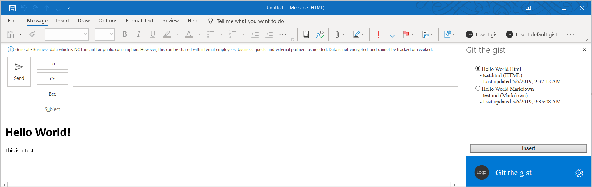

# <a name="tutorial-build-a-message-compose-outlook-add-in"></a>チュートリアル: メッセージ作成 Outlook アドインのビルド

このチュートリアルでは、コンテンツをメッセージの本文に挿入するためにメッセージ作成モードで使用可能な Outlook アドインをビルドする方法について説明します。

このチュートリアルの内容:

> [!div class="checklist"]
>
> - Outlook アドイン プロジェクトを作成する
> - メッセージ作成ウィンドウで表示するボタンを定義する
> - ユーザーから情報を収集し、外部サービスからデータを取得する最初の実行エクスペリエンスを実装する
> - 関数を呼び出す、UI のないボタンを実装する
> - メッセージの本文にコンテンツを挿入する作業ウィンドウを実装する

## <a name="prerequisites"></a>前提条件

- [Node.js](https://nodejs.org/) (最新 [LTS](https://nodejs.org/about/releases) バージョン)

- 最新バージョンの [Yeoman](https://github.com/yeoman/yo) と [Office アドイン用の Yeoman ジェネレーター](https://github.com/OfficeDev/generator-office)。これらのツールをグローバルにインストールするには、コマンド プロンプトから次のコマンドを実行します。

    ```command&nbsp;line
    npm install -g yo generator-office
    ```

    > [!NOTE]
    > Yeomanのジェネレーターを過去に取付けている場合でも、npmからのパッケージを最新のバージョンにすることをお勧めします。

- Windows 上の Outlook 2016 以降 (Microsoft 365 アカウントに接続されたもの) または Outlook on the web

- [GitHub](https://www.github.com) アカウント

## <a name="setup"></a>セットアップ

このチュートリアルで作成するアドインは、ユーザーの GitHub アカウントから [Gist](https://gist.github.com) を読み込み、選択した Gist をメッセージの本文に追加します。 ビルドするアドインのテストに使用可能な 2 つの新しい Gist を作成するには、次の手順を実行します。

1. [GitHub にログイン](https://github.com/login)します。

1. [新しい Gist を作成](https://gist.github.com)します。

    - **[Gist description...]** フィールドに、「**Hello World Markdown**」と入力します。

    - **[Filename including extension...]** フィールドに、「**test.md**」と入力します。

    - 複数行のテキストボックスに、次の Markdown を追加します。

        ```markdown
        # Hello World

        This is content converted from Markdown!

        Here's a JSON sample:

          ```json
          {
            "foo": "bar"
          }
          ```
        ```

    - **[Create Public Gist]** ボタンを選択します。

1. [もう 1 つの新しい Gist を作成](https://gist.github.com)します。

    - **[Gist description...]** フィールドに、「**Hello World Html**」と入力します。

    - **[Filename including extension...]** フィールドに、「**test.html**」と入力します。

    - 複数行のテキストボックスに、次の Markdown を追加します。

        ```HTML
        <html>
          <head>
            <style>
            h1 {
              font-family: Calibri;
            }
            </style>
          </head>
          <body>
            <h1>Hello World!</h1>
            <p>This is a test</p>
          </body>
        </html>
        ```

    - **[Create Public Gist]** ボタンを選択します。

## <a name="create-an-outlook-add-in-project"></a>Outlook アドイン プロジェクトを作成する

1. [!include[Yeoman generator create project guidance](../includes/yo-office-command-guidance.md)]

    - **Choose a project type: (プロジェクトの種類を選択)** - `Office Add-in Task Pane project`

    - **Choose a script type: (スクリプトの種類を選択)** - `JavaScript`

    - **What would you want to name your add-in?: (アドインの名前を何にしますか)** - `Git the gist`

    - **Which Office client application would you like to support?: (どの Office クライアント アプリケーションをサポートしますか)** - `Outlook`

    

    ウィザードを完了すると、ジェネレーターによってプロジェクトが作成されて、サポートしているノード コンポーネントがインストールされます。

    [!include[Yeoman generator next steps](../includes/yo-office-next-steps.md)]

1. プロジェクトのルート ディレクトリに移動します。

    ```command&nbsp;line
    cd "Git the gist"
    ```

1. このアドインは以下のライブラリを使用します。

    - MarkdownをHTMLに変換する[Showdown](https://github.com/showdownjs/showdown)ライブラリ
    - 相対URLを構築するための[URI.js](https://github.com/medialize/URI.js)ライブラリ。
    - DOMとの相互操作を単純化するための[jquery](https://jquery.com/)ライブラリ。

     これらのツールをプロジェクトにインストールするには、プロジェクトのルート ディレクトリで次のコマンドを実行します。

    ```command&nbsp;line
    npm install showdown urijs jquery --save
    ```

### <a name="update-the-manifest"></a>マニフェストを更新する

アドインのマニフェストは、Outlook での表示方法を制御します。またマニフェストは、アドインがアドイン一覧に表示される方法と、リボンに表示されるボタンを定義し、アドインによって使用される HTML ファイルと JavaScript ファイルの URL を設定します。

#### <a name="specify-basic-information"></a>基本的な情報を指定する

**manifest.xml** ファイルで次の更新を行い、アドインに関する基本情報を指定します。

1. `ProviderName` 要素を探し、既定値を会社名に置き換えます。

    ```xml
    <ProviderName>Contoso</ProviderName>
    ```

1. `Description` 要素を探し、既定値をアドインの説明に置き換えて、ファイルを保存します。

    ```xml
    <Description DefaultValue="Allows users to access their GitHub gists."/>
    ```

#### <a name="test-the-generated-add-in"></a>生成されたアドインをテストする

この先に進める前に、ジェネレーターによって生成されたアドインをテストして、プロジェクトが正しく設定されていることを確認します。

> [!NOTE]
> 開発の最中でも、OfficeアドインはHTTPではなくHTTPSを使用する必要があります。 次のコマンドを実行した後に証明書をインストールするように求められた場合は、Yeoman ジェネレーターによって提供される証明書をインストールするプロンプトを受け入れます。 変更を行うには、管理者としてコマンド プロンプトまたはターミナルを実行する必要がある場合もあります。

1. プロジェクトのルート ディレクトリから次のコマンドを実行します。 このコマンドを実行すると、ローカル Web サーバーが (まだ実行されていない場合) 起動し、アドインがサイドロードされます。

    ```command&nbsp;line
    npm start
    ```

1. Outlookで既存のメッセージを開き、**タスクパネルを表示** ボタンを選択します。 すべて正しく設定されていれば、作業ウィンドウが開き、アドインのウェルカム ページが表示されます。

    ![[作業ウィンドウを表示] ボタンのスクリーンショットとサンプルによって追加された作業ウィンドウの Git the gist。](../images/button-and-pane.png)

## <a name="define-buttons"></a>ボタンを定義する

基本のアドインの動作を確認したので、カスタマイズしてより多くの機能を追加できます。 既定のマニフェストでは、メッセージ閲覧ウィンドウ用のボタンのみ定義されています。 マニフェストを更新してメッセージ閲覧ウィンドウからボタンを削除し、メッセージ作成ウィンドウ用の 2 つの新しいボタンを定義してみましょう。

- **Insert gist** (Gist の挿入): 作業ウィンドウを開くボタン

- **Insert default gist** (既定の Gist の挿入): 関数を呼び出すボタン

### <a name="remove-the-messagereadcommandsurface-extension-point"></a>MessageReadCommandSurface 拡張点を削除する

**manifest.xml** ファイルを開き、`MessageReadCommandSurface` 型の `ExtensionPoint` 要素を探します。 この `ExtensionPoint` 要素 (終了タグを含む) を削除することにより、メッセージ閲覧ウィンドウからボタンを削除します。

### <a name="add-the-messagecomposecommandsurface-extension-point"></a>MessageComposeCommandSurface 拡張点を追加する

マニフェスト内で `</DesktopFormFactor>` という行を探します。 この行の直前に、次の XML マークアップを挿入します。 このマークアップについて、次の情報にご注意ください。

- `xsi:type="MessageComposeCommandSurface"`とともに`ExtensionPoint`は、メッセージ作成ウィンドウに追加するボタンを定義していることを示します。

- `id="TabDefault"` の `OfficeTab` 要素を使用することによって、ボタンをリボンの既定タブに追加することを示しています。

- `Group` 要素は、`groupLabel` リソースによってラベルが設定された新しいボタンのグループ化を定義します。

- 最初の `Control` 要素には、`xsi:type="ShowTaskPane"` の `Action` 要素が含まれているので、このボタンは作業ウィンドウを開きます。

- 2 番目の `Control` 要素には `xsi:type="ExecuteFunction"` の `Action` 要素が含まれているので、このボタンは関数ファイルに含まれる JavaScript 関数を呼び出します。

```xml
<!-- Message Compose -->
<ExtensionPoint xsi:type="MessageComposeCommandSurface">
  <OfficeTab id="TabDefault">
    <Group id="msgComposeCmdGroup">
      <Label resid="GroupLabel"/>
      <Control xsi:type="Button" id="msgComposeInsertGist">
        <Label resid="TaskpaneButton.Label"/>
        <Supertip>
          <Title resid="TaskpaneButton.Title"/>
          <Description resid="TaskpaneButton.Tooltip"/>
        </Supertip>
        <Icon>
          <bt:Image size="16" resid="Icon.16x16"/>
          <bt:Image size="32" resid="Icon.32x32"/>
          <bt:Image size="80" resid="Icon.80x80"/>
        </Icon>
        <Action xsi:type="ShowTaskpane">
          <SourceLocation resid="Taskpane.Url"/>
        </Action>
      </Control>
      <Control xsi:type="Button" id="msgComposeInsertDefaultGist">
        <Label resid="FunctionButton.Label"/>
        <Supertip>
          <Title resid="FunctionButton.Title"/>
          <Description resid="FunctionButton.Tooltip"/>
        </Supertip>
        <Icon>
          <bt:Image size="16" resid="Icon.16x16"/>
          <bt:Image size="32" resid="Icon.32x32"/>
          <bt:Image size="80" resid="Icon.80x80"/>
        </Icon>
        <Action xsi:type="ExecuteFunction">
          <FunctionName>insertDefaultGist</FunctionName>
        </Action>
      </Control>
    </Group>
  </OfficeTab>
</ExtensionPoint>
```

### <a name="update-resources-in-the-manifest"></a>マニフェスト内のリソースを更新する

前のコードでは、マニフェストが有効になる前に定義する必要のあるラベル、ヒント、URL が参照されています。 この情報を、マニフェストの`Resources`部分で指定します。

1. マニフェストファイル内の`Resources`要素を見つけて、要素全体（その終了タグを含む）を削除します。

1. 同じ場所に、次のマークアップを追加して、削除した `Resources` 要素を置き換えます。

    ```xml
    <Resources>
      <bt:Images>
        <bt:Image id="Icon.16x16" DefaultValue="https://localhost:3000/assets/icon-16.png"/>
        <bt:Image id="Icon.32x32" DefaultValue="https://localhost:3000/assets/icon-32.png"/>
        <bt:Image id="Icon.80x80" DefaultValue="https://localhost:3000/assets/icon-80.png"/>
      </bt:Images>
      <bt:Urls>
        <bt:Url id="Commands.Url" DefaultValue="https://localhost:3000/commands.html"/>
        <bt:Url id="Taskpane.Url" DefaultValue="https://localhost:3000/taskpane.html"/>
      </bt:Urls>
      <bt:ShortStrings>
        <bt:String id="GroupLabel" DefaultValue="Git the gist"/>
        <bt:String id="TaskpaneButton.Label" DefaultValue="Insert gist"/>
        <bt:String id="TaskpaneButton.Title" DefaultValue="Insert gist"/>
        <bt:String id="FunctionButton.Label" DefaultValue="Insert default gist"/>
        <bt:String id="FunctionButton.Title" DefaultValue="Insert default gist"/>
      </bt:ShortStrings>
      <bt:LongStrings>
        <bt:String id="TaskpaneButton.Tooltip" DefaultValue="Displays a list of your gists and allows you to insert their contents into the current message."/>
        <bt:String id="FunctionButton.Tooltip" DefaultValue="Inserts the content of the gist you mark as default into the current message."/>
      </bt:LongStrings>
    </Resources>
    ```

1. マニフェストへの変更を保存します。

### <a name="reinstall-the-add-in"></a>アドインを再インストールする

以前にはファイルからアドインをインストールしたため、マニフェストに対して行った変更を有効にするにはそのアドインを再インストールする必要があります。

1. 指示に従って、[サイドロードされたアドイン](../outlook/sideload-outlook-add-ins-for-testing.md#remove-a-sideloaded-add-in)から **Git the gist** を削除します。

1. **[個人用アドイン]** ウィンドウを閉じます。

1. カスタム ボタンは一時的にリボンに表示されなくなります。

1. 「[テスト用に Outlook アドインをサイドロードする](../outlook/sideload-outlook-add-ins-for-testing.md)」の手順に従って、更新した **manifest.xml** ファイルを使用してアドインを再インストールします。

アドインを再インストールした後、メッセージ作成ウィンドウで **Insert gist** と **Insert default gist** のコマンドを確認して、アドインが正常にインストールされたことを確認できます。 このアドインのビルドはまだ完了していないため、どちらを選択しても何も起こりません。

- このアドインを WWindows 上の Outlook 2016 以降で実行している場合は、メッセージ作成ウィンドウのリボンに **[Insert gist]** と **[Insert default gist]**] という 2 つの新しいボタンが表示されます。

    

- Outlook on the webでこのアドインを実行している場合は、メッセージ作成ウィンドウの下部に新しいボタンが表示されます。 このボタンを選択すると、**[Insert gist]** と **[Insert default gist]** のオプションが表示されます。

    

## <a name="implement-a-first-run-experience"></a>最初の実行エクスペリエンスを実装する

このアドインでは、ユーザーの GitHub アカウントから Gist を読み込み、ユーザーが既定として選択した Gist を特定できる必要があります。 この目的を達成するため、アドインはユーザーに対して、GitHub のユーザー名を入力し、既存の Gist のコレクションから既定の Gist を選択するためのダイアログを表示する必要があります。 ユーザーからこの情報を収集するためのダイアログを表示する最初の実行エクスペリエンスを実装するには、このセクションの手順を実行します。

### <a name="collect-data-from-the-user"></a>ユーザーからデータを収集する

ダイアログ自体の UI を作成することから始めましょう。 **./src** フォルダー内に、**settings** という名前の新しいサブフォルダーを作成します。 **./src/settings** フォルダーに **dialog.html** という名前のファイルを作成し、次のマークアップを追加して、GitHubユーザー名、およびJavaScriptを介して生成される空の概要リストのテキストを入力できるごく基本的なフォームを定義します。

```html
<!DOCTYPE html>
<html>

<head>
  <meta charset="UTF-8" />
  <meta http-equiv="X-UA-Compatible" content="IE=Edge" />
  <title>Settings</title>

  <!-- Office JavaScript API -->
  <script type="text/javascript" src="https://appsforoffice.microsoft.com/lib/1.1/hosted/office.js"></script>

<!-- For more information on Fluent UI, visit https://developer.microsoft.com/fluentui. -->
  <link rel="stylesheet" href="https://static2.sharepointonline.com/files/fabric/office-ui-fabric-core/9.6.1/css/fabric.min.css"/>

  <!-- Template styles -->
  <link href="dialog.css" rel="stylesheet" type="text/css" />
</head>

<body class="ms-font-l">
  <main>
    <section class="ms-font-m ms-fontColor-neutralPrimary">
      <div class="not-configured-warning ms-MessageBar ms-MessageBar--warning">
        <div class="ms-MessageBar-content">
          <div class="ms-MessageBar-icon">
            <i class="ms-Icon ms-Icon--Info"></i>
          </div>
          <div class="ms-MessageBar-text">
            Oops! It looks like you haven't configured <strong>Git the gist</strong> yet.
            <br/>
            Please configure your GitHub username and select a default gist, then try that action again!
          </div>
        </div>
      </div>
      <div class="ms-font-xxl">Settings</div>
      <div class="ms-Grid">
        <div class="ms-Grid-row">
          <div class="ms-TextField">
            <label class="ms-Label">GitHub Username</label>
            <input class="ms-TextField-field" id="github-user" type="text" value="" placeholder="Please enter your GitHub username">
          </div>
        </div>
        <div class="error-display ms-Grid-row">
          <div class="ms-font-l ms-fontWeight-semibold">An error occurred:</div>
          <pre><code id="error-text"></code></pre>
        </div>
        <div class="gist-list-container ms-Grid-row">
          <div class="list-title ms-font-xl ms-fontWeight-regular">Choose Default Gist</div>
          <form>
            <div id="gist-list">
            </div>
          </form>
        </div>
      </div>
      <div class="ms-Dialog-actions">
        <div class="ms-Dialog-actionsRight">
          <button class="ms-Dialog-action ms-Button ms-Button--primary" id="settings-done" disabled>
            <span class="ms-Button-label">Done</span>
          </button>
        </div>
      </div>
    </section>
  </main>
  <script type="text/javascript" src="../../node_modules/core-js/client/core.js"></script>
  <script type="text/javascript" src="../../node_modules/jquery/dist/jquery.js"></script>
  <script type="text/javascript" src="../helpers/gist-api.js"></script>
  <script type="text/javascript" src="dialog.js"></script>
</body>

</html>
```

次に、**./src/settings** フォルダーに **dialog.css** という名前のファイルを作成し、次のコードを追加して **dialog.html** で使用されるスタイルを指定します。

```CSS
section {
  margin: 10px 20px;
}

.not-configured-warning {
  display: none;
}

.error-display {
  display: none;
}

.gist-list-container {
  margin: 10px -8px;
  display: none;
}

.list-title {
  border-bottom: 1px solid #a6a6a6;
  padding-bottom: 5px;
}

ul {
  margin-top: 10px;
}

.ms-ListItem-secondaryText,
.ms-ListItem-tertiaryText {
  padding-left: 15px;
}
```

これでダイアログの UI の定義が完了したので、次に実際に動作するためのコードを記述します。 **./src/settings** フォルダーに **dialog.js** という名前のファイルを作成し、次のコードを追加します。 このコードでは、イベントを登録するために jQuery を使用し、ユーザーの選択内容を呼び出し元に送り返すために `messageParent` 関数を使用しています。

```js
(function(){
  'use strict';

  // The Office initialize function must be run each time a new page is loaded.
  Office.initialize = function(reason){
    jQuery(document).ready(function(){
      if (window.location.search) {
        // Check if warning should be displayed.
        var warn = getParameterByName('warn');
        if (warn) {
          $('.not-configured-warning').show();
        } else {
          // See if the config values were passed.
          // If so, pre-populate the values.
          var user = getParameterByName('gitHubUserName');
          var gistId = getParameterByName('defaultGistId');

          $('#github-user').val(user);
          loadGists(user, function(success){
            if (success) {
              $('.ms-ListItem').removeClass('is-selected');
              $('input').filter(function() {
                return this.value === gistId;
              }).addClass('is-selected').attr('checked', 'checked');
              $('#settings-done').removeAttr('disabled');
            }
          });
        }
      }

      // When the GitHub username changes,
      // try to load gists.
      $('#github-user').on('change', function(){
        $('#gist-list').empty();
        var ghUser = $('#github-user').val();
        if (ghUser.length > 0) {
          loadGists(ghUser);
        }
      });

      // When the Done button is selected, send the
      // values back to the caller as a serialized
      // object.
      $('#settings-done').on('click', function() {
        var settings = {};

        settings.gitHubUserName = $('#github-user').val();

        var selectedGist = $('.ms-ListItem.is-selected');
        if (selectedGist) {
          settings.defaultGistId = selectedGist.val();

          sendMessage(JSON.stringify(settings));
        }
      });
    });
  };

  // Load gists for the user using the GitHub API
  // and build the list.
  function loadGists(user, callback) {
    getUserGists(user, function(gists, error){
      if (error) {
        $('.gist-list-container').hide();
        $('#error-text').text(JSON.stringify(error, null, 2));
        $('.error-display').show();
        if (callback) callback(false);
      } else {
        $('.error-display').hide();
        buildGistList($('#gist-list'), gists, onGistSelected);
        $('.gist-list-container').show();
        if (callback) callback(true);
      }
    });
  }

  function onGistSelected() {
    $('.ms-ListItem').removeClass('is-selected').removeAttr('checked');
    $(this).children('.ms-ListItem').addClass('is-selected').attr('checked', 'checked');
    $('.not-configured-warning').hide();
    $('#settings-done').removeAttr('disabled');
  }

  function sendMessage(message) {
    Office.context.ui.messageParent(message);
  }

  function getParameterByName(name, url) {
    if (!url) {
      url = window.location.href;
    }
    name = name.replace(/[\[\]]/g, "\\$&");
    var regex = new RegExp("[?&]" + name + "(=([^&#]*)|&|#|$)"),
      results = regex.exec(url);
    if (!results) return null;
    if (!results[2]) return '';
    return decodeURIComponent(results[2].replace(/\+/g, " "));
  }
})();
```

#### <a name="update-webpack-config-settings"></a>Webpackの機能設定を更新する

最後に、プロジェクトのルートディレクトリにあるファイル **webpack.config.js** ファイルを開き、以下の手順を実行します。

1. `config`オブジェクト内で`entry`オブジェクトを探し、`dialog`の新しいエントリーを追加します。

    ```js
    dialog: "./src/settings/dialog.js"
    ```

    これを実行すると、新しい`entry`オブジェクトは次のようになります。

    ```js
    entry: {
      polyfill: "@babel/polyfill",
      taskpane: "./src/taskpane/taskpane.js",
      commands: "./src/commands/commands.js",
      dialog: "./src/settings/dialog.js"
    },
    ```

1. `config` オブジェクト内で `plugins` 配列を探します。 `new CopyWebpackPlugin` オブジェクトの`patterns` 配列で、`taskpane.css` エントリーの後に新しいエントリーを追加します。

    ```js
    {
      to: "dialog.css",
      from: "./src/settings/dialog.css"
    },
    ```

    これを実行すると、`new CopyWebpackPlugin`オブジェクトは次のようになります。

    ```js
      new CopyWebpackPlugin({
        patterns: [
        {
          to: "taskpane.css",
          from: "./src/taskpane/taskpane.css"
        },
        {
          to: "dialog.css",
          from: "./src/settings/dialog.css"
        },
        {
          to: "[name]." + buildType + ".[ext]",
          from: "manifest*.xml",
          transform(content) {
            if (dev) {
              return content;
            } else {
              return content.toString().replace(new RegExp(urlDev, "g"), urlProd);
            }
          }
        }
      ]}),
    ```

1. `config`オブジェクト内で`plugins` 配列を探し、この新しいオブジェクトをその配列の末尾に追加します。

    ```js
    new HtmlWebpackPlugin({
      filename: "dialog.html",
      template: "./src/settings/dialog.html",
      chunks: ["polyfill", "dialog"]
    })
    ```

    これを実行すると、新しい`plugins`配列は次のようになります。

    ```js
    plugins: [
      new CleanWebpackPlugin(),
      new HtmlWebpackPlugin({
        filename: "taskpane.html",
        template: "./src/taskpane/taskpane.html",
        chunks: ["polyfill", "taskpane"]
      }),
      new CopyWebpackPlugin({
        patterns: [
        {
          to: "taskpane.css",
          from: "./src/taskpane/taskpane.css"
        },
        {
          to: "dialog.css",
          from: "./src/settings/dialog.css"
        },
        {
          to: "[name]." + buildType + ".[ext]",
          from: "manifest*.xml",
          transform(content) {
            if (dev) {
              return content;
            } else {
              return content.toString().replace(new RegExp(urlDev, "g"), urlProd);
            }
          }
        }
      ]}),
      new HtmlWebpackPlugin({
        filename: "commands.html",
        template: "./src/commands/commands.html",
        chunks: ["polyfill", "commands"]
      }),
      new HtmlWebpackPlugin({
        filename: "dialog.html",
        template: "./src/settings/dialog.html",
        chunks: ["polyfill", "dialog"]
      })
    ],
    ```

1. Webサーバーが稼働している場合は、ノード コマンド ウィンドウを閉じます。

1. 次のコマンドを実行してプロジェクトを再構築します。

    ```command&nbsp;line
    npm run build
    ```

1. 次のコマンドを実行し、Web サーバーを起動してアドインのサイドロードを行います。

    ```command&nbsp;line
    npm start
    ```

### <a name="fetch-data-from-github"></a>GitHub からデータを取得する

上記で作成した **dialog.js** ファイルには、GitHub ユーザー名フィールドについて `change` イベントが発生したときにアドインが Gist を読み込む必要があることが指定されています。 GitHub からユーザーの Gist を取得するには、[GitHub Gist の API](https://developer.github.com/v3/gists/) を使用します。

**./src** フォルダー内に、**helpers** という名前の新しいサブフォルダーを作成します。 **./src/helpers** フォルダーに **gist-api.js** という名前のファイルを作成し、以下のコードを追加してGitHubからユーザーの概要を取得し、概要のリストを作成します。

```js
function getUserGists(user, callback) {
  var requestUrl = 'https://api.github.com/users/' + user + '/gists';

  $.ajax({
    url: requestUrl,
    dataType: 'json'
  }).done(function(gists){
    callback(gists);
  }).fail(function(error){
    callback(null, error);
  });
}

function buildGistList(parent, gists, clickFunc) {
  gists.forEach(function(gist) {

    var listItem = $('<div/>')
      .appendTo(parent);

    var radioItem = $('<input>')
      .addClass('ms-ListItem')
      .addClass('is-selectable')
      .attr('type', 'radio')
      .attr('name', 'gists')
      .attr('tabindex', 0)
      .val(gist.id)
      .appendTo(listItem);

    var desc = $('<span/>')
      .addClass('ms-ListItem-primaryText')
      .text(gist.description)
      .appendTo(listItem);

    var desc = $('<span/>')
      .addClass('ms-ListItem-secondaryText')
      .text(' - ' + buildFileList(gist.files))
      .appendTo(listItem);

    var updated = new Date(gist.updated_at);

    var desc = $('<span/>')
      .addClass('ms-ListItem-tertiaryText')
      .text(' - Last updated ' + updated.toLocaleString())
      .appendTo(listItem);

    listItem.on('click', clickFunc);
  });  
}

function buildFileList(files) {

  var fileList = '';

  for (var file in files) {
    if (files.hasOwnProperty(file)) {
      if (fileList.length > 0) {
        fileList = fileList + ', ';
      }

      fileList = fileList + files[file].filename + ' (' + files[file].language + ')';
    }
  }

  return fileList;
}
```

> [!NOTE]
> 設定ダイアログを呼び出すためのボタンがないことに気づかれたかもしれません。 代わりに、アドインは構成済みであるかどうかを、ユーザーが **[Insert default gist]** ボタンまたは **[Insert gist]** ボタンのいずれかを選択したときに確認します。 アドインがまだ構成されていない場合、設定ダイアログが表示され、処理を進める前に構成するようにユーザーに促します。

## <a name="implement-a-ui-less-button"></a>UI のないボタンを実装する

このアドインの **[Insert default gist]** ボタンは UI のないボタンであり、他のアドイン ボタンのように作業ウィンドウを開くのではなく、JavaScript 関数を呼び出します。 ユーザーが **[Insert default gist]** ボタンを選択すると、対応する JavaScript 関数によって、アドインが構成済みであるかどうかが確認されます。

- アドインが既に構成済みの場合、ユーザーが既定として選択した Gist のコンテンツが関数によって読み込まれ、メッセージの本文に挿入されます。

- アドインがまだ構成されていない場合、設定ダイアログが表示され、必要な情報を入力するようにユーザーに促します。

### <a name="update-the-function-file-html"></a>関数ファイルを更新する (HTML)

UI のないボタンによって呼び出される関数は、対応するフォーム ファクターのマニフェスト内の `FunctionFile` 要素で指定されたファイルで定義する必要があります。 このアドインのマニフェストでは、`https://localhost:3000/commands.html` が関数ファイルとして指定されています。

ファイル **./src/commands/commands.html** を開き、内容全体を次のマークアップに置き換えます。

```html
<!DOCTYPE html>
<html>

<head>
    <meta charset="UTF-8" />
    <meta http-equiv="X-UA-Compatible" content="IE=Edge" />

    <!-- Office JavaScript API -->
    <script type="text/javascript" src="https://appsforoffice.microsoft.com/lib/1.1/hosted/office.js"></script>

    <script type="text/javascript" src="../node_modules/jquery/dist/jquery.js"></script>
    <script type="text/javascript" src="../node_modules/showdown/dist/showdown.min.js"></script>
    <script type="text/javascript" src="../node_modules/urijs/src/URI.min.js"></script>
    <script type="text/javascript" src="../src/helpers/addin-config.js"></script>
    <script type="text/javascript" src="../src/helpers/gist-api.js"></script>
</head>

<body>
  <!-- NOTE: The body is empty on purpose. Since functions in commands.js are
       invoked via a button, there is no UI to render. -->
</body>

</html>
```

### <a name="update-the-function-file-javascript"></a>関数ファイルを更新する (JavaScript)

ファイル **./src/commands/commands.js** を開き、内容全体を次のコードに置き換えます。 アドインがまだ構成されていないことが `insertDefaultGist` 関数で確認された場合、`?warn=1` パラメーターがダイアログ URL に追加されます。 これにより、**./settings/dialog.html** で定義されているメッセージ バーが設定ダイアログに表示され、このダイアログが表示されている理由をユーザーに示すことができます。

```js
var config;
var btnEvent;

// The initialize function must be run each time a new page is loaded.
Office.initialize = function (reason) {
};

// Add any UI-less function here.
function showError(error) {
  Office.context.mailbox.item.notificationMessages.replaceAsync('github-error', {
    type: 'errorMessage',
    message: error
  }, function(result){
  });
}

var settingsDialog;

function insertDefaultGist(event) {

  config = getConfig();

  // Check if the add-in has been configured.
  if (config && config.defaultGistId) {
    // Get the default gist content and insert.
    try {
      getGist(config.defaultGistId, function(gist, error) {
        if (gist) {
          buildBodyContent(gist, function (content, error) {
            if (content) {
              Office.context.mailbox.item.body.setSelectedDataAsync(content,
                {coercionType: Office.CoercionType.Html}, function(result) {
                  event.completed();
              });
            } else {
              showError(error);
              event.completed();
            }
          });
        } else {
          showError(error);
          event.completed();
        }
      });
    } catch (err) {
      showError(err);
      event.completed();
    }

  } else {
    // Save the event object so we can finish up later.
    btnEvent = event;
    // Not configured yet, display settings dialog with
    // warn=1 to display warning.
    var url = new URI('../src/settings/dialog.html?warn=1').absoluteTo(window.location).toString();
    var dialogOptions = { width: 20, height: 40, displayInIframe: true };

    Office.context.ui.displayDialogAsync(url, dialogOptions, function(result) {
      settingsDialog = result.value;
      settingsDialog.addEventHandler(Office.EventType.DialogMessageReceived, receiveMessage);
      settingsDialog.addEventHandler(Office.EventType.DialogEventReceived, dialogClosed);
    });
  }
}

function receiveMessage(message) {
  config = JSON.parse(message.message);
  setConfig(config, function(result) {
    settingsDialog.close();
    settingsDialog = null;
    btnEvent.completed();
    btnEvent = null;
  });
}

function dialogClosed(message) {
  settingsDialog = null;
  btnEvent.completed();
  btnEvent = null;
}

function getGlobal() {
  return (typeof self !== "undefined") ? self :
    (typeof window !== "undefined") ? window :
    (typeof global !== "undefined") ? global :
    undefined;
}

var g = getGlobal();

// The add-in command functions need to be available in global scope.
g.insertDefaultGist = insertDefaultGist;
```

### <a name="create-a-file-to-manage-configuration-settings"></a>構成設定を管理するファイルを作成する

HTML 関数ファイルは **addin-config.js** という名前のファイルを参照していますが、このファイルはまだ存在していません。 **./src/helpers** フォルダーに **addin-config.js** という名前のファイルを作成し、次のコードを追加します。 このコードは、[RoamingSettings オブジェクト](/javascript/api/outlook/office.RoamingSettings)を使用して、構成値を取得または設定するものです。

```js
function getConfig() {
  var config = {};

  config.gitHubUserName = Office.context.roamingSettings.get('gitHubUserName');
  config.defaultGistId = Office.context.roamingSettings.get('defaultGistId');

  return config;
}

function setConfig(config, callback) {
  Office.context.roamingSettings.set('gitHubUserName', config.gitHubUserName);
  Office.context.roamingSettings.set('defaultGistId', config.defaultGistId);

  Office.context.roamingSettings.saveAsync(callback);
}
```

### <a name="create-new-functions-to-process-gists"></a>Gist を処理する新しい関数を作成する

次に、**./src/helpers/gist-api.js** ファイルを開き、以下の機能を追加します。 次の点に注意してください。

- Gist に HTML が含まれている場合、アドインは HTML をそのままメッセージの本文に挿入します。

- Gist にマークダウンが含まれている場合、アドインは [Showdown](https://github.com/showdownjs/showdown) ライブラリを使用してマークダウンを HTML に変換し、その HTML をメッセージの本文に挿入します。

- Gist に HTML またはマークダウン以外のものが含まれている場合、アドインはそのコンテンツをコード スニペットとしてメッセージの本文に挿入します。

```js
function getGist(gistId, callback) {
  var requestUrl = 'https://api.github.com/gists/' + gistId;

  $.ajax({
    url: requestUrl,
    dataType: 'json'
  }).done(function(gist){
    callback(gist);
  }).fail(function(error){
    callback(null, error);
  });
}

function buildBodyContent(gist, callback) {
  // Find the first non-truncated file in the gist
  // and use it.
  for (var filename in gist.files) {
    if (gist.files.hasOwnProperty(filename)) {
      var file = gist.files[filename];
      if (!file.truncated) {
        // We have a winner.
        switch (file.language) {
          case 'HTML':
            // Insert as-is.
            callback(file.content);
            break;
          case 'Markdown':
            // Convert Markdown to HTML.
            var converter = new showdown.Converter();
            var html = converter.makeHtml(file.content);
            callback(html);
            break;
          default:
            // Insert contents as a <code> block.
            var codeBlock = '<pre><code>';
            codeBlock = codeBlock + file.content;
            codeBlock = codeBlock + '</code></pre>';
            callback(codeBlock);
        }
        return;
      }
    }
  }
  callback(null, 'No suitable file found in the gist');
}
```

### <a name="test-the-button"></a>ボタンをテストする

すべての変更を保存したら、コマンド プロンプトから `npm start` を実行します (サーバーがまだ実行されていない場合)。 その後、次の手順に従って **[Insert default gist]** ボタンのテストを行います。

1. Outlook を開き、新しいメッセージを作成します。

1. メッセージの作成ウィンドウで、**[Insert default gist]** ボタンを選択します。 GitHub ユーザー名を設定するためのプロンプトから始めて、アドインを構成できるダイアログが表示されます。

    

1. 設定ダイアログで GitHub のユーザー名を入力して、ダイアログの他の部分を **選択** するかクリックします。すると、`change` イベントが呼び出され、公開 Gist のリストが読み込まれます。 既定とする Gist を選択し、**[Done]** を選択します。

    

1. もう一度 **[Insert default gist]** ボタンを選択します。 今度は、Gist のコンテンツが電子メールの本文に挿入されます。

   > [!NOTE]
   > Windows 上の Outlook: 最新の設定を選択するには、[メッセージの作成] ウィンドウを閉じて、もう一度開く必要がある場合があります。

## <a name="implement-a-task-pane"></a>作業ウィンドウを実装する

このアドインの **[Insert gist]** ボタンにより、作業ウィンドウを開いてユーザーの Gist を表示します。 ここでユーザーはメッセージの本文に挿入する Gist を選択することができます。 ユーザーがまだアドインを構成していない場合、ダイアログが表示されて構成するように求められます。

### <a name="specify-the-html-for-the-task-pane"></a>作業ペインのHTMLを指定する

作成したプロジェクトでは、作業ペインのHTMLはファイル **./src/taskpane/taskpane.html** で指定されています。 該当ファイルを開き、内容全体を次のマークアップで置き換えます。

```html
<!DOCTYPE html>
<html>

<head>
    <meta charset="UTF-8" />
    <meta http-equiv="X-UA-Compatible" content="IE=Edge" />
    <meta name="viewport" content="width=device-width, initial-scale=1">
    <title>Contoso Task Pane Add-in</title>

    <!-- Office JavaScript API -->
    <script type="text/javascript" src="https://appsforoffice.microsoft.com/lib/1.1/hosted/office.js"></script>

   <!-- For more information on Fluent UI, visit https://developer.microsoft.com/fluentui. -->
    <link rel="stylesheet" href="https://static2.sharepointonline.com/files/fabric/office-ui-fabric-core/9.6.1/css/fabric.min.css"/>

    <!-- Template styles -->
    <link href="taskpane.css" rel="stylesheet" type="text/css" />
</head>

<body class="ms-font-l ms-landing-page">
  <main class="ms-landing-page__main">
    <section class="ms-landing-page__content ms-font-m ms-fontColor-neutralPrimary">
      <div id="not-configured" style="display: none;">
        <div class="centered ms-font-xxl ms-u-textAlignCenter">Welcome!</div>
        <div class="ms-font-xl" id="settings-prompt">Please choose the <strong>Settings</strong> icon at the bottom of this window to configure this add-in.</div>
      </div>
      <div id="gist-list-container" style="display: none;">
        <form>
          <div id="gist-list">
          </div>
        </form>
      </div>
      <div id="error-display" style="display: none;" class="ms-u-borderBase ms-fontColor-error ms-font-m ms-bgColor-error ms-borderColor-error">
      </div>
    </section>
    <button class="ms-Button ms-Button--primary" id="insert-button" tabindex=0 disabled>
      <span class="ms-Button-label">Insert</span>
    </button>
  </main>
  <footer class="ms-landing-page__footer ms-bgColor-themePrimary">
    <div class="ms-landing-page__footer--left">
      
      <h1 class="ms-font-xl ms-fontWeight-semilight ms-fontColor-white">Git the gist</h1>
    </div>
    <div id="settings-icon" class="ms-landing-page__footer--right" aria-label="Settings" tabindex=0>
      <i class="ms-Icon enlarge ms-Icon--Settings ms-fontColor-white"></i>
    </div>
  </footer>
  <script type="text/javascript" src="../node_modules/jquery/dist/jquery.js"></script>
  <script type="text/javascript" src="../node_modules/showdown/dist/showdown.min.js"></script>
  <script type="text/javascript" src="../node_modules/urijs/src/URI.min.js"></script>
  <script type="text/javascript" src="../src/helpers/addin-config.js"></script>
  <script type="text/javascript" src="../src/helpers/gist-api.js"></script>
  <script type="text/javascript" src="taskpane.js"></script>
</body>

</html>
```

### <a name="specify-the-css-for-the-task-pane"></a>作業ペインのCSSを指定する

作成したプロジェクトでは、作業ウィンドウのCSSは **./src/taskpane/taskpane.css** ファイルで指定されています。 該当ファイルを開き、内容全体を次のコードで置き換えます。

```css
/* Copyright (c) Microsoft. All rights reserved. Licensed under the MIT license. See full license in root of repo. */
html, body {
  width: 100%;
  height: 100%;
  margin: 0;
  padding: 0;
  overflow: auto; }

body {
  position: relative;
  font-size: 16px; }

main {
  height: 100%;
  overflow-y: auto; }

footer {
  width: 100%;
  position: relative;
  bottom: 0;
  margin-top: 10px;}

p, h1, h2, h3, h4, h5, h6 {
  margin: 0;
  padding: 0; }

ul {
  padding: 0; }

#settings-prompt {
  margin: 10px 0;
}

#error-display {
  padding: 10px;
}

#insert-button {
  margin: 0 10px;
}

.clearfix {
  display: block;
  clear: both;
  height: 0; }

.pointerCursor {
  cursor: pointer; }

.invisible {
  visibility: hidden; }

.undisplayed {
  display: none; }

.ms-Icon.enlarge {
  position: relative;
  font-size: 20px;
  top: 4px; }

.ms-ListItem-secondaryText,
.ms-ListItem-tertiaryText {
  padding-left: 15px;
}

.ms-landing-page {
  display: -webkit-flex;
  display: flex;
  -webkit-flex-direction: column;
          flex-direction: column;
  -webkit-flex-wrap: nowrap;
          flex-wrap: nowrap;
  height: 100%; }
  .ms-landing-page__main {
    display: -webkit-flex;
    display: flex;
    -webkit-flex-direction: column;
            flex-direction: column;
    -webkit-flex-wrap: nowrap;
            flex-wrap: nowrap;
    -webkit-flex: 1 1 0;
            flex: 1 1 0;
    height: 100%; }

  .ms-landing-page__content {
    display: -webkit-flex;
    display: flex;
    -webkit-flex-direction: column;
            flex-direction: column;
    -webkit-flex-wrap: nowrap;
            flex-wrap: nowrap;
    height: 100%;
    -webkit-flex: 1 1 0;
            flex: 1 1 0;
    padding: 20px; }
    .ms-landing-page__content h2 {
      margin-bottom: 20px; }
  .ms-landing-page__footer {
    display: -webkit-inline-flex;
    display: inline-flex;
    -webkit-justify-content: center;
            justify-content: center;
    -webkit-align-items: center;
            align-items: center; }
    .ms-landing-page__footer--left {
      transition: background ease 0.1s, color ease 0.1s;
      display: -webkit-inline-flex;
      display: inline-flex;
      -webkit-justify-content: flex-start;
              justify-content: flex-start;
      -webkit-align-items: center;
              align-items: center;
      -webkit-flex: 1 0 0px;
              flex: 1 0 0px;
      padding: 20px; }
      .ms-landing-page__footer--left:active, .ms-landing-page__footer--left:hover {
        background: #005ca4;
        cursor: pointer; }
      .ms-landing-page__footer--left:active {
        background: #005ca4; }
      .ms-landing-page__footer--left--disabled {
        opacity: 0.6;
        pointer-events: none;
        cursor: not-allowed; }
        .ms-landing-page__footer--left--disabled:active, .ms-landing-page__footer--left--disabled:hover {
          background: transparent; }
      .ms-landing-page__footer--left img {
        width: 40px;
        height: 40px; }
      .ms-landing-page__footer--left h1 {
        -webkit-flex: 1 0 0px;
                flex: 1 0 0px;
        margin-left: 15px;
        text-align: left;
        width: auto;
        max-width: auto;
        overflow: hidden;
        white-space: nowrap;
        text-overflow: ellipsis; }
    .ms-landing-page__footer--right {
      transition: background ease 0.1s, color ease 0.1s;
      padding: 29px 20px; }
      .ms-landing-page__footer--right:active, .ms-landing-page__footer--right:hover {
        background: #005ca4;
        cursor: pointer; }
      .ms-landing-page__footer--right:active {
        background: #005ca4; }
      .ms-landing-page__footer--right--disabled {
        opacity: 0.6;
        pointer-events: none;
        cursor: not-allowed; }
        .ms-landing-page__footer--right--disabled:active, .ms-landing-page__footer--right--disabled:hover {
          background: transparent; }
```

### <a name="specify-the-javascript-for-the-task-pane"></a>作業ペインのJavaScriptを指定する

作成したプロジェクトでは、作業ペインのJavaScriptはファイル **./src/taskpane/taskpane.js** で指定されています。 該当ファイルを開き、内容全体を次のコードで置き換えます。

```js
(function(){
  'use strict';

  var config;
  var settingsDialog;

  Office.initialize = function(reason){

    jQuery(document).ready(function(){

      config = getConfig();

      // Check if add-in is configured.
      if (config && config.gitHubUserName) {
        // If configured, load the gist list.
        loadGists(config.gitHubUserName);
      } else {
        // Not configured yet.
        $('#not-configured').show();
      }

      // When insert button is selected, build the content
      // and insert into the body.
      $('#insert-button').on('click', function(){
        var gistId = $('.ms-ListItem.is-selected').val();
        getGist(gistId, function(gist, error) {
          if (gist) {
            buildBodyContent(gist, function (content, error) {
              if (content) {
                Office.context.mailbox.item.body.setSelectedDataAsync(content,
                  {coercionType: Office.CoercionType.Html}, function(result) {
                    if (result.status === Office.AsyncResultStatus.Failed) {
                      showError('Could not insert gist: ' + result.error.message);
                    }
                });
              } else {
                showError('Could not create insertable content: ' + error);
              }
            });
          } else {
            showError('Could not retrieve gist: ' + error);
          }
        });
      });

      // When the settings icon is selected, open the settings dialog.
      $('#settings-icon').on('click', function(){
        // Display settings dialog.
        var url = new URI('../src/settings/dialog.html').absoluteTo(window.location).toString();
        if (config) {
          // If the add-in has already been configured, pass the existing values
          // to the dialog.
          url = url + '?gitHubUserName=' + config.gitHubUserName + '&defaultGistId=' + config.defaultGistId;
        }

        var dialogOptions = { width: 20, height: 40, displayInIframe: true };

        Office.context.ui.displayDialogAsync(url, dialogOptions, function(result) {
          settingsDialog = result.value;
          settingsDialog.addEventHandler(Office.EventType.DialogMessageReceived, receiveMessage);
          settingsDialog.addEventHandler(Office.EventType.DialogEventReceived, dialogClosed);
        });
      })
    });
  };

  function loadGists(user) {
    $('#error-display').hide();
    $('#not-configured').hide();
    $('#gist-list-container').show();

    getUserGists(user, function(gists, error) {
      if (error) {

      } else {
        $('#gist-list').empty();
        buildGistList($('#gist-list'), gists, onGistSelected);
      }
    });
  }

  function onGistSelected() {
    $('#insert-button').removeAttr('disabled');
    $('.ms-ListItem').removeClass('is-selected').removeAttr('checked');
    $(this).children('.ms-ListItem').addClass('is-selected').attr('checked', 'checked');
  }

  function showError(error) {
    $('#not-configured').hide();
    $('#gist-list-container').hide();
    $('#error-display').text(error);
    $('#error-display').show();
  }

  function receiveMessage(message) {
    config = JSON.parse(message.message);
    setConfig(config, function(result) {
      settingsDialog.close();
      settingsDialog = null;
      loadGists(config.gitHubUserName);
    });
  }

  function dialogClosed(message) {
    settingsDialog = null;
  }
})();
```

### <a name="test-the-button"></a>ボタンをテストする

すべての変更を保存したら、コマンド プロンプトから `npm start` を実行します (サーバーがまだ実行されていない場合)。 その後、次の手順に従って **[Insert gist]** ボタンのテストを行います。

1. Outlook を開き、新しいメッセージを作成します。

1. メッセージの作成ウィンドウで、**[Insert gist]** ボタンを選択します。 作成フォームの右側に作業ウィンドウが表示されます。

1. 作業ウィンドウで、**[Hello World Html]** を選択し、**[Insert]** を選択してメッセージの本文にその Gist を挿入します。



## <a name="next-steps"></a>次のステップ

このチュートリアルでは、コンテンツをメッセージの本文に挿入するためにメッセージ作成モードで使用可能な Outlook アドインを作成しました。 Outlook アドインの開発に関する詳細については、次の記事に進んでください。

> [!div class="nextstepaction"]
> [Outlook アドインの API](../outlook/apis.md)
