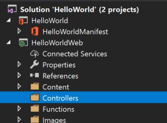

# <a name="tutorial-create-a-powerpoint-task-pane-add-in"></a>チュートリアル: PowerPoint 作業ウィンドウ アドインを作成する

このチュートリアルでは Visual Studio を使用して、以下を実行する PowerPoint 作業ウィンドウ アドインを作成します。

> [!div class="checklist"]
> * その日の [Bing](https://www.bing.com) の写真をスライドに追加する
> * スライドにテキストを追加する
> * スライドのメタデータを取得する
> * スライド間を移動する

## <a name="prerequisites"></a>前提条件

[!include[Quick Start prerequisites](../includes/quickstart-vs-prerequisites.md)]

## <a name="create-your-add-in-project"></a>アドイン プロジェクトの作成

Visual Studio を使用して PowerPoint アドイン プロジェクトを作成するには次の手順を実行します。

1. [Visual Studio] メニュー バーで、**[ファイル]** > **[新規作成]** > **[プロジェクト]** の順に選択します。
    
2. **[Visual C#]** または **[Visual Basic]** の下にあるプロジェクトの種類の一覧で、**[Office/SharePoint]** を展開して、**[アドイン]** を選択し、プロジェクトの種類として **[PowerPoint Web アドイン]** を選択します。 

3. プロジェクトに **HelloWorld** という名前を付けて、**[OK]** ボタンをクリックします。

4. **[Office アドインの作成]** ダイアログ ウィンドウで、**[新機能を PowerPoint に追加する]** を選択してから、**[完了]** を選択してプロジェクトを作成します。

5. Visual Studio によってソリューションとその 2 つのプロジェクトが作成され、**ソリューション エクスプローラー**に表示されます。**Home.html** ファイルが Visual Studio で開かれます。

     

### <a name="explore-the-visual-studio-solution"></a>Visual Studio ソリューションについて理解する

[!include[Description of Visual Studio projects](../includes/quickstart-vs-solution.md)]

### <a name="update-code"></a>コードを更新する 

アドイン コードを次のように編集し、このチュートリアルの後続の手順でアドイン機能を実装するために使用するフレームワークを作成します。

1. **Home.html** では、アドインの作業ウィンドウにレンダリングされる HTML を指定します。 **Home.html** において、**** で `id="content-main"` を検索し、**div** 全体を次のマークアップと置き換えてファイルを保存します。

    ```html
    <!-- TODO2: Create the content-header div. -->
    <div id="content-main">
        <div class="padding">
            <!-- TODO1: Create the insert-image button. -->
            <!-- TODO3: Create the insert-text button. -->
            <!-- TODO4: Create the get-slide-metadata button. -->
            <!-- TODO5: Create the go-to-slide buttons. -->
        </div>
    </div>
    ```

2. Web アプリケーション プロジェクトのルートにあるファイル **Home.js** を開きます。 このファイルは、アドイン用のスクリプトを指定します。 すべての内容を次のコードに置き換え、ファイルを保存します。

    ```javascript
    (function () {
        "use strict";

        var messageBanner;

        Office.initialize = function (reason) {
            $(document).ready(function () {
                // Initialize the FabricUI notification mechanism and hide it
                var element = document.querySelector('.ms-MessageBanner');
                messageBanner = new fabric.MessageBanner(element);
                messageBanner.hideBanner();

                // TODO1: Assign event handler for insert-image button.
                // TODO4: Assign event handler for insert-text button.
                // TODO6: Assign event handler for get-slide-metadata button.
                // TODO8: Assign event handlers for the four navigation buttons.
            });
        };

        // TODO2: Define the insertImage function. 

        // TODO3: Define the insertImageFromBase64String function.

        // TODO5: Define the insertText function.

        // TODO7: Define the getSlideMetadata function.

        // TODO9: Define the navigation functions.

        // Helper function for displaying notifications
        function showNotification(header, content) {
            $("#notification-header").text(header);
            $("#notification-body").text(content);
            messageBanner.showBanner();
            messageBanner.toggleExpansion();
        }
    })();
    ```

## <a name="insert-an-image"></a>画像の挿入

その日の [Bing](https://www.bing.com) の写真取得し、その画像をスライドに挿入するコードを追加するには、次の手順を実行します。

1. ソリューション エクスプローラーを使用して、**Controllers** という名前の新しいフォルダーを **HelloWorldWeb** プロジェクトに追加します。

    

2. **Controllers** フォルダーを右クリックし、**[追加] > [新規スキャフォールディング アイテム...]** を選択します。

3. **[スキャフォールディングを追加]** ダイアログ ウィンドウで、「**Web API 2 Controller - Empty**」を選択し、**[追加]** ボタンを選択します。 

4. **[コントローラーの追加]** ダイアログ ウィンドウでコントローラー名として「**PhotoController**」と入力し、**[追加]** ボタンを選択します。 Visual Studio によって **PhotoController.cs** ファイルが作成され、表示されます。

5. **PhotoController.cs** ファイルの内容全体を、Bing サービスを呼び出す次のコードに置き換え、その日の写真を Base64 でエンコードされた文字列として取得します。 Office JavaScript API を使用してイメージをドキュメントに挿入する場合は、イメージ データを Base64 でエンコードされた文字列として指定する必要があります。

    ```csharp
    using System;
    using System.IO;
    using System.Net;
    using System.Text;
    using System.Web.Http;
    using System.Xml;

    namespace HelloWorldWeb.Controllers
    {
        public class PhotoController : ApiController
        {
            public string Get()
            {
                string url = "http://www.bing.com/HPImageArchive.aspx?format=xml&idx=0&n=1";

                // Create the request.
                HttpWebRequest request = (HttpWebRequest)WebRequest.Create(url);
                WebResponse response = request.GetResponse();

                using (Stream responseStream = response.GetResponseStream())
                {
                    // Process the result.
                    StreamReader reader = new StreamReader(responseStream, Encoding.UTF8);
                    string result = reader.ReadToEnd();

                    // Parse the xml response and to get the URL.
                    XmlDocument doc = new XmlDocument();
                    doc.LoadXml(result);
                    string photoURL = "http://bing.com" + doc.SelectSingleNode("/images/image/url").InnerText;

                    // Fetch the photo and return it as a Base64 encoded string.
                    return getPhotoFromURL(photoURL);
                }
            }

            private string getPhotoFromURL(string imageURL)
            {
                var webClient = new WebClient();
                byte[] imageBytes = webClient.DownloadData(imageURL);
                return Convert.ToBase64String(imageBytes);
            }
        }
    }
    ```

6. **Home.html** ファイルで `TODO1` を次のマークアップに置き換えます。 このマークアップにより、アドインの作業ウィンドウ内に表示される **[イメージの挿入]** ボタンを定義します。

    ```html
    <button class="ms-Button ms-Button--primary" id="insert-image">
        <span class="ms-Button-icon"><i class="ms-Icon ms-Icon--plus"></i></span>
        <span class="ms-Button-label">Insert Image</span>
        <span class="ms-Button-description">Gets the photo of the day that shows on the Bing home page and adds it to the slide.</span>
    </button>
    ```

7. **Home.js** ファイルで `TODO1` を次のコードに置き換え、**[イメージの挿入]** ボタンのイベント ハンドラーを割り当てます。

    ```javascript
    $('#insert-image').click(insertImage);
    ```

8. **Home.js** ファイルで `TODO2` を次のコードに置き換え、**insertImage** 関数を定義します。 この関数は Bing Web サービスからイメージをフェッチし、`insertImageFromBase64String` 関数を呼び出してそのイメージをドキュメントに挿入します。

    ```javascript
    function insertImage() {
        // Get image from from web service (as a Base64 encoded string).
        $.ajax({
            url: "/api/Photo/", success: function (result) {
                insertImageFromBase64String(result);
            }, error: function (xhr, status, error) {
                showNotification("Error", "Oops, something went wrong.");
            }
        });
    }
    ```

9. **Home.js** ファイルで `TODO3` を次のコードに置き換え、`insertImageFromBase64String` 関数を定義します。 この関数は Office JavaScript API を使用してイメージをドキュメントに挿入します。 注意: 

    - `coercionType` 要求の 2 番目のパラメーターとして指定されている `setSelectedDataAsyc` オプションは、挿入されるデータの種類を示します。 

    - `asyncResult` オブジェクトは `setSelectedDataAsync` 要求が失敗した場合の状態やエラー情報など、その要求の結果をカプセル化します。

    ```javascript
    function insertImageFromBase64String(image) {
        // Call Office.js to insert the image into the document.
        Office.context.document.setSelectedDataAsync(image, {
            coercionType: Office.CoercionType.Image
        },
            function (asyncResult) {
                if (asyncResult.status === Office.AsyncResultStatus.Failed) {
                    showNotification("Error", asyncResult.error.message);
                }
            });
    }
    ```

### <a name="test-the-add-in"></a>アドインをテストする

1. Visual Studio を使用して、新しく作成した PowerPoint アドインをテストします。そのために、**F5** キーを押すか **[開始]** ボタンをクリックして、リボンに **[作業ウィンドウの表示]** アドイン ボタンが表示された PowerPoint を起動します。アドインは IIS 上でローカルにホストされます。

    ![[開始] ボタンが強調表示されている Visual Studio のスクリーンショット](../images/powerpoint-tutorial-start.png)

2. PowerPoint でリボンの **[作業ウィンドウの表示]** ボタンをクリックし、アドインの作業ウィンドウを開きます。

    ![[ホーム] リボンで [作業ウィンドウの表示] ボタンが強調表示されている Visual Studio のスクリーンショット](../images/powerpoint-tutorial-show-taskpane-button.png)

3. 作業ウィンドウで、**[イメージの挿入]** ボタンを押してその日の Bing 写真を現在のスライドに追加します。

    ![[イメージの挿入] ボタンが強調表示されている PowerPoint アドインのスクリーンショット](../images/powerpoint-tutorial-insert-image-button.png)

4. Visual Studio で **Shift + F5** を押すか **[停止]** ボタンを選択してアドインを停止します。 アドインが停止すると、PowerPoint は自動的に閉じます。

    ![[停止] ボタンが強調表示されている Visual Studio のスクリーンショット](../images/powerpoint-tutorial-stop.png)

## <a name="customize-user-interface-ui-elements"></a>ユーザー インターフェイス (UI) 要素のカスタマイズ

作業ウィンドウの UI をカスタマイズするマークアップを追加するには、次の手順を実行します。

1. **Home.html** ファイルで `TODO2` を次のマークアップと置き換え、ヘッダー セクションとタイトルを作業ウィンドウに追加します。 注意:

    - `ms-` で始まるスタイルは、[Office UI Fabric](../design/office-ui-fabric.md) で定義されています。これは、Office と Office 365 のユーザー エクスペリエンスを構築するための JavaScript フロント エンドのフレームワークです。 **Home.html** ファイルには、Fabric スタイル シートへの参照が含まれています。

    ```html
    <div id="content-header">
        <div class="ms-Grid ms-bgColor-neutralPrimary">
            <div class="ms-Grid-row">
                <div class="padding ms-Grid-col ms-u-sm12 ms-u-md12 ms-u-lg12"> <div class="ms-font-xl ms-fontColor-white ms-fontWeight-semibold">My PowerPoint add-in</div></div>
            </div>
        </div>
    </div>
    ```

2. **Home.html** ファイルにおいて、`class="footer"` で **div** を検索し、**div** 全体を削除して作業ウィンドウからフッター セクションを削除します。

### <a name="test-the-add-in"></a>アドインをテストする

1. Visual Studio を使用して、PowerPoint アドインをテストします。そのために、**F5** キーを押すか **[開始]** ボタンをクリックして、リボンに **[作業ウィンドウの表示]** アドイン ボタンが表示された PowerPoint を起動します。 アドインは IIS 上でローカルにホストされます。

    ![[開始] ボタンが強調表示されている Visual Studio のスクリーンショット](../images/powerpoint-tutorial-start.png)

2. PowerPoint でリボンの **[作業ウィンドウの表示]** ボタンをクリックし、アドインの作業ウィンドウを開きます。

    ![[ホーム] リボンで [作業ウィンドウの表示] ボタンが強調表示されている Visual Studio のスクリーンショット](../images/powerpoint-tutorial-show-taskpane-button.png)

3. このとき、作業ウィンドウにはヘッダー セクションとタイトルが含まれ、フッター セクションが含まれないことがわかります。

    ![[画像の挿入] ボタンが強調表示されている PowerPoint アドインのスクリーンショット](../images/powerpoint-tutorial-new-task-pane-ui.png)

4. Visual Studio で **Shift + F5** を押すか **[停止]** ボタンを選択してアドインを停止します。 アドインが停止すると、PowerPoint は自動的に閉じます。

    ![[停止] ボタンが強調表示されている Visual Studio のスクリーンショット](../images/powerpoint-tutorial-stop.png)

## <a name="insert-text"></a>テキストの挿入

その日の [Bing](https://www.bing.com) の写真を含むタイトル スライドにテキストを挿入するコードを追加するには、次の手順を実行します。

1. **Home.html** ファイルで `TODO3` を次のマークアップに置き換えます。 このマークアップにより、アドインの作業ウィンドウ内に表示される **[テキストの挿入]** ボタンを定義します。

    ```html
        <br /><br />
        <button class="ms-Button ms-Button--primary" id="insert-text">
            <span class="ms-Button-icon"><i class="ms-Icon ms-Icon--plus"></i></span>
            <span class="ms-Button-label">Insert Text</span>
            <span class="ms-Button-description">Inserts text into the slide.</span>
        </button>
    ```

2. **Home.js** ファイルで `TODO4` を次のコードに置き換え、**[テキストの挿入]** ボタンのイベント ハンドラーを割り当てます。

    ```javascript
    $('#insert-text').click(insertText);
    ```

3. **Home.js** ファイルで `TODO5` を次のコードに置き換え、**insertText** 関数を定義します。 この関数は、現在のスライドにテキストを挿入します。

    ```javascript
    function insertText() {
        Office.context.document.setSelectedDataAsync('Hello World!',
            function (asyncResult) {
                if (asyncResult.status === Office.AsyncResultStatus.Failed) {
                    showNotification("Error", asyncResult.error.message);
                }
            });
    }
    ```

### <a name="test-the-add-in"></a>アドインをテストする

1. Visual Studio を使用して、アドインをテストします。そのために、**F5** キーを押すか **[開始]** ボタンをクリックして、リボンに **[作業ウィンドウの表示]** アドイン ボタンが表示された PowerPoint を起動します。 アドインは IIS 上でローカルにホストされます。

    ![[開始] ボタンが強調表示されている Visual Studio のスクリーンショット](../images/powerpoint-tutorial-start.png)

2. PowerPoint でリボンの **[作業ウィンドウの表示]** ボタンをクリックし、アドインの作業ウィンドウを開きます。

    ![[ホーム] リボンで [作業ウィンドウの表示] ボタンが強調表示されている Visual Studio のスクリーンショット](../images/powerpoint-tutorial-show-taskpane-button.png)

3. 作業ウィンドウで **[イメージの挿入]** ボタンをクリックしてその日の Bing 写真を現在のスライドに追加し、そのタイトルにテキスト ボックスが含まれるデザインをそのスライドに選択します。

    ![[イメージの挿入] ボタンが強調表示されている PowerPoint アドインのスクリーンショット](../images/powerpoint-tutorial-insert-image-slide-design.png)

4. タイトル スライドのテキスト ボックスにカーソルを置き、作業ウィンドウで **[テキストの挿入]** ボタンをクリックしてテキストをスライドに追加します。

    ![[テキストの挿入] ボタンが強調表示されている PowerPoint アドインのスクリーンショット](../images/powerpoint-tutorial-insert-text.png)


5. Visual Studio で **Shift + F5** を押すか **[停止]** ボタンを選択してアドインを停止します。 アドインが停止すると、PowerPoint は自動的に閉じます。

    ![[停止] ボタンが強調表示されている Visual Studio のスクリーンショット](../images/powerpoint-tutorial-stop.png)

## <a name="get-slide-metadata"></a>スライドのメタデータの取得

選択したスライドのメタデータを取得するコードを追加するには、次の手順を実行します。

1. **Home.html** ファイルで `TODO4` を次のマークアップに置き換えます。 このマークアップにより、アドインの作業ウィンドウ内に表示される **[Get Slide Metadata]** (スライドのメタデータの取得) ボタンを定義します。

    ```html
    <br /><br />
    <button class="ms-Button ms-Button--primary" id="get-slide-metadata">
        <span class="ms-Button-icon"><i class="ms-Icon ms-Icon--plus"></i></span>
        <span class="ms-Button-label">Get Slide Metadata</span>
        <span class="ms-Button-description">Gets metadata for the selected slide(s).</span>
    </button>
    ```

2. **Home.js** ファイルで `TODO6` を次のコードに置き換え、**[Get Slide Metadata]** (スライドのメタデータの取得) ボタンのイベント ハンドラーを割り当てます。

    ```javascript
    $('#get-slide-metadata').click(getSlideMetadata);
    ```

3. **Home.js** ファイルで `TODO7` を次のコードに置き換え、**getSlideMetadata** 関数を定義します。 この関数は選択したスライドのメタデータを取得し、それをアドインの作業ウィンドウ内のポップアップ ダイアログ ウィンドウに書き込みます。

    ```javascript
    function getSlideMetadata() {
        Office.context.document.getSelectedDataAsync(Office.CoercionType.SlideRange,
            function (asyncResult) {
                if (asyncResult.status === Office.AsyncResultStatus.Failed) {
                    showNotification("Error", asyncResult.error.message);
                } else {
                    showNotification("Metadata for selected slide(s):", JSON.stringify(asyncResult.value), null, 2);
                }
            }
        );
    }
    ```

### <a name="test-the-add-in"></a>アドインをテストする

1. Visual Studio を使用して、アドインをテストします。そのために、**F5** キーを押すか **[開始]** ボタンをクリックして、リボンに **[作業ウィンドウの表示]** アドイン ボタンが表示された PowerPoint を起動します。 アドインは IIS 上でローカルにホストされます。

    ![[開始] ボタンが強調表示されている Visual Studio のスクリーンショット](../images/powerpoint-tutorial-start.png)

2. PowerPoint でリボンの **[作業ウィンドウの表示]** ボタンをクリックし、アドインの作業ウィンドウを開きます。

    ![[ホーム] リボンで [作業ウィンドウの表示] ボタンが強調表示されている Visual Studio のスクリーンショット](../images/powerpoint-tutorial-show-taskpane-button.png)

3. 作業ウィンドウで **[Get Slide Metadata]** (スライドのメタデータの取得) ボタンを選択し、選択したスライドのメタデータを取得します。 スライドのメタデータは作業ウィンドウの下部にあるポップアップ ダイアログ ウィンドウに書き込まれます。 この例では、JSON メタデータ内の `slides` 配列に、選択したスライドの `id`、`title`、および `index` を指定するオブジェクトが 1 つ含まれます。 スライドのメタデータを取得するときに複数のスライドが選択されている場合、JSON メタデータ内の `slides` 配列には、選択したスライドごとにオブジェクトが 1 つ含まれます。

    ![[Get Slide Metadata] (スライドのメタデータの取得) ボタンが強調表示されている PowerPoint アドインのスクリーンショット](../images/powerpoint-tutorial-get-slide-metadata.png)

4. Visual Studio で **Shift + F5** を押すか **[停止]** ボタンを選択してアドインを停止します。 アドインが停止すると、PowerPoint は自動的に閉じます。

    ![[停止] ボタンが強調表示されている Visual Studio のスクリーンショット](../images/powerpoint-tutorial-stop.png)

## <a name="navigate-between-slides"></a>スライド間の移動

ドキュメントのスライド間を移動するコードを追加するには、次の手順を実行します。

1. **Home.html** ファイルで `TODO5` を次のマークアップに置き換えます。 このマークアップにより、アドインの作業ウィンドウ内に表示される 4 つのナビゲーション ボタンを定義します。

    ```html
    <br /><br />
    <button class="ms-Button ms-Button--primary" id="go-to-first-slide">
        <span class="ms-Button-icon"><i class="ms-Icon ms-Icon--plus"></i></span>
        <span class="ms-Button-label">Go to First Slide</span>
        <span class="ms-Button-description">Go to the first slide.</span>
    </button>
    <br /><br />
    <button class="ms-Button ms-Button--primary" id="go-to-next-slide">
        <span class="ms-Button-icon"><i class="ms-Icon ms-Icon--plus"></i></span>
        <span class="ms-Button-label">Go to Next Slide</span>
        <span class="ms-Button-description">Go to the next slide.</span>
    </button>
    <br /><br />
    <button class="ms-Button ms-Button--primary" id="go-to-previous-slide">
        <span class="ms-Button-icon"><i class="ms-Icon ms-Icon--plus"></i></span>
        <span class="ms-Button-label">Go to Previous Slide</span>
        <span class="ms-Button-description">Go to the previous slide.</span>
    </button>
    <br /><br />
    <button class="ms-Button ms-Button--primary" id="go-to-last-slide">
        <span class="ms-Button-icon"><i class="ms-Icon ms-Icon--plus"></i></span>
        <span class="ms-Button-label">Go to Last Slide</span>
        <span class="ms-Button-description">Go to the last slide.</span>
    </button>
    ```

2. **Home.js** ファイルで `TODO8` を次のコードに置き換え、4 つのナビゲーション ボタンのイベント ハンドラーを割り当てます。

    ```javascript
    $('#go-to-first-slide').click(goToFirstSlide);
    $('#go-to-next-slide').click(goToNextSlide);
    $('#go-to-previous-slide').click(goToPreviousSlide);
    $('#go-to-last-slide').click(goToLastSlide);
    ```

3. **Home.js** ファイルで `TODO9` を次のコードに置き換え、ナビゲーション関数を定義します。 これらの関数では `goToByIdAsync` 関数を使用して、ドキュメント内のその位置 (最初、最後、前、次) に基づいてスライドを選択します。

    ```javascript
    function goToFirstSlide() {
        Office.context.document.goToByIdAsync(Office.Index.First, Office.GoToType.Index,
            function (asyncResult) {
                if (asyncResult.status == "failed") {
                    showNotification("Error", asyncResult.error.message);
                }
            });
    }

    function goToLastSlide() {
        Office.context.document.goToByIdAsync(Office.Index.Last, Office.GoToType.Index,
            function (asyncResult) {
                if (asyncResult.status == "failed") {
                    showNotification("Error", asyncResult.error.message);
                }
            });
    }

    function goToPreviousSlide() {
        Office.context.document.goToByIdAsync(Office.Index.Previous, Office.GoToType.Index,
            function (asyncResult) {
                if (asyncResult.status == "failed") {
                    showNotification("Error", asyncResult.error.message);
                }
            });
    }

    function goToNextSlide() {
        Office.context.document.goToByIdAsync(Office.Index.Next, Office.GoToType.Index,
            function (asyncResult) {
                if (asyncResult.status == "failed") {
                    showNotification("Error", asyncResult.error.message);
                }
            });
    }
    ```

### <a name="test-the-add-in"></a>アドインをテストする

1. Visual Studio を使用して、アドインをテストします。そのために、**F5** キーを押すか **[開始]** ボタンをクリックして、リボンに **[作業ウィンドウの表示]** アドイン ボタンが表示された PowerPoint を起動します。 アドインは IIS 上でローカルにホストされます。

    ![[開始] ボタンが強調表示されている Visual Studio のスクリーンショット](../images/powerpoint-tutorial-start.png)

2. PowerPoint でリボンの **[作業ウィンドウの表示]** ボタンをクリックし、アドインの作業ウィンドウを開きます。

    ![[ホーム] リボンで [作業ウィンドウの表示] ボタンが強調表示されている Visual Studio のスクリーンショット](../images/powerpoint-tutorial-show-taskpane-button.png)


3. **[ホーム]** タブの **[新しいスライド]** ボタンを使用して、2 つの新しいスライドをドキュメントに追加します。 

4. 作業ウィンドウで **[最初のスライドに移動]** ボタンをクリックします。 ドキュメントの最初のスライドが選択され、表示されます。

    ![[最初のスライドに移動] ボタンが強調表示されている PowerPoint アドインのスクリーンショット](../images/powerpoint-tutorial-go-to-first-slide.png)

5. 作業ウィンドウで **[次のスライドに移動]** ボタンをクリックします。 ドキュメントの次のスライドが選択され、表示されます。

    ![[次のスライドに移動] ボタンが強調表示されている PowerPoint アドインのスクリーンショット](../images/powerpoint-tutorial-go-to-next-slide.png)

6. 作業ウィンドウで **[前のスライドに移動]** ボタンをクリックします。 ドキュメントの前のスライドが選択され、表示されます。

    ![[前のスライドに移動] ボタンが強調表示されている PowerPoint アドインのスクリーンショット](../images/powerpoint-tutorial-go-to-previous-slide.png)

7. 作業ウィンドウで **[最後のスライドに移動]** ボタンをクリックします。 ドキュメントの最後のスライドが選択され、表示されます。

    ![[最後のスライドに移動] ボタンが強調表示されている PowerPoint アドインのスクリーンショット](../images/powerpoint-tutorial-go-to-last-slide.png)

8. Visual Studio で **Shift + F5** を押すか **[停止]** ボタンを選択してアドインを停止します。 アドインが停止すると、PowerPoint は自動的に閉じます。

    ![[停止] ボタンが強調表示されている Visual Studio のスクリーンショット](../images/powerpoint-tutorial-stop.png)

## <a name="next-steps"></a>次の手順

このチュートリアルでは、画像の挿入、テキストの挿入、スライドのメタデータ取得、およびスライド間の移動のための PowerPoint アドインを作成しました。 PowerPoint アドインの構築に関する詳細については、次の記事にお進みください。

> [!div class="nextstepaction"]
> [PowerPoint アドインの概要](../powerpoint/powerpoint-add-ins.md)
