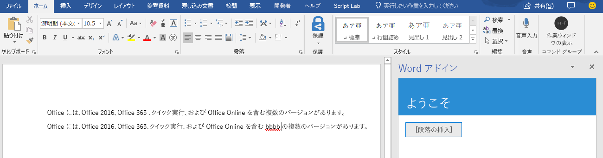
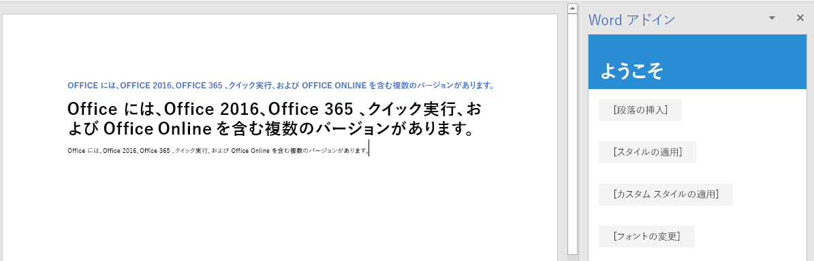

# <a name="tutorial-create-a-word-task-pane-add-in"></a>チュートリアル: Word 作業ウィンドウ アドインを作成する

このチュートリアルでは、以下の Word 作業ウィンドウ アドインを作成します。

> [!div class="checklist"]
> * テキスト範囲の挿入
> * テキストの書式設定
> * テキストの置換とさまざまな位置へのテキストの挿入
> * 画像、HTML、テーブルの挿入
> * コンテンツ コントロールの作成と更新 

## <a name="prerequisites"></a>前提条件

このチュートリアルを使用するには、以下のバージョンがインストールされている必要があります。 

- Word 2016、バージョン 1711 (ビルド 8730.1000 クイック実行) 以降。 このバージョンを入手するには、Office Insider への参加が必要になることがあります。 詳細については、「[Office Insider](https://products.office.com/office-insider?tab=tab-1)」を参照してください。

- [ノード](https://nodejs.org/en/) 

- [Git バッシュ](https://git-scm.com/downloads) (または別の Git クライアント)

## <a name="create-your-add-in-project"></a>アドイン プロジェクトの作成

このチュートリアルの基礎として使用する Word アドイン プロジェクトを作成するには、次の手順を実行します。

1. 「[Word アドインのチュートリアル](https://github.com/OfficeDev/Word-Add-in-Tutorial)」で、GitHub リポジトリを複製します。

2. Git bash ウィンドウまたは Node.JS 対応のシステム プロンプトを開いて、プロジェクトの **Start** フォルダーに移動します。

3. `npm install` コマンドを実行して、package.json ファイルに一覧表示されているツールとライブラリをインストールします。 

4. 「[自己署名証明書を信頼されたルート証明書として追加する](https://github.com/OfficeDev/generator-office/blob/master/src/docs/ssl.md)」の手順を実行して、開発用コンピューターのオペレーティング システムの証明書を信頼します。

## <a name="insert-a-range-of-text"></a>テキスト範囲の挿入

チュートリアルのこの手順では、ユーザーが現在使用している Word のバージョンをアドインがサポートしているかどうかをプログラムによってテストし、ドキュメントに段落を挿入します。

### <a name="code-the-add-in"></a>アドインのコードを作成する

1. コード エディターでプロジェクトを開きます。

2. index.html ファイルを開きます。

3. `TODO1` を次のマークアップに置き換えます。

    ```html
    <button class="ms-Button" id="insert-paragraph">Insert Paragraph</button>
    ```

4. app.js ファイルを開きます。

5. `TODO1` を次のコードに置き換えます。 このコードでは、ユーザーの Word のバージョンが、このチュートリアルのすべての段階で使用するすべての API を含んでいる Word.js のバージョンをサポートしているかどうかを調べます。 運用アドインでは、未サポートの API を呼び出す UI を非表示または無効化する条件ブロックの本体を使用してください。 これにより、ユーザーは、自分が使用している Word のバージョンでサポートされているアドインの部分を使用できるようになります。

    ```js
    if (!Office.context.requirements.isSetSupported('WordApi', 1.3)) {
        console.log('Sorry. The tutorial add-in uses Word.js APIs that are not available in your version of Office.');
    }
    ```

6. `TODO2` を次のコードに置き換えます。

    ```js
    $('#insert-paragraph').click(insertParagraph);
    ```

7. `TODO3` を次のコードに置き換えます。 注:

   - Word.js のビジネス ロジックは、`Word.run` に渡される関数に追加されます。 このロジックは、すぐには実行されません。 その代わりに、保留中のコマンドのキューに追加されます。

   - `context.sync` メソッドは、キューに登録されたすべてのコマンドを、実行するために Word に送信します。

   - `Word.run` の後に `catch` ブロックを続けます。 これは、どのような場合にも当てはまるベスト プラクティスです。 

    ```js
    function insertParagraph() {
        Word.run(function (context) {

            // TODO4: Queue commands to insert a paragraph into the document.

            return context.sync();
        })
        .catch(function (error) {
            console.log("Error: " + error);
            if (error instanceof OfficeExtension.Error) {
                console.log("Debug info: " + JSON.stringify(error.debugInfo));
            }
        });
    }
    ```

8. `TODO4` を次のコードに置き換えます。 次の点に注意してください。

   - `insertParagraph` メソッドの最初のパラメーターは、新しい段落のテキストです。

   - 2 番目のパラメーターは、段落を挿入する本文内の場所です。 親オブジェクトが本文の場合、段落の挿入に使用できるその他のオプションには、End と Replace があります。

    ```js
    var docBody = context.document.body;
    docBody.insertParagraph("Office has several versions, including Office 2016, Office 365 Click-to-Run, and Office Online.",
                            "Start");
    ```

### <a name="test-the-add-in"></a>アドインをテストする

1. Git bash ウィンドウまたは Node.JS 対応のシステム プロンプトを開いて、プロジェクトの **Start** フォルダーに移動します。

2. `npm run build` コマンドを実行し、Office アドインを実行できるすべてのホストでサポートされている以前のバージョンの JavaScript に ES6 ソース コードをトランスパイルします。

3. `npm start` コマンドを実行して、ローカルホストで稼働する Web サーバーを起動します。

4. 次のいずれかの方法を使用して、アドインをサイドロードします。

    - Windows: [Windows で Office アドインをサイドロードする](../testing/create-a-network-shared-folder-catalog-for-task-pane-and-content-add-ins.md)

    - Word Online: [Office Online で Office アドインをサイドロードする](../testing/sideload-office-add-ins-for-testing.md#sideload-an-office-add-in-in-office-online)

    - iPad および Mac: [iPad と Mac で Office アドインをサイドロードする](../testing/sideload-an-office-add-in-on-ipad-and-mac.md)

5. Word の **[ホーム]** メニューで、**[作業ウィンドウの表示]** を選択します。

6. 作業ウィンドウで、**[段落の挿入]** を選択します。

7. 段落に変更を加えます。

8. **[段落の挿入]** をもう一度選択します。 `insertParagraph` メソッドはドキュメントの本文の開始位置に挿入を行うため、新しい段落は前の段落より上に追加されます。

    

## <a name="format-text"></a>テキストの書式設定

チュートリアルのこの手順では、組み込みのスタイルをテキストに適用したり、カスタム スタイルをテキストに適用したり、テキストのフォントを変更したりします。

### <a name="apply-a-built-in-style-to-text"></a>組み込みのスタイルをテキストに適用する

1. コード エディターでプロジェクトを開きます。 

2. index.html ファイルを開きます。

3. `insert-paragraph` ボタンを格納している `div` の直下に、次のマークアップを追加します。

    ```html
    <div class="padding">            
        <button class="ms-Button" id="apply-style">Apply Style</button>            
    </div>
    ```

4. app.js ファイルを開きます。

5. `insert-paragraph` ボタンにクリック ハンドラーを割り当てる行の直下に、次のコードを追加します。

    ```js
    $('#apply-style').click(applyStyle);
    ```

6. `insertParagraph` 関数の直下に、次の関数を追加します。

    ```js
    function applyStyle() {
        Word.run(function (context) {
            
            // TODO1: Queue commands to style text.

            return context.sync();
        })
        .catch(function (error) {
            console.log("Error: " + error);
            if (error instanceof OfficeExtension.Error) {
                console.log("Debug info: " + JSON.stringify(error.debugInfo));
            }
        });
    }
    ``` 

7. `TODO1` を次のコードに置き換えます。 このコードではスタイルを段落に適用していますが、スタイルはテキストの範囲にも適用できます。

    ```js
    var firstParagraph = context.document.body.paragraphs.getFirst();
    firstParagraph.styleBuiltIn = Word.Style.intenseReference;
    ``` 

### <a name="apply-a-custom-style-to-text"></a>カスタム スタイルをテキストに適用する

1. index.html ファイルを開きます。

2. `apply-style` ボタンを格納している `div` の下に、次のマークアップを追加します。

    ```html
    <div class="padding">            
        <button class="ms-Button" id="apply-custom-style">Apply Custom Style</button>            
    </div>
    ```

3. app.js ファイルを開きます。

4. `apply-style` ボタンにクリック ハンドラーを割り当てる行の下に、次のコードを追加します。

    ```js
    $('#apply-custom-style').click(applyCustomStyle);
    ```

5. `applyStyle` 関数の下に、次の関数を追加します。

    ```js
    function applyCustomStyle() {
        Word.run(function (context) {
            
            // TODO1: Queue commands to apply the custom style.

            return context.sync();
        })
        .catch(function (error) {
            console.log("Error: " + error);
            if (error instanceof OfficeExtension.Error) {
                console.log("Debug info: " + JSON.stringify(error.debugInfo));
            }
        });
    }
    ``` 

6. `TODO1` を次のコードに置き換えます。 このコードでは、まだ存在していないカスタム スタイルを適用しています。 「**アドインをテストする**」の手順で [MyCustomStyle](#test-the-add-in) という名前のスタイルを作成します。

    ```js
    var lastParagraph = context.document.body.paragraphs.getLast();
    lastParagraph.style = "MyCustomStyle";
    ``` 

### <a name="change-the-font-of-text"></a>テキストのフォントを変更する

1. index.html ファイルを開きます。

2. `apply-custom-style` ボタンを格納している `div` の下に、次のマークアップを追加します。

    ```html
    <div class="padding">            
        <button class="ms-Button" id="change-font">Change Font</button>            
    </div>
    ```

3. app.js ファイルを開きます。

4. `apply-custom-style` ボタンにクリック ハンドラーを割り当てる行の下に、次のコードを追加します。

    ```js
    $('#change-font').click(changeFont);
    ```

5. `applyCustomStyle` 関数の下に、次の関数を追加します。

    ```js
    function changeFont() {
        Word.run(function (context) {
            
            // TODO1: Queue commands to apply a different font.

            return context.sync();
        })
        .catch(function (error) {
            console.log("Error: " + error);
            if (error instanceof OfficeExtension.Error) {
                console.log("Debug info: " + JSON.stringify(error.debugInfo));
            }
        });
    }
    ``` 

6. `TODO1` を次のコードに置き換えます。 このコードでは、`ParagraphCollection.getFirst` メソッドにチェーンされた `Paragraph.getNext` メソッドを使用して 2 番目の段落への参照を取得することに注意してください。

    ```js
    var secondParagraph = context.document.body.paragraphs.getFirst().getNext();
    secondParagraph.font.set({
            name: "Courier New",
            bold: true,
            size: 18
        });
    ``` 

### <a name="test-the-add-in"></a>アドインをテストする

1. Git bash ウィンドウまたは Node.JS 対応のシステム プロンプトが前の段階のチュートリアルから開いたままになっている場合は、Ctrl + C を 2 回入力して実行中の Web サーバーを停止します。 それ以外の場合は、Git bash ウィンドウまたは Node.JS 対応のシステム プロンプトを開いて、プロジェクトの **Start** フォルダーに移動します。

     > [!NOTE]
     > ブラウザー同期サーバーは、app.js ファイルなどのファイルに変更を加えるたびに作業ウィンドウ内のアドインを再読み込みしますが、JavaScript を再トランスパイルしないため、ビルド コマンドを繰り返し実行して、app.js への変更を反映させる必要があります。 これを行うには、プロンプトが表示されてビルド コマンドを入力できるようにするため、サーバー プロセスを強制終了する必要があります。 ビルド後に、サーバーを再起動します。 次の数ステップで、このプロセスを実行します。

2. `npm run build` コマンドを実行し、Office アドインを実行できるすべてのホストでサポートされている以前のバージョンの JavaScript に ES6 ソース コードをトランスパイルします。

3. `npm start` コマンドを実行して、ローカルホストで稼働する Web サーバーを起動します。   

4. 作業ウィンドウを再読み込みするために、そのウィンドウを閉じて、**[ホーム]** メニューの **[作業ウィンドウの表示]** を選択してアドインを再度開きます。

5. ドキュメントに 3 つ以上の段落があることを確認してください。 **[段落の挿入]** を 3 回選択できます。 *ドキュメントの最後に空白の段落がないことを慎重にチェックしてください。空白の段落がある場合は、それを削除します。*

6. Word で、MyCustomStyle という名前のカスタム スタイルを作成します。 このスタイルには、必要に応じて任意の書式を設定できます。

7. **[スタイルの適用]** ボタンを選択します。 最初の段落は、組み込みのスタイルである **Intense Reference** でスタイル設定されます。

8. **[カスタム スタイルの適用]** ボタンを選択します。 最後の段落は、選択したカスタム スタイルでスタイル設定されます。 (何も起こらないように思える場合、最後の段落が空白である可能性があります。 その場合は、最後の段落にテキストを追加します)。

9. **[フォントの変更]** ボタンを選択します。 2 番目の段落のフォントを、18 ポイントで太字の Courier New に変更します。

    

## <a name="replace-text-and-insert-text"></a>テキストの置換と挿入

このチュートリアルの手順では、選択したテキスト範囲の内側や外側にテキストを追加したり、選択した範囲のテキストを置き換えたりします。

### <a name="add-text-inside-a-range"></a>範囲内にテキストを追加する

1. コード エディターでプロジェクトを開きます。

2. index.html ファイルを開きます。

3. `change-font` ボタンを格納している `div` の下に、次のマークアップを追加します。

    ```html
    <div class="padding">
        <button class="ms-Button" id="insert-text-into-range">Insert Abbreviation</button>
    </div>
    ```

4. app.js ファイルを開きます。

5. `change-font` ボタンにクリック ハンドラーを割り当てる行の下に、次のコードを追加します。

    ```js
    $('#insert-text-into-range').click(insertTextIntoRange);
    ```

6. `changeFont` 関数の下に、次の関数を追加します。

    ```js
    function insertTextIntoRange() {
        Word.run(function (context) {

            // TODO1: Queue commands to insert text into a selected range.

            // TODO2: Load the text of the range and sync so that the
            //        current range text can be read.

            // TODO3: Queue commands to repeat the text of the original
            //        range at the end of the document.

            return context.sync();
        })
        .catch(function (error) {
            console.log("Error: " + error);
            if (error instanceof OfficeExtension.Error) {
                console.log("Debug info: " + JSON.stringify(error.debugInfo));
            }
        });
    }
    ``` 

7. `TODO1` を次のコードに置き換えます。 次の点に注意してください。

   - このメソッドの目的は、テキストが Click-to-Run という範囲の末尾に (C2R) という省略形を挿入することです。 これは前提を単純化し、文字列は存在しており、ユーザーがその文字列を選択したものとしています。

   - `Range.insertText` メソッドの最初のパラメーターは、`Range` オブジェクトに挿入する文字列です。

   - 2 番目のパラメーターは、範囲内のどの位置にテキストを挿入するかを指定します。 End の他に、Start、Before、After、Replace が選択できます。 

   - End と After の違いは、End が既存の範囲の内部の末尾に新しいテキストを挿入するのに対し、After の場合は文字列の入った新しい範囲を作成し、既存の範囲の後にその新しい範囲が挿入されることです。 同様に、Start はテキストを既存の範囲の内部の先頭に挿入しますが、Before の場合は新しい範囲を挿入します。 Replace は、既存の範囲のテキストを最初のパラメーターで指定した文字列に置き換えます。

   - チュートリアルの前の段階で示したとおり、ボディ オブジェクトの insert* メソッドに Before オプションや After オプションはありません。 これは、文書の本文の外部にはコンテンツを挿入できないからです。

    ```js
    var doc = context.document;
    var originalRange = doc.getSelection();
    originalRange.insertText(" (C2R)", "End");
    ```

8. `TODO2` はスキップし、次のセクションに移ります。 `TODO3` を次のコードに置き換えます。 このコードは、このチュートリアルの最初の段階で作成したコードに似ていますが、文書の先頭ではなく末尾に新しい段落を挿入する点が異なります。 この新しい段落で、新しいテキストが元の範囲の一部になっていることが示されます。

    ```js
    doc.body.insertParagraph("Original range: " + originalRange.text, "End");
    ```

### <a name="add-code-to-fetch-document-properties-into-the-task-panes-script-objects"></a>ドキュメントのプロパティを作業ウィンドウのスクリプト オブジェクトにフェッチするコードを追加する

このチュートリアルのシリーズで前述したすべての関数では、Office ドキュメントへの*書き込み*コマンドをキューに登録していました。 各関数は、キューに登録されたコマンドを実行対象のドキュメントに送信する `context.sync()` メソッドを呼び出すことで終了しています。 ただし、最後の手順で追加したコードでは、`originalRange.text` プロパティを呼び出しています。このことが、これまでに作成した関数とは大きく異なります。`originalRange` オブジェクトは、この作業ウィンドウのスクリプトに存在する単なるプロキシ オブジェクトなので、 ドキュメントの指定された範囲にある実際のテキストを認識できません。そのため、その `text` プロパティでは実際の値が保持できません。 まず、ドキュメントからその範囲のテキスト値をフェッチする必要があり、その値を使用して `originalRange.text` の値を設定します。 そのようにした場合にのみ、例外がスローされることなく `originalRange.text` を呼び出せるようになります。 このフェッチ処理には、3 つの手順があります。

   1. コードで読み取る必要があるプロパティをロードする (つまりフェッチする) コマンドをキューに登録します。

   2. コンテキスト オブジェクトの `sync` メソッドを呼び出します。このメソッドは、キューに登録されたコマンドを実行対象のドキュメントに送信して、要求された情報を返します。

   3. `sync` メソッドは非同期であるため、フェッチされたプロパティをコードで呼び出す前に、そのメソッドが完了していることを確認します。

こうした手順は、コードで Office ドキュメントから情報を*読み取る*必要がある場合には必ず完了する必要があります。

1. `TODO2` を次のコードに置き換えます。
  
    ```js
    originalRange.load("text");
    return context.sync()
        .then(function() {

                // TODO4: Move the doc.body.insertParagraph line here.

            }
        )
            // TODO5: Move the final call of context.sync here and ensure
            //        that it does not run until the insertParagraph has
            //        been queued.
    ```

2. 分岐していない同一のコード パスに 2 つの `return` ステートメントを含めることはできないため、`Word.run` の最後にある最終行の `return context.sync();` を削除します。新しい最後の `context.sync` は、このチュートリアルの後の方で追加します。

3. `doc.body.insertParagraph` 行を切り取り、`TODO4` の代わりに貼り付けます。

4. `TODO5` を次のコードに置き換えます。次の点に注意してください。

   - `sync` メソッドを `then` 関数に渡すことで、`insertParagraph` ロジックがキューに登録されるまで、そのメソッドが実行されないようにします。

   - `then` メソッドは渡されたどんな関数でも呼び出します。`sync` が 2 回呼び出されないように、context.sync の末尾の "()" は省略します。

    ```js
    .then(context.sync);
    ```

作業が完了すると、関数の全体は次のようになります。

```js
function insertTextIntoRange() {
    Word.run(function (context) {

        var doc = context.document;
        var originalRange = doc.getSelection();
        originalRange.insertText(" (C2R)", "End");

        originalRange.load("text");
        return context.sync()
            .then(function() {
                        doc.body.insertParagraph("Current text of original range: " + originalRange.text,
                                                "End");
                }
            )
            .then(context.sync);
    })
    .catch(function (error) {
        console.log("Error: " + error);
        if (error instanceof OfficeExtension.Error) {
            console.log("Debug info: " + JSON.stringify(error.debugInfo));
        }
    });
}
```

### <a name="add-text-between-ranges"></a>範囲間にテキストを追加する

1. index.html ファイルを開きます。

2. `insert-text-into-range` ボタンを格納している `div` の下に、次のマークアップを追加します。

    ```html
    <div class="padding">
        <button class="ms-Button" id="insert-text-outside-range">Add Version Info</button>
    </div>
    ```

3. app.js ファイルを開きます。

4. `insert-text-into-range` ボタンにクリック ハンドラーを割り当てる行の下に、次のコードを追加します。

    ```js
    $('#insert-text-outside-range').click(insertTextBeforeRange);
    ```

5. `insertTextIntoRange` 関数の下に、次の関数を追加します。

    ```js
    function insertTextBeforeRange() {
        Word.run(function (context) {

            // TODO1: Queue commands to insert a new range before the
            //        selected range.

            // TODO2: Load the text of the original range and sync so that the
            //        range text can be read and inserted.

        })
        .catch(function (error) {
            console.log("Error: " + error);
            if (error instanceof OfficeExtension.Error) {
                console.log("Debug info: " + JSON.stringify(error.debugInfo));
            }
        });
    }
    ```

6. `TODO1` を次のコードに置き換えます。 次の点に注意してください。

   - このメソッドの目的は、Office 365 というテキストから成る範囲の前に Office 2019 というテキストの範囲を追加することです。 これは前提を単純化し、文字列は存在しており、ユーザーがその文字列を選択したものとしています。

   - `Range.insertText` メソッドの最初のパラメーターは、追加する文字列です。

   - 2 番目のパラメーターは、範囲内のどの位置にテキストを挿入するかを指定します。 位置オプションの詳細については、`insertTextIntoRange` 関数に関する上記の説明を参照してください。

    ```js
    var doc = context.document;
    var originalRange = doc.getSelection();
    originalRange.insertText("Office 2019, ", "Before");
    ```

7. `TODO2` を次のコードに置き換えます。

     ```js
    originalRange.load("text");
    return context.sync()
        .then(function() {

                // TODO3: Queue commands to insert the original range as a
                //        paragraph at the end of the document.

                }
            )

            // TODO4: Make a final call of context.sync here and ensure
            //        that it does not run until the insertParagraph has
            //        been queued.
    ```

8. `TODO3` を次のコードに置き換えます。 この新しい段落で、新しいテキストが元の選択範囲の一部になって***いない***ことが示されます。 元の範囲には、依然として選択時のテキストのみが含まれています。

    ```js
    doc.body.insertParagraph("Current text of original range: " + originalRange.text,
                             "End");
    ```

9. `TODO4` を次のコードに置き換えます。

    ```js
    .then(context.sync);
    ```

### <a name="replace-the-text-of-a-range"></a>範囲のテキストを置き換える

1. index.html ファイルを開きます。

2. `insert-text-outside-range` ボタンを格納している `div` の下に、次のマークアップを追加します。

    ```html
    <div class="padding">
        <button class="ms-Button" id="replace-text">Change Quantity Term</button>
    </div>
    ```

3. app.js ファイルを開きます。

4. `insert-text-outside-range` ボタンにクリック ハンドラーを割り当てる行の下に、次のコードを追加します。

    ```js
    $('#replace-text').click(replaceText);
    ```

5. `insertTextBeforeRange` 関数の下に、次の関数を追加します。

    ```js
    function replaceText() {
        Word.run(function (context) {

            // TODO1: Queue commands to replace the text.

            return context.sync();
        })
        .catch(function (error) {
            console.log("Error: " + error);
            if (error instanceof OfficeExtension.Error) {
                console.log("Debug info: " + JSON.stringify(error.debugInfo));
            }
        });
    }
    ```

6. `TODO1` を次のコードに置き換えます。 このメソッドの目的は、several という文字列を many という文字列で置き換えることです。 これは前提を単純化し、文字列は存在しており、ユーザーがその文字列を選択したものとしています。

    ```js
    var doc = context.document;
    var originalRange = doc.getSelection();
    originalRange.insertText("many", "Replace");
    ```

### <a name="test-the-add-in"></a>アドインをテストする

1. Git bash ウィンドウまたは Node.JS 対応のシステム プロンプトが前の段階のチュートリアルから開いたままになっている場合は、Ctrl-C を 2 回入力して実行中の Web サーバーを停止します。 それ以外の場合は、Git bash ウィンドウまたは Node.JS 対応のシステム プロンプトを開いて、プロジェクトの **Start** フォルダーに移動します。

     > [!NOTE]
     > ブラウザー同期サーバーは、app.js ファイルなどのファイルに変更を加えるたびに作業ウィンドウ内のアドインを再読み込みしますが、JavaScript を再トランスパイルしないため、ビルド コマンドを繰り返し実行して、app.js への変更を反映させる必要があります。 これを行うには、プロンプトが表示されてビルド コマンドを入力できるようにするため、サーバー プロセスを強制終了する必要があります。 ビルド後に、サーバーを再起動します。 次の数ステップで、このプロセスを実行します。

2. `npm run build` コマンドを実行し、Office アドインを実行できるすべてのホストでサポートされている以前のバージョンの JavaScript に ES6 ソース コードをトランスパイルします。

3. `npm start` コマンドを実行して、ローカルホストで稼働する Web サーバーを起動します。

4. 作業ウィンドウを再読み込みするために、そのウィンドウを閉じて、**[ホーム]** メニューの **[作業ウィンドウの表示]** を選択してアドインを再度開きます。

5. 作業ウィンドウで **[段落の挿入]** を選択し、文書の先頭に段落があることを確認します。

6. 一部のテキストを選択します。 Click-to-Run という語句を選択します。 *選択範囲の前後にあるスペースは含めないように注意してください。*

7. **[ラベル (短縮形) の挿入]** ボタンを選択します。 (C2R) が追加されることに注意してください。 また、この新しい文字列は既存の範囲に追加されるため、文書の下部に新しい段落が追加され、拡張されたテキスト全体が含まれていることに注意してください。

8. 一部のテキストを選択します。 Office 365 という語句を選択します。 *選択範囲の前後にあるスペースは含めないように注意してください。*

9. **[バージョン情報の追加]** ボタンを選択します。 Office 2019 が、Office 2016 と Office 365 の間に挿入されることに注意してください。 また、この新しい文字列は元の範囲に追加されるのではなく新しい範囲になるため、文書の下部に新しい段落が追加されるものの、その段落には最初に選択したテキストのみが含まれることに注意してください。

10. 一部のテキストを選択します。 several という語句を選択します。 *選択範囲の前後にあるスペースは含めないように注意してください。*

11. **[数量の用語の変更]** ボタンを選択します。 選択したテキストが many に置き換えられることに注意してください。

    

## <a name="insert-images-html-and-tables"></a>画像、HTML、テーブルの挿入

チュートリアルのこの手順では、ドキュメントに画像、HTML、テーブルを挿入する方法について説明します。

### <a name="insert-an-image"></a>画像の挿入

1. コード エディターでプロジェクトを開きます。

2. index.html ファイルを開きます。

3. `replace-text` ボタンを格納している `div` の下に、次のマークアップを追加します。

    ```html
    <div class="padding">
        <button class="ms-Button" id="insert-image">Insert Image</button>
    </div>
    ```

4. app.js ファイルを開きます。

5. ファイルの先頭近くにある、use-strict 行のすぐ下に次の行を追加します。 この行は、別のファイルから変数をインポートします。 この変数は、画像をエンコードする Base 64 文字列です。 エンコードされた文字列を表示するには、プロジェクトのルートにある base64Image.js ファイルを開きます。

    ```js
    import { base64Image } from "./base64Image";
    ```

6. `replace-text` ボタンにクリック ハンドラーを割り当てる行の下に、次のコードを追加します。

    ```js
    $('#insert-image').click(insertImage);
    ```

7. `replaceText` 関数の下に、次の関数を追加します。

    ```js
    function insertImage() {
        Word.run(function (context) {

            // TODO1: Queue commands to insert an image.

            return context.sync();
        })
        .catch(function (error) {
            console.log("Error: " + error);
            if (error instanceof OfficeExtension.Error) {
                console.log("Debug info: " + JSON.stringify(error.debugInfo));
            }
        });
    }
    ```

8. `TODO1` を次のコードに置き換えます。 この行により、Base 64 でエンコードされた画像がドキュメントの末尾に挿入されることに注意してください。 (`Paragraph` オブジェクトにも `insertInlinePictureFromBase64` メソッドやその他の `insert*` メソッドがあります。 例については、次の insertHTML セクションを参照してください)。

    ```js
    context.document.body.insertInlinePictureFromBase64(base64Image, "End");
    ```

### <a name="insert-html"></a>HTML の挿入

1. index.html ファイルを開きます。

2. `insert-image` ボタンを格納している `div` の下に、次のマークアップを追加します。

    ```html
    <div class="padding">
        <button class="ms-Button" id="insert-html">Insert HTML</button>
    </div>
    ```

3. app.js ファイルを開きます。

4. `insert-image` ボタンにクリック ハンドラーを割り当てる行の下に、次のコードを追加します。

    ```js
    $('#insert-html').click(insertHTML);
    ```

5. `insertImage` 関数の下に、次の関数を追加します。

    ```js
    function insertHTML() {
        Word.run(function (context) {

            // TODO1: Queue commands to insert a string of HTML.

            return context.sync();
        })
        .catch(function (error) {
            console.log("Error: " + error);
            if (error instanceof OfficeExtension.Error) {
                console.log("Debug info: " + JSON.stringify(error.debugInfo));
            }
        });
    }
    ```

6. `TODO1` を次のコードに置き換えます。 次の点に注意してください。

   - 最初の行は、ドキュメントの末尾に空白の段落を追加します。 

   - 2 行目は、その段落の末尾に HTML の文字列を挿入します。具体的には、Verdana フォントで書式設定された段落と、Word 文書の既定のスタイルが設定された段落の 2 つの段落が挿入されます。 (`insertImage` メソッドで説明したように、`context.document.body` オブジェクトにも `insert*` メソッドがあります)。

    ```js
    var blankParagraph = context.document.body.paragraphs.getLast().insertParagraph("", "After");
    blankParagraph.insertHtml('<p style="font-family: verdana;">Inserted HTML.</p><p>Another paragraph</p>', "End");
    ```

### <a name="insert-a-table"></a>テーブルの挿入

1. index.html ファイルを開きます。

2. `insert-html` ボタンを格納している `div` の下に、次のマークアップを追加します。

    ```html
    <div class="padding">
        <button class="ms-Button" id="insert-table">Insert Table</button>
    </div>
    ```

3. app.js ファイルを開きます。

4. `insert-html` ボタンにクリック ハンドラーを割り当てる行の下に、次のコードを追加します。

    ```js
    $('#insert-table').click(insertTable);
    ```

5. `insertHTML` 関数の下に、次の関数を追加します。

    ```js
    function insertTable() {
        Word.run(function (context) {

            // TODO1: Queue commands to get a reference to the paragraph
            //        that will proceed the table.

            // TODO2: Queue commands to create a table and populate it with data.

            return context.sync();
        })
        .catch(function (error) {
            console.log("Error: " + error);
            if (error instanceof OfficeExtension.Error) {
                console.log("Debug info: " + JSON.stringify(error.debugInfo));
            }
        });
    }
    ```

6. `TODO1` を次のコードに置き換えます。 この行は `ParagraphCollection.getFirst` メソッドを使用して最初の段落への参照を取得し、次に `Paragraph.getNext` メソッドを使用して 2 番目の段落への参照を取得することに注意してください。

    ```js
    var secondParagraph = context.document.body.paragraphs.getFirst().getNext();
    ```

7. `TODO2` を次のコードに置き換えます。 次の点に注意してください。

   - `insertTable` メソッドの最初の 2 つのパラメーターは、行と列の数を指定します。

   - 3 番目のパラメーターは、テーブルを挿入する場所を指定します (この例では段落の後)。

   - 4 番目のパラメーターは、テーブルのセルの値を設定する 2 次元配列です。

   - このテーブルには既定のスタイルがそのまま設定されますが、`insertTable` メソッドがさまざまなメンバーを持つ `Table` オブジェクトを返し、その一部がテーブルのスタイル設定に使用されます。

    ```js
    var tableData = [
            ["Name", "ID", "Birth City"],
            ["Bob", "434", "Chicago"],
            ["Sue", "719", "Havana"],
        ];
    secondParagraph.insertTable(3, 3, "After", tableData);
    ```

### <a name="test-the-add-in"></a>アドインをテストする

1. Git bash ウィンドウまたは Node.JS 対応のシステム プロンプトが前の段階のチュートリアルから開いたままになっている場合は、Ctrl + C を 2 回入力して実行中の Web サーバーを停止します。 それ以外の場合は、Git bash ウィンドウまたは Node.JS 対応のシステム プロンプトを開いて、プロジェクトの **Start** フォルダーに移動します。

     > [!NOTE]
     > ブラウザー同期サーバーは、app.js ファイルなどのファイルに変更を加えるたびに作業ウィンドウ内のアドインを再読み込みしますが、JavaScript を再トランスパイルしないため、ビルド コマンドを繰り返し実行して、app.js への変更を反映させる必要があります。 これを行うには、プロンプトが表示されてビルド コマンドを入力できるようにするため、サーバー プロセスを強制終了する必要があります。 ビルド後に、サーバーを再起動します。 次の数ステップで、このプロセスを実行します。

2. `npm run build` コマンドを実行し、Office アドインを実行できるすべてのホストでサポートされている以前のバージョンの JavaScript に ES6 ソース コードをトランスパイルします。

3. `npm start` コマンドを実行して、ローカルホストで稼働する Web サーバーを起動します。

4. 作業ウィンドウを再読み込みするために、そのウィンドウを閉じて、**[ホーム]** メニューの **[作業ウィンドウの表示]** を選択してアドインを再度開きます。

5. 作業ウィンドウで **[段落の挿入]** を少なくとも 3 回選択し、ドキュメントに段落がいくつかあることを確認します。

6. **[画像の挿入]** ボタンをクリックし、ドキュメントの末尾に画像が挿入されることに注意してください。

7. **[HTML の挿入]** ボタンをクリックし、ドキュメントの末尾に 2 つの段落が挿入され、最初の段落に Verdana フォントが設定されていることに注意してください。

8. **[テーブルの挿入]** ボタンをクリックし、2 番目の段落の後にテーブルが挿入されることに注意してください。

    

## <a name="create-and-update-content-controls"></a>コンテンツ コントロールの作成と更新

このチュートリアルの手順では、ドキュメント内にリッチ テキスト コンテンツ コントロールを作成する方法、およびそのコントロールにコンテンツを挿入したり置き換えたりする方法について説明します。

> [!NOTE]
> UI から Word 文書に追加できるコンテンツ コントロールにはいくつかの種類がありますが、Word.js では現在のところリッチ テキスト コンテンツ コントロールのみがサポートされています。
>
> チュートリアルのこの手順を開始する前に、Word UI からリッチ テキスト コンテンツ コントロールを作成して操作し、コントロールとそのプロパティを理解しておくことをお勧めします。 詳細については、「[ユーザーが Word 上で記入または印刷するフォームを作成する](https://support.office.com/article/create-forms-that-users-complete-or-print-in-word-040c5cc1-e309-445b-94ac-542f732c8c8b)」を参照してください。

### <a name="create-a-content-control"></a>コンテンツ コントロールを作成する

1. コード エディターでプロジェクトを開きます。

2. index.html ファイルを開きます。

3. `replace-text` ボタンを格納している `div` の下に、次のマークアップを追加します。

    ```html
    <div class="padding">
        <button class="ms-Button" id="create-content-control">Create Content Control</button>
    </div>
    ```

4. app.js ファイルを開きます。

5. `insert-table` ボタンにクリック ハンドラーを割り当てる行の下に、次のコードを追加します。

    ```js
    $('#create-content-control').click(createContentControl);
    ```

6. `insertTable` 関数の下に、次の関数を追加します。

    ```js
    function createContentControl() {
        Word.run(function (context) {

            // TODO1: Queue commands to create a content control.

            return context.sync();
        })
        .catch(function (error) {
            console.log("Error: " + error);
            if (error instanceof OfficeExtension.Error) {
                console.log("Debug info: " + JSON.stringify(error.debugInfo));
            }
        });
    }
    ```

7. `TODO1` を次のコードに置き換えます。 次の点に注意してください。

   - このコードの目的は、コンテンツ コントロール内の Office 365 という語句をラップすることです。 これは前提を単純化し、文字列は存在しており、ユーザーがその文字列を選択したものとしています。

   - `ContentControl.title` プロパティは、コンテンツ コントロールの表示タイトルを指定します。

   - `ContentControl.tag` プロパティは、`ContentControlCollection.getByTag` メソッドを使用してコンテンツ コントロールへの参照を取得するために使用できるタグを指定します。これを後述する関数で使用します。

   - `ContentControl.appearance` プロパティは、コントロールの外観を指定します。 Tags という値を使用すると、コントロールは開始タグと終了タグにラップされます。開始タグには、コンテンツ コントロールのタイトルが設定されます。 その他の値として、BoundingBox と None が使用できます。

   - `ContentControl.color` プロパティは、タグまたは境界ボックスの境界線の色を指定します。

    ```js
    var serviceNameRange = context.document.getSelection();
    var serviceNameContentControl = serviceNameRange.insertContentControl();
    serviceNameContentControl.title = "Service Name";
    serviceNameContentControl.tag = "serviceName";
    serviceNameContentControl.appearance = "Tags";
    serviceNameContentControl.color = "blue";
    ```

### <a name="replace-the-content-of-the-content-control"></a>コンテンツ コントロールのコンテンツを置き換える

1. index.html ファイルを開きます。

2. `create-content-control` ボタンを格納している `div` の下に、次のマークアップを追加します。

    ```html
    <div class="padding">
        <button class="ms-Button" id="replace-content-in-control">Rename Service</button>
    </div>
    ```

3. app.js ファイルを開きます。

4. `create-content-control` ボタンにクリック ハンドラーを割り当てる行の下に、次のコードを追加します。

    ```js
    $('#replace-content-in-control').click(replaceContentInControl);
    ```

5. `createContentControl` 関数の下に、次の関数を追加します。

    ```js
    function replaceContentInControl() {
        Word.run(function (context) {

            // TODO1: Queue commands to replace the text in the Service Name
            //        content control.

            return context.sync();
        })
        .catch(function (error) {
            console.log("Error: " + error);
            if (error instanceof OfficeExtension.Error) {
                console.log("Debug info: " + JSON.stringify(error.debugInfo));
            }
        });
    }
    ```

6. `TODO1` を次のコードに置き換えます。次の点に注意してください。

    - `ContentControlCollection.getByTag` メソッドによって、指定されたタグのすべてのコンテンツ コントロールの `ContentControlCollection` が返されます。 `getFirst` を使用して、目的のコントロールの参照を取得します。

    ```js
    var serviceNameContentControl = context.document.contentControls.getByTag("serviceName").getFirst();
    serviceNameContentControl.insertText("Fabrikam Online Productivity Suite", "Replace");
    ```

### <a name="test-the-add-in"></a>アドインをテストする

1. Git bash ウィンドウまたは Node.JS 対応のシステム プロンプトが前の段階のチュートリアルから開いたままになっている場合は、Ctrl + C を 2 回入力して実行中の Web サーバーを停止します。 それ以外の場合は、Git bash ウィンドウまたは Node.JS 対応のシステム プロンプトを開いて、プロジェクトの **Start** フォルダーに移動します。

     > [!NOTE]
     > ブラウザー同期サーバーは、app.js ファイルなどのファイルに変更を加えるたびに作業ウィンドウ内のアドインを再読み込みしますが、JavaScript を再トランスパイルしないため、ビルド コマンドを繰り返し実行して、app.js への変更を反映させる必要があります。 これを行うには、プロンプトが表示されてビルド コマンドを入力できるようにするため、サーバー プロセスを強制終了する必要があります。 ビルド後に、サーバーを再起動します。 次の数ステップで、このプロセスを実行します。

2. `npm run build` コマンドを実行し、Office アドインを実行できるすべてのホストでサポートされている以前のバージョンの JavaScript に ES6 ソース コードをトランスパイルします。

3. `npm start` コマンドを実行して、ローカルホストで稼働する Web サーバーを起動します。

4. 作業ウィンドウを再読み込みするために、そのウィンドウを閉じて、**[ホーム]** メニューの **[作業ウィンドウの表示]** を選択してアドインを再度開きます。

5. 作業ウィンドウで **[段落の挿入]** を選択し、文書の先頭が Office 365 となっている段落があることを確認します。

6. 追加した段落の Office 365 という語句を選択し、**[コンテンツ コントロールの作成]** ボタンを選択します。 Service Name というラベルが付いたタグで語句がラップされていることに注意してください。

7. **[サービス名の変更]** ボタンを選択し、コンテンツ コントロールのテキストが Fabrikam Online Productivity Suite に変わることに注意してください。

    

## <a name="next-steps"></a>次の手順

このチュートリアルでは、テキスト、画像、Word 文書の他のコンテンツを挿入および置換する Word 作業ウィンドウ アドインを作成しました。 Word アドインの構築に関する詳細については、次の記事にお進みください。

> [!div class="nextstepaction"]
> [Word アドインの概要](../word/word-add-ins-programming-overview.md)
