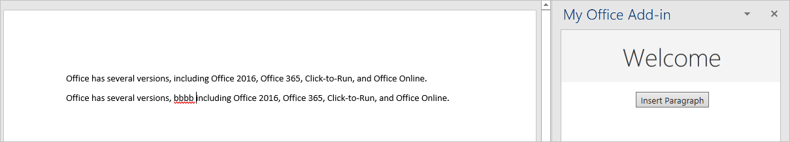
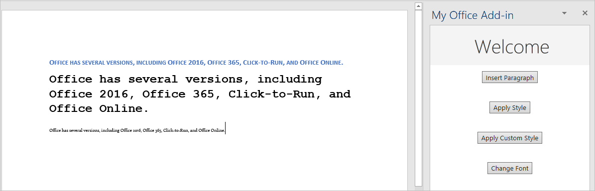

# <a name="tutorial-create-a-word-task-pane-add-in"></a>チュートリアル: Word 作業ウィンドウ アドインを作成する

このチュートリアルでは、以下の Word 作業ウィンドウ アドインを作成します。

> [!div class="checklist"]
> * テキスト範囲の挿入
> * テキストの書式設定
> * テキストの置換とさまざまな位置へのテキストの挿入
> * 画像、HTML、テーブルの挿入
> * コンテンツ コントロールの作成と更新 

> [!TIP]
> [最初の Word 作業ウィンドウアドイン](../quickstarts/word-quickstart.md)のクイックスタートを既に完了していて、そのプロジェクトをこのチュートリアルの開始点として使用する場合は、「[テキストの範囲を挿入](#insert-a-range-of-text)する」セクションに直接移動して、このチュートリアルを開始してください。

## <a name="prerequisites"></a>前提条件

[!include[Yeoman generator prerequisites](../includes/quickstart-yo-prerequisites.md)]

## <a name="create-your-add-in-project"></a>アドイン プロジェクトの作成

[!include[Yeoman generator create project guidance](../includes/yo-office-command-guidance.md)]

- **Choose a project type: (プロジェクトの種類を選択)** `Office Add-in Task Pane project`
- **Choose a script type: (スクリプトの種類を選択)** `Javascript`
- **What would you want to name your add-in?: (アドインの名前を何にしますか)** `My Office Add-in`
- **Which Office client application would you like to support?: (どの Office クライアント アプリケーションをサポートしますか)** `Word`


ウィザードを完了すると、ジェネレーターによってプロジェクトが作成されて、サポートしているノード コンポーネントがインストールされます。

[!include[Yeoman generator next steps](../includes/yo-office-next-steps.md)]

## <a name="insert-a-range-of-text"></a>テキスト範囲の挿入

チュートリアルのこの手順では、ユーザーが現在使用している Word のバージョンをアドインがサポートしているかどうかをプログラムによってテストし、ドキュメントに段落を挿入します。

### <a name="code-the-add-in"></a>アドインのコードを作成する

1. コード エディターでプロジェクトを開きます。

2. ファイル **./src/taskpane/taskpane.html**を開きます。 このファイルには、作業ウィンドウの HTML マークアップが含まれています。

3. `<main>`要素を検索し、開始`<main>`タグと終了`</main>`タグの後に表示されるすべての行を削除します。

4. 開始`<main>`タグの直後に、次のマークアップを追加します。

    ```html
    <button class="ms-Button" id="insert-paragraph">Insert Paragraph</button><br/><br/>
    ```

5. /Src/taskpane/taskpane.js を開きます **。** このファイルには、作業ウィンドウと Office ホストアプリケーション間の対話を容易にする Office JavaScript API コードが含まれています。

6. 次の手順を実行`run`して、 `run()`ボタンと関数へのすべての参照を削除します。

    - 行`document.getElementById("run").onclick = run;`を見つけて、削除します。

    - 関数全体`run()`を見つけて、削除します。

7. `Office.onReady`メソッド呼び出し内で、行`if (info.host === Office.HostType.Word) {`を見つけて、その行の直後に次のコードを追加します。 注意:

    - このコードの最初の部分では、ユーザーの Word のバージョンが、このチュートリアルのすべてのステージで使用されるすべての Api を含むバージョンの Word .js をサポートしているかどうかを判断します。 運用アドインでは、未サポートの API を呼び出す UI を非表示または無効化する条件ブロックの本体を使用してください。 これにより、ユーザーは、自分が使用している Word のバージョンでサポートされているアドインの部分を使用できるようになります。
    - このコードの2番目の部分では、 `insert-paragraph`ボタンのイベントハンドラーを追加します。

    ```js
    // Determine if the user's version of Office supports all the Office.js APIs that are used in the tutorial.
    if (!Office.context.requirements.isSetSupported('WordApi', '1.3')) {
        console.log('Sorry. The tutorial add-in uses Word.js APIs that are not available in your version of Office.');
    }

    // Assign event handlers and other initialization logic.
    document.getElementById("insert-paragraph").onclick = insertParagraph;
    ```

8. ファイルの末尾に次の関数を追加します。 注意:

   - Word.js のビジネス ロジックは、`Word.run` に渡される関数に追加されます。 このロジックは、すぐには実行されません。 その代わりに、保留中のコマンドのキューに追加されます。

   - `context.sync` メソッドは、キューに登録されたすべてのコマンドを、実行するために Word に送信します。

   - `Word.run` の後に `catch` ブロックを続けます。 これは、どのような場合にも当てはまるベスト プラクティスです。 

    ```js
    function insertParagraph() {
        Word.run(function (context) {

            // TODO1: Queue commands to insert a paragraph into the document.

            return context.sync();
        })
        .catch(function (error) {
            console.log("Error: " + error);
            if (error instanceof OfficeExtension.Error) {
                console.log("Debug info: " + JSON.stringify(error.debugInfo));
            }
        });
    }
    ```

9. `insertParagraph()`関数内で、を`TODO1`次のコードに置き換えます。 注意:

   - `insertParagraph` メソッドの最初のパラメーターは、新しい段落のテキストです。

   - 2 番目のパラメーターは、段落を挿入する本文内の場所です。 親オブジェクトが本文の場合、段落の挿入に使用できるその他のオプションには、End と Replace があります。

    ```js
    var docBody = context.document.body;
    docBody.insertParagraph("Office has several versions, including Office 2016, Office 365 Click-to-Run, and Office on the web.",
                            "Start");
    ```

10. プロジェクトに加えたすべての変更を保存したことを確認します。

### <a name="test-the-add-in"></a>アドインをテストする

1. 以下の手順を実行し、ローカル Web サーバーを起動してアドインのサイドロードを行います。

    > [!NOTE]
    > 開発の最中でも、OfficeアドインはHTTPではなくHTTPSを使用する必要があります。 次のいずれかのコマンドを実行した後に証明書をインストールするように求められた場合は、Yeoman ジェネレーターによって提供される証明書をインストールするプロンプトを受け入れます。

    > [!TIP]
    > Mac でアドインをテストしている場合は、先に進む前に、プロジェクトのルートディレクトリで次のコマンドを実行します。 このコマンドを実行すると、ローカル Web サーバーが起動します。
    >
    > ```command&nbsp;line
    > npm run dev-server
    > ```

    - Word でアドインをテストするには、プロジェクトのルート ディレクトリから次のコマンドを実行します。 ローカル Web サーバーが (まだ実行されていない場合) 起動し、アドインが読み込まれた Word が開きます。

        ```command&nbsp;line
        npm start
        ```

    - Web 上の Word でアドインをテストするには、プロジェクトのルートディレクトリで次のコマンドを実行します。 このコマンドを実行すると、ローカル Web サーバーが起動します (まだ実行されていない場合)。

        ```command&nbsp;line
        npm run start:web
        ```

        アドインを使用するには、Word on the web で新しいドキュメントを開き、「[Office on the web で Office アドインをサイドロードする](../testing/sideload-office-add-ins-for-testing.md#sideload-an-office-add-in-in-office-on-the-web)」の手順に従ってアドインをサイドロードします。

2. Word で [**ホーム**] タブを選択し、リボンの [**作業ウィンドウの表示**] ボタンをクリックして、アドインの作業ウィンドウを開きます。

    ![[作業ウィンドウの表示] ボタンが強調表示されている Word アプリケーションのスクリーンショット](../images/word-quickstart-addin-2b.png)

3. 作業ウィンドウで、[段落の**挿入**] ボタンをクリックします。

4. 段落に変更を加えます。

5. [**段落の挿入**] ボタンをもう一度選択します。 `insertParagraph`メソッドが文書の本文の先頭に挿入されているため、新しい段落は前の段落の上に表示されることに注意してください。

    

## <a name="format-text"></a>テキストの書式設定

チュートリアルのこの手順では、組み込みのスタイルをテキストに適用したり、カスタム スタイルをテキストに適用したり、テキストのフォントを変更したりします。

### <a name="apply-a-built-in-style-to-text"></a>組み込みのスタイルをテキストに適用する

1. ファイル **./src/taskpane/taskpane.html**を開きます。

2. `insert-paragraph`ボタンの`<button>`要素を見つけ、その行の後に次のマークアップを追加します。

    ```html
    <button class="ms-Button" id="apply-style">Apply Style</button><br/><br/>
    ```

3. /Src/taskpane/taskpane.js を開きます **。**

4. `Office.onReady`メソッド呼び出し内で、 `insert-paragraph`ボタンにクリックハンドラーを割り当てる行を見つけ、その行の後に次のコードを追加します。

    ```js
    document.getElementById("apply-style").onclick = applyStyle;
    ```

5. ファイルの末尾に次の関数を追加します。

    ```js
    function applyStyle() {
        Word.run(function (context) {
            
            // TODO1: Queue commands to style text.

            return context.sync();
        })
        .catch(function (error) {
            console.log("Error: " + error);
            if (error instanceof OfficeExtension.Error) {
                console.log("Debug info: " + JSON.stringify(error.debugInfo));
            }
        });
    }
    ``` 

6. `applyStyle()`関数内で、を`TODO1`次のコードに置き換えます。 このコードではスタイルを段落に適用していますが、スタイルはテキストの範囲にも適用できます。

    ```js
    var firstParagraph = context.document.body.paragraphs.getFirst();
    firstParagraph.styleBuiltIn = Word.Style.intenseReference;
    ``` 

### <a name="apply-a-custom-style-to-text"></a>カスタム スタイルをテキストに適用する

1. ファイル **./src/taskpane/taskpane.html**を開きます。

2. `apply-style`ボタンの`<button>`要素を見つけ、その行の後に次のマークアップを追加します。 

    ```html
    <button class="ms-Button" id="apply-custom-style">Apply Custom Style</button><br/><br/>
    ```

3. /Src/taskpane/taskpane.js を開きます **。**

4. `Office.onReady`メソッド呼び出し内で、 `apply-style`ボタンにクリックハンドラーを割り当てる行を見つけ、その行の後に次のコードを追加します。

    ```js
    document.getElementById("apply-custom-style").onclick = applyCustomStyle;
    ```

5. ファイルの末尾に次の関数を追加します。

    ```js
    function applyCustomStyle() {
        Word.run(function (context) {
            
            // TODO1: Queue commands to apply the custom style.

            return context.sync();
        })
        .catch(function (error) {
            console.log("Error: " + error);
            if (error instanceof OfficeExtension.Error) {
                console.log("Debug info: " + JSON.stringify(error.debugInfo));
            }
        });
    }
    ``` 

6. `applyCustomStyle()`関数内で、を`TODO1`次のコードに置き換えます。 このコードでは、まだ存在していないカスタム スタイルを適用しています。 「[アドインをテストする](#test-the-add-in-1)」の手順で **MyCustomStyle** という名前のスタイルを作成します。

    ```js
    var lastParagraph = context.document.body.paragraphs.getLast();
    lastParagraph.style = "MyCustomStyle";
    ``` 

7. プロジェクトに加えたすべての変更を保存したことを確認します。

### <a name="change-the-font-of-text"></a>テキストのフォントを変更する

1. ファイル **./src/taskpane/taskpane.html**を開きます。

2. `apply-custom-style`ボタンの`<button>`要素を見つけ、その行の後に次のマークアップを追加します。 

    ```html
    <button class="ms-Button" id="change-font">Change Font</button><br/><br/>
    ```

3. /Src/taskpane/taskpane.js を開きます **。**

4. `Office.onReady`メソッド呼び出し内で、 `apply-custom-style`ボタンにクリックハンドラーを割り当てる行を見つけ、その行の後に次のコードを追加します。

    ```js
    document.getElementById("change-font").onclick = changeFont;
    ```

5. ファイルの末尾に次の関数を追加します。

    ```js
    function changeFont() {
        Word.run(function (context) {
            
            // TODO1: Queue commands to apply a different font.

            return context.sync();
        })
        .catch(function (error) {
            console.log("Error: " + error);
            if (error instanceof OfficeExtension.Error) {
                console.log("Debug info: " + JSON.stringify(error.debugInfo));
            }
        });
    }
    ``` 

6. `changeFont()`関数内で、を`TODO1`次のコードに置き換えます。 このコードでは、`Paragraph.getNext` メソッドにチェーンされた `ParagraphCollection.getFirst` メソッドを使用して 2 番目の段落への参照を取得することに注意してください。

    ```js
    var secondParagraph = context.document.body.paragraphs.getFirst().getNext();
    secondParagraph.font.set({
            name: "Courier New",
            bold: true,
            size: 18
        });
    ``` 

7. プロジェクトに加えたすべての変更を保存したことを確認します。

### <a name="test-the-add-in"></a>アドインをテストする

1. [!include[Start server and sideload add-in instructions](../includes/tutorial-word-start-server.md)]

2. アドイン作業ウィンドウが Word でまだ開かれていない場合は、[**ホーム**] タブに移動し、リボンの [作業ウィンドウの**表示**] ボタンをクリックして開きます。

3. ドキュメントに 3 つ以上の段落があることを確認してください。 [**段落の挿入**] ボタンを3回選択できます。 *ドキュメントの最後に空白の段落がないことを慎重にチェックしてください。空白の段落がある場合は、それを削除します。*

4. Word で、"MyCustomStyle" という名前の[ユーザー設定のスタイル](https://support.office.com/article/Customize-or-create-new-styles-d38d6e47-f6fc-48eb-a607-1eb120dec563)を作成します。 このスタイルには、必要に応じて任意の書式を設定できます。

5. **[スタイルの適用]** ボタンを選択します。 最初の段落は、組み込みのスタイルである **Intense Reference** でスタイル設定されます。

6. **[カスタム スタイルの適用]** ボタンを選択します。 最後の段落は、選択したカスタム スタイルでスタイル設定されます。 (何も起こらないように思える場合、最後の段落が空白である可能性があります。 その場合は、最後の段落にテキストを追加します)。

7. **[フォントの変更]** ボタンを選択します。 2 番目の段落のフォントを、18 ポイントで太字の Courier New に変更します。

    

## <a name="replace-text-and-insert-text"></a>テキストの置換と挿入

このチュートリアルの手順では、選択したテキスト範囲の内側や外側にテキストを追加したり、選択した範囲のテキストを置き換えたりします。

### <a name="add-text-inside-a-range"></a>範囲内にテキストを追加する

1. ファイル **./src/taskpane/taskpane.html**を開きます。

2. `change-font`ボタンの`<button>`要素を見つけ、その行の後に次のマークアップを追加します。 

    ```html
    <button class="ms-Button" id="insert-text-into-range">Insert Abbreviation</button><br/><br/>
    ```

3. /Src/taskpane/taskpane.js を開きます **。**

4. `Office.onReady`メソッド呼び出し内で、 `change-font`ボタンにクリックハンドラーを割り当てる行を見つけ、その行の後に次のコードを追加します。

    ```js
    document.getElementById("insert-text-into-range").onclick = insertTextIntoRange;
    ```
5. ファイルの末尾に次の関数を追加します。

    ```js
    function insertTextIntoRange() {
        Word.run(function (context) {

            // TODO1: Queue commands to insert text into a selected range.

            // TODO2: Load the text of the range and sync so that the
            //        current range text can be read.

            // TODO3: Queue commands to repeat the text of the original
            //        range at the end of the document.

            return context.sync();
        })
        .catch(function (error) {
            console.log("Error: " + error);
            if (error instanceof OfficeExtension.Error) {
                console.log("Debug info: " + JSON.stringify(error.debugInfo));
            }
        });
    }
    ``` 

6. `insertTextIntoRange()`関数内で、を`TODO1`次のコードに置き換えます。 次の点に注意してください。

   - このメソッドの目的は、テキストが Click-to-Run という範囲の末尾に (C2R) という省略形を挿入することです。 これは前提を単純化し、文字列は存在しており、ユーザーがその文字列を選択したものとしています。

   - `Range.insertText` メソッドの最初のパラメーターは、`Range` オブジェクトに挿入する文字列です。

   - 2 番目のパラメーターは、範囲内のどの位置にテキストを挿入するかを指定します。 End の他に、Start、Before、After、Replace が選択できます。 

   - End と After の違いは、End が既存の範囲の内部の末尾に新しいテキストを挿入するのに対し、After の場合は文字列の入った新しい範囲を作成し、既存の範囲の後にその新しい範囲が挿入されることです。 同様に、Start はテキストを既存の範囲の内部の先頭に挿入しますが、Before の場合は新しい範囲を挿入します。 Replace は、既存の範囲のテキストを最初のパラメーターで指定した文字列に置き換えます。

   - チュートリアルの前の段階で示したとおり、ボディ オブジェクトの insert* メソッドに Before オプションや After オプションはありません。 これは、文書の本文の外部にはコンテンツを挿入できないからです。

    ```js
    var doc = context.document;
    var originalRange = doc.getSelection();
    originalRange.insertText(" (C2R)", "End");
    ```

7. `TODO2` はスキップし、次のセクションに移ります。 `insertTextIntoRange()`関数内で、を`TODO3`次のコードに置き換えます。 このコードは、このチュートリアルの最初の段階で作成したコードに似ていますが、文書の先頭ではなく末尾に新しい段落を挿入する点が異なります。 この新しい段落で、新しいテキストが元の範囲の一部になっていることが示されます。

    ```js
    doc.body.insertParagraph("Original range: " + originalRange.text, "End");
    ```

### <a name="add-code-to-fetch-document-properties-into-the-task-panes-script-objects"></a>ドキュメントのプロパティを作業ウィンドウのスクリプト オブジェクトにフェッチするコードを追加する

この一連のチュートリアルの以前のすべての関数では、Office ドキュメントに*書き込む*コマンドをキューに登録しました。 各関数は、キューに登録されたコマンドを実行対象のドキュメントに送信する `context.sync()` メソッドを呼び出すことで終了しています。 ただし、最後の手順で追加したコードでは、`originalRange.text` プロパティを呼び出しています。このことが、これまでに作成した関数とは大きく異なります。`originalRange` オブジェクトは、この作業ウィンドウのスクリプトに存在する単なるプロキシ オブジェクトなので、 ドキュメントの指定された範囲にある実際のテキストを認識できません。そのため、その `text` プロパティでは実際の値が保持できません。 まず、ドキュメントからその範囲のテキスト値をフェッチする必要があり、その値を使用して `originalRange.text` の値を設定します。 そのようにした場合にのみ、例外がスローされることなく `originalRange.text` を呼び出せるようになります。 このフェッチ処理には、3 つの手順があります。

   1. コードで読み取る必要があるプロパティをロードする (つまりフェッチする) コマンドをキューに登録します。

   2. コンテキスト オブジェクトの `sync` メソッドを呼び出します。このメソッドは、キューに登録されたコマンドを実行対象のドキュメントに送信して、要求された情報を返します。

   3. `sync` メソッドは非同期であるため、フェッチされたプロパティをコードで呼び出す前に、そのメソッドが完了していることを確認します。

こうした手順は、コードで Office ドキュメントから情報を*読み取る*必要がある場合には必ず完了する必要があります。

1. `insertTextIntoRange()`関数内で、を`TODO2`次のコードに置き換えます。
  
    ```js
    originalRange.load("text");
    return context.sync()
        .then(function() {
            // TODO4: Move the doc.body.insertParagraph line here.
        })
        // TODO5: Move the final call of context.sync here and ensure
        //        that it does not run until the insertParagraph has
        //        been queued.
    ```

2. 分岐していない同一のコード パスに 2 つの `return` ステートメントを含めることはできないため、`Word.run` の最後にある最終行の `return context.sync();` を削除します。新しい最後の `context.sync` は、このチュートリアルの後の方で追加します。

3. `doc.body.insertParagraph` 行を切り取り、`TODO4` の代わりに貼り付けます。

4. `TODO5` を次のコードに置き換えます。次の点に注意してください。

   - `sync` メソッドを `then` 関数に渡すことで、`insertParagraph` ロジックがキューに登録されるまで、そのメソッドが実行されないようにします。

   - `then`メソッドは、渡された関数を呼び出しますが、2回`sync`呼び出さないようにするため、"()" をコンテキストの終わりから省略します。

    ```js
    .then(context.sync);
    ```

作業が完了すると、関数の全体は次のようになります。

```js
function insertTextIntoRange() {
    Word.run(function (context) {

        var doc = context.document;
        var originalRange = doc.getSelection();
        originalRange.insertText(" (C2R)", "End");

        originalRange.load("text");
        return context.sync()
            .then(function() {
                doc.body.insertParagraph("Current text of original range: " + originalRange.text, "End");
            })
            .then(context.sync);
    })
    .catch(function (error) {
        console.log("Error: " + error);
        if (error instanceof OfficeExtension.Error) {
            console.log("Debug info: " + JSON.stringify(error.debugInfo));
        }
    });
}
```

### <a name="add-text-between-ranges"></a>範囲間にテキストを追加する

1. ファイル **./src/taskpane/taskpane.html**を開きます。

2. `insert-text-into-range`ボタンの`<button>`要素を見つけ、その行の後に次のマークアップを追加します。 

    ```html
    <button class="ms-Button" id="insert-text-outside-range">Add Version Info</button><br/><br/>
    ```

3. /Src/taskpane/taskpane.js を開きます **。**

4. `Office.onReady`メソッド呼び出し内で、 `insert-text-into-range`ボタンにクリックハンドラーを割り当てる行を見つけ、その行の後に次のコードを追加します。

    ```js
    document.getElementById("insert-text-outside-range").onclick = insertTextBeforeRange;
    ```

5. ファイルの末尾に次の関数を追加します。

    ```js
    function insertTextBeforeRange() {
        Word.run(function (context) {

            // TODO1: Queue commands to insert a new range before the
            //        selected range.

            // TODO2: Load the text of the original range and sync so that the
            //        range text can be read and inserted.

        })
        .catch(function (error) {
            console.log("Error: " + error);
            if (error instanceof OfficeExtension.Error) {
                console.log("Debug info: " + JSON.stringify(error.debugInfo));
            }
        });
    }
    ```

6. `insertTextBeforeRange()`関数内で、を`TODO1`次のコードに置き換えます。 次の点に注意してください。

   - このメソッドの目的は、Office 365 というテキストから成る範囲の前に Office 2019 というテキストの範囲を追加することです。 これは前提を単純化し、文字列は存在しており、ユーザーがその文字列を選択したものとしています。

   - `Range.insertText` メソッドの最初のパラメーターは、追加する文字列です。

   - 2 番目のパラメーターは、範囲内のどの位置にテキストを挿入するかを指定します。 位置オプションの詳細については、`insertTextIntoRange` 関数に関する上記の説明を参照してください。

    ```js
    var doc = context.document;
    var originalRange = doc.getSelection();
    originalRange.insertText("Office 2019, ", "Before");
    ```

7. `insertTextBeforeRange()`関数内で、を`TODO2`次のコードに置き換えます。

     ```js
    originalRange.load("text");
    return context.sync()
        .then(function() {
            // TODO3: Queue commands to insert the original range as a
            //        paragraph at the end of the document.
        })
        // TODO4: Make a final call of context.sync here and ensure
        //        that it does not run until the insertParagraph has
        //        been queued.
    ```

8. `TODO3` を次のコードに置き換えます。 この新しい段落で、新しいテキストが元の選択範囲の一部になって***いない***ことが示されます。 元の範囲には、依然として選択時のテキストのみが含まれています。

    ```js
    doc.body.insertParagraph("Current text of original range: " + originalRange.text, "End");
    ```

9. `TODO4` を次のコードに置き換えます。

    ```js
    .then(context.sync);
    ```

### <a name="replace-the-text-of-a-range"></a>範囲のテキストを置き換える

1. ファイル **./src/taskpane/taskpane.html**を開きます。

2. `insert-text-outside-range`ボタンの`<button>`要素を見つけ、その行の後に次のマークアップを追加します。 

    ```html
    <button class="ms-Button" id="replace-text">Change Quantity Term</button><br/><br/>
    ```

3. /Src/taskpane/taskpane.js を開きます **。**

4. `Office.onReady`メソッド呼び出し内で、 `insert-text-outside-range`ボタンにクリックハンドラーを割り当てる行を見つけ、その行の後に次のコードを追加します。

    ```js
    document.getElementById("replace-text").onclick = replaceText;
    ```

5. ファイルの末尾に次の関数を追加します。

    ```js
    function replaceText() {
        Word.run(function (context) {

            // TODO1: Queue commands to replace the text.

            return context.sync();
        })
        .catch(function (error) {
            console.log("Error: " + error);
            if (error instanceof OfficeExtension.Error) {
                console.log("Debug info: " + JSON.stringify(error.debugInfo));
            }
        });
    }
    ```

6. `replaceText()`関数内で、を`TODO1`次のコードに置き換えます。 このメソッドの目的は、several という文字列を many という文字列で置き換えることです。 これは前提を単純化し、文字列は存在しており、ユーザーがその文字列を選択したものとしています。

    ```js
    var doc = context.document;
    var originalRange = doc.getSelection();
    originalRange.insertText("many", "Replace");
    ```

7. プロジェクトに加えたすべての変更を保存したことを確認します。

### <a name="test-the-add-in"></a>アドインをテストする

1. [!include[Start server and sideload add-in instructions](../includes/tutorial-word-start-server.md)]

2. アドイン作業ウィンドウが Word でまだ開かれていない場合は、[**ホーム**] タブに移動し、リボンの [作業ウィンドウの**表示**] ボタンをクリックして開きます。

3. 作業ウィンドウで、[段落の**挿入**] ボタンをクリックして、文書の先頭に段落があることを確認します。

4. ドキュメント内で、[クイック実行] という語句を選択します。 *選択範囲には、前のスペースまたはコンマの後ろを含めないように注意してください。*

5. **[ラベル (短縮形) の挿入]** ボタンを選択します。 (C2R) が追加されることに注意してください。 また、この新しい文字列は既存の範囲に追加されるため、文書の下部に新しい段落が追加され、拡張されたテキスト全体が含まれていることに注意してください。

6. ドキュメント内で、"Office 365" という語句を選択します。 *選択範囲の前後にあるスペースは含めないように注意してください。*

7. **[バージョン情報の追加]** ボタンを選択します。 Office 2019 が、Office 2016 と Office 365 の間に挿入されることに注意してください。 また、この新しい文字列は元の範囲に追加されるのではなく新しい範囲になるため、文書の下部に新しい段落が追加されるものの、その段落には最初に選択したテキストのみが含まれることに注意してください。

8. ドキュメント内で、単語 "複数" を選択します。 *選択範囲の前後にあるスペースは含めないように注意してください。*

9. **[数量の用語の変更]** ボタンを選択します。 選択したテキストが many に置き換えられることに注意してください。

    

## <a name="insert-images-html-and-tables"></a>画像、HTML、テーブルの挿入

チュートリアルのこの手順では、ドキュメントに画像、HTML、テーブルを挿入する方法について説明します。

### <a name="define-an-image"></a>イメージを定義する

このチュートリアルの次の部分でドキュメントに挿入する画像を定義するには、次の手順を実行します。 

1. プロジェクトのルートで、 **base64Image**という名前の新しいファイルを作成します。

2. **Base64Image**ファイルを開き、次のコードを追加して、画像を表す base64 でエンコードされた文字列を指定します。

    ```js
    export const base64Image =
        "iVBORw0KGgoAAAANSUhEUgAAAZAAAAEFCAIAAABCdiZrAAAACXBIWXMAAAsSAAALEgHS3X78AAAgAElEQVR42u2dzW9bV3rGn0w5wLBTRpSACAUDmDRowGoj1DdAtBA6suksZmtmV3Qj+i8w3XUB00X3pv8CX68Gswq96aKLhI5bCKiM+gpVphIa1qQBcQbyQB/hTJlpOHUXlyEvD885vLxfvCSfH7KIJVuUrnif+z7nPOd933v37h0IIWQe+BEvASGEgkUIIRQsQggFixBCKFiEEELBIoRQsAghhIJFCCEULEIIBYsQQihYhBBCwSKEULAIIYSCRQghFCxCCAWLEEIoWIQQQsEihCwQCV4CEgDdJvYM9C77f9x8gkyJV4UEznvs6U780rvAfgGdg5EPbr9CyuC1IbSEJGa8KopqBWC/gI7Fa0MoWCROHJZw/lxWdl3isITeBa8QoWCRyOk2JR9sVdF+qvwnnQPsF+SaRSEjFCwSCr0LNCo4rYkfb5s4vj/h33YOcFSWy59VlIsgIRQs4pHTGvYMdJvIjupOx5Ir0Tjtp5K/mTKwXsSLq2hUWG0R93CXkKg9oL0+ldnFpil+yhlicIM06NA2cXgXySyuV7Fe5CUnFCziyQO2qmg8BIDUDWzVkUiPfHY8xOCGT77EWkH84FEZbx4DwOotbJpI5nj5CQWLTOMBj8votuRqBWDP8KJWABIr2KpLwlmHpeHKff4BsmXxFQmhYBGlBxzoy7YlljxOcfFAMottS6JH+4Xh69IhEgoWcesBNdVQozLyd7whrdrGbSYdIqFgkQkecMD4epO9QB4I46v4tmbtGeK3QYdIKFhE7gEHjO/odSzsfRzkS1+5h42q+MGOhf2CuPlIh0goWPSAogcccP2RJHI1riP+kQYdVK9Fh0goWPSAk82a5xCDG4zPJaWTxnvSIVKwKFj0gEq1go8QgxtUQQeNZtEhUrB4FZbaA9pIN+98hhhcatbNpqRoGgRKpdAhUrDIMnpAjVrpJSNApK/uRi7pEClYZIk84KDGGQ+IBhhicMP6HRg1ycedgVI6RELBWl4POFCr8VWkszpe3o76G1aFs9ws+dMhUrDIInvAAeMB0ZBCDG6QBh2kgVI6RAoWWRYPqBEI9+oQEtKgg3sNpUOkYJGF8oADxgOioUauXKIKOkxV99EhUrDIgnhAG+mCUQQhBpeaNb4JgOn3AegQKVhkvj2gjXRLLrIQgxtUQYdpNYsOkYJF5tUDarQg4hCDS1u3VZd83IOw0iFSsMiceUCNWp3WYH0Wx59R6ls9W1c6RAoWmQ8PaCNdz55hiMEN4zsDNhMDpXSIFCwylx5Qo1a9C3yVi69a2ajCWZ43NOkQKVgkph5wwHi+KQ4hBs9SC9+RMTpEChaJlwfUFylWEafP5uMKqIIOPv0sHSIFi8TFAzpLiXxF/KCbdetEGutFUSa6TXQsdKypv42UgZQhfrWOhbO6q8nPqqCD/zU4OkQKFpm9B7SRbrTpQwzJHNaL/VHyiRVF0dfC2xpOzMnKlUgjW0amhGRW/ZM+w5sqzuqTNWtb9nKBZDLoEClYZGYe0EYaENWHGDaquHJv5CPnz/H9BToWkjmsFkTdOX0GS22p1ovYNEdUr9vCeR3dJlIG1gojn2o8RKPiRX+D0iw6RAoWmYEH1HioiQZqq47VW32dalUlfi1fQf7ByEdUQpMpYfOJ46UPcFweKaMSaWyaWL8z/Mibxzgqe3G4CC6pT4dIwSLReUCNWrkJMdjh8sMSuk1d3bReRGb3hy97iS/SEl+5bQ0LqM4B9gvytaptC6kbwz++vD3ZG0r3EBDoWUg6RAoWCd0D9isXReTKTYghZbhdUB/UYlKV2TSHitZtYc9QrqynDGy/GnGg+4XJr779ShJ0gNdAKR3i/PAjXoIZe8BGBS+uhqtWAF4VXUWu3G//ORVqdVRiEumhWgFoVHT7gB1LnFAvVaJxYZJ+qx/XRuo1X0+RFqzPsF/QFZuEgrVcHnDPCGbFylnajN/wAZZvqgpR8IzO275tTvjnwl/4sORC6C9xWJLoYCKNrbpuR3Jazp/jxdUJmksoWIvvAfcLsD4LuLfn5hOJhWlVQ+lyNZDFcUl636GY5/Wpyzo3FRZ+WBeT1JhpGDVlIMMbjYfYM3Ba4zuXgkUPGBD5B5Kl6LaJ4/uh/CCDTvDjW4ROxZm4gj7+dwZLY24067AkF9OtesCaRYdIwaIHDIzMrmSzv2NNTgl4fLlSXw6kjs8pWN+FfHu3n8p/xpSBjWrwL0eHSMGiB/TL+h1JnNJ+xTA6MawXh1ogTWA5S5tvLS8vMVUM6s1j+TKZEASjQ6RgkVl6wH4pcUM+zs8qBq9WyRyMGozP+5J0/nzygrrLSkS4ONPmNg/vyr1npiQG9+kQKVhkBh5woFbSI8EuQwxTkS1j2xoG0zsHeBVcRsl/RNMqyoMOG9WRjAUd4pzD4GhoHjDsMIEqchX48JuUgU1zJN+kSa4D+LnjHfXiqqsa5Oejb8J/fs9TAZjFtiXXvgADpaqXZsqUFRY94NRq1agErFbrRWzVR9Tq9JlOrWy75NncCf982n+o+sYCDJTSIVKw6AGnRhoQbZsBv3S+MlyxAtC7xPF9WMUJDsi5M+gmVCWImpvolorOgXzTMPBAKR0iBWvuPWB4+4CiWj2Rz3MPcFSXHb90NmawbWDLRVZAc2pHZTkF2fWDKugQRqBUCvcQKVj0gI6qRxYQtfvGBIUdvHQ2fmk/VR7fk5Q5jr+2fmfygrpTfM+fu8qa6lEFHcIIlGocolWkQwwcLrr79oBB9YRxg7SDXbDjJISue71LHJWnrno+vRh+BX2Xq2QOO6+Hf3TTXsYl43M3BhVcZFNjEyvIluUNvAgrrIX1gINqRdpvM0C1EhatbBvowaM5neOVe/L2VX176/jip88CUysAhyV5SRheoFRSfV+i8RAvckH+XKyweBW8qNWeEelEP1XkKqgQw3j/T3sxyNv6cSKNm02xA3KrOvLV1gq4Xh1u3vUusWcE7KESK7jZlHvSoDqU+q/4CAUrItomWtUoRvup1KpRCWxb0KiNqFXvcoreWCem/ETh+ILRYJnvJzlxz+7wrt/l9qkuHUIIrMk9bxaZEjIltl2mYMWDjoVWFae1sAouVeQq2LUYZwfRaVG1dR9PnKp802EpxG016TCOgZsOb6tk9RayZVZVFKwZ8cff4b/+Htcq8sd17wInJt5UA17SUqnVWR0vbwf5Qn5KgPO6bo0mU0K2LJetbgtvqjgxQw8uqcbthDH+OrHS/5FV19MuJDXreoSCFQC9C3yxisQK8hVk1dteZ3W8qQY2VFm68OF/emj0JNJ430DKQCKN3gU6FrrNSHf9VaMrfI68F+ynXVKpkhxndRyX0TlQzv4hFKyABWuwMPGROWxiJ6kdmmibaJu+7gTpPRbgDbZsqJa9/T8AMrvIlnWx/m4Tx+XhY4yC5RXGGjzRbeHlbd3ZsWQO+Qp2mth84nFtSBoQtS0M1cobqqCD50BpMovrj/Dpufyk1OBXZueKgyq6KVjEI/bZMf3ef6aErTp2XiOzO8UtIe0gCuCoHMWm5MLWyJfK09HTdihdvwPjc+w0J4wvbJv4KhfF2VIKFnHLm8f4KjfhkF0yh00TN5vYfDJ510wVED0qR7ENv7Sa5SZQmlhB/gF2XsOoTdj+O6tjz8Dh3Tlbaow9XMNy/153rGGpDIJ+Ycv5bm6bcvVR5YaiPFCy8Kze6s+4lj4VpIHS1Vv4sORqa09YrlL5fa5hUbBmLFiDd/am6Soi0LtAqzqyMK9Sq8BDDEQVdMBooDSxgvXihAV14RfqxgBSsChYcREsmyv3lImtcU5raJs4q8sjV/MYYpgLrj9SxlP2C/iuiXxFl1EYL4GPym5/TRQsCla8BKu/3qFNbLl80a9yVKuwUIWzpmKQrnIPBcsrXHQPT+AucXzf70l91lahclT2FV7tNmEV8fI2t24jI8FLEC52Ysv9wpbAtsVLGNNy2+VyFWGFNX+4SWyReYHpKgrWUuAmsUXiDNNVFKwlsxJBLGyRGVh7LlfFAq5hzeTd38LL27oo0ABpnykSIG766pzWYH3GS0XBWvJr7yLg8/1F1J18l4pk1lXuhM1CaQkJPixN/jvXKlGMpVpa8u7CvSkj9CGshIIV92e7tOvxeBXGhGFIrN6Sp0ZPa5Jw1gfsdEzBWmbGb4BuE4d3JbdKtszHe1jllZTjsqTBvJtymFCwFpbxpRM77nAouzE+MnnBAiazK++rYZ9Flw4B4mODgrWkpG5I1nHf1gDFrPa1gveRNmQc+5jnOL2L/pDqzoGkN2mArpChFgrWXD3eS5J38KDJjDTKsMG4aaDlrXTjr1UdJkJPTLpCChYBAEmzSqcHOX8utySZXV65AFBFGezjgULBS1dIwaIflDzehVVeVZHFiIN/VFEGoZtVtyUxbtwrpGDNDb3fheUH26Z4Nq3bkhw5TKT9dtciqihDtynpWN2mK6RgzS/vemH5QemU9kZF0tohX6Er8VteSTmWPQlOZa5w4gwRQsFaZD/Yu5APLOhdyvs6XOfqu+faVhFlOKsrfwXjRRZHzFOwlumeKbkqr2xaVUmOdL3IiEPA5ZXmhPn4b2edy1gUrOVh/O2uaY/Vu2TEITi1eiCPMrRNnD9XC9Yz0Zgnc3SFFKxl9YPd5oT+Su2nkgQjIw7TklhR7ldMbOBzQldIwVpOxu+Z8SWScY7K8iKLEQf3bFTlUYZWdZjXVT4zTLrCGD16eAlm6QfdCJZ9WEdYLbYjDmG3FU/mRqoJD90EV3+Ga//o5aUPS77m2QiFrbQm6l24+ok6B+g2R0pj2xWy9SgFa6HV6o74kO9Ykx/vNsdlyficfGVkanRIgpV/4Euw3v/E4xZBMheYYKn2VZ0HcfS0quK6YaaE4/t8U9MSLlN55X4aRedAXouxVZab54Q0ytBtTnH933KvkIJFwdIEGsaRVjeZEiMOHsurRmWKyTfdlrj1wb1CCtZy+cHT2nSjorotuWbFvMj6w6/xhxN81xL/G/zsvY7ks384wfdBDHBURRmkB3EmukIBHpOaBVzDmlF55Wa5ffyeyZZF4VsrILM79e0XGb/5JX7zS8nHt+r92rDz79gvhPPWVkcZpF0S9cgTpHf51maFtQSCpTqOo0d1WCfPQRUyVFGGs7ouKaq5+IJmJdJYv8PLTMFaDj/ojcZDyd5ZMkd7IqKKMsDHqEcGsihYS+oHT0zvX016v3FQhYBqrV1/EGeCKxw7pkPBomAtGokV8W3dbXq/Z6A4rMNpYE5Wb8mjDPA9SZuucOb3Ey9B6OVVUH5wwFEZW3Xxg5kSTkxfUmjj/MrCdz7+ovpvclxYo2HTVKqVz5xtqyo6zfWil+VIQsGaGz/4xnevBelhHQD5Cl7eDqA88fCpcX6cns0Fv3JPHmUQWrZ7Y/yYDvcKaQkX2Q+6P46j5+uS5IN2xCEO9C7xrTWbC36toiyOpgq+KS25SVfICmtpyqsTM5ivbA/7HN8Iy1emjqQKOGu0lIHrj+SfEhD+5mFJ0t85AlQDJrrNwA6Kt01xuZCukIK1sILlIS+qolGRLJDZEQc/N6dmxqfmU85dufbTANbpPKCa3wXfa+3Co6JjIWX4coWzWt2jJSRT+EGftc/4nSNdlMmWo86R5ivDg3XdlryBVwR8ZCrVIdiTACdjrnBaJx7g24CCRcIqrwKvO1pVifNKpCPtoZwyRlrQfD0jM6iJMgQuoEyQUrAWX7B6F8ELVu8S38jMTqYUXS8BZ4ag8VBnGyP7NgQb6z/qMX7ZhV/lepGnoyhYMeP/vouRHxzw5rG80V0008CcZrBzEORS0VSoogxQDBz0D6fpULAWSrAi8IPDukYmE2uF0LfbBTPooQVCIGiiDG0zrEbG7ac8pkPBWiCEwEG3GeLOd/up3IiFXWQ5Xdjx/ZntfKmiDEC4FR9dIQVrQUhmxQXgsLf5pXem0JE9PDN4/jyAELnnS62JMoTa8P7EpCukYC0EH4QZv5JiH9YZJ6SIg9MM9i5nZgY1VWQgB3EmXnNh9ZCCRcGaSz4cvYE7VhQjoaSHdUKKODjNYIDzuKZl9ZZSI76pRJF1oiukYC2CH3TGoBHccRw99mGdcQKPODjN4Omz2YTabVRa3G3izeMovoHxc+wssihYc+8H30Z1Szcq8tBmgKvv8TGDmV3xweC8DtEwPk2HgkXBmm8/eFoLd+lXuH+kCzcBRhycZtAqzibUDiCxoiyvzuqRjuQQyuf1Ilu/UrDm2Q9G7Jikh3WCKrKcZvDN41BC7X/+NzBq+Nk3yurJZnx6UPTllap8/oBFFgVrfv1gxILVu5QfnUvmcOWe3y8+CBB0DuRHgvyI1F//Cp9+i7/6Bdbv4E/zuv5/yayyH3QYB3EmVrXCr/jDEu8DCtZ8+sG2OYNz+e2n8m27a76ngQ3+eYDtrlZv9UXqp3+BRMrVP9FUi1/PQiwEwUoZdIUULPrBaZAeoAtqUEXj4SzbOWmiDG0zuuVC4bcsyDddIQVrDhCO43iblhrMLfRMmSP1+fCP4ITz//4WHUuZ7dpQJ0VndfR6vHkDXSEFa/4E68Sc5Tejuns/Mn3dmVY4tUOvg9//J379C/zbTdQ/wN7HcsHSRBla1dmUV3SFFKy5JHVD7HAS9nEcPefP5YZ0rTDd8BtBBIMKtf/oJwDwP/+N869w/Hf44n3861/iP/4WFy+U/0QTZfB/EGe9qOyo5bKkFa4MXWE4sKd7OOVVtxnFcRw9x2X5cs+miRdXXX2Fb62RwRMB5hga/4Df/2o6+dNEGfwfxLle7ddEnqOwp7WRY9gfliJK27PCIh4f0YJDmTmqwzruIw69C5zVh/8FyG//aTq10nRl8H8QJ1/pq1VmVzKIyCXCpaYrpGDNkx98W4vFN3ZUlucPrlXm7JhueE2vEukRKfS8kdo5EDdPPWsfoWBF6gfP6gEvAKcM5Cv9/zIl5a0rKZEu5bVeUBGHaFi9pbz5/R/E2aiOaHcy611oTkwKVti89+7dO14Fd49QC3sfyz+183qkwjosBXacba2AfEVcJrdlSHUKR9SmFdxsyjXuRW6WO2vu+eRL5USc/YKvaHvKwPYriZV+kfPy1ZJZ7Iz63D1DuZT5c953rLBi4gcDyYsmc9g08cmXkk29xAryD3CzqbyNBXVTzbnyE3GIrnrdVf6YpzW/B3Gc247dVl++PRdZ3Za40qf5OrM6N07Boh8U7yKfO1a2VO28njCeM7GCT750dWupDuv4iThEQ2JFZ119TsRZL478+F+Xhsthnv2ysPSu6TbzLYc/U7BmgvCm9Bm/ShnYtiRS1TlA4yEaD3H+fEQQN5+46imq2q3fqMb62mbLyvld/g/iOM8k2mcDBl/Tc5ElFNfJXHQDIilYxIVa3Rm5o3wex0kZ2KqL+3ftp3hxFXsGGhU0Ktgv4Is0Xt4eytaVe5MrAlXT95Qx9Zj1yNBEGXoXk+c5pwydZR5EGWzXPCjWfBZZvUvxicWldwrWbHjXm1xe+Vy92jRH1KpzgL2P5U3Tz+ojp2TyD5SVyADV9r+wTRYfNFGGVnWC706kYdTwyZfYqktkS4gytKrDKzxw9EEVWexBSsGaDb3fTRYsP3lRofl65wD7BV1fBGFH302RJbWrwt0bEzRRBjcHca79UECt3pLIllOju60RKXd+cW9F1umzkQV1ukIKVoz8oLME8Hkcx6l9vUvsFyZvJDnv29XC5JdQFVlOfxSf8krFUXlCeZXMiWLnlC3BBY+30BqUb56LrBO6QgpWHAUr0OV2Z49NVUJdoGMNb103iqNq+o7wx0RPV2yqowzd5uSMW7eJPUOymDiQLWc1NL6057/Icr9XSChY8ypYmnUQvWYNcBPLUk3WEfb4Z0ggUYZuE1YR1meSWmxgBp1r7SrF8VZkdQ5Glh2TubjHRyhYS+cHO5bfXXan9LhPFTrvBDfHiVWHdRCbiIMmynBWn24T9rSGr3LKo9HfXygX9Z11nLciS7jIbOlHwYpXeeW/PcP3DpHSz4xRlVQu+x84N8WcxCHikFjR7QB4OOdsByBe3pYsLyaz2H6FTVOuj4PX8lZkveVeIQUrzoI10cQl0hNaxDkrLDfbdon0yMKT+0Mqvcv4Rhw2qsqqx89BnLM69gx5CZzZxc5ryev6LLKEGauJdGCjISlYxK8fnHgcZ72Im01dh1+MtsfL7E7OVW1UR/bLT8wpvn/VYZ3ZRhxSN3S1jM+DOGuF4b6EcFoAwJV7uNkUk1+DqtlbkSUU3SyyKFhzU14Zn/crF826eO9iZP9r09S1kcmWR+zb6bOpl/xVh3VmGHHQ7FT6b9k+qJJ6l3hVxJ4h7jYOjpQPtKljDWs6D0UWE6QUrFiQWBl53gpCI7d7Pyyg6B/UDUer39Vb2KpLNCuRxkYV1x+NfHEPjX1Vh3Uwo4jD+h2lmvufiOM85m235ek2cVjCy9uizUysYPMJdn6QLT8rWcI0HbpCCtZ8lFdOd5C6oSuy7LvIaZGcD/y1AjIlbFsjDY57l97HmqpM1kwiDvryymcDDLuNcrclbpKe1bFfwOFd8esns9h80k9s+SmyGMgKGjbwc81ZvT+Rwfh85J3npodcIo2bzb4rPH+O/cIEQRQOFWqe4frjOxPZfCIvHAY/bDTkHyjlwE6BBjVAO5nTLd7lH8i+gdbQIx/endp6f3o+LJN7F/hitf//mq6EhBVWkH7QqVbdpqutK2d4WjO7eFCyfZVD4+GEgz7+1QrqoMBaIbqIw8QoQ1BqBXXyw3adL65KfpvOFT2fK1l0hRSsOfCD475m05zwdLXvnz0DL66i8VByx3YOsGcEMDJeOPo7UvVENahCE2VwcxAnQLpN7Bfw8rZygd/DShb3CilYMRKsN67Xp3sXw/Upu1mopn2KfXzXqGHnNfIPROGwTWVQM01VveGTuSgiDvoog+cpgT69/4scju8HU9kJx3TWi3M2ryhmcA1rmvexVcSnjntbM5ZCxaY5YrXsjaSOhY6FRBopA8kcUoauIUnjod8tM0kxpVhC6l0o85ZBoVnKiXgdTeJV09iojvy+vM2nEC6vPaOEa1gUrNAFq22OpNWPyl5GeAqa5Z7z52hUAh5oOkAY/DOgbeLwbmjl6h0Yak/tcyJOYDWggY1qf9vUw6I7xqbpnNZgfUbBoiWM3A96a89wWJrabpw+w8vb2C+EpVZQr75nSiFGHDRRhrYZC7Wy6+j9AqzPvKRzB3WZc7WRrpAVVhRc/AvSPxOfk37sxnoRawUkc0ikJR6w28J5HWd1nNYiGgm1/Up+cigka3blnq4/xLzMTPT2wx6WkCmxwqJghcnvj/DTDXElItgVk/cNAPjWms3QOjtbr6oKA/5h1eNdAbSqOL6/UG+exMrI6udpDYk0BYuCFSZ//B3+5M/6/9+7wFe5IPNBMUG1sBJsehPA9Ue6iTgLeW2FvHHHcttEiDjgGpZrBmqFIKalxhPVYZ1gIw6a+V0I4iBOPBEie1QrCtbM3nwLQ+dAua6cLQfWxeEjU/mpbhONh4t5bdtPOZ6egjULuk1f01JjjqrpeyLtfYC7k9VburWbwCNmfM5RsFheLbQcqyfrCJMTvaFpu9qxIj2IEz0nJu8eClb0tf2iv+1Uh3Xgu1XWlXu6TqpH5QW/sOfPAztQRcEiruhYvqalzgW9S3yjsGZrBe/9BhIruKZ2fGf1uCRFWZ5TsFjVzxlvHitrAc9FluawN3y3bGd5TsEiEt4uzRNStf6dzMkb3enRRxna5uLXrf0K/SCApkAULOK2nl+k8yITaoGnyqOL2fLUp+E+Mr2II4t0QsHyJVhLhUpH7L4r7pkYZViex8BSFekULApWpGgm60wVcdCom7N59JLQbXHp3TMJXgK3vOvBqKF3gY6FbhPdJr5rLn5p8HVppJeTk+tVV10c9ONjF/UgzshNtoKUgR+nkTKGbRqJJ3j42f8Ds4luEx2rr2XfX6BjLdRNqJqsA8AqTgj967sydJt4cXWh3gypG8M2DKsFAGzJQMGaE2wzdV7v/3/vYl43wpJZbFty0ZmoOJr5XQiha02U1+QnOSRz/ZbWdmsgTWiDULDmkt5Fv93VfPlKje40KsrjykJr4HFBn23Lds9ujoaOgkVfGWtfqXF2mvZVQgcogZi0bKebo2CRBfSVmo7G0gahmv6lsy2v6OYoWMuL7ewiftPPyleqJutA1oJd1SFe9fcXz83ZD5vvmlPPXiUUrBBpm8Pooz1gZmAr7LtlYXylZiqXUDFldnVtZAIfHTZbN6e67IkVZMvIllm+UbDiR6uKRkWuDs5HfTI39CPz6Cs10/QGa1L6KIOf4ayzdXNTFbaZXWxUKVUUrBhjh7bdJyHt289pW+LvKzUrU4OIgz7KoNlVjJub8ybxmV3kK9xJpGDNj2wdlX3Fi2LuKzV7f0dlvK3pogzjW4rxdHOef3H5CvcWKVhzSLeJ43KQrd/j4yuTOeUqsl21ae7YjoXT2tyUk1N51Y9MShUFa845q6NRCTdtNFtfGc9rjgiDIMks8hXuA1KwFojTGo7LUcfZZ+srI3Nz3/3g6aKP2nITkIK1yLRNHJVnHF6fua/06eZsVYrDYaYr93CtQqmiYC00024jRkZMfKUtSQM3B8RxLAU3ASlYSydb31Tw5vEcfKsh+cqZuznPV2OjyhHzFKylpNtEozKXzVXc+8p4ujkPpG7gepWbgBSspSeCbcRoGA+LzkX3GDdmmZuAsXpc8hLMkrUC1uo4q+Pr0nINYpiLQjJb1kX2ySzgEIp4yNZOE5tPkMzyYsSlYLzZpFpRsIiaTAnbFvIPph75R4L8Lexi5/WEIdWEgkUAIJFGvoKbTS+jlYlPVm9h5zU2TUYWKFhketnaeY3MLi9GRFL1yZfYqlOqKFjEK8kcNk1sv+qHoUgoFzmLzSfYqjOyQMEiQZAysFXHJ19OMWaZuCpjV3D9EXbYv5iCRQJnrYBti9uIgUmVvYzBIcUAAAIqSURBVAmYLfNiULBIaGRK2GlyG9HfNdzFtsVNQAoWiYrBNiJlayq4CUjBIjMyNWnkK9i2uI3oVqq4CUjBIjPG3kbcec1tRPUlysL4nJuAFCwSJ9mytxEpWyNF6Ao2n2CnqZyXQShYZGasFbBV5zZiX6rsTUDmFShYJNbY24jXHy3venxmt39omZuAFCwyH2TLy7iNuH6nvwlIqaJgkXmzRcu0jWhvAho1bgJSsMg8M9hGXL+zoD9gtp9X4CYgBYssjmwZtUXbRrQPLe80KVUULLKI2NuIxudzv41obwJuW9wEpGCRRWe92O/FPKfr8VfucROQgkWWjExp/rYR7c7FG1VKFQWLLB+DXszx30a0NwF5aJlQsChb/W3EeMpW6gY3AQkFi4xipx9itY1obwJuW5QqIj5keQkIEJuRrhxfSlhhkSlka4YjXTm+lFCwyNREP9KV40sJBYv4sGY/bCNeuRfuC63ewvYrbgISChYJQrY2qmFtIw46F6cMXmlCwSIBEfhIV44vJRQsEi6BjHTl+FJCwSLR4XmkK8eXEgoWmQ3TjnTl+FJCwSIzZjDSVQPHl5JAee/du3e8CsQX3Sa6Y730pB8khIJFCKElJIQQChYhhFCwCCEULEIIoWARQggFixBCwSKEEAoWIYRQsAghFCxCCKFgEUIIBYsQQsEihBAKFiGEULAIIRQsQgihYBFCCAWLEELBIoQQChYhhILFS0AIoWARQkjA/D87uqZQTj7xTgAAAABJRU5ErkJggg==";
    ```

### <a name="insert-an-image"></a>画像の挿入

1. ファイル **./src/taskpane/taskpane.html**を開きます。

2. `replace-text`ボタンの`<button>`要素を見つけ、その行の後に次のマークアップを追加します。 

    ```html
    <button class="ms-Button" id="insert-image">Insert Image</button><br/><br/>
    ```

3. /Src/taskpane/taskpane.js を開きます **。**

4. ファイルの`Office.onReady`上部付近にあるメソッド呼び出しを見つけ、その行の直前に次のコードを追加します。 このコードでは、/Base64Image.js で以前に定義した変数をインポートします **。**

    ```js
    import { base64Image } from "../../base64Image";
    ```

5. `Office.onReady`メソッド呼び出し内で、 `replace-text`ボタンにクリックハンドラーを割り当てる行を見つけ、その行の後に次のコードを追加します。

    ```js
    document.getElementById("insert-image").onclick = insertImage;
    ```

6. ファイルの末尾に次の関数を追加します。

    ```js
    function insertImage() {
        Word.run(function (context) {

            // TODO1: Queue commands to insert an image.

            return context.sync();
        })
        .catch(function (error) {
            console.log("Error: " + error);
            if (error instanceof OfficeExtension.Error) {
                console.log("Debug info: " + JSON.stringify(error.debugInfo));
            }
        });
    }
    ```

7. `insertImage()`関数内で、を`TODO1`次のコードに置き換えます。 この行により、Base 64 でエンコードされた画像がドキュメントの末尾に挿入されることに注意してください。 (`Paragraph` オブジェクトにも `insertInlinePictureFromBase64` メソッドやその他の `insert*` メソッドがあります。 例については、次の insertHTML セクションを参照してください)。

    ```js
    context.document.body.insertInlinePictureFromBase64(base64Image, "End");
    ```

### <a name="insert-html"></a>HTML の挿入

1. ファイル **./src/taskpane/taskpane.html**を開きます。

2. `insert-image`ボタンの`<button>`要素を見つけ、その行の後に次のマークアップを追加します。 

    ```html
    <button class="ms-Button" id="insert-html">Insert HTML</button><br/><br/>
    ```

3. /Src/taskpane/taskpane.js を開きます **。**

4. `Office.onReady`メソッド呼び出し内で、 `insert-image`ボタンにクリックハンドラーを割り当てる行を見つけ、その行の後に次のコードを追加します。

    ```js
    document.getElementById("insert-html").onclick = insertHTML;
    ```
5. ファイルの末尾に次の関数を追加します。

    ```js
    function insertHTML() {
        Word.run(function (context) {

            // TODO1: Queue commands to insert a string of HTML.

            return context.sync();
        })
        .catch(function (error) {
            console.log("Error: " + error);
            if (error instanceof OfficeExtension.Error) {
                console.log("Debug info: " + JSON.stringify(error.debugInfo));
            }
        });
    }
    ```

6. `insertHTML()`関数内で、を`TODO1`次のコードに置き換えます。 注意:

   - 最初の行は、ドキュメントの末尾に空白の段落を追加します。 

   - 2 行目は、その段落の末尾に HTML の文字列を挿入します。具体的には、Verdana フォントで書式設定された段落と、Word 文書の既定のスタイルが設定された段落の 2 つの段落が挿入されます。 (`insertImage` メソッドで説明したように、`context.document.body` オブジェクトにも `insert*` メソッドがあります)。

    ```js
    var blankParagraph = context.document.body.paragraphs.getLast().insertParagraph("", "After");
    blankParagraph.insertHtml('<p style="font-family: verdana;">Inserted HTML.</p><p>Another paragraph</p>', "End");
    ```

### <a name="insert-a-table"></a>テーブルの挿入

1. ファイル **./src/taskpane/taskpane.html**を開きます。

2. `insert-html`ボタンの`<button>`要素を見つけ、その行の後に次のマークアップを追加します。 

    ```html
    <button class="ms-Button" id="insert-table">Insert Table</button><br/><br/>
    ```

3. /Src/taskpane/taskpane.js を開きます **。**

4. `Office.onReady`メソッド呼び出し内で、 `insert-html`ボタンにクリックハンドラーを割り当てる行を見つけ、その行の後に次のコードを追加します。

    ```js
    document.getElementById("insert-table").onclick = insertTable;
    ```

5. ファイルの末尾に次の関数を追加します。

    ```js
    function insertTable() {
        Word.run(function (context) {

            // TODO1: Queue commands to get a reference to the paragraph
            //        that will proceed the table.

            // TODO2: Queue commands to create a table and populate it with data.

            return context.sync();
        })
        .catch(function (error) {
            console.log("Error: " + error);
            if (error instanceof OfficeExtension.Error) {
                console.log("Debug info: " + JSON.stringify(error.debugInfo));
            }
        });
    }
    ```

6. `insertTable()`関数内で、を`TODO1`次のコードに置き換えます。 この行は `ParagraphCollection.getFirst` メソッドを使用して最初の段落への参照を取得し、次に `Paragraph.getNext` メソッドを使用して 2 番目の段落への参照を取得することに注意してください。

    ```js
    var secondParagraph = context.document.body.paragraphs.getFirst().getNext();
    ```

7. `insertTable()`関数内で、を`TODO2`次のコードに置き換えます。 注意:

   - `insertTable` メソッドの最初の 2 つのパラメーターは、行と列の数を指定します。

   - 3 番目のパラメーターは、テーブルを挿入する場所を指定します (この例では段落の後)。

   - 4 番目のパラメーターは、テーブルのセルの値を設定する 2 次元配列です。

   - このテーブルには既定のスタイルがそのまま設定されますが、`insertTable` メソッドがさまざまなメンバーを持つ `Table` オブジェクトを返し、その一部がテーブルのスタイル設定に使用されます。

    ```js
    var tableData = [
            ["Name", "ID", "Birth City"],
            ["Bob", "434", "Chicago"],
            ["Sue", "719", "Havana"],
        ];
    secondParagraph.insertTable(3, 3, "After", tableData);
    ```

8. プロジェクトに加えたすべての変更を保存したことを確認します。

### <a name="test-the-add-in"></a>アドインをテストする

1. [!include[Start server and sideload add-in instructions](../includes/tutorial-word-start-server.md)]

2. アドイン作業ウィンドウが Word でまだ開かれていない場合は、[**ホーム**] タブに移動し、リボンの [作業ウィンドウの**表示**] ボタンをクリックして開きます。

3. 作業ウィンドウで、[段落の**挿入**] ボタンを少なくとも3回クリックして、文書に段落がいくつかあることを確認します。

4. **[画像の挿入]** ボタンをクリックし、ドキュメントの末尾に画像が挿入されることに注意してください。

5. **[HTML の挿入]** ボタンをクリックし、ドキュメントの末尾に 2 つの段落が挿入され、最初の段落に Verdana フォントが設定されていることに注意してください。

6. **[テーブルの挿入]** ボタンをクリックし、2 番目の段落の後にテーブルが挿入されることに注意してください。

    

## <a name="create-and-update-content-controls"></a>コンテンツ コントロールの作成と更新

このチュートリアルの手順では、ドキュメント内にリッチ テキスト コンテンツ コントロールを作成する方法、およびそのコントロールにコンテンツを挿入したり置き換えたりする方法について説明します。

> [!NOTE]
> UI を介して Word 文書に追加できるコンテンツコントロールにはいくつかの種類がありますが、現時点では、リッチテキストコンテンツコントロールのみが Word .js でサポートされています。
>
> チュートリアルのこの手順を開始する前に、Word UI からリッチ テキスト コンテンツ コントロールを作成して操作し、コントロールとそのプロパティを理解しておくことをお勧めします。 詳細については、「[ユーザーが Word 上で記入または印刷するフォームを作成する](https://support.office.com/article/create-forms-that-users-complete-or-print-in-word-040c5cc1-e309-445b-94ac-542f732c8c8b)」を参照してください。

### <a name="create-a-content-control"></a>コンテンツ コントロールを作成する

1. ファイル **./src/taskpane/taskpane.html**を開きます。

2. `insert-table`ボタンの`<button>`要素を見つけ、その行の後に次のマークアップを追加します。 

    ```html
    <button class="ms-Button" id="create-content-control">Create Content Control</button><br/><br/>
    ```

3. /Src/taskpane/taskpane.js を開きます **。**

4. `Office.onReady`メソッド呼び出し内で、 `insert-table`ボタンにクリックハンドラーを割り当てる行を見つけ、その行の後に次のコードを追加します。

    ```js
    document.getElementById("create-content-control").onclick = createContentControl;
    ```
5. ファイルの末尾に次の関数を追加します。

    ```js
    function createContentControl() {
        Word.run(function (context) {

            // TODO1: Queue commands to create a content control.

            return context.sync();
        })
        .catch(function (error) {
            console.log("Error: " + error);
            if (error instanceof OfficeExtension.Error) {
                console.log("Debug info: " + JSON.stringify(error.debugInfo));
            }
        });
    }
    ```

6. `createContentControl()`関数内で、を`TODO1`次のコードに置き換えます。 次の点に注意してください。

   - このコードの目的は、コンテンツ コントロール内の Office 365 という語句をラップすることです。 これは前提を単純化し、文字列は存在しており、ユーザーがその文字列を選択したものとしています。

   - `ContentControl.title` プロパティは、コンテンツ コントロールの表示タイトルを指定します。

   - `ContentControl.tag` プロパティは、`ContentControlCollection.getByTag` メソッドを使用してコンテンツ コントロールへの参照を取得するために使用できるタグを指定します。これを後述する関数で使用します。

   - `ContentControl.appearance` プロパティは、コントロールの外観を指定します。 Tags という値を使用すると、コントロールは開始タグと終了タグにラップされます。開始タグには、コンテンツ コントロールのタイトルが設定されます。 その他の値として、BoundingBox と None が使用できます。

   - `ContentControl.color` プロパティは、タグまたは境界ボックスの境界線の色を指定します。

    ```js
    var serviceNameRange = context.document.getSelection();
    var serviceNameContentControl = serviceNameRange.insertContentControl();
    serviceNameContentControl.title = "Service Name";
    serviceNameContentControl.tag = "serviceName";
    serviceNameContentControl.appearance = "Tags";
    serviceNameContentControl.color = "blue";
    ```

### <a name="replace-the-content-of-the-content-control"></a>コンテンツ コントロールのコンテンツを置き換える

1. ファイル **./src/taskpane/taskpane.html**を開きます。

2. `create-content-control`ボタンの`<button>`要素を見つけ、その行の後に次のマークアップを追加します。 

    ```html
    <button class="ms-Button" id="replace-content-in-control">Rename Service</button><br/><br/>
    ```

3. /Src/taskpane/taskpane.js を開きます **。**

4. `Office.onReady`メソッド呼び出し内で、 `create-content-control`ボタンにクリックハンドラーを割り当てる行を見つけ、その行の後に次のコードを追加します。

    ```js
    document.getElementById("replace-content-in-control").onclick = replaceContentInControl;
    ```

5. ファイルの末尾に次の関数を追加します。

    ```js
    function replaceContentInControl() {
        Word.run(function (context) {

            // TODO1: Queue commands to replace the text in the Service Name
            //        content control.

            return context.sync();
        })
        .catch(function (error) {
            console.log("Error: " + error);
            if (error instanceof OfficeExtension.Error) {
                console.log("Debug info: " + JSON.stringify(error.debugInfo));
            }
        });
    }
    ```

6. `replaceContentInControl()`関数内で、を`TODO1`次のコードに置き換えます。 注意:

    - `ContentControlCollection.getByTag` メソッドによって、指定されたタグのすべてのコンテンツ コントロールの `ContentControlCollection` が返されます。 `getFirst` を使用して、目的のコントロールの参照を取得します。

    ```js
    var serviceNameContentControl = context.document.contentControls.getByTag("serviceName").getFirst();
    serviceNameContentControl.insertText("Fabrikam Online Productivity Suite", "Replace");
    ```

7. プロジェクトに加えたすべての変更を保存したことを確認します。

### <a name="test-the-add-in"></a>アドインをテストする

1. [!include[Start server and sideload add-in instructions](../includes/tutorial-word-start-server.md)]

2. アドイン作業ウィンドウが Word でまだ開かれていない場合は、[**ホーム**] タブに移動し、リボンの [作業ウィンドウの**表示**] ボタンをクリックして開きます。

3. 作業ウィンドウで、[段落の**挿入**] ボタンをクリックして、文書の先頭に "Office 365" の段落があることを確認します。

4. ドキュメントで、"Office 365" というテキストを選択し、[**コンテンツコントロールの作成**] ボタンをクリックします。 Service Name というラベルが付いたタグで語句がラップされていることに注意してください。

7. **[サービス名の変更]** ボタンを選択し、コンテンツ コントロールのテキストが Fabrikam Online Productivity Suite に変わることに注意してください。

    

## <a name="next-steps"></a>次の手順

このチュートリアルでは、テキスト、画像、Word 文書の他のコンテンツを挿入および置換する Word 作業ウィンドウ アドインを作成しました。 Word アドインの構築に関する詳細については、次の記事にお進みください。

> [!div class="nextstepaction"]
> [Word アドインの概要](../word/word-add-ins-programming-overview.md)

## <a name="see-also"></a>関連項目

* [Office アドイン プラットフォームの概要](../overview/office-add-ins.md)
* [Office アドインを構築する](../overview/office-add-ins-fundamentals.md)
* [Office アドインを開発する](../develop/develop-overview.md)