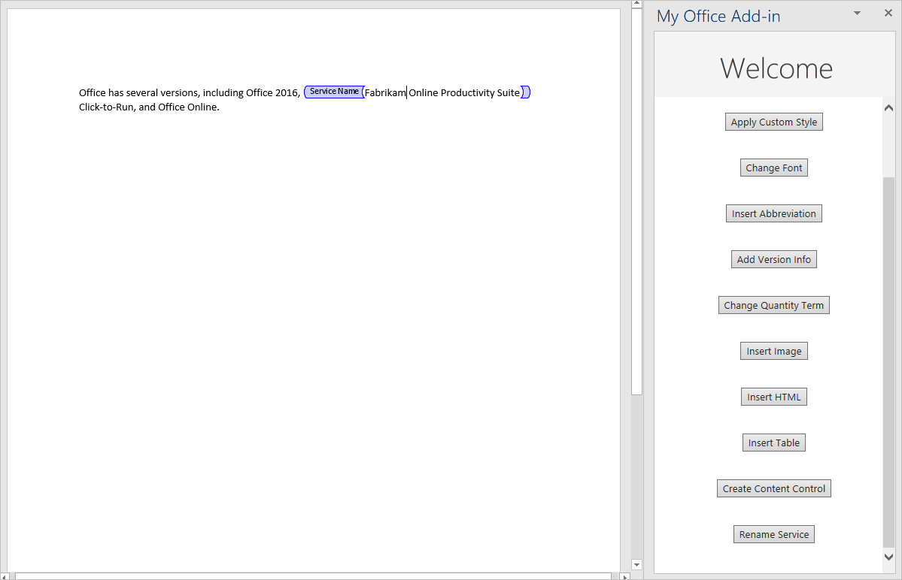

# <a name="tutorial-create-a-word-task-pane-add-in"></a><span data-ttu-id="e1184-104">チュートリアル: Word 作業ウィンドウ アドインを作成する</span><span class="sxs-lookup"><span data-stu-id="e1184-104">Tutorial: Create a Word task pane add-in</span></span>

<span data-ttu-id="e1184-105">このチュートリアルでは、以下の Word 作業ウィンドウ アドインを作成します。</span><span class="sxs-lookup"><span data-stu-id="e1184-105">In this tutorial, you'll create a Word task pane add-in that:</span></span>

> [!div class="checklist"]
> * <span data-ttu-id="e1184-106">テキスト範囲の挿入</span><span class="sxs-lookup"><span data-stu-id="e1184-106">Inserts a range of text</span></span>
> * <span data-ttu-id="e1184-107">テキストの書式設定</span><span class="sxs-lookup"><span data-stu-id="e1184-107">Formats text</span></span>
> * <span data-ttu-id="e1184-108">テキストの置換とさまざまな位置へのテキストの挿入</span><span class="sxs-lookup"><span data-stu-id="e1184-108">Replaces text and inserts text in various locations</span></span>
> * <span data-ttu-id="e1184-109">画像、HTML、テーブルの挿入</span><span class="sxs-lookup"><span data-stu-id="e1184-109">Inserts images, HTML, and tables</span></span>
> * <span data-ttu-id="e1184-110">コンテンツ コントロールの作成と更新</span><span class="sxs-lookup"><span data-stu-id="e1184-110">Creates and updates content controls</span></span> 

> [!TIP]
> <span data-ttu-id="e1184-111">[最初の Word 作業ウィンドウアドイン](../quickstarts/word-quickstart.md)のクイックスタートを既に完了していて、そのプロジェクトをこのチュートリアルの開始点として使用する場合は、「[テキストの範囲を挿入](#insert-a-range-of-text)する」セクションに直接移動して、このチュートリアルを開始してください。</span><span class="sxs-lookup"><span data-stu-id="e1184-111">If you've already completed the [Build your first Word task pane add-in](../quickstarts/word-quickstart.md) quick start, and want to use that project as a starting point for this tutorial, go directly to the [Insert a range of text](#insert-a-range-of-text) section to start this tutorial.</span></span>

## <a name="prerequisites"></a><span data-ttu-id="e1184-112">前提条件</span><span class="sxs-lookup"><span data-stu-id="e1184-112">Prerequisites</span></span>

[!include[Yeoman generator prerequisites](../includes/quickstart-yo-prerequisites.md)]

## <a name="create-your-add-in-project"></a><span data-ttu-id="e1184-113">アドイン プロジェクトの作成</span><span class="sxs-lookup"><span data-stu-id="e1184-113">Create your add-in project</span></span>

[!include[Yeoman generator create project guidance](../includes/yo-office-command-guidance.md)]

- <span data-ttu-id="e1184-114">**Choose a project type: (プロジェクトの種類を選択)** `Office Add-in Task Pane project`</span><span class="sxs-lookup"><span data-stu-id="e1184-114">**Choose a project type:** `Office Add-in Task Pane project`</span></span>
- <span data-ttu-id="e1184-115">**Choose a script type: (スクリプトの種類を選択)** `Javascript`</span><span class="sxs-lookup"><span data-stu-id="e1184-115">**Choose a script type:** `Javascript`</span></span>
- <span data-ttu-id="e1184-116">**What would you want to name your add-in?: (アドインの名前を何にしますか)**</span><span class="sxs-lookup"><span data-stu-id="e1184-116">**What do you want to name your add-in?**</span></span> `My Office Add-in`
- <span data-ttu-id="e1184-117">**Which Office client application would you like to support?: (どの Office クライアント アプリケーションをサポートしますか)**</span><span class="sxs-lookup"><span data-stu-id="e1184-117">**Which Office client application would you like to support?**</span></span> `Word`


<span data-ttu-id="e1184-119">ウィザードを完了すると、ジェネレーターによってプロジェクトが作成されて、サポートしているノード コンポーネントがインストールされます。</span><span class="sxs-lookup"><span data-stu-id="e1184-119">After you complete the wizard, the generator creates the project and installs supporting Node components.</span></span>

[!include[Yeoman generator next steps](../includes/yo-office-next-steps.md)]

## <a name="insert-a-range-of-text"></a><span data-ttu-id="e1184-120">テキスト範囲の挿入</span><span class="sxs-lookup"><span data-stu-id="e1184-120">Insert a range of text</span></span>

<span data-ttu-id="e1184-121">チュートリアルのこの手順では、ユーザーが現在使用している Word のバージョンをアドインがサポートしているかどうかをプログラムによってテストし、ドキュメントに段落を挿入します。</span><span class="sxs-lookup"><span data-stu-id="e1184-121">In this step of the tutorial, you'll programmatically test that your add-in supports the user's current version of Word, and then insert a paragraph into the document.</span></span>

### <a name="code-the-add-in"></a><span data-ttu-id="e1184-122">アドインのコードを作成する</span><span class="sxs-lookup"><span data-stu-id="e1184-122">Code the add-in</span></span>

1. <span data-ttu-id="e1184-123">コード エディターでプロジェクトを開きます。</span><span class="sxs-lookup"><span data-stu-id="e1184-123">Open the project in your code editor.</span></span>

2. <span data-ttu-id="e1184-124">ファイル **./src/taskpane/taskpane.html**を開きます。</span><span class="sxs-lookup"><span data-stu-id="e1184-124">Open the file **./src/taskpane/taskpane.html**.</span></span> <span data-ttu-id="e1184-125">このファイルには、作業ウィンドウの HTML マークアップが含まれています。</span><span class="sxs-lookup"><span data-stu-id="e1184-125">This file contains the HTML markup for the task pane.</span></span>

3. <span data-ttu-id="e1184-126">`<main>`要素を検索し、開始`<main>`タグと終了`</main>`タグの後に表示されるすべての行を削除します。</span><span class="sxs-lookup"><span data-stu-id="e1184-126">Locate the `<main>` element and delete all lines that appear after the opening `<main>` tag and before the closing `</main>` tag.</span></span>

4. <span data-ttu-id="e1184-127">開始`<main>`タグの直後に、次のマークアップを追加します。</span><span class="sxs-lookup"><span data-stu-id="e1184-127">Add the following markup immediately after the opening `<main>` tag:</span></span>

    ```html
    <button class="ms-Button" id="insert-paragraph">Insert Paragraph</button><br/><br/>
    ```

5. <span data-ttu-id="e1184-128">/Src/taskpane/taskpane.js を開きます **。**</span><span class="sxs-lookup"><span data-stu-id="e1184-128">Open the file **./src/taskpane/taskpane.js**.</span></span> <span data-ttu-id="e1184-129">このファイルには、作業ウィンドウと Office ホストアプリケーション間の対話を容易にする Office JavaScript API コードが含まれています。</span><span class="sxs-lookup"><span data-stu-id="e1184-129">This file contains the Office JavaScript API code that facilitates interaction between the task pane and the Office host application.</span></span>

6. <span data-ttu-id="e1184-130">次の手順を実行`run`して、 `run()`ボタンと関数へのすべての参照を削除します。</span><span class="sxs-lookup"><span data-stu-id="e1184-130">Remove all references to the `run` button and the `run()` function by doing the following:</span></span>

    - <span data-ttu-id="e1184-131">行`document.getElementById("run").onclick = run;`を見つけて、削除します。</span><span class="sxs-lookup"><span data-stu-id="e1184-131">Locate and delete the line `document.getElementById("run").onclick = run;`.</span></span>

    - <span data-ttu-id="e1184-132">関数全体`run()`を見つけて、削除します。</span><span class="sxs-lookup"><span data-stu-id="e1184-132">Locate and delete the entire `run()` function.</span></span>

7. <span data-ttu-id="e1184-133">`Office.onReady`メソッド呼び出し内で、行`if (info.host === Office.HostType.Word) {`を見つけて、その行の直後に次のコードを追加します。</span><span class="sxs-lookup"><span data-stu-id="e1184-133">Within the `Office.onReady` method call, locate the line `if (info.host === Office.HostType.Word) {` and add the following code immediately after that line.</span></span> <span data-ttu-id="e1184-134">注意:</span><span class="sxs-lookup"><span data-stu-id="e1184-134">Note:</span></span>

    - <span data-ttu-id="e1184-135">このコードの最初の部分では、ユーザーの Word のバージョンが、このチュートリアルのすべてのステージで使用されるすべての Api を含むバージョンの Word .js をサポートしているかどうかを判断します。</span><span class="sxs-lookup"><span data-stu-id="e1184-135">The first part of this code determines whether the user's version of Word supports a version of Word.js that includes all the APIs that are used in all stages of this tutorial.</span></span> <span data-ttu-id="e1184-136">運用アドインでは、未サポートの API を呼び出す UI を非表示または無効化する条件ブロックの本体を使用してください。</span><span class="sxs-lookup"><span data-stu-id="e1184-136">In a production add-in, use the body of the conditional block to hide or disable the UI that would call unsupported APIs.</span></span> <span data-ttu-id="e1184-137">これにより、ユーザーは、自分が使用している Word のバージョンでサポートされているアドインの部分を使用できるようになります。</span><span class="sxs-lookup"><span data-stu-id="e1184-137">This will enable the user to still use the parts of the add-in that are supported by their version of Word.</span></span>
    - <span data-ttu-id="e1184-138">このコードの2番目の部分では、 `insert-paragraph`ボタンのイベントハンドラーを追加します。</span><span class="sxs-lookup"><span data-stu-id="e1184-138">The second part of this code adds an event handler for the `insert-paragraph` button.</span></span>

    ```js
    // Determine if the user's version of Office supports all the Office.js APIs that are used in the tutorial.
    if (!Office.context.requirements.isSetSupported('WordApi', '1.3')) {
        console.log('Sorry. The tutorial add-in uses Word.js APIs that are not available in your version of Office.');
    }

    // Assign event handlers and other initialization logic.
    document.getElementById("insert-paragraph").onclick = insertParagraph;
    ```

8. <span data-ttu-id="e1184-139">ファイルの末尾に次の関数を追加します。</span><span class="sxs-lookup"><span data-stu-id="e1184-139">Add the following function to the end of the file.</span></span> <span data-ttu-id="e1184-140">注意:</span><span class="sxs-lookup"><span data-stu-id="e1184-140">Note:</span></span>

   - <span data-ttu-id="e1184-p107">Word.js のビジネス ロジックは、`Word.run` に渡される関数に追加されます。 このロジックは、すぐには実行されません。 その代わりに、保留中のコマンドのキューに追加されます。</span><span class="sxs-lookup"><span data-stu-id="e1184-p107">Your Word.js business logic will be added to the function that is passed to `Word.run`. This logic does not execute immediately. Instead, it is added to a queue of pending commands.</span></span>

   - <span data-ttu-id="e1184-144">`context.sync` メソッドは、キューに登録されたすべてのコマンドを、実行するために Word に送信します。</span><span class="sxs-lookup"><span data-stu-id="e1184-144">The `context.sync` method sends all queued commands to Word for execution.</span></span>

   - <span data-ttu-id="e1184-p108">`Word.run` の後に `catch` ブロックを続けます。 これは、どのような場合にも当てはまるベスト プラクティスです。</span><span class="sxs-lookup"><span data-stu-id="e1184-p108">The `Word.run` is followed by a `catch` block. This is a best practice that you should always follow.</span></span> 

    ```js
    function insertParagraph() {
        Word.run(function (context) {

            // TODO1: Queue commands to insert a paragraph into the document.

            return context.sync();
        })
        .catch(function (error) {
            console.log("Error: " + error);
            if (error instanceof OfficeExtension.Error) {
                console.log("Debug info: " + JSON.stringify(error.debugInfo));
            }
        });
    }
    ```

9. <span data-ttu-id="e1184-147">`insertParagraph()`関数内で、を`TODO1`次のコードに置き換えます。</span><span class="sxs-lookup"><span data-stu-id="e1184-147">Within the `insertParagraph()` function, replace `TODO1` with the following code.</span></span> <span data-ttu-id="e1184-148">注意:</span><span class="sxs-lookup"><span data-stu-id="e1184-148">Note:</span></span>

   - <span data-ttu-id="e1184-149">`insertParagraph` メソッドの最初のパラメーターは、新しい段落のテキストです。</span><span class="sxs-lookup"><span data-stu-id="e1184-149">The first parameter to the `insertParagraph` method is the text for the new paragraph.</span></span>

   - <span data-ttu-id="e1184-p110">2 番目のパラメーターは、段落を挿入する本文内の場所です。 親オブジェクトが本文の場合、段落の挿入に使用できるその他のオプションには、End と Replace があります。</span><span class="sxs-lookup"><span data-stu-id="e1184-p110">The second parameter is the location within the body where the paragraph will be inserted. Other options for insert paragraph, when the parent object is the body, are "End" and "Replace".</span></span>

    ```js
    var docBody = context.document.body;
    docBody.insertParagraph("Office has several versions, including Office 2016, Office 365 Click-to-Run, and Office on the web.",
                            "Start");
    ```

10. <span data-ttu-id="e1184-152">プロジェクトに加えたすべての変更を保存したことを確認します。</span><span class="sxs-lookup"><span data-stu-id="e1184-152">Verify that you've saved all of the changes you've made to the project.</span></span>

### <a name="test-the-add-in"></a><span data-ttu-id="e1184-153">アドインをテストする</span><span class="sxs-lookup"><span data-stu-id="e1184-153">Test the add-in</span></span>

1. <span data-ttu-id="e1184-154">以下の手順を実行し、ローカル Web サーバーを起動してアドインのサイドロードを行います。</span><span class="sxs-lookup"><span data-stu-id="e1184-154">Complete the following steps to start the local web server and sideload your add-in.</span></span>

    > [!NOTE]
    > <span data-ttu-id="e1184-155">開発の最中でも、OfficeアドインはHTTPではなくHTTPSを使用する必要があります。</span><span class="sxs-lookup"><span data-stu-id="e1184-155">Office Add-ins should use HTTPS, not HTTP, even when you are developing.</span></span> <span data-ttu-id="e1184-156">次のいずれかのコマンドを実行した後に証明書をインストールするように求められた場合は、Yeoman ジェネレーターによって提供される証明書をインストールするプロンプトを受け入れます。</span><span class="sxs-lookup"><span data-stu-id="e1184-156">If you are prompted to install a certificate after you run one of the following commands, accept the prompt to install the certificate that the Yeoman generator provides.</span></span>

    > [!TIP]
    > <span data-ttu-id="e1184-157">Mac でアドインをテストしている場合は、先に進む前に、プロジェクトのルートディレクトリで次のコマンドを実行します。</span><span class="sxs-lookup"><span data-stu-id="e1184-157">If you're testing your add-in on Mac, run the following command in the root directory of your project before proceeding.</span></span> <span data-ttu-id="e1184-158">このコマンドを実行すると、ローカル Web サーバーが起動します。</span><span class="sxs-lookup"><span data-stu-id="e1184-158">When you run this command, the local web server starts.</span></span>
    >
    > ```command&nbsp;line
    > npm run dev-server
    > ```

    - <span data-ttu-id="e1184-159">Word でアドインをテストするには、プロジェクトのルート ディレクトリから次のコマンドを実行します。</span><span class="sxs-lookup"><span data-stu-id="e1184-159">To test your add-in in Word, run the following command in the root directory of your project.</span></span> <span data-ttu-id="e1184-160">ローカル Web サーバーが (まだ実行されていない場合) 起動し、アドインが読み込まれた Word が開きます。</span><span class="sxs-lookup"><span data-stu-id="e1184-160">This starts the local web server (if it's not already running) and opens Word with your add-in loaded.</span></span>

        ```command&nbsp;line
        npm start
        ```

    - <span data-ttu-id="e1184-161">Web 上の Word でアドインをテストするには、プロジェクトのルートディレクトリで次のコマンドを実行します。</span><span class="sxs-lookup"><span data-stu-id="e1184-161">To test your add-in in Word on the web, run the following command in the root directory of your project.</span></span> <span data-ttu-id="e1184-162">このコマンドを実行すると、ローカル Web サーバーが起動します (まだ実行されていない場合)。</span><span class="sxs-lookup"><span data-stu-id="e1184-162">When you run this command, the local web server will start (if it's not already running).</span></span>

        ```command&nbsp;line
        npm run start:web
        ```

        <span data-ttu-id="e1184-163">アドインを使用するには、Word on the web で新しいドキュメントを開き、「[Office on the web で Office アドインをサイドロードする](../testing/sideload-office-add-ins-for-testing.md#sideload-an-office-add-in-in-office-on-the-web)」の手順に従ってアドインをサイドロードします。</span><span class="sxs-lookup"><span data-stu-id="e1184-163">To use your add-in, open a new document in Word on the web and then sideload your add-in by following the instructions in [Sideload Office Add-ins in Office on the web](../testing/sideload-office-add-ins-for-testing.md#sideload-an-office-add-in-in-office-on-the-web).</span></span>

2. <span data-ttu-id="e1184-164">Word で [**ホーム**] タブを選択し、リボンの [**作業ウィンドウの表示**] ボタンをクリックして、アドインの作業ウィンドウを開きます。</span><span class="sxs-lookup"><span data-stu-id="e1184-164">In Word, choose the **Home** tab, and then choose the **Show Taskpane** button in the ribbon to open the add-in task pane.</span></span>

    ![[作業ウィンドウの表示] ボタンが強調表示されている Word アプリケーションのスクリーンショット](../images/word-quickstart-addin-2b.png)

3. <span data-ttu-id="e1184-166">作業ウィンドウで、[段落の**挿入**] ボタンをクリックします。</span><span class="sxs-lookup"><span data-stu-id="e1184-166">In the task pane, choose the **Insert Paragraph** button.</span></span>

4. <span data-ttu-id="e1184-167">段落に変更を加えます。</span><span class="sxs-lookup"><span data-stu-id="e1184-167">Make a change in the paragraph.</span></span>

5. <span data-ttu-id="e1184-168">[**段落の挿入**] ボタンをもう一度選択します。</span><span class="sxs-lookup"><span data-stu-id="e1184-168">Choose the **Insert Paragraph** button again.</span></span> <span data-ttu-id="e1184-169">`insertParagraph`メソッドが文書の本文の先頭に挿入されているため、新しい段落は前の段落の上に表示されることに注意してください。</span><span class="sxs-lookup"><span data-stu-id="e1184-169">Note that the new paragraph appears above the previous one because the `insertParagraph` method is inserting at the start of the document's body.</span></span>

    

## <a name="format-text"></a><span data-ttu-id="e1184-171">テキストの書式設定</span><span class="sxs-lookup"><span data-stu-id="e1184-171">Format text</span></span>

<span data-ttu-id="e1184-172">チュートリアルのこの手順では、組み込みのスタイルをテキストに適用したり、カスタム スタイルをテキストに適用したり、テキストのフォントを変更したりします。</span><span class="sxs-lookup"><span data-stu-id="e1184-172">In this step of the tutorial, you'll apply a built-in style to text, apply a custom style to text, and change the font of text.</span></span>

### <a name="apply-a-built-in-style-to-text"></a><span data-ttu-id="e1184-173">組み込みのスタイルをテキストに適用する</span><span class="sxs-lookup"><span data-stu-id="e1184-173">Apply a built-in style to text</span></span>

1. <span data-ttu-id="e1184-174">ファイル **./src/taskpane/taskpane.html**を開きます。</span><span class="sxs-lookup"><span data-stu-id="e1184-174">Open the file **./src/taskpane/taskpane.html**.</span></span>

2. <span data-ttu-id="e1184-175">`insert-paragraph`ボタンの`<button>`要素を見つけ、その行の後に次のマークアップを追加します。</span><span class="sxs-lookup"><span data-stu-id="e1184-175">Locate the `<button>` element for the `insert-paragraph` button, and add the following markup after that line:</span></span>

    ```html
    <button class="ms-Button" id="apply-style">Apply Style</button><br/><br/>
    ```

3. <span data-ttu-id="e1184-176">/Src/taskpane/taskpane.js を開きます **。**</span><span class="sxs-lookup"><span data-stu-id="e1184-176">Open the file **./src/taskpane/taskpane.js**.</span></span>

4. <span data-ttu-id="e1184-177">`Office.onReady`メソッド呼び出し内で、 `insert-paragraph`ボタンにクリックハンドラーを割り当てる行を見つけ、その行の後に次のコードを追加します。</span><span class="sxs-lookup"><span data-stu-id="e1184-177">Within the `Office.onReady` method call, locate the line that assigns a click handler to the `insert-paragraph` button, and add the following code after that line:</span></span>

    ```js
    document.getElementById("apply-style").onclick = applyStyle;
    ```

5. <span data-ttu-id="e1184-178">ファイルの末尾に次の関数を追加します。</span><span class="sxs-lookup"><span data-stu-id="e1184-178">Add the following function to the end of the file:</span></span>

    ```js
    function applyStyle() {
        Word.run(function (context) {
            
            // TODO1: Queue commands to style text.

            return context.sync();
        })
        .catch(function (error) {
            console.log("Error: " + error);
            if (error instanceof OfficeExtension.Error) {
                console.log("Debug info: " + JSON.stringify(error.debugInfo));
            }
        });
    }
    ``` 

6. <span data-ttu-id="e1184-179">`applyStyle()`関数内で、を`TODO1`次のコードに置き換えます。</span><span class="sxs-lookup"><span data-stu-id="e1184-179">Within the `applyStyle()` function, replace `TODO1` with the following code.</span></span> <span data-ttu-id="e1184-180">このコードではスタイルを段落に適用していますが、スタイルはテキストの範囲にも適用できます。</span><span class="sxs-lookup"><span data-stu-id="e1184-180">Note that the code applies a style to a paragraph, but styles can also be applied to ranges of text.</span></span>

    ```js
    var firstParagraph = context.document.body.paragraphs.getFirst();
    firstParagraph.styleBuiltIn = Word.Style.intenseReference;
    ``` 

### <a name="apply-a-custom-style-to-text"></a><span data-ttu-id="e1184-181">カスタム スタイルをテキストに適用する</span><span class="sxs-lookup"><span data-stu-id="e1184-181">Apply a custom style to text</span></span>

1. <span data-ttu-id="e1184-182">ファイル **./src/taskpane/taskpane.html**を開きます。</span><span class="sxs-lookup"><span data-stu-id="e1184-182">Open the file **./src/taskpane/taskpane.html**.</span></span>

2. <span data-ttu-id="e1184-183">`apply-style`ボタンの`<button>`要素を見つけ、その行の後に次のマークアップを追加します。</span><span class="sxs-lookup"><span data-stu-id="e1184-183">Locate the `<button>` element for the `apply-style` button, and add the following markup after that line:</span></span> 

    ```html
    <button class="ms-Button" id="apply-custom-style">Apply Custom Style</button><br/><br/>
    ```

3. <span data-ttu-id="e1184-184">/Src/taskpane/taskpane.js を開きます **。**</span><span class="sxs-lookup"><span data-stu-id="e1184-184">Open the file **./src/taskpane/taskpane.js**.</span></span>

4. <span data-ttu-id="e1184-185">`Office.onReady`メソッド呼び出し内で、 `apply-style`ボタンにクリックハンドラーを割り当てる行を見つけ、その行の後に次のコードを追加します。</span><span class="sxs-lookup"><span data-stu-id="e1184-185">Within the `Office.onReady` method call, locate the line that assigns a click handler to the `apply-style` button, and add the following code after that line:</span></span>

    ```js
    document.getElementById("apply-custom-style").onclick = applyCustomStyle;
    ```

5. <span data-ttu-id="e1184-186">ファイルの末尾に次の関数を追加します。</span><span class="sxs-lookup"><span data-stu-id="e1184-186">Add the following function to the end of the file:</span></span>

    ```js
    function applyCustomStyle() {
        Word.run(function (context) {
            
            // TODO1: Queue commands to apply the custom style.

            return context.sync();
        })
        .catch(function (error) {
            console.log("Error: " + error);
            if (error instanceof OfficeExtension.Error) {
                console.log("Debug info: " + JSON.stringify(error.debugInfo));
            }
        });
    }
    ``` 

6. <span data-ttu-id="e1184-187">`applyCustomStyle()`関数内で、を`TODO1`次のコードに置き換えます。</span><span class="sxs-lookup"><span data-stu-id="e1184-187">Within the `applyCustomStyle()` function, replace `TODO1` with the following code.</span></span> <span data-ttu-id="e1184-188">このコードでは、まだ存在していないカスタム スタイルを適用しています。</span><span class="sxs-lookup"><span data-stu-id="e1184-188">Note that the code applies a custom style that does not exist yet.</span></span> <span data-ttu-id="e1184-189">「[アドインをテストする](#test-the-add-in-1)」の手順で **MyCustomStyle** という名前のスタイルを作成します。</span><span class="sxs-lookup"><span data-stu-id="e1184-189">You'll create a style with the name **MyCustomStyle** in the [Test the add-in](#test-the-add-in-1) step.</span></span>

    ```js
    var lastParagraph = context.document.body.paragraphs.getLast();
    lastParagraph.style = "MyCustomStyle";
    ``` 

7. <span data-ttu-id="e1184-190">プロジェクトに加えたすべての変更を保存したことを確認します。</span><span class="sxs-lookup"><span data-stu-id="e1184-190">Verify that you've saved all of the changes you've made to the project.</span></span>

### <a name="change-the-font-of-text"></a><span data-ttu-id="e1184-191">テキストのフォントを変更する</span><span class="sxs-lookup"><span data-stu-id="e1184-191">Change the font of text</span></span>

1. <span data-ttu-id="e1184-192">ファイル **./src/taskpane/taskpane.html**を開きます。</span><span class="sxs-lookup"><span data-stu-id="e1184-192">Open the file **./src/taskpane/taskpane.html**.</span></span>

2. <span data-ttu-id="e1184-193">`apply-custom-style`ボタンの`<button>`要素を見つけ、その行の後に次のマークアップを追加します。</span><span class="sxs-lookup"><span data-stu-id="e1184-193">Locate the `<button>` element for the `apply-custom-style` button, and add the following markup after that line:</span></span> 

    ```html
    <button class="ms-Button" id="change-font">Change Font</button><br/><br/>
    ```

3. <span data-ttu-id="e1184-194">/Src/taskpane/taskpane.js を開きます **。**</span><span class="sxs-lookup"><span data-stu-id="e1184-194">Open the file **./src/taskpane/taskpane.js**.</span></span>

4. <span data-ttu-id="e1184-195">`Office.onReady`メソッド呼び出し内で、 `apply-custom-style`ボタンにクリックハンドラーを割り当てる行を見つけ、その行の後に次のコードを追加します。</span><span class="sxs-lookup"><span data-stu-id="e1184-195">Within the `Office.onReady` method call, locate the line that assigns a click handler to the `apply-custom-style` button, and add the following code after that line:</span></span>

    ```js
    document.getElementById("change-font").onclick = changeFont;
    ```

5. <span data-ttu-id="e1184-196">ファイルの末尾に次の関数を追加します。</span><span class="sxs-lookup"><span data-stu-id="e1184-196">Add the following function to the end of the file:</span></span>

    ```js
    function changeFont() {
        Word.run(function (context) {
            
            // TODO1: Queue commands to apply a different font.

            return context.sync();
        })
        .catch(function (error) {
            console.log("Error: " + error);
            if (error instanceof OfficeExtension.Error) {
                console.log("Debug info: " + JSON.stringify(error.debugInfo));
            }
        });
    }
    ``` 

6. <span data-ttu-id="e1184-197">`changeFont()`関数内で、を`TODO1`次のコードに置き換えます。</span><span class="sxs-lookup"><span data-stu-id="e1184-197">Within the `changeFont()` function, replace `TODO1` with the following code.</span></span> <span data-ttu-id="e1184-198">このコードでは、`Paragraph.getNext` メソッドにチェーンされた `ParagraphCollection.getFirst` メソッドを使用して 2 番目の段落への参照を取得することに注意してください。</span><span class="sxs-lookup"><span data-stu-id="e1184-198">Note that the code gets a reference to the second paragraph by using the `ParagraphCollection.getFirst` method chained to the `Paragraph.getNext` method.</span></span>

    ```js
    var secondParagraph = context.document.body.paragraphs.getFirst().getNext();
    secondParagraph.font.set({
            name: "Courier New",
            bold: true,
            size: 18
        });
    ``` 

7. <span data-ttu-id="e1184-199">プロジェクトに加えたすべての変更を保存したことを確認します。</span><span class="sxs-lookup"><span data-stu-id="e1184-199">Verify that you've saved all of the changes you've made to the project.</span></span>

### <a name="test-the-add-in"></a><span data-ttu-id="e1184-200">アドインをテストする</span><span class="sxs-lookup"><span data-stu-id="e1184-200">Test the add-in</span></span>

1. [!include[Start server and sideload add-in instructions](../includes/tutorial-word-start-server.md)]

2. <span data-ttu-id="e1184-201">アドイン作業ウィンドウが Word でまだ開かれていない場合は、[**ホーム**] タブに移動し、リボンの [作業ウィンドウの**表示**] ボタンをクリックして開きます。</span><span class="sxs-lookup"><span data-stu-id="e1184-201">If the add-in task pane isn't already open in Word, go to the **Home** tab and choose the **Show Taskpane** button in the ribbon to open it.</span></span>

3. <span data-ttu-id="e1184-202">ドキュメントに 3 つ以上の段落があることを確認してください。</span><span class="sxs-lookup"><span data-stu-id="e1184-202">Be sure there are at least three paragraphs in the document.</span></span> <span data-ttu-id="e1184-203">[**段落の挿入**] ボタンを3回選択できます。</span><span class="sxs-lookup"><span data-stu-id="e1184-203">You can choose the **Insert Paragraph** button three times.</span></span> <span data-ttu-id="e1184-204">*ドキュメントの最後に空白の段落がないことを慎重にチェックしてください。空白の段落がある場合は、それを削除します。*</span><span class="sxs-lookup"><span data-stu-id="e1184-204">*Check carefully that there's no blank paragraph at the end of the document. If there is, delete it.*</span></span>

4. <span data-ttu-id="e1184-205">Word で、"MyCustomStyle" という名前の[ユーザー設定のスタイル](https://support.office.com/article/Customize-or-create-new-styles-d38d6e47-f6fc-48eb-a607-1eb120dec563)を作成します。</span><span class="sxs-lookup"><span data-stu-id="e1184-205">In Word, create a [custom style](https://support.office.com/article/Customize-or-create-new-styles-d38d6e47-f6fc-48eb-a607-1eb120dec563) named "MyCustomStyle".</span></span> <span data-ttu-id="e1184-206">このスタイルには、必要に応じて任意の書式を設定できます。</span><span class="sxs-lookup"><span data-stu-id="e1184-206">It can have any formatting that you want.</span></span>

5. <span data-ttu-id="e1184-p121">**[スタイルの適用]** ボタンを選択します。 最初の段落は、組み込みのスタイルである **Intense Reference** でスタイル設定されます。</span><span class="sxs-lookup"><span data-stu-id="e1184-p121">Choose the **Apply Style** button. The first paragraph will be styled with the built-in style **Intense Reference**.</span></span>

6. <span data-ttu-id="e1184-p122">**[カスタム スタイルの適用]** ボタンを選択します。 最後の段落は、選択したカスタム スタイルでスタイル設定されます。 (何も起こらないように思える場合、最後の段落が空白である可能性があります。 その場合は、最後の段落にテキストを追加します)。</span><span class="sxs-lookup"><span data-stu-id="e1184-p122">Choose the **Apply Custom Style** button. The last paragraph will be styled with your custom style. (If nothing seems to happen, the last paragraph might be blank. If so, add some text to it.)</span></span>

7. <span data-ttu-id="e1184-p123">**[フォントの変更]** ボタンを選択します。 2 番目の段落のフォントを、18 ポイントで太字の Courier New に変更します。</span><span class="sxs-lookup"><span data-stu-id="e1184-p123">Choose the **Change Font** button. The font of the second paragraph changes to 18 pt., bold, Courier New.</span></span>

    

## <a name="replace-text-and-insert-text"></a><span data-ttu-id="e1184-216">テキストの置換と挿入</span><span class="sxs-lookup"><span data-stu-id="e1184-216">Replace text and insert text</span></span>

<span data-ttu-id="e1184-217">このチュートリアルの手順では、選択したテキスト範囲の内側や外側にテキストを追加したり、選択した範囲のテキストを置き換えたりします。</span><span class="sxs-lookup"><span data-stu-id="e1184-217">In this step of the tutorial, you'll add text inside and outside of selected ranges of text, and replace the text of a selected range.</span></span>

### <a name="add-text-inside-a-range"></a><span data-ttu-id="e1184-218">範囲内にテキストを追加する</span><span class="sxs-lookup"><span data-stu-id="e1184-218">Add text inside a range</span></span>

1. <span data-ttu-id="e1184-219">ファイル **./src/taskpane/taskpane.html**を開きます。</span><span class="sxs-lookup"><span data-stu-id="e1184-219">Open the file **./src/taskpane/taskpane.html**.</span></span>

2. <span data-ttu-id="e1184-220">`change-font`ボタンの`<button>`要素を見つけ、その行の後に次のマークアップを追加します。</span><span class="sxs-lookup"><span data-stu-id="e1184-220">Locate the `<button>` element for the `change-font` button, and add the following markup after that line:</span></span> 

    ```html
    <button class="ms-Button" id="insert-text-into-range">Insert Abbreviation</button><br/><br/>
    ```

3. <span data-ttu-id="e1184-221">/Src/taskpane/taskpane.js を開きます **。**</span><span class="sxs-lookup"><span data-stu-id="e1184-221">Open the file **./src/taskpane/taskpane.js**.</span></span>

4. <span data-ttu-id="e1184-222">`Office.onReady`メソッド呼び出し内で、 `change-font`ボタンにクリックハンドラーを割り当てる行を見つけ、その行の後に次のコードを追加します。</span><span class="sxs-lookup"><span data-stu-id="e1184-222">Within the `Office.onReady` method call, locate the line that assigns a click handler to the `change-font` button, and add the following code after that line:</span></span>

    ```js
    document.getElementById("insert-text-into-range").onclick = insertTextIntoRange;
    ```
5. <span data-ttu-id="e1184-223">ファイルの末尾に次の関数を追加します。</span><span class="sxs-lookup"><span data-stu-id="e1184-223">Add the following function to the end of the file:</span></span>

    ```js
    function insertTextIntoRange() {
        Word.run(function (context) {

            // TODO1: Queue commands to insert text into a selected range.

            // TODO2: Load the text of the range and sync so that the
            //        current range text can be read.

            // TODO3: Queue commands to repeat the text of the original
            //        range at the end of the document.

            return context.sync();
        })
        .catch(function (error) {
            console.log("Error: " + error);
            if (error instanceof OfficeExtension.Error) {
                console.log("Debug info: " + JSON.stringify(error.debugInfo));
            }
        });
    }
    ``` 

6. <span data-ttu-id="e1184-224">`insertTextIntoRange()`関数内で、を`TODO1`次のコードに置き換えます。</span><span class="sxs-lookup"><span data-stu-id="e1184-224">Within the `insertTextIntoRange()` function, replace `TODO1` with the following code.</span></span> <span data-ttu-id="e1184-225">次の点に注意してください。</span><span class="sxs-lookup"><span data-stu-id="e1184-225">Note:</span></span>

   - <span data-ttu-id="e1184-p125">このメソッドの目的は、テキストが Click-to-Run という範囲の末尾に (C2R) という省略形を挿入することです。 これは前提を単純化し、文字列は存在しており、ユーザーがその文字列を選択したものとしています。</span><span class="sxs-lookup"><span data-stu-id="e1184-p125">The method is intended to insert the abbreviation ["(C2R)"] into the end of the Range whose text is "Click-to-Run". It makes a simplifying assumption that the string is present and the user has selected it.</span></span>

   - <span data-ttu-id="e1184-228">`Range.insertText` メソッドの最初のパラメーターは、`Range` オブジェクトに挿入する文字列です。</span><span class="sxs-lookup"><span data-stu-id="e1184-228">The first parameter of the `Range.insertText` method is the string to insert into the `Range` object.</span></span>

   - <span data-ttu-id="e1184-p126">2 番目のパラメーターは、範囲内のどの位置にテキストを挿入するかを指定します。 End の他に、Start、Before、After、Replace が選択できます。</span><span class="sxs-lookup"><span data-stu-id="e1184-p126">The second parameter specifies where in the range the additional text should be inserted. Besides "End", the other possible options are "Start", "Before", "After", and "Replace".</span></span> 

   - <span data-ttu-id="e1184-p127">End と After の違いは、End が既存の範囲の内部の末尾に新しいテキストを挿入するのに対し、After の場合は文字列の入った新しい範囲を作成し、既存の範囲の後にその新しい範囲が挿入されることです。 同様に、Start はテキストを既存の範囲の内部の先頭に挿入しますが、Before の場合は新しい範囲を挿入します。 Replace は、既存の範囲のテキストを最初のパラメーターで指定した文字列に置き換えます。</span><span class="sxs-lookup"><span data-stu-id="e1184-p127">The difference between "End" and "After" is that "End" inserts the new text inside the end of the existing range, but "After" creates a new range with the string and inserts the new range after the existing range. Similarly, "Start" inserts text inside the beginning of the existing range and "Before" inserts a new range. "Replace" replaces the text of the existing range with the string in the first parameter.</span></span>

   - <span data-ttu-id="e1184-p128">チュートリアルの前の段階で示したとおり、ボディ オブジェクトの insert\* メソッドに Before オプションや After オプションはありません。 これは、文書の本文の外部にはコンテンツを挿入できないからです。</span><span class="sxs-lookup"><span data-stu-id="e1184-p128">You saw in an earlier stage of the tutorial that the insert\* methods of the body object do not have the "Before" and "After" options. This is because you can't put content outside of the document's body.</span></span>

    ```js
    var doc = context.document;
    var originalRange = doc.getSelection();
    originalRange.insertText(" (C2R)", "End");
    ```

7. <span data-ttu-id="e1184-236">`TODO2` はスキップし、次のセクションに移ります。</span><span class="sxs-lookup"><span data-stu-id="e1184-236">We'll skip over `TODO2` until the next section.</span></span> <span data-ttu-id="e1184-237">`insertTextIntoRange()`関数内で、を`TODO3`次のコードに置き換えます。</span><span class="sxs-lookup"><span data-stu-id="e1184-237">Within the `insertTextIntoRange()` function, replace `TODO3` with the following code.</span></span> <span data-ttu-id="e1184-238">このコードは、このチュートリアルの最初の段階で作成したコードに似ていますが、文書の先頭ではなく末尾に新しい段落を挿入する点が異なります。</span><span class="sxs-lookup"><span data-stu-id="e1184-238">This code is similar to the code you created in the first stage of the tutorial, except that now you are inserting a new paragraph at the end of the document instead of at the start.</span></span> <span data-ttu-id="e1184-239">この新しい段落で、新しいテキストが元の範囲の一部になっていることが示されます。</span><span class="sxs-lookup"><span data-stu-id="e1184-239">This new paragraph will demonstrate that the new text is now part of the original range.</span></span>

    ```js
    doc.body.insertParagraph("Original range: " + originalRange.text, "End");
    ```

### <a name="add-code-to-fetch-document-properties-into-the-task-panes-script-objects"></a><span data-ttu-id="e1184-240">ドキュメントのプロパティを作業ウィンドウのスクリプト オブジェクトにフェッチするコードを追加する</span><span class="sxs-lookup"><span data-stu-id="e1184-240">Add code to fetch document properties into the task pane's script objects</span></span>

<span data-ttu-id="e1184-241">この一連のチュートリアルの以前のすべての関数では、Office ドキュメントに*書き込む*コマンドをキューに登録しました。</span><span class="sxs-lookup"><span data-stu-id="e1184-241">In all previous functions in this series of tutorials, you queued commands to *write* to the Office document.</span></span> <span data-ttu-id="e1184-242">各関数は、キューに登録されたコマンドを実行対象のドキュメントに送信する `context.sync()` メソッドを呼び出すことで終了しています。</span><span class="sxs-lookup"><span data-stu-id="e1184-242">Each function ended with a call to the `context.sync()` method which sends the queued commands to the document to be executed.</span></span> <span data-ttu-id="e1184-243">ただし、最後の手順で追加したコードでは、`originalRange.text` プロパティを呼び出しています。このことが、これまでに作成した関数とは大きく異なります。`originalRange` オブジェクトは、この作業ウィンドウのスクリプトに存在する単なるプロキシ オブジェクトなので、</span><span class="sxs-lookup"><span data-stu-id="e1184-243">But the code you added in the last step calls the `originalRange.text` property, and this is a significant difference from the earlier functions you wrote, because the `originalRange` object is only a proxy object that exists in your task pane's script.</span></span> <span data-ttu-id="e1184-244">ドキュメントの指定された範囲にある実際のテキストを認識できません。そのため、その `text` プロパティでは実際の値が保持できません。</span><span class="sxs-lookup"><span data-stu-id="e1184-244">It doesn't know what the actual text of the range in the document is, so its `text` property can't have a real value.</span></span> <span data-ttu-id="e1184-245">まず、ドキュメントからその範囲のテキスト値をフェッチする必要があり、その値を使用して `originalRange.text` の値を設定します。</span><span class="sxs-lookup"><span data-stu-id="e1184-245">It is necessary to first fetch the text value of the range from the document and use it to set the value of `originalRange.text`.</span></span> <span data-ttu-id="e1184-246">そのようにした場合にのみ、例外がスローされることなく `originalRange.text` を呼び出せるようになります。</span><span class="sxs-lookup"><span data-stu-id="e1184-246">Only then can `originalRange.text` be called without causing an exception to be thrown.</span></span> <span data-ttu-id="e1184-247">このフェッチ処理には、3 つの手順があります。</span><span class="sxs-lookup"><span data-stu-id="e1184-247">This fetching process has three steps:</span></span>

   1. <span data-ttu-id="e1184-248">コードで読み取る必要があるプロパティをロードする (つまりフェッチする) コマンドをキューに登録します。</span><span class="sxs-lookup"><span data-stu-id="e1184-248">Queue a command to load (that is; fetch) the properties that your code needs to read.</span></span>

   2. <span data-ttu-id="e1184-249">コンテキスト オブジェクトの `sync` メソッドを呼び出します。このメソッドは、キューに登録されたコマンドを実行対象のドキュメントに送信して、要求された情報を返します。</span><span class="sxs-lookup"><span data-stu-id="e1184-249">Call the context object's `sync` method to send the queued command to the document for execution and return the requested information.</span></span>

   3. <span data-ttu-id="e1184-250">`sync` メソッドは非同期であるため、フェッチされたプロパティをコードで呼び出す前に、そのメソッドが完了していることを確認します。</span><span class="sxs-lookup"><span data-stu-id="e1184-250">Because the `sync` method is asynchronous, ensure that it has completed before your code calls the properties that were fetched.</span></span>

<span data-ttu-id="e1184-251">こうした手順は、コードで Office ドキュメントから情報を*読み取る*必要がある場合には必ず完了する必要があります。</span><span class="sxs-lookup"><span data-stu-id="e1184-251">These steps must be completed whenever your code needs to *read* information from the Office document.</span></span>

1. <span data-ttu-id="e1184-252">`insertTextIntoRange()`関数内で、を`TODO2`次のコードに置き換えます。</span><span class="sxs-lookup"><span data-stu-id="e1184-252">Within the `insertTextIntoRange()` function, replace `TODO2` with the following code.</span></span>
  
    ```js
    originalRange.load("text");
    return context.sync()
        .then(function() {
            // TODO4: Move the doc.body.insertParagraph line here.
        })
        // TODO5: Move the final call of context.sync here and ensure
        //        that it does not run until the insertParagraph has
        //        been queued.
    ```

2. <span data-ttu-id="e1184-p131">分岐していない同一のコード パスに 2 つの `return` ステートメントを含めることはできないため、`Word.run` の最後にある最終行の `return context.sync();` を削除します。新しい最後の `context.sync` は、このチュートリアルの後の方で追加します。</span><span class="sxs-lookup"><span data-stu-id="e1184-p131">You can't have two `return` statements in the same unbranching code path, so delete the final line `return context.sync();` at the end of the `Word.run`. You'll add a new final `context.sync` later in this tutorial.</span></span>

3. <span data-ttu-id="e1184-255">`doc.body.insertParagraph` 行を切り取り、`TODO4` の代わりに貼り付けます。</span><span class="sxs-lookup"><span data-stu-id="e1184-255">Cut the `doc.body.insertParagraph` line and paste in place of `TODO4`.</span></span>

4. <span data-ttu-id="e1184-p132">`TODO5` を次のコードに置き換えます。次の点に注意してください。</span><span class="sxs-lookup"><span data-stu-id="e1184-p132">Replace `TODO5` with the following code. Note:</span></span>

   - <span data-ttu-id="e1184-258">`sync` メソッドを `then` 関数に渡すことで、`insertParagraph` ロジックがキューに登録されるまで、そのメソッドが実行されないようにします。</span><span class="sxs-lookup"><span data-stu-id="e1184-258">Passing the `sync` method to a `then` function ensures that it does not run until the `insertParagraph` logic has been queued.</span></span>

   - <span data-ttu-id="e1184-259">`then`メソッドは、渡された関数を呼び出しますが、2回`sync`呼び出さないようにするため、"()" をコンテキストの終わりから省略します。</span><span class="sxs-lookup"><span data-stu-id="e1184-259">The `then` method invokes whatever function is passed to it, and you don't want `sync` to be invoked twice, so omit the "()" from the end of context.sync.</span></span>

    ```js
    .then(context.sync);
    ```

<span data-ttu-id="e1184-260">作業が完了すると、関数の全体は次のようになります。</span><span class="sxs-lookup"><span data-stu-id="e1184-260">When you're done, the entire function should look like the following:</span></span>

```js
function insertTextIntoRange() {
    Word.run(function (context) {

        var doc = context.document;
        var originalRange = doc.getSelection();
        originalRange.insertText(" (C2R)", "End");

        originalRange.load("text");
        return context.sync()
            .then(function() {
                doc.body.insertParagraph("Current text of original range: " + originalRange.text, "End");
            })
            .then(context.sync);
    })
    .catch(function (error) {
        console.log("Error: " + error);
        if (error instanceof OfficeExtension.Error) {
            console.log("Debug info: " + JSON.stringify(error.debugInfo));
        }
    });
}
```

### <a name="add-text-between-ranges"></a><span data-ttu-id="e1184-261">範囲間にテキストを追加する</span><span class="sxs-lookup"><span data-stu-id="e1184-261">Add text between ranges</span></span>

1. <span data-ttu-id="e1184-262">ファイル **./src/taskpane/taskpane.html**を開きます。</span><span class="sxs-lookup"><span data-stu-id="e1184-262">Open the file **./src/taskpane/taskpane.html**.</span></span>

2. <span data-ttu-id="e1184-263">`insert-text-into-range`ボタンの`<button>`要素を見つけ、その行の後に次のマークアップを追加します。</span><span class="sxs-lookup"><span data-stu-id="e1184-263">Locate the `<button>` element for the `insert-text-into-range` button, and add the following markup after that line:</span></span> 

    ```html
    <button class="ms-Button" id="insert-text-outside-range">Add Version Info</button><br/><br/>
    ```

3. <span data-ttu-id="e1184-264">/Src/taskpane/taskpane.js を開きます **。**</span><span class="sxs-lookup"><span data-stu-id="e1184-264">Open the file **./src/taskpane/taskpane.js**.</span></span>

4. <span data-ttu-id="e1184-265">`Office.onReady`メソッド呼び出し内で、 `insert-text-into-range`ボタンにクリックハンドラーを割り当てる行を見つけ、その行の後に次のコードを追加します。</span><span class="sxs-lookup"><span data-stu-id="e1184-265">Within the `Office.onReady` method call, locate the line that assigns a click handler to the `insert-text-into-range` button, and add the following code after that line:</span></span>

    ```js
    document.getElementById("insert-text-outside-range").onclick = insertTextBeforeRange;
    ```

5. <span data-ttu-id="e1184-266">ファイルの末尾に次の関数を追加します。</span><span class="sxs-lookup"><span data-stu-id="e1184-266">Add the following function to the end of the file:</span></span>

    ```js
    function insertTextBeforeRange() {
        Word.run(function (context) {

            // TODO1: Queue commands to insert a new range before the
            //        selected range.

            // TODO2: Load the text of the original range and sync so that the
            //        range text can be read and inserted.

        })
        .catch(function (error) {
            console.log("Error: " + error);
            if (error instanceof OfficeExtension.Error) {
                console.log("Debug info: " + JSON.stringify(error.debugInfo));
            }
        });
    }
    ```

6. <span data-ttu-id="e1184-267">`insertTextBeforeRange()`関数内で、を`TODO1`次のコードに置き換えます。</span><span class="sxs-lookup"><span data-stu-id="e1184-267">Within the `insertTextBeforeRange()` function, replace `TODO1` with the following code.</span></span> <span data-ttu-id="e1184-268">次の点に注意してください。</span><span class="sxs-lookup"><span data-stu-id="e1184-268">Note:</span></span>

   - <span data-ttu-id="e1184-p134">このメソッドの目的は、Office 365 というテキストから成る範囲の前に Office 2019 というテキストの範囲を追加することです。 これは前提を単純化し、文字列は存在しており、ユーザーがその文字列を選択したものとしています。</span><span class="sxs-lookup"><span data-stu-id="e1184-p134">The method is intended to add a range whose text is "Office 2019, " before the range with text "Office 365". It makes a simplifying assumption that the string is present and the user has selected it.</span></span>

   - <span data-ttu-id="e1184-271">`Range.insertText` メソッドの最初のパラメーターは、追加する文字列です。</span><span class="sxs-lookup"><span data-stu-id="e1184-271">The first parameter of the `Range.insertText` method is the string to add.</span></span>

   - <span data-ttu-id="e1184-p135">2 番目のパラメーターは、範囲内のどの位置にテキストを挿入するかを指定します。 位置オプションの詳細については、`insertTextIntoRange` 関数に関する上記の説明を参照してください。</span><span class="sxs-lookup"><span data-stu-id="e1184-p135">The second parameter specifies where in the range the additional text should be inserted. For more details about the location options, see the previous discussion of the `insertTextIntoRange` function.</span></span>

    ```js
    var doc = context.document;
    var originalRange = doc.getSelection();
    originalRange.insertText("Office 2019, ", "Before");
    ```

7. <span data-ttu-id="e1184-274">`insertTextBeforeRange()`関数内で、を`TODO2`次のコードに置き換えます。</span><span class="sxs-lookup"><span data-stu-id="e1184-274">Within the `insertTextBeforeRange()` function, replace `TODO2` with the following code.</span></span>

     ```js
    originalRange.load("text");
    return context.sync()
        .then(function() {
            // TODO3: Queue commands to insert the original range as a
            //        paragraph at the end of the document.
        })
        // TODO4: Make a final call of context.sync here and ensure
        //        that it does not run until the insertParagraph has
        //        been queued.
    ```

8. <span data-ttu-id="e1184-p136">`TODO3` を次のコードに置き換えます。 この新しい段落で、新しいテキストが元の選択範囲の一部になって***いない***ことが示されます。 元の範囲には、依然として選択時のテキストのみが含まれています。</span><span class="sxs-lookup"><span data-stu-id="e1184-p136">Replace `TODO3` with the following code. This new paragraph will demonstrate the fact that the new text is ***not*** part of the original selected range. The original range still has only the text it had when it was selected.</span></span>

    ```js
    doc.body.insertParagraph("Current text of original range: " + originalRange.text, "End");
    ```

9. <span data-ttu-id="e1184-278">`TODO4` を次のコードに置き換えます。</span><span class="sxs-lookup"><span data-stu-id="e1184-278">Replace `TODO4` with the following code:</span></span>

    ```js
    .then(context.sync);
    ```

### <a name="replace-the-text-of-a-range"></a><span data-ttu-id="e1184-279">範囲のテキストを置き換える</span><span class="sxs-lookup"><span data-stu-id="e1184-279">Replace the text of a range</span></span>

1. <span data-ttu-id="e1184-280">ファイル **./src/taskpane/taskpane.html**を開きます。</span><span class="sxs-lookup"><span data-stu-id="e1184-280">Open the file **./src/taskpane/taskpane.html**.</span></span>

2. <span data-ttu-id="e1184-281">`insert-text-outside-range`ボタンの`<button>`要素を見つけ、その行の後に次のマークアップを追加します。</span><span class="sxs-lookup"><span data-stu-id="e1184-281">Locate the `<button>` element for the `insert-text-outside-range` button, and add the following markup after that line:</span></span> 

    ```html
    <button class="ms-Button" id="replace-text">Change Quantity Term</button><br/><br/>
    ```

3. <span data-ttu-id="e1184-282">/Src/taskpane/taskpane.js を開きます **。**</span><span class="sxs-lookup"><span data-stu-id="e1184-282">Open the file **./src/taskpane/taskpane.js**.</span></span>

4. <span data-ttu-id="e1184-283">`Office.onReady`メソッド呼び出し内で、 `insert-text-outside-range`ボタンにクリックハンドラーを割り当てる行を見つけ、その行の後に次のコードを追加します。</span><span class="sxs-lookup"><span data-stu-id="e1184-283">Within the `Office.onReady` method call, locate the line that assigns a click handler to the `insert-text-outside-range` button, and add the following code after that line:</span></span>

    ```js
    document.getElementById("replace-text").onclick = replaceText;
    ```

5. <span data-ttu-id="e1184-284">ファイルの末尾に次の関数を追加します。</span><span class="sxs-lookup"><span data-stu-id="e1184-284">Add the following function to the end of the file:</span></span>

    ```js
    function replaceText() {
        Word.run(function (context) {

            // TODO1: Queue commands to replace the text.

            return context.sync();
        })
        .catch(function (error) {
            console.log("Error: " + error);
            if (error instanceof OfficeExtension.Error) {
                console.log("Debug info: " + JSON.stringify(error.debugInfo));
            }
        });
    }
    ```

6. <span data-ttu-id="e1184-285">`replaceText()`関数内で、を`TODO1`次のコードに置き換えます。</span><span class="sxs-lookup"><span data-stu-id="e1184-285">Within the `replaceText()` function, replace `TODO1` with the following code.</span></span> <span data-ttu-id="e1184-286">このメソッドの目的は、several という文字列を many という文字列で置き換えることです。</span><span class="sxs-lookup"><span data-stu-id="e1184-286">Note that the method is intended to replace the string "several" with the string "many".</span></span> <span data-ttu-id="e1184-287">これは前提を単純化し、文字列は存在しており、ユーザーがその文字列を選択したものとしています。</span><span class="sxs-lookup"><span data-stu-id="e1184-287">It makes a simplifying assumption that the string is present and the user has selected it.</span></span>

    ```js
    var doc = context.document;
    var originalRange = doc.getSelection();
    originalRange.insertText("many", "Replace");
    ```

7. <span data-ttu-id="e1184-288">プロジェクトに加えたすべての変更を保存したことを確認します。</span><span class="sxs-lookup"><span data-stu-id="e1184-288">Verify that you've saved all of the changes you've made to the project.</span></span>

### <a name="test-the-add-in"></a><span data-ttu-id="e1184-289">アドインをテストする</span><span class="sxs-lookup"><span data-stu-id="e1184-289">Test the add-in</span></span>

1. [!include[Start server and sideload add-in instructions](../includes/tutorial-word-start-server.md)]

2. <span data-ttu-id="e1184-290">アドイン作業ウィンドウが Word でまだ開かれていない場合は、[**ホーム**] タブに移動し、リボンの [作業ウィンドウの**表示**] ボタンをクリックして開きます。</span><span class="sxs-lookup"><span data-stu-id="e1184-290">If the add-in task pane isn't already open in Word, go to the **Home** tab and choose the **Show Taskpane** button in the ribbon to open it.</span></span>

3. <span data-ttu-id="e1184-291">作業ウィンドウで、[段落の**挿入**] ボタンをクリックして、文書の先頭に段落があることを確認します。</span><span class="sxs-lookup"><span data-stu-id="e1184-291">In the task pane, choose the **Insert Paragraph** button to ensure that there is a paragraph at the start of the document.</span></span>

4. <span data-ttu-id="e1184-292">ドキュメント内で、[クイック実行] という語句を選択します。</span><span class="sxs-lookup"><span data-stu-id="e1184-292">Within the document, select the phrase "Click-to-Run".</span></span> <span data-ttu-id="e1184-293">*選択範囲には、前のスペースまたはコンマの後ろを含めないように注意してください。*</span><span class="sxs-lookup"><span data-stu-id="e1184-293">*Be careful not to include the preceding space or following comma in the selection.*</span></span>

5. <span data-ttu-id="e1184-p139">**[ラベル (短縮形) の挿入]** ボタンを選択します。 (C2R) が追加されることに注意してください。 また、この新しい文字列は既存の範囲に追加されるため、文書の下部に新しい段落が追加され、拡張されたテキスト全体が含まれていることに注意してください。</span><span class="sxs-lookup"><span data-stu-id="e1184-p139">Choose the **Insert Abbreviation** button. Note that " (C2R)" is added. Note also that at the bottom of the document a new paragraph is added with the entire expanded text because the new string was added to the existing range.</span></span>

6. <span data-ttu-id="e1184-297">ドキュメント内で、"Office 365" という語句を選択します。</span><span class="sxs-lookup"><span data-stu-id="e1184-297">Within the document, select the phrase "Office 365".</span></span> <span data-ttu-id="e1184-298">*選択範囲の前後にあるスペースは含めないように注意してください。*</span><span class="sxs-lookup"><span data-stu-id="e1184-298">*Be careful not to include the preceding or following space in the selection.*</span></span>

7. <span data-ttu-id="e1184-p141">**[バージョン情報の追加]** ボタンを選択します。 Office 2019 が、Office 2016 と Office 365 の間に挿入されることに注意してください。 また、この新しい文字列は元の範囲に追加されるのではなく新しい範囲になるため、文書の下部に新しい段落が追加されるものの、その段落には最初に選択したテキストのみが含まれることに注意してください。</span><span class="sxs-lookup"><span data-stu-id="e1184-p141">Choose the **Add Version Info** button. Note that "Office 2019, " is inserted between "Office 2016" and "Office 365". Note also that at the bottom of the document a new paragraph is added but it contains only the originally selected text because the new string became a new range rather than being added to the original range.</span></span>

8. <span data-ttu-id="e1184-302">ドキュメント内で、単語 "複数" を選択します。</span><span class="sxs-lookup"><span data-stu-id="e1184-302">Within the document, select the word "several".</span></span> <span data-ttu-id="e1184-303">*選択範囲の前後にあるスペースは含めないように注意してください。*</span><span class="sxs-lookup"><span data-stu-id="e1184-303">*Be careful not to include the preceding or following space in the selection.*</span></span>

9. <span data-ttu-id="e1184-p143">**[数量の用語の変更]** ボタンを選択します。 選択したテキストが many に置き換えられることに注意してください。</span><span class="sxs-lookup"><span data-stu-id="e1184-p143">Choose the **Change Quantity Term** button. Note that "many" replaces the selected text.</span></span>

    

## <a name="insert-images-html-and-tables"></a><span data-ttu-id="e1184-307">画像、HTML、テーブルの挿入</span><span class="sxs-lookup"><span data-stu-id="e1184-307">Insert images, HTML, and tables</span></span>

<span data-ttu-id="e1184-308">チュートリアルのこの手順では、ドキュメントに画像、HTML、テーブルを挿入する方法について説明します。</span><span class="sxs-lookup"><span data-stu-id="e1184-308">In this step of the tutorial, you'll learn how to insert images, HTML, and tables into the document.</span></span>

### <a name="define-an-image"></a><span data-ttu-id="e1184-309">イメージを定義する</span><span class="sxs-lookup"><span data-stu-id="e1184-309">Define an image</span></span>

<span data-ttu-id="e1184-310">このチュートリアルの次の部分でドキュメントに挿入する画像を定義するには、次の手順を実行します。</span><span class="sxs-lookup"><span data-stu-id="e1184-310">Complete the following steps to define the image that you'll insert into the document in the next part of this tutorial.</span></span> 

1. <span data-ttu-id="e1184-311">プロジェクトのルートで、 **base64Image**という名前の新しいファイルを作成します。</span><span class="sxs-lookup"><span data-stu-id="e1184-311">In the root of the project, create a new file named **base64Image.js**.</span></span>

2. <span data-ttu-id="e1184-312">**Base64Image**ファイルを開き、次のコードを追加して、画像を表す base64 でエンコードされた文字列を指定します。</span><span class="sxs-lookup"><span data-stu-id="e1184-312">Open the file **base64Image.js** and add the following code to specify the base64-encoded string that represents an image.</span></span>

    ```js
    export const base64Image =
        "iVBORw0KGgoAAAANSUhEUgAAAZAAAAEFCAIAAABCdiZrAAAACXBIWXMAAAsSAAALEgHS3X78AAAgAElEQVR42u2dzW9bV3rGn0w5wLBTRpSACAUDmDRowGoj1DdAtBA6suksZmtmV3Qj+i8w3XUB00X3pv8CX68Gswq96aKLhI5bCKiM+gpVphIa1qQBcQbyQB/hTJlpOHUXlyEvD885vLxfvCSfH7KIJVuUrnif+z7nPOd933v37h0IIWQe+BEvASGEgkUIIRQsQggFixBCKFiEEELBIoRQsAghhIJFCCEULEIIBYsQQihYhBBCwSKEULAIIYSCRQghFCxCCAWLEEIoWIQQQsEihCwQCV4CEgDdJvYM9C77f9x8gkyJV4UEznvs6U780rvAfgGdg5EPbr9CyuC1IbSEJGa8KopqBWC/gI7Fa0MoWCROHJZw/lxWdl3isITeBa8QoWCRyOk2JR9sVdF+qvwnnQPsF+SaRSEjFCwSCr0LNCo4rYkfb5s4vj/h33YOcFSWy59VlIsgIRQs4pHTGvYMdJvIjupOx5Ir0Tjtp5K/mTKwXsSLq2hUWG0R93CXkKg9oL0+ldnFpil+yhlicIM06NA2cXgXySyuV7Fe5CUnFCziyQO2qmg8BIDUDWzVkUiPfHY8xOCGT77EWkH84FEZbx4DwOotbJpI5nj5CQWLTOMBj8votuRqBWDP8KJWABIr2KpLwlmHpeHKff4BsmXxFQmhYBGlBxzoy7YlljxOcfFAMottS6JH+4Xh69IhEgoWcesBNdVQozLyd7whrdrGbSYdIqFgkQkecMD4epO9QB4I46v4tmbtGeK3QYdIKFhE7gEHjO/odSzsfRzkS1+5h42q+MGOhf2CuPlIh0goWPSAogcccP2RJHI1riP+kQYdVK9Fh0goWPSAk82a5xCDG4zPJaWTxnvSIVKwKFj0gEq1go8QgxtUQQeNZtEhUrB4FZbaA9pIN+98hhhcatbNpqRoGgRKpdAhUrDIMnpAjVrpJSNApK/uRi7pEClYZIk84KDGGQ+IBhhicMP6HRg1ycedgVI6RELBWl4POFCr8VWkszpe3o76G1aFs9ws+dMhUrDIInvAAeMB0ZBCDG6QBh2kgVI6RAoWWRYPqBEI9+oQEtKgg3sNpUOkYJGF8oADxgOioUauXKIKOkxV99EhUrDIgnhAG+mCUQQhBpeaNb4JgOn3AegQKVhkvj2gjXRLLrIQgxtUQYdpNYsOkYJF5tUDarQg4hCDS1u3VZd83IOw0iFSsMiceUCNWp3WYH0Wx59R6ls9W1c6RAoWmQ8PaCNdz55hiMEN4zsDNhMDpXSIFCwylx5Qo1a9C3yVi69a2ajCWZ43NOkQKVgkph5wwHi+KQ4hBs9SC9+RMTpEChaJlwfUFylWEafP5uMKqIIOPv0sHSIFi8TFAzpLiXxF/KCbdetEGutFUSa6TXQsdKypv42UgZQhfrWOhbO6q8nPqqCD/zU4OkQKFpm9B7SRbrTpQwzJHNaL/VHyiRVF0dfC2xpOzMnKlUgjW0amhGRW/ZM+w5sqzuqTNWtb9nKBZDLoEClYZGYe0EYaENWHGDaquHJv5CPnz/H9BToWkjmsFkTdOX0GS22p1ovYNEdUr9vCeR3dJlIG1gojn2o8RKPiRX+D0iw6RAoWmYEH1HioiQZqq47VW32dalUlfi1fQf7ByEdUQpMpYfOJ46UPcFweKaMSaWyaWL8z/Mibxzgqe3G4CC6pT4dIwSLReUCNWrkJMdjh8sMSuk1d3bReRGb3hy97iS/SEl+5bQ0LqM4B9gvytaptC6kbwz++vD3ZG0r3EBDoWUg6RAoWCd0D9isXReTKTYghZbhdUB/UYlKV2TSHitZtYc9QrqynDGy/GnGg+4XJr779ShJ0gNdAKR3i/PAjXoIZe8BGBS+uhqtWAF4VXUWu3G//ORVqdVRiEumhWgFoVHT7gB1LnFAvVaJxYZJ+qx/XRuo1X0+RFqzPsF/QFZuEgrVcHnDPCGbFylnajN/wAZZvqgpR8IzO275tTvjnwl/4sORC6C9xWJLoYCKNrbpuR3Jazp/jxdUJmksoWIvvAfcLsD4LuLfn5hOJhWlVQ+lyNZDFcUl636GY5/Wpyzo3FRZ+WBeT1JhpGDVlIMMbjYfYM3Ba4zuXgkUPGBD5B5Kl6LaJ4/uh/CCDTvDjW4ROxZm4gj7+dwZLY24067AkF9OtesCaRYdIwaIHDIzMrmSzv2NNTgl4fLlSXw6kjs8pWN+FfHu3n8p/xpSBjWrwL0eHSMGiB/TL+h1JnNJ+xTA6MawXh1ogTWA5S5tvLS8vMVUM6s1j+TKZEASjQ6RgkVl6wH4pcUM+zs8qBq9WyRyMGozP+5J0/nzygrrLSkS4ONPmNg/vyr1npiQG9+kQKVhkBh5woFbSI8EuQwxTkS1j2xoG0zsHeBVcRsl/RNMqyoMOG9WRjAUd4pzD4GhoHjDsMIEqchX48JuUgU1zJN+kSa4D+LnjHfXiqqsa5Oejb8J/fs9TAZjFtiXXvgADpaqXZsqUFRY94NRq1agErFbrRWzVR9Tq9JlOrWy75NncCf982n+o+sYCDJTSIVKw6AGnRhoQbZsBv3S+MlyxAtC7xPF9WMUJDsi5M+gmVCWImpvolorOgXzTMPBAKR0iBWvuPWB4+4CiWj2Rz3MPcFSXHb90NmawbWDLRVZAc2pHZTkF2fWDKugQRqBUCvcQKVj0gI6qRxYQtfvGBIUdvHQ2fmk/VR7fk5Q5jr+2fmfygrpTfM+fu8qa6lEFHcIIlGocolWkQwwcLrr79oBB9YRxg7SDXbDjJISue71LHJWnrno+vRh+BX2Xq2QOO6+Hf3TTXsYl43M3BhVcZFNjEyvIluUNvAgrrIX1gINqRdpvM0C1EhatbBvowaM5neOVe/L2VX176/jip88CUysAhyV5SRheoFRSfV+i8RAvckH+XKyweBW8qNWeEelEP1XkKqgQw3j/T3sxyNv6cSKNm02xA3KrOvLV1gq4Xh1u3vUusWcE7KESK7jZlHvSoDqU+q/4CAUrItomWtUoRvup1KpRCWxb0KiNqFXvcoreWCem/ETh+ILRYJnvJzlxz+7wrt/l9qkuHUIIrMk9bxaZEjIltl2mYMWDjoVWFae1sAouVeQq2LUYZwfRaVG1dR9PnKp802EpxG016TCOgZsOb6tk9RayZVZVFKwZ8cff4b/+Htcq8sd17wInJt5UA17SUqnVWR0vbwf5Qn5KgPO6bo0mU0K2LJetbgtvqjgxQw8uqcbthDH+OrHS/5FV19MuJDXreoSCFQC9C3yxisQK8hVk1dteZ3W8qQY2VFm68OF/emj0JNJ430DKQCKN3gU6FrrNSHf9VaMrfI68F+ynXVKpkhxndRyX0TlQzv4hFKyABWuwMPGROWxiJ6kdmmibaJu+7gTpPRbgDbZsqJa9/T8AMrvIlnWx/m4Tx+XhY4yC5RXGGjzRbeHlbd3ZsWQO+Qp2mth84nFtSBoQtS0M1cobqqCD50BpMovrj/Dpufyk1OBXZueKgyq6KVjEI/bZMf3ef6aErTp2XiOzO8UtIe0gCuCoHMWm5MLWyJfK09HTdihdvwPjc+w0J4wvbJv4KhfF2VIKFnHLm8f4KjfhkF0yh00TN5vYfDJ510wVED0qR7ENv7Sa5SZQmlhB/gF2XsOoTdj+O6tjz8Dh3Tlbaow9XMNy/153rGGpDIJ+Ycv5bm6bcvVR5YaiPFCy8Kze6s+4lj4VpIHS1Vv4sORqa09YrlL5fa5hUbBmLFiDd/am6Soi0LtAqzqyMK9Sq8BDDEQVdMBooDSxgvXihAV14RfqxgBSsChYcREsmyv3lImtcU5raJs4q8sjV/MYYpgLrj9SxlP2C/iuiXxFl1EYL4GPym5/TRQsCla8BKu/3qFNbLl80a9yVKuwUIWzpmKQrnIPBcsrXHQPT+AucXzf70l91lahclT2FV7tNmEV8fI2t24jI8FLEC52Ysv9wpbAtsVLGNNy2+VyFWGFNX+4SWyReYHpKgrWUuAmsUXiDNNVFKwlsxJBLGyRGVh7LlfFAq5hzeTd38LL27oo0ABpnykSIG766pzWYH3GS0XBWvJr7yLg8/1F1J18l4pk1lXuhM1CaQkJPixN/jvXKlGMpVpa8u7CvSkj9CGshIIV92e7tOvxeBXGhGFIrN6Sp0ZPa5Jw1gfsdEzBWmbGb4BuE4d3JbdKtszHe1jllZTjsqTBvJtymFCwFpbxpRM77nAouzE+MnnBAiazK++rYZ9Flw4B4mODgrWkpG5I1nHf1gDFrPa1gveRNmQc+5jnOL2L/pDqzoGkN2mArpChFgrWXD3eS5J38KDJjDTKsMG4aaDlrXTjr1UdJkJPTLpCChYBAEmzSqcHOX8utySZXV65AFBFGezjgULBS1dIwaIflDzehVVeVZHFiIN/VFEGoZtVtyUxbtwrpGDNDb3fheUH26Z4Nq3bkhw5TKT9dtciqihDtynpWN2mK6RgzS/vemH5QemU9kZF0tohX6Er8VteSTmWPQlOZa5w4gwRQsFaZD/Yu5APLOhdyvs6XOfqu+faVhFlOKsrfwXjRRZHzFOwlumeKbkqr2xaVUmOdL3IiEPA5ZXmhPn4b2edy1gUrOVh/O2uaY/Vu2TEITi1eiCPMrRNnD9XC9Yz0Zgnc3SFFKxl9YPd5oT+Su2nkgQjIw7TklhR7ldMbOBzQldIwVpOxu+Z8SWScY7K8iKLEQf3bFTlUYZWdZjXVT4zTLrCGD16eAlm6QfdCJZ9WEdYLbYjDmG3FU/mRqoJD90EV3+Ga//o5aUPS77m2QiFrbQm6l24+ok6B+g2R0pj2xWy9SgFa6HV6o74kO9Ykx/vNsdlyficfGVkanRIgpV/4Euw3v/E4xZBMheYYKn2VZ0HcfS0quK6YaaE4/t8U9MSLlN55X4aRedAXouxVZab54Q0ytBtTnH933KvkIJFwdIEGsaRVjeZEiMOHsurRmWKyTfdlrj1wb1CCtZy+cHT2nSjorotuWbFvMj6w6/xhxN81xL/G/zsvY7ks384wfdBDHBURRmkB3EmukIBHpOaBVzDmlF55Wa5ffyeyZZF4VsrILM79e0XGb/5JX7zS8nHt+r92rDz79gvhPPWVkcZpF0S9cgTpHf51maFtQSCpTqOo0d1WCfPQRUyVFGGs7ouKaq5+IJmJdJYv8PLTMFaDj/ojcZDyd5ZMkd7IqKKMsDHqEcGsihYS+oHT0zvX016v3FQhYBqrV1/EGeCKxw7pkPBomAtGokV8W3dbXq/Z6A4rMNpYE5Wb8mjDPA9SZuucOb3Ey9B6OVVUH5wwFEZW3Xxg5kSTkxfUmjj/MrCdz7+ovpvclxYo2HTVKqVz5xtqyo6zfWil+VIQsGaGz/4xnevBelhHQD5Cl7eDqA88fCpcX6cns0Fv3JPHmUQWrZ7Y/yYDvcKaQkX2Q+6P46j5+uS5IN2xCEO9C7xrTWbC36toiyOpgq+KS25SVfICmtpyqsTM5ivbA/7HN8Iy1emjqQKOGu0lIHrj+SfEhD+5mFJ0t85AlQDJrrNwA6Kt01xuZCukIK1sILlIS+qolGRLJDZEQc/N6dmxqfmU85dufbTANbpPKCa3wXfa+3Co6JjIWX4coWzWt2jJSRT+EGftc/4nSNdlMmWo86R5ivDg3XdlryBVwR8ZCrVIdiTACdjrnBaJx7g24CCRcIqrwKvO1pVifNKpCPtoZwyRlrQfD0jM6iJMgQuoEyQUrAWX7B6F8ELVu8S38jMTqYUXS8BZ4ag8VBnGyP7NgQb6z/qMX7ZhV/lepGnoyhYMeP/vouRHxzw5rG80V0008CcZrBzEORS0VSoogxQDBz0D6fpULAWSrAi8IPDukYmE2uF0LfbBTPooQVCIGiiDG0zrEbG7ac8pkPBWiCEwEG3GeLOd/up3IiFXWQ5Xdjx/ZntfKmiDEC4FR9dIQVrQUhmxQXgsLf5pXem0JE9PDN4/jyAELnnS62JMoTa8P7EpCukYC0EH4QZv5JiH9YZJ6SIg9MM9i5nZgY1VWQgB3EmXnNh9ZCCRcGaSz4cvYE7VhQjoaSHdUKKODjNYIDzuKZl9ZZSI76pRJF1oiukYC2CH3TGoBHccRw99mGdcQKPODjN4Omz2YTabVRa3G3izeMovoHxc+wssihYc+8H30Z1Szcq8tBmgKvv8TGDmV3xweC8DtEwPk2HgkXBmm8/eFoLd+lXuH+kCzcBRhycZtAqzibUDiCxoiyvzuqRjuQQyuf1Ilu/UrDm2Q9G7Jikh3WCKrKcZvDN41BC7X/+NzBq+Nk3yurJZnx6UPTllap8/oBFFgVrfv1gxILVu5QfnUvmcOWe3y8+CBB0DuRHgvyI1F//Cp9+i7/6Bdbv4E/zuv5/yayyH3QYB3EmVrXCr/jDEu8DCtZ8+sG2OYNz+e2n8m27a76ngQ3+eYDtrlZv9UXqp3+BRMrVP9FUi1/PQiwEwUoZdIUULPrBaZAeoAtqUEXj4SzbOWmiDG0zuuVC4bcsyDddIQVrDhCO43iblhrMLfRMmSP1+fCP4ITz//4WHUuZ7dpQJ0VndfR6vHkDXSEFa/4E68Sc5Tejuns/Mn3dmVY4tUOvg9//J379C/zbTdQ/wN7HcsHSRBla1dmUV3SFFKy5JHVD7HAS9nEcPefP5YZ0rTDd8BtBBIMKtf/oJwDwP/+N869w/Hf44n3861/iP/4WFy+U/0QTZfB/EGe9qOyo5bKkFa4MXWE4sKd7OOVVtxnFcRw9x2X5cs+miRdXXX2Fb62RwRMB5hga/4Df/2o6+dNEGfwfxLle7ddEnqOwp7WRY9gfliJK27PCIh4f0YJDmTmqwzruIw69C5zVh/8FyG//aTq10nRl8H8QJ1/pq1VmVzKIyCXCpaYrpGDNkx98W4vFN3ZUlucPrlXm7JhueE2vEukRKfS8kdo5EDdPPWsfoWBF6gfP6gEvAKcM5Cv9/zIl5a0rKZEu5bVeUBGHaFi9pbz5/R/E2aiOaHcy611oTkwKVti89+7dO14Fd49QC3sfyz+183qkwjosBXacba2AfEVcJrdlSHUKR9SmFdxsyjXuRW6WO2vu+eRL5USc/YKvaHvKwPYriZV+kfPy1ZJZ7Iz63D1DuZT5c953rLBi4gcDyYsmc9g08cmXkk29xAryD3CzqbyNBXVTzbnyE3GIrnrdVf6YpzW/B3Gc247dVl++PRdZ3Za40qf5OrM6N07Boh8U7yKfO1a2VO28njCeM7GCT750dWupDuv4iThEQ2JFZ119TsRZL478+F+Xhsthnv2ysPSu6TbzLYc/U7BmgvCm9Bm/ShnYtiRS1TlA4yEaD3H+fEQQN5+46imq2q3fqMb62mbLyvld/g/iOM8k2mcDBl/Tc5ElFNfJXHQDIilYxIVa3Rm5o3wex0kZ2KqL+3ftp3hxFXsGGhU0Ktgv4Is0Xt4eytaVe5MrAlXT95Qx9Zj1yNBEGXoXk+c5pwydZR5EGWzXPCjWfBZZvUvxicWldwrWbHjXm1xe+Vy92jRH1KpzgL2P5U3Tz+ojp2TyD5SVyADV9r+wTRYfNFGGVnWC706kYdTwyZfYqktkS4gytKrDKzxw9EEVWexBSsGaDb3fTRYsP3lRofl65wD7BV1fBGFH302RJbWrwt0bEzRRBjcHca79UECt3pLIllOju60RKXd+cW9F1umzkQV1ukIKVoz8oLME8Hkcx6l9vUvsFyZvJDnv29XC5JdQFVlOfxSf8krFUXlCeZXMiWLnlC3BBY+30BqUb56LrBO6QgpWHAUr0OV2Z49NVUJdoGMNb103iqNq+o7wx0RPV2yqowzd5uSMW7eJPUOymDiQLWc1NL6057/Icr9XSChY8ypYmnUQvWYNcBPLUk3WEfb4Z0ggUYZuE1YR1meSWmxgBp1r7SrF8VZkdQ5Glh2TubjHRyhYS+cHO5bfXXan9LhPFTrvBDfHiVWHdRCbiIMmynBWn24T9rSGr3LKo9HfXygX9Z11nLciS7jIbOlHwYpXeeW/PcP3DpHSz4xRlVQu+x84N8WcxCHikFjR7QB4OOdsByBe3pYsLyaz2H6FTVOuj4PX8lZkveVeIQUrzoI10cQl0hNaxDkrLDfbdon0yMKT+0Mqvcv4Rhw2qsqqx89BnLM69gx5CZzZxc5ryev6LLKEGauJdGCjISlYxK8fnHgcZ72Im01dh1+MtsfL7E7OVW1UR/bLT8wpvn/VYZ3ZRhxSN3S1jM+DOGuF4b6EcFoAwJV7uNkUk1+DqtlbkSUU3SyyKFhzU14Zn/crF826eO9iZP9r09S1kcmWR+zb6bOpl/xVh3VmGHHQ7FT6b9k+qJJ6l3hVxJ4h7jYOjpQPtKljDWs6D0UWE6QUrFiQWBl53gpCI7d7Pyyg6B/UDUer39Vb2KpLNCuRxkYV1x+NfHEPjX1Vh3Uwo4jD+h2lmvufiOM85m235ek2cVjCy9uizUysYPMJdn6QLT8rWcI0HbpCCtZ8lFdOd5C6oSuy7LvIaZGcD/y1AjIlbFsjDY57l97HmqpM1kwiDvryymcDDLuNcrclbpKe1bFfwOFd8esns9h80k9s+SmyGMgKGjbwc81ZvT+Rwfh85J3npodcIo2bzb4rPH+O/cIEQRQOFWqe4frjOxPZfCIvHAY/bDTkHyjlwE6BBjVAO5nTLd7lH8i+gdbQIx/endp6f3o+LJN7F/hitf//mq6EhBVWkH7QqVbdpqutK2d4WjO7eFCyfZVD4+GEgz7+1QrqoMBaIbqIw8QoQ1BqBXXyw3adL65KfpvOFT2fK1l0hRSsOfCD475m05zwdLXvnz0DL66i8VByx3YOsGcEMDJeOPo7UvVENahCE2VwcxAnQLpN7Bfw8rZygd/DShb3CilYMRKsN67Xp3sXw/Upu1mopn2KfXzXqGHnNfIPROGwTWVQM01VveGTuSgiDvoog+cpgT69/4scju8HU9kJx3TWi3M2ryhmcA1rmvexVcSnjntbM5ZCxaY5YrXsjaSOhY6FRBopA8kcUoauIUnjod8tM0kxpVhC6l0o85ZBoVnKiXgdTeJV09iojvy+vM2nEC6vPaOEa1gUrNAFq22OpNWPyl5GeAqa5Z7z52hUAh5oOkAY/DOgbeLwbmjl6h0Yak/tcyJOYDWggY1qf9vUw6I7xqbpnNZgfUbBoiWM3A96a89wWJrabpw+w8vb2C+EpVZQr75nSiFGHDRRhrYZC7Wy6+j9AqzPvKRzB3WZc7WRrpAVVhRc/AvSPxOfk37sxnoRawUkc0ikJR6w28J5HWd1nNYiGgm1/Up+cigka3blnq4/xLzMTPT2wx6WkCmxwqJghcnvj/DTDXElItgVk/cNAPjWms3QOjtbr6oKA/5h1eNdAbSqOL6/UG+exMrI6udpDYk0BYuCFSZ//B3+5M/6/9+7wFe5IPNBMUG1sBJsehPA9Ue6iTgLeW2FvHHHcttEiDjgGpZrBmqFIKalxhPVYZ1gIw6a+V0I4iBOPBEie1QrCtbM3nwLQ+dAua6cLQfWxeEjU/mpbhONh4t5bdtPOZ6egjULuk1f01JjjqrpeyLtfYC7k9VburWbwCNmfM5RsFheLbQcqyfrCJMTvaFpu9qxIj2IEz0nJu8eClb0tf2iv+1Uh3Xgu1XWlXu6TqpH5QW/sOfPAztQRcEiruhYvqalzgW9S3yjsGZrBe/9BhIruKZ2fGf1uCRFWZ5TsFjVzxlvHitrAc9FluawN3y3bGd5TsEiEt4uzRNStf6dzMkb3enRRxna5uLXrf0K/SCApkAULOK2nl+k8yITaoGnyqOL2fLUp+E+Mr2II4t0QsHyJVhLhUpH7L4r7pkYZViex8BSFekULApWpGgm60wVcdCom7N59JLQbXHp3TMJXgK3vOvBqKF3gY6FbhPdJr5rLn5p8HVppJeTk+tVV10c9ONjF/UgzshNtoKUgR+nkTKGbRqJJ3j42f8Ds4luEx2rr2XfX6BjLdRNqJqsA8AqTgj967sydJt4cXWh3gypG8M2DKsFAGzJQMGaE2wzdV7v/3/vYl43wpJZbFty0ZmoOJr5XQiha02U1+QnOSRz/ZbWdmsgTWiDULDmkt5Fv93VfPlKje40KsrjykJr4HFBn23Lds9ujoaOgkVfGWtfqXF2mvZVQgcogZi0bKebo2CRBfSVmo7G0gahmv6lsy2v6OYoWMuL7ewiftPPyleqJutA1oJd1SFe9fcXz83ZD5vvmlPPXiUUrBBpm8Pooz1gZmAr7LtlYXylZiqXUDFldnVtZAIfHTZbN6e67IkVZMvIllm+UbDiR6uKRkWuDs5HfTI39CPz6Cs10/QGa1L6KIOf4ayzdXNTFbaZXWxUKVUUrBhjh7bdJyHt289pW+LvKzUrU4OIgz7KoNlVjJub8ybxmV3kK9xJpGDNj2wdlX3Fi2LuKzV7f0dlvK3pogzjW4rxdHOef3H5CvcWKVhzSLeJ43KQrd/j4yuTOeUqsl21ae7YjoXT2tyUk1N51Y9MShUFa845q6NRCTdtNFtfGc9rjgiDIMks8hXuA1KwFojTGo7LUcfZZ+srI3Nz3/3g6aKP2nITkIK1yLRNHJVnHF6fua/06eZsVYrDYaYr93CtQqmiYC00024jRkZMfKUtSQM3B8RxLAU3ASlYSydb31Tw5vEcfKsh+cqZuznPV2OjyhHzFKylpNtEozKXzVXc+8p4ujkPpG7gepWbgBSspSeCbcRoGA+LzkX3GDdmmZuAsXpc8hLMkrUC1uo4q+Pr0nINYpiLQjJb1kX2ySzgEIp4yNZOE5tPkMzyYsSlYLzZpFpRsIiaTAnbFvIPph75R4L8Lexi5/WEIdWEgkUAIJFGvoKbTS+jlYlPVm9h5zU2TUYWKFhketnaeY3MLi9GRFL1yZfYqlOqKFjEK8kcNk1sv+qHoUgoFzmLzSfYqjOyQMEiQZAysFXHJ19OMWaZuCpjV3D9EXbYv5iCRQJnrYBti9uIgUmVvYzBIcUAAAIqSURBVAmYLfNiULBIaGRK2GlyG9HfNdzFtsVNQAoWiYrBNiJlayq4CUjBIjMyNWnkK9i2uI3oVqq4CUjBIjPG3kbcec1tRPUlysL4nJuAFCwSJ9mytxEpWyNF6Ao2n2CnqZyXQShYZGasFbBV5zZiX6rsTUDmFShYJNbY24jXHy3venxmt39omZuAFCwyH2TLy7iNuH6nvwlIqaJgkXmzRcu0jWhvAho1bgJSsMg8M9hGXL+zoD9gtp9X4CYgBYssjmwZtUXbRrQPLe80KVUULLKI2NuIxudzv41obwJuW9wEpGCRRWe92O/FPKfr8VfucROQgkWWjExp/rYR7c7FG1VKFQWLLB+DXszx30a0NwF5aJlQsChb/W3EeMpW6gY3AQkFi4xipx9itY1obwJuW5QqIj5keQkIEJuRrhxfSlhhkSlka4YjXTm+lFCwyNREP9KV40sJBYv4sGY/bCNeuRfuC63ewvYrbgISChYJQrY2qmFtIw46F6cMXmlCwSIBEfhIV44vJRQsEi6BjHTl+FJCwSLR4XmkK8eXEgoWmQ3TjnTl+FJCwSIzZjDSVQPHl5JAee/du3e8CsQX3Sa6Y730pB8khIJFCKElJIQQChYhhFCwCCEULEIIoWARQggFixBCwSKEEAoWIYRQsAghFCxCCKFgEUIIBYsQQsEihBAKFiGEULAIIRQsQgihYBFCCAWLEELBIoQQChYhhILFS0AIoWARQkjA/D87uqZQTj7xTgAAAABJRU5ErkJggg==";
    ```

### <a name="insert-an-image"></a><span data-ttu-id="e1184-313">画像の挿入</span><span class="sxs-lookup"><span data-stu-id="e1184-313">Insert an image</span></span>

1. <span data-ttu-id="e1184-314">ファイル **./src/taskpane/taskpane.html**を開きます。</span><span class="sxs-lookup"><span data-stu-id="e1184-314">Open the file **./src/taskpane/taskpane.html**.</span></span>

2. <span data-ttu-id="e1184-315">`replace-text`ボタンの`<button>`要素を見つけ、その行の後に次のマークアップを追加します。</span><span class="sxs-lookup"><span data-stu-id="e1184-315">Locate the `<button>` element for the `replace-text` button, and add the following markup after that line:</span></span> 

    ```html
    <button class="ms-Button" id="insert-image">Insert Image</button><br/><br/>
    ```

3. <span data-ttu-id="e1184-316">/Src/taskpane/taskpane.js を開きます **。**</span><span class="sxs-lookup"><span data-stu-id="e1184-316">Open the file **./src/taskpane/taskpane.js**.</span></span>

4. <span data-ttu-id="e1184-317">ファイルの`Office.onReady`上部付近にあるメソッド呼び出しを見つけ、その行の直前に次のコードを追加します。</span><span class="sxs-lookup"><span data-stu-id="e1184-317">Locate the `Office.onReady` method call near the top of the file and add the following code immediately before that line.</span></span> <span data-ttu-id="e1184-318">このコードでは、/Base64Image.js で以前に定義した変数をインポートします **。**</span><span class="sxs-lookup"><span data-stu-id="e1184-318">This code imports the variable that you defined previously in the file **./base64Image.js**.</span></span>

    ```js
    import { base64Image } from "../../base64Image";
    ```

5. <span data-ttu-id="e1184-319">`Office.onReady`メソッド呼び出し内で、 `replace-text`ボタンにクリックハンドラーを割り当てる行を見つけ、その行の後に次のコードを追加します。</span><span class="sxs-lookup"><span data-stu-id="e1184-319">Within the `Office.onReady` method call, locate the line that assigns a click handler to the `replace-text` button, and add the following code after that line:</span></span>

    ```js
    document.getElementById("insert-image").onclick = insertImage;
    ```

6. <span data-ttu-id="e1184-320">ファイルの末尾に次の関数を追加します。</span><span class="sxs-lookup"><span data-stu-id="e1184-320">Add the following function to the end of the file:</span></span>

    ```js
    function insertImage() {
        Word.run(function (context) {

            // TODO1: Queue commands to insert an image.

            return context.sync();
        })
        .catch(function (error) {
            console.log("Error: " + error);
            if (error instanceof OfficeExtension.Error) {
                console.log("Debug info: " + JSON.stringify(error.debugInfo));
            }
        });
    }
    ```

7. <span data-ttu-id="e1184-321">`insertImage()`関数内で、を`TODO1`次のコードに置き換えます。</span><span class="sxs-lookup"><span data-stu-id="e1184-321">Within the `insertImage()` function, replace `TODO1` with the following code.</span></span> <span data-ttu-id="e1184-322">この行により、Base 64 でエンコードされた画像がドキュメントの末尾に挿入されることに注意してください。</span><span class="sxs-lookup"><span data-stu-id="e1184-322">Note that this line inserts the base 64 encoded image at the end of the document.</span></span> <span data-ttu-id="e1184-323">(`Paragraph` オブジェクトにも `insertInlinePictureFromBase64` メソッドやその他の `insert*` メソッドがあります。</span><span class="sxs-lookup"><span data-stu-id="e1184-323">(The `Paragraph` object also has an `insertInlinePictureFromBase64` method and other `insert*` methods.</span></span> <span data-ttu-id="e1184-324">例については、次の insertHTML セクションを参照してください)。</span><span class="sxs-lookup"><span data-stu-id="e1184-324">See the following insertHTML section for an example.)</span></span>

    ```js
    context.document.body.insertInlinePictureFromBase64(base64Image, "End");
    ```

### <a name="insert-html"></a><span data-ttu-id="e1184-325">HTML の挿入</span><span class="sxs-lookup"><span data-stu-id="e1184-325">Insert HTML</span></span>

1. <span data-ttu-id="e1184-326">ファイル **./src/taskpane/taskpane.html**を開きます。</span><span class="sxs-lookup"><span data-stu-id="e1184-326">Open the file **./src/taskpane/taskpane.html**.</span></span>

2. <span data-ttu-id="e1184-327">`insert-image`ボタンの`<button>`要素を見つけ、その行の後に次のマークアップを追加します。</span><span class="sxs-lookup"><span data-stu-id="e1184-327">Locate the `<button>` element for the `insert-image` button, and add the following markup after that line:</span></span> 

    ```html
    <button class="ms-Button" id="insert-html">Insert HTML</button><br/><br/>
    ```

3. <span data-ttu-id="e1184-328">/Src/taskpane/taskpane.js を開きます **。**</span><span class="sxs-lookup"><span data-stu-id="e1184-328">Open the file **./src/taskpane/taskpane.js**.</span></span>

4. <span data-ttu-id="e1184-329">`Office.onReady`メソッド呼び出し内で、 `insert-image`ボタンにクリックハンドラーを割り当てる行を見つけ、その行の後に次のコードを追加します。</span><span class="sxs-lookup"><span data-stu-id="e1184-329">Within the `Office.onReady` method call, locate the line that assigns a click handler to the `insert-image` button, and add the following code after that line:</span></span>

    ```js
    document.getElementById("insert-html").onclick = insertHTML;
    ```
5. <span data-ttu-id="e1184-330">ファイルの末尾に次の関数を追加します。</span><span class="sxs-lookup"><span data-stu-id="e1184-330">Add the following function to the end of the file:</span></span>

    ```js
    function insertHTML() {
        Word.run(function (context) {

            // TODO1: Queue commands to insert a string of HTML.

            return context.sync();
        })
        .catch(function (error) {
            console.log("Error: " + error);
            if (error instanceof OfficeExtension.Error) {
                console.log("Debug info: " + JSON.stringify(error.debugInfo));
            }
        });
    }
    ```

6. <span data-ttu-id="e1184-331">`insertHTML()`関数内で、を`TODO1`次のコードに置き換えます。</span><span class="sxs-lookup"><span data-stu-id="e1184-331">Within the `insertHTML()` function, replace `TODO1` with the following code.</span></span> <span data-ttu-id="e1184-332">注意:</span><span class="sxs-lookup"><span data-stu-id="e1184-332">Note:</span></span>

   - <span data-ttu-id="e1184-333">最初の行は、ドキュメントの末尾に空白の段落を追加します。</span><span class="sxs-lookup"><span data-stu-id="e1184-333">The first line adds a blank paragraph to the end of the document.</span></span> 

   - <span data-ttu-id="e1184-p147">2 行目は、その段落の末尾に HTML の文字列を挿入します。具体的には、Verdana フォントで書式設定された段落と、Word 文書の既定のスタイルが設定された段落の 2 つの段落が挿入されます。 (`insertImage` メソッドで説明したように、`context.document.body` オブジェクトにも `insert*` メソッドがあります)。</span><span class="sxs-lookup"><span data-stu-id="e1184-p147">The second line inserts a string of HTML at the end of the paragraph; specifically two paragraphs, one formatted with Verdana font, the other with the default styling of the Word document. (As you saw in the `insertImage` method earlier, the `context.document.body` object also has the `insert*` methods.)</span></span>

    ```js
    var blankParagraph = context.document.body.paragraphs.getLast().insertParagraph("", "After");
    blankParagraph.insertHtml('<p style="font-family: verdana;">Inserted HTML.</p><p>Another paragraph</p>', "End");
    ```

### <a name="insert-a-table"></a><span data-ttu-id="e1184-336">テーブルの挿入</span><span class="sxs-lookup"><span data-stu-id="e1184-336">Insert a table</span></span>

1. <span data-ttu-id="e1184-337">ファイル **./src/taskpane/taskpane.html**を開きます。</span><span class="sxs-lookup"><span data-stu-id="e1184-337">Open the file **./src/taskpane/taskpane.html**.</span></span>

2. <span data-ttu-id="e1184-338">`insert-html`ボタンの`<button>`要素を見つけ、その行の後に次のマークアップを追加します。</span><span class="sxs-lookup"><span data-stu-id="e1184-338">Locate the `<button>` element for the `insert-html` button, and add the following markup after that line:</span></span> 

    ```html
    <button class="ms-Button" id="insert-table">Insert Table</button><br/><br/>
    ```

3. <span data-ttu-id="e1184-339">/Src/taskpane/taskpane.js を開きます **。**</span><span class="sxs-lookup"><span data-stu-id="e1184-339">Open the file **./src/taskpane/taskpane.js**.</span></span>

4. <span data-ttu-id="e1184-340">`Office.onReady`メソッド呼び出し内で、 `insert-html`ボタンにクリックハンドラーを割り当てる行を見つけ、その行の後に次のコードを追加します。</span><span class="sxs-lookup"><span data-stu-id="e1184-340">Within the `Office.onReady` method call, locate the line that assigns a click handler to the `insert-html` button, and add the following code after that line:</span></span>

    ```js
    document.getElementById("insert-table").onclick = insertTable;
    ```

5. <span data-ttu-id="e1184-341">ファイルの末尾に次の関数を追加します。</span><span class="sxs-lookup"><span data-stu-id="e1184-341">Add the following function to the end of the file:</span></span>

    ```js
    function insertTable() {
        Word.run(function (context) {

            // TODO1: Queue commands to get a reference to the paragraph
            //        that will proceed the table.

            // TODO2: Queue commands to create a table and populate it with data.

            return context.sync();
        })
        .catch(function (error) {
            console.log("Error: " + error);
            if (error instanceof OfficeExtension.Error) {
                console.log("Debug info: " + JSON.stringify(error.debugInfo));
            }
        });
    }
    ```

6. <span data-ttu-id="e1184-342">`insertTable()`関数内で、を`TODO1`次のコードに置き換えます。</span><span class="sxs-lookup"><span data-stu-id="e1184-342">Within the `insertTable()` function, replace `TODO1` with the following code.</span></span> <span data-ttu-id="e1184-343">この行は `ParagraphCollection.getFirst` メソッドを使用して最初の段落への参照を取得し、次に `Paragraph.getNext` メソッドを使用して 2 番目の段落への参照を取得することに注意してください。</span><span class="sxs-lookup"><span data-stu-id="e1184-343">Note that this line uses the `ParagraphCollection.getFirst` method to get a reference ot the first paragraph and then uses the `Paragraph.getNext` method to get a reference to the second paragraph.</span></span>

    ```js
    var secondParagraph = context.document.body.paragraphs.getFirst().getNext();
    ```

7. <span data-ttu-id="e1184-344">`insertTable()`関数内で、を`TODO2`次のコードに置き換えます。</span><span class="sxs-lookup"><span data-stu-id="e1184-344">Within the `insertTable()` function, replace `TODO2` with the following code.</span></span> <span data-ttu-id="e1184-345">注意:</span><span class="sxs-lookup"><span data-stu-id="e1184-345">Note:</span></span>

   - <span data-ttu-id="e1184-346">`insertTable` メソッドの最初の 2 つのパラメーターは、行と列の数を指定します。</span><span class="sxs-lookup"><span data-stu-id="e1184-346">The first two parameters of the `insertTable` method specify the number of rows and columns.</span></span>

   - <span data-ttu-id="e1184-347">3 番目のパラメーターは、テーブルを挿入する場所を指定します (この例では段落の後)。</span><span class="sxs-lookup"><span data-stu-id="e1184-347">The third parameter specifies where to insert the table, in this case after the paragraph.</span></span>

   - <span data-ttu-id="e1184-348">4 番目のパラメーターは、テーブルのセルの値を設定する 2 次元配列です。</span><span class="sxs-lookup"><span data-stu-id="e1184-348">The fourth parameter is a two-dimensional array that sets the values of the table cells.</span></span>

   - <span data-ttu-id="e1184-349">このテーブルには既定のスタイルがそのまま設定されますが、`insertTable` メソッドがさまざまなメンバーを持つ `Table` オブジェクトを返し、その一部がテーブルのスタイル設定に使用されます。</span><span class="sxs-lookup"><span data-stu-id="e1184-349">The table will have plain default styling, but the `insertTable` method returns a `Table` object with many members, some of which are used to style the table.</span></span>

    ```js
    var tableData = [
            ["Name", "ID", "Birth City"],
            ["Bob", "434", "Chicago"],
            ["Sue", "719", "Havana"],
        ];
    secondParagraph.insertTable(3, 3, "After", tableData);
    ```

8. <span data-ttu-id="e1184-350">プロジェクトに加えたすべての変更を保存したことを確認します。</span><span class="sxs-lookup"><span data-stu-id="e1184-350">Verify that you've saved all of the changes you've made to the project.</span></span>

### <a name="test-the-add-in"></a><span data-ttu-id="e1184-351">アドインをテストする</span><span class="sxs-lookup"><span data-stu-id="e1184-351">Test the add-in</span></span>

1. [!include[Start server and sideload add-in instructions](../includes/tutorial-word-start-server.md)]

2. <span data-ttu-id="e1184-352">アドイン作業ウィンドウが Word でまだ開かれていない場合は、[**ホーム**] タブに移動し、リボンの [作業ウィンドウの**表示**] ボタンをクリックして開きます。</span><span class="sxs-lookup"><span data-stu-id="e1184-352">If the add-in task pane isn't already open in Word, go to the **Home** tab and choose the **Show Taskpane** button in the ribbon to open it.</span></span>

3. <span data-ttu-id="e1184-353">作業ウィンドウで、[段落の**挿入**] ボタンを少なくとも3回クリックして、文書に段落がいくつかあることを確認します。</span><span class="sxs-lookup"><span data-stu-id="e1184-353">In the task pane, choose the **Insert Paragraph** button at least three times to ensure that there are a few paragraphs in the document.</span></span>

4. <span data-ttu-id="e1184-354">**[画像の挿入]** ボタンをクリックし、ドキュメントの末尾に画像が挿入されることに注意してください。</span><span class="sxs-lookup"><span data-stu-id="e1184-354">Choose the **Insert Image** button and note that an image is inserted at the end of the document.</span></span>

5. <span data-ttu-id="e1184-355">**[HTML の挿入]** ボタンをクリックし、ドキュメントの末尾に 2 つの段落が挿入され、最初の段落に Verdana フォントが設定されていることに注意してください。</span><span class="sxs-lookup"><span data-stu-id="e1184-355">Choose the **Insert HTML** button and note that two paragraphs are inserted at the end of the document, and that the first one has Verdana font.</span></span>

6. <span data-ttu-id="e1184-356">**[テーブルの挿入]** ボタンをクリックし、2 番目の段落の後にテーブルが挿入されることに注意してください。</span><span class="sxs-lookup"><span data-stu-id="e1184-356">Choose the **Insert Table** button and note that a table is inserted after the second paragraph.</span></span>

    

## <a name="create-and-update-content-controls"></a><span data-ttu-id="e1184-358">コンテンツ コントロールの作成と更新</span><span class="sxs-lookup"><span data-stu-id="e1184-358">Create and update content controls</span></span>

<span data-ttu-id="e1184-359">このチュートリアルの手順では、ドキュメント内にリッチ テキスト コンテンツ コントロールを作成する方法、およびそのコントロールにコンテンツを挿入したり置き換えたりする方法について説明します。</span><span class="sxs-lookup"><span data-stu-id="e1184-359">In this step of the tutorial, you'll learn how to create Rich Text content controls in the document, and then how to insert and replace content in the controls.</span></span>

> [!NOTE]
> <span data-ttu-id="e1184-360">UI を介して Word 文書に追加できるコンテンツコントロールにはいくつかの種類がありますが、現時点では、リッチテキストコンテンツコントロールのみが Word .js でサポートされています。</span><span class="sxs-lookup"><span data-stu-id="e1184-360">There are several types of content controls that can be added to a Word document through the UI, but currently only Rich Text content controls are supported by Word.js.</span></span>
>
> <span data-ttu-id="e1184-p150">チュートリアルのこの手順を開始する前に、Word UI からリッチ テキスト コンテンツ コントロールを作成して操作し、コントロールとそのプロパティを理解しておくことをお勧めします。 詳細については、「[ユーザーが Word 上で記入または印刷するフォームを作成する](https://support.office.com/article/create-forms-that-users-complete-or-print-in-word-040c5cc1-e309-445b-94ac-542f732c8c8b)」を参照してください。</span><span class="sxs-lookup"><span data-stu-id="e1184-p150">Before you start this step of the tutorial, we recommend that you create and manipulate Rich Text content controls through the Word UI, so you can be familiar with the controls and their properties. For details, see [Create forms that users complete or print in Word](https://support.office.com/article/create-forms-that-users-complete-or-print-in-word-040c5cc1-e309-445b-94ac-542f732c8c8b).</span></span>

### <a name="create-a-content-control"></a><span data-ttu-id="e1184-363">コンテンツ コントロールを作成する</span><span class="sxs-lookup"><span data-stu-id="e1184-363">Create a content control</span></span>

1. <span data-ttu-id="e1184-364">ファイル **./src/taskpane/taskpane.html**を開きます。</span><span class="sxs-lookup"><span data-stu-id="e1184-364">Open the file **./src/taskpane/taskpane.html**.</span></span>

2. <span data-ttu-id="e1184-365">`insert-table`ボタンの`<button>`要素を見つけ、その行の後に次のマークアップを追加します。</span><span class="sxs-lookup"><span data-stu-id="e1184-365">Locate the `<button>` element for the `insert-table` button, and add the following markup after that line:</span></span> 

    ```html
    <button class="ms-Button" id="create-content-control">Create Content Control</button><br/><br/>
    ```

3. <span data-ttu-id="e1184-366">/Src/taskpane/taskpane.js を開きます **。**</span><span class="sxs-lookup"><span data-stu-id="e1184-366">Open the file **./src/taskpane/taskpane.js**.</span></span>

4. <span data-ttu-id="e1184-367">`Office.onReady`メソッド呼び出し内で、 `insert-table`ボタンにクリックハンドラーを割り当てる行を見つけ、その行の後に次のコードを追加します。</span><span class="sxs-lookup"><span data-stu-id="e1184-367">Within the `Office.onReady` method call, locate the line that assigns a click handler to the `insert-table` button, and add the following code after that line:</span></span>

    ```js
    document.getElementById("create-content-control").onclick = createContentControl;
    ```
5. <span data-ttu-id="e1184-368">ファイルの末尾に次の関数を追加します。</span><span class="sxs-lookup"><span data-stu-id="e1184-368">Add the following function to the end of the file:</span></span>

    ```js
    function createContentControl() {
        Word.run(function (context) {

            // TODO1: Queue commands to create a content control.

            return context.sync();
        })
        .catch(function (error) {
            console.log("Error: " + error);
            if (error instanceof OfficeExtension.Error) {
                console.log("Debug info: " + JSON.stringify(error.debugInfo));
            }
        });
    }
    ```

6. <span data-ttu-id="e1184-369">`createContentControl()`関数内で、を`TODO1`次のコードに置き換えます。</span><span class="sxs-lookup"><span data-stu-id="e1184-369">Within the `createContentControl()` function, replace `TODO1` with the following code.</span></span> <span data-ttu-id="e1184-370">次の点に注意してください。</span><span class="sxs-lookup"><span data-stu-id="e1184-370">Note:</span></span>

   - <span data-ttu-id="e1184-p152">このコードの目的は、コンテンツ コントロール内の Office 365 という語句をラップすることです。 これは前提を単純化し、文字列は存在しており、ユーザーがその文字列を選択したものとしています。</span><span class="sxs-lookup"><span data-stu-id="e1184-p152">This code is intended to wrap the phrase "Office 365" in a content control. It makes a simplifying assumption that the string is present and the user has selected it.</span></span>

   - <span data-ttu-id="e1184-373">`ContentControl.title` プロパティは、コンテンツ コントロールの表示タイトルを指定します。</span><span class="sxs-lookup"><span data-stu-id="e1184-373">The `ContentControl.title` property specifies the visible title of the content control.</span></span>

   - <span data-ttu-id="e1184-374">`ContentControl.tag` プロパティは、`ContentControlCollection.getByTag` メソッドを使用してコンテンツ コントロールへの参照を取得するために使用できるタグを指定します。これを後述する関数で使用します。</span><span class="sxs-lookup"><span data-stu-id="e1184-374">The `ContentControl.tag` property specifies an tag that can be used to get a reference to a content control using the `ContentControlCollection.getByTag` method, which you'll use in a later function.</span></span>

   - <span data-ttu-id="e1184-p153">`ContentControl.appearance` プロパティは、コントロールの外観を指定します。 Tags という値を使用すると、コントロールは開始タグと終了タグにラップされます。開始タグには、コンテンツ コントロールのタイトルが設定されます。 その他の値として、BoundingBox と None が使用できます。</span><span class="sxs-lookup"><span data-stu-id="e1184-p153">The `ContentControl.appearance` property specifies the visual look of the control. Using the value "Tags" means that the control will be wrapped in opening and closing tags, and the opening tag will have the content control's title. Other possible values are "BoundingBox" and "None".</span></span>

   - <span data-ttu-id="e1184-378">`ContentControl.color` プロパティは、タグまたは境界ボックスの境界線の色を指定します。</span><span class="sxs-lookup"><span data-stu-id="e1184-378">The `ContentControl.color` property specifies the color of the tags or the border of the bounding box.</span></span>

    ```js
    var serviceNameRange = context.document.getSelection();
    var serviceNameContentControl = serviceNameRange.insertContentControl();
    serviceNameContentControl.title = "Service Name";
    serviceNameContentControl.tag = "serviceName";
    serviceNameContentControl.appearance = "Tags";
    serviceNameContentControl.color = "blue";
    ```

### <a name="replace-the-content-of-the-content-control"></a><span data-ttu-id="e1184-379">コンテンツ コントロールのコンテンツを置き換える</span><span class="sxs-lookup"><span data-stu-id="e1184-379">Replace the content of the content control</span></span>

1. <span data-ttu-id="e1184-380">ファイル **./src/taskpane/taskpane.html**を開きます。</span><span class="sxs-lookup"><span data-stu-id="e1184-380">Open the file **./src/taskpane/taskpane.html**.</span></span>

2. <span data-ttu-id="e1184-381">`create-content-control`ボタンの`<button>`要素を見つけ、その行の後に次のマークアップを追加します。</span><span class="sxs-lookup"><span data-stu-id="e1184-381">Locate the `<button>` element for the `create-content-control` button, and add the following markup after that line:</span></span> 

    ```html
    <button class="ms-Button" id="replace-content-in-control">Rename Service</button><br/><br/>
    ```

3. <span data-ttu-id="e1184-382">/Src/taskpane/taskpane.js を開きます **。**</span><span class="sxs-lookup"><span data-stu-id="e1184-382">Open the file **./src/taskpane/taskpane.js**.</span></span>

4. <span data-ttu-id="e1184-383">`Office.onReady`メソッド呼び出し内で、 `create-content-control`ボタンにクリックハンドラーを割り当てる行を見つけ、その行の後に次のコードを追加します。</span><span class="sxs-lookup"><span data-stu-id="e1184-383">Within the `Office.onReady` method call, locate the line that assigns a click handler to the `create-content-control` button, and add the following code after that line:</span></span>

    ```js
    document.getElementById("replace-content-in-control").onclick = replaceContentInControl;
    ```

5. <span data-ttu-id="e1184-384">ファイルの末尾に次の関数を追加します。</span><span class="sxs-lookup"><span data-stu-id="e1184-384">Add the following function to the end of the file:</span></span>

    ```js
    function replaceContentInControl() {
        Word.run(function (context) {

            // TODO1: Queue commands to replace the text in the Service Name
            //        content control.

            return context.sync();
        })
        .catch(function (error) {
            console.log("Error: " + error);
            if (error instanceof OfficeExtension.Error) {
                console.log("Debug info: " + JSON.stringify(error.debugInfo));
            }
        });
    }
    ```

6. <span data-ttu-id="e1184-385">`replaceContentInControl()`関数内で、を`TODO1`次のコードに置き換えます。</span><span class="sxs-lookup"><span data-stu-id="e1184-385">Within the `replaceContentInControl()` function, replace `TODO1` with the following code.</span></span> <span data-ttu-id="e1184-386">注意:</span><span class="sxs-lookup"><span data-stu-id="e1184-386">Note:</span></span>

    - <span data-ttu-id="e1184-387">`ContentControlCollection.getByTag` メソッドによって、指定されたタグのすべてのコンテンツ コントロールの `ContentControlCollection` が返されます。</span><span class="sxs-lookup"><span data-stu-id="e1184-387">The `ContentControlCollection.getByTag` method returns a `ContentControlCollection` of all content controls of the specified tag.</span></span> <span data-ttu-id="e1184-388">`getFirst` を使用して、目的のコントロールの参照を取得します。</span><span class="sxs-lookup"><span data-stu-id="e1184-388">We use `getFirst` to get a reference to the desired control.</span></span>

    ```js
    var serviceNameContentControl = context.document.contentControls.getByTag("serviceName").getFirst();
    serviceNameContentControl.insertText("Fabrikam Online Productivity Suite", "Replace");
    ```

7. <span data-ttu-id="e1184-389">プロジェクトに加えたすべての変更を保存したことを確認します。</span><span class="sxs-lookup"><span data-stu-id="e1184-389">Verify that you've saved all of the changes you've made to the project.</span></span>

### <a name="test-the-add-in"></a><span data-ttu-id="e1184-390">アドインをテストする</span><span class="sxs-lookup"><span data-stu-id="e1184-390">Test the add-in</span></span>

1. [!include[Start server and sideload add-in instructions](../includes/tutorial-word-start-server.md)]

2. <span data-ttu-id="e1184-391">アドイン作業ウィンドウが Word でまだ開かれていない場合は、[**ホーム**] タブに移動し、リボンの [作業ウィンドウの**表示**] ボタンをクリックして開きます。</span><span class="sxs-lookup"><span data-stu-id="e1184-391">If the add-in task pane isn't already open in Word, go to the **Home** tab and choose the **Show Taskpane** button in the ribbon to open it.</span></span>

3. <span data-ttu-id="e1184-392">作業ウィンドウで、[段落の**挿入**] ボタンをクリックして、文書の先頭に "Office 365" の段落があることを確認します。</span><span class="sxs-lookup"><span data-stu-id="e1184-392">In the task pane, choose the **Insert Paragraph** button to ensure that there is a paragraph with "Office 365" at the top of the document.</span></span>

4. <span data-ttu-id="e1184-393">ドキュメントで、"Office 365" というテキストを選択し、[**コンテンツコントロールの作成**] ボタンをクリックします。</span><span class="sxs-lookup"><span data-stu-id="e1184-393">In the document, select the text "Office 365" and then choose the **Create Content Control** button.</span></span> <span data-ttu-id="e1184-394">Service Name というラベルが付いたタグで語句がラップされていることに注意してください。</span><span class="sxs-lookup"><span data-stu-id="e1184-394">Note that the phrase is wrapped in tags labelled "Service Name".</span></span>

7. <span data-ttu-id="e1184-395">**[サービス名の変更]** ボタンを選択し、コンテンツ コントロールのテキストが Fabrikam Online Productivity Suite に変わることに注意してください。</span><span class="sxs-lookup"><span data-stu-id="e1184-395">Choose the **Rename Service** button and note that the text of the content control changes to "Fabrikam Online Productivity Suite".</span></span>

    

## <a name="next-steps"></a><span data-ttu-id="e1184-397">次の手順</span><span class="sxs-lookup"><span data-stu-id="e1184-397">Next steps</span></span>

<span data-ttu-id="e1184-398">このチュートリアルでは、テキスト、画像、Word 文書の他のコンテンツを挿入および置換する Word 作業ウィンドウ アドインを作成しました。</span><span class="sxs-lookup"><span data-stu-id="e1184-398">In this tutorial, you've created a Word task pane add-in that inserts and replaces text, images, and other content in a Word document.</span></span> <span data-ttu-id="e1184-399">Word アドインの構築に関する詳細については、次の記事にお進みください。</span><span class="sxs-lookup"><span data-stu-id="e1184-399">To learn more about building Word add-ins, continue to the following article:</span></span>

> [!div class="nextstepaction"]
> [<span data-ttu-id="e1184-400">Word アドインの概要</span><span class="sxs-lookup"><span data-stu-id="e1184-400">Word add-ins overview</span></span>](../word/word-add-ins-programming-overview.md)

## <a name="see-also"></a><span data-ttu-id="e1184-401">関連項目</span><span class="sxs-lookup"><span data-stu-id="e1184-401">See also</span></span>

* [<span data-ttu-id="e1184-402">Office アドイン プラットフォームの概要</span><span class="sxs-lookup"><span data-stu-id="e1184-402">Office Add-ins platform overview</span></span>](../overview/office-add-ins.md)
* [<span data-ttu-id="e1184-403">Office アドインを構築する</span><span class="sxs-lookup"><span data-stu-id="e1184-403">Building Office Add-ins</span></span>](../overview/office-add-ins-fundamentals.md)
* [<span data-ttu-id="e1184-404">Office アドインを開発する</span><span class="sxs-lookup"><span data-stu-id="e1184-404">Develop Office Add-ins</span></span>](../develop/develop-overview.md)