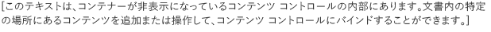
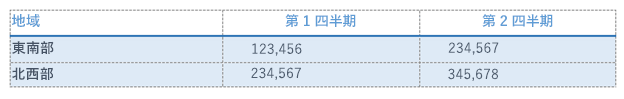
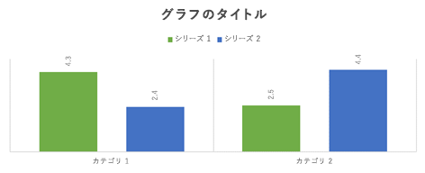
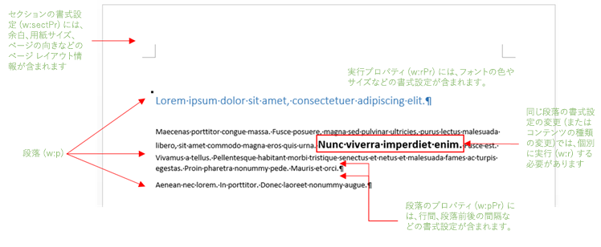
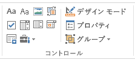

# <a name="create-better-add-ins-for-word-with-office-open-xml"></a><span data-ttu-id="1577b-102">Office Open XML を使用してより良い Word 用アドインを作成する</span><span class="sxs-lookup"><span data-stu-id="1577b-102">Create better add-ins for Word with Office Open XML</span></span>

<span data-ttu-id="1577b-103">**提供元:** Stephanie Krieger, Microsoft Corporation | Juan Balmori Labra, Microsoft Corporation</span><span class="sxs-lookup"><span data-stu-id="1577b-103">**Provided by:** Stephanie Krieger, Microsoft Corporation | Juan Balmori Labra, Microsoft Corporation</span></span>

<span data-ttu-id="1577b-p101">Word で実行する Office アドインを作成している場合、JavaScript API for Office (Office.js) がコンテンツの読み取りと書き込みのための書式をいくつか提供することはご存じのことと思います。そのような書式は強制タイプと呼ばれ、プレーン テキスト、表、HTML、Office Open XML が含まれています。</span><span class="sxs-lookup"><span data-stu-id="1577b-p101">If you're building Office Add-ins to run in Word, you might already know that the JavaScript API for Office (Office.js) offers several formats for reading and writing document content. These are called coercion types, and they include plain text, tables, HTML, and Office Open XML.</span></span>

<span data-ttu-id="1577b-p102">それでは、イメージ、書式設定された表、グラフ、あるいは書式設定だけされたテキストをドキュメントに追加する必要があるとき、何を選択しますか。画像などの一部のリッチ コンテンツを挿入するために、HTML を使用できます。シナリオによっては、コンテンツで使用できる書式設定および配置に関する制限など、HTML 強制型変換にとって不利な点が存在する場合があります。Office Open XML は、Word 文書 (.docx、.dotx など) が記述される言語であるため、Word 文書にユーザーが追加できるコンテンツであれば、ユーザーにとって適用可能なほぼすべてのタイプの書式設定で、事実上あらゆるタイプのコンテンツを挿入できます。処理する Office Open XML マークアップを判別するのは、想像しているよりも簡単です。</span><span class="sxs-lookup"><span data-stu-id="1577b-p102">So what are your options when you need to add rich content to a document, such as images, formatted tables, charts, or even just formatted text? You can use HTML for inserting some types of rich content, such as pictures. Depending on your scenario, there can be drawbacks to HTML coercion, such as limitations in the formatting and positioning options available to your content. Because Office Open XML is the language in which Word documents (such as .docx and .dotx) are written, you can insert virtually any type of content that a user can add to a Word document, with virtually any type of formatting the user can apply. Determining the Office Open XML markup you need to get it done is easier than you might think.</span></span>

> [!NOTE]
> <span data-ttu-id="1577b-p103">Office Open XML は PowerPoint と Excel (ならびに、Office 2013 以降、Visio) ドキュメントの言語です。ただし、現在のところは、Word 用に作成された Office アドインでのみ、Office Open XML としてコンテンツを型強制できます。完全な言語リファレンス ドキュメントなど、Office Open XML に関する詳細は、「[その他の技術情報](#see-also)」を参照してください。</span><span class="sxs-lookup"><span data-stu-id="1577b-p103">Office Open XML is also the language behind PowerPoint and Excel (and, as of Office 2013, Visio) documents. However, currently, you can coerce content as Office Open XML only in Office Add-ins created for Word. For more information about Office Open XML, including the complete language reference documentation, see [Additional resources](#see-also).</span></span>

<span data-ttu-id="1577b-p104">まず初めに、Office Open XML の強制型変換を使用して挿入できるコンテンツ タイプの一部を見てみましょう。コード サンプル [Word-Add-in-Load-and-write-Open-XML](https://github.com/OfficeDev/Word-Add-in-Load-and-write-Open-XML) をダウンロードします。これには、次のいずれの例を Word に挿入するにも必要な Office Open XML マークアップおよび Office.js コードが含まれます。</span><span class="sxs-lookup"><span data-stu-id="1577b-p104">To begin, take a look at some of the content types you can insert using Office Open XML coercion. Download the code sample [Word-Add-in-Load-and-write-Open-XML](https://github.com/OfficeDev/Word-Add-in-Load-and-write-Open-XML), which contains the Office Open XML markup and Office.js code required for inserting any of the following examples into Word.</span></span>

> [!NOTE]
> <span data-ttu-id="1577b-116">この記事全体で、**コンテンツ タイプ**という用語と**リッチ コンテンツ**という用語は、Word ドキュメントに挿入できるタイプのリッチ コンテンツを意味します。</span><span class="sxs-lookup"><span data-stu-id="1577b-116">Throughout this article, the terms  **content types** and **rich content** refer to the types of rich content you can insert into a Word document.</span></span>


<span data-ttu-id="1577b-117">*図 1. 書式が直接設定されたテキスト*</span><span class="sxs-lookup"><span data-stu-id="1577b-117">*Figure 1. Text with direct formatting*</span></span>


<span data-ttu-id="1577b-119">直接書式設定を使用すると、ユーザーのドキュメントの既存書式設定に関係なく、テキストの厳密な表示方法を指定できます。</span><span class="sxs-lookup"><span data-stu-id="1577b-119">You can use direct formatting to specify exactly what the text will look like regardless of existing formatting in the user's document.</span></span>

<span data-ttu-id="1577b-120">*図 2. スタイルを使用して書式設定されたテキスト*</span><span class="sxs-lookup"><span data-stu-id="1577b-120">*Figure 2. Text formatted using a style*</span></span>


<span data-ttu-id="1577b-122">スタイルを使用し、挿入するテキストの表示をユーザーのドキュメントに合わせて自動的に調整できます。</span><span class="sxs-lookup"><span data-stu-id="1577b-122">You can use a style to automatically coordinate the look of text you insert with the user's document.</span></span>

<span data-ttu-id="1577b-123">*図 3. 単純なイメージ*</span><span class="sxs-lookup"><span data-stu-id="1577b-123">*Figure 3. A simple image*</span></span>


<span data-ttu-id="1577b-125">同じ方法を使用して、Office でサポートされるイメージ書式を挿入できます。</span><span class="sxs-lookup"><span data-stu-id="1577b-125">You can use the same method for inserting any Office-supported image format.</span></span>

<span data-ttu-id="1577b-126">*図 4. ピクチャのスタイルと効果を使用して書式設定されたイメージ*</span><span class="sxs-lookup"><span data-stu-id="1577b-126">*Figure 4. An image formatted using picture styles and effects*</span></span>


<span data-ttu-id="1577b-128">高品質の書式設定と効果をイメージに追加するとき、必要なマークアップは予想よりずっと少なくなります。</span><span class="sxs-lookup"><span data-stu-id="1577b-128">Adding high quality formatting and effects to your images requires much less markup than you might expect.</span></span>

<span data-ttu-id="1577b-129">*図 5. コンテンツ コントロール*</span><span class="sxs-lookup"><span data-stu-id="1577b-129">*Figure 5. A content control*</span></span>




<span data-ttu-id="1577b-131">アドインでコンテンツ コントロールを使用し、選択範囲ではなく、指定した (バインドした) 位置にコンテンツを追加できます。</span><span class="sxs-lookup"><span data-stu-id="1577b-131">You can use content controls with your add-in to add content at a specified (bound) location rather than at the selection.</span></span>

<span data-ttu-id="1577b-132">*図 6. ワードアートが書式設定されたテキスト ボックス*</span><span class="sxs-lookup"><span data-stu-id="1577b-132">*Figure 6. A text box with WordArt formatting*</span></span>


<span data-ttu-id="1577b-134">Word では、テキスト ボックス (図参照) 内のテキストに、または通常の本文テキストにテキスト効果を利用できます。</span><span class="sxs-lookup"><span data-stu-id="1577b-134">Text effects are available in Word for text inside a text box (as shown here) or for regular body text.</span></span>

<span data-ttu-id="1577b-135">*図 7. 図形*</span><span class="sxs-lookup"><span data-stu-id="1577b-135">*Figure 7. A shape*</span></span>


<span data-ttu-id="1577b-137">テキストと書式設定効果ありで (なしで)、組み込みまたはカスタムの描画図形を挿入できます。</span><span class="sxs-lookup"><span data-stu-id="1577b-137">You can insert built-in or custom drawing shapes, with or without text and formatting effects.</span></span>

<span data-ttu-id="1577b-138">*図 8. 直接書式設定の表*</span><span class="sxs-lookup"><span data-stu-id="1577b-138">*Figure 8. A table with direct formatting*</span></span>




<span data-ttu-id="1577b-140">必要なテキスト書式設定、境界線、影、セルサイズ変更、表書式設定を追加できます。</span><span class="sxs-lookup"><span data-stu-id="1577b-140">You can include text formatting, borders, shading, cell sizing, or any table formatting you need.</span></span>

<span data-ttu-id="1577b-141">*図 9. 表スタイルを使用して書式設定されたテーブル*</span><span class="sxs-lookup"><span data-stu-id="1577b-141">*Figure 9. A table formatted using a table style*</span></span>


<span data-ttu-id="1577b-143">テキストに段落スタイルを使用するのと同じくらい簡単に、組み込みまたはカスタムの表スタイルを使用できます。</span><span class="sxs-lookup"><span data-stu-id="1577b-143">You can use built-in or custom table styles just as easily as using a paragraph style for text.</span></span>

<span data-ttu-id="1577b-144">*図 10. SmartArt 図*</span><span class="sxs-lookup"><span data-stu-id="1577b-144">*Figure 10. A SmartArt diagram*</span></span>


<span data-ttu-id="1577b-146">Office 2013 は幅広い種類の SmartArt 図レイアウトを提供します (Office Open XML を使用して独自の SmartArt 図を作成することもできます)。</span><span class="sxs-lookup"><span data-stu-id="1577b-146">Office 2013 offers a wide array of SmartArt diagram layouts (and you can use Office Open XML to create your own).</span></span>

<span data-ttu-id="1577b-147">*図 11. グラフ*</span><span class="sxs-lookup"><span data-stu-id="1577b-147">*Figure 11. A chart*</span></span>




<span data-ttu-id="1577b-p105">Word 文書に Excel グラフをライブ グラフとして挿入できます。また、このようなグラフを Word のアドインでも使用できます。先ほどの例でお分かりのように、Office Open XML 強制型変換を使用すると、基本的にはコンテンツの任意の型を挿入できるため、ユーザーは、独自の文書を挿入できます。必要な Open XML マークアップを取得する簡単な方法が 2 つあります。もともと空白の Word 2013 ドキュメントにリッチ コンテンツを追加してから、Word XML ドキュメント形式でファイルを保存するか、[getSelectedDataAsync](https://dev.office.com/reference/add-ins/shared/document.setselecteddataasync) メソッドでテスト アドインを使用して、マークアップを取得します。どちらのアプローチでも、基本的には同じ結果になります。</span><span class="sxs-lookup"><span data-stu-id="1577b-p105">You can insert Excel charts as live charts in Word documents, which also means you can use them in your add-in for Word. As you can see by the preceding examples, you can use Office Open XML coercion to insert essentially any type of content that a user can insert into their own document. There are two simple ways to get theOffice Open XML markup you need. Either add your rich content to an otherwise blank Word 2013 document and then save the file in Word XML Document format or use a test add-in with the [getSelectedDataAsync](https://dev.office.com/reference/add-ins/shared/document.setselecteddataasync) method to grab the markup. Both approaches provide essentially the same result.</span></span>

    
> [!NOTE]
> <span data-ttu-id="1577b-p106">Office Open XML ドキュメントの実体は、ドキュメント コンテンツを表すファイルの圧縮パッケージです。Word XML Document 形式でファイルを保存すると、1 つの XML ファイルに圧縮された完全 Office Open XML パッケージができます。これは、**getSelectedDataAsync** を利用して Office Open XML マークアップを取得すると得られるものでもあります。</span><span class="sxs-lookup"><span data-stu-id="1577b-p106">An Office Open XML document is actually a compressed package of files that represent the document contents. Saving the file in the Word XML Document format gives you the entireOffice Open XML package flattened into one XML file, which is also what you get when using  **getSelectedDataAsync** to retrieve the Office Open XML markup.</span></span>

<span data-ttu-id="1577b-p107">ファイルを Word から XML 形式に保存する場合、[名前を付けて保存] ダイアログ ボックスの [ファイルの種類] リストには、.xml 形式ファイル用に 2 つのオプションがあることに注意してください。Word 2003 のオプションではなく、必ず **[Word XML ドキュメント]** を選んでください。[Word-Add-in-Get-Set-EditOpen-XML](https://github.com/OfficeDev/Word-Add-in-Get-Set-EditOpen-XML) という名前のコード サンプルをダウンロードします。これは、マークアップを取得し、テストするツールとして使用できます。これですべてかというと、そうではありません。多くのシナリオでは、上記の方法のいずれかで表示される、フラット化された完全な Office Open XML の結果を使用することができます。これでうまくいきます。これで、マークアップの大部分が必要なくなります。多くのアドイン開発者がそうですが、Office Open XML マークアップを初めて参照する場合、最も単純なコンテンツに対して指定される大量のマークアップを理解しようとすることは大変な作業に思えるかもしれません。しかし、実際にはそうする必要はありません。このトピックでは、Office アドインの開発者コミュニティから収集したいくつかの一般的なシナリオを使用して、アドインで使用するために Office Open XML を単純化する手法を示します。前に説明したいくつかのタイプのコンテンツ用のマークアップに加えて、Office Open XML ペイロードを最小限に抑えるために必要な情報について取り上げます。さらに、リッチ コンテンツを現在の選択範囲にあるドキュメントに挿入するために必要なコードについて、また、Office Open XML をバインディング オブジェクトとともに使用して、指定した場所でコンテンツを追加または置換する方法について考えます。</span><span class="sxs-lookup"><span data-stu-id="1577b-p107">If you save the file to an XML format from Word, note that there are two options under the Save as Type list in the Save As dialog box for .xml format files. Be sure to choose  **Word XML Document** and not the Word 2003 option. Download the code sample named [Word-Add-in-Get-Set-EditOpen-XML](https://github.com/OfficeDev/Word-Add-in-Get-Set-EditOpen-XML), which you can use as a tool to retrieve and test your markup. So is that all there is to it? Well, not quite. Yes, for many scenarios, you could use the full, flattened Office Open XML result you see with either of the preceding methods and it would work. The good news is that you probably don't need most of that markup. If you're one of the many add-in developers seeing Office Open XML markup for the first time, trying to make sense of the massive amount of markup you get for the simplest piece of content might seem overwhelming, but it doesn't have to be. In this topic, we'll use some common scenarios we've been hearing from the Office Add-ins developer community to show you techniques for simplifying Office Open XML for use in your add-in. We'll explore the markup for some types of content shown earlier along with the information you need for minimizing the Office Open XML payload. We'll also look at the code you need for inserting rich content into a document at the active selection and how to use Office Open XML with the bindings object to add or replace content at specified locations.</span></span>

## <a name="exploring-the-office-open-xml-document-package"></a><span data-ttu-id="1577b-167">Office Open XML ドキュメント パッケージを探る</span><span class="sxs-lookup"><span data-stu-id="1577b-167">Exploring the Office Open XML document package</span></span>


<span data-ttu-id="1577b-p108">[getSelectedDataAsync](https://dev.office.com/reference/add-ins/shared/document.getselecteddataasync) を使用して選択したコンテンツの Office Open XML を取得すると (あるいは、ドキュメントを Word XML Document 形式で保存すると)、選択したコンテンツを表すマークアップだけではなく、ほとんど必要ないオプションと設定が多数付属したドキュメント全体が得られます。事実、作業ウィンドウ アドインを含むドキュメントからそのメソッドを使用すると、取得するマークアップにはその作業ウィンドウ アプリまでもが含まれています。</span><span class="sxs-lookup"><span data-stu-id="1577b-p108">When you use [getSelectedDataAsync](https://dev.office.com/reference/add-ins/shared/document.getselecteddataasync) to retrieve the Office Open XML for a selection of content (or when you save the document in Word XML Document format), what you're getting is not just the markup that describes your selected content; it's an entire document with many options and settings that you almost certainly don't need. In fact, if you use that method from a document that contains a task pane add-in, the markup you get even includes your task pane.</span></span>

<span data-ttu-id="1577b-170">単純な Word ドキュメント パッケージであっても、実際のコンテンツだけではなく、ドキュメント プロパティ、スタイル、テーマ (書式設定)、Web 設定、フォントなどが含まれています。</span><span class="sxs-lookup"><span data-stu-id="1577b-170">Even a simple Word document package includes parts for document properties, styles, theme (formatting settings), web settings, fonts, and then some, in addition to parts for the actual content.</span></span>

<span data-ttu-id="1577b-p109">たとえば、先ほど図 1 で表示されていたように、直接書式が設定されたテキストの 1 段落だけを挿入するとします。**getSelectedDataAsync** を使用し、書式設定されたテキストの Office Open XML を取得すると、大量のマークアップが表示されます。そのマークアップには、図 13 のリストにあるようなパーツ (一般的にはドキュメント パーツと、Office Open XML ではパッケージ パーツと呼ばれています) を含むドキュメント全体を表すパッケージ要素が含まれます。各パーツは、パッケージ内の個別のファイルを表します。</span><span class="sxs-lookup"><span data-stu-id="1577b-p109">For example, say that you want to insert just a paragraph of text with direct formatting, as shown earlier in Figure 1. When you grab the Office Open XML for the formatted text using  **getSelectedDataAsync**, you see a large amount of markup. That markup includes a package element that represents an entire document, which contains several parts (commonly referred to as document parts or, in the Office Open XML, as package parts), as you see listed in Figure 13. Each part represents a separate file within the package.</span></span>


> [!TIP]
> <span data-ttu-id="1577b-p110">メモ帳などのテキスト エディターで、Office Open XML マークアップを編集することができます。Visual Studio 2015 で開く場合、**[編集] > [詳細設定] > [ドキュメントのフォーマット]** (Ctrl キーを押しながら K キーを押し、Ctrl キーを押しながら D キーを押す) の順に選択して、簡単に編集できるようにパッケージを書式設定できます。次に図 12 で示すように、ドキュメントの一部またはセクションを折りたたんだり、展開したりして、Office Open XML パッケージのコンテンツをより簡単に確認したり、編集したりすることができます。各ドキュメントの部分は **pkg:part** タグから始まります。</span><span class="sxs-lookup"><span data-stu-id="1577b-p110">You can edit Office Open XML markup in a text editor like Notepad. If you open it in Visual Studio 2015, you can use  **Edit >Advanced > Format Document** (Ctrl+K, Ctrl+D) to format the package for easier editing. Then you can collapse or expand document parts or sections of them, as shown in Figure 12, to more easily review and edit the content of the Office Open XML package. Each document part begins with a **pkg:part** tag.</span></span>


<span data-ttu-id="1577b-179">*図 12. Visual Studio 2015 で簡単に編集するためのパッケージ パーツの圧縮と展開*</span><span class="sxs-lookup"><span data-stu-id="1577b-179">*Figure 12. Collapse and expand package parts for easier editing in Visual Studio 2015*</span></span>


<span data-ttu-id="1577b-181">*図 13. 基本的な Word Office Open XML ドキュメント パッケージに含まれるパーツ*</span><span class="sxs-lookup"><span data-stu-id="1577b-181">*Figure 13. The parts included in a basic Word Office Open XML document package*</span></span>


<span data-ttu-id="1577b-183">これだけたくさんマークアップが存在するのに、書式設定されたテキスト例を挿入するために実際に必要な要素は .rels パーツと document.xml パーツだけであることを知ったら驚かれることでしょう。</span><span class="sxs-lookup"><span data-stu-id="1577b-183">With all that markup, you might be surprised to discover that the only elements you actually need to insert the formatted text example are pieces of the .rels part and the document.xml part.</span></span>


    
> [!NOTE]
> <span data-ttu-id="1577b-p111">パッケージ タグの上にあるマークアップの 2 行 (バージョンと Office プログラム ID の XML 宣言) は、Office Open XML 強制型変換を使用するときに採用されます。そのため、自分で追加する必要はありません。編集したマークアップを Word ドキュメントとして開き、テストする場合、そのまま利用してください。</span><span class="sxs-lookup"><span data-stu-id="1577b-p111">The two lines of markup above the package tag (the XML declarations for version and Office program ID) are assumed when you use the Office Open XML coercion type, so you don't need to include them. Keep them if you want to open your edited markup as a Word document to test it.</span></span>

<span data-ttu-id="1577b-p112">このトピックの最初で示したコンテンツのその他のタイプには、(図 13 に表示されている以外に) 追加のパーツを必要とするものもあります。それらについてはこのトピックの後半で説明します。それまでの間、Word ドキュメント パッケージのマークアップでは、図 13 に表示されている大部分のパーツに遭遇することになるので、各パーツの概要とそれが必要とされるタイミングについて簡単に説明します。</span><span class="sxs-lookup"><span data-stu-id="1577b-p112">Several of the other types of content shown at the start of this topic require additional parts as well (beyond those shown in Figure 13), and we'll address those later in this topic. Meanwhile, since you'll see most of the parts shown in Figure 13 in the markup for any Word document package, here's a quick summary of what each of these parts is for and when you need it:</span></span>


- <span data-ttu-id="1577b-p113">パッケージ タグ内部の最初のパーツは .rels ファイルです。これはパッケージの上位レベルのパーツ (一般的には、ドキュメント プロパティ、存在する場合はサムネイル、ドキュメント本文) 間のリレーションシップを定義します。ドキュメント本文 (コンテンツが置かれる場所) とドキュメント パッケージとのリレーションシップを定義する必要があるので、このパーツのコンテンツの一部は常にマークアップで必要です。</span><span class="sxs-lookup"><span data-stu-id="1577b-p113">Inside the package tag, the first part is the .rels file, which defines relationships between the top-level parts of the package (these are typically the document properties, thumbnail (if any), and main document body). Some of the content in this part is always required in your markup because you need to define the relationship of the main document part (where your content resides) to the document package.</span></span>
    
- <span data-ttu-id="1577b-190">document.xml (本文) パーツに必要な追加パーツが存在する場合、そのリレーションシップが document.xml.rels パーツにより定義されます。</span><span class="sxs-lookup"><span data-stu-id="1577b-190">The document.xml.rels part defines relationships for additional parts required by the document.xml (main body) part, if any.</span></span> 
    

    
   > [!IMPORTANT]
   > <span data-ttu-id="1577b-p114">パッケージの .rels ファイル (top-level .rels、document.xml.rels、および特定のタイプのコンテンツで遭遇するその他のファイル) はガイドとして使用できる非常に重要なツールであり、Office Open XML パッケージをすばやく編集できます。編集方法に関する詳細は、本トピックの後半にある「[独自のマークアップを作成する: ベスト プラクティス](#creating-your-own-markup-best-practices)」を参照してください。</span><span class="sxs-lookup"><span data-stu-id="1577b-p114">The .rels files in your package (such as the top-level .rels, document.xml.rels, and others you may see for specific types of content) are an extremely important tool that you can use as a guide for helping you quickly edit down your Office Open XML package. To learn more about how to do this, see [Creating your own markup: best practices](#creating-your-own-markup-best-practices) later in this topic.</span></span>


- <span data-ttu-id="1577b-p115">document.xml パーツはドキュメントの本文のコンテンツです。コンテンツが表示される部分であるため、もちろんこのパーツの要素は必要です。しかしながら、このパーツに表示されるすべてが必要なわけではありません。これについては後で詳しく説明します。</span><span class="sxs-lookup"><span data-stu-id="1577b-p115">The document.xml part is the content in the main body of the document. You need elements of this part, of course, since that's where your content appears. But, you don't need everything you see in this part. We'll look at that in more detail later.</span></span>
    
- <span data-ttu-id="1577b-p116">多くのパーツは、Office Open XML 強制型変換を利用してドキュメントにコンテンツを挿入するときに Set メソッドにより自動的に無視されます。そのため、削除してもかまいません。このようなパーツには、theme1.xml ファイル (ドキュメントの書式設定テーマ)、ドキュメントのプロパティ パーツ (コア、アドイン、サムネイル)、設定ファイル (settings、webSettings、fontTable を含む) が含まれます。</span><span class="sxs-lookup"><span data-stu-id="1577b-p116">Many parts are automatically ignored by the Set methods when inserting content into a document using Office Open XML coercion, so you might as well remove them. These include the theme1.xml file (the document's formatting theme), the document properties parts (core, add-in, and thumbnail), and setting files (including settings, webSettings, and fontTable).</span></span>
    
- <span data-ttu-id="1577b-p117">図 1 の例では、テキストの書式設定が直接適用されています (つまり、各フォントおよび段落の書式設定が個別に適用されます)。ただし、先の図 2 のように、スタイルを使用する場合 (たとえば、変換先ドキュメントの見出し 1 スタイルの書式設定をテキストに自動的に適用する場合)、styles.xml パーツとそのリレーションシップ定義が必要になります。詳しくは、トピックのセクション「[追加の Office Open XML パーツを使用するオブジェクトの追加](#adding-objects-that-use-additional-office-open-xml-parts)」を参照してください。</span><span class="sxs-lookup"><span data-stu-id="1577b-p117">In the Figure 1 example, text formatting is directly applied (that is, each font and paragraph formatting setting applied individually). But, if you use a style (such as if you want your text to automatically take on the formatting of the Heading 1 style in the destination document) as shown earlier in Figure 2, then you would need part of the styles.xml part as well as a relationship definition for it. For more information, see the topic section [Adding objects that use additional Office Open XML parts](#adding-objects-that-use-additional-office-open-xml-parts).</span></span>
    

## <a name="inserting-document-content-at-the-selection"></a><span data-ttu-id="1577b-202">選択した場所にドキュメント コンテンツを挿入する</span><span class="sxs-lookup"><span data-stu-id="1577b-202">Inserting document content at the selection</span></span>


<span data-ttu-id="1577b-203">それでは、図 1 の書式設定テキスト例に必要な最小 Office Open XML マークアップと、ドキュメントでアクティブになっている選択箇所に挿入するために必要な JavaScript について見てみましょう。</span><span class="sxs-lookup"><span data-stu-id="1577b-203">Let's take a look at the minimal Office Open XML markup required for the formatted text example shown in Figure 1 and the JavaScript required for inserting it at the active selection in the document.</span></span>


### <a name="simplified-office-open-xml-markup"></a><span data-ttu-id="1577b-204">単純化された Office Open XML マークアップ</span><span class="sxs-lookup"><span data-stu-id="1577b-204">Simplified Office Open XML markup</span></span>

<span data-ttu-id="1577b-p118">前のセクションで説明したように、ここの Office Open XML 例は編集してあり、必要なドキュメント パーツとそのパーツ内で必要な要素のみを残しています。トピックの次のセクションでは、自分でマークアップを編集する方法について順を追って説明します (また、ここに残す部分について少し説明します)。</span><span class="sxs-lookup"><span data-stu-id="1577b-p118">We've edited the Office Open XML example shown here, as described in the preceding section, to leave just required document parts and only required elements within each of those parts. We'll walk through how to edit the markup yourself (and explain a bit more about the pieces that remain here) in the next section of the topic.</span></span>


```XML
<pkg:package xmlns:pkg="http://schemas.microsoft.com/office/2006/xmlPackage">
  <pkg:part pkg:name="/_rels/.rels" pkg:contentType="application/vnd.openxmlformats-package.relationships+xml" pkg:padding="512">
    <pkg:xmlData>
      <Relationships xmlns="http://schemas.openxmlformats.org/package/2006/relationships">
        <Relationship Id="rId1" Type="http://schemas.openxmlformats.org/officeDocument/2006/relationships/officeDocument" Target="word/document.xml"/>
      </Relationships>
    </pkg:xmlData>
  </pkg:part>
  <pkg:part pkg:name="/word/document.xml" pkg:contentType="application/vnd.openxmlformats-officedocument.wordprocessingml.document.main+xml">
    <pkg:xmlData>
      <w:document xmlns:w="http://schemas.openxmlformats.org/wordprocessingml/2006/main" >
        <w:body>
          <w:p>
            <w:pPr>
              <w:spacing w:before="360" w:after="0" w:line="480" w:lineRule="auto"/>
              <w:rPr>
                <w:color w:val="70AD47" w:themeColor="accent6"/>
                <w:sz w:val="28"/>
              </w:rPr>
            </w:pPr>
            <w:r>
              <w:rPr>
                <w:color w:val="70AD47" w:themeColor="accent6"/>
                <w:sz w:val="28"/>
              </w:rPr>
              <w:t>This text has formatting directly applied to achieve its font size, color, line spacing, and paragraph spacing.</w:t>
            </w:r>
          </w:p>
        </w:body>
      </w:document>
    </pkg:xmlData>
  </pkg:part>
</pkg:package>
```


> [!NOTE]
> <span data-ttu-id="1577b-p119">ここに示すマークアップを XML ファイルに追加し、バージョンと mso アプリケーションの XML 宣言タグ (図 13) をファイルの先頭に追加すると、そのファイルを Word ドキュメントとして Word で開くことができます。あるいは、これらのタグがなくても、Word で **[ファイル] > [開く]** を使って開くことができます。これが 2013 ドキュメントであることを Word に伝える設定を削除したため、Word 2013 のタイトル バーに **[互換性モード] **が表示されます。このマークアップを既存の Word 2013 ドキュメントに追加するので、コンテンツはまったく影響を受けません。</span><span class="sxs-lookup"><span data-stu-id="1577b-p119">If you add the markup shown here to an XML file along with the XML declaration tags for version and mso-application at the top of the file (shown in Figure 13), you can open it in Word as a Word document. Or, without those tags, you can still open it using  **File> Open** in Word. You'll see **Compatibility Mode** on the title bar in Word 2013, because you removed the settings that tell Word this is a 2013 document. Since you're adding this markup to an existing Word 2013 document, that won't affect your content at all.</span></span>


### <a name="javascript-for-using-setselecteddataasync"></a><span data-ttu-id="1577b-211">setSelectedDataAsync を使用するための JavaScript</span><span class="sxs-lookup"><span data-stu-id="1577b-211">JavaScript for using setSelectedDataAsync</span></span>


<span data-ttu-id="1577b-212">先ほどの Office Open XML をお使いのソリューションからアクセスできない XML ファイルとして保存する場合、次の関数を使用し、Office Open XML 強制型変換を使用してドキュメントの書式設定テキスト コンテンツを設定できます。</span><span class="sxs-lookup"><span data-stu-id="1577b-212">Once you save the preceding Office Open XML as an XML file that's accessible from your solution, you can use the following function to set the formatted text content in the document using Office Open XML coercion.</span></span> 

<span data-ttu-id="1577b-p120">この関数では、最後の行を除くすべてを使用し、関数の終わりの [setSelectedDataAsync](https://dev.office.com/reference/add-ins/shared/document.setselecteddataasync) メソッド呼び出しで使用するために保存したマークアップを取得します。**setSelectedDataASync** では、挿入するコンテンツと強制型変換タイプを指定することのみが要求されます。</span><span class="sxs-lookup"><span data-stu-id="1577b-p120">In this function, notice that all but the last line are used to get your saved markup for use in the [setSelectedDataAsync](https://dev.office.com/reference/add-ins/shared/document.setselecteddataasync) method call at the end of the function. **setSelectedDataASync** requires only that you specify the content to be inserted and the coercion type.</span></span>


> [!NOTE]
> <span data-ttu-id="1577b-p121">_yourXMLfilename_ をソリューションに保存した XML ファイルの名前とパスで置き換えます。ソリューションで XML ファイルを追加する場所がわからない場合、またはコードでのそれらの参照方法がわからない場合は、[Word-Add-in-Load-and-write-Open-XML](https://github.com/OfficeDev/Word-Add-in-Load-and-write-Open-XML) コード サンプルを見て、その例とここに示すマークアップおよび JavaScript の動作例を確認してください。</span><span class="sxs-lookup"><span data-stu-id="1577b-p121">Replace  _yourXMLfilename_ with the name and path of the XML file as you've saved it in your solution. If you're not sure where to include XML files in your solution or how to reference them in your code, see the [Word-Add-in-Load-and-write-Open-XML](https://github.com/OfficeDev/Word-Add-in-Load-and-write-Open-XML) code sample for examples of that and a working example of the markup and JavaScript shown here.</span></span>


```js
function writeContent() {
    var myOOXMLRequest = new XMLHttpRequest();
    var myXML;
    myOOXMLRequest.open('GET', 'yourXMLfilename', false);
    myOOXMLRequest.send();
    if (myOOXMLRequest.status === 200) {
        myXML = myOOXMLRequest.responseText;
    }
    Office.context.document.setSelectedDataAsync(myXML, { coercionType: 'ooxml' });
}
```


## <a name="creating-your-own-markup-best-practices"></a><span data-ttu-id="1577b-217">独自のマークアップを作成する: ベスト プラクティス</span><span class="sxs-lookup"><span data-stu-id="1577b-217">Creating your own markup: best practices</span></span>


<span data-ttu-id="1577b-218">それでは、先ほどの書式設定テキスト例を挿入するために必要なマークアップについて詳しく見てみましょう。</span><span class="sxs-lookup"><span data-stu-id="1577b-218">Let's take a closer look at the markup you need to insert the preceding formatted text example.</span></span>

<span data-ttu-id="1577b-p122">この例では、.rels と document.xml 以外のすべてのドキュメント パーツをパッケージから削除することから始めます。次に、後続の作業を簡単にするために、これら 2 つの必須パーツを編集します。</span><span class="sxs-lookup"><span data-stu-id="1577b-p122">For this example, start by simply deleting all document parts from the package other than .rels and document.xml. Then, we'll edit those two required parts to simplify things further.</span></span>


> [!IMPORTANT]
> <span data-ttu-id="1577b-p123">.rels パーツは、パッケージに含めるパーツをすばやく判断し、完全に削除できるパーツ (つまり、コンテンツに関係ない、またはコンテンツに参照されないパーツ) を判断するためのマップとして使用します。すべてのドキュメント パーツについて、パッケージにリレーションシップを定義する必要があることと、それらのリレーションシップが .rels ファイルに表示されることに注意してください。そのため、.rels、document.xml.rels、コンテンツ固有 .rels ファイルのいずれかにそれらのすべてが一覧表示される必要があります。</span><span class="sxs-lookup"><span data-stu-id="1577b-p123">Use the .rels parts as a map to quickly gauge what's included in the package and determine what parts you can delete completely (that is, any parts not related to or referenced by your content). Remember that every document part must have a relationship defined in the package and those relationships appear in the .rels files. So you should see all of them listed in either .rels, document.xml.rels, or a content-specific .rels file.</span></span>

<span data-ttu-id="1577b-p124">次のマークアップは、編集前に必要な .rels パーツを示しています。アドインおよびコア ドキュメント プロパティ パーツとサムネイル パーツを削除するため、.rels からもこれらのリレーションシップを削除する必要があります。document.xml のリレーションシップのみが残ることに注意してください (次の例で関係 ID が "rID1" のもの)。</span><span class="sxs-lookup"><span data-stu-id="1577b-p124">The following markup shows the required .rels part before editing. Since we're deleting the add-in and core document property parts, and the thumbnail part, we need to delete those relationships from .rels as well. Notice that this will leave only the relationship (with the relationship ID "rID1" in the following example) for document.xml.</span></span>


```XML
<pkg:part pkg:name="/_rels/.rels" pkg:contentType="application/vnd.openxmlformats-package.relationships+xml" pkg:padding="512">
  <pkg:xmlData>
    <Relationships xmlns="http://schemas.openxmlformats.org/package/2006/relationships">
      <Relationship Id="rId3" Type="http://schemas.openxmlformats.org/package/2006/relationships/metadata/core-properties" Target="docProps/core.xml"/>
      <Relationship Id="rId2" Type="http://schemas.openxmlformats.org/package/2006/relationships/metadata/thumbnail" Target="docProps/thumbnail.emf"/>
      <Relationship Id="rId1" Type="http://schemas.openxmlformats.org/officeDocument/2006/relationships/officeDocument" Target="word/document.xml"/>
      <Relationship Id="rId4" Type="http://schemas.openxmlformats.org/officeDocument/2006/relationships/extended-properties" Target="docProps/app.xml"/>
    </Relationships>
  </pkg:xmlData>
</pkg:part>
```


> [!IMPORTANT]
> <span data-ttu-id="1577b-p125">パッケージから完全に削除するパーツのリレーションシップ (つまり、**Relationship** タグ) を削除します。対応するリレーションシップなしでパーツを追加するか、パーツを除外してもパッケージにそのリレーションシップを残した場合、エラーが発生します。</span><span class="sxs-lookup"><span data-stu-id="1577b-p125">Remove the relationships (that is, the **Relationship** tag) for any parts that you completely remove from the package. Including a part without a corresponding relationship, or excluding a part and leaving its relationship in the package, will result in an error.</span></span>

<span data-ttu-id="1577b-229">次のマークアップは、書式設定されたテキスト コンテンツのサンプルを含む、編集前の document.xml パーツを示しています。</span><span class="sxs-lookup"><span data-stu-id="1577b-229">The following markup shows the document.xml part, which includes our sample formatted text content before editing.</span></span>

```XML
<pkg:part pkg:name="/word/document.xml" pkg:contentType="application/vnd.openxmlformats-officedocument.wordprocessingml.document.main+xml">
    <pkg:xmlData>
      <w:document mc:Ignorable="w14 w15 wp14" xmlns:wpc="http://schemas.microsoft.com/office/word/2010/wordprocessingCanvas" xmlns:mc="http://schemas.openxmlformats.org/markup-compatibility/2006" xmlns:o="urn:schemas-microsoft-com:office:office" xmlns:r="http://schemas.openxmlformats.org/officeDocument/2006/relationships" xmlns:m="http://schemas.openxmlformats.org/officeDocument/2006/math" xmlns:v="urn:schemas-microsoft-com:vml" xmlns:wp14="http://schemas.microsoft.com/office/word/2010/wordprocessingDrawing" xmlns:wp="http://schemas.openxmlformats.org/drawingml/2006/wordprocessingDrawing" xmlns:w10="urn:schemas-microsoft-com:office:word" xmlns:w="http://schemas.openxmlformats.org/wordprocessingml/2006/main" xmlns:w14="http://schemas.microsoft.com/office/word/2010/wordml" xmlns:w15="http://schemas.microsoft.com/office/word/2012/wordml" xmlns:wpg="http://schemas.microsoft.com/office/word/2010/wordprocessingGroup" xmlns:wpi="http://schemas.microsoft.com/office/word/2010/wordprocessingInk" xmlns:wne="http://schemas.microsoft.com/office/word/2006/wordml" xmlns:wps="http://schemas.microsoft.com/office/word/2010/wordprocessingShape">
        <w:body>
          <w:p>
            <w:pPr>
              <w:spacing w:before="360" w:after="0" w:line="480" w:lineRule="auto"/>
              <w:rPr>
                <w:color w:val="70AD47" w:themeColor="accent6"/>
                <w:sz w:val="28"/>
              </w:rPr>
            </w:pPr>
            <w:r>
              <w:rPr>
                <w:color w:val="70AD47" w:themeColor="accent6"/>
                <w:sz w:val="28"/>
              </w:rPr>
              <w:t>This text has formatting directly applied to achieve its font size, color, line spacing, and paragraph spacing.</w:t>
            </w:r>
            <w:bookmarkStart w:id="0" w:name="_GoBack"/>
            <w:bookmarkEnd w:id="0"/>
          </w:p>
          <w:p/>
          <w:sectPr>
            <w:pgSz w:w="12240" w:h="15840"/>
            <w:pgMar w:top="1440" w:right="1440" w:bottom="1440" w:left="1440" w:header="720" w:footer="720" w:gutter="0"/>
            <w:cols w:space="720"/>
          </w:sectPr>
        </w:body>
      </w:document>
    </pkg:xmlData>
</pkg:part>
```

<span data-ttu-id="1577b-p126">document.xml はコンテンツを置く主要なドキュメント パーツであるため、このパーツについて簡単に説明します (この一覧の後の図 14 では、コア コンテンツの一部およびここで説明する書式設定タグが、Word ドキュメントで表示される内容とどのように関連するかを示すため、視覚的に表示します)。</span><span class="sxs-lookup"><span data-stu-id="1577b-p126">Since document.xml is the primary document part where you place your content, let's take a quick walk through that part. (Figure 14, which follows this list, provides a visual reference to show how some of the core content and formatting tags explained here relate to what you see in a Word document.)</span></span> 


- <span data-ttu-id="1577b-p127">冒頭の **w:document** タグには、いくつかの名前空間 (**xmlns**) のリストが含まれます。これらの名前空間の多くは特定のタイプのコンテンツを参照するため、お使いのコンテンツに関連する場合にのみ必要です。</span><span class="sxs-lookup"><span data-stu-id="1577b-p127">The opening **w:document** tag includes several namespace ( **xmlns** ) listings. Many of those namespaces refer to specific types of content and you only need them if they're relevant to your content.</span></span>
    
    <span data-ttu-id="1577b-p128">ドキュメント パーツ全体のタグのプレフィックスが名前空間を参照していることに注意してください。この例では、document.xml パーツ全体のタグで使用されているプレフィックスは **w:** だけなので、冒頭の **w:document** タグに残しておく必要がある名前区間は **xmlns:w** だけです。</span><span class="sxs-lookup"><span data-stu-id="1577b-p128">Notice that the prefix for the tags throughout a document part refers back to the namespaces. In this example, the only prefix used in the tags throughout the document.xml part is  **w:**, so the only namespace that we need to leave in the opening **w:document** tag is **xmlns:w**.</span></span>
    

> [!TIP]
> <span data-ttu-id="1577b-p129">マークアップを Visual Studio 2015 で編集する場合、何らかのパーツの名前空間を削除したら、そのパーツのすべてのタグを調べます。マークアップに必要な名前空間を削除している場合、影響を受けたタグの関連プレフィックスに赤い波下線が表示されます。**xmlns:mc** 名前空間を削除した場合は、名前空間一覧に優先する **mc:Ignorable** 属性も削除する必要があります。</span><span class="sxs-lookup"><span data-stu-id="1577b-p129">If you're editing your markup in Visual Studio 2015, after you delete namespaces in any part, look through all tags of that part. If you've removed a namespace that's required for your markup, you'll see a red squiggly underline on the relevant prefix for affected tags. If you remove the **xmlns:mc** namespace, you must also remove the **mc:Ignorable** attribute that precedes the namespace listings.</span></span>


- <span data-ttu-id="1577b-239">冒頭の body タグの内部に、段落タグ (**w:p**) が表示され、この例のサンプル コンテンツが表示されます。</span><span class="sxs-lookup"><span data-stu-id="1577b-239">Inside the opening body tag, you see a paragraph tag ( **w:p** ), which includes our sample content for this example.</span></span>
    
- <span data-ttu-id="1577b-p130">**w:pPr** タグには、段落の前後の空間、段落の位置合わせ、字下げなど、直接適用される段落書式設定のプロパティが含まれます (直接書式設定は、スタイルの一部としてではなく、コンテンツに個別に適用する属性を参照します)。またこのタグには、段落全体に適用されるフォントの直接書式設定が、サンプルに設定されたフォントの色とサイズを含む、入れ子になった **w:rPr** (run プロパティ) タグ内に含まれます。</span><span class="sxs-lookup"><span data-stu-id="1577b-p130">The **w:pPr** tag includes properties for directly-applied paragraph formatting, such as space before or after the paragraph, paragraph alignment, or indents. (Direct formatting refers to attributes that you apply individually to content rather than as part of a style.) This tag also includes direct font formatting that's applied to the entire paragraph, in a nested **w:rPr** (run properties) tag, which contains the font color and size set in our sample.</span></span>
    

   > [!NOTE]
   > <span data-ttu-id="1577b-p131">Word Office Open XML マークアップ内のフォント サイズおよび他のいくつかの書式設定では、実際の 2 倍のサイズのように表示されることがあります。これは、段落や行間、および上記のマークアップに表示される書式プロパティが twip (ポイントの 20 分の 1) 単位で指定されているためです。Office Open XML で使用するコンテンツの種類に応じて、英語のメートル法 (1 インチあたり 914,400 Emu) を含むいくつかの追加単位が使用されていることがあります。これは、Office Art (drawingML) の一部の値に使用されます。また実際の 100,000 倍の値が使用されていることがあります。この値は、drawingML と PowerPoint のマークアップの両方で使用されます。PowerPoint でも一部の値は実際の 100 倍の値として表されますが、Excel では通常実際の値が使用されます。</span><span class="sxs-lookup"><span data-stu-id="1577b-p131">You might notice that font sizes and some other formatting settings in Word Office Open XML markup look like they're double the actual size. That's because paragraph and line spacing, as well some section formatting properties shown in the preceding markup, are specified in twips (one-twentieth of a point). Depending on the types of content you work with in Office Open XML, you may see several additional units of measure, including English Metric Units (914,400 EMUs to an inch), which are used for some Office Art (drawingML) values and 100,000 times actual value, which is used in both drawingML and PowerPoint markup. PowerPoint also expresses some values as 100 times actual and Excel commonly uses actual values.</span></span>


- <span data-ttu-id="1577b-p132">段落内で、サンプル テキストのように、同様のプロパティを持つコンテンツが実行に含まれます (**w:r**)。書式設定またはコンテンツ タイプに変更があるたびに、新しい実行が開始します。(つまり、サンプル テキストの 1 文字だけが太字であれば、それは独自の実行に分類されます。) この例では、コンテンツに 1 つだけのテキスト実行が含まれます。</span><span class="sxs-lookup"><span data-stu-id="1577b-p132">Within a paragraph, any content with like properties is included in a run ( **w:r** ), such as is the case with the sample text. Each time there's a change in formatting or content type, a new run starts. (That is, if just one word in the sample text was bold, it would be separated into its own run.) In this example, the content includes just the one text run.</span></span>
    
    <span data-ttu-id="1577b-249">このサンプルに含まれる書式設定はフォントの書式設定 (つまり、わずか 1 文字に適用される書式設定) であるため、個別実行のプロパティにも表示されることに注意してください。</span><span class="sxs-lookup"><span data-stu-id="1577b-249">Notice that, because the formatting included in this sample is font formatting (that is, formatting that can be applied to as little as one character), it also appears in the properties for the individual run.</span></span> 
    
- <span data-ttu-id="1577b-p133">既定で Word 2013 ドキュメントに現れる非表示の "_GoBack" ブックマーク (**w:bookmarkStart** と **w:bookmarkEnd**) のタグにも注意が必要です。マークアップからいつでも、GoBack ブックマークの開始タグと終了タグを削除することができます。</span><span class="sxs-lookup"><span data-stu-id="1577b-p133">Also notice the tags for the hidden "_GoBack" bookmark (**w:bookmarkStart** and **w:bookmarkEnd** ), which appear in Word 2013 documents by default. You can always delete the start and end tags for the GoBack bookmark from your markup.</span></span>
    
- <span data-ttu-id="1577b-p134">ドキュメント本体の最後の部分は **w:sectPr** タグまたはセクション プロパティです。このタグには余白やページ方向などの設定が含まれます。**setSelectedDataAsync** を利用して挿入したコンテンツは、既定でターゲット ドキュメントのアクティブなセクションのプロパティを獲得します。そのため、コンテンツにセクションの改行が含まれる (その場合、複数の **w:sectPr** タグが表示されます) のでなければ、このタグを削除できます。</span><span class="sxs-lookup"><span data-stu-id="1577b-p134">The last piece of the document body is the **w:sectPr** tag, or section properties. This tag includes settings such as margins and page orientation. The content you insert using **setSelectedDataAsync** will take on the active section properties in the destination document by default. So, unless your content includes a section break (in which case you'll see more than one **w:sectPr** tag), you can delete this tag.</span></span>
    

<span data-ttu-id="1577b-256">*図 14. document.xml の共通タグと Word ドキュメントのコンテンツならびにレイアウトの関係*</span><span class="sxs-lookup"><span data-stu-id="1577b-256">*Figure 14. How common tags in document.xml relate to the content and layout of a Word document*</span></span>


    
> [!TIP]
> <span data-ttu-id="1577b-p135">作成したマークアップでは、いくつかのタグで、文字 **w:rsid** を含む別の属性が使用されていることがあります。このトピックで使用されている例では表示されていません。これらは、リビジョンの識別子です。これらは、Word でドキュメントの結合機能で使用されるもので、既定でオンになっています。アドインで挿入するマークアップではこれらの識別子は不要であるため、これらをオフにすることによってマークアップをクリーンに保つことができます。既存の RSID タグを削除したり、この機能を無効にしたりして (次の手順で説明します)、新しいコンテンツにマークアップが追加されないようにします。</span><span class="sxs-lookup"><span data-stu-id="1577b-p135">In markup you create, you might see another attribute in several tags that includes the characters **w:rsid**, which you don't see in the examples used in this topic. These are revision identifiers. They're used in Word for the Combine Documents feature and they're on by default. You'll never need them in markup you're inserting with your add-in and turning them off makes for much cleaner markup. You can easily remove existing RSID tags or disable the feature (as described in the following procedure) so that they're not added to your markup for new content.</span></span>
 
<span data-ttu-id="1577b-263">Word の共同作成機能 (他の人と同時にドキュメントを編集する機能など) を使用する場合、アドインのマークアップ生成を完了したときに、機能を再度有効にする必要があることに注意してください。</span><span class="sxs-lookup"><span data-stu-id="1577b-263">Be aware that if you use the co-authoring capabilities in Word (such as the ability to simultaneously edit documents with others), you should enable the feature again when finished generating the markup for your add-in.</span></span>
   
<span data-ttu-id="1577b-264">将来作成するドキュメントのために Word の RSID 属性をオフにするには、次のように操作します。</span><span class="sxs-lookup"><span data-stu-id="1577b-264">To turn off RSID attributes in Word for documents you create going forward, do the following:</span></span> 

1. <span data-ttu-id="1577b-265">Word 2013 で、[**ファイル**] を選択し、[**オプション**] を選択します。</span><span class="sxs-lookup"><span data-stu-id="1577b-265">In Word 2013, choose **File** and then choose **Options**.</span></span>
2. <span data-ttu-id="1577b-266">[Word オプション] ダイアログ ボックスで、[**セキュリティ センター**] を選択し、[**セキュリティ センターの設定**] を選択します。</span><span class="sxs-lookup"><span data-stu-id="1577b-266">In the Word Options dialog box, choose **Trust Center** and then choose **Trust Center Settings**.</span></span>
3. <span data-ttu-id="1577b-267">[セキュリティ センター] ダイアログ ボックスで、[**プライバシー オプション**] を選択し、[**組み込みの精度を向上させるためランダムな番号を保存する**] という設定を無効にします。</span><span class="sxs-lookup"><span data-stu-id="1577b-267">In the Trust Center dialog box, choose **Privacy Options** and then disable the setting **Store Random Number to Improve Combine Accuracy**.</span></span>

<span data-ttu-id="1577b-268">RSID タグを既存のドキュメントから削除するには、Office Open XML でドキュメントを開いた状態で次のショートカットを実行してください。</span><span class="sxs-lookup"><span data-stu-id="1577b-268">To remove RSID tags from an existing document, try the following shortcut with the document open in Office Open XML:</span></span>


1. <span data-ttu-id="1577b-269">ドキュメントの本文にカーソルを置き、**Ctrl キー + Home キー**を押してドキュメントの先頭に移動します。</span><span class="sxs-lookup"><span data-stu-id="1577b-269">With your insertion point in the main body of the document, press **Ctrl+Home** to go to the top of the document.</span></span>
2. <span data-ttu-id="1577b-p136">キーボードで、**Space キー**、**Del キー**、**Space キー**を押します。次にドキュメントを保存します。</span><span class="sxs-lookup"><span data-stu-id="1577b-p136">On the keyboard, press **Spacebar**, **Delete**, **Spacebar**. Then, save the document.</span></span>

<span data-ttu-id="1577b-272">このパッケージからマークアップの大半を削除した後に、前のセクションで見たような、サンプルのために挿入する必要がある最小限のマークアップが残ります。</span><span class="sxs-lookup"><span data-stu-id="1577b-272">After removing the majority of the markup from this package, we're left with the minimal markup that needs to be inserted for the sample, as shown in the preceding section.</span></span>


## <a name="using-the-same-office-open-xml-structure-for-different-content-types"></a><span data-ttu-id="1577b-273">異なるコンテンツ タイプに同じ Office Open XML 構造を使用する</span><span class="sxs-lookup"><span data-stu-id="1577b-273">Using the same Office Open XML structure for different content types</span></span>


<span data-ttu-id="1577b-p137">一部のタイプのリッチ コンテンツでは、前の例で見たような、コンテンツ コントロール、Office 描画図形、テキスト ボックス、表 (スタイルが表に適用されない限り) など、.rels および document.xml コンポーネントのみが必要です。実際は、編集済みの同じパッケージ パーツを再利用したり、document.xml の **body** コンテンツを自分のコンテンツのマークアップと交換したりします。</span><span class="sxs-lookup"><span data-stu-id="1577b-p137">Several types of rich content require only the .rels and document.xml components shown in the preceding example, including content controls, Office drawing shapes and text boxes, and tables (unless a style is applied to the table). In fact, you can reuse the same edited package parts and swap out just the **body** content in document.xml for the markup of your content.</span></span>

<span data-ttu-id="1577b-276">先ほどの図 5 から 8 で見た各コンテンツ タイプの例の Office Open XML マークアップを確認するには、概要のセクションで示した [Word-Add-in-Load-and-write-Open-XML](https://github.com/OfficeDev/Word-Add-in-Load-and-write-Open-XML) コード サンプルを参照してください。</span><span class="sxs-lookup"><span data-stu-id="1577b-276">To check out the Office Open XML markup for the examples of each of these content types shown earlier in Figures 5 through 8, explore the [Word-Add-in-Load-and-write-Open-XML](https://github.com/OfficeDev/Word-Add-in-Load-and-write-Open-XML) code sample referenced in the overview section.</span></span>

<span data-ttu-id="1577b-277">先に進む前に、これらのコンテンツ タイプのおける違いと必要な部分を交換する方法について確認しましょう。</span><span class="sxs-lookup"><span data-stu-id="1577b-277">Before we move on, let's take a look at differences to note for a couple of these content types and how to swap out the pieces you need.</span></span>


### <a name="understanding-drawingml-markup-office-graphics-in-word-what-are-fallbacks"></a><span data-ttu-id="1577b-278">Word の drawingML マークアップ (Office グラフィックス) を理解する: フォールバックとは何か</span><span class="sxs-lookup"><span data-stu-id="1577b-278">Understanding drawingML markup (Office graphics) in Word: What are fallbacks?</span></span>

<span data-ttu-id="1577b-p138">図形やテキスト ボックスのマークアップが予想よりずっと複雑に見える場合、それには理由があります。Office 2007 のリリースでは、Office Open XML 書式が導入されました。また新しい Office グラフィックス エンジンも導入され、PowerPoint と Excel では完全に採用されました。2007 のリリースでは、Word にはそのグラフィックス エンジンの一部のみが組み込まれました。すなわち、更新された Excel グラフ作成エンジン、SmartArt グラフィックス、高度な画像ツールが採用されました。図形とテキスト ボックスについては、Word 2007 は引き続き従来の描画オブジェクト (VML) を使用します。Word のグラフィックス エンジンが見直され、図形と描画のための最新ツールが組み込まれたのは 2010 のリリースでした。</span><span class="sxs-lookup"><span data-stu-id="1577b-p138">If the markup for your shape or text box looks far more complex than you would expect, there is a reason for it. With the release of Office 2007, we saw the introduction of the Office Open XML Formats as well as the introduction of a new Office graphics engine that PowerPoint and Excel fully adopted. In the 2007 release, Word only incorporated part of that graphics engine, adopting the updated Excel charting engine, SmartArt graphics, and advanced picture tools. For shapes and text boxes, Word 2007 continued to use legacy drawing objects (VML). It was in the 2010 release that Word took the additional steps with the graphics engine to incorporate updated shapes and drawing tools.</span></span>

<span data-ttu-id="1577b-284">そのため、Office Open XML 書式の Word ドキュメントを Word 2007 で開いたときにその図形とテキスト ボックスをサポートするために、図形 (テキスト ボックスを含む) にはフォールバック VML マークアップが必要です。</span><span class="sxs-lookup"><span data-stu-id="1577b-284">So, to support shapes and text boxes in Office Open XML Format Word documents when opened in Word 2007, shapes (including text boxes) require fallback VML markup.</span></span>

<span data-ttu-id="1577b-p139">通常は、[Word-Add-in-Load-and-write-Open-XML](https://github.com/OfficeDev/Word-Add-in-Load-and-write-Open-XML) コード サンプルに含まれる図形とテキスト ボックスの例のように、フォールバック マークアップは削除できます。Word 2013 は、ドキュメントが保存されたときに、足りないフォールバック マークアップを自動的に追加します。ただし、すべてのユーザー シナリオが確実にサポートされるようにフォールバック マークアップをそのままにしておいても、まったく問題はありません。</span><span class="sxs-lookup"><span data-stu-id="1577b-p139">Typically, as you see for the shape and text box examples included in the [Word-Add-in-Load-and-write-Open-XML](https://github.com/OfficeDev/Word-Add-in-Load-and-write-Open-XML) code sample, the fallback markup can be removed. Word 2013 automatically adds missing fallback markup to shapes when a document is saved. However, if you prefer to keep the fallback markup to ensure that you're supporting all user scenarios, there's no harm in retaining it.</span></span>

<span data-ttu-id="1577b-p140">コンテンツに含まれる描画オブジェクトをグループ化している場合、追加の (明らかに繰り返しである) マークアップが表示されますが、これはそのままにしておく必要があります。オブジェクトがグループに追加されると、描画図形のマークアップの部分が重複します。</span><span class="sxs-lookup"><span data-stu-id="1577b-p140">If you have grouped drawing objects included in your content, you'll see additional (and apparently repetitive) markup, but this must be retained. Portions of the markup for drawing shapes are duplicated when the object is included in a group.</span></span>


> [!IMPORTANT]
> <span data-ttu-id="1577b-p141">テキスト ボックスと描画図形を操作するときは、名前空間を慎重に確認してから document.xml から削除してください (あるいは、別のオブジェクト タイプからマークアップを再利用する場合、document.xml から以前に削除した名前空間が必要であれば、それを戻します)。既定で document.xml に含まれる名前空間の重要な部分は、図画オブジェクトの要件のためにあります。</span><span class="sxs-lookup"><span data-stu-id="1577b-p141">When working with text boxes and drawing shapes, be sure to check namespaces carefully before removing them from document.xml. (Or, if you're reusing markup from another object type, be sure to add back any required namespaces you might have previously removed from document.xml.) A substantial portion of the namespaces included by default in document.xml are there for drawing object requirements.</span></span>


#### <a name="about-graphic-positioning"></a><span data-ttu-id="1577b-292">グラフィックの位置に関する注記</span><span class="sxs-lookup"><span data-stu-id="1577b-292">About graphic positioning</span></span>

<span data-ttu-id="1577b-p142">コード サンプル [Word-Add-in-Load-and-write-Open-XML](https://github.com/OfficeDev/Word-Add-in-Load-and-write-Open-XML) および [Word-Add-in-Get-Set-EditOpen-XML](https://github.com/OfficeDev/Word-Add-in-Get-Set-EditOpen-XML) では、テキスト ボックスと図形は、異なるタイプのテキスト ラッピングと位置設定を使用して設定されています。(また、これらのコード サンプルの画像例は、テキストの基準線にグラフィック オブジェクトを位置付けるテキスト書式設定のインラインを使用して設定されていることに注意してください。)</span><span class="sxs-lookup"><span data-stu-id="1577b-p142">In the code samples [Word-Add-in-Load-and-write-Open-XML](https://github.com/OfficeDev/Word-Add-in-Load-and-write-Open-XML) and [Word-Add-in-Get-Set-EditOpen-XML](https://github.com/OfficeDev/Word-Add-in-Get-Set-EditOpen-XML), the text box and shape are setup using different types of text wrapping and positioning settings. (Also be aware that the image examples in those code samples are setup using in line with text formatting, which positions a graphic object on the text baseline.)</span></span>

<span data-ttu-id="1577b-p143">これらのコード サンプルの図形は右と下のページ余白との関連で位置付けられます。相対的位置付けにより、簡単にユーザーの不明なドキュメント設定を調整でき (ユーザーの余白に合わせて調整されるため)、紙のサイズ、方向、余白の設定によってぎこちなく見えることもなくなります。グラフィック オブジェクトを挿入するときに相対的位置付け設定を維持するには、位置付け (Word のアンカー) が保存される段落マーク (w:p) を維持する必要があります。独自の段落マークを追加するのではなく、既存の段落マークにコンテンツを挿入する場合、同じ初期ビジュアルを維持できても、ユーザーのレイアウトに合わせて自動的に調整する位置付けを有効にする多くのタイプの相対参照が失われる可能性があります。</span><span class="sxs-lookup"><span data-stu-id="1577b-p143">The shape in those code samples is positioned relative to the right and bottom page margins. Relative positioning lets you more easily coordinate with a user's unknown document setup because it will adjust to the user's margins and run less risk of looking awkward because of paper size, orientation, or margin settings. To retain relative positioning settings when you insert a graphic object, you must retain the paragraph mark (w:p) in which the positioning (known in Word as an anchor) is stored. If you insert the content into an existing paragraph mark rather than including your own, you may be able to retain the same initial visual, but many types of relative references that enable the positioning to automatically adjust to the user's layout may be lost.</span></span>


### <a name="working-with-content-controls"></a><span data-ttu-id="1577b-299">コンテンツ コントロールで作業する</span><span class="sxs-lookup"><span data-stu-id="1577b-299">Working with content controls</span></span>

<span data-ttu-id="1577b-300">コンテンツ コントロールは Word 2013 の重要な機能であり、さまざまな方法で Word 用アドインの機能を大幅に強化します。たとえば、選択範囲だけではなく、ドキュメントの指定の場所にコンテンツを挿入できます。</span><span class="sxs-lookup"><span data-stu-id="1577b-300">Content controls are an important feature in Word 2013 that can greatly enhance the power of your add-in for Word in multiple ways, including giving you the ability to insert content at designated places in the document rather than only at the selection.</span></span>

<span data-ttu-id="1577b-301">Word では、図 15 のように、コンテンツ コントロールはリボンの [開発] タブにあります。</span><span class="sxs-lookup"><span data-stu-id="1577b-301">In Word, find content controls on the Developer tab of the ribbon, as shown here in Figure 15.</span></span>


<span data-ttu-id="1577b-302">*図 15. Word の [開発] タブの [コントロール] グループ*</span><span class="sxs-lookup"><span data-stu-id="1577b-302">*Figure 15. The Controls group on the Developer tab in Word*</span></span>



<span data-ttu-id="1577b-304">Word のコンテンツ コントロールの種類には、リッチ テキスト、プレーン テキスト、ピクチャ、構成要素ギャラリー、チェック ボックス、ドロップダウン リスト、コンボ ボックス、日付の選択、繰り返しセクションがあります。</span><span class="sxs-lookup"><span data-stu-id="1577b-304">Types of content controls in Word include rich text, plain text, picture, building block gallery, check box, dropdown list, combo box, date picker, and repeating section.</span></span> 


- <span data-ttu-id="1577b-305">図 15 にある **[プロパティ]** コマンドを使用し、コントロールのタイトルを編集したり、コントロール コンテナーを非表示にしたりするなど、設定を追加します。</span><span class="sxs-lookup"><span data-stu-id="1577b-305">Use the  **Properties** command, shown in Figure 15, to edit the title of the control and to set preferences such as hiding the control container.</span></span>
    
- <span data-ttu-id="1577b-306">**[デザイン モード]** を有効化し、コントロールのプレースホルダー コンテンツを編集します。</span><span class="sxs-lookup"><span data-stu-id="1577b-306">Enable  **Design Mode** to edit placeholder content in the control.</span></span>
    
<span data-ttu-id="1577b-p144">アドインが Word テンプレートと連動する場合、そのテンプレートにコントロールを追加し、コンテンツの動作を強化できます。また、Word ドキュメントで XML データ バインドを使用し、ドキュメント プロパティなどのデータにコンテンツ コントロールをバインドすれば、フォームの記入などの作業が簡単になります。(組み込みドキュメント プロパティにすでにバインドされているコントロールは Word の **[挿入]** タブの **[クイック パーツ]** にあります。)</span><span class="sxs-lookup"><span data-stu-id="1577b-p144">If your add-in works with a Word template, you can include controls in that template to enhance the behavior of the content. You can also use XML data binding in a Word document to bind content controls to data, such as document properties, for easy form completion or similar tasks. (Find controls that are already bound to built-in document properties in Word on the  **Insert** tab, under **Quick Parts**.)</span></span>

<span data-ttu-id="1577b-p145">アドインでコンテンツ コントロールを使用すると、異なるタイプのバインドを使用してアドインで可能なオプションを大幅に拡張できます。アドインの中からコンテンツ コントロールをバインドし、アクティブな選択範囲ではなく、バインドにコンテンツを記述できます。</span><span class="sxs-lookup"><span data-stu-id="1577b-p145">When you use content controls with your add-in, you can also greatly expand the options for what your add-in can do using a different type of binding. You can bind to a content control from within the add-in and then write content to the binding rather than to the active selection.</span></span>


    
> [!NOTE]
> <span data-ttu-id="1577b-p146">Word の XML データ バインドと、アドインを介してコントロールにバインドする機能を混同しないでください。これらはまったく別の機能です。ただし、OOXML 強制型変換を利用してアドイン経由で挿入したコンテンツに指定のコンテンツ コントロールを追加し、アドインのコードを使用してこれらのコントロールにバインドすることができます。</span><span class="sxs-lookup"><span data-stu-id="1577b-p146">Don't confuse XML data binding in Word with the ability to bind to a control via your add-in. These are completely separate features. However, you can include named content controls in the content you insert via your add-in using OOXML coercion and then use code in the add-in to bind to those controls.</span></span>

<span data-ttu-id="1577b-p147">また、XML データ バインドと Office.js の両方がアプリのカスタム XML パーツとやりとりできるので、これらの強力なツールを統合できます。Office JavaScript API のカスタム XML パーツの使用については、このトピックの「[その他の技術情報](#see-also)」セクションを参照してください。</span><span class="sxs-lookup"><span data-stu-id="1577b-p147">Also be aware that both XML data binding and Office.js can interact with custom XML parts in your app, so it is possible to integrate these powerful tools. To learn about working with custom XML parts in the Office JavaScript API, see the [Additional resources](#see-also) section of this topic.</span></span>

<span data-ttu-id="1577b-p148">Word アドインのバインドの使用については、トピックの次のセクションで取り上げます。最初に、アドインを使用してバインドできるリッチ テキスト コンテンツ コントロールを挿入するために必要な Office Open XML の例を見ましょう。</span><span class="sxs-lookup"><span data-stu-id="1577b-p148">Working with bindings in your Word add-in is covered in the next section of the topic. First, let's take a look at an example of the Office Open XML required for inserting a rich text content control that you can bind to using your add-in.</span></span>


    
> [!IMPORTANT]
> <span data-ttu-id="1577b-319">リッチ テキスト コントロールは、アドイン内からコンテンツ コントロールにバインドできる唯一のタイプのコンテンツ コントロールです。</span><span class="sxs-lookup"><span data-stu-id="1577b-319">Rich text controls are the only type of content control you can use to bind to a content control from within your add-in.</span></span>


```XML
<pkg:package xmlns:pkg="http://schemas.microsoft.com/office/2006/xmlPackage">
  <pkg:part pkg:name="/_rels/.rels" pkg:contentType="application/vnd.openxmlformats-package.relationships+xml" pkg:padding="512">
    <pkg:xmlData>
      <Relationships xmlns="http://schemas.openxmlformats.org/package/2006/relationships">
        <Relationship Id="rId1" Type="http://schemas.openxmlformats.org/officeDocument/2006/relationships/officeDocument" Target="word/document.xml"/>
      </Relationships>
    </pkg:xmlData>
  </pkg:part>
  <pkg:part pkg:name="/word/document.xml" pkg:contentType="application/vnd.openxmlformats-officedocument.wordprocessingml.document.main+xml">
    <pkg:xmlData>
      <w:document xmlns:w="http://schemas.openxmlformats.org/wordprocessingml/2006/main" xmlns:w15="http://schemas.microsoft.com/office/word/2012/wordml" >
        <w:body>
          <w:p/>
          <w:sdt>
              <w:sdtPr>
                <w:alias w:val="MyContentControlTitle"/>
                <w:id w:val="1382295294"/>
                <w15:appearance w15:val="hidden"/>
                <w:showingPlcHdr/>
              </w:sdtPr>
              <w:sdtContent>
                <w:p>
                  <w:r>
                  <w:t>[This text is inside a content control that has its container hidden. You can bind to a content control to add or interact with content at a specified location in the document.]</w:t>
                </w:r>
                </w:p>
              </w:sdtContent>
            </w:sdt>
          </w:body>
      </w:document>
    </pkg:xmlData>
  </pkg:part>
 </pkg:package>
```

<span data-ttu-id="1577b-320">すでに説明したように、コンテンツ コンテキストは書式設定されたテキストと同様、追加のドキュメント パーツを必要としません。そのため、編集された .rels および document.xml パーツのみがここに含まれています。</span><span class="sxs-lookup"><span data-stu-id="1577b-320">As already mentioned, content controls, like formatted text, don't require additional document parts, so only edited versions of the .rels and document.xml parts are included here.</span></span> 

<span data-ttu-id="1577b-p149">document.xml 本文内に表示される **w:sdt** タグはコンテンツ コントロールを表します。コンテンツ コントロールの Office Open XML マークアップを生成すると、タグおよびドキュメント パーツ プロパティなど、いくつかの属性がこの例から削除されていることに気付くでしょう。次の内容を含む、不可欠な (そして、いくつかのベスト プラクティスの) 要素のみが維持されています。</span><span class="sxs-lookup"><span data-stu-id="1577b-p149">The **w:sdt** tag that you see within the document.xml body represents the content control. If you generate the Office Open XML markup for a content control, you'll see that several attributes have been removed from this example, including the tag and document part properties. Only essential (and a couple of best practice) elements have been retained, including the following:</span></span>


- <span data-ttu-id="1577b-p150">**alias** は、wordnv2 の [コンテンツ コントロール プロパティ] ダイアログ ボックスからのタイトル プロパティです。アドイン内からコントロールにバインドする場合、これは必須のプロパティです (アイテムの名前を表します)。</span><span class="sxs-lookup"><span data-stu-id="1577b-p150">The  **alias** is the title property from the Content Control Properties dialog box in Word. This is a required property (representing the name of the item) if you plan to bind to the control from within your add-in.</span></span>
    
- <span data-ttu-id="1577b-p151">一意の **id** は必須のプロパティです。アドイン内からコントロールにバインドする場合、この ID は、該当する名前付きコンテンツ コントロールを識別するためにドキュメントのバインド機能で使用されるプロパティです。</span><span class="sxs-lookup"><span data-stu-id="1577b-p151">The unique **id** is a required property. If you bind to the control from within your add-in, the ID is the property the binding uses in the document to identify the applicable named content control.</span></span>
    
- <span data-ttu-id="1577b-p152">**appearance** 属性は、コントロール コンテナーを非表示にしてよりすっきり見せるために使用されます。w15 名前空間の使用でわかるように、これは Word 2013 の新機能です。このプロパティが使用されるため、w15 名前空間が document.xml パーツの先頭で維持されます。</span><span class="sxs-lookup"><span data-stu-id="1577b-p152">The  **appearance** attribute is used to hide the control container, for a cleaner look. This is a new feature in Word 2013, as you see by the use of the w15 namespace. Because this property is used, the w15 namespace is retained at the start of the document.xml part.</span></span>
    
- <span data-ttu-id="1577b-p153">**showingPlcHdr** 属性は、プレースホルダー コンテンツとしてコントロール (この例のテキスト) 内に含める既定のコンテンツを設定する省略可能の設定です。そのため、ユーザーがコントロール領域をクリックするか、タップすると、ユーザーが変更できる編集可能コンテンツのように動作する代わりに、コンテンツ全体が選択されます。</span><span class="sxs-lookup"><span data-stu-id="1577b-p153">The  **showingPlcHdr** attribute is an optional setting that sets the default content you include inside the control (text in this example) as placeholder content. So, if the user clicks or taps in the control area, the entire content is selected rather than behaving like editable content in which the user can make changes.</span></span>
    
- <span data-ttu-id="1577b-p154">**sdt** タグの前に付く空の段落マーク (**w:p/**) は、コンテンツ コントロールの追加には必須ではありませんが (Word ドキュメントのコントロールの上に垂直方向のスペースを追加する)、コントロールが独自の段落に確実に配置されます。コントロールに追加されるコンテンツのタイプと書式設定によっては、これが重要になる場合があります。</span><span class="sxs-lookup"><span data-stu-id="1577b-p154">Although the empty paragraph mark ( **w:p/** ) that precedes the **sdt** tag is not required for adding a content control (and will add vertical space above the control in the Word document), it ensures that the control is placed in its own paragraph. This may be important, depending upon the type and formatting of content that will be added in the control.</span></span>
    
- <span data-ttu-id="1577b-335">コントロールにバインドする場合、バインドで複数の段落から構成されるリッチ コンテンツを受け入れるために、コントロールの既定のコンテンツ (**sdtContent** タグの内容) に少なくとも 1 つの完全な段落を含める必要があります。</span><span class="sxs-lookup"><span data-stu-id="1577b-335">If you intend to bind to the control, the default content for the control (what's inside the **sdtContent** tag) must include at least one complete paragraph (as in this example), in order for your binding to accept multi-paragraph rich content.</span></span>
    

    
> [!NOTE]
> <span data-ttu-id="1577b-p155">このサンプルの **w:sdt** タグから削除されたドキュメント パーツ属性は、プレースホルダー コンテンツ情報を保存できるパッケージの別個のパーツ (Office Open XML パッケージの用語集ディレクトリに置かれているパーツ) を参照するために、コンテンツ コントロールに表示される場合があります。ドキュメント パーツは Office Open XML パッケージ内の XML パーツ (つまり、ファイル) に使用される用語ですが、sdt プロパティで使用される用語ドキュメント パーツは、構成要素およびドキュメント プロパティ クイック パーツ (組み込み XML データバインド コントロールなど) を含む、一部のコンテンツ タイプを説明するために使用される Word の同じ用語を参照します。Office Open XML パッケージの用語集ディレクトリの下にパーツが表示される場合、挿入するコンテンツにこれらの機能が含まれるのであれば、そのパーツは維持する必要がある可能性があります。アドインからバインドするために使用する一般的なコンテンツ コントロールに関しては、それらは必要ありません。パッケージから用語集パーツを削除する場合、w:sdt タグからもドキュメント パーツ属性を削除する必要があることを覚えておいてください。</span><span class="sxs-lookup"><span data-stu-id="1577b-p155">The document part attribute that was removed from this sample **w:sdt** tag may appear in a content control to reference a separate part in the package where placeholder content information can be stored (parts located in a glossary directory in the Office Open XML package). Although document part is the term used for XML parts (that is, files) within an Office Open XML package, the term document parts as used in the sdt property refers to the same term in Word that is used to describe some content types including building blocks and document property quick parts (for example, built-in XML data-bound controls). If you see parts under a glossary directory in your Office Open XML package, you may need to retain them if the content you're inserting includes these features. For a typical content control that you intend to use to bind to from your add-in, they're not required. Just remember that, if you do delete the glossary parts from the package, you must also remove the document part attribute from the w:sdt tag.</span></span>

<span data-ttu-id="1577b-341">次のセクションでは、Word アドインでバインドを作成し、使用する方法について考察します。</span><span class="sxs-lookup"><span data-stu-id="1577b-341">The next section will discuss how to create and use bindings in your Word add-in.</span></span>


## <a name="inserting-content-at-a-designated-location"></a><span data-ttu-id="1577b-342">指定の位置にコンテンツを挿入する</span><span class="sxs-lookup"><span data-stu-id="1577b-342">Inserting content at a designated location</span></span>


<span data-ttu-id="1577b-p156">Word ドキュメントのアクティブな選択範囲にコンテンツを挿入する方法についてはすでに説明しました。ドキュメントの名前付きコンテンツ コントロールにバインドする場合、同じコンテンツ タイプをそのコントロールに挿入できます。</span><span class="sxs-lookup"><span data-stu-id="1577b-p156">We've already looked at how to insert content at the active selection in a Word document. If you bind to a named content control that's in the document, you can insert any of the same content types into that control.</span></span> 

<span data-ttu-id="1577b-345">それでは、どのような場合にこの手法を使用するのでしょうか。</span><span class="sxs-lookup"><span data-stu-id="1577b-345">So when might you want to use this approach?</span></span>


- <span data-ttu-id="1577b-346">データベースからドキュメントの一部にデータを入力するなど、テンプレートの指定の位置にコンテンツを追加したり、置換したりする場合</span><span class="sxs-lookup"><span data-stu-id="1577b-346">When you need to add or replace content at specified locations in a template, such as to populate portions of the document from a database</span></span>
    
- <span data-ttu-id="1577b-347">デザイン要素オプションをユーザーに提供するなど、アクティブな選択範囲に挿入するコンテンツを置換するオプションが必要な場合。</span><span class="sxs-lookup"><span data-stu-id="1577b-347">When you want the option to replace content that you're inserting at the active selection, such as to provide design element options to the user</span></span>
    
- <span data-ttu-id="1577b-348">ユーザーがドキュメントに追加した情報に基づいて作業ウィンドウのフィールドにデータを入力するなど、アドインで使用するためにアクセスできるドキュメントに、ユーザーにデータを追加させたい場合</span><span class="sxs-lookup"><span data-stu-id="1577b-348">When you want the user to add data in the document that you can access for use with your add-in, such as to populate fields in the task pane based upon information the user adds in the document</span></span>
    
<span data-ttu-id="1577b-349">コード サンプル [Word-Add-in-JavaScript-AddPopulateBindings](https://github.com/OfficeDev/Word-Add-in-JavaScript-AddPopulateBindings) をダウンロードします。このサンプルは、コンテンツ コントロールを挿入し、それにバインドする方法と、バインドにデータを入力する方法の実際の例を提供します。</span><span class="sxs-lookup"><span data-stu-id="1577b-349">Download the code sample [Word-Add-in-JavaScript-AddPopulateBindings](https://github.com/OfficeDev/Word-Add-in-JavaScript-AddPopulateBindings), which provides a working example of how to insert and bind to a content control, and how to populate the binding.</span></span>


### <a name="add-and-bind-to-a-named-content-control"></a><span data-ttu-id="1577b-350">名前付きコンテンツ コントロールを追加し、それにバインドする</span><span class="sxs-lookup"><span data-stu-id="1577b-350">Add and bind to a named content control</span></span>


<span data-ttu-id="1577b-351">続く JavaScript を確認し、これらの要件について考察してください。</span><span class="sxs-lookup"><span data-stu-id="1577b-351">As you examine the JavaScript that follows, consider these requirements:</span></span>


- <span data-ttu-id="1577b-352">すでに説明したように、Word アドインからコントロールにバインドするには、リッチ テキスト コンテンツ コントロールを使用する必要があります。</span><span class="sxs-lookup"><span data-stu-id="1577b-352">As previously mentioned, you must use a rich text content control in order to bind to the control from your Word add-in.</span></span>
    
- <span data-ttu-id="1577b-p157">コンテンツ コントロールには名前 (これは [コンテンツ コントロール プロパティ] ダイアログ ボックスの **[タイトル]** フィールドであり、Office Open XML マークアップの **Alias** タグに対応します) を付ける必要があります。これにより、コードはバインドを配置する場所を識別します。</span><span class="sxs-lookup"><span data-stu-id="1577b-p157">The content control must have a name (this is the  **Title** field in the Content Control Properties dialog box, which corresponds to the **Alias** tag in the Office Open XML markup). This is how the code identifies where to place the binding.</span></span>
    
- <span data-ttu-id="1577b-p158">複数の名前付きコントロールを用意し、必要に応じてそれらにバインドできます。一意のコンテンツ コントロール名、一意のコンテンツ コントロール ID、一意のバインド ID を使用します。</span><span class="sxs-lookup"><span data-stu-id="1577b-p158">You can have several named controls and bind to them as needed. Use a unique content control name, unique content control ID, and a unique binding ID.</span></span>
    

```js
function addAndBindControl() {
    Office.context.document.bindings.addFromNamedItemAsync("MyContentControlTitle", "text", { id: 'myBinding' }, function (result) {
        if (result.status == "failed") {
            if (result.error.message == "The named item does not exist.")
                var myOOXMLRequest = new XMLHttpRequest();
                var myXML;
                myOOXMLRequest.open('GET', '../../Snippets_BindAndPopulate/ContentControl.xml', false);
                myOOXMLRequest.send();
                if (myOOXMLRequest.status === 200) {
                    myXML = myOOXMLRequest.responseText;
                }
                Office.context.document.setSelectedDataAsync(myXML, { coercionType: 'ooxml' }, function (result) {
                    Office.context.document.bindings.addFromNamedItemAsync("MyContentControlTitle", "text", { id: 'myBinding' });
                });
        }
    });
}
```

<span data-ttu-id="1577b-357">ここに示すコードは次の手順で行われます。</span><span class="sxs-lookup"><span data-stu-id="1577b-357">The code shown here takes the following steps:</span></span>


- <span data-ttu-id="1577b-358">[addFromNamedItemAsync](https://dev.office.com/reference/add-ins/shared/bindings.addfromnameditemasync) を使用して、名前付きコンテンツ コントロールにバインドしようとします。</span><span class="sxs-lookup"><span data-stu-id="1577b-358">Attempts to bind to the named content control, using [addFromNamedItemAsync](https://dev.office.com/reference/add-ins/shared/bindings.addfromnameditemasync).</span></span> 
    
    <span data-ttu-id="1577b-p159">コードの実行時に名前付きコントロールがドキュメントに既に存在する可能性があるアドインのシナリオの場合は、このステップを最初に行います。たとえば、コントロールが事前に配置されているアドインで動作するように設計されているテンプレートにアドインが挿入されて、テンプレート共に保存される場合は、これを実行します。また、アドインによって前に配置されたコントロールにバインドする必要がある場合にも、これを行う必要があります。</span><span class="sxs-lookup"><span data-stu-id="1577b-p159">Take this step first if there is a possible scenario for your add-in where the named control could already exist in the document when the code executes. For example, you'll want to do this if the add-in was inserted into and saved with a template that's been designed to work with the add-in, where the control was placed in advance. You also need to do this if you need to bind to a control that was placed earlier by the add-in.</span></span>
    
- <span data-ttu-id="1577b-p160">**addFromNamedItemAsync** メソッドの最初の呼び出しのコールバックにより、結果のステータスがチェックされ、名前付きアイテムがドキュメントに存在しないためにバインドが失敗したかどうかが確認されます  (つまり、この例の MyContentControlTitle という名前のコンテンツ コントロール)。失敗した場合、(**setSelectedDataAsync** を使用して) コードにより、アクティブな選択範囲にコントロールが追加され、それにバインドされます。</span><span class="sxs-lookup"><span data-stu-id="1577b-p160">The callback in the first call to the  **addFromNamedItemAsync** method checks the status of the result to see if the binding failed because the named item doesn't exist in the document (that is, the content control named MyContentControlTitle in this example). If so, the code adds the control at the active selection point (using **setSelectedDataAsync** ) and then binds to it.</span></span>
    

> [!NOTE]
> <span data-ttu-id="1577b-p161">前のコードで説明したように、コンテンツ コントロールの名前を使用し、バインドを作成する場所が決まります。ただし、Office Open XML マークアップでは、コードにより、コンテンツ コントロールの名前と ID 属性の両方を使用し、ドキュメントにバインドが追加されます。</span><span class="sxs-lookup"><span data-stu-id="1577b-p161">As mentioned earlier and shown in the preceding code, the name of the content control is used to determine where to create the binding. However, in the Office Open XML markup, the code adds the binding to the document using both the name and the ID attribute of the content control.</span></span>

<span data-ttu-id="1577b-p162">コードの実行後、アドインがバインドを作成したドキュメントのマークアップを調べると、各バインドに 2 つのパーツが表示されます。(document.xml の) バインドが追加されたコンテンツ コントロールのマークアップに、属性  **w15:webExtensionLinked/** が表示されます。</span><span class="sxs-lookup"><span data-stu-id="1577b-p162">After code execution, if you examine the markup of the document in which your add-in created bindings, you'll see two parts to each binding. In the markup for the content control where a binding was added (in document.xml), you'll see the attribute  **w15:webExtensionLinked/**.</span></span>

<span data-ttu-id="1577b-p163">webExtensions1.xml という名前のドキュメント パーツに、作成したバインドの一覧が表示されます。各バインドは、該当するコントロールのバインド ID と ID 属性を使用して次のように識別されます。ここでは、**appref** 属性はコンテンツ コントロール ID: ** **we:binding id="myBinding" type="text" appref="1382295294"/** です。</span><span class="sxs-lookup"><span data-stu-id="1577b-p163">In the document part named webExtensions1.xml, you'll see a list of the bindings you've created. Each is identified using the binding ID and the ID attribute of the applicable control, such as the following, where the **appref** attribute is the content control ID: ** **we:binding id="myBinding" type="text" appref="1382295294"/**.</span></span>


> [!IMPORTANT]
> <span data-ttu-id="1577b-p164">バインドに操作を行うときにバインドを追加する必要があります。コンテンツ コントロールを挿入するために Office Open XML にバインドのマークアップを含めないでください。そのマークアップを挿入する過程でバインドは削除されます。</span><span class="sxs-lookup"><span data-stu-id="1577b-p164">You must add the binding at the time you intend to act upon it. Don't include the markup for the binding in the Office Open XML for inserting the content control because the process of inserting that markup will strip the binding.</span></span>


### <a name="populate-a-binding"></a><span data-ttu-id="1577b-372">バインドにデータを入力する</span><span class="sxs-lookup"><span data-stu-id="1577b-372">Populate a binding</span></span>


<span data-ttu-id="1577b-373">バインドにコンテンツを書き込むためのコードは、選択範囲にコンテンツを書き込むためのコードに似ています。</span><span class="sxs-lookup"><span data-stu-id="1577b-373">The code for writing content to a binding is similar to that for writing content to a selection.</span></span>


```js
function populateBinding(filename) {
  var myOOXMLRequest = new XMLHttpRequest();
  var myXML;
  myOOXMLRequest.open('GET', filename, false);
  myOOXMLRequest.send();
  if (myOOXMLRequest.status === 200) {
      myXML = myOOXMLRequest.responseText;
  }
  Office.select("bindings#myBinding").setDataAsync(myXML, { coercionType: 'ooxml' });
}
```

<span data-ttu-id="1577b-p165">**setSelectedDataAsync** と同様に、挿入するコンテンツと強制型変換タイプを指定します。バインドに書き込むための唯一の追加要件は、ID によりバインドを識別することです。このコードで使用されるバインド ID (bindings#myBinding) が、前の関数でバインドが作成されたときに確立されたバインド ID (myBinding) にどのように対応しているかに注目してください。</span><span class="sxs-lookup"><span data-stu-id="1577b-p165">As with  **setSelectedDataAsync**, you specify the content to be inserted and the coercion type. The only additional requirement for writing to a binding is to identify the binding by ID. Notice how the binding ID used in this code (bindings#myBinding) corresponds to the binding ID established (myBinding) when the binding was created in the previous function.</span></span>


> [!NOTE]
> <span data-ttu-id="1577b-p166">バインドのコンテンツの最初のデータ入力であろうと、コンテンツの置換であろうと、必要なのは前のコードだけです。バインド位置にコンテンツの新しい部分を挿入するとき、そのバインドの既存のコンテンツが自動的に置換されます。前に参照したコード サンプル [Word-Add-in-JavaScript-AddPopulateBindings](https://github.com/OfficeDev/Word-Add-in-JavaScript-AddPopulateBindings) でこの例を確認してください。このコード サンプルでは、同じバインドに入力するために同じように使用できる 2 つの別個のコンテンツ サンプルが提供されます。</span><span class="sxs-lookup"><span data-stu-id="1577b-p166">The preceding code is all you need whether you are initially populating or replacing the content in a binding. When you insert a new piece of content at a bound location, the existing content in that binding is automatically replaced. Check out an example of this in the previously-referenced code sample [Word-Add-in-JavaScript-AddPopulateBindings](https://github.com/OfficeDev/Word-Add-in-JavaScript-AddPopulateBindings), which provides two separate content samples that you can use interchangeably to populate the same binding.</span></span>


## <a name="adding-objects-that-use-additional-office-open-xml-parts"></a><span data-ttu-id="1577b-380">追加の Office Open XML パーツを使用するオブジェクトの追加</span><span class="sxs-lookup"><span data-stu-id="1577b-380">Adding objects that use additional Office Open XML parts</span></span>


<span data-ttu-id="1577b-381">多くのタイプのコンテンツで、Office Open XML パッケージの追加ドキュメント パーツが必要です。つまり、別のパーツの情報を参照するか、1 つまたは複数のパーツに格納され、document.xml で参照されるコンテンツ自体を参照します。</span><span class="sxs-lookup"><span data-stu-id="1577b-381">Many types of content require additional document parts in the Office Open XML package, meaning that they either reference information in another part or the content itself is stored in one or more additional parts and referenced in document.xml.</span></span>

<span data-ttu-id="1577b-382">たとえば、次の内容を考慮します。</span><span class="sxs-lookup"><span data-stu-id="1577b-382">For example, consider the following:</span></span>


- <span data-ttu-id="1577b-383">書式設定にスタイルを使用するコンテンツ (先ほどの図 2 のスタイル設定されたテキストまたは図 9 のスタイル設定された表など) には styles.xml パーツが必要です。</span><span class="sxs-lookup"><span data-stu-id="1577b-383">Content that uses styles for formatting (such as the styled text shown earlier in Figure 2 or the styled table shown in Figure 9) requires the styles.xml part.</span></span>
    
- <span data-ttu-id="1577b-384">画像 (図 3 および図 4 のような画像など) では、1 つ (2 つの場合もある) の追加パーツにバイナリ画像が含まれます。</span><span class="sxs-lookup"><span data-stu-id="1577b-384">Images (such as those shown in Figures 3 and 4) include the binary image data in one (and sometimes two) additional parts.</span></span>
    
- <span data-ttu-id="1577b-385">SmartArt 図 (図 10 のような図) では、レイアウトとコンテンツを表現するために、複数の追加パーツが必要です。</span><span class="sxs-lookup"><span data-stu-id="1577b-385">SmartArt diagrams (such as the one shown in Figure 10) require multiple additional parts to describe the layout and content.</span></span>
    
- <span data-ttu-id="1577b-386">グラフ (図 11 のようなグラフなど) では、独自のリレーションシップ (.rels) パーツを含む、複数の追加パーツが必要です。</span><span class="sxs-lookup"><span data-stu-id="1577b-386">Charts (such as the one shown in Figure 11) require multiple additional parts, including their own relationship (.rels) part.</span></span>
    
<span data-ttu-id="1577b-p167">前に参照したコード サンプル [Word-Add-in-Load-and-write-Open-XML](https://github.com/OfficeDev/Word-Add-in-Load-and-write-Open-XML) で、これらのすべてのコンテンツ タイプのマークアップの編集された例を参照することができます。バインディングを使用して現在の選択範囲にコンテンツを挿入したり、指定した場所にコンテンツを書き込んだりする場合は、前に表示した (および参照したコード サンプルで提供された) ものと同じ JavaScript コードを使用してこれらのコンテンツ タイプをすべて挿入できます。</span><span class="sxs-lookup"><span data-stu-id="1577b-p167">You can see edited examples of the markup for all of these content types in the previously-referenced code sample [Word-Add-in-Load-and-write-Open-XML](https://github.com/OfficeDev/Word-Add-in-Load-and-write-Open-XML). You can insert all of these content types using the same JavaScript code shown earlier (and provided in the referenced code samples) for inserting content at the active selection and writing content to a specified location using bindings.</span></span>

<span data-ttu-id="1577b-389">サンプルを参考にする前に、各コンテンツ タイプを使用するためのヒントをいくつか見てみましょう。</span><span class="sxs-lookup"><span data-stu-id="1577b-389">Before you explore the samples, let's take a look at few tips for working with each of these content types.</span></span>


> [!IMPORTANT]
> <span data-ttu-id="1577b-390">document.xml で参照される追加パーツを維持する場合、document.xml.rels と、styles.xml や画像ファイルなど、維持する該当パーツのリレーションシップを維持する必要があります。</span><span class="sxs-lookup"><span data-stu-id="1577b-390">Remember, if you are retaining any additional parts referenced in document.xml, you will need to retain document.xml.rels and the relationship definitions for the applicable parts you're keeping, such as styles.xml or an image file.</span></span>


### <a name="working-with-styles"></a><span data-ttu-id="1577b-391">スタイルを使用する</span><span class="sxs-lookup"><span data-stu-id="1577b-391">Working with styles</span></span>

<span data-ttu-id="1577b-p168">テキストを直接書式設定する前の例で見たマークアップの編集手法と同じ手法が、段落スタイルや表スタイルを利用してコンテンツの書式を設定する際に適用されます。ただし、段落スタイルを使用するためのマークアップが大幅にシンプルになるので、それがここで説明される例になります。</span><span class="sxs-lookup"><span data-stu-id="1577b-p168">The same approach to editing the markup that we looked at for the preceding example with directly-formatted text applies when using paragraph styles or table styles to format your content. However, the markup for working with paragraph styles is considerably simpler, so that is the example described here.</span></span>


#### <a name="editing-the-markup-for-content-using-paragraph-styles"></a><span data-ttu-id="1577b-394">段落スタイルを使用してコンテンツのマークアップを編集する</span><span class="sxs-lookup"><span data-stu-id="1577b-394">Editing the markup for content using paragraph styles</span></span>

<span data-ttu-id="1577b-395">次のマークアップは、図 2 で示した、スタイル設定されたテキスト例の本文コンテンツを表します。</span><span class="sxs-lookup"><span data-stu-id="1577b-395">The following markup represents the body content for the styled text example shown in Figure 2.</span></span>


```XML
<w:body>
  <w:p>
    <w:pPr>
      <w:pStyle w:val="Heading1"/>
    </w:pPr>
    <w:r>
      <w:t>This text is formatted using the Heading 1 paragraph style.</w:t>
    </w:r>
  </w:p>
</w:body>
```


> [!NOTE]
> <span data-ttu-id="1577b-p169">おわかりのように、document.xml の書式設定されたテキストのマークアップはスタイルを使用すると大幅にシンプルになります。スタイルには、スタイルを使用しなければ個々に参照しなければならない段落とフォントの書式設定がすべて含まれているからです。ただし、前述のように、さまざまな理由から、スタイルを使用することもあれば、直接の書式設定を使用することもあります。直接の書式設定を使用すれば、ユーザーのドキュメントの書式設定に関係なく、テキストの外見を指定できます。段落スタイルを使用すれば (特に、例にある見出し 1 など、組み込みの段落スタイル名)、テキストの書式設定をユーザーのドキュメントに合わせて自動的に調整できます。</span><span class="sxs-lookup"><span data-stu-id="1577b-p169">As you see, the markup for formatted text in document.xml is considerably simpler when you use a style, because the style contains all of the paragraph and font formatting that you otherwise need to reference individually. However, as explained earlier, you might want to use styles or direct formatting for different purposes: use direct formatting to specify the appearance of your text regardless of the formatting in the user's document; use a paragraph style (particularly a built-in paragraph style name, such as Heading 1 shown here) to have the text formatting automatically coordinate with the user's document.</span></span>

<span data-ttu-id="1577b-p170">スタイルの使用は、挿入するコンテンツのマークアップを読み、理解することの重要性を示す良い例です。なぜなら、別のドキュメント パーツがここで参照されることは明示されていないためです。このマークアップにスタイル定義を含め、styles.xml パーツを含めない場合、document.xml のスタイル情報は、そのスタイルがユーザーのドキュメントで使用されているかどうかに関係なく、無視されます。</span><span class="sxs-lookup"><span data-stu-id="1577b-p170">Use of a style is a good example of how important it is to read and understand the markup for the content you're inserting, because it's not explicit that another document part is referenced here. If you include the style definition in this markup and don't include the styles.xml part, the style information in document.xml will be ignored regardless of whether or not that style is in use in the user's document.</span></span>

<span data-ttu-id="1577b-400">ただし、styles.xml part をよく見ると、この長いマークアップのほんの一部だけがアドインで使用するマークアップを編集するときに必要であることがわかります。</span><span class="sxs-lookup"><span data-stu-id="1577b-400">However, if you take a look at the styles.xml part, you'll see that only a small portion of this long piece of markup is required when editing markup for use in your add-in:</span></span>


- <span data-ttu-id="1577b-p171">styles.xml パーツには既定で複数の名前空間が含まれます。コンテンツに必要なスタイル情報のみを維持するのであれば、ほとんどの場合、**xmlns:w** 名前空間のみを維持するだけで問題ありません。</span><span class="sxs-lookup"><span data-stu-id="1577b-p171">The styles.xml part includes several namespaces by default. If you are only retaining the required style information for your content, in most cases you only need to keep the **xmlns:w** namespace.</span></span>
    
- <span data-ttu-id="1577b-403">スタイル パーツの上部にある **w:docDefaults** タグ コンテンツは、マークアップがアドイン経由で挿入されたときは無視されます。これは削除してもかまいません。</span><span class="sxs-lookup"><span data-stu-id="1577b-403">The **w:docDefaults** tag content that falls at the top of the styles part will be ignored when your markup is inserted via the add-in and can be removed.</span></span>
    
- <span data-ttu-id="1577b-p172">styles.xml パーツの大部分のマークアップは、docDefaults の後に表示される **w:latentStyles** タグのものです。これは利用可能なすべてのスタイルのための情報 (Styles ウィンドウと Styles ギャラリーの外観属性など) を提供します。この情報もアドイン経由で挿入されたときに無視されます。そのため削除してもかまいません。</span><span class="sxs-lookup"><span data-stu-id="1577b-p172">The largest piece of markup in a styles.xml part is for the **w:latentStyles** tag that appears after docDefaults, which provides information (such as appearance attributes for the Styles pane and Styles gallery) for every available style. This information is also ignored when inserting content via your add-in and so it can be removed.</span></span>
    
- <span data-ttu-id="1577b-p173">潜在的なスタイル情報を追うと、マークアップの生成元になったドキュメントで使用されている各スタイルの定義がわかります。これには、ドキュメントを新規作成するときに使用される既定のスタイルが含まれ、お使いのコンテンツには関係ない場合があります。お使いのコンテンツで使用されないスタイルの定義は削除できます。</span><span class="sxs-lookup"><span data-stu-id="1577b-p173">Following the latent styles information, you see a definition for each style in use in the document from which you're markup was generated. This includes some default styles that are in use when you create a new document and may not be relevant to your content. You can delete the definitions for any styles that aren't used by your content.</span></span>
    

   > [!NOTE]
   > <span data-ttu-id="1577b-p174">組み込みの見出しスタイルにはそれぞれ、Char スタイルが関連付けられています。これは、同じ見出し書式の文字スタイル バージョンです。見出しスタイルを文字スタイルとして適用していなければ、それを削除してもかまいません。スタイルが文字スタイルとして使用されている場合、段落プロパティタグ (**w:rPr**) ではなく、document.xml の実行プロパティ タグ (**w:pPr**) に表示されます。これは、段落のパーツにのみスタイルを適用した場合のみのケースですが、スタイルが適切に適用されていない場合は、意図せずに起こることがあります。</span><span class="sxs-lookup"><span data-stu-id="1577b-p174">Each built-in heading style has an associated Char style that is a character style version of the same heading format. Unless you've applied the heading style as a character style, you can remove it. If the style is used as a character style, it appears in document.xml in a run properties tag ( **w:rPr** ) rather than a paragraph properties ( **w:pPr** ) tag. This should only be the case if you've applied the style to just part of a paragraph, but it can occur inadvertently if the style was incorrectly applied.</span></span>


- <span data-ttu-id="1577b-p175">コンテンツに組み込みスタイルを使用している場合、完全な定義を含める必要はありません。挿入時に型強制 Office Open XML でコンテンツにスタイルを適用する目的で、スタイル名、スタイル ID、そして少なくとも 1 つの書式設定属性だけを含める必要があります。</span><span class="sxs-lookup"><span data-stu-id="1577b-p175">If you're using a built-in style for your content, you don't have to include a full definition. You only must include the style name, style ID, and at least one formatting attribute in order for the coerced Office Open XML to apply the style to your content upon insertion.</span></span>
    
    <span data-ttu-id="1577b-p176">ただし、完全なスタイル定義を含めるのがベスト プラクティスです (組み込みスタイルに対して既定の場合であっても)。スタイルがターゲット ドキュメントで既に使用されている場合は、styles.xml の内容に関係なく、コンテンツはスタイルの常駐定義を使用します。スタイルがターゲット ドキュメントでまだ使用されていない場合は、コンテンツはマークアップで指定されているスタイル定義を使用します。</span><span class="sxs-lookup"><span data-stu-id="1577b-p176">However, it's a best practice to include a complete style definition (even if it's the default for built-in styles). If a style is already in use in the destination document, your content will take on the resident definition for the style, regardless of what you include in styles.xml. If the style isn't yet in use in the destination document, your content will use the style definition you provide in the markup.</span></span>
    
<span data-ttu-id="1577b-418">そのため、たとえば、図 2 にあるサンプル テキストの styles.xml パーツから維持する必要があった唯一のコンテンツは次のようになります。サンプルは見出し 1 スタイルを使用して書式設定されています。</span><span class="sxs-lookup"><span data-stu-id="1577b-418">So, for example, the only content we needed to retain from the styles.xml part for the sample text shown in Figure 2, which is formatted using Heading 1 style, is the following.</span></span> 


> [!NOTE]
> <span data-ttu-id="1577b-419">この例では、見出し 1 スタイルの完全な Word 2013 定義が維持されています。</span><span class="sxs-lookup"><span data-stu-id="1577b-419">A complete Word 2013 definition for the Heading 1 style has been retained in this example.</span></span>


```XML
<pkg:part pkg:name="/word/styles.xml" pkg:contentType="application/vnd.openxmlformats-officedocument.wordprocessingml.styles+xml">
  <pkg:xmlData>
    <w:styles xmlns:w="http://schemas.openxmlformats.org/wordprocessingml/2006/main" >
      <w:style w:type="paragraph" w:styleId="Heading1">
        <w:name w:val="heading 1"/>
        <w:basedOn w:val="Normal"/>
        <w:next w:val="Normal"/>
        <w:link w:val="Heading1Char"/>
        <w:uiPriority w:val="9"/>
        <w:qFormat/>
        <w:pPr>
          <w:keepNext/>
          <w:keepLines/>
          <w:spacing w:before="240" w:after="0" w:line="259" w:lineRule="auto"/>
          <w:outlineLvl w:val="0"/>
        </w:pPr>
        <w:rPr>
          <w:rFonts w:asciiTheme="majorHAnsi" w:eastAsiaTheme="majorEastAsia" w:hAnsiTheme="majorHAnsi" w:cstheme="majorBidi"/>
          <w:color w:val="2E74B5" w:themeColor="accent1" w:themeShade="BF"/>
          <w:sz w:val="32"/>
          <w:szCs w:val="32"/>
        </w:rPr>
      </w:style>
    </w:styles>
  </pkg:xmlData>
</pkg:part>
```


#### <a name="editing-the-markup-for-content-using-table-styles"></a><span data-ttu-id="1577b-420">表スタイルを使用してコンテンツのマークアップを編集する</span><span class="sxs-lookup"><span data-stu-id="1577b-420">Editing the markup for content using table styles</span></span>


<span data-ttu-id="1577b-p177">コンテンツで表スタイルを使用するとき、段落スタイルの使用で説明したように、styles.xml の同じ相対パーツを使用します。つまり、コンテンツで使用しているスタイルの情報だけを維持すればよいのです。そこには、名前、ID、少なくとも 1 つの書式設定属性を含める必要があります。ただし、考えられるあらゆるユーザー シナリオに対処するために、完全なスタイル定義を含めるのが最善策です。</span><span class="sxs-lookup"><span data-stu-id="1577b-p177">When your content uses a table style, you need the same relative part of styles.xml as described for working with paragraph styles. That is, you only need to retain the information for the style you're using in your content, and you must include the name, ID, and at least one formatting attribute, but are better off including a complete style definition to address all potential user scenarios.</span></span>

<span data-ttu-id="1577b-423">ただし、document.xml の表と styles.xml の表スタイル定義の両方のマークアップを見ると、段落スタイルを使用するときより、はるかに多くのマークアップがあるのがわかります。</span><span class="sxs-lookup"><span data-stu-id="1577b-423">However, when you look at the markup both for your table in document.xml and for your table style definition in styles.xml, you see enormously more markup than when working with paragraph styles.</span></span>


- <span data-ttu-id="1577b-p178">document.xml では、書式設定はスタイルに含まれている場合でも、セルごとに適用されます。表スタイルを使用してマークアップの量が減ることはありません。コンテンツに表スタイルを使用すると、複数の表を簡単に更新し、簡単に調整できるメリットがあります。</span><span class="sxs-lookup"><span data-stu-id="1577b-p178">In document.xml, formatting is applied by cell even if it's included in a style. Using a table style won't reduce the volume of markup. The benefit of using table styles for the content is for easy updating and easily coordinating the look of multiple tables.</span></span>
    
- <span data-ttu-id="1577b-427">styles.xml では、たった 1 つの表スタイルでもかなりの量のマークアップがあります。これは、表全体、見出し行、奇数と偶数の縞付き行および列 (別個)、最初の列など、表スタイルに表領域別のさまざまな書式設定属性が含まれるためです。</span><span class="sxs-lookup"><span data-stu-id="1577b-427">In styles.xml, you'll see a substantial amount of markup for a single table style as well, because table styles include several types of possible formatting attributes for each of several table areas, such as the entire table, heading rows, odd and even banded rows and columns (separately), the first column, etc.</span></span> 
    

### <a name="working-with-images"></a><span data-ttu-id="1577b-428">画像を使用する</span><span class="sxs-lookup"><span data-stu-id="1577b-428">Working with images</span></span>


<span data-ttu-id="1577b-p179">画像のマークアップには、画像を表現するバイナリ データを含む、少なくとも 1 つのパーツへの参照が含まれます。複雑な画像の場合は、マークアップだけで数百ページに及ぶ可能性があり、編集するのは不可能です。バイナリ パーツに触れる必要がないのであれば、Visual Studio などの構造化エディターを使用する場合、折りたたんでおけます。そうすれば、パッケージの残りの部分のレビューと編集が簡単になります。</span><span class="sxs-lookup"><span data-stu-id="1577b-p179">The markup for an image includes a reference to at least one part that includes the binary data to describe your image. For a complex image, this can be hundreds of pages of markup and you can't edit it. Since you don't ever have to touch the binary part(s), you can simply collapse it if you're using a structured editor such as Visual Studio, so that you can still easily review and edit the rest of the package.</span></span>

<span data-ttu-id="1577b-p180">前に参照したコード サンプル [Word-Add-in-Load-and-write-Open-XML](https://github.com/OfficeDev/Word-Add-in-Load-and-write-Open-XML) の図 3 にあったシンプルな画像のマークアップ例を確認すれば、document.xml の画像のマークアップには、サイズと位置の情報の他に、バイナリの画像データを含むパーツに対するリレーションシップ参照が含まれるのがわかるでしょう。その参照は、次のように、 **a:blip** タグに含まれています。</span><span class="sxs-lookup"><span data-stu-id="1577b-p180">If you check out the example markup for the simple image shown earlier in Figure 3, available in the previously-referenced code sample [Word-Add-in-Load-and-write-Open-XML](https://github.com/OfficeDev/Word-Add-in-Load-and-write-Open-XML), you'll see that the markup for the image in document.xml includes size and position information as well as a relationship reference to the part that contains the binary image data. That reference is included in the **a:blip** tag, as follows:</span></span>


```XML
<a:blip r:embed="rId4" cstate="print">
```

<span data-ttu-id="1577b-p181">リレーションシップ参照は明示的に使用され (**r:embed="rID4"**)、その関連パーツは画像を表示するために必要であるため、Office Open XML パッケージにバイナリ データを含めない場合、エラーが発生することに注意してください。これは前述の styles.xml の場合とは異なります。styles.xml ではリレーションシップが明示的に参照されておらず、リレーションシップはコンテンツ自体の一部ではなく、コンテンツに属性を提供するパーツに対する関係であるため (書式設定)、省略してもエラーは発生しませんでした。</span><span class="sxs-lookup"><span data-stu-id="1577b-p181">Be aware that, because a relationship reference is explicitly used ( **r:embed="rID4"** ) and that related part is required in order to render the image, if you don't include the binary data in your Office Open XML package, you will get an error. This is different from styles.xml, explained previously, which won't throw an error if omitted since the relationship is not explicitly referenced and the relationship is to a part that provides attributes to the content (formatting) rather than being part of the content itself.</span></span>


> [!NOTE]
> <span data-ttu-id="1577b-p182">マークアップを見直すと、a:blip タグに追加の名前空間が使用されていることがわかります。document.xml で、**xlmns:a** 名前空間 (メインの drawingML 名前空間) が document.xml パーツの先頭ではなく、drawingML 参照の使用の先頭に動的に配置されることがわかるでしょう。ただし、リレーションシップの名前空間 (r) は document.xml の先頭でそれが表示される位置で維持する必要があります。追加の名前空間の要件については、ピクチャのマークアップを確認してください。どのタイプのコンテンツがどの名前空間を必要とするかは覚える必要がありません。document.xml 全体でタグのプレフィックスを見れば簡単に判断できます。</span><span class="sxs-lookup"><span data-stu-id="1577b-p182">When you review the markup, notice the additional namespaces used in the a:blip tag. You'll see in document.xml that the  **xlmns:a** namespace (the main drawingML namespace) is dynamically placed at the beginning of the use of drawingML references rather than at the top of the document.xml part. However, the relationships namespace (r) must be retained where it appears at the start of document.xml. Check your picture markup for additional namespace requirements. Remember that you don't have to memorize which types of content require what namespaces, you can easily tell by reviewing the prefixes of the tags throughout document.xml.</span></span>


### <a name="understanding-additional-image-parts-and-formatting"></a><span data-ttu-id="1577b-441">追加の画像パーツと書式設定について理解する</span><span class="sxs-lookup"><span data-stu-id="1577b-441">Understanding additional image parts and formatting</span></span>


<span data-ttu-id="1577b-p183">図 4 の (ピクチャのスタイル設定に加えて) 調整済みの明るさやコントラストの設定を使用する画像のように、画像に Office ピクチャ書式設定効果を使用する場合、画像データの HD 書式コピーの二次バイナリ データ パーツが必要になる場合があります。この追加 HD 書式は、レイヤー効果を設定するために必要であり、その書式への参照は document.xml に次のように表示されます。</span><span class="sxs-lookup"><span data-stu-id="1577b-p183">When you use some Office picture formatting effects on your image, such as for the image shown in Figure 4, which uses adjusted brightness and contrast settings (in addition to picture styling), a second binary data part for an HD format copy of the image data may be required. This additional HD format is required for formatting considered a layering effect, and the reference to it appears in document.xml similar to the following:</span></span>


```XML
<a14:imgLayer r:embed="rId5">
```

<span data-ttu-id="1577b-444">[Word-Add-in-Load-and-write-Open-XML](https://github.com/OfficeDev/Word-Add-in-Load-and-write-Open-XML) コード サンプルの図 4 で、書式設定された画像 (レイヤー効果などを使用する) に必要なマークアップを確認してください。</span><span class="sxs-lookup"><span data-stu-id="1577b-444">See the required markup for the formatted image shown in Figure 4 (which uses layering effects among others) in the [Word-Add-in-Load-and-write-Open-XML](https://github.com/OfficeDev/Word-Add-in-Load-and-write-Open-XML) code sample.</span></span>


### <a name="working-with-smartart-diagrams"></a><span data-ttu-id="1577b-445">SmartArt 図を使用する</span><span class="sxs-lookup"><span data-stu-id="1577b-445">Working with SmartArt diagrams</span></span>


<span data-ttu-id="1577b-p184">SmartArt 図には 4 つの関連パーツがありますが、常に必要なのは 2 つだけです。[Word-Add-in-Load-and-write-Open-XML](https://github.com/OfficeDev/Word-Add-in-Load-and-write-Open-XML) コード サンプルで SmartArt マークアップの例を確認できます。最初に、各パーツの簡単な説明とそれが必要な理由と必要でない理由を確認しましょう。</span><span class="sxs-lookup"><span data-stu-id="1577b-p184">A SmartArt diagram has four associated parts, but only two are always required. You can examine an example of SmartArt markup in the [Word-Add-in-Load-and-write-Open-XML](https://github.com/OfficeDev/Word-Add-in-Load-and-write-Open-XML) code sample. First, take a look at a brief description of each of the parts and why they are or are not required:</span></span>


> [!NOTE]
> <span data-ttu-id="1577b-449">コンテンツに複数の図が含まれる場合、連続した番号が付けられます。ここに挙げるファイル名の "1" の部分がその番号で置換されます。</span><span class="sxs-lookup"><span data-stu-id="1577b-449">If your content includes more than one diagram, they will be numbered consecutively, replacing the 1 in the file names listed here.</span></span>


- <span data-ttu-id="1577b-p185">layout1.xml: このパーツは必須です。これには、レイアウトの外観と機能のマークアップ定義が含まれます。</span><span class="sxs-lookup"><span data-stu-id="1577b-p185">layout1.xml: This part is required. It includes the markup definition for the layout appearance and functionality.</span></span>
    
- <span data-ttu-id="1577b-p186">data1.xml: このパーツは必須です。これには、図のインスタンスで使用されるデータが含まれます。</span><span class="sxs-lookup"><span data-stu-id="1577b-p186">data1.xml: This part is required. It includes the data in use in your instance of the diagram.</span></span>
    
- <span data-ttu-id="1577b-454">drawing1.xml: このパーツは常に必要なわけではありませんが、個々の図形の書式を直接設定するなど、図のインスタンスの要素にカスタムの書式設定を適用する場合、それを維持しなければならないこともあります。</span><span class="sxs-lookup"><span data-stu-id="1577b-454">drawing1.xml: This part is not always required but if you apply custom formatting to elements in your instance of a diagram, such as directly formatting individual shapes, you might need to retain it.</span></span>
    
- <span data-ttu-id="1577b-p187">colors1.xml: このパーツは必須ではありません。色のスタイル定義が含まれますが、図の色は既定で、Office Open XML マークアップを保存する前に Word の SmartArt ツールの [デザイン] タブから適用する SmartArt 色スタイルに基づき、ターゲット ドキュメントのアクティブな書式設定テーマの色に合わせて調整されます。</span><span class="sxs-lookup"><span data-stu-id="1577b-p187">colors1.xml: This part is not required. It includes color style information, but the colors of your diagram will coordinate by default with the colors of the active formatting theme in the destination document, based on the SmartArt color style you apply from the SmartArt Tools design tab in Word before saving out your Office Open XML markup.</span></span>
    
- <span data-ttu-id="1577b-p188">quickStyles1.xml: このパーツは必須ではありません。ターゲット ドキュメントで利用できる、適用済みの SmartArt スタイルの定義を図が取得するため色パーツと同様に、このパーツは削除できます(つまり、パーツはターゲット ドキュメントの書式設定テーマに合わせて自動的に調整されます)。</span><span class="sxs-lookup"><span data-stu-id="1577b-p188">quickStyles1.xml: This part is not required. Similar to the colors part, you can remove this as your diagram will take on the definition of the applied SmartArt style that's available in the destination document (that is, it will automatically coordinate with the formatting theme in the destination document).</span></span>
    

> [!TIP]
> <span data-ttu-id="1577b-p189">SmartArt layout1.xml ファイルは、マークアップをさらに削除できるが、そのための余計な時間を費やす価値がないファイルの良い例です (削除されるマークアップの量がパッケージ全体に対して非常に少ないためです)。マークアップで削除できる最後の行まで削除する場合、**dgm:sampData** タグとそのコンテンツを削除します。このサンプル データにより、SmartArt スタイル ギャラリーにおける図のサムネイル プレビューの表示が定義されます。ただし、それを省略した場合、既定のサンプル データが使用されます。</span><span class="sxs-lookup"><span data-stu-id="1577b-p189">The SmartArt layout1.xml file is a good example of places you may be able to further trim your markup but might not be worth the extra time to do so (because it removes such a small amount of markup relative to the entire package). If you would like to get rid of every last line you can of markup, you can delete the **dgm:sampData** tag and its contents. This sample data defines how the thumbnail preview for the diagram will appear in the SmartArt styles galleries. However, if it's omitted, default sample data is used.</span></span>

<span data-ttu-id="1577b-p190">document.xml の SmartArt 図のマークアップにはレイアウト、データ、色、クイック スタイル パーツのリレーションシップ ID 参照が含まれることに注意してください。これらのパーツとそのリレーションシップ定義を削除すると、document.xml の色およびスタイル パーツへの参照を削除できます (リレーションシップを削除していますから、参照を削除するのがベスト プラクティスです。)。ただし、図をドキュメントに挿入するための要件ではないため、参照を残してもエラーは発生しません。これらの参照は、document.xml の **dgm:relIds** タグにあります。この手順を実行するかどうかに関係なく、必要なレイアウトおよびデータ パーツのリレーションシップ ID 参照を維持します。</span><span class="sxs-lookup"><span data-stu-id="1577b-p190">Be aware that the markup for a SmartArt diagram in document.xml contains relationship ID references to the layout, data, colors, and quick styles parts. You can delete the references in document.xml to the colors and styles parts when you delete those parts and their relationship definitions (and it's certainly a best practice to do so, since you're deleting those relationships), but you won't get an error if you leave them, since they aren't required for your diagram to be inserted into a document. Find these references in document.xml in the  **dgm:relIds** tag. Regardless of whether or not you take this step, retain the relationship ID references for the required layout and data parts.</span></span>


### <a name="working-with-charts"></a><span data-ttu-id="1577b-467">グラフを使用する</span><span class="sxs-lookup"><span data-stu-id="1577b-467">Working with charts</span></span>


<span data-ttu-id="1577b-p191">SmartArt 図と同様に、グラフにはいくつかの追加のパーツが含まれます。ただし、グラフの設定は SmartArt とは少し異なり、グラフには独自のリレーションシップ ファイルがあります。次は、グラフの必須パーツと削除可能パーツを説明します。</span><span class="sxs-lookup"><span data-stu-id="1577b-p191">Similar to SmartArt diagrams, charts contain several additional parts. However, the setup for charts is a bit different from SmartArt, in that a chart has its own relationship file. Following is a description of required and removable document parts for a chart:</span></span>


> [!NOTE]
> <span data-ttu-id="1577b-471">SmartArt 図の場合と同様に、コンテンツに複数のグラフが含まれる場合、連続した番号が付与されます。ここに挙げるファイル名の "1" がその番号で置換されます。</span><span class="sxs-lookup"><span data-stu-id="1577b-471">As with SmartArt diagrams, if your content includes more than one chart, they will be numbered consecutively, replacing the 1 in the file names listed here.</span></span>


- <span data-ttu-id="1577b-472">document.xml.rels には、グラフ (chart1.xml) を表すデータを含む必須パーツへの参照があります。</span><span class="sxs-lookup"><span data-stu-id="1577b-472">In document.xml.rels, you'll see a reference to the required part that contains the data that describes the chart (chart1.xml).</span></span>
    
- <span data-ttu-id="1577b-473">また、chart1.xml.rels など、Office Open XML パッケージのグラフ別のリレーションシップ ファイルがあります。</span><span class="sxs-lookup"><span data-stu-id="1577b-473">You also see a separate relationship file for each chart in your Office Open XML package, such as chart1.xml.rels.</span></span>
    
    <span data-ttu-id="1577b-p192">chart1.xml.rels では 3 つのファイルが参照されますが、1 つだけが必須です。この中にバイナリ Excel ワークブック データ (必須) と、削除できる色およびスタイル パーツ (colors1.xml と styles1.xml) があります。</span><span class="sxs-lookup"><span data-stu-id="1577b-p192">There are three files referenced in chart1.xml.rels, but only one is required. These include the binary Excel workbook data (required) and the color and style parts (colors1.xml and styles1.xml) that you can remove.</span></span>
    
<span data-ttu-id="1577b-p193">Word 2013 でネイティブで作成し、編集できるグラフは Excel 2013 グラフです。そのデータは、Office Open XML パッケージにバイナリ データとして組み込まれている Excel ワークシートで管理されます。画像のバイナリ データ パーツのように、この Excel バイナリ データは必須ですが、このパーツでは何も編集しません。そのため、エディターでパーツを折りたためば、手動で最後までスクロールしなくても Office Open XML パッケージの残りを調べることができます。</span><span class="sxs-lookup"><span data-stu-id="1577b-p193">Charts that you can create and edit natively in Word 2013 are Excel 2013 charts, and their data is maintained on an Excel worksheet that's embedded as binary data in your Office Open XML package. Like the binary data parts for images, this Excel binary data is required, but there's nothing to edit in this part. So you can just collapse the part in the editor to avoid having to manually scroll through it all to examine the rest of your Office Open XML package.</span></span>

<span data-ttu-id="1577b-p194">ただし、SmartArt と同様に、色およびスタイル パーツを削除できます。利用できるグラフ スタイルと色スタイルを使用し、グラフの書式を設定した場合、グラフがターゲット ドキュメントに挿入されたときに、該当する書式設定を自動的に取得します。</span><span class="sxs-lookup"><span data-stu-id="1577b-p194">However, similar to SmartArt, you can delete the colors and styles parts. If you've used the chart styles and color styles available in to format your chart, the chart will take on the applicable formatting automatically when it is inserted into the destination document.</span></span>

<span data-ttu-id="1577b-481">[Word-Add-in-Load-and-write-Open-XML](https://github.com/OfficeDev/Word-Add-in-Load-and-write-Open-XML) コード サンプルの図 11 にある編集されたマークアップでグラフの例を確認してください。</span><span class="sxs-lookup"><span data-stu-id="1577b-481">See the edited markup for the example chart shown in Figure 11 in the [Word-Add-in-Load-and-write-Open-XML](https://github.com/OfficeDev/Word-Add-in-Load-and-write-Open-XML) code sample.</span></span>


## <a name="editing-the-office-open-xml-for-use-in-your-task-pane-add-in"></a><span data-ttu-id="1577b-482">作業ウィンドウ アドインで使用するために Office Open XML を編集する</span><span class="sxs-lookup"><span data-stu-id="1577b-482">Editing the Office Open XML for use in your task pane add-in</span></span>


<span data-ttu-id="1577b-p195">マークアップのコンテンツの識別方法と編集方法はすでに確認しました。お使いのドキュメントに大規模な Office Open XML パッケージが生成され、作業が困難に思われた場合、次の推奨手順のクイック サマリーに従えば、そのようなパッケージもすばやく編集できます。</span><span class="sxs-lookup"><span data-stu-id="1577b-p195">You've already seen how to identify and edit the content in your markup. If the task still seems difficult when you take a look at the massive Office Open XML package generated for your document, following is a quick summary of recommended steps to help you edit that package down quickly:</span></span>


> [!NOTE]
> <span data-ttu-id="1577b-485">パッケージのすべての .rels パーツをマップとして使用し、削除できるドキュメント パーツをすばやく確認できることを覚えておいてください。</span><span class="sxs-lookup"><span data-stu-id="1577b-485">Remember that you can use all .rels parts in the package as a map to quickly check for document parts that you can remove.</span></span>


1. <span data-ttu-id="1577b-p196">単層化された XML ファイルを Visual Studio 2015 で開き、Ctrl+K、Ctrl+D を押し、ファイルを書式設定します。次に、左側の折りたたみ/展開ボタンを使用し、削除する必要があることがわかっているパーツを折りたたみます。必要であるが、編集する必要はない長いパーツを折りたたむこともできます (画像ファイルの base64 バイナリ データなど)。このようにすると、マークアップが視覚的に楽に速く読めるようになります。</span><span class="sxs-lookup"><span data-stu-id="1577b-p196">Open the flattened XML file in Visual Studio 2015 and press Ctrl+K, Ctrl+D to format the file. Then use the collapse/expand buttons on the left to collapse the parts you know you need to remove. You might also want to collapse long parts you need, but know you won't need to edit (such as the base64 binary data for an image file), making the markup faster and easier to visually scan.</span></span>
    
2. <span data-ttu-id="1577b-p197">ドキュメント パッケージのいくつかのパーツは、アドインに使用する Office Open XML マークアップを準備するときにほとんど必ず削除する必要があります。そのようなパーツ (およびそれらに関連付けられている関係定義) を削除することから始めれば、すぐにパッケージのサイズを大幅に減らすことができます。そのようなパーツには、theme1、fontTable、settings、webSettings、サムネイル、コア プロパティ ファイルとアドイン プロパティ ファイルの両方、作業ウィンドウ、webExtension パーツなどがあります。</span><span class="sxs-lookup"><span data-stu-id="1577b-p197">There are several parts of the document package that you can almost always remove when you are preparing Office Open XML markup for use in your add-in. You might want to start by removing these (and their associated relationship definitions), which will greatly reduce the package right away. These include the theme1, fontTable, settings, webSettings, thumbnail, both the core and add-in properties files, and any taskpane or webExtension parts.</span></span>
    
3. <span data-ttu-id="1577b-p198">必要のない脚注、ヘッダー、フッターなど、自分のコンテンツに関連しないパーツを削除できます。ここでも、関連付けられているリレーションシップを必ず削除してください。</span><span class="sxs-lookup"><span data-stu-id="1577b-p198">Remove any parts that don't relate to your content, such as footnotes, headers, or footers that you don't require. Again, remember to also delete their associated relationships.</span></span>
    
4. <span data-ttu-id="1577b-p199">document.xml.rels パーツをレビューし、画像ファイル、スタイル パーツ、SmartArt 図パーツなど、そのパーツで参照されるファイルが自分のコンテンツに必要かどうかを確認します。自分のコンテンツに必要のないパーツがあれば、そのリレーションシップを削除し、関連パーツも削除されていることを確認します。自分のコンテンツには document.xml.rels で参照されるドキュメント パーツがいずれも必要でない場合、そのファイルを削除することもできます。</span><span class="sxs-lookup"><span data-stu-id="1577b-p199">Review the document.xml.rels part to see if any files referenced in that part are required for your content, such as an image file, the styles part, or SmartArt diagram parts. Delete the relationships for any parts your content doesn't require and confirm that you have also deleted the associated part. If your content doesn't require any of the document parts referenced in document.xml.rels, you can delete that file also.</span></span>
    
5. <span data-ttu-id="1577b-497">自分のコンテンツに .rels パーツ (chart#.xml.rels など) を追加している場合、それをレビューし、そこで参照されているその他のパーツで、削除できるパーツがないかどうかを確認し (グラフのクイック スタイルなど)、そのファイルからのリレーションシップと関連パーツの両方を削除します。</span><span class="sxs-lookup"><span data-stu-id="1577b-497">If your content has an additional .rels part (such as chart#.xml.rels), review it to see if there are other parts referenced there that you can remove (such as quick styles for charts) and delete both the relationship from that file as well as the associated part.</span></span>
    
6. <span data-ttu-id="1577b-p200">document.xml を編集し、パーツで参照されない名前空間、コンテンツにセクション改行が含まれない場合のセクション プロパティ、挿入するコンテンツに関連ないマークアップを削除します。図形またはテキスト ボックスを挿入する場合、広範囲のフォールバック マークアップを削除することもできます。</span><span class="sxs-lookup"><span data-stu-id="1577b-p200">Edit document.xml to remove namespaces not referenced in the part, section properties if your content doesn't include a section break, and any markup that's not related to the content that you want to insert. If inserting shapes or text boxes, you might also want to remove extensive fallback markup.</span></span>
    
7. <span data-ttu-id="1577b-500">スタイル パーツなど、コンテンツに影響を与えずに重要なマークアップを削除できることがわかっている必須の追加パーツを編集します。</span><span class="sxs-lookup"><span data-stu-id="1577b-500">Edit any additional required parts where you know that you can remove substantial markup without affecting your content, such as the styles part.</span></span>
    
<span data-ttu-id="1577b-p201">前の 7 つの手順を終えると、コンテンツにもよりますが、削除できるマークアップの約 90 から 100% を削除していることになります。ほとんどの場合、削除作業はこれで終了でしょう。</span><span class="sxs-lookup"><span data-stu-id="1577b-p201">After you've taken the preceding seven steps, you've likely cut between about 90 and 100 percent of the markup you can remove, depending on your content. In most cases, this is likely to be as far as you want to trim.</span></span>

<span data-ttu-id="1577b-503">ここで終了するか、削除できる最後の行まで見つけるためにコンテンツをさらに深く調査するかにかかわらず、前に参照したコード サンプル [Word-Add-in-Get-Set-EditOpen-XML](https://github.com/OfficeDev/Word-Add-in-Get-Set-EditOpen-XML) をスクラッチ パッドとして使用し、編集したマークアップをすばやくかつ簡単にテストできることを覚えておいてください。</span><span class="sxs-lookup"><span data-stu-id="1577b-503">Regardless of whether you leave it here or choose to delve further into your content to find every last line of markup you can cut, remember that you can use the previously-referenced code sample [Word-Add-in-Get-Set-EditOpen-XML](https://github.com/OfficeDev/Word-Add-in-Get-Set-EditOpen-XML) as a scratch pad to quickly and easily test your edited markup.</span></span>


> [!TIP]
> <span data-ttu-id="1577b-p202">開発中に既存のソリューションの Office Open XML スニペットを更新する場合、コードで使用されている Office Open XML を更新するためにソリューションを再実行する前に、インターネット一時ファイルをクリアします。XML ファイルでソリューションに含まれるマークアップは、お使いのコンピューターにキャッシュされます。もちろん、インターネット一時ファイルは既定の Web ブラウザーからクリアすることができます。インターネット オプションにアクセスし、Visual Studio 2015 内からこれらの設定を削除するには、**[デバッグ]** メニューの **[オプションと設定]** を選択します。**[環境]** で、**[Web ブラウザー]** を選択してから、**[Internet Explorer オプション]** を選択します。</span><span class="sxs-lookup"><span data-stu-id="1577b-p202">If you update an Office Open XML snippet in an existing solution while developing, clear temporary Internet files before you run the solution again to update the Office Open XML used by your code. Markup that's included in your solution in XML files is cached on your computer. You can, of course, clear temporary Internet files from your default web browser. To access Internet options and delete these settings from inside Visual Studio 2015, on the  **Debug** menu, choose **Options and Settings**. Then, under  **Environment**, choose  **Web Browser** and then choose **Internet Explorer Options**.</span></span>


## <a name="creating-an-add-in-for-both-template-and-stand-alone-use"></a><span data-ttu-id="1577b-509">テンプレートとスタンドアロン使用の両方のためにアドインを作成する</span><span class="sxs-lookup"><span data-stu-id="1577b-509">Creating an add-in for both template and stand-alone use</span></span>


<span data-ttu-id="1577b-p203">このトピックでは、アドインの Office Open XML でできることの例をいくつか説明しました。Office Open XML 強制型変換タイプを使用し、ドキュメントに挿入できるリッチ コンテンツ タイプと、選択範囲または指定の (バインドされた) 位置にコンテンツを挿入するための JavaScript メソッドについて、幅広い例を取り上げて考察しました。</span><span class="sxs-lookup"><span data-stu-id="1577b-p203">In this topic, you've seen several examples of what you can do with Office Open XML in your add-ins for . We've looked at a wide range of rich content type examples that you can insert into documents by using the Office Open XML coercion type, together with the JavaScript methods for inserting that content at the selection or to a specified (bound) location.</span></span>

<span data-ttu-id="1577b-p204">それでは、スタンドアロン使用 (つまり、ストアまたは専用のサーバー ロケーションから挿入されたアドイン) と、自分のアドインで作動するように設計された事前作成済みのテンプレートの使用の両方でアドインを作成する場合、他に知っておくべきことはあるでしょうか。必要なことはすべて知っているというのが答えかもしれません。</span><span class="sxs-lookup"><span data-stu-id="1577b-p204">So, what else do you need to know if you're creating your add-in both for stand-alone use (that is, inserted from the Store or a proprietary server location) and for use in a pre-created template that's designed to work with your add-in? The answer might be that you already know all you need.</span></span>

<span data-ttu-id="1577b-p205">特定のコンテンツ タイプのマークアップとそれを挿入するメソッドは、アドインをスタンドアロンとテンプレートのいずれで動作するように設計したかに関係なく、同じです。自分のアドインで作動するように設計されたテンプレートを使用する場合、参照コンテンツがドキュメントにすでに存在するシナリオを構成するコールバックを必ず JavaScript に含めます (セクション「[指定コンテンツ コントロールを追加し、それにバインドする](#add-and-bind-to-a-named-content-control)」のバインド例)。</span><span class="sxs-lookup"><span data-stu-id="1577b-p205">The markup for a given content type and methods for inserting it are the same whether your add-in is designed to stand-alone or work with a template. If you are using templates designed to work with your add-in, just be sure that your JavaScript includes callbacks that account for scenarios where referenced content might already exist in the document (such as demonstrated in the binding example shown in the section [Add and bind to a named content control](#add-and-bind-to-a-named-content-control)).</span></span>

<span data-ttu-id="1577b-p206">ユーザーがドキュメントを作成したときにアドインがテンプレートに常駐しているか、アドインがテンプレートを挿入するかに関係なく、自分のアドインでテンプレートを使用するときは、API のその他の要素を組み込み、さらに強固でインタラクティブな体験を作ることもできます。たとえば、テンプレート固有のオプションをユーザーに提供するために、customXML パーツに識別データを含め、それを使用し、テンプレート タイプを決定できます。アドインにおける customXML の動作に関する詳細は、以下のその他の技術情報を参照してください。</span><span class="sxs-lookup"><span data-stu-id="1577b-p206">When using templates with your app, whether the add-in will be resident in the template at the time that the user created the document or the add-in will be inserting a template, you might also want to incorporate other elements of the API to help you create a more robust, interactive experience. For example, you may want to include identifying data in a customXML part that you can use to determine the template type in order to provide template-specific options to the user. To learn more about how to work with custom XML in your add-ins, see the additional resources that follow.</span></span>


## <a name="see-also"></a><span data-ttu-id="1577b-519">関連項目</span><span class="sxs-lookup"><span data-stu-id="1577b-519">See also</span></span>

- [<span data-ttu-id="1577b-520">JavaScript API for Office </span><span class="sxs-lookup"><span data-stu-id="1577b-520">JavaScript API for Office </span></span>](https://dev.office.com/reference/add-ins/javascript-api-for-office) 
- <span data-ttu-id="1577b-521">[ECMA 376 標準: Office Open XML ファイル形式](http://www.ecma-international.org/publications/standards/Ecma-376.htm) (Open XML の完全な言語リファレンス ドキュメントおよび関連ドキュメントについては、ここにアクセス)</span><span class="sxs-lookup"><span data-stu-id="1577b-521">[Standard ECMA-376: Office Open XML File Formats](http://www.ecma-international.org/publications/standards/Ecma-376.htm) (access the complete language reference and related documentation on Open XML here)</span></span> 
- [<span data-ttu-id="1577b-522">OpenXMLDeveloper.org</span><span class="sxs-lookup"><span data-stu-id="1577b-522">OpenXMLDeveloper.org</span></span>](http://www.openxmldeveloper.org)
- [<span data-ttu-id="1577b-523">JavaScript API for Office に関する説明:データ バインドとカスタム XML パーツ</span><span class="sxs-lookup"><span data-stu-id="1577b-523">Exploring the JavaScript API for Office: Data Binding and Custom XML Parts</span></span>](https://msdn.microsoft.com/en-us/magazine/dn166930.aspx)
    
