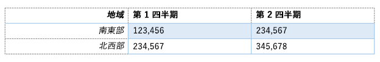

# <a name="create-better-add-ins-for-word-with-office-open-xml"></a>Office Open XML を使用してより良い Word 用アドインを作成する

**提供元:** Stephanie Krieger, Microsoft Corporation | Juan Balmori Labra, Microsoft Corporation

Word で実行する Office アドインを作成している場合、JavaScript API for Office (Office.js) がコンテンツの読み取りと書き込みのための書式をいくつか提供することはご存じのことと思います。そのような書式は強制タイプと呼ばれ、プレーン テキスト、表、HTML、Office Open XML が含まれています。

それでは、イメージ、書式設定された表、グラフ、あるいは書式設定だけされたテキストをドキュメントに追加する必要があるとき、何を選択しますか。画像などの一部のリッチ コンテンツを挿入するために、HTML を使用できます。シナリオによっては、コンテンツで使用できる書式設定および配置に関する制限など、HTML 強制型変換にとって不利な点が存在する場合があります。Office Open XML は、Word 文書 (.docx、.dotx など) が記述される言語であるため、Word 文書にユーザーが追加できるコンテンツであれば、ユーザーにとって適用可能なほぼすべてのタイプの書式設定で、事実上あらゆるタイプのコンテンツを挿入できます。処理する Office Open XML マークアップを判別するのは、想像しているよりも簡単です。

> [!NOTE]
> Office Open XML は PowerPoint と Excel (ならびに、Office 2013 以降、Visio) ドキュメントの言語です。ただし、現在のところは、Word 用に作成された Office アドインでのみ、Office Open XML としてコンテンツを型強制できます。完全な言語リファレンス ドキュメントなど、Office Open XML に関する詳細は、「[その他の技術情報](#see-also)」を参照してください。

まず初めに、Office Open XML の強制型変換を使用して挿入できるコンテンツ タイプの一部を見てみましょう。コード サンプル [Word-Add-in-Load-and-write-Open-XML](https://github.com/OfficeDev/Word-Add-in-Load-and-write-Open-XML) をダウンロードします。これには、次のいずれの例を Word に挿入するにも必要な Office Open XML マークアップおよび Office.js コードが含まれます。

> [!NOTE]
> この記事全体で、**コンテンツ タイプ**という用語と**リッチ コンテンツ**という用語は、Word ドキュメントに挿入できるタイプのリッチ コンテンツを意味します。


*図 1. 書式が直接設定されたテキスト*


直接書式設定を使用すると、ユーザーのドキュメントの既存書式設定に関係なく、テキストの厳密な表示方法を指定できます。

*図 2. スタイルを使用して書式設定されたテキスト*


スタイルを使用し、挿入するテキストの表示をユーザーのドキュメントに合わせて自動的に調整できます。

*図 3. 単純なイメージ*


同じ方法を使用して、Office でサポートされるイメージ書式を挿入できます。

*図 4. ピクチャのスタイルと効果を使用して書式設定されたイメージ*


高品質の書式設定と効果をイメージに追加するとき、必要なマークアップは予想よりずっと少なくなります。

*図 5. コンテンツ コントロール*


アドインでコンテンツ コントロールを使用し、選択範囲ではなく、指定した (バインドした) 位置にコンテンツを追加できます。

*図 6. ワードアートが書式設定されたテキスト ボックス*


Word では、テキスト ボックス (図参照) 内のテキストに、または通常の本文テキストにテキスト効果を利用できます。

*図 7. 図形*


テキストと書式設定効果ありで (なしで)、組み込みまたはカスタムの描画図形を挿入できます。

*図 8. 直接書式設定の表*


必要なテキスト書式設定、境界線、影、セルサイズ変更、表書式設定を追加できます。

*図 9. 表スタイルを使用して書式設定されたテーブル*




テキストに段落スタイルを使用するのと同じくらい簡単に、組み込みまたはカスタムの表スタイルを使用できます。

*図 10. SmartArt 図*


Office 2013 は幅広い種類の SmartArt 図レイアウトを提供します (Office Open XML を使用して独自の SmartArt 図を作成することもできます)。

*図 11. グラフ*


Word 文書に Excel グラフをライブ グラフとして挿入できます。また、このようなグラフを Word のアドインでも使用できます。先ほどの例でお分かりのように、Office Open XML 強制型変換を使用すると、基本的にはコンテンツの任意の型を挿入できるため、ユーザーは、独自の文書を挿入できます。必要な Open XML マークアップを取得する簡単な方法が 2 つあります。もともと空白の Word 2013 ドキュメントにリッチ コンテンツを追加してから、Word XML ドキュメント形式でファイルを保存するか、[getSelectedDataAsync](https://docs.microsoft.com/javascript/api/office/office.document?view=office-js#getselecteddataasync-coerciontype--options--callback-) メソッドでテスト アドインを使用して、マークアップを取得します。どちらのアプローチでも、基本的には同じ結果になります。


> [!NOTE]
> Office Open XML ドキュメントの実体は、ドキュメント コンテンツを表すファイルの圧縮パッケージです。Word XML Document 形式でファイルを保存すると、1 つの XML ファイルに圧縮された完全 Office Open XML パッケージができます。これは、**getSelectedDataAsync** を利用して Office Open XML マークアップを取得すると得られるものでもあります。

ファイルを Word から XML 形式に保存する場合、[名前を付けて保存] ダイアログ ボックスの [ファイルの種類] リストには、.xml 形式ファイル用に 2 つのオプションがあることに注意してください。Word 2003 のオプションではなく、必ず **[Word XML ドキュメント]** を選んでください。[Word-Add-in-Get-Set-EditOpen-XML](https://github.com/OfficeDev/Word-Add-in-Get-Set-EditOpen-XML) という名前のコード サンプルをダウンロードします。これは、マークアップを取得し、テストするツールとして使用できます。これですべてかというと、そうではありません。多くのシナリオでは、上記の方法のいずれかで表示される、フラット化された完全な Office Open XML の結果を使用することができます。これでうまくいきます。これで、マークアップの大部分が必要なくなります。多くのアドイン開発者がそうですが、Office Open XML マークアップを初めて参照する場合、最も単純なコンテンツに対して指定される大量のマークアップを理解しようとすることは大変な作業に思えるかもしれません。しかし、実際にはそうする必要はありません。このトピックでは、Office アドインの開発者コミュニティから収集したいくつかの一般的なシナリオを使用して、アドインで使用するために Office Open XML を単純化する手法を示します。前に説明したいくつかのタイプのコンテンツ用のマークアップに加えて、Office Open XML ペイロードを最小限に抑えるために必要な情報について取り上げます。さらに、リッチ コンテンツを現在の選択範囲にあるドキュメントに挿入するために必要なコードについて、また、Office Open XML をバインディング オブジェクトとともに使用して、指定した場所でコンテンツを追加または置換する方法について考えます。

## <a name="exploring-the-office-open-xml-document-package"></a>Office Open XML ドキュメント パッケージを探る


[getSelectedDataAsync](https://docs.microsoft.com/javascript/api/office/office.document?view=office-js#getselecteddataasync-coerciontype--options--callback-) を使用して選択したコンテンツの Office Open XML を取得すると (あるいは、ドキュメントを Word XML Document 形式で保存すると)、選択したコンテンツを表すマークアップだけではなく、ほとんど必要ないオプションと設定が多数付属したドキュメント全体が得られます。事実、作業ウィンドウ アドインを含むドキュメントからそのメソッドを使用すると、取得するマークアップにはその作業ウィンドウ アプリまでもが含まれています。

単純な Word ドキュメント パッケージであっても、実際のコンテンツだけではなく、ドキュメント プロパティ、スタイル、テーマ (書式設定)、Web 設定、フォントなどが含まれています。

たとえば、先ほど図 1 で表示されていたように、直接書式が設定されたテキストの 1 段落だけを挿入するとします。**getSelectedDataAsync** を使用し、書式設定されたテキストの Office Open XML を取得すると、大量のマークアップが表示されます。そのマークアップには、図 13 のリストにあるようなパーツ (一般的にはドキュメント パーツと、Office Open XML ではパッケージ パーツと呼ばれています) を含むドキュメント全体を表すパッケージ要素が含まれます。各パーツは、パッケージ内の個別のファイルを表します。


> [!TIP]
> メモ帳などのテキスト エディターで、Office Open XML マークアップを編集することができます。Visual Studio 2015 で開く場合、**[編集] > [詳細設定] > [ドキュメントのフォーマット]** (Ctrl キーを押しながら K キーを押し、Ctrl キーを押しながら D キーを押す) の順に選択して、簡単に編集できるようにパッケージを書式設定できます。次に図 12 で示すように、ドキュメントの一部またはセクションを折りたたんだり、展開したりして、Office Open XML パッケージのコンテンツをより簡単に確認したり、編集したりすることができます。各ドキュメントの部分は **pkg:part** タグから始まります。


*図 12. Visual Studio 2015 で簡単に編集するためのパッケージ パーツの圧縮と展開*


*図 13. 基本的な Word Office Open XML ドキュメント パッケージに含まれるパーツ*


これだけたくさんマークアップが存在するのに、書式設定されたテキスト例を挿入するために実際に必要な要素は .rels パーツと document.xml パーツだけであることを知ったら驚かれることでしょう。


> [!NOTE]
> パッケージ タグの上にあるマークアップの 2 行 (バージョンと Office プログラム ID の XML 宣言) は、Office Open XML 強制型変換を使用するときに採用されます。そのため、自分で追加する必要はありません。編集したマークアップを Word ドキュメントとして開き、テストする場合、そのまま利用してください。

このトピックの最初で示したコンテンツのその他のタイプには、(図 13 に表示されている以外に) 追加のパーツを必要とするものもあります。それらについてはこのトピックの後半で説明します。それまでの間、Word ドキュメント パッケージのマークアップでは、図 13 に表示されている大部分のパーツに遭遇することになるので、各パーツの概要とそれが必要とされるタイミングについて簡単に説明します。


- パッケージ タグ内部の最初のパーツは .rels ファイルです。これはパッケージの上位レベルのパーツ (一般的には、ドキュメント プロパティ、存在する場合はサムネイル、ドキュメント本文) 間のリレーションシップを定義します。ドキュメント本文 (コンテンツが置かれる場所) とドキュメント パッケージとのリレーションシップを定義する必要があるので、このパーツのコンテンツの一部は常にマークアップで必要です。

- document.xml (本文) パーツに必要な追加パーツが存在する場合、そのリレーションシップが document.xml.rels パーツにより定義されます。


   > [!IMPORTANT]
   > パッケージの .rels ファイル (top-level .rels、document.xml.rels、および特定のタイプのコンテンツで遭遇するその他のファイル) はガイドとして使用できる非常に重要なツールであり、Office Open XML パッケージをすばやく編集できます。編集方法に関する詳細は、本トピックの後半にある「[独自のマークアップを作成する: ベスト プラクティス](#creating-your-own-markup-best-practices)」を参照してください。


- document.xml パーツはドキュメントの本文のコンテンツです。コンテンツが表示される部分であるため、もちろんこのパーツの要素は必要です。しかしながら、このパーツに表示されるすべてが必要なわけではありません。これについては後で詳しく説明します。

- 多くのパーツは、Office Open XML 強制型変換を利用してドキュメントにコンテンツを挿入するときに Set メソッドにより自動的に無視されます。そのため、削除してもかまいません。このようなパーツには、theme1.xml ファイル (ドキュメントの書式設定テーマ)、ドキュメントのプロパティ パーツ (コア、アドイン、サムネイル)、設定ファイル (settings、webSettings、fontTable を含む) が含まれます。

- 図 1 の例では、テキストの書式設定が直接適用されています (つまり、各フォントおよび段落の書式設定が個別に適用されます)。ただし、先の図 2 のように、スタイルを使用する場合 (たとえば、変換先ドキュメントの見出し 1 スタイルの書式設定をテキストに自動的に適用する場合)、styles.xml パーツとそのリレーションシップ定義が必要になります。詳しくは、トピックのセクション「[追加の Office Open XML パーツを使用するオブジェクトの追加](#adding-objects-that-use-additional-office-open-xml-parts)」を参照してください。


## <a name="inserting-document-content-at-the-selection"></a>選択した場所にドキュメント コンテンツを挿入する


それでは、図 1 の書式設定テキスト例に必要な最小 Office Open XML マークアップと、ドキュメントでアクティブになっている選択箇所に挿入するために必要な JavaScript について見てみましょう。


### <a name="simplified-office-open-xml-markup"></a>単純化された Office Open XML マークアップ

前のセクションで説明したように、ここの Office Open XML 例は編集してあり、必要なドキュメント パーツとそのパーツ内で必要な要素のみを残しています。トピックの次のセクションでは、自分でマークアップを編集する方法について順を追って説明します (また、ここに残す部分について少し説明します)。


```XML
<pkg:package xmlns:pkg="http://schemas.microsoft.com/office/2006/xmlPackage">
  <pkg:part pkg:name="/_rels/.rels" pkg:contentType="application/vnd.openxmlformats-package.relationships+xml" pkg:padding="512">
    <pkg:xmlData>
      <Relationships xmlns="http://schemas.openxmlformats.org/package/2006/relationships">
        <Relationship Id="rId1" Type="http://schemas.openxmlformats.org/officeDocument/2006/relationships/officeDocument" Target="word/document.xml"/>
      </Relationships>
    </pkg:xmlData>
  </pkg:part>
  <pkg:part pkg:name="/word/document.xml" pkg:contentType="application/vnd.openxmlformats-officedocument.wordprocessingml.document.main+xml">
    <pkg:xmlData>
      <w:document xmlns:w="http://schemas.openxmlformats.org/wordprocessingml/2006/main" >
        <w:body>
          <w:p>
            <w:pPr>
              <w:spacing w:before="360" w:after="0" w:line="480" w:lineRule="auto"/>
              <w:rPr>
                <w:color w:val="70AD47" w:themeColor="accent6"/>
                <w:sz w:val="28"/>
              </w:rPr>
            </w:pPr>
            <w:r>
              <w:rPr>
                <w:color w:val="70AD47" w:themeColor="accent6"/>
                <w:sz w:val="28"/>
              </w:rPr>
              <w:t>This text has formatting directly applied to achieve its font size, color, line spacing, and paragraph spacing.</w:t>
            </w:r>
          </w:p>
        </w:body>
      </w:document>
    </pkg:xmlData>
  </pkg:part>
</pkg:package>
```


> [!NOTE]
> ここに示すマークアップを XML ファイルに追加し、バージョンと mso アプリケーションの XML 宣言タグ (図 13) をファイルの先頭に追加すると、そのファイルを Word ドキュメントとして Word で開くことができます。あるいは、これらのタグがなくても、Word で **[ファイル] > [開く]** を使って開くことができます。これが 2013 ドキュメントであることを Word に伝える設定を削除したため、Word 2013 のタイトル バーに **[互換性モード] **が表示されます。このマークアップを既存の Word 2013 ドキュメントに追加するので、コンテンツはまったく影響を受けません。


### <a name="javascript-for-using-setselecteddataasync"></a>setSelectedDataAsync を使用するための JavaScript


先ほどの Office Open XML をお使いのソリューションからアクセスできない XML ファイルとして保存する場合、次の関数を使用し、Office Open XML 強制型変換を使用してドキュメントの書式設定テキスト コンテンツを設定できます。 

この関数では、最後の行を除くすべてを使用し、関数の終わりの [setSelectedDataAsync](https://docs.microsoft.com/javascript/api/office/office.document?view=office-js#setselecteddataasync-data--options--callback-) メソッド呼び出しで使用するために保存したマークアップを取得します。**setSelectedDataASync** では、挿入するコンテンツと強制型変換タイプを指定することのみが要求されます。


> [!NOTE]
> _yourXMLfilename_ をソリューションに保存した XML ファイルの名前とパスで置き換えます。ソリューションで XML ファイルを追加する場所がわからない場合、またはコードでのそれらの参照方法がわからない場合は、[Word-Add-in-Load-and-write-Open-XML](https://github.com/OfficeDev/Word-Add-in-Load-and-write-Open-XML) コード サンプルを見て、その例とここに示すマークアップおよび JavaScript の動作例を確認してください。


```js
function writeContent() {
    var myOOXMLRequest = new XMLHttpRequest();
    var myXML;
    myOOXMLRequest.open('GET', 'yourXMLfilename', false);
    myOOXMLRequest.send();
    if (myOOXMLRequest.status === 200) {
        myXML = myOOXMLRequest.responseText;
    }
    Office.context.document.setSelectedDataAsync(myXML, { coercionType: 'ooxml' });
}
```


## <a name="creating-your-own-markup-best-practices"></a>独自のマークアップを作成する: ベスト プラクティス


それでは、先ほどの書式設定テキスト例を挿入するために必要なマークアップについて詳しく見てみましょう。

この例では、.rels と document.xml 以外のすべてのドキュメント パーツをパッケージから削除することから始めます。次に、後続の作業を簡単にするために、これら 2 つの必須パーツを編集します。


> [!IMPORTANT]
> .rels パーツは、パッケージに含めるパーツをすばやく判断し、完全に削除できるパーツ (つまり、コンテンツに関係ない、またはコンテンツに参照されないパーツ) を判断するためのマップとして使用します。すべてのドキュメント パーツについて、パッケージにリレーションシップを定義する必要があることと、それらのリレーションシップが .rels ファイルに表示されることに注意してください。そのため、.rels、document.xml.rels、コンテンツ固有 .rels ファイルのいずれかにそれらのすべてが一覧表示される必要があります。

次のマークアップは、編集前に必要な .rels パーツを示しています。アドインおよびコア ドキュメント プロパティ パーツとサムネイル パーツを削除するため、.rels からもこれらのリレーションシップを削除する必要があります。document.xml のリレーションシップのみが残ることに注意してください (次の例で関係 ID が "rID1" のもの)。


```XML
<pkg:part pkg:name="/_rels/.rels" pkg:contentType="application/vnd.openxmlformats-package.relationships+xml" pkg:padding="512">
  <pkg:xmlData>
    <Relationships xmlns="http://schemas.openxmlformats.org/package/2006/relationships">
      <Relationship Id="rId3" Type="http://schemas.openxmlformats.org/package/2006/relationships/metadata/core-properties" Target="docProps/core.xml"/>
      <Relationship Id="rId2" Type="http://schemas.openxmlformats.org/package/2006/relationships/metadata/thumbnail" Target="docProps/thumbnail.emf"/>
      <Relationship Id="rId1" Type="http://schemas.openxmlformats.org/officeDocument/2006/relationships/officeDocument" Target="word/document.xml"/>
      <Relationship Id="rId4" Type="http://schemas.openxmlformats.org/officeDocument/2006/relationships/extended-properties" Target="docProps/app.xml"/>
    </Relationships>
  </pkg:xmlData>
</pkg:part>
```


> [!IMPORTANT]
> パッケージから完全に削除するパーツのリレーションシップ (つまり、**Relationship** タグ) を削除します。対応するリレーションシップなしでパーツを追加するか、パーツを除外してもパッケージにそのリレーションシップを残した場合、エラーが発生します。

次のマークアップは、書式設定されたテキスト コンテンツのサンプルを含む、編集前の document.xml パーツを示しています。

```XML
<pkg:part pkg:name="/word/document.xml" pkg:contentType="application/vnd.openxmlformats-officedocument.wordprocessingml.document.main+xml">
    <pkg:xmlData>
      <w:document mc:Ignorable="w14 w15 wp14" xmlns:wpc="http://schemas.microsoft.com/office/word/2010/wordprocessingCanvas" xmlns:mc="http://schemas.openxmlformats.org/markup-compatibility/2006" xmlns:o="urn:schemas-microsoft-com:office:office" xmlns:r="http://schemas.openxmlformats.org/officeDocument/2006/relationships" xmlns:m="http://schemas.openxmlformats.org/officeDocument/2006/math" xmlns:v="urn:schemas-microsoft-com:vml" xmlns:wp14="http://schemas.microsoft.com/office/word/2010/wordprocessingDrawing" xmlns:wp="http://schemas.openxmlformats.org/drawingml/2006/wordprocessingDrawing" xmlns:w10="urn:schemas-microsoft-com:office:word" xmlns:w="http://schemas.openxmlformats.org/wordprocessingml/2006/main" xmlns:w14="http://schemas.microsoft.com/office/word/2010/wordml" xmlns:w15="http://schemas.microsoft.com/office/word/2012/wordml" xmlns:wpg="http://schemas.microsoft.com/office/word/2010/wordprocessingGroup" xmlns:wpi="http://schemas.microsoft.com/office/word/2010/wordprocessingInk" xmlns:wne="http://schemas.microsoft.com/office/word/2006/wordml" xmlns:wps="http://schemas.microsoft.com/office/word/2010/wordprocessingShape">
        <w:body>
          <w:p>
            <w:pPr>
              <w:spacing w:before="360" w:after="0" w:line="480" w:lineRule="auto"/>
              <w:rPr>
                <w:color w:val="70AD47" w:themeColor="accent6"/>
                <w:sz w:val="28"/>
              </w:rPr>
            </w:pPr>
            <w:r>
              <w:rPr>
                <w:color w:val="70AD47" w:themeColor="accent6"/>
                <w:sz w:val="28"/>
              </w:rPr>
              <w:t>This text has formatting directly applied to achieve its font size, color, line spacing, and paragraph spacing.</w:t>
            </w:r>
            <w:bookmarkStart w:id="0" w:name="_GoBack"/>
            <w:bookmarkEnd w:id="0"/>
          </w:p>
          <w:p/>
          <w:sectPr>
            <w:pgSz w:w="12240" w:h="15840"/>
            <w:pgMar w:top="1440" w:right="1440" w:bottom="1440" w:left="1440" w:header="720" w:footer="720" w:gutter="0"/>
            <w:cols w:space="720"/>
          </w:sectPr>
        </w:body>
      </w:document>
    </pkg:xmlData>
</pkg:part>
```

document.xml はコンテンツを置く主要なドキュメント パーツであるため、このパーツについて簡単に説明します (この一覧の後の図 14 では、コア コンテンツの一部およびここで説明する書式設定タグが、Word ドキュメントで表示される内容とどのように関連するかを示すため、視覚的に表示します)。


- 冒頭の **w:document** タグには、いくつかの名前空間 (**xmlns**) のリストが含まれます。これらの名前空間の多くは特定のタイプのコンテンツを参照するため、お使いのコンテンツに関連する場合にのみ必要です。

    ドキュメント パーツ全体のタグのプレフィックスが名前空間を参照していることに注意してください。この例では、document.xml パーツ全体のタグで使用されているプレフィックスは **w:** だけなので、冒頭の **w:document** タグに残しておく必要がある名前区間は **xmlns:w** だけです。


> [!TIP]
> マークアップを Visual Studio 2015 で編集する場合、何らかのパーツの名前空間を削除したら、そのパーツのすべてのタグを調べます。マークアップに必要な名前空間を削除している場合、影響を受けたタグの関連プレフィックスに赤い波下線が表示されます。**xmlns:mc** 名前空間を削除した場合は、名前空間一覧に優先する **mc:Ignorable** 属性も削除する必要があります。


- 冒頭の body タグの内部に、段落タグ (**w:p**) が表示され、この例のサンプル コンテンツが表示されます。

- **w:pPr** タグには、段落の前後の空間、段落の位置合わせ、字下げなど、直接適用される段落書式設定のプロパティが含まれます (直接書式設定は、スタイルの一部としてではなく、コンテンツに個別に適用する属性を参照します)。またこのタグには、段落全体に適用されるフォントの直接書式設定が、サンプルに設定されたフォントの色とサイズを含む、入れ子になった **w:rPr** (run プロパティ) タグ内に含まれます。


   > [!NOTE]
   > Word Office Open XML マークアップ内のフォント サイズおよび他のいくつかの書式設定では、実際の 2 倍のサイズのように表示されることがあります。これは、段落や行間、および上記のマークアップに表示される書式プロパティが twip (ポイントの 20 分の 1) 単位で指定されているためです。Office Open XML で使用するコンテンツの種類に応じて、英語のメートル法 (1 インチあたり 914,400 Emu) を含むいくつかの追加単位が使用されていることがあります。これは、Office Art (drawingML) の一部の値に使用されます。また実際の 100,000 倍の値が使用されていることがあります。この値は、drawingML と PowerPoint のマークアップの両方で使用されます。PowerPoint でも一部の値は実際の 100 倍の値として表されますが、Excel では通常実際の値が使用されます。


- 段落内で、サンプル テキストのように、同様のプロパティを持つコンテンツが実行に含まれます (**w:r**)。書式設定またはコンテンツ タイプに変更があるたびに、新しい実行が開始します。(つまり、サンプル テキストの 1 文字だけが太字であれば、それは独自の実行に分類されます。) この例では、コンテンツに 1 つだけのテキスト実行が含まれます。

    このサンプルに含まれる書式設定はフォントの書式設定 (つまり、わずか 1 文字に適用される書式設定) であるため、個別実行のプロパティにも表示されることに注意してください。

- 既定で Word 2013 ドキュメントに現れる非表示の "_GoBack" ブックマーク (**w:bookmarkStart** と **w:bookmarkEnd**) のタグにも注意が必要です。マークアップからいつでも、GoBack ブックマークの開始タグと終了タグを削除することができます。

- ドキュメント本体の最後の部分は **w:sectPr** タグまたはセクション プロパティです。このタグには余白やページ方向などの設定が含まれます。**setSelectedDataAsync** を利用して挿入したコンテンツは、既定でターゲット ドキュメントのアクティブなセクションのプロパティを獲得します。そのため、コンテンツにセクションの改行が含まれる (その場合、複数の **w:sectPr** タグが表示されます) のでなければ、このタグを削除できます。


*図 14. document.xml の共通タグと Word ドキュメントのコンテンツならびにレイアウトの関係*


> [!TIP]
> 作成したマークアップでは、いくつかのタグで、文字 **w:rsid** を含む別の属性が使用されていることがあります。このトピックで使用されている例では表示されていません。これらは、リビジョンの識別子です。これらは、Word でドキュメントの結合機能で使用されるもので、既定でオンになっています。アドインで挿入するマークアップではこれらの識別子は不要であるため、これらをオフにすることによってマークアップをクリーンに保つことができます。既存の RSID タグを削除したり、この機能を無効にしたりして (次の手順で説明します)、新しいコンテンツにマークアップが追加されないようにします。

Word の共同作成機能 (他の人と同時にドキュメントを編集する機能など) を使用する場合、アドインのマークアップ生成を完了したときに、機能を再度有効にする必要があることに注意してください。

将来作成するドキュメントのために Word の RSID 属性をオフにするには、次のように操作します。 

1. Word 2013 で、[**ファイル**] を選択し、[**オプション**] を選択します。
2. [Word オプション] ダイアログ ボックスで、[**セキュリティ センター**] を選択し、[**セキュリティ センターの設定**] を選択します。
3. [セキュリティ センター] ダイアログ ボックスで、[**プライバシー オプション**] を選択し、[**組み込みの精度を向上させるためランダムな番号を保存する**] という設定を無効にします。

RSID タグを既存のドキュメントから削除するには、Office Open XML でドキュメントを開いた状態で次のショートカットを実行してください。


1. ドキュメントの本文にカーソルを置き、**Ctrl キー + Home キー**を押してドキュメントの先頭に移動します。
2. キーボードで、**Space キー**、**Del キー**、**Space キー**を押します。次にドキュメントを保存します。

このパッケージからマークアップの大半を削除した後に、前のセクションで見たような、サンプルのために挿入する必要がある最小限のマークアップが残ります。


## <a name="using-the-same-office-open-xml-structure-for-different-content-types"></a>異なるコンテンツ タイプに同じ Office Open XML 構造を使用する


一部のタイプのリッチ コンテンツでは、前の例で見たような、コンテンツ コントロール、Office 描画図形、テキスト ボックス、表 (スタイルが表に適用されない限り) など、.rels および document.xml コンポーネントのみが必要です。実際は、編集済みの同じパッケージ パーツを再利用したり、document.xml の **body** コンテンツを自分のコンテンツのマークアップと交換したりします。

先ほどの図 5 から 8 で見た各コンテンツ タイプの例の Office Open XML マークアップを確認するには、概要のセクションで示した [Word-Add-in-Load-and-write-Open-XML](https://github.com/OfficeDev/Word-Add-in-Load-and-write-Open-XML) コード サンプルを参照してください。

先に進む前に、これらのコンテンツ タイプのおける違いと必要な部分を交換する方法について確認しましょう。


### <a name="understanding-drawingml-markup-office-graphics-in-word-what-are-fallbacks"></a>Word の drawingML マークアップ (Office グラフィックス) を理解する: フォールバックとは何か

図形やテキスト ボックスのマークアップが予想よりずっと複雑に見える場合、それには理由があります。Office 2007 のリリースでは、Office Open XML 書式が導入されました。また新しい Office グラフィックス エンジンも導入され、PowerPoint と Excel では完全に採用されました。2007 のリリースでは、Word にはそのグラフィックス エンジンの一部のみが組み込まれました。すなわち、更新された Excel グラフ作成エンジン、SmartArt グラフィックス、高度な画像ツールが採用されました。図形とテキスト ボックスについては、Word 2007 は引き続き従来の描画オブジェクト (VML) を使用します。Word のグラフィックス エンジンが見直され、図形と描画のための最新ツールが組み込まれたのは 2010 のリリースでした。

そのため、Office Open XML 書式の Word ドキュメントを Word 2007 で開いたときにその図形とテキスト ボックスをサポートするために、図形 (テキスト ボックスを含む) にはフォールバック VML マークアップが必要です。

通常は、[Word-Add-in-Load-and-write-Open-XML](https://github.com/OfficeDev/Word-Add-in-Load-and-write-Open-XML) コード サンプルに含まれる図形とテキスト ボックスの例のように、フォールバック マークアップは削除できます。Word 2013 は、ドキュメントが保存されたときに、足りないフォールバック マークアップを自動的に追加します。ただし、すべてのユーザー シナリオが確実にサポートされるようにフォールバック マークアップをそのままにしておいても、まったく問題はありません。

コンテンツに含まれる描画オブジェクトをグループ化している場合、追加の (明らかに繰り返しである) マークアップが表示されますが、これはそのままにしておく必要があります。オブジェクトがグループに追加されると、描画図形のマークアップの部分が重複します。


> [!IMPORTANT]
> テキスト ボックスと描画図形を操作するときは、名前空間を慎重に確認してから document.xml から削除してください (あるいは、別のオブジェクト タイプからマークアップを再利用する場合、document.xml から以前に削除した名前空間が必要であれば、それを戻します)。既定で document.xml に含まれる名前空間の重要な部分は、図画オブジェクトの要件のためにあります。


#### <a name="about-graphic-positioning"></a>グラフィックの位置に関する注記

コード サンプル [Word-Add-in-Load-and-write-Open-XML](https://github.com/OfficeDev/Word-Add-in-Load-and-write-Open-XML) および [Word-Add-in-Get-Set-EditOpen-XML](https://github.com/OfficeDev/Word-Add-in-Get-Set-EditOpen-XML) では、テキスト ボックスと図形は、異なるタイプのテキスト ラッピングと位置設定を使用して設定されています。(また、これらのコード サンプルの画像例は、テキストの基準線にグラフィック オブジェクトを位置付けるテキスト書式設定のインラインを使用して設定されていることに注意してください。)

これらのコード サンプルの図形は右と下のページ余白との関連で位置付けられます。相対的位置付けにより、簡単にユーザーの不明なドキュメント設定を調整でき (ユーザーの余白に合わせて調整されるため)、紙のサイズ、方向、余白の設定によってぎこちなく見えることもなくなります。グラフィック オブジェクトを挿入するときに相対的位置付け設定を維持するには、位置付け (Word のアンカー) が保存される段落マーク (w:p) を維持する必要があります。独自の段落マークを追加するのではなく、既存の段落マークにコンテンツを挿入する場合、同じ初期ビジュアルを維持できても、ユーザーのレイアウトに合わせて自動的に調整する位置付けを有効にする多くのタイプの相対参照が失われる可能性があります。


### <a name="working-with-content-controls"></a>コンテンツ コントロールで作業する

コンテンツ コントロールは Word 2013 の重要な機能であり、さまざまな方法で Word 用アドインの機能を大幅に強化します。たとえば、選択範囲だけではなく、ドキュメントの指定の場所にコンテンツを挿入できます。

Word では、図 15 のように、コンテンツ コントロールはリボンの [開発] タブにあります。


*図 15. Word の [開発] タブの [コントロール] グループ*


Word のコンテンツ コントロールの種類には、リッチ テキスト、プレーン テキスト、ピクチャ、構成要素ギャラリー、チェック ボックス、ドロップダウン リスト、コンボ ボックス、日付の選択、繰り返しセクションがあります。


- 図 15 にある **[プロパティ]** コマンドを使用し、コントロールのタイトルを編集したり、コントロール コンテナーを非表示にしたりするなど、設定を追加します。

- **[デザイン モード]** を有効化し、コントロールのプレースホルダー コンテンツを編集します。

アドインが Word テンプレートと連動する場合、そのテンプレートにコントロールを追加し、コンテンツの動作を強化できます。また、Word ドキュメントで XML データ バインドを使用し、ドキュメント プロパティなどのデータにコンテンツ コントロールをバインドすれば、フォームの記入などの作業が簡単になります。(組み込みドキュメント プロパティにすでにバインドされているコントロールは Word の **[挿入]** タブの **[クイック パーツ]** にあります。)

アドインでコンテンツ コントロールを使用すると、異なるタイプのバインドを使用してアドインで可能なオプションを大幅に拡張できます。アドインの中からコンテンツ コントロールをバインドし、アクティブな選択範囲ではなく、バインドにコンテンツを記述できます。


> [!NOTE]
> Word の XML データ バインドと、アドインを介してコントロールにバインドする機能を混同しないでください。これらはまったく別の機能です。ただし、OOXML 強制型変換を利用してアドイン経由で挿入したコンテンツに指定のコンテンツ コントロールを追加し、アドインのコードを使用してこれらのコントロールにバインドすることができます。

また、XML データ バインドと Office.js の両方がアプリのカスタム XML パーツとやりとりできるので、これらの強力なツールを統合できます。Office JavaScript API のカスタム XML パーツの使用については、このトピックの「[その他の技術情報](#see-also)」セクションを参照してください。

Word アドインのバインドの使用については、トピックの次のセクションで取り上げます。最初に、アドインを使用してバインドできるリッチ テキスト コンテンツ コントロールを挿入するために必要な Office Open XML の例を見ましょう。


> [!IMPORTANT]
> リッチ テキスト コントロールは、アドイン内からコンテンツ コントロールにバインドできる唯一のタイプのコンテンツ コントロールです。


```XML
<pkg:package xmlns:pkg="http://schemas.microsoft.com/office/2006/xmlPackage">
  <pkg:part pkg:name="/_rels/.rels" pkg:contentType="application/vnd.openxmlformats-package.relationships+xml" pkg:padding="512">
    <pkg:xmlData>
      <Relationships xmlns="http://schemas.openxmlformats.org/package/2006/relationships">
        <Relationship Id="rId1" Type="http://schemas.openxmlformats.org/officeDocument/2006/relationships/officeDocument" Target="word/document.xml"/>
      </Relationships>
    </pkg:xmlData>
  </pkg:part>
  <pkg:part pkg:name="/word/document.xml" pkg:contentType="application/vnd.openxmlformats-officedocument.wordprocessingml.document.main+xml">
    <pkg:xmlData>
      <w:document xmlns:w="http://schemas.openxmlformats.org/wordprocessingml/2006/main" xmlns:w15="http://schemas.microsoft.com/office/word/2012/wordml" >
        <w:body>
          <w:p/>
          <w:sdt>
              <w:sdtPr>
                <w:alias w:val="MyContentControlTitle"/>
                <w:id w:val="1382295294"/>
                <w15:appearance w15:val="hidden"/>
                <w:showingPlcHdr/>
              </w:sdtPr>
              <w:sdtContent>
                <w:p>
                  <w:r>
                  <w:t>[This text is inside a content control that has its container hidden. You can bind to a content control to add or interact with content at a specified location in the document.]</w:t>
                </w:r>
                </w:p>
              </w:sdtContent>
            </w:sdt>
          </w:body>
      </w:document>
    </pkg:xmlData>
  </pkg:part>
 </pkg:package>
```

すでに説明したように、コンテンツ コンテキストは書式設定されたテキストと同様、追加のドキュメント パーツを必要としません。そのため、編集された .rels および document.xml パーツのみがここに含まれています。

document.xml 本文内に表示される **w:sdt** タグはコンテンツ コントロールを表します。コンテンツ コントロールの Office Open XML マークアップを生成すると、タグおよびドキュメント パーツ プロパティなど、いくつかの属性がこの例から削除されていることに気付くでしょう。次の内容を含む、不可欠な (そして、いくつかのベスト プラクティスの) 要素のみが維持されています。


- **alias** は、wordnv2 の [コンテンツ コントロール プロパティ] ダイアログ ボックスからのタイトル プロパティです。アドイン内からコントロールにバインドする場合、これは必須のプロパティです (アイテムの名前を表します)。

- 一意の **id** は必須のプロパティです。アドイン内からコントロールにバインドする場合、この ID は、該当する名前付きコンテンツ コントロールを識別するためにドキュメントのバインド機能で使用されるプロパティです。

- **appearance** 属性は、コントロール コンテナーを非表示にしてよりすっきり見せるために使用されます。w15 名前空間の使用でわかるように、これは Word 2013 の新機能です。このプロパティが使用されるため、w15 名前空間が document.xml パーツの先頭で維持されます。

- **showingPlcHdr** 属性は、プレースホルダー コンテンツとしてコントロール (この例のテキスト) 内に含める既定のコンテンツを設定する省略可能の設定です。そのため、ユーザーがコントロール領域をクリックするか、タップすると、ユーザーが変更できる編集可能コンテンツのように動作する代わりに、コンテンツ全体が選択されます。

- **sdt** タグの前に付く空の段落マーク (**w:p/**) は、コンテンツ コントロールの追加には必須ではありませんが (Word ドキュメントのコントロールの上に垂直方向のスペースを追加する)、コントロールが独自の段落に確実に配置されます。コントロールに追加されるコンテンツのタイプと書式設定によっては、これが重要になる場合があります。

- コントロールにバインドする場合、バインドで複数の段落から構成されるリッチ コンテンツを受け入れるために、コントロールの既定のコンテンツ (**sdtContent** タグの内容) に少なくとも 1 つの完全な段落を含める必要があります。


> [!NOTE]
> このサンプルの **w:sdt** タグから削除されたドキュメント パーツ属性は、プレースホルダー コンテンツ情報を保存できるパッケージの別個のパーツ (Office Open XML パッケージの用語集ディレクトリに置かれているパーツ) を参照するために、コンテンツ コントロールに表示される場合があります。ドキュメント パーツは Office Open XML パッケージ内の XML パーツ (つまり、ファイル) に使用される用語ですが、sdt プロパティで使用される用語ドキュメント パーツは、構成要素およびドキュメント プロパティ クイック パーツ (組み込み XML データバインド コントロールなど) を含む、一部のコンテンツ タイプを説明するために使用される Word の同じ用語を参照します。Office Open XML パッケージの用語集ディレクトリの下にパーツが表示される場合、挿入するコンテンツにこれらの機能が含まれるのであれば、そのパーツは維持する必要がある可能性があります。アドインからバインドするために使用する一般的なコンテンツ コントロールに関しては、それらは必要ありません。パッケージから用語集パーツを削除する場合、w:sdt タグからもドキュメント パーツ属性を削除する必要があることを覚えておいてください。

次のセクションでは、Word アドインでバインドを作成し、使用する方法について考察します。


## <a name="inserting-content-at-a-designated-location"></a>指定の位置にコンテンツを挿入する


Word ドキュメントのアクティブな選択範囲にコンテンツを挿入する方法についてはすでに説明しました。ドキュメントの名前付きコンテンツ コントロールにバインドする場合、同じコンテンツ タイプをそのコントロールに挿入できます。 

それでは、どのような場合にこの手法を使用するのでしょうか。


- データベースからドキュメントの一部にデータを入力するなど、テンプレートの指定の位置にコンテンツを追加したり、置換したりする場合

- デザイン要素オプションをユーザーに提供するなど、アクティブな選択範囲に挿入するコンテンツを置換するオプションが必要な場合。

- ユーザーがドキュメントに追加した情報に基づいて作業ウィンドウのフィールドにデータを入力するなど、アドインで使用するためにアクセスできるドキュメントに、ユーザーにデータを追加させたい場合

コード サンプル [Word-Add-in-JavaScript-AddPopulateBindings](https://github.com/OfficeDev/Word-Add-in-JavaScript-AddPopulateBindings) をダウンロードします。このサンプルは、コンテンツ コントロールを挿入し、それにバインドする方法と、バインドにデータを入力する方法の実際の例を提供します。


### <a name="add-and-bind-to-a-named-content-control"></a>名前付きコンテンツ コントロールを追加し、それにバインドする


続く JavaScript を確認し、これらの要件について考察してください。


- すでに説明したように、Word アドインからコントロールにバインドするには、リッチ テキスト コンテンツ コントロールを使用する必要があります。

- コンテンツ コントロールには名前 (これは [コンテンツ コントロール プロパティ] ダイアログ ボックスの **[タイトル]** フィールドであり、Office Open XML マークアップの **Alias** タグに対応します) を付ける必要があります。これにより、コードはバインドを配置する場所を識別します。

- 複数の名前付きコントロールを用意し、必要に応じてそれらにバインドできます。一意のコンテンツ コントロール名、一意のコンテンツ コントロール ID、一意のバインド ID を使用します。


```js
function addAndBindControl() {
    Office.context.document.bindings.addFromNamedItemAsync("MyContentControlTitle", "text", { id: 'myBinding' }, function (result) {
        if (result.status == "failed") {
            if (result.error.message == "The named item does not exist.")
                var myOOXMLRequest = new XMLHttpRequest();
                var myXML;
                myOOXMLRequest.open('GET', '../../Snippets_BindAndPopulate/ContentControl.xml', false);
                myOOXMLRequest.send();
                if (myOOXMLRequest.status === 200) {
                    myXML = myOOXMLRequest.responseText;
                }
                Office.context.document.setSelectedDataAsync(myXML, { coercionType: 'ooxml' }, function (result) {
                    Office.context.document.bindings.addFromNamedItemAsync("MyContentControlTitle", "text", { id: 'myBinding' });
                });
        }
    });
}
```

ここに示すコードは次の手順で行われます。


- [addFromNamedItemAsync](https://docs.microsoft.com/javascript/api/office/office.bindings?view=office-js#addfromnameditemasync-itemname--bindingtype--options--callback-) を使用して、名前付きコンテンツ コントロールにバインドしようとします。

  コードの実行時に名前付きコントロールがドキュメントに既に存在する可能性があるアドインのシナリオの場合は、このステップを最初に行います。たとえば、コントロールが事前に配置されているアドインで動作するように設計されているテンプレートにアドインが挿入されて、テンプレート共に保存される場合は、これを実行します。また、アドインによって前に配置されたコントロールにバインドする必要がある場合にも、これを行う必要があります。

- **addFromNamedItemAsync** メソッドの最初の呼び出しのコールバックにより、結果のステータスがチェックされ、名前付きアイテムがドキュメントに存在しないためにバインドが失敗したかどうかが確認されます  (つまり、この例の MyContentControlTitle という名前のコンテンツ コントロール)。失敗した場合、(**setSelectedDataAsync** を使用して) コードにより、アクティブな選択範囲にコントロールが追加され、それにバインドされます。


> [!NOTE]
> 前のコードで説明したように、コンテンツ コントロールの名前を使用し、バインドを作成する場所が決まります。ただし、Office Open XML マークアップでは、コードにより、コンテンツ コントロールの名前と ID 属性の両方を使用し、ドキュメントにバインドが追加されます。

コードの実行後、アドインがバインドを作成したドキュメントのマークアップを調べると、各バインドに 2 つのパーツが表示されます。(document.xml の) バインドが追加されたコンテンツ コントロールのマークアップに、属性  **w15:webExtensionLinked/** が表示されます。

webExtensions1.xml という名前のドキュメント パーツに、作成したバインドの一覧が表示されます。各バインドは、該当するコントロールのバインド ID と ID 属性を使用して次のように識別されます。ここでは、**appref** 属性はコンテンツ コントロール ID: ** **we:binding id="myBinding" type="text" appref="1382295294"/** です。


> [!IMPORTANT]
> バインドに操作を行うときにバインドを追加する必要があります。コンテンツ コントロールを挿入するために Office Open XML にバインドのマークアップを含めないでください。そのマークアップを挿入する過程でバインドは削除されます。


### <a name="populate-a-binding"></a>バインドにデータを入力する


バインドにコンテンツを書き込むためのコードは、選択範囲にコンテンツを書き込むためのコードに似ています。


```js
function populateBinding(filename) {
  var myOOXMLRequest = new XMLHttpRequest();
  var myXML;
  myOOXMLRequest.open('GET', filename, false);
  myOOXMLRequest.send();
  if (myOOXMLRequest.status === 200) {
      myXML = myOOXMLRequest.responseText;
  }
  Office.select("bindings#myBinding").setDataAsync(myXML, { coercionType: 'ooxml' });
}
```

**setSelectedDataAsync** と同様に、挿入するコンテンツと強制型変換タイプを指定します。バインドに書き込むための唯一の追加要件は、ID によりバインドを識別することです。このコードで使用されるバインド ID (bindings#myBinding) が、前の関数でバインドが作成されたときに確立されたバインド ID (myBinding) にどのように対応しているかに注目してください。


> [!NOTE]
> バインドのコンテンツの最初のデータ入力であろうと、コンテンツの置換であろうと、必要なのは前のコードだけです。バインド位置にコンテンツの新しい部分を挿入するとき、そのバインドの既存のコンテンツが自動的に置換されます。前に参照したコード サンプル [Word-Add-in-JavaScript-AddPopulateBindings](https://github.com/OfficeDev/Word-Add-in-JavaScript-AddPopulateBindings) でこの例を確認してください。このコード サンプルでは、同じバインドに入力するために同じように使用できる 2 つの別個のコンテンツ サンプルが提供されます。


## <a name="adding-objects-that-use-additional-office-open-xml-parts"></a>追加の Office Open XML パーツを使用するオブジェクトの追加


多くのタイプのコンテンツで、Office Open XML パッケージの追加ドキュメント パーツが必要です。つまり、別のパーツの情報を参照するか、1 つまたは複数のパーツに格納され、document.xml で参照されるコンテンツ自体を参照します。

たとえば、次の内容を考慮します。


- 書式設定にスタイルを使用するコンテンツ (先ほどの図 2 のスタイル設定されたテキストまたは図 9 のスタイル設定された表など) には styles.xml パーツが必要です。

- 画像 (図 3 および図 4 のような画像など) では、1 つ (2 つの場合もある) の追加パーツにバイナリ画像が含まれます。

- SmartArt 図 (図 10 のような図) では、レイアウトとコンテンツを表現するために、複数の追加パーツが必要です。

- グラフ (図 11 のようなグラフなど) では、独自のリレーションシップ (.rels) パーツを含む、複数の追加パーツが必要です。

前に参照したコード サンプル [Word-Add-in-Load-and-write-Open-XML](https://github.com/OfficeDev/Word-Add-in-Load-and-write-Open-XML) で、これらのすべてのコンテンツ タイプのマークアップの編集された例を参照することができます。バインディングを使用して現在の選択範囲にコンテンツを挿入したり、指定した場所にコンテンツを書き込んだりする場合は、前に表示した (および参照したコード サンプルで提供された) ものと同じ JavaScript コードを使用してこれらのコンテンツ タイプをすべて挿入できます。

サンプルを参考にする前に、各コンテンツ タイプを使用するためのヒントをいくつか見てみましょう。


> [!IMPORTANT]
> document.xml で参照される追加パーツを維持する場合、document.xml.rels と、styles.xml や画像ファイルなど、維持する該当パーツのリレーションシップを維持する必要があります。


### <a name="working-with-styles"></a>スタイルを使用する

テキストを直接書式設定する前の例で見たマークアップの編集手法と同じ手法が、段落スタイルや表スタイルを利用してコンテンツの書式を設定する際に適用されます。ただし、段落スタイルを使用するためのマークアップが大幅にシンプルになるので、それがここで説明される例になります。


#### <a name="editing-the-markup-for-content-using-paragraph-styles"></a>段落スタイルを使用してコンテンツのマークアップを編集する

次のマークアップは、図 2 で示した、スタイル設定されたテキスト例の本文コンテンツを表します。


```XML
<w:body>
  <w:p>
    <w:pPr>
      <w:pStyle w:val="Heading1"/>
    </w:pPr>
    <w:r>
      <w:t>This text is formatted using the Heading 1 paragraph style.</w:t>
    </w:r>
  </w:p>
</w:body>
```


> [!NOTE]
> おわかりのように、document.xml の書式設定されたテキストのマークアップはスタイルを使用すると大幅にシンプルになります。スタイルには、スタイルを使用しなければ個々に参照しなければならない段落とフォントの書式設定がすべて含まれているからです。ただし、前述のように、さまざまな理由から、スタイルを使用することもあれば、直接の書式設定を使用することもあります。直接の書式設定を使用すれば、ユーザーのドキュメントの書式設定に関係なく、テキストの外見を指定できます。段落スタイルを使用すれば (特に、例にある見出し 1 など、組み込みの段落スタイル名)、テキストの書式設定をユーザーのドキュメントに合わせて自動的に調整できます。

スタイルの使用は、挿入するコンテンツのマークアップを読み、理解することの重要性を示す良い例です。なぜなら、別のドキュメント パーツがここで参照されることは明示されていないためです。このマークアップにスタイル定義を含め、styles.xml パーツを含めない場合、document.xml のスタイル情報は、そのスタイルがユーザーのドキュメントで使用されているかどうかに関係なく、無視されます。

ただし、styles.xml part をよく見ると、この長いマークアップのほんの一部だけがアドインで使用するマークアップを編集するときに必要であることがわかります。


- styles.xml パーツには既定で複数の名前空間が含まれます。コンテンツに必要なスタイル情報のみを維持するのであれば、ほとんどの場合、**xmlns:w** 名前空間のみを維持するだけで問題ありません。

- スタイル パーツの上部にある **w:docDefaults** タグ コンテンツは、マークアップがアドイン経由で挿入されたときは無視されます。これは削除してもかまいません。

- styles.xml パーツの大部分のマークアップは、docDefaults の後に表示される **w:latentStyles** タグのものです。これは利用可能なすべてのスタイルのための情報 (Styles ウィンドウと Styles ギャラリーの外観属性など) を提供します。この情報もアドイン経由で挿入されたときに無視されます。そのため削除してもかまいません。

- 潜在的なスタイル情報を追うと、マークアップの生成元になったドキュメントで使用されている各スタイルの定義がわかります。これには、ドキュメントを新規作成するときに使用される既定のスタイルが含まれ、お使いのコンテンツには関係ない場合があります。お使いのコンテンツで使用されないスタイルの定義は削除できます。


   > [!NOTE]
   > 組み込みの見出しスタイルにはそれぞれ、Char スタイルが関連付けられています。これは、同じ見出し書式の文字スタイル バージョンです。見出しスタイルを文字スタイルとして適用していなければ、それを削除してもかまいません。スタイルが文字スタイルとして使用されている場合、段落プロパティタグ (**w:rPr**) ではなく、document.xml の実行プロパティ タグ (**w:pPr**) に表示されます。これは、段落のパーツにのみスタイルを適用した場合のみのケースですが、スタイルが適切に適用されていない場合は、意図せずに起こることがあります。


- コンテンツに組み込みスタイルを使用している場合、完全な定義を含める必要はありません。挿入時に型強制 Office Open XML でコンテンツにスタイルを適用する目的で、スタイル名、スタイル ID、そして少なくとも 1 つの書式設定属性だけを含める必要があります。

    ただし、完全なスタイル定義を含めるのがベスト プラクティスです (組み込みスタイルに対して既定の場合であっても)。スタイルがターゲット ドキュメントで既に使用されている場合は、styles.xml の内容に関係なく、コンテンツはスタイルの常駐定義を使用します。スタイルがターゲット ドキュメントでまだ使用されていない場合は、コンテンツはマークアップで指定されているスタイル定義を使用します。

そのため、たとえば、図 2 にあるサンプル テキストの styles.xml パーツから維持する必要があった唯一のコンテンツは次のようになります。サンプルは見出し 1 スタイルを使用して書式設定されています。


> [!NOTE]
> この例では、見出し 1 スタイルの完全な Word 2013 定義が維持されています。


```XML
<pkg:part pkg:name="/word/styles.xml" pkg:contentType="application/vnd.openxmlformats-officedocument.wordprocessingml.styles+xml">
  <pkg:xmlData>
    <w:styles xmlns:w="http://schemas.openxmlformats.org/wordprocessingml/2006/main" >
      <w:style w:type="paragraph" w:styleId="Heading1">
        <w:name w:val="heading 1"/>
        <w:basedOn w:val="Normal"/>
        <w:next w:val="Normal"/>
        <w:link w:val="Heading1Char"/>
        <w:uiPriority w:val="9"/>
        <w:qFormat/>
        <w:pPr>
          <w:keepNext/>
          <w:keepLines/>
          <w:spacing w:before="240" w:after="0" w:line="259" w:lineRule="auto"/>
          <w:outlineLvl w:val="0"/>
        </w:pPr>
        <w:rPr>
          <w:rFonts w:asciiTheme="majorHAnsi" w:eastAsiaTheme="majorEastAsia" w:hAnsiTheme="majorHAnsi" w:cstheme="majorBidi"/>
          <w:color w:val="2E74B5" w:themeColor="accent1" w:themeShade="BF"/>
          <w:sz w:val="32"/>
          <w:szCs w:val="32"/>
        </w:rPr>
      </w:style>
    </w:styles>
  </pkg:xmlData>
</pkg:part>
```


#### <a name="editing-the-markup-for-content-using-table-styles"></a>表スタイルを使用してコンテンツのマークアップを編集する


コンテンツで表スタイルを使用するとき、段落スタイルの使用で説明したように、styles.xml の同じ相対パーツを使用します。つまり、コンテンツで使用しているスタイルの情報だけを維持すればよいのです。そこには、名前、ID、少なくとも 1 つの書式設定属性を含める必要があります。ただし、考えられるあらゆるユーザー シナリオに対処するために、完全なスタイル定義を含めるのが最善策です。

ただし、document.xml の表と styles.xml の表スタイル定義の両方のマークアップを見ると、段落スタイルを使用するときより、はるかに多くのマークアップがあるのがわかります。


- document.xml では、書式設定はスタイルに含まれている場合でも、セルごとに適用されます。表スタイルを使用してマークアップの量が減ることはありません。コンテンツに表スタイルを使用すると、複数の表を簡単に更新し、簡単に調整できるメリットがあります。

- styles.xml では、たった 1 つの表スタイルでもかなりの量のマークアップがあります。これは、表全体、見出し行、奇数と偶数の縞付き行および列 (別個)、最初の列など、表スタイルに表領域別のさまざまな書式設定属性が含まれるためです。


### <a name="working-with-images"></a>画像を使用する


画像のマークアップには、画像を表現するバイナリ データを含む、少なくとも 1 つのパーツへの参照が含まれます。複雑な画像の場合は、マークアップだけで数百ページに及ぶ可能性があり、編集するのは不可能です。バイナリ パーツに触れる必要がないのであれば、Visual Studio などの構造化エディターを使用する場合、折りたたんでおけます。そうすれば、パッケージの残りの部分のレビューと編集が簡単になります。

前に参照したコード サンプル [Word-Add-in-Load-and-write-Open-XML](https://github.com/OfficeDev/Word-Add-in-Load-and-write-Open-XML) の図 3 にあったシンプルな画像のマークアップ例を確認すれば、document.xml の画像のマークアップには、サイズと位置の情報の他に、バイナリの画像データを含むパーツに対するリレーションシップ参照が含まれるのがわかるでしょう。その参照は、次のように、 **a:blip** タグに含まれています。


```XML
<a:blip r:embed="rId4" cstate="print">
```

リレーションシップ参照は明示的に使用され (**r:embed="rID4"**)、その関連パーツは画像を表示するために必要であるため、Office Open XML パッケージにバイナリ データを含めない場合、エラーが発生することに注意してください。これは前述の styles.xml の場合とは異なります。styles.xml ではリレーションシップが明示的に参照されておらず、リレーションシップはコンテンツ自体の一部ではなく、コンテンツに属性を提供するパーツに対する関係であるため (書式設定)、省略してもエラーは発生しませんでした。


> [!NOTE]
> マークアップを見直すと、a:blip タグに追加の名前空間が使用されていることがわかります。document.xml で、**xlmns:a** 名前空間 (メインの drawingML 名前空間) が document.xml パーツの先頭ではなく、drawingML 参照の使用の先頭に動的に配置されることがわかるでしょう。ただし、リレーションシップの名前空間 (r) は document.xml の先頭でそれが表示される位置で維持する必要があります。追加の名前空間の要件については、ピクチャのマークアップを確認してください。どのタイプのコンテンツがどの名前空間を必要とするかは覚える必要がありません。document.xml 全体でタグのプレフィックスを見れば簡単に判断できます。


### <a name="understanding-additional-image-parts-and-formatting"></a>追加の画像パーツと書式設定について理解する


図 4 の (ピクチャのスタイル設定に加えて) 調整済みの明るさやコントラストの設定を使用する画像のように、画像に Office ピクチャ書式設定効果を使用する場合、画像データの HD 書式コピーの二次バイナリ データ パーツが必要になる場合があります。この追加 HD 書式は、レイヤー効果を設定するために必要であり、その書式への参照は document.xml に次のように表示されます。


```XML
<a14:imgLayer r:embed="rId5">
```

[Word-Add-in-Load-and-write-Open-XML](https://github.com/OfficeDev/Word-Add-in-Load-and-write-Open-XML) コード サンプルの図 4 で、書式設定された画像 (レイヤー効果などを使用する) に必要なマークアップを確認してください。


### <a name="working-with-smartart-diagrams"></a>SmartArt 図を使用する


SmartArt 図には 4 つの関連パーツがありますが、常に必要なのは 2 つだけです。[Word-Add-in-Load-and-write-Open-XML](https://github.com/OfficeDev/Word-Add-in-Load-and-write-Open-XML) コード サンプルで SmartArt マークアップの例を確認できます。最初に、各パーツの簡単な説明とそれが必要な理由と必要でない理由を確認しましょう。


> [!NOTE]
> コンテンツに複数の図が含まれる場合、連続した番号が付けられます。ここに挙げるファイル名の "1" の部分がその番号で置換されます。


- layout1.xml: このパーツは必須です。これには、レイアウトの外観と機能のマークアップ定義が含まれます。

- data1.xml: このパーツは必須です。これには、図のインスタンスで使用されるデータが含まれます。

- drawing1.xml: このパーツは常に必要なわけではありませんが、個々の図形の書式を直接設定するなど、図のインスタンスの要素にカスタムの書式設定を適用する場合、それを維持しなければならないこともあります。

- colors1.xml: このパーツは必須ではありません。色のスタイル定義が含まれますが、図の色は既定で、Office Open XML マークアップを保存する前に Word の SmartArt ツールの [デザイン] タブから適用する SmartArt 色スタイルに基づき、ターゲット ドキュメントのアクティブな書式設定テーマの色に合わせて調整されます。

- quickStyles1.xml: このパーツは必須ではありません。ターゲット ドキュメントで利用できる、適用済みの SmartArt スタイルの定義を図が取得するため色パーツと同様に、このパーツは削除できます(つまり、パーツはターゲット ドキュメントの書式設定テーマに合わせて自動的に調整されます)。


> [!TIP]
> SmartArt layout1.xml ファイルは、マークアップをさらに削除できるが、そのための余計な時間を費やす価値がないファイルの良い例です (削除されるマークアップの量がパッケージ全体に対して非常に少ないためです)。マークアップで削除できる最後の行まで削除する場合、**dgm:sampData** タグとそのコンテンツを削除します。このサンプル データにより、SmartArt スタイル ギャラリーにおける図のサムネイル プレビューの表示が定義されます。ただし、それを省略した場合、既定のサンプル データが使用されます。

document.xml の SmartArt 図のマークアップにはレイアウト、データ、色、クイック スタイル パーツのリレーションシップ ID 参照が含まれることに注意してください。これらのパーツとそのリレーションシップ定義を削除すると、document.xml の色およびスタイル パーツへの参照を削除できます (リレーションシップを削除していますから、参照を削除するのがベスト プラクティスです。)。ただし、図をドキュメントに挿入するための要件ではないため、参照を残してもエラーは発生しません。これらの参照は、document.xml の **dgm:relIds** タグにあります。この手順を実行するかどうかに関係なく、必要なレイアウトおよびデータ パーツのリレーションシップ ID 参照を維持します。


### <a name="working-with-charts"></a>グラフを使用する


SmartArt 図と同様に、グラフにはいくつかの追加のパーツが含まれます。ただし、グラフの設定は SmartArt とは少し異なり、グラフには独自のリレーションシップ ファイルがあります。次は、グラフの必須パーツと削除可能パーツを説明します。


> [!NOTE]
> SmartArt 図の場合と同様に、コンテンツに複数のグラフが含まれる場合、連続した番号が付与されます。ここに挙げるファイル名の "1" がその番号で置換されます。


- document.xml.rels には、グラフ (chart1.xml) を表すデータを含む必須パーツへの参照があります。

- また、chart1.xml.rels など、Office Open XML パッケージのグラフ別のリレーションシップ ファイルがあります。

    chart1.xml.rels では 3 つのファイルが参照されますが、1 つだけが必須です。この中にバイナリ Excel ワークブック データ (必須) と、削除できる色およびスタイル パーツ (colors1.xml と styles1.xml) があります。

Word 2013 でネイティブで作成し、編集できるグラフは Excel 2013 グラフです。そのデータは、Office Open XML パッケージにバイナリ データとして組み込まれている Excel ワークシートで管理されます。画像のバイナリ データ パーツのように、この Excel バイナリ データは必須ですが、このパーツでは何も編集しません。そのため、エディターでパーツを折りたためば、手動で最後までスクロールしなくても Office Open XML パッケージの残りを調べることができます。

ただし、SmartArt と同様に、色およびスタイル パーツを削除できます。利用できるグラフ スタイルと色スタイルを使用し、グラフの書式を設定した場合、グラフがターゲット ドキュメントに挿入されたときに、該当する書式設定を自動的に取得します。

[Word-Add-in-Load-and-write-Open-XML](https://github.com/OfficeDev/Word-Add-in-Load-and-write-Open-XML) コード サンプルの図 11 にある編集されたマークアップでグラフの例を確認してください。


## <a name="editing-the-office-open-xml-for-use-in-your-task-pane-add-in"></a>作業ウィンドウ アドインで使用するために Office Open XML を編集する


マークアップのコンテンツの識別方法と編集方法はすでに確認しました。お使いのドキュメントに大規模な Office Open XML パッケージが生成され、作業が困難に思われた場合、次の推奨手順のクイック サマリーに従えば、そのようなパッケージもすばやく編集できます。


> [!NOTE]
> パッケージのすべての .rels パーツをマップとして使用し、削除できるドキュメント パーツをすばやく確認できることを覚えておいてください。


1. 単層化された XML ファイルを Visual Studio 2015 で開き、Ctrl+K、Ctrl+D を押し、ファイルを書式設定します。次に、左側の折りたたみ/展開ボタンを使用し、削除する必要があることがわかっているパーツを折りたたみます。必要であるが、編集する必要はない長いパーツを折りたたむこともできます (画像ファイルの base64 バイナリ データなど)。このようにすると、マークアップが視覚的に楽に速く読めるようになります。

2. ドキュメント パッケージのいくつかのパーツは、アドインに使用する Office Open XML マークアップを準備しているときにほとんどの場合は削除できます。 まずは、そのようなパーツ (およびそれらに関連付けられているリレーションシップの定義) を削除すれば、パッケージのサイズをすぐに大幅に減らすことができます。 そのようなパーツには、theme1、fontTable、settings、webSettings、サムネイル、コア プロパティ ファイルとアドイン プロパティ ファイルの両方、任意の `taskpane`、`webExtension` パーツなどがあります。

3. 必要のない脚注、ヘッダー、フッターなど、自分のコンテンツに関連しないパーツを削除できます。ここでも、関連付けられているリレーションシップを必ず削除してください。

4. document.xml.rels パーツをレビューし、画像ファイル、スタイル パーツ、SmartArt 図パーツなど、そのパーツで参照されるファイルが自分のコンテンツに必要かどうかを確認します。自分のコンテンツに必要のないパーツがあれば、そのリレーションシップを削除し、関連パーツも削除されていることを確認します。自分のコンテンツには document.xml.rels で参照されるドキュメント パーツがいずれも必要でない場合、そのファイルを削除することもできます。

5. 自分のコンテンツに .rels パーツ (chart#.xml.rels など) を追加している場合、それをレビューし、そこで参照されているその他のパーツで、削除できるパーツがないかどうかを確認し (グラフのクイック スタイルなど)、そのファイルからのリレーションシップと関連パーツの両方を削除します。

6. document.xml を編集し、パーツで参照されない名前空間、コンテンツにセクション改行が含まれない場合のセクション プロパティ、挿入するコンテンツに関連ないマークアップを削除します。図形またはテキスト ボックスを挿入する場合、広範囲のフォールバック マークアップを削除することもできます。

7. スタイル パーツなど、コンテンツに影響を与えずに重要なマークアップを削除できることがわかっている必須の追加パーツを編集します。

前の 7 つの手順を終えると、コンテンツにもよりますが、削除できるマークアップの約 90 から 100% を削除していることになります。ほとんどの場合、削除作業はこれで終了でしょう。

ここで終了するか、削除できる最後の行まで見つけるためにコンテンツをさらに深く調査するかにかかわらず、前に参照したコード サンプル [Word-Add-in-Get-Set-EditOpen-XML](https://github.com/OfficeDev/Word-Add-in-Get-Set-EditOpen-XML) をスクラッチ パッドとして使用し、編集したマークアップをすばやくかつ簡単にテストできることを覚えておいてください。


> [!TIP]
> 開発中に既存のソリューションの Office Open XML スニペットを更新する場合、コードで使用されている Office Open XML を更新するためにソリューションを再実行する前に、インターネット一時ファイルをクリアします。XML ファイルでソリューションに含まれるマークアップは、お使いのコンピューターにキャッシュされます。もちろん、インターネット一時ファイルは既定の Web ブラウザーからクリアすることができます。インターネット オプションにアクセスし、Visual Studio 2015 内からこれらの設定を削除するには、**[デバッグ]** メニューの **[オプションと設定]** を選択します。**[環境]** で、**[Web ブラウザー]** を選択してから、**[Internet Explorer オプション]** を選択します。


## <a name="creating-an-add-in-for-both-template-and-stand-alone-use"></a>テンプレートとスタンドアロン使用の両方のためにアドインを作成する


このトピックでは、アドインの Office Open XML でできることの例をいくつか説明しました。Office Open XML 強制型変換タイプを使用し、ドキュメントに挿入できるリッチ コンテンツ タイプと、選択範囲または指定の (バインドされた) 位置にコンテンツを挿入するための JavaScript メソッドについて、幅広い例を取り上げて考察しました。

それでは、スタンドアロン使用 (つまり、ストアまたは専用のサーバー ロケーションから挿入されたアドイン) と、自分のアドインで作動するように設計された事前作成済みのテンプレートの使用の両方でアドインを作成する場合、他に知っておくべきことはあるでしょうか。必要なことはすべて知っているというのが答えかもしれません。

特定のコンテンツ タイプのマークアップとそれを挿入するメソッドは、アドインをスタンドアロンとテンプレートのいずれで動作するように設計したかに関係なく、同じです。自分のアドインで作動するように設計されたテンプレートを使用する場合、参照コンテンツがドキュメントにすでに存在するシナリオを構成するコールバックを必ず JavaScript に含めます (セクション「[指定コンテンツ コントロールを追加し、それにバインドする](#add-and-bind-to-a-named-content-control)」のバインド例)。

ユーザーがドキュメントを作成したときにアドインがテンプレートに常駐しているか、アドインがテンプレートを挿入するかに関係なく、自分のアドインでテンプレートを使用するときは、API のその他の要素を組み込み、さらに強固でインタラクティブな体験を作ることもできます。たとえば、テンプレート固有のオプションをユーザーに提供するために、customXML パーツに識別データを含め、それを使用し、テンプレート タイプを決定できます。アドインにおける customXML の動作に関する詳細は、以下のその他の技術情報を参照してください。


## <a name="see-also"></a>関連項目

- [JavaScript API for Office](https://docs.microsoft.com/office/dev/add-ins/reference/javascript-api-for-office?view=office-js)
- [ECMA 376 標準: Office Open XML ファイル形式](https://www.ecma-international.org/publications/standards/Ecma-376.htm) (Open XML の完全な言語リファレンス ドキュメントおよび関連ドキュメントについては、ここにアクセス)
- [JavaScript API for Office に関する説明: データ バインドとカスタム XML パーツ](https://msdn.microsoft.com/magazine/dn166930.aspx)
