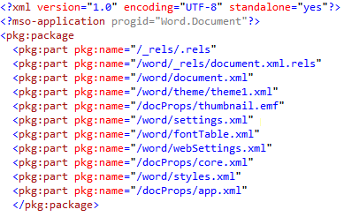

# <a name="create-better-add-ins-for-word-with-office-open-xml"></a>Office Open XML ????????? Word ??????????

**???:** Stephanie Krieger, Microsoft Corporation | Juan Balmori Labra, Microsoft Corporation

Word ????? Office ??????????????JavaScript API for Office (Office.js) ???????????????????????????????????????????????????????????????????? ???????HTML?Office Open XML ?????????

???????????????????????????????????????????????????????????????????????????????? ??????????????HTML ???????????????????????????????????????????????HTML ??????????????????????????Office Open XML ??Word ?? (.docx?.dotx ??) ??????????????Word ???????????????????????????????????????????????????????????????????????????????? Office Open XML ????????????????????????????

> [!NOTE]
> Office Open XML ? PowerPoint ? Excel (?????Office 2013 ???Visio) ????????????????????????Word ??????? Office ????????Office Open XML ???????????????????????????? ?????????Office Open XML ?????????[????????](#see-also)???????????

??????Office Open XML ????????????????????? ?????????????????? ???? [Word-Add-in-Load-and-write-Open-XML](https://github.com/OfficeDev/Word-Add-in-Load-and-write-Open-XML) ???????????????????????? Word ?????????? Office Open XML ????????? Office.js ??????????

> [!NOTE]
> ????????**????? ???**??????**??? ?????**???????Word ??????????????????? ????????????


*? 1. ??????????????*


?????????????????????????????????????????????????????????

*? 2. ????????????????????*


????????????????????????????????????????????????

*? 3. ???????*


??????????Office ??????????????????????

*? 4. ????????????????????????????*


?????????????????????????????????????????????????

*? 5. ????? ??????*


?????????? ???????????????????????? (??????) ????????????????

*? 6. ?????????????????? ????*


Word ??????? ???? (???) ???????????????????????????????????

*? 7. ??*


?????????????? (???)?????????????????????????

*? 8. ????????*


???????????????????????????????????????

*? 9. ?????????????????????*


????????????????????????????????????????????????????

*? 10. SmartArt ?*


Office 2013 ??????? SmartArt ???????????? (Office Open XML ???????? SmartArt ?????????????)?

*? 11. ???*


Word ??? Excel ??????? ????????????????????????? Word ?????????????????????????????Office Open XML ?????????????????????????????????????????????????????????? Open XML ????????????????? 2 ????????????? Word 2013 ?????????? ?????????????Word XML ????????????????????[getSelectedDataAsync](https://dev.office.com/reference/add-ins/shared/document.setselecteddataasync) ???????? ??????????????????????????????????????????????????

    
> [!NOTE]
> Office Open XML ????????????????? ???????????????????????Word XML Document ??????????????1 ?? XML ???????????? Office Open XML ???????????????**getSelectedDataAsync** ????? Office Open XML ?????????????????????????

????? Word ?? XML ??????????[????????] ????? ????? [???????] ??????.xml ???????? 2 ??????????????????????Word 2003 ????????????? **[Word XML ??????]** ?????????[Word-Add-in-Get-Set-EditOpen-XML](https://github.com/OfficeDev/Word-Add-in-Get-Set-EditOpen-XML) ????????? ???????????????????????????????????????????????????????????????????????????????????????????????????????????? Office Open XML ????????????????????????????????????????????????????????????????????Office Open XML ????????????????????????????????????????????????????????????????????????????????????????????????????????Office ??????????????????????????????????????????????????? Office Open XML ???????????????????????????????????????????????Office Open XML ??????????????????????????????????????? ????????????????????????????????????????????Office Open XML ???????? ????????????????????????????????????????????????

## <a name="exploring-the-office-open-xml-document-package"></a>Office Open XML ?????? ????????


[getSelectedDataAsync](https://dev.office.com/reference/add-ins/shared/document.getselecteddataasync) ??????????????? Office Open XML ?????? (???????????? Word XML Document ????????)?????????????????????????????????????????????????????????????????????????? ????????????????????????????????????????????????? ???????????????

??? Word ?????? ???????????????????????????????? ?????????????? (????)?Web ??????????????????

????????? 1 ??????????????????????????? 1 ??????????????**getSelectedDataAsync** ????????????????? Office Open XML ???????????????????????????????????? 13 ????????????? (??????????? ?????Office Open XML ??????? ???????????) ??????????????????????????????????????????????????????


> [!TIP]
> ?????????? ???????Office Open XML ???????????????????Visual Studio 2015 ??????**[??] > [????] > [?????????????]** (Ctrl ???????? K ??????Ctrl ???????? D ?????) ????????????????????????????????????? 12 ?????????????????????????????????????????Office Open XML ????????????????????????????????????????????????? **pkg:part** ??????????


*? 12. Visual Studio 2015 ???????????????? ?????????*


*? 13. ???? Word Office Open XML ?????? ?????????????*



??????????????????????????????????????????????????? .rels ???? document.xml ??????????????????????????


    
> [!NOTE]
> ????? ?????????????? 2 ? (?????? Office ????? ID ? XML ??) ??Office Open XML ???????????????????????????????????????????????????? Word ?????????????????????????????????

?????????????????????????????(? 13 ???????????) ???????????????????????????????????????????????????Word ?????? ???????????????? 13 ???????????????????????????????????????????????????????????????


- ????? ???????????? .rels ????????????????????????? (???????????? ???????????????????????????) ?????????????????????????? (????????????) ??????? ??????????????????????????????????????????????????????????
    
- document.xml (??) ???????????????????????????????? document.xml.rels ????????????? 
    

    
   > [!IMPORTANT]
   > ?????? .rels ???? (top-level .rels?document.xml.rels?????????????????????????????) ?????????????????????????Office Open XML ?????????????????????????????????????????[??????????????: ??? ??????](#creating-your-own-markup-best-practices)???????????


- document.xml ????????????????????????????????????????????????????????????????????????????????????????????????????????????????
    
- ????????Office Open XML ?????????????????????????????? Set ??????????????????????????????????????????????theme1.xml ???? (??????????????)????????????? ??? (?????????????)??????? (settings?webSettings?fontTable ???) ???????
    
- ? 1 ????????????????????????? (?????????????????????????????)???????? 2 ???????????????? (?????????????????? 1 ?????????????????????????)?styles.xml ??????????????????????????????????????????[??? Office Open XML ?????????????????](#adding-objects-that-use-additional-office-open-xml-parts)???????????
    

## <a name="inserting-document-content-at-the-selection"></a>????????????? ??????????


?????? 1 ???????????????? Office Open XML ????????????????????????????????????????? JavaScript ????????????


### <a name="simplified-office-open-xml-markup"></a>?????? Office Open XML ??????

??????????????????? Office Open XML ?????????????????? ??????????????????????????????????????????????????????????????????????? (?????????????????????)?


```XML
<pkg:package xmlns:pkg="http://schemas.microsoft.com/office/2006/xmlPackage">
  <pkg:part pkg:name="/_rels/.rels" pkg:contentType="application/vnd.openxmlformats-package.relationships+xml" pkg:padding="512">
    <pkg:xmlData>
      <Relationships xmlns="http://schemas.openxmlformats.org/package/2006/relationships">
        <Relationship Id="rId1" Type="http://schemas.openxmlformats.org/officeDocument/2006/relationships/officeDocument" Target="word/document.xml"/>
      </Relationships>
    </pkg:xmlData>
  </pkg:part>
  <pkg:part pkg:name="/word/document.xml" pkg:contentType="application/vnd.openxmlformats-officedocument.wordprocessingml.document.main+xml">
    <pkg:xmlData>
      <w:document xmlns:w="http://schemas.openxmlformats.org/wordprocessingml/2006/main" >
        <w:body>
          <w:p>
            <w:pPr>
              <w:spacing w:before="360" w:after="0" w:line="480" w:lineRule="auto"/>
              <w:rPr>
                <w:color w:val="70AD47" w:themeColor="accent6"/>
                <w:sz w:val="28"/>
              </w:rPr>
            </w:pPr>
            <w:r>
              <w:rPr>
                <w:color w:val="70AD47" w:themeColor="accent6"/>
                <w:sz w:val="28"/>
              </w:rPr>
              <w:t>This text has formatting directly applied to achieve its font size, color, line spacing, and paragraph spacing.</w:t>
            </w:r>
          </w:p>
        </w:body>
      </w:document>
    </pkg:xmlData>
  </pkg:part>
</pkg:package>
```


> [!NOTE]
> ???????????? XML ??????????????? mso ????????? XML ???? (? 13) ?????????????????????? Word ????????? Word ????????????????????????????Word ? **[????] > [??]** ????????????????? 2013 ???????????? Word ??????????????Word 2013 ????? ??? **[??????] **???????????????????? Word 2013 ?????????????????????????????????


### <a name="javascript-for-using-setselecteddataasync"></a>setSelectedDataAsync ???????? JavaScript


???? Office Open XML ?????????????????????? XML ???????????????????????Office Open XML ????????????????????????? ????????????? 

????????????????????????????? [setSelectedDataAsync](https://dev.office.com/reference/add-ins/shared/document.setselecteddataasync) ?????????????????????????????????**setSelectedDataASync** ??????????????????????????????????????


> [!NOTE]
> _yourXMLfilename_ ????????????? XML ?????????????????????????? XML ??????????????????????????????????????????????[Word-Add-in-Load-and-write-Open-XML](https://github.com/OfficeDev/Word-Add-in-Load-and-write-Open-XML) ??? ?????????????????????????? JavaScript ??????????????


```js
function writeContent() {
    var myOOXMLRequest = new XMLHttpRequest();
    var myXML;
    myOOXMLRequest.open('GET', 'yourXMLfilename', false);
    myOOXMLRequest.send();
    if (myOOXMLRequest.status === 200) {
        myXML = myOOXMLRequest.responseText;
    }
    Office.context.document.setSelectedDataAsync(myXML, { coercionType: 'ooxml' });
}
```


## <a name="creating-your-own-markup-best-practices"></a>??????????????: ??? ??????


??????????????????????????????????????????????????

??????.rels ? document.xml ????????????? ????????????????????????????????????????????? 2 ??????????????


> [!IMPORTANT]
> .rels ????????????????????????????????????? (?????????????????????????????????) ?????????????????????????????? ??????????????????????????????????????????????????? .rels ???????????????????????????.rels?document.xml.rels???????? .rels ?????????????????????????????????

????????????????? .rels ???????????????????? ?????? ????? ????????? ???????????.rels ?????????????????????????????document.xml ?????????????????????????? (?????? ID ? "rID1" ???)?


```XML
<pkg:part pkg:name="/_rels/.rels" pkg:contentType="application/vnd.openxmlformats-package.relationships+xml" pkg:padding="512">
  <pkg:xmlData>
    <Relationships xmlns="http://schemas.openxmlformats.org/package/2006/relationships">
      <Relationship Id="rId3" Type="http://schemas.openxmlformats.org/package/2006/relationships/metadata/core-properties" Target="docProps/core.xml"/>
      <Relationship Id="rId2" Type="http://schemas.openxmlformats.org/package/2006/relationships/metadata/thumbnail" Target="docProps/thumbnail.emf"/>
      <Relationship Id="rId1" Type="http://schemas.openxmlformats.org/officeDocument/2006/relationships/officeDocument" Target="word/document.xml"/>
      <Relationship Id="rId4" Type="http://schemas.openxmlformats.org/officeDocument/2006/relationships/extended-properties" Target="docProps/app.xml"/>
    </Relationships>
  </pkg:xmlData>
</pkg:part>
```


> [!IMPORTANT]
> ??????????????????????????? (????**Relationship** ??) ????????????????????????????????????????????????????????????????????????????

????????????????????? ?????????????????? document.xml ???????????

```XML
<pkg:part pkg:name="/word/document.xml" pkg:contentType="application/vnd.openxmlformats-officedocument.wordprocessingml.document.main+xml">
    <pkg:xmlData>
      <w:document mc:Ignorable="w14 w15 wp14" xmlns:wpc="http://schemas.microsoft.com/office/word/2010/wordprocessingCanvas" xmlns:mc="http://schemas.openxmlformats.org/markup-compatibility/2006" xmlns:o="urn:schemas-microsoft-com:office:office" xmlns:r="http://schemas.openxmlformats.org/officeDocument/2006/relationships" xmlns:m="http://schemas.openxmlformats.org/officeDocument/2006/math" xmlns:v="urn:schemas-microsoft-com:vml" xmlns:wp14="http://schemas.microsoft.com/office/word/2010/wordprocessingDrawing" xmlns:wp="http://schemas.openxmlformats.org/drawingml/2006/wordprocessingDrawing" xmlns:w10="urn:schemas-microsoft-com:office:word" xmlns:w="http://schemas.openxmlformats.org/wordprocessingml/2006/main" xmlns:w14="http://schemas.microsoft.com/office/word/2010/wordml" xmlns:w15="http://schemas.microsoft.com/office/word/2012/wordml" xmlns:wpg="http://schemas.microsoft.com/office/word/2010/wordprocessingGroup" xmlns:wpi="http://schemas.microsoft.com/office/word/2010/wordprocessingInk" xmlns:wne="http://schemas.microsoft.com/office/word/2006/wordml" xmlns:wps="http://schemas.microsoft.com/office/word/2010/wordprocessingShape">
        <w:body>
          <w:p>
            <w:pPr>
              <w:spacing w:before="360" w:after="0" w:line="480" w:lineRule="auto"/>
              <w:rPr>
                <w:color w:val="70AD47" w:themeColor="accent6"/>
                <w:sz w:val="28"/>
              </w:rPr>
            </w:pPr>
            <w:r>
              <w:rPr>
                <w:color w:val="70AD47" w:themeColor="accent6"/>
                <w:sz w:val="28"/>
              </w:rPr>
              <w:t>This text has formatting directly applied to achieve its font size, color, line spacing, and paragraph spacing.</w:t>
            </w:r>
            <w:bookmarkStart w:id="0" w:name="_GoBack"/>
            <w:bookmarkEnd w:id="0"/>
          </w:p>
          <w:p/>
          <w:sectPr>
            <w:pgSz w:w="12240" w:h="15840"/>
            <w:pgMar w:top="1440" w:right="1440" w:bottom="1440" w:left="1440" w:header="720" w:footer="720" w:gutter="0"/>
            <w:cols w:space="720"/>
          </w:sectPr>
        </w:body>
      </w:document>
    </pkg:xmlData>
</pkg:part>
```

document.xml ?????????????????? ?????????????????????????? (???????? 14 ????? ??????????????????????????Word ????????????????????????????????????????)? 


- ??? **w:document** ?????????????? (**xmlns**) ???????????????????????????????????????????????????????????????????
    
    ?????? ??????????????????????????????????????????????document.xml ???????????????????????? **w:** ????????? **w:document** ?????????????????? **xmlns:w** ?????
    

> [!TIP]
> ??????? Visual Studio 2015 ?????????????????????????????????????????????????????????????????????????????????????????????????????**xmlns:mc** ???????????????????????? **mc:Ignorable** ???????????????


- ??? body ??????????? (**w:p**) ?????????????? ?????????????
    
- **w:pPr** ?????????????????????????????????????????????????????? (????????????????????????????????????????????)???????????????????????????????????????????????????????????????? **w:rPr** (run ?????) ??????????
    

   > [!NOTE]
   > Word Office Open XML ???????????? ??????????????????????? 2 ?????????????????????????????????????????????????????????? twip (????? 20 ?? 1) ???????????????Office Open XML ?????????????????????????? (1 ?????? 914,400 Emu) ????????????????????????????????Office Art (drawingML) ?????????????????? 100,000 ????????????????????????drawingML ? PowerPoint ??????????????????PowerPoint ?????????? 100 ?????????????Excel ????????????????


- ????????? ?????????????????????????????????? (**w:r**)????????????? ?????????????????????????(???????? ????? 1 ????????????????????????????) ???????????? 1 ?????????????????
    
    ????????????????????????? (??????? 1 ????????????) ??????????????????????????????????? 
    
- ??? Word 2013 ?????????????? "_GoBack" ?????? (**w:bookmarkStart** ? **w:bookmarkEnd**) ??????????????????????????GoBack ?????????????????????????????
    
- ??????????????? **w:sectPr** ?????????? ??????????????????????????????????**setSelectedDataAsync** ???????????????????????? ??????????????????????????????????????????????????????? (???????? **w:sectPr** ?????????) ???????????????????
    

*? 14. document.xml ?????? Word ????????????????????????*


    
> [!TIP]
> ???????????????????????? **w:rsid** ????????????????????????????????????????????????????????????????????????Word ???????????????????????????????????????????????????????????????????????????????????????????????????????????? RSID ?????????????????????? (??????????)??????????????????????????????
 
Word ??????? (??????????????????????) ?????????????????????????????????????????????????????????
   
???????????????? Word ? RSID ?????????????????????? 

1. Word 2013 ??[**????**] ?????[**?????**] ???????
2. [Word ?????] ????? ??????[**?????? ????**] ?????[**?????? ???????**] ???????
3. [?????? ????] ????? ??????[**?????? ?????**] ?????[**???????????????????????????**] ?????????????

RSID ?????????????????????Office Open XML ?????????????????????????????????


1. ??????????????????**Ctrl ?? + Home ??**????????????????????
2. ???????**Space ??**?**Del ??**?**Space ??**?????????????????????

?????????????????????????????????????????????????????????????????????????


## <a name="using-the-same-office-open-xml-structure-for-different-content-types"></a>???????? ?????? Office Open XML ???????


?????????? ??????????????????????? ???????Office ????????? ?????? (???????????????) ???.rels ??? document.xml ??????????????????????????????? ???????????document.xml ? **body** ???????????????????????????????

????? 5 ?? 8 ????????? ?????? Office Open XML ?????????????????????????? [Word-Add-in-Load-and-write-Open-XML](https://github.com/OfficeDev/Word-Add-in-Load-and-write-Open-XML) ??? ??????????????

???????????????? ??????????????????????????????????


### <a name="understanding-drawingml-markup-office-graphics-in-word-what-are-fallbacks"></a>Word ? drawingML ?????? (Office ???????) ?????: ???????????

??????? ????????????????????????????????????????Office 2007 ????????Office Open XML ???????????????? Office ??????? ??????????PowerPoint ? Excel ?????????????2007 ????????Word ??????????? ????????????????????????????? Excel ??????????SmartArt ???????????????????????????????? ??????????Word 2007 ???????????????? (VML) ???????Word ???????? ????????????????????????????????? 2010 ?????????

?????Office Open XML ??? Word ??????? Word 2007 ???????????????? ????????????????? (???? ???????) ????????? VML ????????????

????[Word-Add-in-Load-and-write-Open-XML](https://github.com/OfficeDev/Word-Add-in-Load-and-write-Open-XML) ??? ???????????????? ?????????????????? ??????????????Word 2013 ????????????????????????????? ????????????????????????????? ????????????????????????? ????????????????????????????????

?????????????????????????????????? (???????????) ???????????????????????????????????????????????????????????????????????????


> [!IMPORTANT]
> ???? ???????????????????????????????? document.xml ?????????? (????????????? ????????????????????document.xml ????????????????????????????)???? document.xml ?????????????????????????????????????


#### <a name="about-graphic-positioning"></a>???????????????

??? ???? [Word-Add-in-Load-and-write-Open-XML](https://github.com/OfficeDev/Word-Add-in-Load-and-write-Open-XML) ??? [Word-Add-in-Get-Set-EditOpen-XML](https://github.com/OfficeDev/Word-Add-in-Get-Set-EditOpen-XML) ??????? ???????????????????? ????????????????????????(?????????? ????????????????????????? ??????????????????????????????????????????????????)

??????? ?????????????????????????????????????????????????????????????????? (???????????????????)??????????????????????????????????????????? ??????????????????????????????????? (Word ?????) ??????????? (w:p) ?????????????????????????????????????????????????????????????????????????????????????????????????????????????????????????????????


### <a name="working-with-content-controls"></a>????? ???????????

????? ??????? Word 2013 ?????????????????? Word ????????????????????????????????????????????????????????????

Word ???? 15 ?????????? ??????????? [??] ????????


*? 15. Word ? [??] ??? [??????] ????*


Word ?????? ??????????????? ????????? ???????????????????????? ???????????? ??????? ?????????????????????????? 


- ? 15 ??? **[?????]** ????????????????????????????????? ???????????????????????????
    
- **[???? ???]** ????????????????????? ????????????
    
????? Word ?????????????????????????????????????????????????????Word ??????? XML ??? ??????????????? ????????????????? ????????????????????????????????????(?????????? ????????????????????????? Word ? **[??]** ??? **[???? ???]** ??????)

?????????? ?????????????????????????????????????????????????????????????????? ??????????????????????????????????????????????


    
> [!NOTE]
> Word ? XML ??? ????????????????????????????????????????????????????????????OOXML ??????????????????????????????????? ?????????????????????????????????????????????????

???XML ??? ????? Office.js ???????????? XML ????????????????????????????????Office JavaScript API ????? XML ????????????????????[????????](#see-also)????????????????

Word ????????????????????????????????????????????????????????????? ???? ????? ????????????????? Office Open XML ?????????


    
> [!IMPORTANT]
> ??? ???? ???????????????????? ?????????????????????????? ?????????


```XML
<pkg:package xmlns:pkg="http://schemas.microsoft.com/office/2006/xmlPackage">
  <pkg:part pkg:name="/_rels/.rels" pkg:contentType="application/vnd.openxmlformats-package.relationships+xml" pkg:padding="512">
    <pkg:xmlData>
      <Relationships xmlns="http://schemas.openxmlformats.org/package/2006/relationships">
        <Relationship Id="rId1" Type="http://schemas.openxmlformats.org/officeDocument/2006/relationships/officeDocument" Target="word/document.xml"/>
      </Relationships>
    </pkg:xmlData>
  </pkg:part>
  <pkg:part pkg:name="/word/document.xml" pkg:contentType="application/vnd.openxmlformats-officedocument.wordprocessingml.document.main+xml">
    <pkg:xmlData>
      <w:document xmlns:w="http://schemas.openxmlformats.org/wordprocessingml/2006/main" xmlns:w15="http://schemas.microsoft.com/office/word/2012/wordml" >
        <w:body>
          <w:p/>
          <w:sdt>
              <w:sdtPr>
                <w:alias w:val="MyContentControlTitle"/>
                <w:id w:val="1382295294"/>
                <w15:appearance w15:val="hidden"/>
                <w:showingPlcHdr/>
              </w:sdtPr>
              <w:sdtContent>
                <w:p>
                  <w:r>
                  <w:t>[This text is inside a content control that has its container hidden. You can bind to a content control to add or interact with content at a specified location in the document.]</w:t>
                </w:r>
                </w:p>
              </w:sdtContent>
            </w:sdt>
          </w:body>
      </w:document>
    </pkg:xmlData>
  </pkg:part>
 </pkg:package>
```

???????????????? ??????????????????????????????? ?????????????????????? .rels ??? document.xml ????????????????? 

document.xml ????????? **w:sdt** ???????? ????????????????? ??????? Office Open XML ???????????????????????? ??? ??????????????????????????????????????????????????? (???????????? ???????) ??????????????


- **alias** ??wordnv2 ? [????? ?????? ?????] ????? ??????????? ???????????????????????????????????????????? (????????????)?
    
- ??? **id** ????????????????????????????????????? ID ??????????????? ?????????????????????????????????????????
    
- **appearance** ?????????? ???????????????????????????????w15 ?????????????????? Word 2013 ???????????????????????w15 ????? document.xml ??????????????
    
- **showingPlcHdr** ???????????? ?????????????? (????????) ?????????????????????????????????????????????????????????????????????????????????????????????????????????????
    
- **sdt** ?????????????? (**w:p/**) ??????? ????????????????????? (Word ??????????????????????????????)????????????????????????????????????????????????????????????????????????
    
- ???????????????????????????????????? ?????????????????????????????? (**sdtContent** ?????) ?????? 1 ???????????????????
    

    
> [!NOTE]
> ??????? **w:sdt** ??????????????? ??????????????? ????????????????????????? (Office Open XML ?????????????????????????) ?????????????? ?????????????????????????? ???? Office Open XML ??????? XML ??? (????????) ????????????sdt ??????????????????? ?????????????????? ????? ???? ??? (???? XML ??????? ????????) ???????????? ???????????????? Word ????????????Office Open XML ????????????????????????????????????????????????????????????????????????????????????????????????????????????? ?????????????????????????????????????????????w:sdt ??????????? ?????????????????????????????

??????????Word ??????????????????????????????


## <a name="inserting-content-at-a-designated-location"></a>????????????????


Word ????????????????????????????????????????????????????????????? ??????????????????????? ???????????????????? 

?????????????????????????????


- ???????????????????????????????????????????????????????????????
    
- ?????????????????????????????????????????????????????????????
    
- ????????????????????????????????????????????????????????????????????????????????????????????
    
??? ???? [Word-Add-in-JavaScript-AddPopulateBindings](https://github.com/OfficeDev/Word-Add-in-JavaScript-AddPopulateBindings) ???????????????????????? ???????????????????????????????????????????????????


### <a name="add-and-bind-to-a-named-content-control"></a>????????? ????????????????????


?? JavaScript ????????????????????????


- ???????????Word ????????????????????????? ???? ????? ???????????????????
    
- ????? ?????????? (??? [????? ?????? ?????] ????? ????? **[????]** ?????????Office Open XML ??????? **Alias** ????????) ????????????????????????????????????????
    
- ????????????????????????????????????????????? ???????????????? ?????? ID???????? ID ???????
    

```js
function addAndBindControl() {
    Office.context.document.bindings.addFromNamedItemAsync("MyContentControlTitle", "text", { id: 'myBinding' }, function (result) {
        if (result.status == "failed") {
            if (result.error.message == "The named item does not exist.")
                var myOOXMLRequest = new XMLHttpRequest();
                var myXML;
                myOOXMLRequest.open('GET', '../../Snippets_BindAndPopulate/ContentControl.xml', false);
                myOOXMLRequest.send();
                if (myOOXMLRequest.status === 200) {
                    myXML = myOOXMLRequest.responseText;
                }
                Office.context.document.setSelectedDataAsync(myXML, { coercionType: 'ooxml' }, function (result) {
                    Office.context.document.bindings.addFromNamedItemAsync("MyContentControlTitle", "text", { id: 'myBinding' });
                });
        }
    });
}
```

????????????????????


- [addFromNamedItemAsync](https://dev.office.com/reference/add-ins/shared/bindings.addfromnameditemasync) ??????????????? ??????????????????? 
    
    ??????????????????????????????????????????????????????????????????????????????????????????????????????????????????????????????????????????????????????????????????????????????????????????????????????????????
    
- **addFromNamedItemAsync** ???????????????????????????????????????????????????????????????????????????????????  (???????? MyContentControlTitle ??????????? ??????)????????(**setSelectedDataAsync** ?????) ??????????????????????????????????????????
    

> [!NOTE]
> ??????????????????? ????????????????????????????????????Office Open XML ????????????????????? ?????????? ID ?????????????????????????????

??????????????????????????????????????????????? 2 ?????????????(document.xml ?) ??????????????? ?????????????????  **w15:webExtensionLinked/** ????????

webExtensions1.xml ???????????? ?????????????????????????????????????????????? ID ? ID ????????????????????????**appref** ???????? ?????? ID: ** **we:binding id="myBinding" type="text" appref="1382295294"/** ???


> [!IMPORTANT]
> ??????????????????????????????????? ?????????????? Office Open XML ???????????????????????????????????????????????????


### <a name="populate-a-binding"></a>?????????????


???????????????????????????????????????????????????


```js
function populateBinding(filename) {
  var myOOXMLRequest = new XMLHttpRequest();
  var myXML;
  myOOXMLRequest.open('GET', filename, false);
  myOOXMLRequest.send();
  if (myOOXMLRequest.status === 200) {
      myXML = myOOXMLRequest.responseText;
  }
  Office.select("bindings#myBinding").setDataAsync(myXML, { coercionType: 'ooxml' });
}
```

**setSelectedDataAsync** ???????????????????????????????????????????????????ID ???????????????????????????????? ID (bindings#myBinding) ????????????????????????????? ID (myBinding) ???????????????????????


> [!NOTE]
> ???????????????????????????????????????????????????????????????????????????????????????????????????????????????????? ???? [Word-Add-in-JavaScript-AddPopulateBindings](https://github.com/OfficeDev/Word-Add-in-JavaScript-AddPopulateBindings) ??????????????????? ??????????????????????????????? 2 ?????????? ????????????


## <a name="adding-objects-that-use-additional-office-open-xml-parts"></a>??? Office Open XML ?????????????????


??????????????Office Open XML ?????????????? ????????????????????????????1 ????????????????document.xml ????????????????????

????????????????


- ??????????????????? (????? 2 ?????????????????? 9 ?????????????) ?? styles.xml ?????????
    
- ?? (? 3 ???? 4 ????????) ???1 ? (2 ???????) ????????????????????
    
- SmartArt ? (? 10 ?????) ?????????????????????????????????????
    
- ??? (? 11 ?????????) ??????????????? (.rels) ?????????????????????
    
????????? ???? [Word-Add-in-Load-and-write-Open-XML](https://github.com/OfficeDev/Word-Add-in-Load-and-write-Open-XML) ??????????????? ????????????????????????????????????????????????????????????????????????????????????????????? (?????????? ??????????) ????? JavaScript ????????????????? ??????????????

??????????????????? ???????????????????????????


> [!IMPORTANT]
> document.xml ???????????????????document.xml.rels ??styles.xml ??????????????????????????????????????????


### <a name="working-with-styles"></a>?????????

????????????????????????????????????????????????????????????????????????????????????????????????????????????????????????????????????


#### <a name="editing-the-markup-for-content-using-paragraph-styles"></a>????????????????????????????

??????????? 2 ?????????????????????????????????


```XML
<w:body>
  <w:p>
    <w:pPr>
      <w:pStyle w:val="Heading1"/>
    </w:pPr>
    <w:r>
      <w:t>This text is formatted using the Heading 1 paragraph style.</w:t>
    </w:r>
  </w:p>
</w:body>
```


> [!NOTE]
> ?????????document.xml ??????????????????????????????????????????????????????????????????????????????????????????????????????????????????????????????????????????????????????????????????????????????????????????????????????????????????????????????? (?????????? 1 ???????????????)??????????????????????????????????????

????????????????????????????????????????????????????????????? ???????????????????????????????????????????????styles.xml ???????????document.xml ????????????????????????????????????????????????????

????styles.xml part ???????????????????????????????????????????????????????????????


- styles.xml ??????????????????????????????????????????????????????????**xmlns:w** ??????????????????????
    
- ???? ????????? **w:docDefaults** ?? ???????????????????????????????????????????????????
    
- styles.xml ????????????????docDefaults ???????? **w:latentStyles** ?????????????????????????????? (Styles ?????? Styles ????????????) ??????????????????????????????????????????????????
    
- ??????????????????????????????????????????????????????????????????????????????????????????????????????????????????????????????????????????????????????
    

   > [!NOTE]
   > ???????????????????Char ?????????????????????????????????? ??????????????????????????????????????????????????????????????????????????????????? (**w:rPr**) ?????document.xml ???????? ?? (**w:pPr**) ??????????????????????????????????????????????????????????????????????????????


- ????????????????????????????????????????????????? Office Open XML ?????????????????????????????? ID????????? 1 ??????????????????????
    
    ?????????????????????? ???????? (??????????????????????)??????????? ????????????????????styles.xml ????????????????????????????????????????? ??????????????????????????????????????????????????????
    
??????????? 2 ??????? ????? styles.xml ?????????????????????????????????????????? 1 ???????????????????? 


> [!NOTE]
> ????????? 1 ???????? Word 2013 ????????????


```XML
<pkg:part pkg:name="/word/styles.xml" pkg:contentType="application/vnd.openxmlformats-officedocument.wordprocessingml.styles+xml">
  <pkg:xmlData>
    <w:styles xmlns:w="http://schemas.openxmlformats.org/wordprocessingml/2006/main" >
      <w:style w:type="paragraph" w:styleId="Heading1">
        <w:name w:val="heading 1"/>
        <w:basedOn w:val="Normal"/>
        <w:next w:val="Normal"/>
        <w:link w:val="Heading1Char"/>
        <w:uiPriority w:val="9"/>
        <w:qFormat/>
        <w:pPr>
          <w:keepNext/>
          <w:keepLines/>
          <w:spacing w:before="240" w:after="0" w:line="259" w:lineRule="auto"/>
          <w:outlineLvl w:val="0"/>
        </w:pPr>
        <w:rPr>
          <w:rFonts w:asciiTheme="majorHAnsi" w:eastAsiaTheme="majorEastAsia" w:hAnsiTheme="majorHAnsi" w:cstheme="majorBidi"/>
          <w:color w:val="2E74B5" w:themeColor="accent1" w:themeShade="BF"/>
          <w:sz w:val="32"/>
          <w:szCs w:val="32"/>
        </w:rPr>
      </w:style>
    </w:styles>
  </pkg:xmlData>
</pkg:part>
```


#### <a name="editing-the-markup-for-content-using-table-styles"></a>???????????????????????????


?????????????????????????????????????styles.xml ????????????????????????????????????????????????????????????ID?????? 1 ????????????????????????????????????? ??????????????????????????????????

????document.xml ??? styles.xml ???????????????????????????????????????????????????????????????


- document.xml ??????????????????????????????????????????????????????????????????????????????????????????????????????????????????
    
- styles.xml ?????? 1 ?????????????????????????????????????????????????????? (??)???????????????????????????????????????? 
    

### <a name="working-with-images"></a>???????


??????????????????????? ???????????? 1 ?????????????????????????????????????????????????????????????????? ??????????????????Visual Studio ????????????????????????????????????????????????????????????????

????????? ???? [Word-Add-in-Load-and-write-Open-XML](https://github.com/OfficeDev/Word-Add-in-Load-and-write-Open-XML) ?? 3 ??????????????????????????document.xml ???????????????????????????????????????????????????????????????????????????????????? **a:blip** ???????????


```XML
<a:blip r:embed="rId4" cstate="print">
```

???????????????????? (**r:embed="rID4"**)???????????????????????????Office Open XML ?????????? ????????????????????????????????????? styles.xml ???????????styles.xml ????????????????????????????????????????????????????????????????????????????? (????)????????????????????


> [!NOTE]
> ????????????a:blip ???????????????????????????document.xml ??**xlmns:a** ???? (???? drawingML ????) ? document.xml ???????????drawingML ?????????????????????????????????????????????? (r) ? document.xml ??????????????????????????????????????????????????????????????????????????????????????????????????????document.xml ???????????????????????????


### <a name="understanding-additional-image-parts-and-formatting"></a>?????????????????????


? 4 ? (???????????????) ????????????????????????????????? Office ???????????????????????? HD ???????????? ??? ????????????????????? HD ????????????????????????????????? document.xml ?????????????


```XML
<a14:imgLayer r:embed="rId5">
```

[Word-Add-in-Load-and-write-Open-XML](https://github.com/OfficeDev/Word-Add-in-Load-and-write-Open-XML) ??? ?????? 4 ??????????? (?????????????) ????????????????????


### <a name="working-with-smartart-diagrams"></a>SmartArt ??????


SmartArt ??? 4 ????????????????????? 2 ??????[Word-Add-in-Load-and-write-Open-XML](https://github.com/OfficeDev/Word-Add-in-Load-and-write-Open-XML) ??? ????? SmartArt ????????????????????????????????????????????????????????


> [!NOTE]
> ???????????????????????????????????????????? "1" ????????????????


- layout1.xml: ???????????????????????????????????????????
    
- data1.xml: ????????????????????????????????????????
    
- drawing1.xml: ???????????????????????????????????????????????????????????????????????????????????????????
    
- colors1.xml: ????????????????????????????????????????Office Open XML ????????????? Word ? SmartArt ???? [????] ???????? SmartArt ??????????????? ??????????????????????????????????
    
- quickStyles1.xml: ????????????????????? ?????????????????? SmartArt ?????????????????????????????????????(????????????? ?????????????????????????????)?
    

> [!TIP]
> SmartArt layout1.xml ???????????????????????????????????????????????????? (???????????????????????????????????)??????????????????????????**dgm:sampData** ??????????????????????? ???????SmartArt ???? ???????????????? ????????????????????????????????????? ???????????

document.xml ? SmartArt ?????????????????????????? ???? ????????????? ID ???????????????????????????????????????????????document.xml ????????? ?????????????? (???????????????????????????????? ?????????)????????????????????????????????????????????????????????document.xml ? **dgm:relIds** ????????????????????????????????????????? ????????????? ID ?????????


### <a name="working-with-charts"></a>????????


SmartArt ???????????????????????????????????????? SmartArt ????????????????????????? ?????????????????????????????????????


> [!NOTE]
> SmartArt ??????????????????????????????????????????????????????? "1" ?????????????


- document.xml.rels ?????? (chart1.xml) ????????????????????????
    
- ???chart1.xml.rels ???Office Open XML ???????????????????? ??????????
    
    chart1.xml.rels ?? 3 ???????????????1 ????????????????? Excel ?????? ??? (??) ??????????????? ??? (colors1.xml ? styles1.xml) ??????
    
Word 2013 ???????????????????? Excel 2013 ?????????????Office Open XML ?????????? ?????????????? Excel ????????????????????? ??? ?????????? Excel ???? ????????????????????????????????????????????????????????????????? Office Open XML ????????????????????

????SmartArt ????????????? ??????????????????? ?????????????????????????????????????? ???????????????????????????????????

[Word-Add-in-Load-and-write-Open-XML](https://github.com/OfficeDev/Word-Add-in-Load-and-write-Open-XML) ??? ?????? 11 ??????????????????????????????


## <a name="editing-the-office-open-xml-for-use-in-your-task-pane-add-in"></a>??????? ???????????? Office Open XML ?????


???????????????????????????????????????????????? Office Open XML ??????????????????????????????????? ???????????????????????????????


> [!NOTE]
> ?????????? .rels ????????????????????????? ???????????????????????????


1. ?????? XML ????? Visual Studio 2015 ????Ctrl+K?Ctrl+D ????????????????????????????/?????????????????????????????????????????????????????????????????????????? (??????? base64 ???? ?????)????????????????????????????????????
    
2. ?????? ????????????????????????? Office Open XML ???????????????????????????????????????? (????????????????????) ????????????????????????????????????????????????????theme1?fontTable?settings?webSettings????????? ????? ????????? ????? ????????????????webExtension ???????????
    
3. ????????????????????????????????????????????????????????????????????????????????
    
4. document.xml.rels ????????????????????? ????SmartArt ??????????????????????????????????????????????????????????????????????????????????????????????????????????????????? document.xml.rels ???????????? ???????????????????????????????????
    
5. ????????? .rels ??? (chart#.xml.rels ??) ????????????????????????????????????????????????????????? (???????? ??????)???????????????????????????????????
    
6. document.xml ??????????????????????????????????????????????? ?????????????????????????????????????????? ??????????????????????? ???????????????????
    
7. ???? ??????????????????????????????????????????????????????????
    
?? 7 ???????????????????????????????????? 90 ?? 100% ??????????????????????????????????????

??????????????????????????????????????????????????????????? ???? [Word-Add-in-Get-Set-EditOpen-XML](https://github.com/OfficeDev/Word-Add-in-Get-Set-EditOpen-XML) ?????? ??????????????????????????????????????????????????


> [!TIP]
> ??????????????? Office Open XML ???????????????????????? Office Open XML ?????????????????????????????????????????????XML ????????????????????????????????????????????????????????????????????? Web ??????????????????????????? ????????????Visual Studio 2015 ?????????????????**[????]** ????? **[????????]** ???????**[??]** ??**[Web ?????]** ????????**[Internet Explorer ?????]** ???????


## <a name="creating-an-add-in-for-both-template-and-stand-alone-use"></a>????????????????????????????????


?????????????? Office Open XML ????????????????????Office Open XML ???????????????????????????? ????? ??????????????? (???????) ???????????????? JavaScript ??????????????????????????

?????????????? (????????????????? ?????????????????) ???????????????????????????????????????????????????????????????????????????????????????????????????????

???????? ????????????????????????????????????????????????????????????????????????????????????????????????????????????????????????????????????????????????? JavaScript ????? (??????[??????? ????????????????????](#add-and-bind-to-a-named-content-control)???????)?

?????????????????????????????????????????????????????????????????????????????????????API ??????????????????????????????????????????????????????????????????????????customXML ?????????????????????????? ??????????????????? customXML ????????????????????????????????


## <a name="see-also"></a>????

- [JavaScript API for Office ](https://dev.office.com/reference/add-ins/javascript-api-for-office) 
- [ECMA 376 ??: Office Open XML ??????](http://www.ecma-international.org/publications/standards/Ecma-376.htm) (Open XML ???????????? ??????????????????????????????) 
- [OpenXMLDeveloper.org](http://www.openxmldeveloper.org)
- [JavaScript API for Office ??????:??? ????????? XML ???](https://msdn.microsoft.com/en-us/magazine/dn166930.aspx)
    
