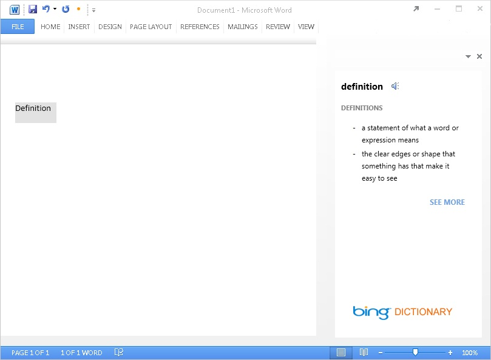
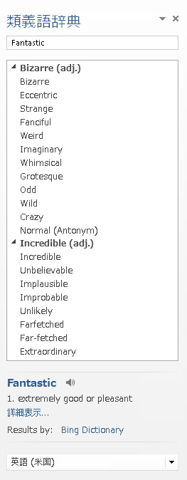
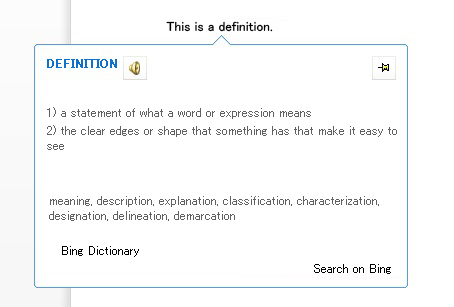
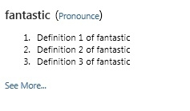

# <a name="create-a-dictionary-task-pane-add-in"></a><span data-ttu-id="a1e18-102">辞書の作業ウィンドウ アドインを作成する</span><span class="sxs-lookup"><span data-stu-id="a1e18-102">Create a dictionary task pane add-in</span></span>


<span data-ttu-id="a1e18-103">この記事では、例として、Word 2013 のドキュメントでユーザーの現在の選択範囲に対応する辞書の定義や類義語辞典の同意語を表示する作業ウィンドウ アドインと、それに付随する Web サービスについて取り上げます。</span><span class="sxs-lookup"><span data-stu-id="a1e18-103">This article shows you an example of a task pane add-in with an accompanying web service that provides dictionary definitions or thesaurus synonyms for the user's current selection in a Word 2013 document.</span></span> 

<span data-ttu-id="a1e18-104">辞書の Office アドインは、標準的な作業ウィンドウ アドインを基盤として、辞書の XML Web サービスに対するクエリの機能と、取得した定義を Office アプリケーションの UI 上の別の場所に表示する機能が追加されたものです。</span><span class="sxs-lookup"><span data-stu-id="a1e18-104">A dictionary Office Add-in is based on the standard task pane add-in with additional features to support querying and displaying definitions from a dictionary XML web service in additional places in the Office application's UI.</span></span> 

<span data-ttu-id="a1e18-p101">一般的な辞書作業ウィンドウ アドインで、ユーザーが自分のドキュメントで単語または語句を選択すると、アドインの背景にある JavaScript ロジックにより、この選択はディクショナリ プロバイダーの XML Web サービスに渡されます。ディクショナリ プロバイダーの Web ページは更新され、ユーザーに選択範囲の定義が表示されます。XML Web サービス コンポーネントは、OfficeDefinitions XML スキーマが定める形式で、最大 3 つの定義を返します。アプリはこれを、ホストの Office アプリケーションの UI 上の別の場所に表示します。図 1 は、Word 2013 で実行されている Bing ブランドの辞書アドインの選択および表示エクスペリエンスを示しています。</span><span class="sxs-lookup"><span data-stu-id="a1e18-p101">In a typical dictionary task pane add-in, a user selects a word or phrase in their document, and the JavaScript logic behind the add-in passes this selection to the dictionary provider's XML web service. The dictionary provider's webpage then updates to show the definitions for the selection to the user. The XML web service component returns up to three definitions in the format defined by the OfficeDefinitions XML schema, which are then displayed to the user in other places in the hosting Office application's UI. Figure 1 shows the selection and display experience for a Bing-branded dictionary add-in that is running in Word 2013.</span></span>

<span data-ttu-id="a1e18-109">*図 1. 選択した語句の定義を表示する辞書アドイン*</span><span class="sxs-lookup"><span data-stu-id="a1e18-109">*Figure 1. Dictionary add-in displaying definitions for the selected word*</span></span>



<span data-ttu-id="a1e18-p102">辞書アドインの HTML UI で 「**さらに表示**」リンクをクリックして、作業ウィンドウ内に詳細情報を表示するか、別のブラウザー ウィンドウを開いて、選択した単語または語句の完全な Web ページを表示するかはユーザー次第です。図 2 は、ユーザーがインストール済みの辞書を簡単に起動するための、**[定義]** コンテキスト メニュー コマンドを示しています。図 3 から 5 は、辞書 XML サービスを使用して Word 2013 で定義を提供する、Office UI の場所を示しています。</span><span class="sxs-lookup"><span data-stu-id="a1e18-p102">It is up to you to determine if clicking the  **See More** link in the dictionary add-in's HTML UI displays more information within the task pane or opens a separate browser window to the full webpage for the selected word or phrase. Figure 2 shows the  **Define** context menu command that enables users to quickly launch installed dictionaries. Figures 3 through 5 show the places in the Office UI where the dictionary XML services are used to provide definitions in Word 2013.</span></span>

<span data-ttu-id="a1e18-114">*図 2. コンテキスト メニューの定義コマンド*</span><span class="sxs-lookup"><span data-stu-id="a1e18-114">*Figure 2. Define command in the context menu*</span></span>


<span data-ttu-id="a1e18-116">*図 3. スペル チェック ウィンドウと文章校正ウィンドウでの定義の表示*</span><span class="sxs-lookup"><span data-stu-id="a1e18-116">*Figure 3. Definitions in the Spelling and Grammar panes*</span></span>


<span data-ttu-id="a1e18-118">*図 4. 類義語辞典ウィンドウでの定義の表示*</span><span class="sxs-lookup"><span data-stu-id="a1e18-118">*Figure 4. Definitions in the Thesaurus pane*</span></span>




<span data-ttu-id="a1e18-120">*図 5. 読み取りモードでの定義*</span><span class="sxs-lookup"><span data-stu-id="a1e18-120">*Figure 5. Definitions in Reading Mode*</span></span>



<span data-ttu-id="a1e18-122">辞書の検索機能を持つ作業ウィンドウ アドインを作成するには、次の 2 つの主要なコンポーネントを作成します。</span><span class="sxs-lookup"><span data-stu-id="a1e18-122">To create a task pane add-in that provides a dictionary lookup, you create two main components:</span></span> 


- <span data-ttu-id="a1e18-123">XML Web サービス。辞書サービスで定義を検索し、辞書アドインが利用および表示できる XML 形式でその定義を返します。</span><span class="sxs-lookup"><span data-stu-id="a1e18-123">An XML web service that looks up definitions from a dictionary service, and then returns those values in an XML format that can be consumed and displayed by the dictionary add-in.</span></span>
    
- <span data-ttu-id="a1e18-124">作業ウィンドウ アドイン。ユーザーの現在の選択範囲を辞書の Web サービスに送信し、定義を表示します。必要に応じてその値をドキュメントに挿入することもできます。</span><span class="sxs-lookup"><span data-stu-id="a1e18-124">A task pane add-in that submits the user's current selection to the dictionary web service, displays definitions, and can optionally insert those values into the document.</span></span>
    
<span data-ttu-id="a1e18-125">以下のセクションでは、これらのコンポーネントの作成方法の例を示します。</span><span class="sxs-lookup"><span data-stu-id="a1e18-125">The following sections provide examples of how to create these components.</span></span>

## <a name="creating-a-dictionary-xml-web-service"></a><span data-ttu-id="a1e18-126">辞書の XML Web サービスの作成</span><span class="sxs-lookup"><span data-stu-id="a1e18-126">Creating a dictionary XML web service</span></span>


<span data-ttu-id="a1e18-p103">XML Web サービスでは、クエリを OfficeDefinitions XML スキーマに準拠した XML で Web サービスに返す必要があります。以下の 2 つのセクションでは、OfficeDefinitions XML スキーマについて説明し、この XML 形式でクエリを返す XML Web サービスのコーディング方法の例を示します。</span><span class="sxs-lookup"><span data-stu-id="a1e18-p103">The XML web service must return queries to the web service as XML that conforms to the OfficeDefinitions XML schema. The following two sections describe the OfficeDefinitions XML schema, and provide an example of how to code an XML web service that returns queries in that XML format.</span></span>


### <a name="officedefinitions-xml-schema"></a><span data-ttu-id="a1e18-129">OfficeDefinitions XML スキーマ</span><span class="sxs-lookup"><span data-stu-id="a1e18-129">OfficeDefinitions XML schema</span></span>

<span data-ttu-id="a1e18-130">次のコードは、OfficeDefinitions XML スキーマの XSD を示します。</span><span class="sxs-lookup"><span data-stu-id="a1e18-130">The following code shows the XSD for the OfficeDefinitions XML Schema.</span></span>


```XML
<?xml version="1.0" encoding="utf-8"?>
<xs:schema
  xmlns:xsi="https://www.w3.org/2001/XMLSchema-instance"
  xmlns:xs="https://www.w3.org/2001/XMLSchema"
  targetNamespace="http://schemas.microsoft.com/NLG/2011/OfficeDefinitions"
  xmlns="http://schemas.microsoft.com/NLG/2011/OfficeDefinitions">
  <xs:element name="Result">
    <xs:complexType>
      <xs:sequence>
        <xs:element name="SeeMoreURL" type="xs:anyURI"/>
        <xs:element name="Definitions" type="DefinitionListType"/>
      </xs:sequence>
    </xs:complexType>
  </xs:element>
  <xs:complexType name="DefinitionListType">
    <xs:sequence>
      <xs:element name="Definition" maxOccurs="3">
        <xs:simpleType>
          <xs:restriction base="xs:normalizedString">
            <xs:maxLength value="400"/>
          </xs:restriction>
        </xs:simpleType>
      </xs:element>
    </xs:sequence>
  </xs:complexType>
</xs:schema>
```

<span data-ttu-id="a1e18-p104">OfficeDefinitions スキーマに準拠した XML では、ルートの **Result** 要素の中に **Definitions** 要素を 1 個記述し、その子要素として 0 から 3 個の **Definition** 要素に定義を記述して返します。それぞれの定義は最大 400 文字です。また、辞書サイトの結果ページの URL を **SeeMoreURL** 要素で指定する必要があります。次の例は、OfficeDefinitions スキーマに準拠して返す XML の構造を示します。</span><span class="sxs-lookup"><span data-stu-id="a1e18-p104">Returned XML that conforms to the OfficeDefinitions schema consists of a root  **Result** element that contains a **Definitions** element with from zero to three **Definition** child elements, each of which contains definitions that are no more than 400 characters in length. Additionally, the URL to the full page on the dictionary site must be provided in the **SeeMoreURL** element. The following example shows the structure of returned XML that conforms to the OfficeDefinitions schema.</span></span>

```XML
<?xml version="1.0" encoding="utf-8"?>
<Result xmlns="http://schemas.microsoft.com/NLG/2011/OfficeDefinitions">
  <SeeMoreURL xmlns="">www.bing.com/dictionary/search?q=example</SeeMoreURL>
  <Definitions xmlns="">
    <Definition>Definition1</Definition>
    <Definition>Definition2</Definition>
    <Definition>Definition3</Definition>
  </Definitions>
 </Result>

```


### <a name="sample-dictionary-xml-web-service"></a><span data-ttu-id="a1e18-134">辞書の XML Web サービスのサンプル</span><span class="sxs-lookup"><span data-stu-id="a1e18-134">Sample dictionary XML web service</span></span>

<span data-ttu-id="a1e18-135">次の C# コードは、辞書クエリの結果を OfficeDefinitions XML 形式で返す XML Web サービスのコードの簡単な作成例です。</span><span class="sxs-lookup"><span data-stu-id="a1e18-135">The following C# code provides a simple example of how to write code for an XML web service that returns the result of a dictionary query in the OfficeDefinitions XML format.</span></span>


```cs
using System;
using System.Collections.Generic;
using System.Linq;
using System.Web;
using System.Web.Services;
using System.Xml;
using System.Text;
using System.IO;
using System.Net;

/// <summary>
/// Summary description for _Default
/// </summary>
[WebService(Namespace = "http://tempuri.org/")]
[WebServiceBinding(ConformsTo = WsiProfiles.BasicProfile1_1)]
// To allow this web service to be called from script, using ASP.NET AJAX, uncomment the following line. 
// [System.Web.Script.Services.ScriptService]
public class WebService : System.Web.Services.WebService {

    public WebService () {

        // Uncomment the following line if using designed components 
        // InitializeComponent(); 
    }

    // You can replace this method entirely with your own method that gets definitions
    // from your data source, and then formats it into the OfficeDefinitions XML format. 
    // If you need a reference for constructing the returned XML, you can use this example as a basis.
    [WebMethod]
    public XmlDocument Define(string word)
    {

        StringBuilder sb = new StringBuilder();
        XmlWriter writer = XmlWriter.Create(sb);
        {
            writer.WriteStartDocument();
            
                writer.WriteStartElement("Result", "http://schemas.microsoft.com/NLG/2011/OfficeDefinitions");

            // See More URL should be changed to the dictionary publisher's page for that word on their website.
                    writer.WriteElementString("SeeMoreURL", "http://www.bing.com/search?q=" + word);

                    writer.WriteStartElement("Definitions");
            
                        writer.WriteElementString("Definition", "Definition 1 of " + word);
                        writer.WriteElementString("Definition", "Definition 2 of " + word);
                        writer.WriteElementString("Definition", "Definition 3 of " + word);
                   
                    writer.WriteEndElement();


                writer.WriteEndElement();
            
            writer.WriteEndDocument();
        }
        writer.Close();

        XmlDocument doc = new XmlDocument();
        doc.LoadXml(sb.ToString());

        return doc;
    }
}
```


## <a name="creating-the-components-of-a-dictionary-add-in"></a><span data-ttu-id="a1e18-136">辞書アドインのコンポーネントの作成</span><span class="sxs-lookup"><span data-stu-id="a1e18-136">Creating the components of a dictionary add-in</span></span>


<span data-ttu-id="a1e18-137">辞書アドインは 3 つの主要なコンポーネント ファイルで構成されます。</span><span class="sxs-lookup"><span data-stu-id="a1e18-137">A dictionary add-in consists of three main component files:</span></span>


- <span data-ttu-id="a1e18-138">アドインについての情報を記述した XML マニフェスト ファイル。</span><span class="sxs-lookup"><span data-stu-id="a1e18-138">An XML manifest file that describes the add-in.</span></span>
    
- <span data-ttu-id="a1e18-139">アドインの UI を記述した HTML ファイル</span><span class="sxs-lookup"><span data-stu-id="a1e18-139">An HTML file that provides the add-in's UI.</span></span>
    
- <span data-ttu-id="a1e18-140">ユーザーの選択範囲をドキュメントから取得し、選択範囲をクエリとして Web サービスに送信し、返された結果をアドインの UI に表示するロジックを記述した JavaScript ファイル。</span><span class="sxs-lookup"><span data-stu-id="a1e18-140">A JavaScript file that provides logic to get the user's selection from the document, sends the selection as a query to the web service, and then displays returned results in the add-in's UI.</span></span>
    

### <a name="creating-a-dictionary-add-ins-manifest-file"></a><span data-ttu-id="a1e18-141">辞書アドインのマニフェスト ファイルの作成</span><span class="sxs-lookup"><span data-stu-id="a1e18-141">Creating a dictionary add-in's manifest file</span></span>

<span data-ttu-id="a1e18-142">辞書アドインのマニフェスト ファイルの例を次に示します。</span><span class="sxs-lookup"><span data-stu-id="a1e18-142">The following is an example manifest file for a dictionary add-in.</span></span>


```XML
<?xml version="1.0" encoding="utf-8"?>
<OfficeApp xmlns="http://schemas.microsoft.com/office/appforoffice/1.0" xmlns:xsi="https://www.w3.org/2001/XMLSchema-instance" xsi:type="TaskPaneApp">
  <Id>7164e750-dc86-49c0-b548-1bac57abdc7c</Id>
  <Version>15.0</Version>
  <ProviderName>Microsoft Office Demo Dictionary</ProviderName>
  <DefaultLocale>en-us</DefaultLocale>
  <!--DisplayName is the name that will appear in the user's list of applications.-->
  <DisplayName DefaultValue="Microsoft Office Demo Dictionary" />
  <!--Description is a 2-3 sentence description of this dictionary. -->
  <Description DefaultValue="The Microsoft Office Demo Dictionary is an example built to demonstrate how a publisher could create a dictionary that integrates with Office. It does not return real definitions." />
  <!--IconUrl is the URI for the icon that will appear in the user's list of applications.-->
  <IconUrl DefaultValue="http://officeimg.vo.msecnd.net/_layouts/images/general/office_logo.jpg" />
  <!--Capabilities specifies the kind of host application your dictionary add-in will support. You shouldn't have to modify this area.-->
  <Capabilities>
    <Capability Name="Workbook"/>
    <Capability Name="Document"/>
    <Capability Name="Project"/>
  </Capabilities>
  <DefaultSettings>
    <!--SourceLocation is the URL for your dictionary-->
    <SourceLocation DefaultValue="http://christophernlg/ExampleDictionary/DictionaryHome.html" />
  </DefaultSettings>
  <!--Permissions is the set of permissions a user will have to give your dictionary. If you need write access, such as to allow a user to replace the highlighted word with a synonym, use ReadWriteDocument. -->
  <Permissions>ReadDocument</Permissions>
  <Dictionary>
    <!--TargetDialects is the set of regional languages your dictionary contains. For example, if your dictionary applies to Spanish (Mexico) and Spanish (Peru), but not Spanish (Spain), you can specify that here. Do not put more than one language (for example, Spanish and English) here. Publish separate languages as separate dictionaries. -->
    <TargetDialects>
      <TargetDialect>EN-AU</TargetDialect>
      <TargetDialect>EN-BZ</TargetDialect>
      <TargetDialect>EN-CA</TargetDialect>
      <TargetDialect>EN-029</TargetDialect>
      <TargetDialect>EN-HK</TargetDialect>
      <TargetDialect>EN-IN</TargetDialect>
      <TargetDialect>EN-ID</TargetDialect>
      <TargetDialect>EN-IE</TargetDialect>
      <TargetDialect>EN-JM</TargetDialect>
      <TargetDialect>EN-MY</TargetDialect>
      <TargetDialect>EN-NZ</TargetDialect>
      <TargetDialect>EN-PH</TargetDialect>
      <TargetDialect>EN-SG</TargetDialect>
      <TargetDialect>EN-ZA</TargetDialect>
      <TargetDialect>EN-TT</TargetDialect>
      <TargetDialect>EN-GB</TargetDialect>
      <TargetDialect>EN-US</TargetDialect>
      <TargetDialect>EN-ZW</TargetDialect>
    </TargetDialects>
    <!--QueryUri is the address of this dictionary's XML web service (which is used to put definitions in additional contexts, such as the spelling checker.)-->
    <QueryUri DefaultValue="http://christophernlg/ExampleDictionary/WebService.asmx/Define?word="/>
    <!--Citation Text, Dictionary Name, and Dictionary Home Page will be combined to form the citation line (for example, this would produce "Examples by: Microsoft", where "Microsoft" is a hyperlink to http://www.microsoft.com).-->
    <CitationText DefaultValue="Examples by: " />
    <DictionaryName DefaultValue="Microsoft" />
    <DictionaryHomePage DefaultValue="http://www.microsoft.com" />
  </Dictionary>
</OfficeApp>
```

<span data-ttu-id="a1e18-p105">辞書アドインのマニフェスト ファイルの作成に固有の **Dictionary** 要素とその子要素については、以下のセクションで説明します。マニフェスト ファイルのその他の要素の詳細については、「[Office アドイン XML マニフェスト](../develop/add-in-manifests.md)」を参照してください。</span><span class="sxs-lookup"><span data-stu-id="a1e18-p105">The  **Dictionary** element and its child elements that are specific to creating a dictionary add-in's manifest file are described in the following sections. For information about the other elements in the manifest file, see [Office Add-ins XML manifest](../develop/add-in-manifests.md).</span></span>


### <a name="dictionary-element"></a><span data-ttu-id="a1e18-145">Dictionary 要素</span><span class="sxs-lookup"><span data-stu-id="a1e18-145">Dictionary element</span></span>


<span data-ttu-id="a1e18-146">辞書アドインの設定を指定します。</span><span class="sxs-lookup"><span data-stu-id="a1e18-146">Specifies settings for dictionary add-ins.</span></span>

 <span data-ttu-id="a1e18-147">**親要素**</span><span class="sxs-lookup"><span data-stu-id="a1e18-147">**Parent element**</span></span>

 `<OfficeApp>`

 <span data-ttu-id="a1e18-148">**子要素**</span><span class="sxs-lookup"><span data-stu-id="a1e18-148">**Child elements**</span></span>

 <span data-ttu-id="a1e18-149">`<TargetDialects>`,  `<QueryUri>`,  `<CitationText>`,  `<DictionaryName>`,  `<DictionaryHomePage>`</span><span class="sxs-lookup"><span data-stu-id="a1e18-149"></span></span>

 <span data-ttu-id="a1e18-150">**解説**</span><span class="sxs-lookup"><span data-stu-id="a1e18-150">**Remarks**</span></span>

<span data-ttu-id="a1e18-151">**Dictionary** 要素とその子要素は、辞書アドインを作成するときに作業ウィンドウ アドインのマニフェストに追加されます。</span><span class="sxs-lookup"><span data-stu-id="a1e18-151">The  **Dictionary** element and its child elements are added to the manifest of a task pane add-in when you create a dictionary add-in.</span></span>


#### <a name="targetdialects-element"></a><span data-ttu-id="a1e18-152">TargetDialects 要素</span><span class="sxs-lookup"><span data-stu-id="a1e18-152">TargetDialects element</span></span>


<span data-ttu-id="a1e18-p106">この辞書がサポートする地域言語を指定します。辞書アドインでは必須です。</span><span class="sxs-lookup"><span data-stu-id="a1e18-p106">Specifies the regional languages that this dictionary supports. Required for dictionary add-ins.</span></span>

 <span data-ttu-id="a1e18-155">**親要素**</span><span class="sxs-lookup"><span data-stu-id="a1e18-155">**Parent element**</span></span>

 `<Dictionary>`

 <span data-ttu-id="a1e18-156">**子要素**</span><span class="sxs-lookup"><span data-stu-id="a1e18-156">**Child element**</span></span>

 `<TargetDialect>`

 <span data-ttu-id="a1e18-157">**注釈**</span><span class="sxs-lookup"><span data-stu-id="a1e18-157">**Remarks**</span></span>

<span data-ttu-id="a1e18-p107">**TargetDialects** 要素とその子要素は、辞書に含める地域言語のセットを指定します。たとえば、スペイン語 (メキシコ) とスペイン語 (ペルー) の両方、ただしスペイン語 (スペイン) は含まないというような指定を、この要素で行うことができます。このマニフェストでは、複数の言語 (たとえば、スペイン語と英語) は指定しないでください。異なる言語は、別の辞書として発行してください。</span><span class="sxs-lookup"><span data-stu-id="a1e18-p107">The  **TargetDialects** element and its child elements specify the set of regional languages your dictionary contains. For example, if your dictionary applies to both Spanish (Mexico) and Spanish (Peru), but not Spanish (Spain), you can specify that in this element. Do not specify more than one language (e.g., Spanish and English) in this manifest. Publish separate languages as separate dictionaries.</span></span>

 <span data-ttu-id="a1e18-162">**例**</span><span class="sxs-lookup"><span data-stu-id="a1e18-162">**Example**</span></span>

```XML
<TargetDialects>
  <TargetDialect>EN-AU</TargetDialect>
  <TargetDialect>EN-BZ</TargetDialect>
  <TargetDialect>EN-CA</TargetDialect>
  <TargetDialect>EN-029</TargetDialect>
  <TargetDialect>EN-HK</TargetDialect>
  <TargetDialect>EN-IN</TargetDialect>
  <TargetDialect>EN-ID</TargetDialect>
  <TargetDialect>EN-IE</TargetDialect>
  <TargetDialect>EN-JM</TargetDialect>
  <TargetDialect>EN-MY</TargetDialect>
  <TargetDialect>EN-NZ</TargetDialect>
  <TargetDialect>EN-PH</TargetDialect>
  <TargetDialect>EN-SG</TargetDialect>
  <TargetDialect>EN-ZA</TargetDialect>
  <TargetDialect>EN-TT</TargetDialect>
  <TargetDialect>EN-GB</TargetDialect>
  <TargetDialect>EN-US</TargetDialect>
  <TargetDialect>EN-ZW</TargetDialect>
</TargetDialects>
```


#### <a name="targetdialect-element"></a><span data-ttu-id="a1e18-163">TargetDialect 要素</span><span class="sxs-lookup"><span data-stu-id="a1e18-163">TargetDialect element</span></span>


<span data-ttu-id="a1e18-p108">この辞書がサポートする地域言語を指定します。辞書アドインでは必須です。</span><span class="sxs-lookup"><span data-stu-id="a1e18-p108">Specifies a regional language that this dictionary supports. Required for dictionary add-ins.</span></span>

 <span data-ttu-id="a1e18-166">**親要素**</span><span class="sxs-lookup"><span data-stu-id="a1e18-166">**Parent element**</span></span>

 `<TargetDialects>`

 <span data-ttu-id="a1e18-167">**解説**</span><span class="sxs-lookup"><span data-stu-id="a1e18-167">**Remarks**</span></span>

<span data-ttu-id="a1e18-168">RFC1766 の `language` タグの形式 (たとえば EN-US) で地域言語の値を指定します。</span><span class="sxs-lookup"><span data-stu-id="a1e18-168">Specify the value for a regional language in the RFC1766  `language` tag format, such as EN-US.</span></span>

 <span data-ttu-id="a1e18-169">**例**</span><span class="sxs-lookup"><span data-stu-id="a1e18-169">**Example**</span></span>


```XML
<TargetDialect>EN-US</TargetDialect>
```


#### <a name="queryuri-element"></a><span data-ttu-id="a1e18-170">QueryUri 要素</span><span class="sxs-lookup"><span data-stu-id="a1e18-170">QueryUri element</span></span>


<span data-ttu-id="a1e18-p109">辞書のクエリ サービスのエンドポイントを指定します。辞書アドインでは必須です。</span><span class="sxs-lookup"><span data-stu-id="a1e18-p109">Specifies the endpoint for the dictionary query service. Required for dictionary add-ins.</span></span>

 <span data-ttu-id="a1e18-173">**親要素**</span><span class="sxs-lookup"><span data-stu-id="a1e18-173">**Parent element**</span></span>

 `<Dictionary>`

 <span data-ttu-id="a1e18-174">**解説**</span><span class="sxs-lookup"><span data-stu-id="a1e18-174">**Remarks**</span></span>

<span data-ttu-id="a1e18-p110">これは、辞書プロバイダーの XML Web サービスの URI です。この URI の末尾に、適切にエスケープされたクエリが付加されます。</span><span class="sxs-lookup"><span data-stu-id="a1e18-p110">This is the URI of the XML web service for the dictionary provider. The properly escaped query will be appended to this URI.</span></span> 

 <span data-ttu-id="a1e18-177">**例**</span><span class="sxs-lookup"><span data-stu-id="a1e18-177">**Example**</span></span>


```XML
<QueryUri DefaultValue="http://msranlc-lingo1/proof.aspx?q="/>
```


#### <a name="citationtext-element"></a><span data-ttu-id="a1e18-178">CitationText 要素</span><span class="sxs-lookup"><span data-stu-id="a1e18-178">CitationText element</span></span>


<span data-ttu-id="a1e18-p111">引用で使用するテキストを指定します。辞書アドインでは必須です。</span><span class="sxs-lookup"><span data-stu-id="a1e18-p111">Specifies the text to use in citations. Required for dictionary add-ins.</span></span>

 <span data-ttu-id="a1e18-181">**親要素**</span><span class="sxs-lookup"><span data-stu-id="a1e18-181">**Parent element**</span></span>

 `<Dictionary>`

 <span data-ttu-id="a1e18-182">**解説**</span><span class="sxs-lookup"><span data-stu-id="a1e18-182">**Remarks**</span></span>

<span data-ttu-id="a1e18-183">この要素では、Web サービスから返されたコンテンツの下の行に表示される引用テキストの冒頭部分を指定します (たとえば "Results by: "、"Powered by: " など)。</span><span class="sxs-lookup"><span data-stu-id="a1e18-183">This element specifies the beginning of the citation text that will be displayed on a line below the content that is returned from the web service (for example, "Results by: " or "Powered by: ").</span></span>

<span data-ttu-id="a1e18-p112">この要素では、**Override** 要素を使用して、別のロケールに対応する値を指定できます。たとえば、スペイン語版の SKU の Office を利用しているユーザーが英語の辞書を使用している場合に、引用行を "Results by: Bing" ではなく "Resultados por: Bing" と表示できます。別のロケールに対応する値を指定する方法の詳細については、「[Office アドイン XML マニフェスト](../develop/add-in-manifests.md)」の「別のロケールに対応する設定値の指定」を参照してください。</span><span class="sxs-lookup"><span data-stu-id="a1e18-p112">For this element, you can specify values for additional locales by using the  **Override** element. For example, if a user is running the Spanish SKU of Office, but using an English dictionary, this allows the citation line to read "Resultados por: Bing" rather than "Results by: Bing". For more information about how to specify values for additional locales, see the section "Providing settings for different locales" in [Office Add-ins XML manifest](../develop/add-in-manifests.md).</span></span>

 <span data-ttu-id="a1e18-187">**例**</span><span class="sxs-lookup"><span data-stu-id="a1e18-187">**Example**</span></span>


```XML
<CitationText DefaultValue="Results by: " />
```


#### <a name="dictionaryname-element"></a><span data-ttu-id="a1e18-188">DictionaryName 要素</span><span class="sxs-lookup"><span data-stu-id="a1e18-188">DictionaryName element</span></span>


<span data-ttu-id="a1e18-p113">この辞書の名前を指定します。辞書アドインでは必須です。</span><span class="sxs-lookup"><span data-stu-id="a1e18-p113">Specifies the name of this dictionary. Required for dictionary add-ins.</span></span>

 <span data-ttu-id="a1e18-191">**親要素**</span><span class="sxs-lookup"><span data-stu-id="a1e18-191">**Parent element**</span></span>

 `<Dictionary>`

 <span data-ttu-id="a1e18-192">**解説**</span><span class="sxs-lookup"><span data-stu-id="a1e18-192">**Remarks**</span></span>

<span data-ttu-id="a1e18-p114">この要素では、引用テキスト内のリンク テキストを指定します。引用テキストは、Web サービスから返されたコンテンツの下の行に表示されます。</span><span class="sxs-lookup"><span data-stu-id="a1e18-p114">This element specifies the link text in the citation text. Citation text is displayed on a line below the content that is returned from the web service.</span></span>

<span data-ttu-id="a1e18-195">この要素では、別のロケールに対応する値も指定できます。</span><span class="sxs-lookup"><span data-stu-id="a1e18-195">For this element, you can specify values for additional locales.</span></span>

 <span data-ttu-id="a1e18-196">**例**</span><span class="sxs-lookup"><span data-stu-id="a1e18-196">**Example**</span></span>

```XML
<DictionaryName DefaultValue="Bing Dictionary" />
```


#### <a name="dictionaryhomepage-element"></a><span data-ttu-id="a1e18-197">DictionaryHomePage 要素</span><span class="sxs-lookup"><span data-stu-id="a1e18-197">DictionaryHomePage element</span></span>


<span data-ttu-id="a1e18-p115">辞書のホーム ページの URL を指定します。辞書アドインでは必須です。</span><span class="sxs-lookup"><span data-stu-id="a1e18-p115">Specifies the URL of the home page for the dictionary. Required for dictionary add-ins.</span></span>

 <span data-ttu-id="a1e18-200">**親要素**</span><span class="sxs-lookup"><span data-stu-id="a1e18-200">**Parent element**</span></span>

 `<Dictionary>`

 <span data-ttu-id="a1e18-201">**解説**</span><span class="sxs-lookup"><span data-stu-id="a1e18-201">**Remarks**</span></span>

<span data-ttu-id="a1e18-p116">この要素では、引用テキスト内のリンクの URL を指定します。引用テキストは、Web サービスから返されたコンテンツの下の行に表示されます。</span><span class="sxs-lookup"><span data-stu-id="a1e18-p116">This element specifies the link URL in the citation text. Citation text is displayed on a line below the content that is returned from the web service.</span></span>

<span data-ttu-id="a1e18-204">この要素では、別のロケールに対応する値も指定できます。</span><span class="sxs-lookup"><span data-stu-id="a1e18-204">For this element, you can specify values for additional locales.</span></span>

 <span data-ttu-id="a1e18-205">**例**</span><span class="sxs-lookup"><span data-stu-id="a1e18-205">**Example**</span></span>


```XML
<DictionaryHomePage DefaultValue="http://www.bing.com" />
```


### <a name="creating-a-dictionary-add-ins-html-user-interface"></a><span data-ttu-id="a1e18-206">辞書アドインの HTML ユーザー インターフェイスの作成</span><span class="sxs-lookup"><span data-stu-id="a1e18-206">Creating a dictionary add-in's HTML user interface</span></span>

<span data-ttu-id="a1e18-p117">次の 2 つの例は、デモの辞書アドインの UI の HTML ファイルと CSS ファイルを示します。アドインの作業ウィンドウでの UI の表示については、コードの下の図 6 を参照してください。Dictionary.js ファイル内の JavaScript の実装でこの HTML の UI のプログラミング ロジックを実現する方法については、次の「JavaScript の実装の記述」を参照してください。</span><span class="sxs-lookup"><span data-stu-id="a1e18-p117">The following two examples show the HTML and CSS files for the UI of the Demo Dictionary add-in. To view how the UI is displayed in the add-in's task pane, see Figure 6 following the code. To see how the implementation of the JavaScript in the Dictionary.js file provides programming logic for this HTML UI, see "Writing the JavaScript implementation" immediately following this section.</span></span>

```HTML
<!DOCTYPE html>
<html>

<head>
<meta http-equiv="X-UA-Compatible" content="IE=Edge"/>

<!--The title will not be shown but is supplied to ensure valid HTML.-->
<title>Example Dictionary</title>

<!--Required library includes.-->
<script type="text/javascript" src="http://ajax.microsoft.com/ajax/4.0/1/MicrosoftAjax.js"></script>
<script type="text/javascript" src="office.js"></script>

<!--Optional library includes.-->
<script type="text/javascript" src="http://ajax.aspnetcdn.com/ajax/jQuery/jquery-1.5.1.js"></script>

<!--App-specific CSS and JS.-->
<link rel="Stylesheet" type="text/css" href="style.css" />
<script type="text/ecmascript" src="dictionary.js"></script>
</head>

<body>
<div id="mainContainer">
    <div id="header">
        <span id="headword"></span>
        <span id="pronunciation">(<a id="pronunciationLink">Pronounce</a>)</span>
    </div>
    <ol id="definitions">
    </ol>
    <div id="SeeMore">
    <a id="SeeMoreLink">See More...</a>
    </div>
</div>
</body>

</html>
```

<span data-ttu-id="a1e18-210">次の例は Style.css の内容を示しています。</span><span class="sxs-lookup"><span data-stu-id="a1e18-210">The following example shows the contents of Style.css.</span></span>

```CSS
#mainContainer
{
    font-family: Segoe UI;
    font-size: 11pt;
}

#headword
{
    font-family: Segoe UI Semibold;
    color: #262626;
}

#pronunciation
{
    margin-left: 2px;
    margin-right: 2px;
}

#definitions
{
    font-size: 8.5pt;
}
a
{
    font-size: 8pt;
    color: #336699;
    text-decoration: none;
}
a:visited
{
    color: #993366;
}
a:hover, a:active
{  
    text-decoration: underline;
}
```

<span data-ttu-id="a1e18-211">*図 6. 辞書 UI のデモ*</span><span class="sxs-lookup"><span data-stu-id="a1e18-211">*Figure 6. Demo dictionary UI*</span></span>




### <a name="writing-the-javascript-implementation"></a><span data-ttu-id="a1e18-213">JavaScript の実装の記述</span><span class="sxs-lookup"><span data-stu-id="a1e18-213">Writing the JavaScript implementation</span></span>


<span data-ttu-id="a1e18-p118">次の例は、Dictionary.js ファイル内の JavaScript の実装を示しています。アドインの HTML ページから呼び出されるこのコードによって、デモの辞書アドインのプログラミング ロジックが実現されます。 このスクリプトでは、上で説明した XML Web サービスを再利用しています。 例の Web サービスと同じディレクトリにスクリプトを配置することによって、そのサービスから定義が取得されます このスクリプトは、OfficeDefinitions に準拠したパブリック XML Web サービスで使用することもできます。ファイルの冒頭部分にある `xmlServiceURL` 変数を変更し、発音の Bing API キーを、適切に登録されたキーで置き換えます。</span><span class="sxs-lookup"><span data-stu-id="a1e18-p118">The following example shows the JavaScript implementation in the Dictionary.js file that is called from the add-in's HTML page to provide the programming logic for the Demo Dictionary add-in. This script reuses the XML web service described previously. When placed in the same directory as the example web service, the script will get definitions from that service. It can be used with a public OfficeDefinitions-conforming XML web service by modifying the  `xmlServiceURL` variable at the top of the file, and then replacing the Bing API key for pronunciations with a properly registered one.</span></span>

<span data-ttu-id="a1e18-218">この実装で呼び出している JavaScript API for Office (Office.js) の主なメンバーを次に示します。</span><span class="sxs-lookup"><span data-stu-id="a1e18-218">The primary members of the JavaScript API for Office (Office.js) that are called from this implementation are as follows:</span></span>


- <span data-ttu-id="a1e18-219">[Office](/javascript/api/office) オブジェクトの **initialize** イベント。これは、アドイン コンテキストの初期化時に発生し、アドインの対象のドキュメントを表す [Document](/javascript/api/office/office.document) オブジェクトのインスタンスへのアクセスを提供します。</span><span class="sxs-lookup"><span data-stu-id="a1e18-219">The [initialize](/javascript/api/office) event of the **Office** object, which is raised when the add-in context is initialized, and provides access to a [Document](/javascript/api/office/office.document) object instance that represents the document the add-in is interacting with.</span></span>
    
- <span data-ttu-id="a1e18-220">[Document](/javascript/api/office/office.document#addhandlerasync-eventtype--handler--options--callback-) オブジェクトの **addHandlerAsync** メソッド。これは **initialize** 関数で呼び出されて、ドキュメントの [SelectionChanged](/javascript/api/office/office.documentselectionchangedeventargs) イベントのイベント ハンドラーを追加して、ユーザーの選択範囲の変更をリッスンします。</span><span class="sxs-lookup"><span data-stu-id="a1e18-220">The [addHandlerAsync](/javascript/api/office/office.document#addhandlerasync-eventtype--handler--options--callback-) method of the **Document** object, which is called in the **initialize** function to add an event handler for the [SelectionChanged](/javascript/api/office/office.documentselectionchangedeventargs) event of the document to listen for user selection changes.</span></span>
    
- <span data-ttu-id="a1e18-221">[Document](/javascript/api/office/office.document#getselecteddataasync-coerciontype--options--callback-) オブジェクトの **getSelectedDataAsync** メソッド。これは、`tryUpdatingSelectedWord()` イベント ハンドラーの発生時に \*\*\*\* 関数で呼び出されて、ユーザーが選択した語句の取得、プレーン テキストへの変換、および非同期コールバック関数 `selectedTextCallback` を実行します。</span><span class="sxs-lookup"><span data-stu-id="a1e18-221">The [getSelectedDataAsync](/javascript/api/office/office.document#getselecteddataasync-coerciontype--options--callback-) method of the **Document** object, which is called in the `tryUpdatingSelectedWord()` function when the **SelectionChanged** event handler is raised to get the word or phrase the user selected, coerce it to plain text, and then execute the `selectedTextCallback` asynchronous callback function.</span></span>
    
- <span data-ttu-id="a1e18-p119">`selectTextCallback` メソッドの _callback_ 引数で渡した非同期コールバック関数 \*\*\*\* が実行されると、コールバックが戻った時点で、ユーザーが選択したテキストの値を取得します。この値は、返された _AsyncResult_ オブジェクトの [value](/javascript/api/office/office.asyncresult) プロパティを使用することによって、コールバックの [selectedText](/javascript/api/office/office.asyncresult#status) 引数 (型は **AsyncResult**) から取得します。</span><span class="sxs-lookup"><span data-stu-id="a1e18-p119">When the  `selectTextCallback` asynchronous callback function that is passed as the _callback_ argument of the **getSelectedDataAsync** method executes, it gets the value of the selected text when the callback returns. It gets that value from the callback's _selectedText_ argument (which is of type [AsyncResult](/javascript/api/office/office.asyncresult)) by using the [value](/javascript/api/office/office.asyncresult#status) property of the returned **AsyncResult** object.</span></span>
    
- <span data-ttu-id="a1e18-p120">`selectedTextCallback` 関数の残りのコードでは、XML Web サービスへのクエリで定義を取得します。また、Microsoft Translator API を呼び出して、選択した語句の発音が入った .wav ファイルの URL も取得します。</span><span class="sxs-lookup"><span data-stu-id="a1e18-p120">The rest of the code in the  `selectedTextCallback` function queries the XML web service for definitions. It also calls into the Microsoft Translator APIs to provide the URL of a .wav file that has the selected word's pronunciation.</span></span>
    
- <span data-ttu-id="a1e18-226">Dictionary.js の残りのコードでは、アドインの HTML の UI に定義のリストと発音のリンクを表示します。</span><span class="sxs-lookup"><span data-stu-id="a1e18-226">The remaining code in Dictionary.js displays the list of definitions and the pronunciation link in the add-in's HTML UI.</span></span>
    


```javascript
// The document the dictionary add-in is interacting with.
var _doc; 
// The last looked-up word, which is also the currently displayed word.
var lastLookup; 
// For demo purposes only!! Get an AppID if you intend to use the Pronunciation service for your feature.
var appID="3D8D4E1888B88B975484F0CA25CDD24AAC457ED8"; 

// The base URL for the OfficeDefinitions-conforming XML web service to query for definitions.
var xmlServiceUrl = "WebService.asmx/Define?Word="; 

// Initialize the add-in. 
// The initialize function is required for all add-ins.
Office.initialize = function (reason) {
    // Checks for the DOM to load using the jQuery ready function.
    $(document).ready(function () {
    // After the DOM is loaded, app-specific code can run.
    // Store a reference to the current document.
    _doc = Office.context.document; 
    // Check whether text is already selected.
    tryUpdatingSelectedWord(); 
    _doc.addHandlerAsync("documentSelectionChanged", tryUpdatingSelectedWord); //Add a handler to refresh when the user changes selection.
    });
}

// Executes when event is raised on user's selection changes, and at initialization time. 
// Gets the current selection and passes that to asynchronous callback method.
function tryUpdatingSelectedWord() {
    _doc.getSelectedDataAsync(Office.CoercionType.Text, selectedTextCallback); 
}

// Async callback that executes when the add-in gets the user's selection.
// Determines whether anything should be done. If so, it makes requests that will be passed to various functions.
function selectedTextCallback(selectedText) {
    selectedText = $.trim(selectedText.value);
    // Be sure user has selected text. The SelectionChanged event is raised every time the user moves the cursor, even if no selection.
    if (selectedText != "") { 
        // Check whether user selected the same word the pane is currently displaying to avoid unnecessary web calls.
        if (selectedText != lastLookup) { 
            // Update the lastLookup variable.
            lastLookup = selectedText; 
            // Set the "headword" span to the word you looked up.
            $("#headword").text(selectedText); 
            // AJAX request to get definitions for the selected word; pass that to refreshDefinitions.
            $.ajax(xmlServiceUrl + selectedText, { dataType: 'xml', success: refreshDefinitions, error: errorHandler }); 
            // AJAX request to the Microsoft Translator APIs. Gets the URL of a WAV file with pronunciation, which is passed to refreshPronunciation. See http://www.microsofttranslator.com/dev for details.
            $.ajax("http://api.microsofttranslator.com/V2/Ajax.svc/Speak?oncomplete=refreshPronunciation&amp;appId=" + appID + "&amp;text=" + selectedText + "&amp;language=en-us", { dataType: 'script', success: null, error: errorHandler }); 
        }
    }
}

// This function is called when the add-in gets back the definitions target word.
// It removes the old definitions and replaces them with the definitions for the current word.
// It also sets the "See More" link.
function refreshDefinitions(data, textStatus, jqXHR) {
    $(".definition").remove();
    // Make a new list item for each returned definition that was returned, set the CSS class, and append it to the definitions div.
    $(data).find("Definition").each(function () {
        $(document.createElement("li")).text($(this).text()).addClass("definition").appendTo($("#definitions"));
    });
    $("#SeeMoreLink").attr("href", $(data).find("SeeMoreURL").text()); //Change the "See More" link to direct to the correct URL.
}

// This function is called when the add-in gets back the link to the pronunciation
// to set the "Pronounce" link to the URL of the .WAV file.
function refreshPronunciation(data) {
    $("#pronunciationLink").attr("href", data);
}

// Basic error handler that writes to a div with id='message'.
function errorHandler(jqXHR, textStatus, errorThrown) {
    document.getElementById('message').innerText += errorThrown;
}

```

