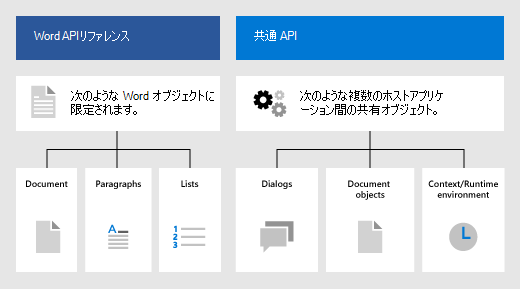

# Office アドインの Word JavaScript オブジェクト モデル

この記事では、[Word JavaScript API](../reference/overview/word-add-ins-reference-overview.md) を使用してアドインを構築する場合の基本的な概念について説明します。

> [!IMPORTANT]
> Word API の非同期性と、ドキュメントでの動作方法については、「[アプリケーション固有の API モデルの使用](../develop/application-specific-api-model.md)」を参照してください。

## Word 用の Office.js API

Word アドインは、Office JavaScript API を使用して、Word のオブジェクトを操作します。これには次の 2 つの JavaScript オブジェクト モデルが含まれています。

* **Word JavaScript API**: [Word JavaScript API](/javascript/api/word) には、ドキュメント、範囲、テーブル、リスト、フォーマットなどを操作する厳密に型指定されたオブジェクトが用意されています。

* **共通 API**: [共通 API](/javascript/api/office) では、UI、ダイアログ、クライアント設定など、複数のタイプの Office アプリケーションに共通の機能にアクセスできます。

Word を対象にしたアドインでは、機能の大部分を Word JavaScript API を使用して開発する可能性がありますが、共通 API のオブジェクトも使用します。次に例を示します。

* [Office.Context](/javascript/api/office/office.context): `Context` オブジェクトは、アドインのランタイム環境を表し、API のキー オブジェクトへのアクセスを提供します。`contentLanguage` や `officeTheme` などのドキュメント構成の詳細で構成され、`host` や `platform`などのアドインのランタイム環境に関する情報も提供されます。さらに、`requirements.isSetSupported()` メソッドを提供します。このメソッドを使用して、アドインが実行されている Word アプリケーションで指定された要件セットがサポートされているかどうかを確認できます。
* [Office.Document](/javascript/api/office/office.document): `Office.Document` オブジェクトは `getFileAsync()` メソッドを提供します。これを使用すると、アドインが実行されている Word ファイルをダウンロードできます。これは、[Word.Document](/javascript/api/word/word.document) オブジェクトとは別のものです。

## Word 固有のオブジェクト モデル

Word API について理解するには、ドキュメントの構成要素が互いにどのように関連しているかを理解する必要があります。

* **ドキュメント** には **セクション** と、設定やカスタム XML パーツなどのドキュメントレベルのエンティティが含まれます。
* **セクション** には **本文** が含まれます。
* **本文** は、特に **パラグラフ**、**ContentControl**、および **範囲** オブジェクトへのアクセスを提供します。
* **範囲** は、テキスト、空白、**テーブル**、画像など、コンテンツの連続した領域を表します。 また、テキストの操作方法のほとんどが含まれます。
* **リスト** は、番号付きまたは箇条書きのリスト内のテキストを表します。

## 関連項目

* [Word JavaScript API の概要](../reference/overview/word-add-ins-reference-overview.md)
* [最初の Word アドインをビルドする](../quickstarts/word-quickstart.md)
* [Word アドインのチュートリアル](../tutorials/word-tutorial.md)
* [Word JavaScript API リファレンス](/javascript/api/word)
* [Microsoft 365 開発者プログラムについて](https://developer.microsoft.com/microsoft-365/dev-program)
