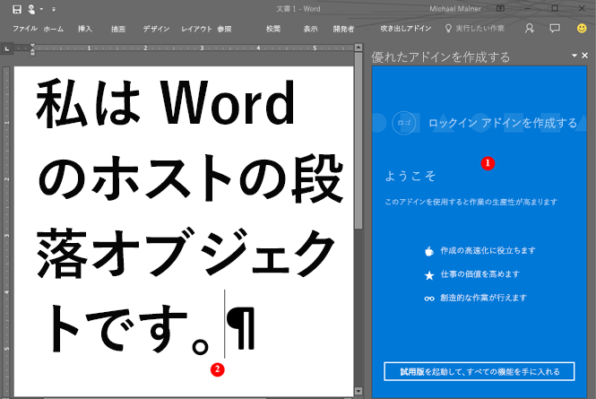

# <a name="word-add-ins-overview"></a>Word アドインの概要

Word の機能を拡張するソリューション (たとえば、ドキュメントの自動アセンブリや、他のデータ ソースからの Word 文書のデータへのバインドやアクセスを可能にするソリューション) を作成したい場合は、Word JavaScript API と Office JavaScript API を含む Office アドイン プラットフォームを使用して、Windows デスクトップ、Mac、またはクラウドで実行する Word クライアントを拡張できます。

Word のアドインは、[Office アドイン プラットフォーム](../overview/office-add-ins.md)にある数多くの開発オプションのひとつです。アドイン コマンドを使用して、Word の UI を拡張したり、Word 文書のコンテンツと対話する JavaScript を実行する作業ウィンドウを起動したりすることができます。ブラウザーで実行できるあらゆるコードは、Word アドインで実行できます。Word 文書のコンテンツと対話するアドインは、Word オブジェクトを操作し、オブジェクトの状態を同期する要求を作成します。

[!INCLUDE [publish policies note](../includes/note-publish-policies.md)]

次の図は、作業ウィンドウで実行される Word アドインの例を示します。

*図 1. Word の作業ウィンドウで実行されているアドイン*



Word アドイン (1) は、Word 文書 (2) に要求を送信し、JavaScript を使用して段落オブジェクトにアクセスして段落を更新、削除、または移動することができます。たとえば、次のコードは、その段落に新しい文を追加する方法を示しています。

```js
Word.run(function (context) {
    var paragraphs = context.document.getSelection().paragraphs;
    paragraphs.load();
    return context.sync().then(function () {
        paragraphs.items[0].insertText(' New sentence in the paragraph.',
                                       Word.InsertLocation.end);
    }).then(context.sync);
});

```

ASP.NET、NodeJS、Python などの任意の Web サーバー テクノロジを使用して、Word アドインをホストさせることができます。お気に入りのクライアント側のフレームワーク (Ember、Backbone、Angular、React) を使用するか VanillaJS を引き続き使用してソリューションを開発し、Azure のようなサービスを使用してアプリケーションを[認証](../develop/overview-authn-authz.md)し、ホストできます。

Word JavaScript API を使用すると、アプリケーションから Word 文書内にあるオブジェクトやメタデータにアクセスできます。これらの API を使用して、以下をターゲットとするアドインを作成できます。

* Windows での Word 2013 以降
* Word on the web
* Mac on Word 2016 以降
* Word on iPad

アドインを 1 回作成すれば、それをプラットフォームの異なるすべてのバージョンの Word で実行できます。詳細については、「[Office アドインの Office クライアント アプリケーションとプラットフォームの可用性](../overview/office-add-in-availability.md)」を参照してください。

## <a name="javascript-apis-for-word"></a>Word 用 JavaScript API

2 セットの JavaScript API を使用して、Word 文書のオブジェクトおよびメタデータと対話できます。 1 つ目は、Office 2013 で導入された[共通 API](/javascript/api/office) です。 2 つ以上の Office クライアントでホストされているアドインで、共通 API の多くのオブジェクトを使用することができます。 この API は、広範囲にわたってコールバックを使用します。

2 つ目は、[Word JavaScript API](/javascript/api/word) です。これは、Word 2016 で導入された [アプリケーション固有の API モデル](../develop/application-specific-api-model.md) で、Mac と Windows の Word 2016 を対象とする Word アドインを作成するために使用できる、厳密に型指定されたオブジェクト モデルです。このオブジェクト モデルは Promise を使用し、[本文](/javascript/api/word/word.body)、[コンテンツ コントロール](/javascript/api/word/word.contentcontrol)、[インライン画像](/javascript/api/word/word.inlinepicture)、および [段落](/javascript/api/word/word.paragraph)などの Word 固有のオブジェクトへのアクセスを提供します。Word JavaScript API には、IDE 内のコード ヒントを取得できるように、TypeScript の定義と vsdoc ファイルが含まれています。

現在、Word のすべてのクライアントは共有の Office JavaScript API をサポートし、ほとんどのクライアントは Word JavaScript API をサポートします。 サポートされているクライアントの詳細については、「[Office アドインの Office クライアント アプリケーションとプラットフォームの可用性](../overview/office-add-in-availability.md)」を参照してください。

Word JavaScript API のオブジェクト モデルはより簡単に使用できるため、Word JavaScript APから始めることをお勧めします。次のような必要がある場合は、Word JavaScript API を使用します。

* Word 文書内のオブジェクトにアクセスする。

次のような必要がある場合は、共有の Office JavaScript API を使用します。

* Word 2013 を対象とする。
* アプリケーションの初期アクションを実行する。
* サポートされている要件セットを確認する。
* メタデータ、設定、およびドキュメントの環境情報にアクセスする。
* ドキュメント内のセクションにバインドし、イベントをキャプチャする。
* カスタム XML パーツを使用する。
* ダイアログ ボックスを開く。

## <a name="next-steps"></a>次の手順

最初の Word アドインを作成する準備ができたら「[最初の Word アドインをビルドする](word-add-ins.md)」を参照してください。[アドインのマニフェスト](../develop/add-in-manifests.md) を使用して、アドインがホストされている場所や表示方法の説明、アクセス許可およびその他の情報の定義を行います。

ユーザーにとって魅力的なエクスペリエンスを提供する世界クラスの Word アドインを設計する方法の詳細については、「[設計のガイドライン](../design/add-in-design.md)」と「[ベスト プラクティス](../concepts/add-in-development-best-practices.md)」を参照してください。

アドインを作成したら、ネットワーク共有、アプリ カタログ、または AppSource に[発行](../publish/publish.md)できます。

## <a name="see-also"></a>関連項目

* [Office アドインを構築する](../overview/office-add-ins-fundamentals.md)
* [Office アドイン プラットフォームの概要](../overview/office-add-ins.md)
* [Word JavaScript API リファレンス](../reference/overview/word-add-ins-reference-overview.md)
